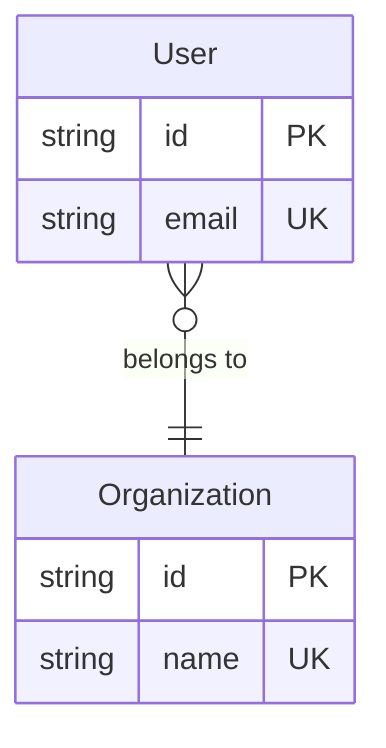

# コンサルティングプロジェクトダッシュボード

## アプリケーション概要

コンサルティングファームが複数のクライアントプロジェクトを効率的に管理・監視するための統合ダッシュボードシステム。プロジェクトの進捗状況、リソース配分、財務状況を一元的に可視化し、意思決定を支援する。

## アーキテクチャスタック

- **フロントエンド**: Next.js 15.1.0 (App Router), React 19.0, TypeScript 5.7, Tailwind CSS 3.4.1
- **UI コンポーネント**: shadcn/ui (MCP経由)
- **バックエンド**: Next.js Server Actions
- **データベース**: SQLite (ファイルベースDB)
- **ORM**: Prisma 6.0
- **バリデーション**: Zod (スキーマベースバリデーション)
- **フォーム管理**: React Hook Form (Zod連携)

## プロジェクトディレクトリ構造

### ⚠️ 重要: 二重ディレクトリの絶対禁止

**プロジェクトルートは1つのみです:**
```
/Users/hmoriya/Develop/github/github.com/hmoriya/consultingTool/consulting-dashboard-new/
```

**絶対に作成してはいけない二重ディレクトリ:**
```
❌ consulting-dashboard-new/consulting-dashboard-new/
❌ consulting-dashboard-new/consulting-dashboard-new/lib/
❌ consulting-dashboard-new/consulting-dashboard-new/docs/
```

### 正しいディレクトリ構造

```
consulting-dashboard-new/
├── app/                      # Next.js App Router
│   ├── api/                 # APIルート
│   │   └── parasol/        # パラソル関連API
│   ├── components/         # コンポーネント
│   └── ...
├── lib/                     # ライブラリ・ユーティリティ
│   └── parasol/
│       └── parsers/        # パラソルパーサー（4つ）
│           ├── domain-language-parser.ts
│           ├── api-specification-parser.ts
│           ├── database-design-parser.ts
│           └── integration-specification-parser.ts
├── docs/                    # ドキュメント
│   └── parasol/
│       ├── templates/      # ドキュメントテンプレート
│       └── services/       # サービス別ドキュメント
│           └── secure-access-service/
│               ├── service.md
│               ├── domain-language.md
│               ├── api-specification.md
│               ├── database-design.md
│               ├── integration-specification.md
│               └── capabilities/
├── prisma/                  # Prismaスキーマとデータベース
│   ├── auth-service/
│   ├── project-service/
│   ├── parasol-service/
│   └── ...
└── ...
```

### ファイル作成時の注意事項

**新しいファイルを作成する際は、必ず以下を確認してください:**

1. **現在のディレクトリを確認**: `pwd`で現在地を確認
2. **正しい場所を指定**: プロジェクトルートからの相対パスを使用
3. **二重作成の防止**: `consulting-dashboard-new/consulting-dashboard-new/`とならないよう注意

**例（正しい作成方法）:**
```bash
# 現在地確認
pwd
# => /Users/.../consulting-dashboard-new

# ファイル作成（プロジェクトルートから）
touch lib/parasol/parsers/new-parser.ts
touch docs/parasol/services/new-service/api-specification.md
```

**例（間違った作成方法）:**
```bash
# ❌ 二重ディレクトリを作ってしまう例
touch consulting-dashboard-new/lib/parasol/parsers/new-parser.ts
# これは /consulting-dashboard-new/consulting-dashboard-new/lib/... になる
```

## データベース構成

### 重要: DBファイルの配置ルール

**⚠️ 警告: 重複は絶対に許可されません！**

**正式なDBファイルの配置場所（これ以外の場所にDBファイルを作成しないでください）:**

以下の**8つのデータベースのみ**が存在を許可されています：

1. **認証サービスデータベース**
   - **正式パス**: `prisma/auth-service/data/auth.db`
   - **環境変数**: `AUTH_DATABASE_URL="file:./prisma/auth-service/data/auth.db"`
   - **用途**: ユーザー認証、ロール管理、組織情報、監査ログ

2. **プロジェクトサービスデータベース**
   - **正式パス**: `prisma/project-service/data/project.db`
   - **環境変数**: `PROJECT_DATABASE_URL="file:./prisma/project-service/data/project.db"`
   - **用途**: プロジェクト、タスク、マイルストーン、プロジェクトメンバー、リスク管理

3. **リソースサービスデータベース**
   - **正式パス**: `prisma/resource-service/data/resource.db`
   - **環境変数**: `RESOURCE_DATABASE_URL="file:./prisma/resource-service/data/resource.db"`
   - **用途**: チーム管理、スキル管理、リソース配分

4. **タイムシートサービスデータベース**
   - **正式パス**: `prisma/timesheet-service/data/timesheet.db`
   - **環境変数**: `TIMESHEET_DATABASE_URL="file:./prisma/timesheet-service/data/timesheet.db"`
   - **用途**: 工数管理、承認フロー

5. **通知サービスデータベース**
   - **正式パス**: `prisma/notification-service/data/notification.db`
   - **環境変数**: `NOTIFICATION_DATABASE_URL="file:./prisma/notification-service/data/notification.db"`
   - **用途**: 通知、メッセージ、アラート

6. **ナレッジサービスデータベース**
   - **正式パス**: `prisma/knowledge-service/data/knowledge.db`
   - **環境変数**: `KNOWLEDGE_DATABASE_URL="file:./prisma/knowledge-service/data/knowledge.db"`
   - **用途**: ナレッジ記事、タグ、カテゴリ

7. **財務サービスデータベース**
   - **正式パス**: `prisma/finance-service/data/finance.db`
   - **環境変数**: `FINANCE_DATABASE_URL="file:./prisma/finance-service/data/finance.db"`
   - **用途**: 収益管理、コスト管理、予算管理

8. **パラソルサービスデータベース**
   - **正式パス**: `prisma/parasol-service/data/parasol.db`
   - **環境変数**: `PARASOL_DATABASE_URL="file:./prisma/parasol-service/data/parasol.db"`
   - **用途**: パラソル設計ドキュメント管理、ドメイン言語定義

### 重複チェックコマンド

定期的に以下のコマンドで重複がないことを確認してください：

```bash
# データベースファイル一覧を表示（8つのみであることを確認）
find prisma -name "*.db" -type f | grep -v node_modules | sort

# 期待される出力（8行のみ）:
# prisma/auth-service/data/auth.db
# prisma/finance-service/data/finance.db
# prisma/knowledge-service/data/knowledge.db
# prisma/notification-service/data/notification.db
# prisma/parasol-service/data/parasol.db
# prisma/project-service/data/project.db
# prisma/resource-service/data/resource.db
# prisma/timesheet-service/data/timesheet.db
```

### 重複が見つかった場合の削除手順

もし重複ディレクトリ（`prisma/*/prisma/`パターン）が見つかった場合は即座に削除：

```bash
# 重複ディレクトリの検出
find prisma -type d -name "prisma" | grep -v node_modules

# 重複ディレクトリの削除（見つかった場合のみ）
rm -rf prisma/*/prisma/
```

### DBファイル作成時の厳格なルール

- ✅ **許可**: `prisma/[service-name]/data/[service].db` の形式のみ
- ❌ **禁止**: `prisma/[service-name]/prisma/` のようなネストされた構造
- ❌ **禁止**: `prisma/dev.db` のようなルート直下のDB
- ❌ **禁止**: 上記8つ以外のデータベースファイル

### 重複防止のベストプラクティス

1. Prismaのmigrationやdb pushは**必ず正しいディレクトリから実行**
2. 環境変数は**絶対に相対パスで設定**（例: `file:./prisma/auth-service/data/auth.db`）
3. 新サービス追加時は**この8つのリストを更新**
4. **週次で重複チェックコマンドを実行**

## 環境変数の設定

### 初期セットアップ

プロジェクトを新規にクローンした場合や、`.env`ファイルが存在しない場合は、以下の手順で環境変数を設定してください：

```bash
# consulting-dashboard-newディレクトリに移動
cd consulting-dashboard-new

# .env.exampleから.envファイルを複製
cp .env.example .env

# 必要に応じて.envファイルを編集
# デフォルト設定のままでもプロトタイプ開発は可能です
```

### .envファイルの内容

`.env`ファイルには以下の環境変数が設定されています（プロトタイプ用のデフォルト値で動作します）：

- `DATABASE_URL`: メインデータベース
- `CORE_DATABASE_URL`: コアサービスDB
- `PROJECT_DATABASE_URL`: プロジェクトサービスDB
- `RESOURCE_DATABASE_URL`: リソースサービスDB
- `TIMESHEET_DATABASE_URL`: タイムシートサービスDB
- `NOTIFICATION_DATABASE_URL`: 通知サービスDB
- `JWT_SECRET`: JWT認証用シークレット
- `NEXTAUTH_SECRET`: NextAuth認証用シークレット
- `NEXTAUTH_URL`: NextAuthのベースURL

**注意**: 本番環境では必ずシークレットキーを安全な値に変更してください。

## 主要ユースケース

### 0. ０リリース

- ログイン、トップページの表示のみ

### 1. エグゼクティブ向け

- 全社のプロジェクトポートフォリオを俯瞰
- 収益性分析とリソース最適化

### 2. プロジェクトマネージャー向け

- プロジェクト進捗管理とチーム管理
- リスク管理と成果物管理

### 3. コンサルタント向け

- 個人タスク管理と工数入力
- ナレッジ共有

### 4. クライアント向け

- プロジェクト進捗確認
- 成果物レビューとコミュニケーション

## ナビゲーションシステム仕様

- **ヘッダー**: 固定配置、高さ64px、アカウントセクション含む
- **サイドバー**: 折りたたみ可能、幅256px（展開時）/64px（折りたたみ時）
- **レスポンシブ対応**: モバイル時はドロワー形式

## 基本的なUI構成

### ヘッダー

- ロゴ/ブランド（左側）
- ユーザープロファイルアイコン（右側）
  - プロファイル編集、設定、ログアウト
- ログインボタン（未ログイン時）

### サイドメニュー

- ハンバーガーアイコンで開閉可能
- メニュー項目（ロール別に動的変更）:
  - ダッシュボード
  - プロジェクト一覧
  - レポート
  - 設定
  - ヘルプ

## 認証とロール管理

- **認証方式**: メールアドレス/パスワード、MFA対応
- **ロール**: Executive, PM, Consultant, Client, Admin
- **アクセス制御**: ロールベースアクセス制御（RBAC）

## データベースの初期化とシード

### 初期セットアップ手順

```bash
# 1. データベーススキーマを作成
npm run db:push

# 2. テストデータを投入
npm run db:seed

# または、リセットして最初から実行
npm run db:reset
```

### シードデータ構成

プロジェクトはマイクロサービス構成に対応したシード構造を採用しています：

```
prisma/
├── seed.ts                    # メインシードスクリプト
└── seeds/                     # サービス毎のシードファイル
    ├── core-seed.ts          # コアサービス（ユーザー、組織、ロール）
    ├── project-seed.ts       # プロジェクトサービス（プロジェクト、タスク）
    ├── resource-seed.ts      # リソースサービス（チーム、スキル）
    ├── timesheet-seed.ts     # タイムシートサービス（工数データ）
    └── notification-seed.ts  # 通知サービス（通知、メッセージ）
```

### 利用可能なコマンド

- `npm run db:seed` - すべてのサービスのシードを実行
- `npm run db:seed:core` - コアサービスのみシード実行
- `npm run db:reset` - DBを削除して再作成＆シード

### テストユーザー

シード実行後、以下のテストユーザーが利用可能です：

- **exec@example.com** / password123 (Executive)
- **pm@example.com** / password123 (PM)
- **consultant@example.com** / password123 (Consultant)
- **client@example.com** / password123 (Client)

## 設計書 designディレクトリに配置複数あるものは、ディレクトリを作成 更新日をそれぞれ記載

- プロジェクト定義
- ビジネスケーパビリティ定義
- ユースケース（ビジネスケーパビリティをブレークダウンしてユースケースを生成）
- ロバストネス図
- API定義
- UI定義
- ドメイン言語モデル（MD形式）
- DB定義
- 受け入れテスト
- 単体テスト
- イテレーション計画

## Git開発フローとissue管理

### 標準的な開発フロー

開発を行う際は、以下のGitフローに従ってください：

#### 1. Issue作成
```
Issue #31: ヘルプドキュメントの記述レベル向上
```

##### Issueテンプレートの活用

プロジェクトには以下のissueテンプレートが用意されています：

- **bug_report.md**: バグ報告用
  - 現象、再現手順、期待動作、環境情報を記載
- **feature_request.md**: 機能追加要望用
  - 背景、提案内容、代替案を記載
- **enhancement.md**: 既存機能の改善提案用
  - 改善対象、理由、影響範囲を記載
- **documentation.md**: ドキュメント関連
  - 対象ドキュメント、問題点、改善案を記載
- **question.md**: 質問用
  - 質問内容と背景情報を記載

GitHubでissueを作成する際は、適切なテンプレートを選択することで、必要な情報を漏れなく記載できます。

#### 2. ブランチ作成
issue番号を含めたブランチ名を使用：
```bash
# 推奨フォーマット
git checkout -b feature/31-improve-help-docs
git checkout -b bugfix/42-login-error
git checkout -b hotfix/55-security-patch
git checkout -b docs/67-api-documentation

# 避けるべき例
git checkout -b feature/new-feature  # issue番号なし
git checkout -b 31                   # 説明なし
```

#### 3. コミット
各コミットにissue番号を含める：
```bash
# 基本フォーマット
git commit -m "feat: 機能の説明 (#31)"
git commit -m "fix: バグの修正内容 (#42)"
git commit -m "docs: ドキュメント更新 (#67)"

# 詳細な例
git commit -m "feat: ヘルプシステムに詳細ステップビューを追加 (#31)"
git commit -m "test: ヘルプページのE2Eテスト追加 (#31)"
git commit -m "refactor: 詳細情報の型定義を整理 (#31)"
```

#### 4. プルリクエスト
PRタイトルと本文にissue番号を含める：
```markdown
# PRタイトル
feat: ヘルプシステムの詳細情報機能を追加 (#31)

# PR本文
## 概要
Issue #31 の対応です。

## 変更内容
- 詳細ステップビューコンポーネントを追加
- 全12ユースケースに詳細情報を追加
- 代替手段の表示機能を実装

## 関連Issue
Closes #31  # これによりマージ時に自動的にissueがクローズされます

## スクリーンショット
[必要に応じて画像を添付]

## レビューポイント
- UIの使いやすさ
- 情報の網羅性
```

### issue番号を入れる場所

| 場所 | 例 | 必須度 | 目的 |
|------|-----|---------|------|
| **ブランチ名** | `feature/31-help-docs` | ◎推奨 | 作業内容の明確化 |
| **コミットメッセージ** | `feat: 機能追加 (#31)` | ◎推奨 | 変更履歴の追跡 |
| **PRタイトル** | `新機能追加 (#31)` | ○任意 | 一覧での識別 |
| **PR本文** | `Closes #31` | ◎必須 | 自動クローズ、関連付け |

### 自動クローズのキーワード

PR本文で以下のキーワードを使うと、マージ時にissueが自動的にクローズされます：
- `Close #31` / `Closes #31`
- `Fix #31` / `Fixes #31` 
- `Resolve #31` / `Resolves #31`

複数issueの場合：
```markdown
Closes #31, #32
```

### なぜissue番号が重要か

1. **トレーサビリティ**: 変更の理由と背景が明確になる
2. **プロジェクト管理**: issueとコードの関連を自動追跡
3. **コラボレーション**: チームメンバーが文脈を理解しやすい
4. **自動化**: issue自動クローズ、プロジェクトボード連携
5. **レビュー効率化**: レビュアーが背景を把握しやすい

### コミットメッセージテンプレート

現在、Gitのコミットメッセージテンプレート（`.gitmessage`）は設定されていませんが、以下のフォーマットを推奨します：

#### 推奨フォーマット
```
<type>: <summary> (#<issue-number>)

<body>

<footer>
```

#### タイプの種類
- `feat`: 新機能の追加
- `fix`: バグ修正
- `docs`: ドキュメントのみの変更
- `style`: コードの意味に影響しない変更（フォーマット等）
- `refactor`: バグ修正でも機能追加でもないコード変更
- `perf`: パフォーマンス改善
- `test`: テストの追加・修正
- `chore`: ビルドプロセスやツールの変更

#### コミットメッセージの例
```bash
# 機能追加
git commit -m "feat: ヘルプシステムに詳細ステップビューを追加 (#31)"

# バグ修正
git commit -m "fix: ログイン時のロール判定エラーを修正 (#42)"

# リファクタリング
git commit -m "refactor: 認証ロジックを共通関数に統合 (#55)"

# ドキュメント
git commit -m "docs: Git開発フローを追加 (#67)"
```

#### コミットメッセージテンプレートの設定方法

プロジェクトでコミットメッセージのテンプレートを使用したい場合：

1. `.gitmessage`ファイルを作成：
```bash
# プロジェクトルートに.gitmessageファイルを作成
cat > .gitmessage << 'EOF'
# <type>: <summary> (#<issue-number>)
# 
# <body>
# 
# <footer>
# 
# Type can be:
#   feat    : new feature
#   fix     : bug fix
#   docs    : documentation only
#   style   : formatting, no code change
#   refactor: refactoring code
#   perf    : performance improvement
#   test    : adding tests
#   chore   : updating build tasks etc
EOF
```

2. Gitに設定：
```bash
# プロジェクト専用の設定
git config commit.template .gitmessage

# またはグローバル設定
git config --global commit.template ~/.gitmessage
```

## ビジネスオペレーションとユースケースの階層構造

### 概念の違いと階層関係

パラソルフレームワークでは、以下の階層構造で設計を整理します：

1. **サービス** (Service)
2. **ビジネスケーパビリティ** (Business Capability) - 「XXXする能力」
3. **ビジネスオペレーション** (Business Operation) - ハイレベルユースケース
4. **ユースケース** (Use Case) - 詳細ユースケース
5. **ロバストネス図** (Robustness Diagram) - BCE要素の定義 (**NEW**)
6. **ページ定義** (Page Definition) - UI/UX定義
7. **テスト定義** (Test Definition) - テストケース定義

### 完全な階層構造図
```
サービス
└── ビジネスケーパビリティ（複数）
    └── ビジネスオペレーション群（ケーパビリティに関連）
        └── ユースケース群（オペレーションを実現）
            ├── ロバストネス図（ユースケース毎に1対1）
            ├── ページ定義群
            └── テスト定義群
```

### ディレクトリ構造
```
docs/parasol/services/[service-name]/
└── capabilities/
    └── [capability-name]/
        └── operations/
            └── [operation-name]/
                ├── operation.md                    # ビジネスオペレーション定義
                ├── usecases/                       # ユースケース群
                │   ├── [usecase-1-name]/
                │   │   ├── usecase.md             # ユースケース定義
                │   │   ├── robustness.md          # ロバストネス図（NEW）
                │   │   └── pages/                 # ページ定義群
                │   │       ├── [page-1-name].md
                │   │       └── [page-2-name].md
                │   └── [usecase-2-name]/
                │       ├── usecase.md
                │       ├── robustness.md          # ロバストネス図（NEW）
                │       └── pages/
                │           └── [page-3-name].md
                └── tests/                          # テスト定義群（オプション）
                    ├── [test-1-name].md
                    └── [test-2-name].md
```

### ビジネスオペレーション（ハイレベルユースケース）

ビジネスオペレーションは、**ビジネス価値を生み出す一連の活動**を表現します。

#### 特徴
- **ビジネス成果にフォーカス**（技術的な詳細ではない）
- **複数のアクターが協調**して価値を生み出す
- **開始から完了まで**の明確なゴールがある
- **測定可能なビジネス価値**を生む

#### 例
| ビジネスオペレーション | 説明 |
|----------------------|------|
| 顧客オンボーディング | 新規顧客を獲得し、サービス利用開始まで導く一連の活動 |
| 商品企画・投入 | 市場ニーズを捉えた商品を企画し、市場に投入するまでの活動 |
| 問題解決・改善提案 | 顧客の課題を分析し、解決策を提案・実行する活動 |
| リスク評価・対策立案 | プロジェクトリスクを評価し、対策を立案・実行する活動 |

### ユースケース（詳細ユースケース）

ユースケースは、ビジネスオペレーションを**具体的なシステム利用シナリオ**に分解したものです。

#### 特徴
- **特定のアクターの視点**で記述
- **システムとの相互作用**を詳細に定義
- **前提条件と事後条件**が明確
- **基本フロー・代替フロー・例外フロー**を含む
- **各フローをMermaid図で可視化**（重要）

#### フロー定義の仕様

ユースケースのフローは、テキストによる説明とMermaid図の両方で表現します。

##### 1. 基本フロー
正常系のシナリオをステップバイステップで記述し、Mermaid図で可視化します。

**Markdown形式**:
```markdown
### 基本フロー

\`\`\`mermaid
graph TD
    A[開始] --> B[ステップ1]
    B --> C[ステップ2]
    C --> D[ステップ3]
    D --> E[完了]
\`\`\`

1. [アクター]が[アクション]を実行する
2. システムが[処理]を行う
3. システムが[結果]を表示する
```

##### 2. 代替フロー
条件分岐による別シナリオを記述し、分岐ロジックをMermaid図で可視化します。

**Markdown形式**:
```markdown
### 代替フロー1: [条件の説明]

\`\`\`mermaid
graph TD
    A[分岐点] --> B{条件判定}
    B -->|条件A| C[代替処理]
    B -->|条件B| D[基本フロー続行]
    C --> E[基本フローに復帰]
\`\`\`

- **分岐点**: 基本フロー ステップX
- **条件**: [分岐条件の詳細]

1. システムが[条件]を検知する
2. システムが[代替処理]を実行する
3. 基本フロー ステップYに進む
```

##### 3. 例外フロー
エラーや例外処理のシナリオを記述し、エラーハンドリングをMermaid図で可視化します。

**Markdown形式**:
```markdown
### 例外フロー1: [エラー条件の説明]

\`\`\`mermaid
graph TD
    A[エラー発生点] --> B{エラー種別}
    B -->|回復可能| C[エラーメッセージ表示]
    B -->|回復不可| D[システムエラー]
    C --> E[再試行]
    D --> F[ユースケース終了]
\`\`\`

- **発生点**: 基本フロー ステップX
- **条件**: [エラー発生条件]

1. システムが[エラー]を検知する
2. システムが[エラーメッセージ]を表示する
3. [対処方法]
```

#### フロー記述のベストプラクティス

1. **各フローに対応するMermaid図を必ず作成**
   - 基本フロー、代替フロー、例外フローのそれぞれに図を用意
   - 図とテキストの内容が一致していること

2. **Mermaid図は簡潔に**
   - 主要なステップのみを図示（詳細はテキストで補足）
   - 複雑な場合は複数の図に分割

3. **条件分岐は明確に**
   - 菱形（`{}`）を使用して判定ポイントを表現
   - 分岐の条件をラベルで明記

4. **テキストとの対応**
   - Mermaid図のノード名とテキストのステップを対応させる
   - 「ステップX」として参照できるようにする

#### 例：「顧客オンボーディング」を分解すると

1. **アカウント作成** (ユースケース)
   - アクター：新規顧客
   - 前提条件：メールアドレスを持っている
   - 基本フロー：情報入力→検証→アカウント生成
   - 代替フロー：既存アカウントの場合の処理
   - Mermaid図：基本フロー、代替フロー（既存アカウント）、例外フロー（検証エラー）

2. **本人確認実施** (ユースケース)
   - アクター：新規顧客、コンプライアンス担当
   - 前提条件：アカウントが作成済み
   - 基本フロー：書類アップロード→審査→承認/却下
   - Mermaid図：基本フロー、代替フロー（書類不備）、例外フロー（審査タイムアウト）

3. **初期設定支援** (ユースケース)
   - アクター：新規顧客、カスタマーサポート
   - 前提条件：本人確認完了
   - 基本フロー：設定ガイド表示→設定実行→完了確認
   - Mermaid図：基本フロー、代替フロー（カスタマイズ設定）

### 判断基準

| 観点 | ビジネスオペレーション | ユースケース |
|------|---------------------|-------------|
| **スコープ** | ビジネスプロセス全体 | 単一のシステム操作 |
| **アクター** | 複数（顧客、スタッフ、システム） | 主に1〜2名 |
| **期間** | 数日〜数週間 | 数分〜数時間 |
| **成果** | ビジネス価値（売上、顧客満足度） | タスク完了 |
| **記述レベル** | What（何を達成するか） | How（どう実現するか） |

### パターン分類

ビジネスオペレーションは以下のパターンに分類されます：

- **CRUD**: 基本的なデータ管理（作成・参照・更新・削除）
- **Workflow**: 複数ステップの承認・処理フロー
- **Analytics**: 分析・レポーティング・意思決定支援
- **Communication**: コミュニケーション・コラボレーション
- **Administration**: システム管理・設定・メンテナンス

## ビジネスオペレーション命名規則

### 基本フォーマット

ビジネスオペレーションの名前は「**動詞＋目的語＋（成果）**」の形式を推奨します。

#### 命名の原則

1. **アクション指向**：何をするかを明確に示す動詞で始める
2. **成果を明示**：可能な限りビジネス成果を含める
3. **エンドツーエンド**：プロセス全体を表現する
4. **測定可能**：成功条件が想像できる名前にする

#### パターン別の命名例

| パターン | ❌ 避けるべき名前 | ✅ 推奨される名前 | 理由 |
|---------|-----------------|----------------|------|
| **CRUD** | 顧客データ管理 | 顧客情報を正確に維持する | データの品質と目的を明確化 |
| | 商品マスタ更新 | 商品情報を最新化し市場投入する | ビジネス目的（市場投入）を含める |
| **Workflow** | 承認処理 | 提案を評価し意思決定する | 承認の目的と成果を表現 |
| | 申請ワークフロー | 申請から承認まで完遂する | プロセス全体を表現 |
| **Analytics** | レポート作成 | 経営指標を分析し改善策を立案する | 分析の目的と成果を明示 |
| | データ分析 | 顧客行動を分析し施策を最適化する | 具体的な対象と目的を含む |
| **Communication** | メッセージ送信 | 顧客と対話し関係を構築する | コミュニケーションの目的を表現 |
| | 通知処理 | 重要情報をタイムリーに伝達する | 価値（タイムリー性）を含む |
| **Administration** | システム設定 | システムを最適に構成し運用する | 設定の目的（最適運用）を明示 |
| | ユーザー管理 | 利用者の権限を適切に制御する | 管理の目的（セキュリティ）を表現 |

#### 動詞の選び方

**価値創造的な動詞を使用**：
- ✅ 推進する、実現する、構築する、最適化する、強化する
- ✅ 獲得する、創出する、変革する、促進する、確立する
- ❌ 管理する、処理する、登録する、更新する（単純作業的）

#### 具体例

**プロジェクト管理サービスの場合**：
- ❌ プロジェクト登録
- ✅ プロジェクトを立ち上げ成功に導く

**財務サービスの場合**：
- ❌ 請求書発行
- ✅ 価値提供に基づき収益を確保する

**リソース管理サービスの場合**：
- ❌ メンバーアサイン
- ✅ 最適なチームを編成し成果を最大化する

### 命名時のチェックリスト

- [ ] 動詞で始まっているか？
- [ ] ビジネス価値や成果が含まれているか？
- [ ] プロセス全体を表現しているか？
- [ ] 「管理」「処理」などの単純な動詞を避けているか？
- [ ] 5W1H（誰が、何を、いつ、どこで、なぜ、どのように）の「なぜ」が想像できるか？

## ビジネスケーパビリティ命名規則

### 重要な命名ルール

ビジネスケーパビリティの名前には「XXX管理」という形式を**絶対に使用しない**でください。

#### 禁止される理由
1. **CRUD思考の助長**: 「管理」という言葉は単純なCRUD操作を連想させ、ビジネス価値を表現しない
2. **DXの阻害**: デジタルトランスフォーメーションは業務プロセスの変革であり、単なる「管理」では変革を表現できない
3. **ビジネス価値の不明確化**: 「管理」では具体的にどのような価値を提供するのかが不明確

#### 推奨される命名パターン
ビジネスケーパビリティは「**XXXする能力**」という形式で表現することを強く推奨します：

| ❌ 避けるべき名前 | ✅ 推奨される名前 | 説明 |
|-----------------|----------------|------|
| 顧客管理 | 顧客エンゲージメントを強化する能力 | 顧客との関係構築という価値を明確に表現 |
| 在庫管理 | 在庫を最適化する能力 | 在庫を最適な状態に保つ能動的な能力を表現 |
| 注文管理 | 注文を完遂する能力 | 注文を最後まで遂行する能力を表現 |
| 人事管理 | タレントを獲得・育成する能力 | 人材の価値創造プロセスを表現 |
| 商品管理 | 商品を企画・開発する能力 | 商品を生み出す創造的プロセスを表現 |
| 売上管理 | 売上を最大化する能力 | 売上向上という成果にフォーカス |
| 品質管理 | 品質を保証する能力 | 品質を担保する責任と能力を表現 |

#### ケーパビリティ命名のベストプラクティス
1. **必ず「〜する能力」で終わる**形式にする
2. **動詞は能動的**なものを使用（最適化する、強化する、創出する、実現する等）
3. **ビジネス成果**にフォーカスした動詞を選択
4. **顧客価値**や**競争優位性**を意識した表現にする
5. 単なる作業ではなく**価値創造活動**として表現する

## 動作確認

- 起動しているサーバをKillして新たにサーバーを起動
- ソースコード修正後は、Playwrite mcpでログインと動作確認をする
- ソースコード修正後は、設計書と相違がないか確認

## Playwright MCP使用ルール

### 絶対的な禁止事項

1. **いかなる形式のコード実行も禁止**

   - Python、JavaScript、Bash等でのブラウザ操作
   - MCPツールを調査するためのコード実行
   - subprocessやコマンド実行によるアプローチ

2. **利用可能なのはMCPツールの直接呼び出しのみ**

   - playwright:browser_navigate
   - playwright:browser_screenshot
   - 他のPlaywright MCPツール

3. **エラー時は即座に報告**
   - 回避策を探さない
   - 代替手段を実行しない
   - エラーメッセージをそのまま伝える

## パラソル開発手法

### パラソル設計の基本原則

パラソル開発では、**設計MDを生成し、API経由でパラソルサービスにポストする**ことで、設計内容をデータベースに登録します。

### 設計MDの種類

パラソル設計では、以下の4種類のMarkdownドキュメントを管理します：

1. **ドメイン言語定義** (`domain-language.md`)
   - エンティティ、値オブジェクト、集約の定義
   - ドメインモデルのクラス図を自動生成

2. **API仕様** (`api-specification.md`)
   - RESTful APIエンドポイントの定義
   - リクエスト/レスポンス形式

3. **DB設計** (`database-design.md`)
   - データベーステーブル定義
   - ER図の自動生成（Mermaid形式）

4. **統合仕様** (`integration-specification.md`)
   - 外部サービスとの連携仕様
   - イベント駆動アーキテクチャの定義

### 設計MDの作成手順

#### 1. 設計MDファイルの作成

設計MDは以下のディレクトリ構造で配置します：

```
docs/parasol/services/{service-slug}/
├── domain-language.md
├── api-specification.md
├── database-design.md
└── integration-specification.md
```

**例**: セキュアアクセスサービスの場合
```
docs/parasol/services/secure-access-service/
├── domain-language.md
├── api-specification.md
├── database-design.md
└── integration-specification.md
```

#### 2. 設計MDテンプレートの使用

新しいサービスの設計MDを作成する際は、既存のテンプレートを参考にします：

```bash
# テンプレートディレクトリ
consulting-dashboard-new/templates/parasol-*.md
```

利用可能なテンプレート：
- `parasol-domain-language-v2.md` - ドメイン言語定義のテンプレート
- その他のテンプレートは今後追加予定

#### 3. API経由での設計MDポスト

設計MDを作成したら、以下のAPIエンドポイントにPUTリクエストを送信します：

##### ドメイン言語定義の更新

```bash
# エンドポイント
PUT /api/parasol/services/{serviceId}/domain-language

# リクエストボディ
{
  "content": "<domain-language.mdの内容>"
}
```

**curlコマンド例**:
```bash
curl -X PUT http://localhost:3000/api/parasol/services/secure-access-service/domain-language \
  -H "Content-Type: application/json" \
  -d @- << 'EOF'
{
  "content": "# セキュアアクセスサービス ドメイン言語定義\n\n..."
}
EOF
```

##### DB設計の更新

```bash
# エンドポイント
PUT /api/parasol/services/{serviceId}/database-design

# リクエストボディ
{
  "content": "<database-design.mdの内容>"
}
```

**curlコマンド例**:
```bash
curl -X PUT http://localhost:3000/api/parasol/services/secure-access-service/database-design \
  -H "Content-Type: application/json" \
  -d @- << 'EOF'
{
  "content": "# セキュアアクセスサービス データベース設計書\n\n..."
}
EOF
```

##### API仕様の更新

```bash
# エンドポイント
PUT /api/parasol/services/{serviceId}/api-specification

# リクエストボディ
{
  "content": "<api-specification.mdの内容>"
}
```

##### 統合仕様の更新

```bash
# エンドポイント
PUT /api/parasol/services/{serviceId}/integration-specification

# リクエストボディ
{
  "content": "<integration-specification.mdの内容>"
}
```

#### 4. Node.jsスクリプトでの一括更新

複数の設計MDを一度に更新する場合は、Node.jsスクリプトを使用します：

```javascript
const fs = require('fs');
const http = require('http');

function updateDesign(serviceSlug, type, filePath) {
  const content = fs.readFileSync(filePath, 'utf-8');

  const data = JSON.stringify({ content });

  const options = {
    hostname: 'localhost',
    port: 3000,
    path: `/api/parasol/services/${serviceSlug}/${type}`,
    method: 'PUT',
    headers: {
      'Content-Type': 'application/json',
      'Content-Length': Buffer.byteLength(data)
    }
  };

  const req = http.request(options, (res) => {
    let responseData = '';
    res.on('data', (chunk) => { responseData += chunk; });
    res.on('end', () => {
      console.log(`✅ ${type} updated:`, res.statusCode);
    });
  });

  req.on('error', (e) => {
    console.error(`❌ ${type} error:`, e.message);
  });

  req.write(data);
  req.end();
}

// 使用例
updateDesign(
  'secure-access-service',
  'database-design',
  'docs/parasol/services/secure-access-service/database-design.md'
);
```

### 設計MDフォーマットの重要なルール

#### DB設計における既存Mermaid ER図の扱い

**重要**: DB設計ドキュメントに既にMermaid ER図が存在する場合、**絶対に再変換しない**でください。

理由：
1. リレーションシップラベルが失われる
2. カーディナリティが不正確になる
3. 手動で調整した内容が消失する

**正しいアプローチ**:
```markdown
## 2. ER図


```

この場合、パーサーは既存のMermaid ER図をそのまま抽出して使用します。

**避けるべきアプローチ**:
- Mermaid ER図を削除してMarkdownテーブルのみにする
- Mermaid ER図を手動で変換する

詳細は `docs/parasol/mermaid-conversion-spec.md` を参照してください。

### 動作確認手順

設計MDをAPIでポストした後は、必ず以下の手順で動作確認を行います：

1. **ブラウザでパラソルページを開く**
   ```
   http://localhost:3000/parasol
   ```

2. **対象サービスを選択**
   - サービス一覧から更新したサービス（例: セキュアアクセスサービス）を選択

3. **各タブで表示を確認**
   - **ドメイン言語タブ**: クラス図が正しく表示されるか
   - **DB設計タブ**: ER図が正しく表示されるか
   - **API仕様タブ**: API定義が正しく表示されるか

4. **Mermaid描画エラーの確認**
   - ブラウザのコンソールを開き、Mermaidエラーがないか確認
   - エラーがある場合は、設計MDのフォーマットを修正

5. **再度APIでポスト**
   - 修正した設計MDを再度APIでポスト
   - ブラウザをリロードして確認

### トラブルシューティング

#### Mermaid描画エラーが発生する場合

1. **既存Mermaidブロックの確認**
   - Markdownに既にMermaid ER図が存在するか確認
   - 存在する場合は、そのフォーマットが正しいか確認

2. **型名の確認**
   - Mermaid ER図では型名は小文字（例: `string`, `uuid`）
   - 大文字（`STRING`, `UUID`）はエラーの原因になる

3. **リレーションシップの構文確認**
   - 正: `User }o--|| Organization : "belongs to"`
   - 誤: `User ||--o{ Organization : "has many" ||--o{ User : "references"`（連続したリレーション）

#### APIリクエストが失敗する場合

1. **サーバーが起動しているか確認**
   ```bash
   npm run dev
   ```

2. **serviceIdが正しいか確認**
   - データベース内のサービスslugと一致しているか
   - 例: `secure-access-service`（ハイフン区切り）

3. **JSONフォーマットの確認**
   - `content`フィールドに正しくMarkdownが格納されているか
   - 改行コードが適切にエスケープされているか

### パラソル開発のベストプラクティス

1. **設計MD優先**
   - コードを書く前に、必ず設計MDを作成・更新する
   - 設計MDをAPIでポストして、ダイアグラムが正しく表示されることを確認

2. **テンプレートの活用**
   - 新しいサービスを作成する際は、テンプレートから開始する
   - 既存サービスの設計MDも参考にする

3. **頻繁な動作確認**
   - 設計MDを更新するたびに、APIでポストして表示を確認
   - エラーは早期に発見・修正する

4. **Mermaid変換仕様の遵守**
   - 既存Mermaid図がある場合は再変換しない
   - 新規作成の場合は、適切なフォーマットを使用する

5. **バージョン管理**
   - 設計MDはGitで管理する
   - 変更履歴を明確にする
