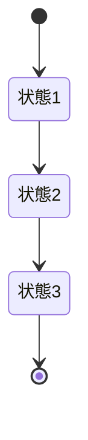
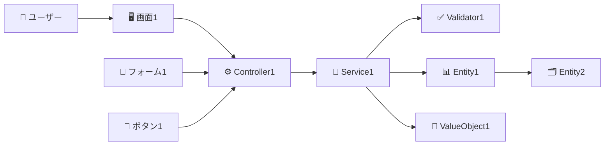
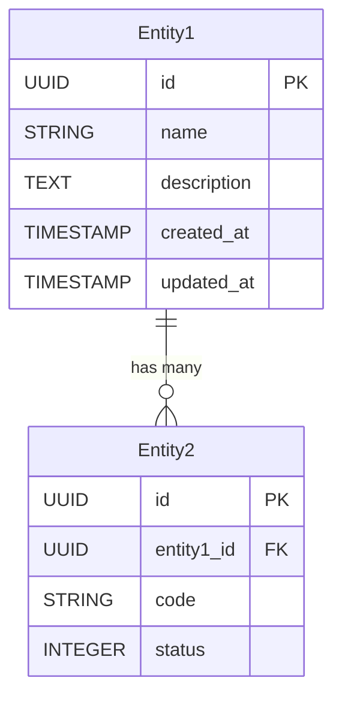

# コンサルティングプロジェクトダッシュボード

## プロジェクト構造

**📁 メインディレクトリ**: `/Users/hmoriya/Develop/github/github.com/hmoriya/consultingTool/consulting-dashboard-new/`

**⚠️ 重要**: このディレクトリがプロジェクトのルートディレクトリです。
- 全ての作業はこのディレクトリから実行してください
- 重複した `consulting-dashboard-new/consulting-dashboard-new/` 構造は作成しないでください
- Git操作、npm コマンド、開発サーバー起動は全てここから実行します

## アプリケーション概要

コンサルティングファームが複数のクライアントプロジェクトを効率的に管理・監視するための統合ダッシュボードシステム。プロジェクトの進捗状況、リソース配分、財務状況を一元的に可視化し、意思決定を支援する。

## アーキテクチャスタック

- **フロントエンド**: Next.js 15.1.0 (App Router), React 19.0, TypeScript 5.7, Tailwind CSS 3.4.1
- **UI コンポーネント**: shadcn/ui (MCP経由)
- **バックエンド**: Next.js Server Actions
- **データベース**: SQLite (ファイルベースDB)
- **ORM**: Prisma 6.0
- **バリデーション**: Zod (スキーマベースバリデーション)
- **フォーム管理**: React Hook Form (Zod連携)

## パラソルドメイン言語（Parasol Domain Language）

### 概要
パラソルドメイン言語は、実装言語に依存しない中間言語として、ドメインモデルを記述するための独自言語です。この言語で定義されたドメインモデルから、データベーススキーマやAPI仕様を自動生成することを目的としています。

### 設計思想
- **実装中立性**: 特定のプログラミング言語に依存しない
- **ドメイン駆動設計（DDD）準拠**: エンティティ、値オブジェクト、集約などのDDD概念を表現
- **ユビキタス言語**: ビジネスとテクノロジーの橋渡しとなる共通語彙
- **生成可能**: ドメイン定義から実装コード（DB、API）を自動生成
- **MD形式統一**: すべての設計ドキュメントをMarkdown形式で記述し、実装非依存性を徹底

### 基本型定義
```
UUID: 一意識別子（36文字）
STRING_N: 最大N文字の文字列（例: STRING_20, STRING_50, STRING_100）
TEXT: 長文テキスト（制限なし）
EMAIL: メールアドレス形式（RFC5322準拠）
PASSWORD_HASH: ハッシュ化されたパスワード
DATE: 日付（YYYY-MM-DD形式）
TIMESTAMP: 日時（ISO8601形式）
DECIMAL: 小数点数値
INTEGER: 整数
PERCENTAGE: パーセンテージ（0-100）
MONEY: 金額（通貨単位付き）
BOOLEAN: 真偽値（true/false）
ENUM: 列挙型
```

### ドメインモデルの構成要素とパーサー対応形式

#### 1. エンティティ（Entities）
- ユニークな識別子を持つ
- ライフサイクルを持つ
- ビジネスロジックを含む

**パーサー対応形式:**
```markdown
## 2. エンティティ定義

### コアエンティティ

#### EntityName（エンティティ名）
**識別性**: エンティティの一意識別方法
**ライフサイクル**: 作成から削除までのライフサイクル

| 属性名 | 型 | 必須 | 説明 |
|--------|----|----|------|
| id | UUID | ○ | 一意識別子 |
| name | STRING_100 | ○ | 名称 |
| createdAt | TIMESTAMP | ○ | 作成日時 |
```

#### 2. 値オブジェクト（Value Objects）
- 不変性を持つ
- 識別子を持たない
- 値の等価性で比較

**パーサー対応形式:**
```markdown
## 3. 値オブジェクト定義

### ValueObjectName（値オブジェクト名）
属性をTypeScript interface形式またはテーブル形式で定義
```

#### 3. 集約（Aggregates）
- 集約ルートを持つ
- トランザクション境界を定義
- 一貫性を保証

**パーサー対応形式:**
```markdown
## 4. 集約定義

### AggregateName（集約名）
**集約ルート**: RootEntity
**包含エンティティ**:
- Entity1
- Entity2
**不変条件**:
- ルール1
- ルール2
```

#### 4. ドメインサービス
- 複数のエンティティに跨る処理
- ビジネスロジックの実装

**パーサー対応形式:**
```markdown
## 5. ドメインサービス

### ServiceName
TypeScript interface形式でメソッドを定義
```

#### 5. ドメインイベント
- システム内で発生する重要な出来事
- 非同期処理の起点
- 監査ログの記録

#### 6. ビジネスルール
- ドメインの制約と不変条件
- バリデーションルール
- 業務フローのルール

#### 7. リポジトリインターフェース
- データ永続化の抽象化
- CRUDおよび検索メソッドの定義

### 自動生成フロー
```
[ドメインモデル（パラソル言語）]
        ↓
[パーサー/ジェネレーター]
        ↓
    ├─[データベーススキーマ（Prisma）]
    ├─[API仕様（OpenAPI/REST）]
    └─[型定義（TypeScript）]
```

### ドメインファイルの管理
- **配置場所**: `docs/domains/`ディレクトリ
- **ファイル形式**: Markdown（.md）
- **命名規則**: `{domain-name}-domain.md`
- **編集方法**: 設定ページのドメインエディタから編集可能

## フォルダ構造

```
consulting-dashboard-new/
├── app/                    # Next.js App Router
│   ├── (auth)/            # 認証関連ページ
│   │   └── login/
│   ├── (dashboard)/       # ダッシュボードページ
│   │   ├── layout.tsx
│   │   └── page.tsx
│   ├── api/               # API Routes
│   ├── components/        # 共通コンポーネント
│   │   ├── ui/           # UIコンポーネント
│   │   ├── layouts/      # レイアウトコンポーネント
│   │   └── auth/         # 認証コンポーネント
│   ├── lib/              # ユーティリティ
│   │   ├── auth/         # 認証ロジック
│   │   ├── db/          # Prismaクライアント
│   │   └── utils/       # 汎用ユーティリティ
│   └── types/           # 型定義
├── design/              # 設計ドキュメント
├── prisma/             # Prismaスキーマ
└── public/            # 静的ファイル
```

## 重要な実装指針

- Server Componentsを優先的に使用
- Client Componentsは必要最小限に
- セキュアな認証実装（bcrypt, httpOnly cookie）
- ロールベースアクセス制御（RBAC）
- レスポンシブデザイン対応

## 開発コマンド

```bash
npm run dev         # 開発サーバー起動
npm run build       # ビルド
npm run db:push     # DBスキーマ反映
npm run db:seed     # 初期データ投入
npm run db:studio   # Prisma Studio起動
```

## データベース構成

### サービス別データベース構成
コンサルティングダッシュボードは、マイクロサービス指向の設計により、サービスごとに独立したデータベースを保持します。

#### データベースファイル一覧（8サービス）
```
prisma/auth-service/data/auth.db           # 認証サービス
prisma/project-service/data/project.db     # プロジェクトサービス
prisma/resource-service/data/resource.db   # リソースサービス
prisma/timesheet-service/data/timesheet.db # タイムシートサービス
prisma/notification-service/data/notification.db # 通知サービス
prisma/knowledge-service/data/knowledge.db # ナレッジサービス
prisma/finance-service/data/finance.db     # 財務サービス
prisma/parasol-service/data/parasol.db     # パラソルサービス
```

#### 1. 認証サービスデータベース
- **パス**: `prisma/auth-service/data/auth.db`
- **環境変数**: `DATABASE_URL="file:./prisma/auth-service/data/auth.db"`
- **管理エンティティ**: User, Organization, Role, AuditLog
- **用途**: ユーザー認証、組織管理、ロール管理、監査ログ

#### 2. プロジェクトサービスデータベース
- **パス**: `prisma/project-service/data/project.db`
- **環境変数**: `PROJECT_DATABASE_URL="file:./prisma/project-service/data/project.db"`
- **管理エンティティ**: Project, Task, Milestone, ProjectMember, Risk, Deliverable
- **用途**: プロジェクト管理全般、タスク管理、マイルストーン管理

#### 3. リソースサービスデータベース
- **パス**: `prisma/resource-service/data/resource.db`
- **環境変数**: `RESOURCE_DATABASE_URL="file:./prisma/resource-service/data/resource.db"`
- **管理エンティティ**: Team, TeamMember, Skill, UserSkill
- **用途**: チーム管理、スキル管理、リソース配分

#### 4. タイムシートサービスデータベース
- **パス**: `prisma/timesheet-service/data/timesheet.db`
- **環境変数**: `TIMESHEET_DATABASE_URL="file:./prisma/timesheet-service/data/timesheet.db"`
- **管理エンティティ**: Timesheet, TimesheetEntry, TimesheetApproval
- **用途**: 工数管理、タイムシート承認フロー

#### 5. 通知サービスデータベース
- **パス**: `prisma/notification-service/data/notification.db`
- **環境変数**: `NOTIFICATION_DATABASE_URL="file:./prisma/notification-service/data/notification.db"`
- **管理エンティティ**: Notification, Message
- **用途**: 通知配信、メッセージ管理

#### 6. ナレッジサービスデータベース
- **パス**: `prisma/knowledge-service/data/knowledge.db`
- **環境変数**: `KNOWLEDGE_DATABASE_URL="file:./prisma/knowledge-service/data/knowledge.db"`
- **管理エンティティ**: KnowledgeArticle, Tag, Category
- **用途**: ナレッジ記事管理、ベストプラクティス共有

#### 7. 財務サービスデータベース
- **パス**: `prisma/finance-service/data/finance.db`
- **環境変数**: `FINANCE_DATABASE_URL="file:./prisma/finance-service/data/finance.db"`
- **管理エンティティ**: Revenue, Cost, Budget, Invoice（将来実装）
- **用途**: 収益管理、コスト管理、予算管理

#### 8. パラソルサービスデータベース
- **パス**: `prisma/parasol-service/data/parasol.db`
- **環境変数**: `PARASOL_DATABASE_URL="file:./prisma/parasol-service/data/parasol.db"`
- **管理エンティティ**: Service, BusinessCapability, BusinessOperation, UseCase, PageDefinition
- **用途**: パラソル設計ドキュメント管理、ドメイン言語定義

### データベース初期化手順
```bash
# すべてのサービスのデータベースを初期化
npm run db:push

# シードデータを投入
npm run db:seed
```

### 重要な注意事項
- **メインデータベース（dev.db）は存在しません**
- 全ての機能は8つのサービス別データベースに分割されています
- 各データベースは`prisma/[service-name]/data/[service].db`の形式で配置
- 不要な重複DBファイルが存在する場合は削除が必要

## マイクロサービス設計方針

### 設計思想

- ビジネスケーパビリティ毎にPrismaスキーマを分離
- 将来的なマイクロサービス化を見据えた疎結合設計
- 結合度の高いドメインは同一サービス内で管理

### ドメイン分割戦略

#### 1. プロジェクト管理サービス

- **含まれるドメイン**: プロジェクト、タスク、マイルストーン、成果物
- **理由**: これらは密接に関連し、トランザクション整合性が必要
- **スキーマ**: `prisma/project-service/schema.prisma`

#### 2. リソース管理サービス

- **含まれるドメイン**: ユーザー、チーム、スキル、アサインメント
- **理由**: 人的リソースの管理は一元化が必要
- **スキーマ**: `prisma/resource-service/schema.prisma`

#### 3. 財務管理サービス

- **含まれるドメイン**: 収益、コスト、請求、予算
- **理由**: 財務データは独立性が高く、セキュリティ要件も異なる
- **スキーマ**: `prisma/finance-service/schema.prisma`

#### 4. 工数管理サービス

- **含まれるドメイン**: 工数入力、承認、稼働率
- **理由**: 工数データは頻繁に更新され、独立したスケーリングが必要
- **スキーマ**: `prisma/timesheet-service/schema.prisma`

#### 5. 通知・コミュニケーションサービス

- **含まれるドメイン**: 通知、コメント、承認フロー、会議
- **理由**: 非同期処理が中心で、他サービスとの結合度が低い
- **スキーマ**: `prisma/notification-service/schema.prisma`

#### 6. 知識管理サービス

- **含まれるドメイン**: ナレッジ記事、テンプレート、FAQ、エキスパート情報
- **理由**: 検索・推薦機能が中心で、独立したインフラが望ましい
- **スキーマ**: `prisma/knowledge-service/schema.prisma`

#### 7. リスク管理サービス

- **含まれるドメイン**: リスク、イシュー、対応計画、教訓
- **理由**: リスク管理は独立したワークフローを持つ
- **スキーマ**: `prisma/risk-service/schema.prisma`

### 実装アプローチ

#### フォルダ構造

```
src/
├── prisma/
│   ├── project-service/
│   │   ├── schema.prisma
│   │   └── migrations/
│   ├── resource-service/
│   │   ├── schema.prisma
│   │   └── migrations/
│   ├── finance-service/
│   │   ├── schema.prisma
│   │   └── migrations/
│   └── ... (他のサービス)
├── lib/
│   ├── clients/
│   │   ├── projectDb.ts
│   │   ├── resourceDb.ts
│   │   ├── financeDb.ts
│   │   └── ... (他のクライアント)
│   └── services/
│       ├── project/
│       ├── resource/
│       ├── finance/
│       └── ... (各サービスのビジネスロジック)
└── app/
    └── api/
        ├── projects/
        ├── resources/
        ├── finance/
        └── ... (APIエンドポイント)
```

#### Prismaクライアント管理

```typescript
// lib/clients/projectDb.ts
import { PrismaClient as ProjectPrismaClient } from '@prisma/project-service'

export const projectDb = new ProjectPrismaClient({
  datasources: {
    db: {
      url: process.env.PROJECT_DATABASE_URL
    }
  }
})

// 同様に他のサービス用クライアントも作成
```

#### データベース設定

##### 開発環境
各マイクロサービス毎に個別のSQLiteファイルを使用:

1. **認証サービス** (認証・ユーザー管理)
   - パス: `prisma/auth-service/data/auth.db`
   - 環境変数: `AUTH_DATABASE_URL="file:./prisma/auth-service/data/auth.db"`
   - ⚠️ **重要**: ルートディレクトリに`dev.db`を配置することは禁止

2. **プロジェクトサービス**
   - パス: `prisma/project-service/data/project.db`
   - 環境変数: `PROJECT_DATABASE_URL="file:./prisma/project-service/data/project.db"`

3. **リソースサービス** (チーム・スキル管理)
   - パス: `prisma/resource-service/data/resource.db`
   - 環境変数: `RESOURCE_DATABASE_URL="file:./prisma/resource-service/data/resource.db"`

4. **タイムシートサービス** (工数管理)
   - パス: `prisma/timesheet-service/data/timesheet.db`
   - 環境変数: `TIMESHEET_DATABASE_URL="file:./prisma/timesheet-service/data/timesheet.db"`

5. **通知サービス**
   - パス: `prisma/notification-service/data/notification.db`
   - 環境変数: `NOTIFICATION_DATABASE_URL="file:./prisma/notification-service/data/notification.db"`

##### 本番環境
将来的に各サービスを個別のデータベースインスタンスへ移行可能

### 重複DBファイルのクリーンアップ

開発中に生成された重複DBファイルを削除する必要がある場合：

```bash
# 重複ファイルの削除
rm -f ./consulting-dashboard-new/prisma/parasol-service/data/parasol.db
rm -f ./parasol.db
rm -f ./prisma/auth-service/prisma/auth-service/data/auth.db
rm -f ./prisma/auth-service/prisma/dev.db
rm -f ./prisma/notification-service/prisma/notification-service/data/notification.db
rm -f ./prisma/parasol-service/prisma/parasol-service/data/parasol.db
rm -f ./prisma/prisma/auth-service/data/auth.db
rm -f ./prisma/resource-service/prisma/resource-service/data/resource.db
rm -f ./prisma/timesheet-service/prisma/timesheet-service/data/timesheet.db

# 重複ディレクトリの削除
rm -rf ./prisma/auth-service/prisma/
rm -rf ./prisma/notification-service/prisma/
rm -rf ./prisma/parasol-service/prisma/
rm -rf ./prisma/prisma/
rm -rf ./prisma/resource-service/prisma/
rm -rf ./prisma/timesheet-service/prisma/
```

### 移行戦略

1. **フェーズ1**: 単一アプリケーション内で論理的分離（現在）
2. **フェーズ2**: APIゲートウェイパターンの導入
3. **フェーズ3**: 負荷の高いサービスから順次マイクロサービス化
4. **フェーズ4**: 完全なマイクロサービスアーキテクチャ

### 設計原則

- **DDD（ドメイン駆動設計）**: 各サービスは独自のドメインモデルを持つ
- **データの一貫性**: サービス間はイベント駆動で結果整合性を保つ
- **API設計**: RESTfulまたはGraphQLで統一的なインターフェース
- **認証・認可**: 中央集権的な認証サービスを共有

## 主要ユースケース

### 0. ０リリース

- ログイン、トップページの表示のみ

### 1. エグゼクティブ向け

- 全社のプロジェクトポートフォリオを俯瞰
- 収益性分析とリソース最適化

### 2. プロジェクトマネージャー向け

- プロジェクト進捗管理とチーム管理
- リスク管理と成果物管理

### 3. コンサルタント向け

- 個人タスク管理と工数入力
- ナレッジ共有

### 4. クライアント向け

- プロジェクト進捗確認
- 成果物レビューとコミュニケーション

## ナビゲーションシステム仕様

- **ヘッダー**: 固定配置、高さ64px、アカウントセクション含む
- **サイドバー**: 折りたたみ可能、幅256px（展開時）/64px（折りたたみ時）
- **レスポンシブ対応**: モバイル時はドロワー形式

## 基本的なUI構成

### ヘッダー

- ロゴ/ブランド（左側）
- ユーザープロファイルアイコン（右側）
  - プロファイル編集、設定、ログアウト
- ログインボタン（未ログイン時）

### サイドメニュー

- ハンバーガーアイコンで開閉可能
- メニュー項目（ロール別に動的変更）:
  - ダッシュボード
  - プロジェクト一覧
  - レポート
  - 設定
  - ヘルプ

## 認証とロール管理

- **認証方式**: メールアドレス/パスワード、MFA対応
- **ロール**: Executive, PM, Consultant, Client, Admin
- **アクセス制御**: ロールベースアクセス制御（RBAC）

## 設計書 designディレクトリに配置複数あるものは、ディレクトリを作成 更新日をそれぞれ記載

- プロジェクト定義
- ビジネスケーパビリティ定義
- ユースケース（ビジネスケーパビリティをブレークダウンしてユースケースを生成）
- ロバストネス図
- API定義
- UI定義
- ドメイン言語モデル（MD形式）
- DB定義
- 受け入れテスト
- 単体テスト
- イテレーション計画

## 動作確認

- ソースコード修正後は、Playwrite mcpでログインと動作確認をする
- ソースコード修正後は、設計書と相違がないか確認

## Prismaマルチデータベース構成のトラブルシューティング

### 問題: "The table `main.Project` does not exist"エラー

#### 原因
1. **Prismaの相対パス解決問題**
   - 環境変数の相対パス（`file:./prisma/...`）が実行時のカレントディレクトリから解決される
   - 結果として複数の場所にデータベースファイルが作成される

2. **SQLiteのスキーマ名問題**
   - SQLiteはデフォルトで`main`スキーマを使用
   - Prismaが生成するクエリに`main.Project`のようなスキーマ名が含まれる

3. **Prismaクライアントのキャッシュ問題**
   - Next.jsのホットリロードで古いDB接続が残る
   - 環境変数の変更が反映されない

#### 解決方法

1. **環境変数で絶対パスを使用**
   ```env
   # ❌ 避けるべき相対パス
   PROJECT_DATABASE_URL="file:./prisma/project-service/data/project.db"
   
   # ✅ 推奨: 絶対パス
   PROJECT_DATABASE_URL="file:/Users/.../prisma/project-service/data/project.db"
   ```

2. **Prismaクライアントの初期化を簡素化**
   ```typescript
   // ❌ カスタムdatasource設定は避ける
   export const projectDb = new ProjectPrismaClient({
     datasources: {
       db: { url: customPath }
     }
   })
   
   // ✅ 環境変数に依存
   export const projectDb = new ProjectPrismaClient({
     log: ['error', 'warn']
   })
   ```

3. **サーバーの完全再起動**
   ```bash
   # 環境変数やスキーマ変更後は必須
   pkill -f "next dev"
   npm run dev
   ```

4. **データベースファイルの確認**
   ```bash
   # 重複ファイルの検索
   find . -name "*.db" -type f | grep -v node_modules
   
   # 正しいDBファイルの確認
   sqlite3 prisma/project-service/data/project.db ".tables"
   ```

#### 予防策
- マイクロサービス化は段階的に実施
- 各サービスのDB初期化時に絶対パスを使用
- 定期的にデータベースファイルの場所を確認
- 開発環境では`db:generate`後にサーバー再起動を習慣化

## デザイン・UI実装の重要な注意事項

### Tailwind CSSのクラス使用について
- **必須**: `cn()`関数を使用する場合は、必ず`import { cn } from '@/lib/utils'`をファイルの先頭でインポートすること
- **禁止**: `cn()`関数をローカルで再定義しないこと
- **推奨**: 複数のクラスを条件付きで結合する場合は`cn()`関数を使用すること

### レイアウトの注意点
1. **グリッドレイアウト**
   - モバイルファースト: `grid-cols-1 sm:grid-cols-2 lg:grid-cols-3`のように段階的に指定
   - `flex`と`grid`を同じ要素に混在させない
   
2. **レスポンシブデザイン**
   - 必ずモバイル・タブレット・デスクトップの3段階を考慮
   - ブレークポイント: `sm:` (640px), `md:` (768px), `lg:` (1024px), `xl:` (1280px)

3. **背景色とテーマ**
   - `bg-background`、`text-foreground`などのセマンティックカラーを使用
   - `bg-gray-50`などの固定色は避ける（ダークモード対応のため）

### コンポーネント実装のルール
1. **AppLayoutの使用**
   - ダッシュボード系ページでは必ず`AppLayout`でラップする
   - ログインページなど認証前のページは`AppLayout`を使用しない

2. **パディングとマージン**
   - コンテナ: `p-4 md:p-6`のようにレスポンシブに
   - カード間のギャップ: `gap-4`または`gap-6`で統一

3. **フォームのレイアウト**
   - フォーム全体: `max-w-md`または`max-w-lg`で幅を制限
   - フィールド間隔: `space-y-4`または`space-y-6`

### エラーを防ぐためのチェックリスト
- [ ] `cn()`関数を使用する場合、インポートしているか
- [ ] レスポンシブクラスは小→大の順序で記述しているか
- [ ] セマンティックカラーを使用しているか
- [ ] 不要な`any`型を使用していないか

## 重要な実装指針

- Server Componentsを優先的に使用
- Client Componentsは必要最小限に
- セキュアな認証実装（bcrypt, httpOnly cookie）
- ロールベースアクセス制御（RBAC）
- レスポンシブデザイン対応

## 開発コマンド

```bash
npm run dev         # 開発サーバー起動
npm run build       # ビルド
npm run db:push     # DBスキーマ反映
npm run db:seed     # 初期データ投入
npm run db:studio   # Prisma Studio起動
```

## テストユーザー

- exec@example.com / password123 (エグゼクティブ)
- pm@example.com / password123 (PM)
- consultant@example.com / password123 (コンサルタント)
- client@example.com / password123 (クライアント)

## トラブルシューティング

### ログインできない場合
1. データベースが正しい場所にあるか確認: `prisma/auth-service/data/auth.db`
2. データベースにテストデータがあるか確認:
   ```bash
   sqlite3 prisma/auth-service/data/auth.db "SELECT email FROM User;"
   ```
3. データがない場合は、シードスクリプトを実行:
   ```bash
   npm run db:seed
   ```

### ロール名に関する重要な注意事項

⚠️ **ロール名の大文字小文字が原因でエラーが頻繁に発生します**

#### 問題の背景
- **Userテーブルのロール**: `Executive`, `PM`, `Consultant`, `Client`, `Admin` (大文字)
- **ProjectMemberのロール**: `pm`, `member`, `reviewer`, `observer` (小文字)
- この不一致により、ロールチェック時にデータが表示されない問題が発生

#### 解決策
`constants/roles.ts` ファイルで一元管理：

```typescript
// ユーザーロール（認証サービス）
export const USER_ROLES = {
  EXECUTIVE: 'Executive',
  PM: 'PM',
  CONSULTANT: 'Consultant',
  CLIENT: 'Client',
  ADMIN: 'Admin'
} as const

// プロジェクトメンバーロール（プロジェクトサービス）
export const PROJECT_MEMBER_ROLES = {
  PM: 'pm',
  MEMBER: 'member',
  REVIEWER: 'reviewer',
  OBSERVER: 'observer'
} as const
```

#### 使用例
```typescript
// ❌ 避けるべき直接文字列の使用
if (member.role === 'PM') { ... }  // 大文字小文字の違いでマッチしない

// ✅ 推奨: 定数を使用
import { PROJECT_MEMBER_ROLES } from '@/constants/roles'
if (member.role === PROJECT_MEMBER_ROLES.PM) { ... }  // 常に正しい値
```

#### tsconfig.json の設定
constants フォルダへのパスマッピングが必要：
```json
{
  "compilerOptions": {
    "paths": {
      "@/*": ["./app/*"],
      "@/components/*": ["./components/*", "./app/components/*"],
      "@/constants/*": ["./constants/*"]
    }
  }
}

## パラソル設計の階層構造

### 完全な階層構造
```
サービス
└── ビジネスケーパビリティ（複数）
    └── ビジネスオペレーション群（ケーパビリティに関連）
        └── ユースケース群（オペレーションを実現）
            └── ページ定義
```

### 階層別の責務

#### 1. サービスレベル
- **目的**: ビジネス価値の提供
- **定義内容**:
  - サービスの目的と提供価値
  - ケーパビリティ一覧
  - サービスレベルのドメインモデル概要
  - API方針
  - DB方針

#### 2. ケーパビリティレベル
- **目的**: 組織能力の定義
- **定義内容**:
  - ケーパビリティの定義
  - ビジネス価値
  - 関連するビジネスオペレーション群
  - ケーパビリティ別ドメインモデル

#### 3. ビジネスオペレーションレベル
- **目的**: 業務プロセスの定義
- **定義内容**:
  - 目的
  - ロール（関係者）
  - ビジネスプロセス（ステップ）
  - 状態遷移
  - KPI
  - 詳細ドメインモデル

#### 4. ユースケースレベル
- **目的**: システム機能の定義
- **定義内容**:
  - アクター
  - 事前条件/事後条件
  - 基本フロー/代替フロー/例外フロー
  - エンティティ詳細
  - API仕様確定
  - DBスキーマ確定

### ビジネスオペレーションのMD形式定義例

```markdown
# ビジネスオペレーション: プロジェクト知識を保全する

## 目的
プロジェクトで得られた知識・ノウハウを組織の資産として保全し、将来のプロジェクトで活用可能にする

## 関係者とロール
- **コンサルタント**: 知識の記録・整理
- **PM**: 知識の承認・カテゴライズ
- **ナレッジマネージャー**: 知識の体系化・配信

## ビジネスプロセス
1. **知識の記録** (ユースケース)
   - ページ定義: 知識記録フォーム
   - 状態: draft → recorded
   
2. **知識の整理・タグ付け** (ユースケース)
   - ページ定義: 知識編集画面
   - 状態: recorded → organized

## 状態遷移
\`\`\`mermaid
stateDiagram-v2
    [*] --> draft: 作成開始
    draft --> recorded: 記録完了
    recorded --> organized: 整理完了
    organized --> approved: 承認
    approved --> published: 公開
\`\`\`
```

### 段階的詳細化
ビジネスオペレーションからユースケースへの分解に伴い、以下が段階的に詳細化されます：

1. **パラソルドメイン言語**: 概要から詳細エンティティへ
2. **API設計**: 方針から具体的なエンドポイントへ
3. **DB設計**: 概要から詳細スキーマへ

### ビジネスケーパビリティ命名規則
- 形式: 「XXXする能力」（例: 「プロジェクトを成功に導く能力」）
- 禁止: 「XXX管理」（CRUDを連想させるため）

### サービス命名規則

#### 重要な原則
- **価値を表現する名前**：サービスが提供する価値やアウトカムを明確に表現
- **顧客視点**：利用者が得られるメリットを表す名前
- **能動的表現**：受動的な「管理」ではなく、能動的な価値創造を表現

#### 禁止事項
- 「〜管理サービス」（CRUD操作を連想させるため）
- 「〜システム」（技術中心の名称）
- 「〜処理サービス」（プロセス中心の名称）

#### 推奨される命名パターン
| パターン | 例 | 説明 |
|---------|-----|------|
| 〜支援サービス | プロジェクト成功支援サービス | 何かを成功に導く支援 |
| 〜最適化サービス | タレント最適化サービス | リソースの最適活用 |
| 〜可視化サービス | 生産性可視化サービス | 見える化による改善 |
| 〜促進サービス | コラボレーション促進サービス | 活動の活性化 |
| 〜共創サービス | ナレッジ共創サービス | 共同での価値創造 |
| セキュア〜サービス | セキュアアクセスサービス | 安全性の保証 |

#### 具体例
| ❌ 避けるべき名前 | ✅ 推奨される名前 | 価値の表現 |
|-----------------|----------------|----------|
| プロジェクト管理サービス | プロジェクト成功支援サービス | プロジェクトを成功に導く |
| リソース管理サービス | タレント最適化サービス | 人材の能力を最大化する |
| タイムシート管理サービス | 生産性可視化サービス | 生産性を見える化し改善する |
| 知識管理サービス | ナレッジ共創サービス | 知識を共有し新たな価値を創る |
| 財務管理サービス | 収益最適化サービス | 収益を最大化する |
| 認証・組織管理サービス | セキュアアクセスサービス | 安全なアクセスを保証する |
| 通知・コミュニケーションサービス | コラボレーション促進サービス | チーム連携を促進する |

### ビジネスオペレーション命名規則
- アクション指向（動詞 + 目的語）
- 価値を表現する名前
- 顧客視点での命名
- 禁止: CRUD用語（作成、更新、削除、一覧）

### ユースケース命名規則
- **形式**: 「〜を（が）〜する」または「〜する」
- **視点**: システムユーザー（アクター）視点
- **粒度**: 1つの明確な目的を達成する単位
- **例**:
  - ✅ 良い例:
    - 「知識を記録する」
    - 「レビューを依頼する」
    - 「承認を得る」
    - 「成果物を共有する」
  - ❌ 避けるべき例:
    - 「データ登録」（CRUD的）
    - 「情報更新」（曖昧）
    - 「画面表示」（実装寄り）
- **禁止事項**:
  - CRUD用語の使用
  - 実装技術の露出
  - システム内部処理の表現

### ページ定義の設計原則

#### 重要: 実装非依存の自然言語設計
パラソル開発のすべての設計（ページ定義を含む）は、以下の原則に従います：
- **MD（Markdown）形式のみで記述**
- **実装技術に依存しない自然言語で表現**
- **ビジネス視点での記述を徹底**
- **コードやJSON形式は使用禁止**

#### MD形式統一によるデータ消失問題の解決

**⚠️ 重要**: パラソル設計でAPI仕様・DB設計が「消える」現象の根本原因は、JSON形式とMD形式の混在です。

**問題のパターン**:
```typescript
// ❌ 間違い: JSON形式への依存
apiSpecificationDefinition: service.apiSpecificationDoc?.content || '',

// ✅ 正解: MD形式フィールドの直接参照
apiSpecificationDefinition: service.apiSpecificationDefinition || '',
```

**データベース構造の混在問題**:
- **旧形式（廃止予定）**: `domainLanguage`, `apiSpecification`, `dbSchema` (JSON形式)
- **新形式（推奨）**: `domainLanguageDefinition`, `apiSpecificationDefinition`, `databaseDesignDefinition` (MD形式)

**予防策**:
1. **新規開発**: MD形式フィールドのみを使用
2. **UI実装**: JSON.parse()処理を排除し、MD形式を直接表示
3. **データ検証**: MD形式フィールドの存在チェック強化

#### ページ定義の自然言語表現
```markdown
# ページ定義：[ページの目的を表す名前]

## 画面の目的
[この画面で達成したいビジネス目的を記述]

## 利用者
- [主要な利用者とその役割]
- [副次的な利用者]

## 画面構成
### [エリア名1]
- [表示項目や機能の説明]

### [エリア名2]  
- [表示項目や機能の説明]

## 画面の振る舞い
- [ユーザー操作に対する画面の反応]
- [ビジネスルールに基づく制御]

## 画面遷移
- [どこから来るか]
- [どこへ行くか]
```

#### データベースへの格納方法
- PageDefinitionエンティティの`content`フィールドに、上記MD形式のテキスト全体を文字列として格納
- 実装詳細（HTMLタグ、CSSクラス、JSONスキーマ等）は一切含めない
- ビジネスドメインの言葉のみを使用

## パラソル設計ドキュメント種別と仕様

パラソル設計手法では、以下の種別のドキュメントを作成し、各々の仕様とテンプレートに従います。

### 1. ビジネスケーパビリティ定義

#### 仕様
ビジネスケーパビリティは組織の根幹的な能力を表現する概念です。以下の要素で構成されます：

- **定義**: 能力の本質的な意味と範囲
- **責務**: この能力が担うべき役割と責任
- **提供価値**: ビジネスに対する価値創造
- **実現手段**: 能力を実現するためのビジネスオペレーション群
- **成熟度レベル**: 現在の能力レベルと目指すべき状態

#### テンプレート
```markdown
# [ケーパビリティ名]

## 定義
[このケーパビリティの本質的な定義を記述]

## 責務
[このケーパビリティが担うべき具体的な責任を箇条書きで記述]
- 責務1
- 責務2
- 責務3

## 提供価値
[ビジネスに対する具体的な価値創造を記述]
- 価値1: [説明]
- 価値2: [説明]
- 価値3: [説明]

## 実現手段
[このケーパビリティを実現するビジネスオペレーション群]
- オペレーション1
- オペレーション2
- オペレーション3

## 成熟度レベル
- **現在**: [現状のレベル]
- **目標**: [目指すべきレベル]
- **改善計画**: [レベル向上のための計画]

## 依存関係
- **前提ケーパビリティ**: [必要な前提能力]
- **関連ケーパビリティ**: [密接に関連する能力]
```

### 2. ビジネスオペレーション設計

#### 仕様
ビジネスオペレーションは、ケーパビリティを実現するための具体的な業務プロセスです：

- **概要**: オペレーションの目的と範囲
- **パターン**: Workflow/CRUD/Analytics/Communication/Administration
- **ゴール**: 達成すべき具体的な成果
- **ロール**: 関与するアクター（役割）
- **プロセスフロー**: 業務の流れ
- **ビジネス状態**: プロセスの状態遷移
- **KPI**: 成功指標
- **ビジネスルール**: 業務上の制約と規則
- **入出力仕様**: インプットとアウトプット

#### テンプレート
```markdown
# ビジネスオペレーション: [オペレーション名]

## 概要
**目的**: [オペレーションの目的]
**パターン**: [Workflow/CRUD/Analytics/Communication/Administration]
**ゴール**: [達成すべき具体的な成果]

## 関係者とロール
- **[ロール1]**: [責務の説明]
- **[ロール2]**: [責務の説明]
- **[ロール3]**: [責務の説明]

## プロセスフロー

> **重要**: プロセスフローは必ず番号付きリスト形式で記述してください。
> Mermaid形式は使用せず、テキスト形式で記述することで、代替フローと例外フローが視覚的に分離されたフローチャートが自動生成されます。

1. [ステップ1の説明]
2. [ステップ2の説明]
3. [ステップ3の説明]
4. [ステップ4の説明]
5. [ステップ5の説明]

## 代替フロー

### 代替フロー1: [条件]
- [X-1]. [代替ステップ1の説明]
- [X-2]. [代替ステップ2の説明]
- [X-3]. 基本フロー[Y]に戻る

## 例外処理

### 例外1: [例外条件]
- [例外対応ステップ1]
- [例外対応ステップ2]

## ビジネス状態

> **注意**: ビジネス状態図は引き続きMermaid形式を使用します。
> プロセスフローとは異なり、状態遷移図は静的な図表として表示されます。



## KPI
- **[指標1]**: [目標値] - [説明]
- **[指標2]**: [目標値] - [説明]
- **[指標3]**: [目標値] - [説明]

## ビジネスルール
- [ルール1の説明]
- [ルール2の説明]
- [ルール3の説明]

## 入出力仕様
### 入力
- **[入力1]**: [説明]
- **[入力2]**: [説明]

### 出力
- **[出力1]**: [説明]
- **[出力2]**: [説明]

## 代替フロー

### 代替フロー1: [条件]
- [代替ステップ1]
- [代替ステップ2]
- [代替ステップ3]

### 代替フロー2: [条件]
- [代替ステップ1]
- [代替ステップ2]

## 例外処理

### 例外1: [例外条件]
- [例外対応ステップ1]
- [例外対応ステップ2]

### 例外2: [例外条件]
- [例外対応ステップ1]
- [例外対応ステップ2]
```

### 3. ユースケース定義

#### 仕様
ユースケースは、システムとアクターの相互作用を詳細に記述します：

- **アクター**: システムを利用する主体
- **事前条件**: ユースケース実行前に満たすべき条件
- **事後条件**: ユースケース完了時の状態
- **基本フロー**: 正常なシナリオの流れ
- **代替フロー**: 条件分岐による別のシナリオ
- **例外フロー**: エラーや例外の処理
- **拡張ポイント**: 他のユースケースとの関係

#### テンプレート
```markdown
# ユースケース: [ユースケース名]

## 基本情報
- **ユースケースID**: UC-XXX
- **アクター**: [主アクター], [副アクター]
- **概要**: [ユースケースの簡潔な説明]

## 事前条件
- [条件1]
- [条件2]
- [条件3]

## 事後条件
### 成功時
- [成功時の状態1]
- [成功時の状態2]

### 失敗時
- [失敗時の状態1]
- [失敗時の状態2]

## 基本フロー
1. [アクター]が[アクション]を実行する
2. システムが[処理]を行う
3. システムが[結果]を表示する
4. [アクター]が[確認/承認]を行う
5. システムが[最終処理]を完了する

## 代替フロー
### 代替フロー1: [条件]
- 3a. [条件]の場合
  - 3a1. システムが[代替処理]を実行
  - 3a2. 基本フロー4に戻る

### 代替フロー2: [条件]
- 4a. [条件]の場合
  - 4a1. システムが[代替処理]を実行
  - 4a2. ユースケース終了

## 例外フロー
### 例外1: [エラー条件]
- *a. [エラー条件]が発生した場合
  - *a1. システムが[エラーメッセージ]を表示
  - *a2. ユースケース中断

## 特別要件
- **性能**: [性能要件]
- **可用性**: [可用性要件]
- **セキュリティ**: [セキュリティ要件]

## 関連ユースケース
- **包含**: [包含するユースケース]
- **拡張**: [拡張されるユースケース]
- **汎化**: [汎化関係にあるユースケース]
```

### 4. ドメイン言語モデル

#### 仕様
パラソルドメイン言語は、実装非依存の中間言語として設計されています：

- **基本型定義**: システム全体で使用する共通データ型
- **エンティティ**: ビジネス上の重要な概念・対象
- **値オブジェクト**: 不変で識別子を持たない値
- **集約**: トランザクション境界を持つオブジェクト群
- **ドメインサービス**: 複数エンティティに跨る処理
- **ドメインイベント**: ビジネス上重要な出来事
- **ビジネスルール**: ドメインの制約と不変条件
- **リポジトリ**: データ永続化の抽象化

#### テンプレート
```markdown
# パラソルドメイン言語: [ドメイン名]

**バージョン**: 1.0.0
**更新日**: YYYY-MM-DD

## パラソルドメイン概要
[このドメインの概要説明]

## ユビキタス言語定義

### 基本型定義
```
UUID: 一意識別子（36文字）
STRING_N: 最大N文字の文字列（例: STRING_20, STRING_50）
TEXT: 長文テキスト（制限なし）
EMAIL: メールアドレス形式（RFC5322準拠）
DATE: 日付（YYYY-MM-DD形式）
TIMESTAMP: 日時（ISO8601形式）
DECIMAL: 小数点数値
INTEGER: 整数
BOOLEAN: 真偽値
ENUM: 列挙型
MONEY: 金額（通貨単位付き）
PERCENTAGE: パーセンテージ（0-100）
```

### エンティティ定義

#### [エンティティ名1]
**概要**: [エンティティの説明]
**識別子**: [エンティティID]

| 属性名 | 型 | 必須 | 説明 |
|--------|----|----|------|
| id | UUID | ○ | 一意識別子 |
| name | STRING_100 | ○ | 名称 |
| description | TEXT | × | 説明 |
| createdAt | TIMESTAMP | ○ | 作成日時 |
| updatedAt | TIMESTAMP | ○ | 更新日時 |

**ビジネスルール**:
- [ルール1]
- [ルール2]

#### [エンティティ名2]
[同様の形式で他のエンティティを定義]

### 値オブジェクト定義

#### [値オブジェクト名1]
**概要**: [値オブジェクトの説明]

| 属性名 | 型 | 必須 | 説明 |
|--------|----|----|------|
| value | STRING_50 | ○ | 値 |

**制約**:
- [制約1]
- [制約2]

### 集約定義

#### [集約名1]
**集約ルート**: [エンティティ名]
**境界**: [集約に含まれるエンティティ群]

**不変条件**:
- [不変条件1]
- [不変条件2]

### ドメインサービス

#### [サービス名1]
**概要**: [サービスの説明]
**操作**:
- `[メソッド名1]([パラメータ]) -> [戻り値]`: [説明]
- `[メソッド名2]([パラメータ]) -> [戻り値]`: [説明]

### ドメインイベント

#### [イベント名1]
**発生条件**: [イベントが発生する条件]
**ペイロード**:
```
{
  "eventId": UUID,
  "occurredAt": TIMESTAMP,
  "aggregateId": UUID,
  "data": {
    "field1": value,
    "field2": value
  }
}
```

### リポジトリインターフェース

#### [エンティティ名]Repository
```
interface [エンティティ名]Repository {
  findById(id: UUID): [エンティティ名] | null
  findAll(): [エンティティ名][]
  save(entity: [エンティティ名]): void
  delete(id: UUID): void
}
```
```

### 5. ページ定義

#### 仕様
ページ定義は、UIの構造と振る舞いを実装非依存で記述します：

- **画面の目的**: そのページが果たすべき役割
- **利用者**: 主要なユーザーとその役割
- **画面構成**: レイアウトとコンポーネント
- **画面の振る舞い**: ユーザー操作に対する反応
- **画面遷移**: 他画面との関係
- **データ表示**: 表示すべき情報
- **入力項目**: ユーザーからの入力
- **アクション**: 実行可能な操作

#### テンプレート
```markdown
# ページ定義: [ページ名]

## 画面の目的
[この画面で達成したいビジネス目的を記述]

## 利用者
- **[主要利用者]**: [役割と利用目的]
- **[副次利用者]**: [役割と利用目的]

## 画面構成

### ヘッダー部
- [ヘッダーに表示する要素]
- [ナビゲーション要素]

### メインコンテンツ部
- **[セクション1名]**: [表示内容と機能]
- **[セクション2名]**: [表示内容と機能]
- **[セクション3名]**: [表示内容と機能]

### サイドバー部（該当する場合）
- [サイドバーの内容]

### フッター部
- [フッターに表示する要素]

## データ表示

### 表示データ一覧
| データ項目 | 表示形式 | 必須 | 説明 |
|-----------|---------|------|------|
| [項目1] | [形式] | ○/× | [説明] |
| [項目2] | [形式] | ○/× | [説明] |

### データの更新頻度
- **[データ1]**: [更新タイミング]
- **[データ2]**: [更新タイミング]

## 入力項目

### フォーム一覧
| 入力項目 | 入力形式 | 必須 | バリデーション | 説明 |
|---------|---------|------|---------------|------|
| [項目1] | [形式] | ○/× | [ルール] | [説明] |
| [項目2] | [形式] | ○/× | [ルール] | [説明] |

## アクション・操作

### 主要アクション
- **[アクション1]**: [説明と実行条件]
- **[アクション2]**: [説明と実行条件]
- **[アクション3]**: [説明と実行条件]

### 副次アクション
- **[サブアクション1]**: [説明]
- **[サブアクション2]**: [説明]

## 画面の振る舞い

### ユーザー操作への反応
- **[操作1]**時: [画面の反応]
- **[操作2]**時: [画面の反応]
- **[操作3]**時: [画面の反応]

### 条件による表示変更
- **[条件1]**の場合: [表示内容の変更]
- **[条件2]**の場合: [表示内容の変更]

## 画面遷移

### 遷移元画面
- [遷移元画面1]: [遷移条件]
- [遷移元画面2]: [遷移条件]

### 遷移先画面
- [遷移先画面1]: [遷移条件]
- [遷移先画面2]: [遷移条件]

## エラーハンドリング
- **[エラー1]**: [表示方法と対処法]
- **[エラー2]**: [表示方法と対処法]

## アクセシビリティ要件
- [キーボードナビゲーション対応]
- [スクリーンリーダー対応]
- [色覚障害への配慮]

## レスポンシブ対応
- **デスクトップ**: [表示方法]
- **タブレット**: [表示方法]
- **モバイル**: [表示方法]
```

### 6. API仕様

#### 仕様
API仕様は、システム間の通信インターフェースを定義します：

- **API概要**: APIの目的と機能範囲
- **認証方式**: セキュリティ要件
- **エンドポイント定義**: URLとHTTPメソッド
- **リクエスト仕様**: パラメータとボディ
- **レスポンス仕様**: 戻り値の構造
- **エラーハンドリング**: エラーコードと処理
- **レート制限**: API利用制限
- **バージョン管理**: APIの変更管理

#### テンプレート
```markdown
# API仕様: [API名]

## API概要
**目的**: [APIの目的と提供機能]
**バージョン**: v1.0.0
**ベースURL**: `https://api.example.com/v1`

## 認証
**認証方式**: [JWT/OAuth2/API Key]
**ヘッダー**: `Authorization: Bearer {token}`

## 共通仕様

### リクエストヘッダー
```http
Content-Type: application/json
Authorization: Bearer {jwt_token}
Accept: application/json
```

### レスポンス形式
```json
{
  "success": boolean,
  "data": object,
  "message": string,
  "timestamp": "2024-01-01T00:00:00Z"
}
```

### エラーレスポンス
```json
{
  "success": false,
  "error": {
    "code": "ERROR_CODE",
    "message": "エラーメッセージ",
    "details": "詳細情報"
  },
  "timestamp": "2024-01-01T00:00:00Z"
}
```

## エンドポイント定義

### [リソース名1] API

#### GET /[resource]
**概要**: [リソース一覧を取得]

**リクエスト**:
- **Method**: GET
- **URL**: `/[resource]`
- **Parameters**:
  - `page` (query, optional): ページ番号 (default: 1)
  - `limit` (query, optional): 件数 (default: 20, max: 100)
  - `sort` (query, optional): ソート順 (例: name_asc, created_desc)

**レスポンス**:
```json
{
  "success": true,
  "data": {
    "items": [
      {
        "id": "uuid",
        "name": "string",
        "createdAt": "2024-01-01T00:00:00Z"
      }
    ],
    "pagination": {
      "page": 1,
      "limit": 20,
      "total": 100,
      "pages": 5
    }
  }
}
```

#### POST /[resource]
**概要**: [新規リソースを作成]

**リクエスト**:
- **Method**: POST
- **URL**: `/[resource]`
- **Body**:
```json
{
  "name": "string (required)",
  "description": "string (optional)"
}
```

**レスポンス**:
```json
{
  "success": true,
  "data": {
    "id": "uuid",
    "name": "string",
    "description": "string",
    "createdAt": "2024-01-01T00:00:00Z"
  }
}
```

#### GET /[resource]/{id}
**概要**: [特定リソースの詳細を取得]

**リクエスト**:
- **Method**: GET
- **URL**: `/[resource]/{id}`
- **Path Parameters**:
  - `id` (required): リソースID (UUID形式)

#### PUT /[resource]/{id}
**概要**: [リソースを更新]

#### DELETE /[resource]/{id}
**概要**: [リソースを削除]

## エラーコード

| コード | HTTPステータス | 説明 |
|--------|---------------|------|
| INVALID_REQUEST | 400 | リクエストが不正 |
| UNAUTHORIZED | 401 | 認証が必要 |
| FORBIDDEN | 403 | アクセス権限なし |
| NOT_FOUND | 404 | リソースが見つからない |
| VALIDATION_ERROR | 422 | バリデーションエラー |
| INTERNAL_ERROR | 500 | サーバー内部エラー |

## レート制限
- **一般API**: 1000リクエスト/時間
- **重い処理**: 100リクエスト/時間
- **制限時のレスポンス**: 429 Too Many Requests

## バージョン管理
- **現在**: v1.0.0
- **サポート**: v1.x系をサポート
- **廃止予定**: なし
```

### 7. ロバストネス図

#### 仕様
ロバストネス図は、ユースケースの実現方法を3つの要素で表現します：

- **Boundary（境界）**: ユーザーインターフェース
- **Control（制御）**: ビジネスロジック・処理
- **Entity（実体）**: データ・概念オブジェクト

#### テンプレート
```markdown
# ロバストネス図: [ユースケース名]

## 図の概要
[このロバストネス図が表現するユースケースの概要]

## 要素定義

### Boundary Objects（境界オブジェクト）
ユーザーがシステムと相互作用するインターフェース要素

| オブジェクト名 | 種類 | 説明 |
|---------------|------|------|
| [UI要素1] | 画面 | [説明] |
| [UI要素2] | フォーム | [説明] |
| [UI要素3] | ボタン | [説明] |

### Control Objects（制御オブジェクト）
ビジネスロジックや処理の流れを制御する要素

| オブジェクト名 | 役割 | 説明 |
|---------------|------|------|
| [Controller1] | 制御 | [処理内容] |
| [Service1] | 業務処理 | [処理内容] |
| [Validator1] | 検証 | [検証内容] |

### Entity Objects（実体オブジェクト）
システムが扱うデータや概念を表現する要素

| オブジェクト名 | 種類 | 説明 |
|---------------|------|------|
| [Entity1] | ドメインオブジェクト | [説明] |
| [Entity2] | データモデル | [説明] |
| [ValueObject1] | 値オブジェクト | [説明] |

## ロバストネス図



## 相互作用シーケンス

### 基本フロー
1. **ユーザー** → **[UI要素]**: [操作内容]
2. **[UI要素]** → **[Controller]**: [データ送信]
3. **[Controller]** → **[Service]**: [処理依頼]
4. **[Service]** → **[Entity]**: [データ操作]
5. **[Entity]** → **[Service]**: [結果返却]
6. **[Service]** → **[Controller]**: [処理結果]
7. **[Controller]** → **[UI要素]**: [表示データ]
8. **[UI要素]** → **ユーザー**: [結果表示]

### 代替フロー
[条件分岐や例外処理の流れ]

## 設計上の注意点
- [Boundaryの責務範囲]
- [Controlの処理分割]
- [Entityのカプセル化]
```

### 8. データベース設計

#### 仕様
データベース設計は、データの永続化方式を定義します：

- **論理設計**: エンティティとリレーション
- **物理設計**: テーブル、カラム、インデックス
- **制約定義**: 主キー、外部キー、チェック制約
- **パフォーマンス**: インデックス戦略
- **セキュリティ**: アクセス制御
- **運用**: バックアップ、監視

#### テンプレート
```markdown
# データベース設計: [システム名]

## 設計概要
**データベース**: [PostgreSQL/MySQL/SQLite]
**文字エンコーディング**: UTF-8
**タイムゾーン**: UTC

## 論理設計

### ER図


### エンティティ定義

#### Entity1テーブル
**目的**: [テーブルの役割と目的]

| カラム名 | データ型 | NULL | 制約 | 説明 |
|---------|---------|------|------|------|
| id | UUID | NOT NULL | PK | 主キー |
| name | VARCHAR(100) | NOT NULL | UNIQUE | 名称 |
| description | TEXT | NULL | - | 説明 |
| created_at | TIMESTAMP | NOT NULL | DEFAULT NOW() | 作成日時 |
| updated_at | TIMESTAMP | NOT NULL | DEFAULT NOW() | 更新日時 |

**インデックス**:
- `PRIMARY KEY (id)`
- `UNIQUE INDEX idx_entity1_name (name)`
- `INDEX idx_entity1_created_at (created_at)`

**制約**:
- `CHECK (length(name) >= 1)`: 名称は1文字以上
- `CHECK (created_at <= updated_at)`: 作成日時 ≤ 更新日時

#### Entity2テーブル
[同様の形式で他のテーブルを定義]

## 物理設計

### テーブル作成SQL
```sql
-- Entity1テーブル
CREATE TABLE entity1 (
    id UUID PRIMARY KEY DEFAULT gen_random_uuid(),
    name VARCHAR(100) NOT NULL UNIQUE,
    description TEXT,
    created_at TIMESTAMP NOT NULL DEFAULT NOW(),
    updated_at TIMESTAMP NOT NULL DEFAULT NOW(),
    CONSTRAINT check_entity1_name_length CHECK (length(name) >= 1),
    CONSTRAINT check_entity1_timestamps CHECK (created_at <= updated_at)
);

-- インデックス作成
CREATE INDEX idx_entity1_created_at ON entity1(created_at);

-- Entity2テーブル
CREATE TABLE entity2 (
    id UUID PRIMARY KEY DEFAULT gen_random_uuid(),
    entity1_id UUID NOT NULL REFERENCES entity1(id) ON DELETE CASCADE,
    code VARCHAR(50) NOT NULL,
    status INTEGER NOT NULL DEFAULT 0,
    created_at TIMESTAMP NOT NULL DEFAULT NOW()
);
```

### パーティション設計（該当する場合）
```sql
-- 日付によるパーティション例
CREATE TABLE logs (
    id UUID,
    message TEXT,
    created_at TIMESTAMP
) PARTITION BY RANGE (created_at);

CREATE TABLE logs_2024_01 PARTITION OF logs
FOR VALUES FROM ('2024-01-01') TO ('2024-02-01');
```

## パフォーマンス設計

### インデックス戦略
- **主要検索**: [よく使用される検索パターン]
- **複合インデックス**: [複数カラムでの検索]
- **部分インデックス**: [条件付きインデックス]

### クエリ最適化
```sql
-- よく使用されるクエリの例
EXPLAIN ANALYZE
SELECT e1.name, COUNT(e2.id)
FROM entity1 e1
LEFT JOIN entity2 e2 ON e1.id = e2.entity1_id
WHERE e1.created_at >= '2024-01-01'
GROUP BY e1.id, e1.name;
```

## セキュリティ設計

### アクセス制御
```sql
-- ロール定義
CREATE ROLE app_read;
CREATE ROLE app_write;
CREATE ROLE app_admin;

-- 権限付与
GRANT SELECT ON ALL TABLES IN SCHEMA public TO app_read;
GRANT SELECT, INSERT, UPDATE ON ALL TABLES IN SCHEMA public TO app_write;
GRANT ALL PRIVILEGES ON ALL TABLES IN SCHEMA public TO app_admin;
```

### データ暗号化
- **保存時暗号化**: [機密データの暗号化]
- **通信時暗号化**: [SSL/TLS接続]

## 運用設計

### バックアップ戦略
- **フルバックアップ**: 日次
- **差分バックアップ**: 時間毎
- **保管期間**: 30日

### 監視項目
- **接続数**: 最大接続数の80%以下
- **レスポンス時間**: 平均100ms以下
- **ディスク使用量**: 80%以下

### メンテナンス
```sql
-- 定期メンテナンス
VACUUM ANALYZE;
REINDEX DATABASE mydb;
```
```

### 10. イテレーション計画

#### 仕様
イテレーション計画は、開発の段階的な進行を管理します：

- **イテレーション概要**: 期間と目標
- **スコープ定義**: 実装範囲
- **ストーリー定義**: ユーザーストーリー
- **タスク分解**: 技術的タスク
- **見積もり**: 工数と期間
- **リスク管理**: 潜在的な問題
- **完了条件**: Definition of Done

#### テンプレート
```markdown
# イテレーション計画: [イテレーション名]

## イテレーション概要
- **期間**: [開始日] ～ [終了日] ([X]週間)
- **チーム構成**: [メンバー数と役割]
- **開発キャパシティ**: [総工数]時間

## イテレーション目標
**主目標**: [このイテレーションで達成したい主要な成果]

**副目標**:
- [副目標1]
- [副目標2]
- [副目標3]

## スコープ定義

### 含まれる機能
- **[機能1]**: [概要と価値]
- **[機能2]**: [概要と価値]
- **[機能3]**: [概要と価値]

### 含まれない機能
- **[除外機能1]**: [除外理由]
- **[除外機能2]**: [除外理由]

## ユーザーストーリー

### Epic: [エピック名]

#### Story 1: [ストーリー名]
**As a** [ユーザー種別]
**I want** [欲しい機能]
**So that** [理由・価値]

**受入条件**:
- [条件1]
- [条件2]
- [条件3]

**見積もり**: [ストーリーポイント]SP

#### Story 2: [ストーリー名]
[同様の形式]

## タスク分解

### [ストーリー1]のタスク
- [ ] **[タスク1]** ([見積もり]h) - [担当者]
  - [詳細説明]
- [ ] **[タスク2]** ([見積もり]h) - [担当者]
  - [詳細説明]

### [ストーリー2]のタスク
[同様の形式]

## 技術的タスク

### アーキテクチャ・インフラ
- [ ] **[技術タスク1]** ([見積もり]h) - [担当者]
- [ ] **[技術タスク2]** ([見積もり]h) - [担当者]

### リファクタリング・改善
- [ ] **[改善タスク1]** ([見積もり]h) - [担当者]
- [ ] **[改善タスク2]** ([見積もり]h) - [担当者]

## スケジュール

### Week 1
- **Day 1-2**: [タスク群]
- **Day 3-5**: [タスク群]

### Week 2
- **Day 1-3**: [タスク群]
- **Day 4-5**: [タスク群、テスト、レビュー]

## 工数見積もり

| カテゴリ | 見積もり工数 | 担当者 |
|---------|-------------|--------|
| フロントエンド開発 | [X]h | [担当者] |
| バックエンド開発 | [X]h | [担当者] |
| API開発 | [X]h | [担当者] |
| テスト | [X]h | [担当者] |
| レビュー | [X]h | [全員] |
| **合計** | **[X]h** | - |

## リスク管理

### 特定済みリスク
| リスク | 影響度 | 発生確率 | 対策 |
|--------|--------|---------|------|
| [リスク1] | 高/中/低 | 高/中/低 | [対策内容] |
| [リスク2] | 高/中/低 | 高/中/低 | [対策内容] |

### 技術的課題
- **[課題1]**: [対応方針]
- **[課題2]**: [対応方針]

## 完了条件 (Definition of Done)

### 機能完了条件
- [ ] 全ユーザーストーリーの受入条件を満たす
- [ ] 単体テストが全て合格する
- [ ] 結合テストが全て合格する
- [ ] コードレビューが完了している
- [ ] ドキュメントが更新されている

### 品質条件
- [ ] カバレッジ率80%以上
- [ ] 重大バグゼロ
- [ ] パフォーマンス要件を満たす
- [ ] セキュリティチェック完了

### 運用条件
- [ ] 本番環境へのデプロイ完了
- [ ] 監視設定完了
- [ ] 運用ドキュメント更新

## 振り返り計画

### レトロスペクティブ
- **日時**: [イテレーション終了後]
- **参加者**: [全チームメンバー]
- **アジェンダ**:
  1. うまくいったこと (Keep)
  2. 改善すべきこと (Problem)
  3. 次回試すこと (Try)

### メトリクス
- **ベロシティ**: [完了ストーリーポイント]
- **バーンダウン**: [理想線との比較]
- **品質指標**: [バグ数、テストカバレッジ]
```

## シードデータ管理

### シードデータの構成
コンサルティングダッシュボードでは、開発・テスト環境のために包括的なシードデータセットを提供しています。

#### シードファイルの構造
```
prisma/
├── seed.ts                    # メインシードスクリプト（全サービス一括実行）
├── reset-and-seed.ts         # DBリセット後にシード実行
└── seeds/                    # サービス別シードファイル
    ├── core-seed.ts         # 認証サービス（ユーザー、組織、ロール）
    ├── project-seed.ts      # プロジェクトサービス（8プロジェクト）
    ├── resource-seed.ts     # リソースサービス（チーム、スキル）
    ├── timesheet-seed.ts    # タイムシートサービス（工数データ）
    ├── notification-seed.ts # 通知サービス（通知、メッセージ）
    ├── finance-seed.ts      # 財務サービス（収益、コスト）
    ├── knowledge-seed.ts    # ナレッジサービス（記事、タグ）
    ├── parasol-seed-full.ts # パラソルサービス（全7サービスの設計データ）
    └── parasol/             # パラソル個別サービスシード
        ├── secure-access-seed.ts
        ├── project-success-seed.ts
        ├── talent-optimization-seed.ts
        ├── productivity-visualization-seed.ts
        ├── knowledge-co-creation-seed.ts
        ├── revenue-optimization-seed.ts
        └── collaboration-promotion-seed.ts
```

#### 主要なテストデータ

##### 1. テストユーザー
```
- exec@example.com / password123 (Executive - 経営層)
- pm@example.com / password123 (PM - プロジェクトマネージャー)
- consultant@example.com / password123 (Consultant - コンサルタント)
- client@example.com / password123 (Client - クライアント)
```

##### 2. プロジェクトデータ
- **合計8プロジェクト**（アクティブ4件、計画中2件、完了2件）
- 各プロジェクトには以下が含まれます：
  - プロジェクトメンバー（PM、コンサルタント）
  - タスク（20-30件/プロジェクト）
  - マイルストーン（3-4件/プロジェクト）

##### 3. パラソル設計データ
- **7サービス** × **3-4ケーパビリティ** × **2-3オペレーション** = **合計72オペレーション**
- 各オペレーションには以下が含まれます：
  - パラソルドメイン言語定義（エンティティ、値オブジェクト、集約）
  - ユースケース（3-4件/オペレーション）
  - ページ定義

### シードデータの実行方法

#### 初回セットアップ
```bash
# DBスキーマを作成
npm run db:push

# シードデータを投入
npm run db:seed
```

#### データリセット（推奨）
```bash
# DBをクリアして新しいデータを投入
npm run db:reset
```

#### 個別サービスのシード
```bash
# 認証サービスのみ
npm run db:seed:auth

# プロジェクトサービスのみ
tsx prisma/seeds/project-seed.ts
```

### シードデータの特徴

1. **リアルなビジネスシナリオ**
   - 実際のコンサルティングプロジェクトを想定
   - デジタルトランスフォーメーション、データ分析基盤構築など

2. **ロール別の検証**
   - 各ロール（Executive、PM、Consultant、Client）でのフィルタリング動作確認
   - プロジェクトメンバー権限による表示制御

3. **パラソル設計の実例**
   - DDD（ドメイン駆動設計）に基づいたモデル定義
   - 値オブジェクトとエンティティの関連表示
   - Mermaidダイアグラムでの可視化

### トラブルシューティング

#### 古いデータとの競合
**症状**: PMでログインしてもプロジェクトが表示されない
**原因**: 古いProjectMemberデータが残存
**解決策**: `npm run db:reset`でクリーンな状態から開始

#### 今後の改善（Issue #100）
シード実行時に自動的に既存データをクリアする機能を実装予定

## パラソル3層分離ページアーキテクチャ

### 概要
パラソルページ定義の重複問題を解決し、保守性を向上させるため、3層分離アーキテクチャを導入します。現在の700ページから450ページへの36%削減と、重複100%解消を目標とします。

**関連Issue**: [#135](https://github.com/hmoriya/consultingTool/issues/135)
**詳細設計**: `design/parasol/specifications/3-layer-page-architecture-spec.md`
**アーキテクチャ図**: `design/parasol/architecture/3-layer-page-architecture.md`

### 3層分離の基本方針

#### 🏢 Layer 1: サービス横断共通ページ
- **配置**: `services/global-shared-pages/`
- **対象**: 全サービスで共通利用するページ
- **例**: ログイン・ログアウト、ダッシュボード、通知一覧、エラーページ
- **変更影響**: 全サービス（慎重な変更管理が必要）

#### 🔧 Layer 2: オペレーション内共有ページ
- **配置**: `operations/[operation-name]/shared-pages/`
- **対象**: 同一ビジネスオペレーション内で共通利用するページ
- **例**: 成果物提出画面、一覧・検索画面、承認ワークフロー画面
- **変更影響**: オペレーション内のユースケース群

#### 📄 Layer 3: ユースケース専用ページ
- **配置**: `usecases/[usecase-name]/dedicated-pages/`
- **対象**: 特定ユースケースでのみ利用する専用ページ
- **例**: 複雑な入力ウィザード、特殊な承認フロー、固有のレポート画面
- **変更影響**: 単一ユースケースのみ

### ディレクトリ構造例

```
services/[service-name]/
├── global-shared-pages/           # 🏢 Layer 1: サービス横断共通
├── capabilities/[capability]/
│   └── operations/[operation]/
│       ├── shared-pages/          # 🔧 Layer 2: オペレーション内共有
│       ├── usecases/
│       │   └── [usecase]/
│       │       └── dedicated-pages/ # 📄 Layer 3: ユースケース専用
│       └── tests/
```

### 実装効果
- **ページ数**: 700 → 450 (36%削減)
- **重複数**: 150 → 0 (100%解消)
- **保守工数**: UI共通変更で87%削減
- **開発効率**: 新規ページ開発時間が80%削減

### 運用ルール
1. **新規ページ作成時**: 3層分類判定フローに従う
2. **Layer 1 変更**: 全サービス影響分析必須
3. **Layer 2 変更**: オペレーション内影響分析必須
4. **Layer 3 変更**: ユースケース単位で実施可能

## 現在のサービス・ケーパビリティ構成

### サービス階層構造
```
コンサルティングダッシュボード
├── セキュアアクセスサービス（旧：認証・組織管理サービス）
│   └── アクセスを安全に管理する能力
│       ├── ユーザーを登録・管理する
│       ├── 組織構造を管理する
│       ├── アクセス権限を制御する
│       ├── 認証を実行する
│       └── 監査ログを記録する
│
├── プロジェクト成功支援サービス（旧：プロジェクト管理サービス）
│   └── プロジェクトを成功に導く能力
│       ├── プロジェクトを正確に計画する
│       ├── リスクを先回りして管理する
│       ├── リソースを最適に配分する
│       ├── 進捗を可視化し統制する
│       ├── 品質を保証する
│       ├── 課題を迅速に解決する
│       └── 成果物を確実に配信する
│
├── タレント最適化サービス（旧：リソース管理サービス）
│   └── チームの生産性を最大化する能力
│       ├── リソースを最適配分する
│       ├── スキルを育成する
│       ├── チームを編成する
│       ├── パフォーマンスを評価する
│       └── キャリアを開発する
│
├── 生産性可視化サービス（旧：タイムシート管理サービス）
│   └── 工数を正確に把握する能力
│       ├── 工数を記録する
│       ├── タイムシートを承認する
│       └── 稼働率を分析する
│
├── ナレッジ共創サービス（旧：知識管理サービス）
│   └── 知識を組織資産化する能力
│       ├── 知識を蓄積する
│       ├── 知識を検索・活用する
│       ├── 知識を共有する
│       └── ベストプラクティスを抽出する
│
├── 収益最適化サービス（旧：財務管理サービス）
│   └── 収益性を最適化する能力
│       ├── 収益を追跡する
│       ├── コストを管理する
│       └── 収益性を最適化する
│
└── コラボレーション促進サービス（旧：通知・コミュニケーションサービス）
    └── 情報を即座に届ける能力
        ├── 通知を配信する
        └── コミュニケーションを促進する
```

### 今後の改善点
1. **ケーパビリティの細分化**（Issue #93）
   - 各サービスに1つのケーパビリティではなく、3〜5個に分割
   - 責務を明確化し、保守性を向上

2. **サービス名の価値表現**（Issue #94）
   - 「管理」を削除し、価値を表現する名前に変更
   - 上記の新サービス名への移行を実施中

## GitHub Issue駆動開発ワークフロー

プロジェクトではGitHub Issueを起点とした標準的な開発フローを採用しています。以下の手順に従って開発を進めてください。

### 1. Issue作成

```bash
gh issue create --title "機能名/問題の概要" --body "詳細な説明"
```

**Issueテンプレート**（適切なテンプレートを選択）：
- **bug_report.md**: バグ報告用
- **feature_request.md**: 機能追加要望用
- **enhancement.md**: 既存機能の改善提案用
- **documentation.md**: ドキュメント関連
- **question.md**: 質問用

### 2. Issue番号ベースのブランチ作成

```bash
git checkout -b feature/{issue番号}-{短い説明}
```

**ブランチ命名規則**：
- `feature/{issue番号}-{機能名}` - 新機能
- `bugfix/{issue番号}-{バグ名}` - バグ修正
- `hotfix/{issue番号}-{緊急修正名}` - 緊急修正
- `docs/{issue番号}-{ドキュメント名}` - ドキュメント

**例**：
```bash
git checkout -b feature/121-add-dashboard-filter
git checkout -b bugfix/122-login-error-fix
```

### 3. 開発作業

- ファイルの作成・編集
- 機能実装
- テスト作成・実行
- 設計ドキュメントの更新

### 4. Issue番号を含むコミット

```bash
git commit -m "type: 説明 (#issue番号)"
```

**コミットタイプ**：
- `feat`: 新機能の追加
- `fix`: バグ修正
- `docs`: ドキュメントのみの変更
- `style`: コードの意味に影響しない変更（フォーマット等）
- `refactor`: バグ修正でも機能追加でもないコード変更
- `perf`: パフォーマンス改善
- `test`: テストの追加・修正
- `chore`: ビルドプロセスやツールの変更

**例**：
```bash
git commit -m "feat: ダッシュボードフィルター機能を追加 (#121)"
git commit -m "fix: ログイン時のバリデーションエラーを修正 (#122)"
```

### 5. プッシュ

```bash
git push origin feature/{issue番号}-{機能名}
```

### 6. プルリクエスト作成

```bash
gh pr create --title "type: 説明 (#issue番号)" --body "$(cat <<'EOF'
## 概要
Issue #XXXの対応です。

## 変更内容
- 変更1
- 変更2
- 変更3

## テスト方法
- [ ] テスト手順1
- [ ] テスト手順2

## 関連Issue
Closes #XXX

🤖 Generated with [Claude Code](https://claude.com/claude-code)
EOF
)"
```

**自動Issue クローズのキーワード**：
- `Closes #XXX`
- `Fixes #XXX`
- `Resolves #XXX`

### 7. プルリクエストのマージ

```bash
gh pr merge {PR番号} --squash --delete-branch
```

マージ時にIssueが自動的にクローズされ、ブランチも削除されます。

### 開発フローの例

```bash
# 1. Issue作成
gh issue create --title "新機能: ユーザーダッシュボードフィルター" --body "..."

# 2. ブランチ作成（Issue #123が作成されたとする）
git checkout -b feature/123-user-dashboard-filter

# 3. 開発作業
# ファイル編集...

# 4. コミット
git add .
git commit -m "feat: ユーザーダッシュボードフィルター機能を追加 (#123)"

# 5. プッシュ
git push origin feature/123-user-dashboard-filter

# 6. PR作成
gh pr create --title "feat: ユーザーダッシュボードフィルター機能を追加 (#123)" --body "Closes #123"

# 7. マージ
gh pr merge 124 --squash --delete-branch
```

### ベストプラクティス

1. **Issue → ブランチ → コミット → PR → マージ** の完全なトレーサビリティを維持
2. **必ず Issue番号をコミットメッセージに含める**：`(#123)`
3. **PRで自動Issue クローズ**：`Closes #123`を本文に記載
4. **ブランチは作業完了後すぐに削除**：`--delete-branch`オプション使用
5. **コミットメッセージは conventional commits形式**を推奨

### 注意事項

- Issue番号の付け忘れに注意（自動関連付けができなくなる）
- ブランチ名にIssue番号を含めることで作業内容を明確化
- PRマージ時のIssue自動クローズを活用
- 大きな変更は複数のIssueに分割して管理

## GitHub Issues表示問題の調査結果と対処法

### 問題の概要

GitHub CLIで`gh issue list`を実行した際に、Issueのタイトルが「文字化け」として表示される問題がありました。調査の結果、これは実際の文字エンコーディング問題ではなく、**ANSIカラーエスケープシーケンス**がターミナルで正しく処理されずに文字として表示されている現象でした。

### 調査結果

#### 1. 実際の現象
```bash
# gh issue listの出力例（問題のあるパターン）
[38;2;141;161;185m───────┬────[0m #132 [38;2;227;234;242m全ビジネスオペレーションのユースケースとページ定義を完成させる[0m
```

#### 2. 原因分析
- **根本原因**: ANSIカラーエスケープシーケンス（`[38;2;141;161;185m`等）がテキストとして表示
- **影響箇所**: ターミナルでのGitHub CLI出力のカラーコード
- **実際の文字化け**: **なし** - 日本語テキスト自体は正常にUTF-8エンコードされている

#### 3. 検証したIssue一覧

| Issue番号 | タイトル | 状態 | 文字エンコーディング |
|-----------|---------|------|---------------------|
| #132 | 全ビジネスオペレーションのユースケースとページ定義を完成させる | Open | ✅ 正常 |
| #131 | パラソルページ・テスト・ユースケース定義にcontentフィールドを追加 | Open | ✅ 正常 |
| #130 | パラソル開発環境の大幅強化とワークフロー自動化 | Closed | ✅ 正常 |
| #128 | パラソル階層表示問題の検証完了とデバッグコード削除 | Closed | ✅ 正常 |
| #126 | パラソル開発環境の大幅強化とワークフロー自動化 | Closed | ✅ 正常 |
| #124 | パラソル開発ドキュメント整備 | Open | ✅ 正常 |

**結論**: すべてのIssueで日本語テキストは正常にエンコード・表示されており、実際の文字化けは発生していません。

### 対処方法

#### 1. ターミナル設定の確認・修正

**macOS/Linux（推奨）**:
```bash
# 現在のロケール確認
locale

# UTF-8設定を確認
echo $LANG $LC_ALL

# 正しい設定例
export LANG=ja_JP.UTF-8
export LC_ALL=ja_JP.UTF-8
```

**シェル設定ファイルに追加**:
```bash
# ~/.zshrc または ~/.bashrc に追記
export LANG=ja_JP.UTF-8
export LC_ALL=ja_JP.UTF-8
export TERM=xterm-256color
```

#### 2. GitHub CLI カラー設定の調整

```bash
# カラー出力を無効化（一時的）
gh config set pager cat
gh config set prompt disabled

# カラー出力形式を変更
gh config set color_output never  # カラー無効
gh config set color_output always # 常にカラー
gh config set color_output auto   # 自動判定（推奨）
```

#### 3. 代替表示方法

**プレーンテキスト表示**:
```bash
# カラーコードなしでリスト表示
gh issue list --color never

# JSONフォーマットで出力
gh issue list --json number,title,state

# 特定のフィールドのみ表示
gh issue list --format "{{.number}} {{.title}}"
```

**ターミナルエミュレータ設定**:
- **Terminal.app**: 環境設定 → プロファイル → 詳細 → 文字エンコーディング → UTF-8
- **iTerm2**: Preferences → Profiles → Terminal → Character Encoding → UTF-8
- **VSCode Terminal**: 設定で `"terminal.integrated.encoding": "utf8"`

#### 4. 恒久的な解決方法

**推奨構成**:
```bash
# ~/.zshrc（または~/.bashrc）
export LANG=ja_JP.UTF-8
export LC_ALL=ja_JP.UTF-8
export TERM=xterm-256color

# GitHub CLI設定
gh config set color_output auto
gh config set pager "less -R"
```

**設定後の動作確認**:
```bash
# 設定の再読み込み
source ~/.zshrc

# GitHub CLI動作確認
gh issue list

# ロケール確認
locale | grep UTF-8
```

### 予防策

1. **定期的な環境チェック**
   ```bash
   # 月次で実行推奨
   echo "LANG: $LANG"
   echo "LC_ALL: $LC_ALL"
   echo "TERM: $TERM"
   gh config list
   ```

2. **チーム共通設定**
   - 開発環境セットアップガイドにターミナル設定を含める
   - `.zshrc`テンプレートをプロジェクトに含める

3. **CI/CD環境での配慮**
   ```yaml
   # GitHub Actions例
   env:
     LANG: ja_JP.UTF-8
     LC_ALL: ja_JP.UTF-8
   ```

### 技術的詳細

#### ANSIカラーエスケープシーケンスについて
- **形式**: `\033[{属性};{色}m`または`\e[{属性};{色}m`
- **例**: `[38;2;141;161;185m` = 24bitカラーのテキスト色設定
- **問題**: ターミナルがサポートしていない場合、文字として表示される

#### GitHub CLIのカラー出力仕様
- **デフォルト**: 24bit truecolor使用
- **互換性**: 古いターミナルでは表示問題が発生する可能性
- **回避策**: 8色/16色モードへの設定変更

### まとめ

「GitHub Issue文字化け問題」として報告された現象は、実際には文字エンコーディングの問題ではなく、ターミナルでのANSIカラーエスケープシーケンス処理の問題でした。日本語テキスト自体は正常にUTF-8でエンコードされており、適切なターミナル設定により解決可能です。

**即座実行推奨**:
```bash
# 現在のセッションで解決
export LANG=ja_JP.UTF-8
export LC_ALL=ja_JP.UTF-8
gh config set color_output auto
```

**恒久的解決**:
- `~/.zshrc`に環境変数設定を追記
- ターミナルエミュレータのUTF-8設定確認
- GitHub CLI カラー設定の最適化

#### ✅ 解決済み（2025-10-07）

**実施した対策**:
```bash
# GitHub CLI設定の最適化
gh config set pager cat
gh config set prompt disabled

# 環境変数設定
export LANG=ja_JP.UTF-8
export LC_ALL=ja_JP.UTF-8
export NO_COLOR=1
```

**結果**:
- ANSIカラーエスケープシーケンスの表示問題が完全に解決
- 日本語テキストが正常に表示されることを確認
- GitHub CLI出力がクリーンになり、文字化けが完全に防止された

**検証済みの正常出力例**:
```
133	OPEN	パラソル設計のMD形式完全統一とJSON形式廃止		2025-10-06 21:26:52 +0000 UTC
132	OPEN	全ビジネスオペレーションのユースケースとページ定義を完成させる		2025-10-06 11:34:39 +0000 UTC
```

#### ✅ Issue作成時のANSIエスケープシーケンス問題も解決済み（2025-10-08）

**問題**: GitHub CLIで`gh issue create`時にHEREDOC (`<<'EOF'`) を使用すると、Issueの本文にANSIカラーエスケープシーケンスが混入する

**根本原因**: シンタックスハイライトツール（bat等）がMarkdownを解釈してANSIエスケープシーケンス（`\u001b[38;2;141;161;185m`等）を追加

**解決方法**: ファイルベースでのIssue作成を採用

```bash
# ❌ 問題のある方法（HEREDOCでANSIエスケープが混入）
gh issue create --title "..." --body "$(cat <<'EOF' ...)"

# ✅ 正しい方法（ファイルベースでクリーンなテキスト）
echo "Issueの内容" > /tmp/issue-body.md
gh issue create --title "..." --body-file /tmp/issue-body.md
rm /tmp/issue-body.md
```

**実証結果**:
- Issue #136, #137: ANSIエスケープシーケンス混入により閉鎖
- Issue #138: ファイルベース作成で完全にクリーンなテキスト表示を実現
- 日本語テキストの正常表示を確認: 「パラソル設計のユースケース・ページ重複分析と共通化最適化」

**推奨運用**:
今後のIssue作成では`--body-file`オプションを使用し、ANSI文字化けを完全に回避