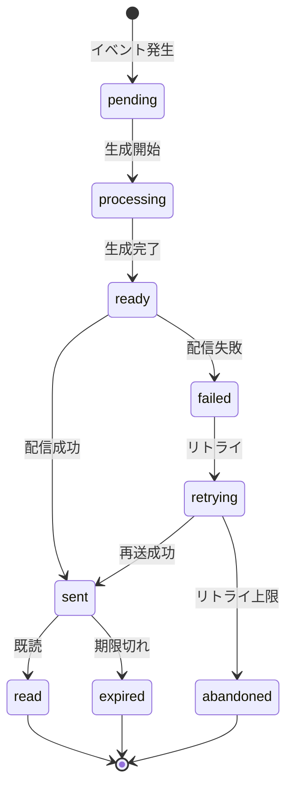

# ビジネスオペレーション: 通知を配信する

**バージョン**: 1.0.0
**更新日**: 2025-10-01

## 概要
**目的**: 重要な情報をタイムリーに関係者へ届け、適切な行動を促す
**パターン**: Communication
**ゴール**: 通知の確実な配信と高い既読率の達成により、組織のコミュニケーション効率を最大化する

## 関係者とロール
- **システム**: 通知イベントを検知し、通知を生成・配信する
- **通知送信者**: 通知の起点となるアクション（メンション、承認依頼等）を実行するユーザー
- **通知受信者**: 通知を受け取り、内容を確認し、必要に応じてアクションを実行するユーザー
- **通知管理者**: 通知設定の管理、通知テンプレートの作成、配信ルールの最適化を担当

## プロセスフロー

> **重要**: プロセスフローは必ず番号付きリスト形式で記述してください。
> Mermaid形式は使用せず、テキスト形式で記述することで、代替フローと例外フローが視覚的に分離されたフローチャートが自動生成されます。

1. システムがイベント発生を処理する
2. システムが通知生成を行う
3. システムが受信者特定を処理する
4. システムが通知設定確認を実行する
5. システムが通知配信を行う
6. システムがスキップを処理する
7. システムが配信記録を処理する
8. システムが既読追跡を処理する
9. システムが完了を処理する

## 代替フロー

### 代替フロー1: 情報不備
- 2-1. システムが情報の不備を検知する
- 2-2. システムが修正要求を送信する
- 2-3. ユーザーが情報を修正し再実行する
- 2-4. 基本フロー2に戻る

## 例外処理

### 例外1: システムエラー
- システムエラーが発生した場合
- エラーメッセージを表示する
- 管理者に通知し、ログに記録する

### 例外2: 承認却下
- 承認が却下された場合
- 却下理由をユーザーに通知する
- 修正後の再実行を促す

## ビジネス状態

## KPI
- **配信成功率**: 99.5%以上 - 生成された通知のうち正常に配信された割合
- **平均配信時間**: 3秒以内 - イベント発生から配信完了までの時間
- **既読率（24時間以内）**: 85%以上 - 配信後24時間以内に確認された通知の割合
- **通知クリック率**: 60%以上 - 通知から関連コンテンツへ遷移した割合
- **エラー率**: 0.5%未満 - 配信エラーの発生率

## ビジネスルール
- **即時配信原則**: 高優先度通知（緊急アラート、承認依頼）は5秒以内に配信
- **バッチ配信制限**: 低優先度通知は1時間ごとにまとめて配信可能（受信者設定に依存）
- **通知頻度制限**: 同一受信者への通知は10分間に最大3件まで（スパム防止）
- **深夜配信制限**: 通常通知は22:00-08:00の配信を制限（緊急通知は除外）
- **既読自動期限**: 未読通知は30日後に自動的に期限切れステータスに移行
- **重複排除**: 同一イベントから生成される同一内容の通知は1件のみ配信
- **配信チャネル優先順位**: アプリ内通知（必須） → メール通知（設定に応じて） → プッシュ通知（設定に応じて）

## 入出力仕様

### 入力
- **イベント情報**: イベント種別、発生日時、発生元エンティティ（メッセージ、会議、承認依頼等）
- **送信者情報**: ユーザーID、表示名、ロール
- **通知内容**: タイトル、メッセージ本文、アクションURL、優先度
- **受信者リスト**: 通知対象ユーザーIDの配列
- **通知オプション**: 配信チャネル指定、期限日時、カテゴリ

### 出力
- **通知レコード**: 生成された通知の詳細情報（通知ID、配信ステータス、配信日時）
- **配信結果**: 配信成功/失敗の詳細、エラー情報（失敗時）
- **配信ログ**: 配信履歴、既読日時、クリック日時
- **メトリクス**: 配信統計情報（配信数、既読数、クリック数）

## 例外処理
- **受信者不明エラー**: 指定されたユーザーIDが存在しない場合、エラーログを記録しスキップ
- **通知設定未登録**: 受信者の通知設定が未登録の場合、デフォルト設定（アプリ内通知のみ）を適用
- **配信チャネルエラー**: メール送信失敗時は3回までリトライ（指数バックオフ）、最終的にアプリ内通知のみに切り替え
- **通知頻度超過**: 頻度制限超過時は低優先度通知をキューに保留し、次の配信タイミングで送信
- **システム過負荷**: 通知配信キューが閾値を超えた場合、低優先度通知の配信を一時停止

## 派生ユースケース
このビジネスオペレーションから以下のユースケースが派生します：

1. **メンション通知を受け取る**
   - アクター: チャネルメンバー
   - 概要: チャネルやスレッドで自分がメンションされた際に通知を受け取る

2. **会議リマインダーを受け取る**
   - アクター: 会議参加者
   - 概要: 予定された会議の開始30分前と5分前にリマインダー通知を受け取る

3. **承認依頼通知を受け取る**
   - アクター: 承認者
   - 概要: タイムシート、ドキュメント等の承認依頼通知を受け取り、承認画面へ遷移する

4. **通知設定を管理する**
   - アクター: 全ユーザー
   - 概要: 受信する通知の種別、配信チャネル、通知時間帯を設定する

5. **未読通知を一覧表示する**
   - アクター: 全ユーザー
   - 概要: 未読通知の一覧を確認し、既読にしたり関連コンテンツへ遷移する
