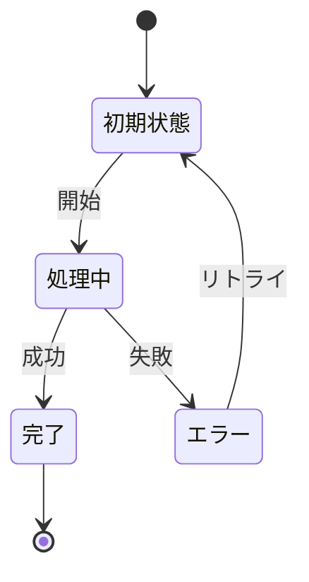

# ビジネスオペレーション: 知識を蓄積する

## 概要
**目的**: 知識を蓄積することで、ビジネス価値を創出する
**パターン**: Workflow
**ゴール**: 効率的かつ確実に知識を蓄積する

## 関係者とロール
- **主要アクター**: このオペレーションを実行する主体
- **関係者1**: オペレーションに関与する関係者
- **関係者2**: オペレーションから影響を受ける関係者

## プロセスフロー

> **重要**: プロセスフローは必ず番号付きリスト形式で記述してください。
> Mermaid形式は使用せず、テキスト形式で記述することで、代替フローと例外フローが視覚的に分離されたフローチャートが自動生成されます。

1. システムが開始を処理する
2. システムがステップ1を処理する
3. システムがステップ2を処理する
4. システムがステップ3を処理する
5. システムがエラー処理を実行する
6. システムが完了を処理する

## 代替フロー

### 代替フロー1: 情報不備
- 2-1. システムが情報の不備を検知する
- 2-2. システムが修正要求を送信する
- 2-3. ユーザーが情報を修正し再実行する
- 2-4. 基本フロー2に戻る

## 例外処理

### 例外1: システムエラー
- システムエラーが発生した場合
- エラーメッセージを表示する
- 管理者に通知し、ログに記録する

### 例外2: 承認却下
- 承認が却下された場合
- 却下理由をユーザーに通知する
- 修正後の再実行を促す

## ビジネス状態

## KPI
- **処理成功率**: 99%以上
- **平均処理時間**: 目標値以内
- **エラー率**: 1%未満

## ビジネスルール
- ルール1: 重要なビジネスルール
- ルール2: 制約事項
- ルール3: 必須要件

## 入出力仕様

### 入力
- **入力1**: 説明
- **入力2**: 説明

### 出力
- **出力1**: 説明
- **出力2**: 説明

## 例外処理
- **エラー1**: 対処方法
- **エラー2**: 対処方法

## 関連ユースケース
- ユースケース1
- ユースケース2
