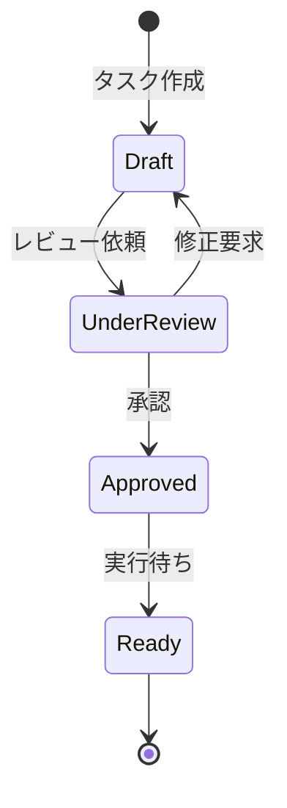

# ビジネスオペレーション: タスクを分解し定義する

**バージョン**: 1.0.0
**更新日**: 2024-12-30

## 概要

**目的**: プロジェクトの成果物を実現可能な作業単位（タスク）に分解し、明確に定義する

**パターン**: CRUD + Workflow

**ゴール**: すべての必要作業が漏れなく、適切な粒度でタスク化される

## 関係者とロール

- **PM**: WBS作成、タスク定義レビュー、全体整合性の確認
- **コンサルタント**: タスク詳細定義、工数見積もり、技術的実現性の評価

## プロセスフロー

> **重要**: プロセスフローは必ず番号付きリスト形式で記述してください。
> Mermaid形式は使用せず、テキスト形式で記述することで、代替フローと例外フローが視覚的に分離されたフローチャートが自動生成されます。

1. システムが成果物定義を処理する
2. システムがWBS作成を行う
3. システムがタスク詳細化を処理する
4. システムが工数見積もりを処理する
5. システムが依存関係定義を処理する
6. システムがタスク承認を行う

## 代替フロー

### 代替フロー1: 情報不備
- 2-1. システムが情報の不備を検知する
- 2-2. システムが修正要求を送信する
- 2-3. ユーザーが情報を修正し再実行する
- 2-4. 基本フロー2に戻る

## 例外処理

### 例外1: システムエラー
- システムエラーが発生した場合
- エラーメッセージを表示する
- 管理者に通知し、ログに記録する

### 例外2: 承認却下
- 承認が却下された場合
- 却下理由をユーザーに通知する
- 修正後の再実行を促す

## ビジネス状態

## KPI

- **タスク粒度**: 1タスク = 0.5〜5日（90%以上がこの範囲）
- **見積もり精度**: 実績との差異±20%以内（80%以上のタスク）
- **タスク完全性**: 計画外タスク発生率10%以下
- **依存関係明確性**: 依存関係が明示されているタスク95%以上
- **WBS作成時間**: プロジェクト規模に対して適切（中規模で2日以内）

## ビジネスルール

- タスクの粒度は最小0.5日、最大5日とする
- 5日を超える場合は必ずサブタスクに分解すること
- すべてのタスクに担当スキルまたは担当候補を定義すること
- クリティカルパスのタスクは明示的にマークすること
- 外部依存（クライアント、第三者）があるタスクは明記すること
- 各タスクの完了条件（Definition of Done）を明確にすること

## 入出力仕様

### 入力

- **プロジェクト計画書**: スコープ、目標、成果物一覧
- **成果物テンプレート**: 過去プロジェクトのテンプレート
- **類似プロジェクトのWBS**: 参考情報
- **チームスキルマトリクス**: 利用可能なスキルと人材

### 出力

- **WBS（Work Breakdown Structure）**: 階層的なタスク構造
- **タスク一覧**: タスク名、説明、工数、担当スキル
- **依存関係図**: タスク間の前提条件と順序
- **クリティカルパス**: 最短完了に必須のタスクチェーン
- **工数見積もりサマリー**: 全体工数と期間の見積もり

## 例外処理

- **工数見積もり困難**: 調査タスクを先行させ、詳細タスクは後で定義
- **技術的不確実性**: PoC（概念実証）タスクを追加
- **依存関係循環**: タスク分解を見直し、循環を解消
- **過度に大きなタスク**: 強制的にサブタスクに分解
- **担当スキル不在**: 外部調達またはトレーニング計画を追加

## 派生ユースケース

このビジネスオペレーションから以下のユースケースが派生します：

1. WBSを作成する
2. タスクを詳細定義する
3. タスク工数を見積もる
4. タスク依存関係を定義する