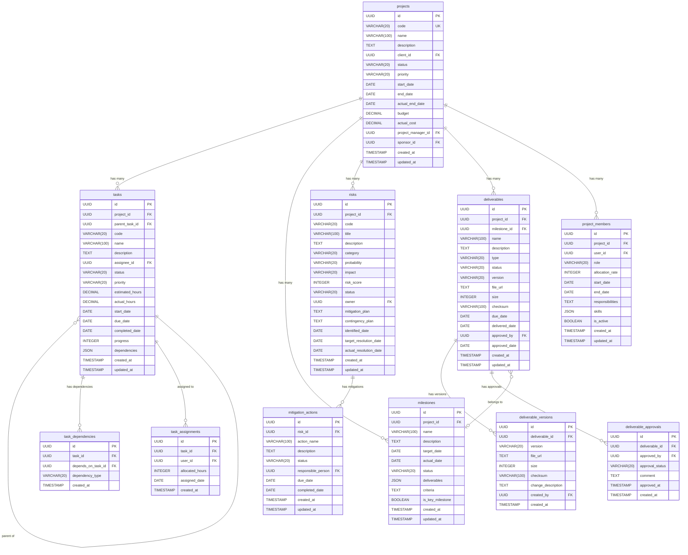

# データベース設計: プロジェクト成功支援サービス

## 設計概要
**データベース**: SQLite (開発環境) / PostgreSQL (本番環境想定)
**文字エンコーディング**: UTF-8
**タイムゾーン**: UTC

## 論理設計

### ER図



## 物理設計

### テーブル作成SQL

#### projectsテーブル
```sql
CREATE TABLE projects (
    id UUID PRIMARY KEY DEFAULT gen_random_uuid(),
    code VARCHAR(20) NOT NULL UNIQUE,
    name VARCHAR(100) NOT NULL,
    description TEXT,
    client_id UUID NOT NULL,
    status VARCHAR(20) NOT NULL CHECK (status IN ('Planning', 'Active', 'OnHold', 'Completed', 'Cancelled')),
    priority VARCHAR(20) NOT NULL CHECK (priority IN ('Critical', 'High', 'Medium', 'Low')),
    start_date DATE NOT NULL,
    end_date DATE NOT NULL,
    actual_end_date DATE,
    budget DECIMAL(15, 2) NOT NULL,
    actual_cost DECIMAL(15, 2) DEFAULT 0,
    project_manager_id UUID NOT NULL,
    sponsor_id UUID NOT NULL,
    created_at TIMESTAMP NOT NULL DEFAULT NOW(),
    updated_at TIMESTAMP NOT NULL DEFAULT NOW(),
    CONSTRAINT check_project_dates CHECK (start_date <= end_date),
    CONSTRAINT check_project_actual_end CHECK (actual_end_date IS NULL OR actual_end_date >= start_date),
    CONSTRAINT check_project_budget CHECK (budget > 0),
    CONSTRAINT check_project_cost CHECK (actual_cost >= 0)
);

-- インデックス
CREATE INDEX idx_projects_code ON projects(code);
CREATE INDEX idx_projects_status ON projects(status);
CREATE INDEX idx_projects_client_id ON projects(client_id);
CREATE INDEX idx_projects_pm_id ON projects(project_manager_id);
CREATE INDEX idx_projects_dates ON projects(start_date, end_date);
```

#### tasksテーブル
```sql
CREATE TABLE tasks (
    id UUID PRIMARY KEY DEFAULT gen_random_uuid(),
    project_id UUID NOT NULL REFERENCES projects(id) ON DELETE CASCADE,
    parent_task_id UUID REFERENCES tasks(id) ON DELETE CASCADE,
    code VARCHAR(20) NOT NULL,
    name VARCHAR(100) NOT NULL,
    description TEXT,
    assignee_id UUID,
    status VARCHAR(20) NOT NULL CHECK (status IN ('NotStarted', 'InProgress', 'Review', 'Completed', 'Blocked')),
    priority VARCHAR(20) NOT NULL CHECK (priority IN ('Critical', 'High', 'Medium', 'Low')),
    estimated_hours DECIMAL(8, 2) NOT NULL,
    actual_hours DECIMAL(8, 2) DEFAULT 0,
    start_date DATE NOT NULL,
    due_date DATE NOT NULL,
    completed_date DATE,
    progress INTEGER NOT NULL DEFAULT 0 CHECK (progress BETWEEN 0 AND 100),
    dependencies JSON,
    created_at TIMESTAMP NOT NULL DEFAULT NOW(),
    updated_at TIMESTAMP NOT NULL DEFAULT NOW(),
    CONSTRAINT check_task_dates CHECK (start_date <= due_date),
    CONSTRAINT check_task_hours CHECK (estimated_hours > 0),
    CONSTRAINT check_task_actual_hours CHECK (actual_hours >= 0)
);

-- インデックス
CREATE INDEX idx_tasks_project_id ON tasks(project_id);
CREATE INDEX idx_tasks_parent_id ON tasks(parent_task_id);
CREATE INDEX idx_tasks_assignee_id ON tasks(assignee_id);
CREATE INDEX idx_tasks_status ON tasks(status);
CREATE INDEX idx_tasks_due_date ON tasks(due_date);
CREATE INDEX idx_tasks_code ON tasks(project_id, code);

-- 循環依存防止のための関数（PostgreSQL想定）
-- SQLiteでは実装時にアプリケーションレベルで制御
```

#### milestonesテーブル
```sql
CREATE TABLE milestones (
    id UUID PRIMARY KEY DEFAULT gen_random_uuid(),
    project_id UUID NOT NULL REFERENCES projects(id) ON DELETE CASCADE,
    name VARCHAR(100) NOT NULL,
    description TEXT,
    target_date DATE NOT NULL,
    actual_date DATE,
    status VARCHAR(20) NOT NULL CHECK (status IN ('Pending', 'Achieved', 'Missed')),
    deliverables JSON,
    criteria TEXT,
    is_key_milestone BOOLEAN NOT NULL DEFAULT FALSE,
    created_at TIMESTAMP NOT NULL DEFAULT NOW(),
    updated_at TIMESTAMP NOT NULL DEFAULT NOW(),
    CONSTRAINT check_milestone_actual CHECK (actual_date IS NULL OR actual_date <= NOW())
);

-- インデックス
CREATE INDEX idx_milestones_project_id ON milestones(project_id);
CREATE INDEX idx_milestones_target_date ON milestones(target_date);
CREATE INDEX idx_milestones_status ON milestones(status);
CREATE INDEX idx_milestones_key ON milestones(is_key_milestone);
```

#### risksテーブル
```sql
CREATE TABLE risks (
    id UUID PRIMARY KEY DEFAULT gen_random_uuid(),
    project_id UUID NOT NULL REFERENCES projects(id) ON DELETE CASCADE,
    code VARCHAR(20) NOT NULL,
    title VARCHAR(100) NOT NULL,
    description TEXT NOT NULL,
    category VARCHAR(20) NOT NULL CHECK (category IN ('Technical', 'Schedule', 'Cost', 'Quality', 'External')),
    probability VARCHAR(20) NOT NULL CHECK (probability IN ('VeryLow', 'Low', 'Medium', 'High', 'VeryHigh')),
    impact VARCHAR(20) NOT NULL CHECK (impact IN ('VeryLow', 'Low', 'Medium', 'High', 'VeryHigh')),
    risk_score INTEGER NOT NULL CHECK (risk_score BETWEEN 1 AND 25),
    status VARCHAR(20) NOT NULL CHECK (status IN ('Identified', 'Analyzing', 'Mitigating', 'Monitoring', 'Closed')),
    owner UUID NOT NULL,
    mitigation_plan TEXT,
    contingency_plan TEXT,
    identified_date DATE NOT NULL,
    target_resolution_date DATE,
    actual_resolution_date DATE,
    created_at TIMESTAMP NOT NULL DEFAULT NOW(),
    updated_at TIMESTAMP NOT NULL DEFAULT NOW(),
    CONSTRAINT check_risk_dates CHECK (target_resolution_date IS NULL OR target_resolution_date >= identified_date)
);

-- インデックス
CREATE INDEX idx_risks_project_id ON risks(project_id);
CREATE INDEX idx_risks_owner ON risks(owner);
CREATE INDEX idx_risks_status ON risks(status);
CREATE INDEX idx_risks_score ON risks(risk_score DESC);
CREATE INDEX idx_risks_code ON risks(project_id, code);
```

#### deliverablesテーブル
```sql
CREATE TABLE deliverables (
    id UUID PRIMARY KEY DEFAULT gen_random_uuid(),
    project_id UUID NOT NULL REFERENCES projects(id) ON DELETE CASCADE,
    milestone_id UUID REFERENCES milestones(id) ON DELETE SET NULL,
    name VARCHAR(100) NOT NULL,
    description TEXT,
    type VARCHAR(20) NOT NULL CHECK (type IN ('Document', 'Software', 'Report', 'Presentation', 'Other')),
    status VARCHAR(20) NOT NULL CHECK (status IN ('Draft', 'Review', 'Approved', 'Delivered')),
    version VARCHAR(20) NOT NULL,
    file_url TEXT,
    size INTEGER,
    checksum VARCHAR(100),
    due_date DATE NOT NULL,
    delivered_date DATE,
    approved_by UUID,
    approved_date DATE,
    created_at TIMESTAMP NOT NULL DEFAULT NOW(),
    updated_at TIMESTAMP NOT NULL DEFAULT NOW(),
    CONSTRAINT check_deliverable_approval CHECK (
        (status = 'Approved' AND approved_by IS NOT NULL AND approved_date IS NOT NULL) OR
        (status != 'Approved')
    ),
    CONSTRAINT check_deliverable_dates CHECK (delivered_date IS NULL OR delivered_date >= approved_date)
);

-- インデックス
CREATE INDEX idx_deliverables_project_id ON deliverables(project_id);
CREATE INDEX idx_deliverables_milestone_id ON deliverables(milestone_id);
CREATE INDEX idx_deliverables_status ON deliverables(status);
CREATE INDEX idx_deliverables_due_date ON deliverables(due_date);
```

#### project_membersテーブル
```sql
CREATE TABLE project_members (
    id UUID PRIMARY KEY DEFAULT gen_random_uuid(),
    project_id UUID NOT NULL REFERENCES projects(id) ON DELETE CASCADE,
    user_id UUID NOT NULL,
    role VARCHAR(20) NOT NULL CHECK (role IN ('PM', 'Leader', 'Member', 'Observer')),
    allocation_rate INTEGER NOT NULL CHECK (allocation_rate BETWEEN 0 AND 100),
    start_date DATE NOT NULL,
    end_date DATE,
    responsibilities TEXT,
    skills JSON,
    is_active BOOLEAN NOT NULL DEFAULT TRUE,
    created_at TIMESTAMP NOT NULL DEFAULT NOW(),
    updated_at TIMESTAMP NOT NULL DEFAULT NOW(),
    CONSTRAINT check_pm_dates CHECK (end_date IS NULL OR end_date >= start_date),
    CONSTRAINT unique_active_project_member UNIQUE (project_id, user_id, is_active)
);

-- インデックス
CREATE INDEX idx_project_members_project_id ON project_members(project_id);
CREATE INDEX idx_project_members_user_id ON project_members(user_id);
CREATE INDEX idx_project_members_role ON project_members(role);
CREATE INDEX idx_project_members_active ON project_members(is_active);
```

#### task_dependenciesテーブル
```sql
CREATE TABLE task_dependencies (
    id UUID PRIMARY KEY DEFAULT gen_random_uuid(),
    task_id UUID NOT NULL REFERENCES tasks(id) ON DELETE CASCADE,
    depends_on_task_id UUID NOT NULL REFERENCES tasks(id) ON DELETE CASCADE,
    dependency_type VARCHAR(20) NOT NULL CHECK (dependency_type IN ('FinishToStart', 'StartToStart', 'FinishToFinish', 'StartToFinish')),
    created_at TIMESTAMP NOT NULL DEFAULT NOW(),
    CONSTRAINT check_no_self_dependency CHECK (task_id != depends_on_task_id),
    CONSTRAINT unique_task_dependency UNIQUE (task_id, depends_on_task_id)
);

-- インデックス
CREATE INDEX idx_task_deps_task_id ON task_dependencies(task_id);
CREATE INDEX idx_task_deps_depends_on ON task_dependencies(depends_on_task_id);
```

#### task_assignmentsテーブル
```sql
CREATE TABLE task_assignments (
    id UUID PRIMARY KEY DEFAULT gen_random_uuid(),
    task_id UUID NOT NULL REFERENCES tasks(id) ON DELETE CASCADE,
    user_id UUID NOT NULL,
    allocated_hours INTEGER NOT NULL CHECK (allocated_hours > 0),
    assigned_date DATE NOT NULL,
    created_at TIMESTAMP NOT NULL DEFAULT NOW(),
    CONSTRAINT unique_task_assignment UNIQUE (task_id, user_id)
);

-- インデックス
CREATE INDEX idx_task_assignments_task_id ON task_assignments(task_id);
CREATE INDEX idx_task_assignments_user_id ON task_assignments(user_id);
```

#### mitigation_actionsテーブル
```sql
CREATE TABLE mitigation_actions (
    id UUID PRIMARY KEY DEFAULT gen_random_uuid(),
    risk_id UUID NOT NULL REFERENCES risks(id) ON DELETE CASCADE,
    action_name VARCHAR(100) NOT NULL,
    description TEXT,
    status VARCHAR(20) NOT NULL CHECK (status IN ('Planned', 'InProgress', 'Completed', 'Cancelled')),
    responsible_person UUID NOT NULL,
    due_date DATE NOT NULL,
    completed_date DATE,
    created_at TIMESTAMP NOT NULL DEFAULT NOW(),
    updated_at TIMESTAMP NOT NULL DEFAULT NOW(),
    CONSTRAINT check_mitigation_dates CHECK (completed_date IS NULL OR completed_date <= NOW())
);

-- インデックス
CREATE INDEX idx_mitigation_risk_id ON mitigation_actions(risk_id);
CREATE INDEX idx_mitigation_responsible ON mitigation_actions(responsible_person);
CREATE INDEX idx_mitigation_status ON mitigation_actions(status);
CREATE INDEX idx_mitigation_due_date ON mitigation_actions(due_date);
```

#### deliverable_versionsテーブル
```sql
CREATE TABLE deliverable_versions (
    id UUID PRIMARY KEY DEFAULT gen_random_uuid(),
    deliverable_id UUID NOT NULL REFERENCES deliverables(id) ON DELETE CASCADE,
    version VARCHAR(20) NOT NULL,
    file_url TEXT NOT NULL,
    size INTEGER NOT NULL,
    checksum VARCHAR(100) NOT NULL,
    change_description TEXT,
    created_by UUID NOT NULL,
    created_at TIMESTAMP NOT NULL DEFAULT NOW(),
    CONSTRAINT unique_deliverable_version UNIQUE (deliverable_id, version)
);

-- インデックス
CREATE INDEX idx_del_versions_deliverable_id ON deliverable_versions(deliverable_id);
CREATE INDEX idx_del_versions_created_at ON deliverable_versions(created_at);
```

#### deliverable_approvalsテーブル
```sql
CREATE TABLE deliverable_approvals (
    id UUID PRIMARY KEY DEFAULT gen_random_uuid(),
    deliverable_id UUID NOT NULL REFERENCES deliverables(id) ON DELETE CASCADE,
    approved_by UUID NOT NULL,
    approval_status VARCHAR(20) NOT NULL CHECK (approval_status IN ('Pending', 'Approved', 'Rejected')),
    comment TEXT,
    approved_at TIMESTAMP,
    created_at TIMESTAMP NOT NULL DEFAULT NOW(),
    CONSTRAINT check_approval_timestamp CHECK (
        (approval_status != 'Pending' AND approved_at IS NOT NULL) OR
        (approval_status = 'Pending' AND approved_at IS NULL)
    )
);

-- インデックス
CREATE INDEX idx_del_approvals_deliverable_id ON deliverable_approvals(deliverable_id);
CREATE INDEX idx_del_approvals_approver ON deliverable_approvals(approved_by);
CREATE INDEX idx_del_approvals_status ON deliverable_approvals(approval_status);
```

## パフォーマンス設計

### インデックス戦略

#### 主要検索パターン
1. **プロジェクト一覧取得**: status, client_id, project_manager_idによる検索
2. **タスク検索**: project_id, assignee_id, statusによる検索
3. **期限管理**: due_date, target_dateによる範囲検索
4. **リスク分析**: risk_score降順、statusによる検索

#### 複合インデックス
```sql
-- プロジェクトの期間とステータスでの検索
CREATE INDEX idx_projects_status_dates ON projects(status, start_date, end_date);

-- タスクのプロジェクトとステータスでの検索
CREATE INDEX idx_tasks_project_status ON tasks(project_id, status);

-- リスクのプロジェクトとスコアでの検索
CREATE INDEX idx_risks_project_score ON risks(project_id, risk_score DESC);
```

### クエリ最適化

#### よく使用されるクエリ例

1. **アクティブプロジェクトの一覧**
```sql
SELECT p.*,
       COUNT(DISTINCT t.id) as total_tasks,
       COUNT(DISTINCT CASE WHEN t.status = 'Completed' THEN t.id END) as completed_tasks,
       COALESCE(AVG(t.progress), 0) as avg_progress
FROM projects p
LEFT JOIN tasks t ON p.id = t.project_id
WHERE p.status = 'Active'
GROUP BY p.id
ORDER BY p.priority DESC, p.start_date;
```

2. **ユーザーのタスク一覧（期限順）**
```sql
SELECT t.*, p.name as project_name, p.code as project_code
FROM tasks t
INNER JOIN projects p ON t.project_id = p.id
WHERE t.assignee_id = ?
  AND t.status NOT IN ('Completed', 'Cancelled')
ORDER BY t.due_date ASC, t.priority DESC;
```

3. **プロジェクトの高リスク一覧**
```sql
SELECT r.*, COUNT(ma.id) as mitigation_count
FROM risks r
LEFT JOIN mitigation_actions ma ON r.id = ma.risk_id AND ma.status != 'Completed'
WHERE r.project_id = ?
  AND r.status NOT IN ('Closed')
  AND r.risk_score >= 12
ORDER BY r.risk_score DESC;
```

## セキュリティ設計

### アクセス制御
```sql
-- ロール定義（PostgreSQL想定）
CREATE ROLE project_reader;
CREATE ROLE project_writer;
CREATE ROLE project_manager;
CREATE ROLE project_admin;

-- 権限付与
GRANT SELECT ON ALL TABLES IN SCHEMA public TO project_reader;
GRANT SELECT, INSERT, UPDATE ON projects, tasks, milestones TO project_writer;
GRANT SELECT, INSERT, UPDATE, DELETE ON ALL TABLES IN SCHEMA public TO project_manager;
GRANT ALL PRIVILEGES ON ALL TABLES IN SCHEMA public TO project_admin;
```

### 行レベルセキュリティ（PostgreSQL想定）
```sql
-- プロジェクトメンバーのみがアクセス可能
CREATE POLICY project_member_access ON projects
    FOR SELECT
    USING (
        id IN (
            SELECT project_id
            FROM project_members
            WHERE user_id = current_user_id() AND is_active = TRUE
        )
    );

-- タスクの担当者のみが更新可能
CREATE POLICY task_assignee_update ON tasks
    FOR UPDATE
    USING (assignee_id = current_user_id());
```

### データ暗号化
- **機密フィールド**: description, mitigation_plan, contingency_planは暗号化推奨
- **ファイルURL**: S3等の署名付きURLを使用
- **チェックサム**: SHA-256ハッシュを使用

## 運用設計

### バックアップ戦略
- **フルバックアップ**: 日次（深夜2:00）
- **差分バックアップ**: 6時間毎
- **保管期間**: 30日（法的要件により延長可能）
- **リストアテスト**: 週次で実行

### 監視項目
- **接続数**: 最大接続数の80%以下を維持
- **クエリレスポンス時間**:
  - 単純検索: 50ms以下
  - 集計クエリ: 200ms以下
  - 最適化計算: 2秒以下
- **テーブルサイズ**:
  - projects: 10万件まで
  - tasks: 100万件まで
  - risks: 50万件まで
- **インデックス効率**: 週次でANALYZE実行

### メンテナンス

#### 定期メンテナンス（PostgreSQL）
```sql
-- 統計情報更新
ANALYZE projects;
ANALYZE tasks;
ANALYZE risks;

-- バキューム実行
VACUUM ANALYZE projects;

-- インデックス再構築
REINDEX TABLE tasks;
```

#### データアーカイブ
```sql
-- 完了後1年経過したプロジェクトをアーカイブテーブルへ移動
INSERT INTO projects_archive
SELECT * FROM projects
WHERE status = 'Completed'
  AND actual_end_date < NOW() - INTERVAL '1 year';

-- 元テーブルから削除（CASCADE設定により関連データも削除）
DELETE FROM projects
WHERE status = 'Completed'
  AND actual_end_date < NOW() - INTERVAL '1 year';
```

### データ整合性チェック

#### 定期チェッククエリ
```sql
-- 親タスクの進捗が子タスクの平均と一致するか
SELECT t1.id, t1.name, t1.progress as parent_progress,
       AVG(t2.progress) as children_avg_progress
FROM tasks t1
INNER JOIN tasks t2 ON t1.id = t2.parent_task_id
GROUP BY t1.id, t1.name, t1.progress
HAVING ABS(t1.progress - AVG(t2.progress)) > 5;

-- リスクスコアの計算が正しいか
SELECT id, code, probability, impact, risk_score,
       (CASE probability
           WHEN 'VeryLow' THEN 1
           WHEN 'Low' THEN 2
           WHEN 'Medium' THEN 3
           WHEN 'High' THEN 4
           WHEN 'VeryHigh' THEN 5
       END) * (CASE impact
           WHEN 'VeryLow' THEN 1
           WHEN 'Low' THEN 2
           WHEN 'Medium' THEN 3
           WHEN 'High' THEN 4
           WHEN 'VeryHigh' THEN 5
       END) as calculated_score
FROM risks
WHERE risk_score != calculated_score;

-- 過剰配分のチェック
SELECT user_id, SUM(allocation_rate) as total_allocation
FROM project_members
WHERE is_active = TRUE
  AND (end_date IS NULL OR end_date >= CURRENT_DATE)
GROUP BY user_id
HAVING SUM(allocation_rate) > 100;
```

## 移行戦略

### 初期データ移行
```sql
-- レガシーシステムからのデータ移行例
INSERT INTO projects (id, code, name, client_id, status, priority, start_date, end_date, budget, project_manager_id, sponsor_id)
SELECT
    gen_random_uuid(),
    legacy_code,
    legacy_name,
    map_client_id(legacy_client),
    map_status(legacy_status),
    'Medium',
    legacy_start,
    legacy_end,
    legacy_budget,
    map_user_id(legacy_pm),
    map_user_id(legacy_sponsor)
FROM legacy_projects
WHERE legacy_status NOT IN ('DELETED', 'ARCHIVED');
```

### データ検証
```sql
-- 移行後の件数チェック
SELECT
    (SELECT COUNT(*) FROM legacy_projects WHERE legacy_status NOT IN ('DELETED', 'ARCHIVED')) as legacy_count,
    (SELECT COUNT(*) FROM projects) as migrated_count;
```
