# 収益最適化サービス - ケーパビリティとビジネスオペレーション設計

**バージョン**: 1.0.0
**更新日**: 2025-09-30

## サービス概要

収益最適化サービスは、プロジェクトとビジネスの財務状況を可視化し、収益性を最適化するためのサービスです。収益認識、コスト管理、予算統制、キャッシュフロー管理、収益性分析を通じて、組織の財務健全性を維持し、利益を最大化します。

## ビジネスケーパビリティ一覧

1. **収益を認識し最大化する能力**
2. **コストを統制し最適化する能力**
3. **予算を策定し統制する能力**
4. **収益性を分析し改善する能力**

---

## 1. 収益を認識し最大化する能力

### 定義
プロジェクトやサービスから得られる収益を適切に認識し、請求から入金までのプロセスを管理することで、収益を最大化する組織能力

### 責務
- 会計基準に準拠した収益認識
- タイムリーな請求書発行
- 入金管理と売掛金回収
- 収益予測と機会損失の防止

### 提供価値
- **適正な収益認識**: 会計基準に準拠した正確な収益計上により、財務報告の信頼性を確保
- **キャッシュフロー改善**: タイムリーな請求と入金管理により、資金繰りを改善
- **収益最大化**: 請求漏れ防止と収益機会の特定により、収益を最大化

### 実現手段
以下のビジネスオペレーションで実現：
- 収益を認識し計上する
- 請求書を発行し入金を管理する
- 収益を予測し機会を最大化する

---

### オペレーション1-1: 収益を認識し計上する

**パターン**: Workflow + Analytics

**目的**: 会計基準に準拠した適切なタイミングで収益を認識し、財務システムに計上する

**ゴール**: 正確な収益データが会計システムに反映され、財務報告が可能になる

**関係者とロール**:
- **エグゼクティブ**: 収益方針の承認
- **財務マネージャー**: 収益認識基準の適用、会計処理
- **PM**: プロジェクト完了情報の提供

**プロセスフロー**:


**ビジネス状態遷移**:
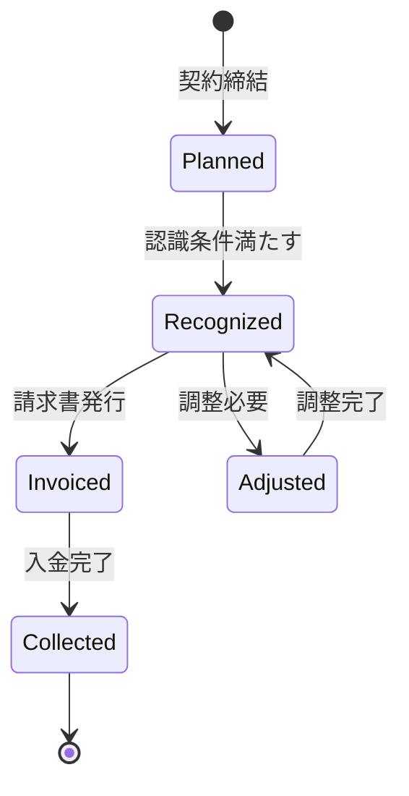

**KPI**:
- **収益認識の適時性**: 契約条件達成後5営業日以内に認識
- **収益認識の正確性**: 会計監査での指摘事項ゼロ
- **未収収益の比率**: 総収益の15%以内

**ビジネスルール**:
- 成果物納品型契約: 納品完了時に一括認識
- 期間按分型契約: 月次で按分して認識
- マイルストーン型契約: 各マイルストーン達成時に認識
- 為替レート: 収益認識日のレートを適用

**入力**:
- 契約情報（契約タイプ、金額、期間）
- プロジェクト進捗情報（完了率、納品日）
- 会計基準（適用する収益認識基準）

**出力**:
- 収益レコード（revenueId、金額、認識日）
- 会計仕訳データ
- 収益レポート

**例外処理**:
- **契約変更**: 変更契約に基づき収益を再計算
- **返品・返金**: 返金額を収益から減額
- **為替変動**: 大幅な為替変動時は調整仕訳

**派生ユースケース**:
1. 固定報酬型の収益を認識する
2. 工数精算型の収益を認識する
3. マイルストーン型の収益を認識する
4. 収益認識の調整処理を行う

---

### オペレーション1-2: 請求書を発行し入金を管理する

**パターン**: Workflow

**目的**: タイムリーに請求書を発行し、入金状況を管理して売掛金回収を確実にする

**ゴール**: 請求書が期限内に発行され、入金が計画通りに回収される

**関係者とロール**:
- **財務マネージャー**: 請求書発行、入金確認
- **PM**: 請求根拠資料の提供
- **クライアント**: 請求書受領、支払い実行

**プロセスフロー**:
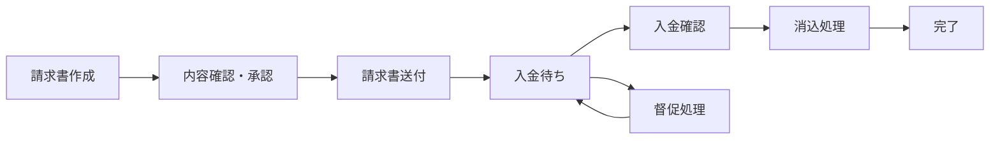

**ビジネス状態遷移**:
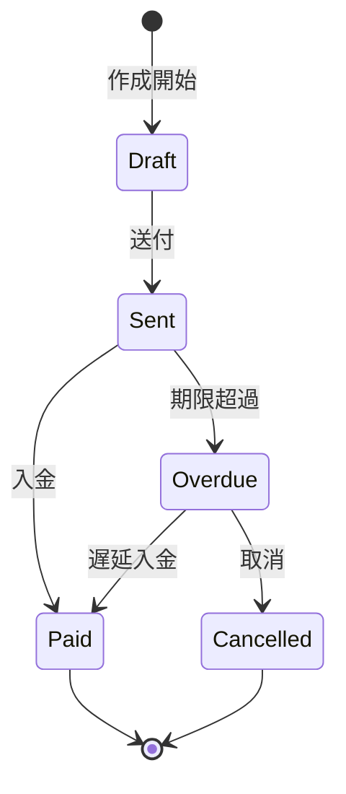

**KPI**:
- **請求書発行リードタイム**: 納品後5営業日以内に発行
- **入金回収率**: 期限内回収率95%以上
- **DSO（売掛金回収期間）**: 平均45日以内
- **督促対応率**: 期限超過後3日以内に督促開始

**ビジネスルール**:
- 請求サイクル: 月末締め翌月末払い
- 督促: 期限超過3日後に第1督促、7日後に第2督促
- 早期支払い割引: 期限前支払いで2%割引
- 分割払い: 一定額以上は分割払い可能

**入力**:
- 収益データ（請求対象の収益情報）
- 請求先情報（クライアント情報、請求先住所）
- 支払条件（支払期限、支払方法）

**出力**:
- 請求書（PDF）
- 請求データ（invoiceId、金額、期限）
- 入金予定表
- 督促リスト

**例外処理**:
- **請求書誤り**: 訂正請求書の発行
- **入金額相違**: 差額の原因調査と調整
- **未入金**: 督促エスカレーションフロー

**派生ユースケース**:
1. 請求書を作成する
2. 請求書を送付する
3. 入金状況を確認する
4. 督促を実施する
5. 消込処理を行う

---

### オペレーション1-3: 収益を予測し機会を最大化する

**パターン**: Analytics

**目的**: 将来の収益を予測し、収益機会を特定して最大化する

**ゴール**: 精度の高い収益予測が作成され、収益機会が特定・実行される

**関係者とロール**:
- **エグゼクティブ**: 収益目標の設定、戦略的意思決定
- **財務マネージャー**: 収益予測の作成、分析
- **PM**: プロジェクト見込み情報の提供

**プロセスフロー**:


**ビジネス状態遷移**:
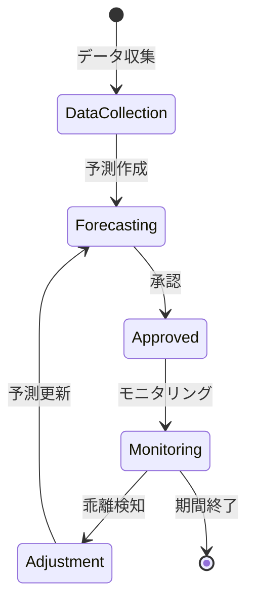

**KPI**:
- **予測精度**: 実績との乖離10%以内
- **予測更新頻度**: 月次更新
- **収益機会実現率**: 特定した機会の60%以上を実現
- **追加収益額**: 年間総収益の5%以上を追加獲得

**ビジネスルール**:
- 3つのシナリオ: 楽観的、現実的、悲観的
- 信頼度: 過去データと前提条件に基づく信頼度を算出
- 更新トリガー: 大型契約獲得、プロジェクト変更時に即時更新

**入力**:
- 過去の収益実績データ
- 進行中プロジェクトの見込み
- 営業パイプライン情報
- 市場環境データ

**出力**:
- 収益予測レポート（月次、四半期、年次）
- シナリオ分析結果
- 収益機会リスト
- アクションプラン

**例外処理**:
- **大幅な乖離**: 予測モデルの見直し
- **市場急変**: 緊急予測更新
- **データ不足**: 類似プロジェクトデータで補完

**派生ユースケース**:
1. 収益予測を作成する
2. シナリオ分析を実施する
3. 収益機会を特定する
4. 予測と実績の乖離を分析する

---

## 2. コストを統制し最適化する能力

### 定義
プロジェクト遂行に伴うコストを正確に記録・配賦し、コスト構造を分析して最適化する組織能力

### 責務
- コストの正確な記録と分類
- プロジェクトへの適切なコスト配賦
- コスト超過の早期検知とアラート
- コスト最適化の提案と実行

### 提供価値
- **コスト可視化**: 詳細なコスト構造の把握により、無駄なコストを特定
- **利益率改善**: コスト削減により、プロジェクト利益率を向上
- **予算統制**: リアルタイムなコスト監視により、予算超過を防止

### 実現手段
以下のビジネスオペレーションで実現：
- コストを記録し配賦する
- コストを分析し最適化する
- コスト承認を実施する

---

### オペレーション2-1: コストを記録し配賦する

**パターン**: Workflow + CRUD

**目的**: 発生したコストを正確に記録し、プロジェクトや部門に適切に配賦する

**ゴール**: すべてのコストが正確に記録され、適切な配賦基準でプロジェクトに割り当てられる

**関係者とロール**:
- **財務マネージャー**: コスト記録、配賦処理
- **PM**: 直接コストの確認、配賦承認
- **従業員**: 経費申請

**プロセスフロー**:


**ビジネス状態遷移**:
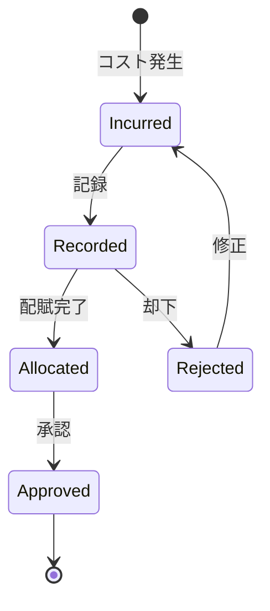

**KPI**:
- **記録タイムリネス**: コスト発生後5営業日以内に記録
- **配賦精度**: 誤配賦率1%以下
- **未配賦コスト比率**: 総コストの3%以内
- **承認処理時間**: 記録後3営業日以内に承認

**ビジネスルール**:
- 直接コスト: プロジェクトに直接配賦
- 間接コスト: 工数比率で按分配賦
- 固定資産: 1年以上使用は資産計上後、減価償却
- 承認権限: 1万円以上はマネージャー承認必須

**入力**:
- コスト発生情報（金額、発生日、ベンダー）
- コストタイプ（Labor、Material、Subcontract、Travel、Other）
- プロジェクト情報（配賦先プロジェクト）
- 配賦基準（工数、売上比率など）

**出力**:
- コストレコード（costId、金額、分類）
- 配賦レコード（プロジェクト別コスト）
- コスト集計レポート

**例外処理**:
- **配賦先不明**: 暫定配賦後、後日精算
- **金額誤り**: 修正仕訳で対応
- **承認遅延**: エスカレーション処理

**派生ユースケース**:
1. 人件費コストを記録する
2. 外注費コストを記録する
3. 経費コストを記録する
4. コストを配賦する
5. 配賦を調整する

---

### オペレーション2-2: コストを分析し最適化する

**パターン**: Analytics

**目的**: コスト構造を分析し、無駄なコストを特定して削減案を提案する

**ゴール**: コスト削減機会が特定され、実行可能な最適化提案が作成される

**関係者とロール**:
- **エグゼクティブ**: コスト削減方針の承認
- **財務マネージャー**: コスト分析、最適化提案
- **PM**: プロジェクトレベルのコスト改善

**プロセスフロー**:


**ビジネス状態遷移**:
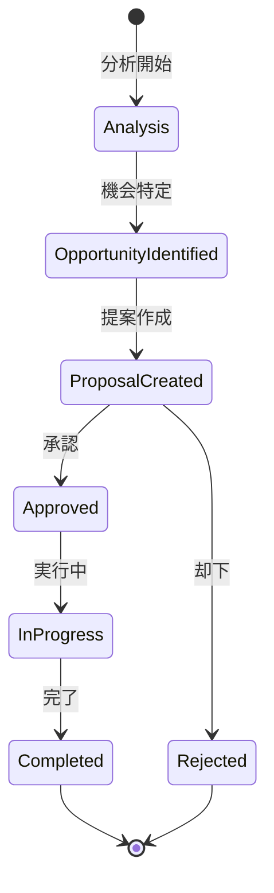

**KPI**:
- **コスト削減率**: 年間総コストの5%以上削減
- **分析頻度**: 月次で主要プロジェクトを分析
- **提案実行率**: 承認された提案の80%以上を実行
- **ROI**: コスト削減施策のROI 300%以上

**ビジネスルール**:
- 予算差異20%以上は詳細分析実施
- 削減案は費用対効果を定量評価
- 品質・納期に影響する削減は不可

**入力**:
- コスト実績データ（プロジェクト別、カテゴリ別）
- 予算データ
- 業界ベンチマークデータ
- プロジェクト成果指標

**出力**:
- コスト分析レポート
- 予算実績差異分析レポート
- コスト削減提案書
- 実行計画書

**例外処理**:
- **データ不足**: 推定値で補完、信頼度を明示
- **外部要因**: 為替、市場価格変動を考慮
- **提案却下**: 却下理由を記録、代替案検討

**派生ユースケース**:
1. コスト構造を分析する
2. 予算実績差異を分析する
3. コスト削減機会を特定する
4. 最適化提案を作成する

---

### オペレーション2-3: コスト承認を実施する

**パターン**: Workflow

**目的**: 一定額以上のコストや例外的なコストに対して適切な承認プロセスを実行する

**ゴール**: 承認が必要なコストが適切な権限者によって承認され、不正支出が防止される

**関係者とロール**:
- **申請者**: コスト発生の申請
- **承認者**: 権限に応じた承認判断
- **財務マネージャー**: 承認プロセスの監視

**プロセスフロー**:
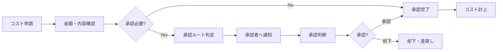

**ビジネス状態遷移**:
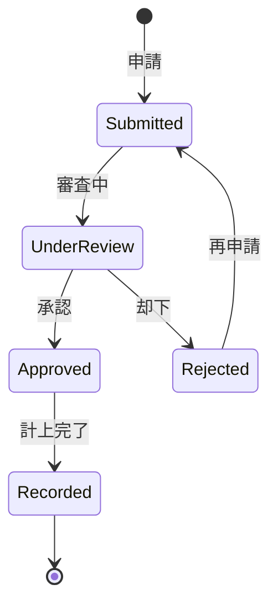

**KPI**:
- **承認処理時間**: 平均2営業日以内
- **承認率**: 85%以上（適切な事前チェックの指標）
- **却下後再承認率**: 却下案件の70%が修正後承認
- **承認遅延件数**: 月間5件以下

**ビジネスルール**:
- 1万円未満: 自動承認
- 1万円以上10万円未満: マネージャー承認
- 10万円以上100万円未満: 部門長承認
- 100万円以上: 役員承認
- 緊急案件: 口頭承認後、事後申請可

**入力**:
- コスト申請情報（金額、目的、根拠資料）
- 申請者情報
- 承認ルール

**出力**:
- 承認結果（承認/却下）
- 承認履歴
- 承認待ちリスト

**例外処理**:
- **承認者不在**: 代理承認者へ自動エスカレーション
- **承認期限超過**: 上位承認者へ通知
- **承認後の取消**: 取消理由記録、再審査

**派生ユースケース**:
1. コストを申請する
2. コストを承認する
3. コストを却下する
4. 承認状況を確認する

---

## 3. 予算を策定し統制する能力

### 定義
プロジェクトや部門の予算を策定し、執行状況を監視して予算を適切に統制する組織能力

### 責務
- 現実的で達成可能な予算の策定
- 予算執行状況のリアルタイム監視
- 予算超過の早期検知とアラート
- 予算改訂と再配分の実施

### 提供価値
- **計画的な資金運用**: 予算に基づく計画的な支出により、資金繰りを安定化
- **予算統制**: リアルタイムな監視により、予算超過を未然に防止
- **柔軟な資源配分**: 状況に応じた予算改訂により、最適な資源配分を実現

### 実現手段
以下のビジネスオペレーションで実現：
- 予算を策定し承認する
- 予算執行を監視し統制する
- 予算を改訂し再配分する

---

### オペレーション3-1: 予算を策定し承認する

**パターン**: Workflow

**目的**: プロジェクトや部門の予算を策定し、承認を得る

**ゴール**: 承認された予算が確定し、プロジェクト実行の基準となる

**関係者とロール**:
- **エグゼクティブ**: 予算方針の決定、最終承認
- **財務マネージャー**: 予算案の作成、調整
- **PM**: プロジェクト予算の見積もり

**プロセスフロー**:
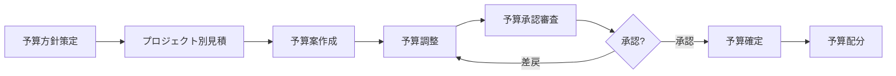

**ビジネス状態遷移**:
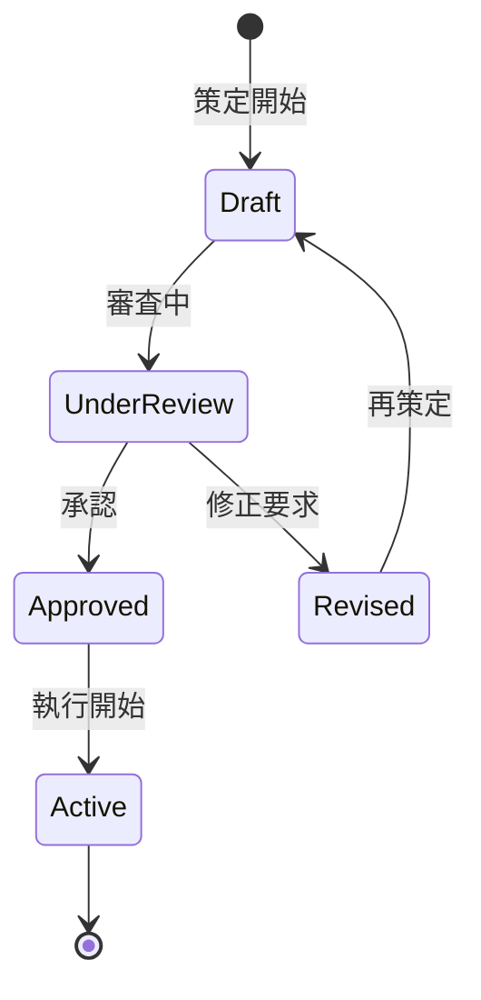

**KPI**:
- **策定期間**: 会計年度開始2ヶ月前に承認完了
- **予算承認率**: 初回提出で70%以上が承認
- **予算精度**: 年度末実績との乖離15%以内
- **予算配分完了**: 承認後1週間以内に各部門へ配分

**ビジネスルール**:
- 年度予算: 会計年度開始前に策定
- プロジェクト予算: プロジェクト開始前に策定
- 予備費: 総予算の10%を予備費として確保
- 承認権限: 部門予算は役員承認、プロジェクト予算は部門長承認

**入力**:
- 前年度実績データ
- プロジェクト計画（期間、スコープ、リソース）
- 市場動向・成長目標
- 経営方針

**出力**:
- 予算書（総予算、項目別予算）
- 予算配分計画
- 承認記録

**例外処理**:
- **予算超過要求**: 正当化根拠の提示、代替案検討
- **予算不足**: 優先順位付け、フェーズ分割
- **承認遅延**: 暫定予算の設定

**派生ユースケース**:
1. 年度予算を策定する
2. プロジェクト予算を策定する
3. 予算を調整する
4. 予算を承認する

---

### オペレーション3-2: 予算執行を監視し統制する

**パターン**: Analytics + Communication

**目的**: 予算の執行状況をリアルタイムに監視し、予算超過を防止する

**ゴール**: 予算超過が早期に検知され、適切な対策が実行される

**関係者とロール**:
- **エグゼクティブ**: 予算超過アラートの受信、判断
- **財務マネージャー**: 予算執行状況の監視、レポート作成
- **PM**: プロジェクト予算の管理、対策実施

**プロセスフロー**:
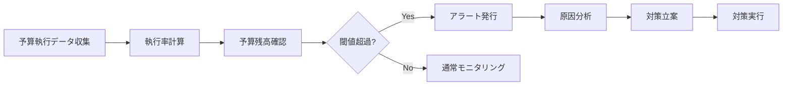

**ビジネス状態遷移**:
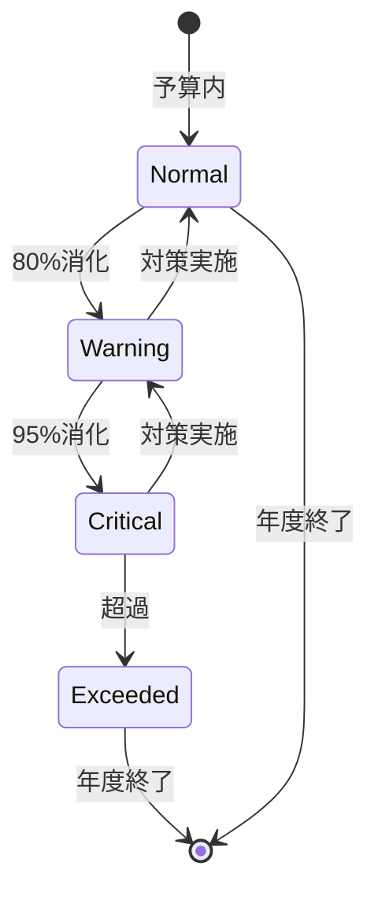

**KPI**:
- **監視頻度**: 週次で執行状況を更新
- **アラート対応時間**: アラート発生後24時間以内に対策立案
- **予算超過防止率**: 95%以上のプロジェクトが予算内で完了
- **レポート配信**: 月次で全ステークホルダーへ配信

**ビジネスルール**:
- 80%消化: 警告アラート、PM・財務に通知
- 95%消化: 重大アラート、役員へエスカレーション
- 100%超過: 即座に支出停止、承認なしの追加支出禁止

**入力**:
- 予算データ（総予算、配分済み予算）
- 実績コストデータ
- 予算消化率

**出力**:
- 予算執行レポート（執行率、残高、予測）
- アラート通知
- 対策提案

**例外処理**:
- **急激な消化率上昇**: 緊急調査、支出一時停止
- **データ遅延**: 暫定データで監視、後日精算
- **複数プロジェクト超過**: ポートフォリオレベルで再配分検討

**派生ユースケース**:
1. 予算執行状況を確認する
2. 予算超過アラートを受信する
3. 予算差異を分析する
4. 予算統制レポートを作成する

---

### オペレーション3-3: 予算を改訂し再配分する

**パターン**: Workflow

**目的**: 状況変化に応じて予算を改訂し、最適な予算配分を実現する

**ゴール**: 改訂された予算が承認され、プロジェクトに再配分される

**関係者とロール**:
- **エグゼクティブ**: 予算改訂の承認
- **財務マネージャー**: 改訂案の作成、調整
- **PM**: 改訂理由の説明、影響評価

**プロセスフロー**:
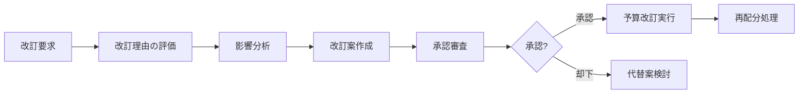

**ビジネス状態遷移**:
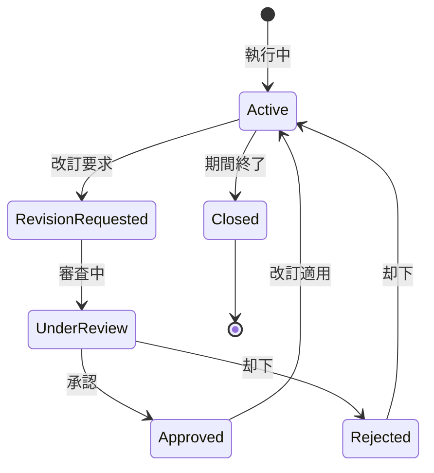

**KPI**:
- **改訂処理時間**: 改訂要求から承認まで2週間以内
- **改訂承認率**: 80%以上（適切な事前評価の指標）
- **改訂回数**: 年度内の改訂は3回以内に抑制
- **改訂後の予算達成率**: 改訂予算の90%以上を達成

**ビジネスルール**:
- 20%以上の増減: 役員承認必須
- 改訂理由: スコープ変更、市場変動、リスク顕在化のみ認める
- 改訂履歴: すべての改訂を記録、監査可能にする

**入力**:
- 改訂要求（理由、金額、影響範囲）
- 現行予算データ
- 予算執行実績
- プロジェクト変更情報

**出力**:
- 改訂予算書
- 改訂理由書
- 再配分計画
- 改訂履歴

**例外処理**:
- **緊急改訂**: 口頭承認後、事後申請可
- **承認却下**: 代替案（スコープ削減、フェーズ分割）検討
- **頻繁な改訂**: プロジェクト計画の見直し要求

**派生ユースケース**:
1. 予算改訂を要求する
2. 改訂理由を評価する
3. 予算を改訂する
4. 予算を再配分する

---

## 4. 収益性を分析し改善する能力

### 定義
プロジェクトやビジネス全体の収益性を分析し、利益率を改善するための施策を立案・実行する組織能力

### 責務
- プロジェクト別・クライアント別の収益性分析
- 利益率の低いプロジェクトの特定と要因分析
- 収益性改善施策の立案と実行
- キャッシュフロー管理

### 提供価値
- **利益最大化**: 高収益プロジェクトへの注力により、全社利益を最大化
- **意思決定支援**: 収益性データに基づく戦略的意思決定
- **リスク低減**: 低収益プロジェクトの早期特定により、損失を最小化

### 実現手段
以下のビジネスオペレーションで実現：
- 収益性を分析し評価する
- 収益性改善施策を立案し実行する
- キャッシュフローを予測し最適化する

---

### オペレーション4-1: 収益性を分析し評価する

**パターン**: Analytics

**目的**: プロジェクトやビジネス全体の収益性を分析し、評価する

**ゴール**: 各プロジェクトの収益性が可視化され、改善すべき領域が特定される

**関係者とロール**:
- **エグゼクティブ**: 収益性評価の確認、戦略的判断
- **財務マネージャー**: 収益性分析の実施、レポート作成
- **PM**: プロジェクト収益性の説明、要因分析

**プロセスフロー**:


**ビジネス状態遷移**:
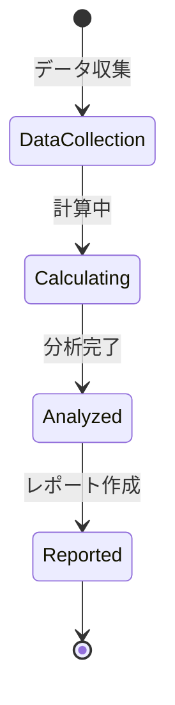

**KPI**:
- **分析頻度**: 月次で全プロジェクトを分析
- **分析カバー率**: 全プロジェクトの95%以上をカバー
- **レポート配信**: 月末締め後5営業日以内に配信
- **改善対象特定**: 利益率20%未満のプロジェクトを特定

**ビジネスルール**:
- 粗利率: (収益 - 直接コスト) / 収益
- 営業利益率: (収益 - 総コスト) / 収益
- ROI: (純利益 / 投資額) × 100
- ベンチマーク: 業界平均、社内平均と比較

**入力**:
- 収益データ（プロジェクト別、クライアント別）
- コストデータ（直接コスト、間接コスト）
- 工数データ
- 業界ベンチマークデータ

**出力**:
- 収益性分析レポート
- プロジェクト別損益計算書
- 利益率ランキング
- 改善対象リスト

**例外処理**:
- **データ不完全**: 暫定値で計算、後日補正
- **異常値**: 外れ値分析、原因特定
- **計算エラー**: エラーログ記録、手動検証

**派生ユースケース**:
1. プロジェクト別収益性を分析する
2. クライアント別収益性を分析する
3. 収益性要因を分析する
4. ベンチマーク比較を行う

---

### オペレーション4-2: 収益性改善施策を立案し実行する

**パターン**: Workflow + Analytics

**目的**: 収益性分析に基づき、具体的な改善施策を立案し実行する

**ゴール**: 収益性改善施策が実行され、利益率が向上する

**関係者とロール**:
- **エグゼクティブ**: 改善方針の決定、承認
- **財務マネージャー**: 改善施策の立案、効果測定
- **PM**: 施策の実行、進捗報告

**プロセスフロー**:
```mermaid
flowchart LR
    A[低収益性プロジェクト特定] --> B[要因の深堀分析]
    B --> C[改善施策の立案]
    C --> D[費用対効果評価]
    D --> E[施策承認]
    E --> F[実行計画策定]
    F --> G[施策実行]
    G --> H[効果測定]
```

**ビジネス状態遷移**:
```mermaid
stateDiagram-v2
    [*] --> Identified: 課題特定
    Identified --> Planning: 施策立案
    Planning --> Approved: 承認
    Approved --> InProgress: 実行中
    InProgress --> Completed: 完了
    Completed --> Evaluated: 効果測定
    Evaluated --> [*]

    Planning --> Rejected: 却下
    Rejected --> [*]
```

**KPI**:
- **改善施策実行率**: 立案した施策の80%以上を実行
- **利益率改善**: 施策実行後、平均5ポイント改善
- **ROI**: 改善施策のROI 200%以上
- **効果測定**: 施策完了後3ヶ月以内に効果を測定

**ビジネスルール**:
- 改善優先度: 利益インパクト × 実行容易性で決定
- 施策カテゴリ: 収益拡大、コスト削減、効率化
- 承認基準: ROI 150%以上の施策を優先承認

**入力**:
- 収益性分析結果
- 要因分析結果
- 過去の改善事例
- リソース制約

**出力**:
- 改善施策提案書
- 実行計画書
- 効果測定レポート
- ベストプラクティス

**例外処理**:
- **施策失敗**: 原因分析、代替施策の検討
- **予期せぬ副作用**: 即座に施策中止、対策実施
- **リソース不足**: 優先順位再評価、フェーズ分割

**派生ユースケース**:
1. 収益性改善施策を立案する
2. 施策の費用対効果を評価する
3. 改善施策を実行する
4. 施策の効果を測定する

---

### オペレーション4-3: キャッシュフローを予測し最適化する

**パターン**: Analytics

**目的**: 将来のキャッシュフローを予測し、資金繰りを最適化する

**ゴール**: 精度の高いキャッシュフロー予測が作成され、資金不足が回避される

**関係者とロール**:
- **エグゼクティブ**: キャッシュフロー方針の決定
- **財務マネージャー**: キャッシュフロー予測、資金計画
- **PM**: プロジェクトの入金・支払予定情報提供

**プロセスフロー**:
```mermaid
flowchart LR
    A[入金予定の収集] --> B[支払予定の収集]
    B --> C[キャッシュフロー予測]
    C --> D[資金不足の検知]
    D --> E{不足あり?}
    E -->|Yes| F[資金調達計画]
    E -->|No| G[余剰資金運用計画]
    F --> H[実行・モニタリング]
    G --> H
```

**ビジネス状態遷移**:
```mermaid
stateDiagram-v2
    [*] --> Forecasting: 予測作成
    Forecasting --> Healthy: 健全
    Forecasting --> Warning: 注意
    Warning --> Critical: 深刻
    Critical --> ActionRequired: 対策必要
    ActionRequired --> Resolved: 解決
    Resolved --> Healthy: 改善
    Healthy --> [*]
```

**KPI**:
- **予測精度**: 実績との乖離10%以内
- **予測期間**: 3ヶ月先までを毎週更新
- **資金不足ゼロ**: 予測に基づく事前対策で資金不足を回避
- **DSO（売掛金回収期間）**: 平均45日以内

**ビジネスルール**:
- 予測シナリオ: 楽観的、現実的、悲観的の3シナリオ
- 資金不足閾値: 月次で運転資金の20%以下は警告
- 余剰資金: 運転資金の50%超過は運用検討

**入力**:
- 入金予定（請求書ベース）
- 支払予定（コスト・経費ベース）
- 過去のキャッシュフロー実績
- プロジェクト契約情報

**出力**:
- キャッシュフロー予測レポート
- 資金繰り表
- 資金調達計画
- 資金運用提案

**例外処理**:
- **大幅な入金遅延**: 緊急資金調達、支払延期交渉
- **予期せぬ大型支出**: 緊急予測更新、資金調達
- **予測精度低下**: 予測モデル見直し

**派生ユースケース**:
1. キャッシュフローを予測する
2. 資金不足を検知する
3. 資金調達計画を作成する
4. 余剰資金運用計画を作成する

---

## まとめ

収益最適化サービスは、4つのビジネスケーパビリティと12のビジネスオペレーションから構成され、組織の財務健全性を維持し、収益性を最大化します。

各オペレーションは明確なゴール、KPI、ビジネスルールを持ち、プロセスフローと状態遷移が定義されています。これにより、収益認識から予算統制、収益性改善まで、財務管理の全プロセスが体系的に管理されます。