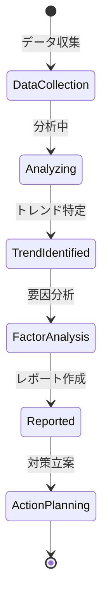

# ビジネスオペレーション: 収益性トレンドを分析する

**バージョン**: 1.0.0
**更新日**: 2025-10-01

## 概要

**目的**: プロジェクトやビジネス全体の収益性トレンドを時系列で分析し、傾向と変化要因を特定する

**パターン**: Analytics

**ゴール**: 収益性の時系列トレンドが可視化され、改善または悪化の要因が特定される

## 関係者とロール

- **エグゼクティブ**: トレンド分析結果の確認、戦略的判断
- **財務マネージャー**: トレンド分析の実施、要因分析、レポート作成
- **PM**: プロジェクト変動要因の説明、改善策の提案

## プロセスフロー

> **重要**: プロセスフローは必ず番号付きリスト形式で記述してください。
> Mermaid形式は使用せず、テキスト形式で記述することで、代替フローと例外フローが視覚的に分離されたフローチャートが自動生成されます。

1. システムがデータ収集を処理する
2. システムが時系列データ整理を処理する
3. システムがトレンド可視化を処理する
4. システムがパターン分析を処理する
5. システムが変動要因特定を処理する
6. システムが予測モデル構築を処理する
7. システムがレポート作成を行う
8. システムが経営層への報告を処理する

## 代替フロー

### 代替フロー1: 情報不備
- 2-1. システムが情報の不備を検知する
- 2-2. システムが修正要求を送信する
- 2-3. ユーザーが情報を修正し再実行する
- 2-4. 基本フロー2に戻る

## 例外処理

### 例外1: システムエラー
- システムエラーが発生した場合
- エラーメッセージを表示する
- 管理者に通知し、ログに記録する

### 例外2: 承認却下
- 承認が却下された場合
- 却下理由をユーザーに通知する
- 修正後の再実行を促す

## ビジネス状態

## KPI

- **分析頻度**: 月次でトレンド分析を実施
- **分析カバー期間**: 最低12ヶ月分のデータを分析
- **要因特定精度**: 変動要因の80%以上を特定
- **レポート配信**: 月末締め後7営業日以内に配信

## ビジネスルール

- トレンド分析期間: 最低12ヶ月、推奨24ヶ月
- 異常値の定義: 平均値±3標準偏差を超える値
- 季節性調整: 季節変動が大きい場合は季節調整を適用
- ベンチマーク比較: 業界平均、社内平均、過去ベストと比較
- アラート基準: 3ヶ月連続で悪化トレンドの場合は警告
- 予測モデル: 移動平均、指数平滑化、回帰分析から選択

## 入出力仕様

### 入力

- **収益性時系列データ**: 月次・四半期の粗利率、営業利益率、ROI
- **プロジェクト情報**: プロジェクト開始/終了、規模、クライアント
- **市場データ**: 業界動向、経済指標、競合情報
- **コストデータ**: 人件費、外注費、経費の推移

### 出力

- **トレンド分析レポート**: トレンドグラフ、統計サマリー、要因分析
- **予測レポート**: 将来の収益性予測（楽観/現実/悲観シナリオ）
- **アラート通知**: 悪化トレンドの早期警告
- **改善提言**: トレンドに基づく改善策の提案

## 例外処理

- **データ欠損**: 補完または除外、信頼度を明示
- **異常値**: 原因調査、除外または別途分析
- **トレンド不明確**: より長期データで再分析
- **予測精度低下**: モデルの見直し、追加変数の検討

## 派生ユースケース

このビジネスオペレーションから以下のユースケースが派生します：

1. 月次収益性トレンドを分析する
2. プロジェクト別収益性トレンドを比較する
3. 収益性変動要因を特定する
4. 将来の収益性トレンドを予測する
