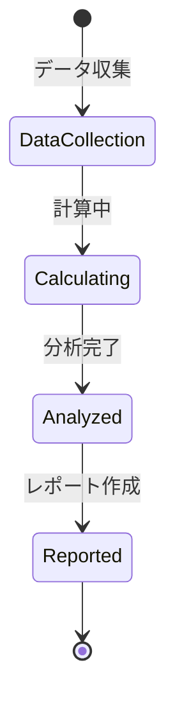

# ビジネスオペレーション: 収益性を計算する

**バージョン**: 1.0.0
**更新日**: 2025-09-30

## 概要

**目的**: プロジェクトやビジネス全体の収益性を分析し、評価する

**パターン**: Analytics

**ゴール**: 各プロジェクトの収益性が可視化され、改善すべき領域が特定される

## 関係者とロール

- **エグゼクティブ**: 収益性評価の確認、戦略的判断
- **財務マネージャー**: 収益性分析の実施、レポート作成
- **PM**: プロジェクト収益性の説明、要因分析

## プロセスフロー

> **重要**: プロセスフローは必ず番号付きリスト形式で記述してください。
> Mermaid形式は使用せず、テキスト形式で記述することで、代替フローと例外フローが視覚的に分離されたフローチャートが自動生成されます。

1. システムがデータ収集を処理する
2. システムが収益性計算を処理する
3. システムがプロジェクト別分析を処理する
4. システムがクライアント別分析を処理する
5. システムが要因分析を処理する
6. システムがベンチマーク比較を処理する
7. システムが評価・レポート作成を行う

## 代替フロー

### 代替フロー1: 情報不備
- 2-1. システムが情報の不備を検知する
- 2-2. システムが修正要求を送信する
- 2-3. ユーザーが情報を修正し再実行する
- 2-4. 基本フロー2に戻る

## 例外処理

### 例外1: システムエラー
- システムエラーが発生した場合
- エラーメッセージを表示する
- 管理者に通知し、ログに記録する

### 例外2: 承認却下
- 承認が却下された場合
- 却下理由をユーザーに通知する
- 修正後の再実行を促す

## ビジネス状態

## KPI

- **分析頻度**: 月次で全プロジェクトを分析
- **分析カバー率**: 全プロジェクトの95%以上をカバー
- **レポート配信**: 月末締め後5営業日以内に配信
- **改善対象特定**: 利益率20%未満のプロジェクトを特定

## ビジネスルール

- 粗利率: (収益 - 直接コスト) / 収益 × 100
- 営業利益率: (収益 - 総コスト) / 収益 × 100
- ROI: (純利益 / 投資額) × 100
- ベンチマーク: 業界平均、社内平均と比較
- 評価基準: 粗利率30%以上、営業利益率20%以上を優良
- 分析期間: 過去12ヶ月のローリング分析

## 入出力仕様

### 入力

- **収益データ**: プロジェクト別、クライアント別、月次推移
- **コストデータ**: 直接コスト（人件費、外注費）、間接コスト（管理費、設備費）
- **工数データ**: プロジェクト別稼働時間、要員数
- **業界ベンチマークデータ**: 業界平均利益率、競合情報

### 出力

- **収益性分析レポート**: 粗利率、営業利益率、ROI、トレンド分析
- **プロジェクト別損益計算書**: 収益、コスト、利益の詳細
- **利益率ランキング**: 高収益・低収益プロジェクトの一覧
- **改善対象リスト**: 改善優先度、改善ポテンシャル

## 例外処理

- **データ不完全**: 暫定値で計算、後日補正、信頼度レベルの明示
- **異常値**: 外れ値分析、原因特定、除外判断の記録
- **計算エラー**: エラーログ記録、手動検証、再計算
- **複数通貨**: 為替レート統一、基準通貨への換算

## 派生ユースケース

このビジネスオペレーションから以下のユースケースが派生します：

1. プロジェクト別収益性を分析する
2. クライアント別収益性を分析する
3. 収益性要因を分析する
4. ベンチマーク比較を行う
