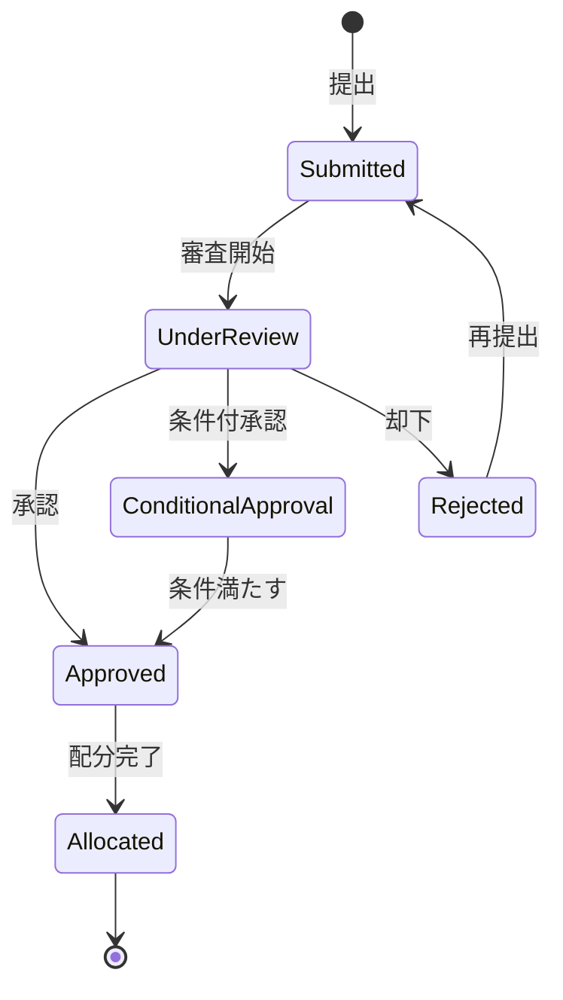

# ビジネスオペレーション: 予算を承認し確定する

**バージョン**: 1.0.0
**更新日**: 2025-10-01

## 概要

**目的**: 提出された予算案を審査し、承認または却下の判断を行い、承認された予算を確定する

**パターン**: Workflow

**ゴール**: 予算案が適切に審査され、承認された予算が確定してプロジェクト実行の基準となる

## 関係者とロール

- **エグゼクティブ**: 予算案の最終承認、戦略的判断
- **財務マネージャー**: 予算案の妥当性評価、分析資料作成
- **PM**: 予算案の説明、質疑応答

## プロセスフロー

> **重要**: プロセスフローは必ず番号付きリスト形式で記述してください。
> Mermaid形式は使用せず、テキスト形式で記述することで、代替フローと例外フローが視覚的に分離されたフローチャートが自動生成されます。

1. システムが予算案受領を処理する
2. システムが予算内容確認を実行する
3. システムが妥当性評価を処理する
4. システムがリスク分析を処理する
5. システムが承認審査会議を行う
6. システムが予算確定を処理する
7. システムが条件調整を処理する
8. システムが差戻しを処理する
9. システムが予算配分指示を処理する

## 代替フロー

### 代替フロー1: 情報不備
- 2-1. システムが情報の不備を検知する
- 2-2. システムが修正要求を送信する
- 2-3. ユーザーが情報を修正し再実行する
- 2-4. 基本フロー2に戻る

## 例外処理

### 例外1: システムエラー
- システムエラーが発生した場合
- エラーメッセージを表示する
- 管理者に通知し、ログに記録する

### 例外2: 承認却下
- 承認が却下された場合
- 却下理由をユーザーに通知する
- 修正後の再実行を促す

## ビジネス状態

## KPI

- **審査期間**: 提出後5営業日以内に承認判断
- **承認率**: 初回提出で70%以上が承認
- **条件付承認の解決**: 条件提示後3営業日以内に解決
- **却下後の再承認**: 却下案件の80%が修正後承認

## ビジネスルール

- 審査基準: 妥当性、実現可能性、リスク許容度
- 承認権限: 10億円未満は部門長、10億円以上は役員会
- 条件付承認: 軽微な修正で承認可能な場合に適用
- 却下理由: 根拠不十分、リスク過大、戦略不整合の場合
- 緊急予算: 緊急性が高い場合は暫定承認後、正式審査
- 審査記録: すべての審査過程と判断理由を記録

## 入出力仕様

### 入力

- **予算案**: 提出された予算書（総額、項目別内訳、根拠資料）
- **前年度実績**: 過去の予算実績データ
- **市場分析**: 業界動向、競合分析、市場予測
- **リスク評価**: プロジェクトリスク、市場リスク、財務リスク

### 出力

- **承認決定**: 承認/条件付承認/却下の判断結果
- **承認記録**: 承認日、承認者、承認条件、審査所見
- **確定予算書**: 承認された最終予算書
- **配分指示書**: 各部門・プロジェクトへの予算配分指示

## 例外処理

- **審査遅延**: 暫定承認で実行開始、事後正式承認
- **承認者不在**: 代理承認者の指名、または審査延期
- **意見不一致**: 追加情報収集、再審査実施
- **大幅修正必要**: 却下して全面見直し要求

## 派生ユースケース

このビジネスオペレーションから以下のユースケースが派生します：

1. 予算案の妥当性を評価する
2. 予算案を承認する
3. 予算案を却下する
4. 条件付承認の条件を調整する
