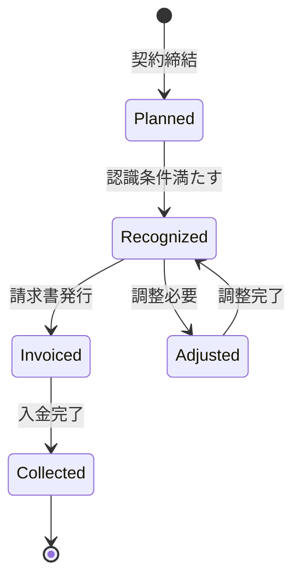

# ビジネスオペレーション: 収益を認識し計上する

**バージョン**: 1.0.0
**更新日**: 2025-09-30

## 概要

**目的**: 会計基準に準拠した適切なタイミングで収益を認識し、財務システムに計上する

**パターン**: Workflow + Analytics

**ゴール**: 正確な収益データが会計システムに反映され、財務報告が可能になる

## 関係者とロール

- **エグゼクティブ**: 収益方針の承認
- **財務マネージャー**: 収益認識基準の適用、会計処理
- **PM**: プロジェクト完了情報の提供

## プロセスフロー

> **重要**: プロセスフローは必ず番号付きリスト形式で記述してください。
> Mermaid形式は使用せず、テキスト形式で記述することで、代替フローと例外フローが視覚的に分離されたフローチャートが自動生成されます。

1. システムが契約締結を処理する
2. システムが収益認識基準の判定を処理する
3. システムがプロジェクト進捗の確認を実行する
4. システムが収益認識タイミングの判定を処理する
5. システムが収益計上処理を実行する
6. 財務システム連携
7. システムが収益データ確定を処理する

## 代替フロー

### 代替フロー1: 情報不備
- 2-1. システムが情報の不備を検知する
- 2-2. システムが修正要求を送信する
- 2-3. ユーザーが情報を修正し再実行する
- 2-4. 基本フロー2に戻る

## 例外処理

### 例外1: システムエラー
- システムエラーが発生した場合
- エラーメッセージを表示する
- 管理者に通知し、ログに記録する

### 例外2: 承認却下
- 承認が却下された場合
- 却下理由をユーザーに通知する
- 修正後の再実行を促す

## ビジネス状態

## KPI

- **収益認識の適時性**: 契約条件達成後5営業日以内に認識
- **収益認識の正確性**: 会計監査での指摘事項ゼロ
- **未収収益の比率**: 総収益の15%以内

## ビジネスルール

- 成果物納品型契約: 納品完了時に一括認識
- 期間按分型契約: 月次で按分して認識
- マイルストーン型契約: 各マイルストーン達成時に認識
- 為替レート: 収益認識日のレートを適用
- 収益認識は財務マネージャーの承認が必須
- 会計基準（IFRS15/ASC606）に準拠すること

## 入出力仕様

### 入力

- **契約情報**: 契約タイプ、金額、期間、マイルストーン
- **プロジェクト進捗情報**: 完了率、納品日、検収日
- **会計基準**: 適用する収益認識基準

### 出力

- **収益レコード**: revenueId、金額、認識日、会計期間
- **会計仕訳データ**: 借方・貸方、勘定科目
- **収益レポート**: 月次・四半期・年次の収益サマリー

## 例外処理

- **契約変更**: 変更契約に基づき収益を再計算、調整仕訳を作成
- **返品・返金**: 返金額を収益から減額、マイナス収益計上
- **為替変動**: 大幅な為替変動時は調整仕訳、為替差損益の計上
- **認識条件未達**: 収益認識を延期、繰延収益として計上

## 派生ユースケース

このビジネスオペレーションから以下のユースケースが派生します：

1. 固定報酬型の収益を認識する
2. 工数精算型の収益を認識する
3. マイルストーン型の収益を認識する
4. 収益認識の調整処理を行う