# ロバストネス図: ログアウトする

## 図の概要

### 対象ユースケース
- **ユースケース**: ログアウトする
- **目的**: ユーザーが安全にシステムからログアウトし、セッションを終了する
- **主アクター**: 組織メンバー（Executive、PM、Consultant、Client）

### 主要な流れ
ユーザーがログアウトを実行し、システムがセッションを無効化、トークンをブラックリストに登録し、ログイン画面に遷移する。

### 図の範囲
- **含む範囲**: ログアウト実行からセッション破棄、ログイン画面遷移まで
- **含まない範囲**: 強制ログアウト、セッションタイムアウト（別のユースケース）
- **前提**: ユーザーがログイン済みでセッションが有効である

## アクター

### 組織メンバー
- **役割**: システムを利用している認証済みユーザー
- **目的**: 作業終了時に安全にシステムから退出する
- **権限**: 自身のセッションの終了
- **関与**:
  - ログアウトボタンのクリック
  - 未保存データの確認
  - ログアウト実行の確認

### セキュリティ監査システム
- **役割**: ログアウトイベントの記録と分析
- **目的**: セキュリティ監査とセッション管理の追跡
- **権限**: 監査ログへの書き込み権限
- **関与**: ログアウトイベントの記録

## 境界要素

### ヘッダーメニュー
- **目的**: ログアウト操作の開始点を提供
- **提供機能**:
  - ユーザープロファイルアイコン
  - ドロップダウンメニュー
  - ログアウトメニュー項目
- **表示情報**:
  - ユーザー名
  - 現在のロール
  - 最終ログイン日時
- **受付操作**:
  - メニューの展開
  - ログアウトのクリック

### ログアウト確認ダイアログ
- **目的**: 意図しないログアウトを防ぐ確認
- **提供機能**:
  - ログアウト確認メッセージ
  - 未保存データの警告（該当する場合）
  - マルチデバイスログアウトオプション
  - 実行ボタン
  - キャンセルボタン
- **表示情報**:
  - 「ログアウトしますか?」確認メッセージ
  - 未保存の変更がある場合の警告
  - 「全てのデバイスからログアウト」チェックボックス
- **受付操作**:
  - マルチデバイスログアウトの選択
  - ログアウト実行のクリック
  - キャンセルのクリック

### ログイン画面
- **目的**: ログアウト後の初期画面を表示
- **提供機能**:
  - ログインフォーム
  - ログアウト完了メッセージ（一時的に表示）
- **表示情報**:
  - 「ログアウトしました」メッセージ
  - ログインフォーム
- **受付操作**:
  - 再ログインの受付

### 未保存データ警告
- **目的**: データ損失のリスクをユーザーに通知
- **提供機能**: 未保存データの一覧表示
- **表示情報**:
  - 未保存のフォームやドキュメント
  - 保存を促すメッセージ
- **受付操作**:
  - 保存してログアウト
  - 保存せずログアウト
  - キャンセル

## 制御要素

### ログアウトコントローラー
- **責務**: ログアウト処理全体のフロー制御
- **処理内容**:
  1. ヘッダーメニューからログアウト要求を受け取る
  2. 未保存データチェックサービスに確認を依頼する
  3. ログアウト確認ダイアログを表示する
  4. セッション無効化サービスにセッション破棄を依頼する
  5. トークンブラックリスト登録サービスにトークン無効化を依頼する
  6. マルチデバイスログアウトサービス（選択時）に全セッション破棄を依頼する
  7. 監査ログ記録サービスにログアウトイベントを記録させる
  8. ログイン画面に遷移させる
- **ビジネスルール**:
  - 未保存データがある場合は警告を表示
  - マルチデバイスログアウト選択時は全セッションを無効化
  - ログアウトは必ず監査ログに記録
- **判断基準**: 未保存データの有無、マルチデバイスログアウトの選択

### 未保存データチェックサービス
- **責務**: 現在のセッションで未保存のデータを検出
- **処理内容**:
  1. アプリケーション状態から編集中のフォームを取得
  2. 各フォームの保存状態を確認
  3. ブラウザのlocalStorage/sessionStorageをチェック
  4. 未保存データの一覧を作成
  5. 未保存の有無を返却
- **ビジネスルール**:
  - 編集開始から5分以上経過したフォームは警告対象
  - 自動保存済みのデータは未保存とみなさない
- **連携**:
  - 入力元: ログアウトコントローラー
  - 出力先: ログアウトコントローラー（未保存データ情報）

### セッション無効化サービス
- **責務**: 現在のセッションを無効化
- **処理内容**:
  1. セッショントークンをクッキーから取得
  2. JWTトークンをデコードしてセッションIDを取得
  3. セッションエンティティから該当セッションを取得
  4. セッションのステータスをinvalidatedに変更
  5. loggedOutAt（ログアウト日時）を現在時刻に設定
  6. データベースを更新
  7. httpOnlyクッキーを削除（有効期限を過去に設定）
- **ビジネスルール**:
  - セッション無効化は取り消し不可
  - クッキー削除は確実に実行
- **連携**:
  - 入力元: ログアウトコントローラー
  - 出力先: ログアウトコントローラー（処理結果）
  - データ更新: セッションエンティティ

### トークンブラックリスト登録サービス
- **責務**: JWTトークンをブラックリストに登録
- **処理内容**:
  1. JWTトークンのIDと有効期限を取得
  2. トークンブラックリストエンティティを作成
  3. トークンID、有効期限、登録日時を設定
  4. データベースに保存
  5. Redisキャッシュにも登録（高速検証用）
- **ビジネスルール**:
  - トークンの有効期限まではブラックリストに保持
  - 期限切れトークンは自動削除
- **連携**:
  - 入力元: ログアウトコントローラー
  - 出力先: ログアウトコントローラー（処理結果）
  - データ保存: トークンブラックリストエンティティ

### マルチデバイスログアウトサービス
- **責務**: ユーザーの全セッションを無効化
- **処理内容**:
  1. ユーザーIDから全ての有効セッションを取得
  2. 各セッションのステータスをinvalidatedに変更
  3. 各セッションのトークンをブラックリストに登録
  4. データベースを一括更新
- **ビジネスルール**:
  - 現在のセッション以外の全セッションを無効化
  - 無効化は不可逆的
- **連携**:
  - 入力元: ログアウトコントローラー
  - 出力先: ログアウトコントローラー（処理結果）
  - データ更新: セッションエンティティ（複数）

### 監査ログ記録サービス
- **責務**: ログアウトイベントの記録
- **処理内容**:
  1. タイムスタンプ、ユーザーID、IPアドレスを取得
  2. ログアウトタイプ（通常/マルチデバイス）を記録
  3. ログアウト前のセッション時間を計算
  4. 監査ログエンティティを作成
  5. データベースに保存
- **ビジネスルール**:
  - すべてのログアウトを記録
  - 90日間保持
- **連携**:
  - 入力元: ログアウトコントローラー
  - 出力先: 監査ログエンティティ

## エンティティ要素

### セッションエンティティ
- **情報内容**:
  - id: UUID（主キー）
  - userId: ユーザーID
  - tokenId: JWTトークンID
  - ipAddress: IPアドレス
  - userAgent: ブラウザ情報
  - deviceType: デバイス種別（Desktop, Mobile, Tablet）
  - status: ステータス（active, invalidated, expired）
  - createdAt: セッション開始日時
  - expiresAt: 有効期限
  - loggedOutAt: ログアウト日時（NULL: 継続中）
  - lastActivityAt: 最終アクティビティ日時
- **責務**: セッション情報の管理
- **永続性**: データベースに永続化（auth-service/data/auth.db）
- **整合性**: ステータス遷移は active → invalidated/expired のみ

### トークンブラックリストエンティティ
- **情報内容**:
  - id: UUID（主キー）
  - tokenId: JWTトークンID（ユニーク）
  - userId: ユーザーID
  - expiresAt: トークン有効期限
  - blacklistedAt: ブラックリスト登録日時
  - reason: 登録理由（LOGOUT, MULTI_DEVICE_LOGOUT, FORCE_LOGOUT）
- **責務**: 無効化されたトークンの管理
- **永続性**: データベース + Redisキャッシュ
- **整合性**: tokenIdはユニーク、有効期限後は自動削除

### ユーザーエンティティ
- **情報内容**:
  - id: UUID（主キー）
  - email: メールアドレス
  - lastLoginAt: 最終ログイン日時
  - lastLogoutAt: 最終ログアウト日時
- **責務**: ユーザーアカウント情報の管理
- **永続性**: データベースに永続化（auth-service/data/auth.db）
- **関連**: セッション管理で参照・更新される

### 監査ログエンティティ
- **情報内容**:
  - id: UUID
  - eventType: イベント種別（LOGOUT, MULTI_DEVICE_LOGOUT）
  - userId: ユーザーID
  - ipAddress: IPアドレス
  - userAgent: ブラウザ情報
  - sessionDuration: セッション継続時間（秒）
  - timestamp: タイムスタンプ
  - details: 詳細情報（デバイス数、未保存データ有無等）
- **責務**: セキュリティイベントの記録
- **永続性**: データベースに永続化（90日間保持）
- **整合性**: タイムスタンプ必須、userIdは外部キー

### 未保存データ値オブジェクト
- **情報内容**:
  - formId: フォームID
  - formName: フォーム名
  - lastModified: 最終更新日時
  - dataSize: データサイズ（概算）
- **責務**: 未保存データの情報保持
- **永続性**: メモリのみ（一時的）
- **更新頻度**: リアルタイム（フォーム編集時）

## 処理の流れ

### 基本フロー: 通常ログアウト
1. **開始**: アクター「組織メンバー」が「ヘッダーメニュー」でログアウトをクリック
2. **未保存確認**: 「ログアウトコントローラー」が「未保存データチェックサービス」に確認を依頼
3. **確認表示**: 「ログアウト確認ダイアログ」が表示される
4. **実行**: 「組織メンバー」がログアウト実行ボタンをクリック
5. **セッション無効化**: 「セッション無効化サービス」が「セッションエンティティ」を更新
6. **トークン登録**: 「トークンブラックリスト登録サービス」が「トークンブラックリスト」に登録
7. **ログ記録**: 「監査ログ記録サービス」が「監査ログエンティティ」に記録
8. **画面遷移**: 「ログイン画面」に遷移し、「ログアウトしました」メッセージを表示

### 代替フロー: 未保存データがある場合
- **分岐点**: 基本フロー ステップ2
- **条件**: 編集中のフォームに未保存データが存在
1. 「未保存データチェックサービス」が未保存データを検出
2. 「未保存データ警告」が表示される
3. 「組織メンバー」が「保存してログアウト」または「保存せずログアウト」を選択
4. 「保存してログアウト」選択時: データ保存後に基本フロー ステップ4に進む
5. 「保存せずログアウト」選択時: 直接基本フロー ステップ4に進む

### 代替フロー: マルチデバイスログアウト
- **分岐点**: 基本フロー ステップ3
- **条件**: 「全てのデバイスからログアウト」を選択
1. 「ログアウト確認ダイアログ」で「全てのデバイスからログアウト」チェックボックスをON
2. 「ログアウトコントローラー」がマルチデバイスフラグを検出
3. 「マルチデバイスログアウトサービス」が全セッションを取得
4. 各セッションの「セッションエンティティ」を無効化
5. 各トークンを「トークンブラックリスト」に登録
6. 「監査ログエンティティ」にマルチデバイスログアウトを記録
7. 基本フロー ステップ8に進む

### エラーフロー: セッション無効化失敗
- **発生点**: 基本フロー ステップ5
- **条件**: セッションが既に無効化されている、または存在しない
1. 「セッション無効化サービス」がセッション不在を検出
2. 「ログアウトコントローラー」にエラーを返却
3. クッキー削除のみ実行（フェイルセーフ）
4. 「ログイン画面」に遷移（エラーメッセージなし、ユーザー体験を損なわない）
5. 「監査ログエンティティ」に異常ログアウトを記録

### エラーフロー: キャンセル
- **発生点**: 基本フロー ステップ3、代替フロー（未保存データ）
- **条件**: ユーザーがキャンセルボタンをクリック
1. 「ログアウト確認ダイアログ」または「未保存データ警告」でキャンセル
2. ダイアログを閉じる
3. 元の画面に戻る（ログアウト処理を中止）
4. セッションは継続

## ロバストネス図

### Mermaidダイアグラム（BCE Pattern）

```mermaid
graph TB
    %% Actors
    User([👤 組織メンバー])
    AuditSystem([🔍 セキュリティ監査システム])

    %% Boundary Objects (UI)
    HeaderMenu[🖥️ ヘッダーメニュー]
    LogoutDialog[💬 ログアウト確認ダイアログ]
    UnsavedWarning[⚠️ 未保存データ警告]
    LoginPage[🔐 ログイン画面]

    %% Control Objects (Business Logic)
    LogoutController{{⚙️ ログアウトコントローラー}}
    UnsavedChecker{{🔍 未保存データチェックサービス}}
    SessionInvalidator{{🔒 セッション無効化サービス}}
    TokenBlacklist{{🚫 トークンブラックリスト登録サービス}}
    MultiDeviceLogout{{📱 マルチデバイスログアウトサービス}}
    AuditLogger{{📝 監査ログ記録サービス}}

    %% Entity Objects (Data)
    SessionEntity[(🗄️ セッションエンティティ)]
    TokenBlacklistEntity[(🚫 トークンブラックリスト)]
    UserEntity[(👤 ユーザーエンティティ)]
    AuditLogEntity[(📊 監査ログエンティティ)]
    UnsavedData[(💾 未保存データ値オブジェクト)]

    %% Flow 1: ログアウト要求
    User --> HeaderMenu
    HeaderMenu --> LogoutController
    LogoutController --> UnsavedChecker
    UnsavedChecker --> UnsavedData
    UnsavedChecker --> LogoutController

    %% Flow 2: 確認ダイアログ
    LogoutController --> LogoutDialog
    LogoutController --> UnsavedWarning
    User --> LogoutDialog
    User --> UnsavedWarning

    %% Flow 3: セッション無効化
    LogoutDialog --> LogoutController
    LogoutController --> SessionInvalidator
    SessionInvalidator --> SessionEntity

    %% Flow 4: トークンブラックリスト登録
    LogoutController --> TokenBlacklist
    TokenBlacklist --> TokenBlacklistEntity

    %% Flow 5: マルチデバイスログアウト
    LogoutController --> MultiDeviceLogout
    MultiDeviceLogout --> SessionEntity
    MultiDeviceLogout --> TokenBlacklistEntity

    %% Flow 6: 監査ログ記録
    LogoutController --> AuditLogger
    AuditLogger --> AuditLogEntity
    AuditLogger --> UserEntity
    AuditSystem --> AuditLogEntity

    %% Flow 7: ログイン画面遷移
    LogoutController --> LoginPage
    LoginPage --> User

    %% Styling
    classDef boundary fill:#e1f5fe,stroke:#01579b,stroke-width:2px
    classDef control fill:#fff3e0,stroke:#e65100,stroke-width:2px
    classDef entity fill:#f3e5f5,stroke:#4a148c,stroke-width:2px
    classDef actor fill:#e8f5e9,stroke:#1b5e20,stroke-width:2px

    class HeaderMenu,LogoutDialog,UnsavedWarning,LoginPage boundary
    class LogoutController,UnsavedChecker,SessionInvalidator,TokenBlacklist,MultiDeviceLogout,AuditLogger control
    class SessionEntity,TokenBlacklistEntity,UserEntity,AuditLogEntity,UnsavedData entity
    class User,AuditSystem actor
```



### 要素の凡例

**🖥️ Boundary（境界オブジェクト）**: ユーザーインターフェース要素
- ヘッダーメニュー、ログアウト確認ダイアログ、未保存データ警告、ログイン画面

**⚙️ Control（制御オブジェクト）**: ビジネスロジック・処理制御
- ログアウトコントローラー、各種サービス（チェック、無効化、ブラックリスト登録、監査ログ記録）

**🗄️ Entity（実体オブジェクト）**: データ・ドメインオブジェクト
- セッション、トークンブラックリスト、ユーザー、監査ログ、未保存データ

### テキスト表現
```
[組織メンバー] → [ヘッダーメニュー] : ログアウトクリック
              [ヘッダーメニュー] → [ログアウトコントローラー] : ログアウト要求
                                  [ログアウトコントローラー] → [未保存データチェックサービス] : 確認依頼
                                                               [未保存データチェックサービス] → [未保存データ] : データ確認
                                                               [未保存データチェックサービス] → [ログアウトコントローラー] : 確認結果
                                  [ログアウトコントローラー] → [ログアウト確認ダイアログ] : 確認表示

[組織メンバー] → [ログアウト確認ダイアログ] : 実行クリック
              [ログアウト確認ダイアログ] → [ログアウトコントローラー] : 実行要求
                                          [ログアウトコントローラー] → [セッション無効化サービス] : セッション破棄依頼
                                                                       [セッション無効化サービス] → [セッションエンティティ] : ステータス更新
                                          [ログアウトコントローラー] → [トークンブラックリスト登録サービス] : トークン無効化依頼
                                                                       [トークンブラックリスト登録サービス] → [トークンブラックリスト] : トークン登録
                                          [ログアウトコントローラー] → [監査ログ記録サービス] : ログ記録依頼
                                                                       [監査ログ記録サービス] → [監査ログエンティティ] : ログ保存
                                          [ログアウトコントローラー] → [ログイン画面] : 画面遷移
              [ログイン画面] → [組織メンバー] : ログアウト完了表示
```

### レイヤー別要素配置
```
プレゼンテーション層:
  [ヘッダーメニュー] -- [ログアウト確認ダイアログ] -- [未保存データ警告] -- [ログイン画面]

ビジネスロジック層:
  [ログアウトコントローラー] -- [未保存データチェックサービス] -- [セッション無効化サービス] -- [トークンブラックリスト登録サービス] -- [マルチデバイスログアウトサービス] -- [監査ログ記録サービス]

データ層:
  [セッションエンティティ] -- [トークンブラックリスト] -- [ユーザーエンティティ] -- [監査ログエンティティ] -- [未保存データ]
```

### 主要な相互作用
1. **確認フェーズ**: 組織メンバー → ヘッダーメニュー → ログアウトコントローラー → 未保存データチェックサービス
2. **無効化フェーズ**: セッション無効化サービス ↔ セッションエンティティ、トークンブラックリスト登録サービス ↔ トークンブラックリスト
3. **マルチデバイスフェーズ**: マルチデバイスログアウトサービス ↔ セッションエンティティ（複数）
4. **監査フェーズ**: 監査ログ記録サービス → 監査ログエンティティ
5. **完了フェーズ**: ログアウトコントローラー → ログイン画面 → 組織メンバー

## 設計上の注意点

### 責務の分離
- **境界要素**: ログアウト操作の受付と確認表示のみ（セッション管理ロジックを含まない）
- **制御要素**: ログアウト処理とセッション無効化（UI要素を含まない）
- **エンティティ**: データの保持のみ（ビジネスロジックを含まない）

### 結合度
- ログアウトコントローラーは各サービスと疎結合（インターフェース経由で連携）
- ヘッダーメニューはログアウトコントローラーとのみ通信
- セッション無効化とトークンブラックリスト登録は独立（片方が失敗しても他方は実行）

### 凝集度
- 未保存データチェックサービスはデータ確認のみに責務を限定
- セッション無効化サービスはセッション破棄のみに特化
- トークンブラックリスト登録サービスはトークン無効化のみを扱う

### 拡張性
- 新しいログアウトタイプ（自動ログアウト、強制ログアウト等）の追加が容易
- マルチデバイス管理の拡張（デバイス選択的ログアウト等）に対応可能
- セッション管理方式の変更（Redis、Memcached等）が他に影響しない

### エラー処理
- すべての境界要素でエラー表示が可能
- 制御要素でエラーを適切にハンドリング
- セッション無効化失敗時もユーザー体験を損なわない（フェイルセーフ）

## 実装への考慮事項

### パフォーマンス
- トークンブラックリストはRedisキャッシュで高速化
- マルチデバイスログアウトは非同期バッチ処理
- 期限切れトークンの自動削除は定期バッチで実行

### セキュリティ
- クッキー削除は確実に実行（有効期限を過去に設定）
- トークンブラックリストは有効期限まで保持（再利用防止）
- ログアウトイベントは必ず監査ログに記録
- マルチデバイスログアウトは全セッションを確実に無効化

### 保守性
- 未保存データ検出のロジックは拡張可能な設計
- トークンブラックリストの保持期間は設定値として外部化
- セッションタイムアウト時間は設定値として外部化
- ログアウト確認メッセージはi18n対応
