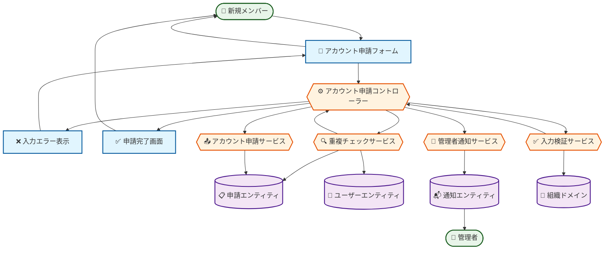

# ロバストネス図: ユーザーアカウントを申請する

## 図の概要

### 対象ユースケース
- **ユースケース**: ユーザーアカウントを申請する
- **目的**: 新規メンバーまたはクライアントがシステム利用のためのアカウント発行を申請する
- **主アクター**: 新規メンバー、クライアント

### 主要な流れ
新規ユーザーが組織のドメインメールアドレスと必要情報を入力し、システムが検証を行い、管理者へ承認待ちの申請として登録する。

### 図の範囲
- **含む範囲**: アカウント申請フォーム表示から申請登録完了までの基本フロー
- **含まない範囲**: 申請の承認・却下処理（別のユースケース）
- **前提**: 申請者が組織のメールドメインを持っている

## アクター

### 新規メンバー・クライアント
- **役割**: システム利用を希望する外部ユーザー
- **目的**: アカウント発行申請を行い、システムアクセス権を得る
- **権限**: 申請フォームへのアクセスのみ（認証不要）
- **関与**:
  - 申請フォームへのアクセス
  - 個人情報と申請理由の入力
  - 申請の送信

### 管理者
- **役割**: アカウント申請の承認権限を持つ組織メンバー
- **目的**: 適切な申請者にのみアカウントを発行する
- **権限**: 申請の承認・却下
- **関与**: 申請通知の受信（このユースケースでは受動的）

## 境界要素

### アカウント申請フォーム画面
- **目的**: 新規ユーザーから申請情報を受け取る
- **提供機能**:
  - 氏名入力フィールド（姓・名）
  - メールアドレス入力フィールド
  - 希望ロール選択（Consultant/Client）
  - 申請理由入力（テキストエリア）
  - 申請ボタン
  - キャンセルリンク
- **表示情報**:
  - 申請フォームのガイド文
  - 入力項目の説明
  - バリデーションルールの提示
  - 申請後のプロセス説明
- **受付操作**:
  - 各フィールドへの入力
  - ロール選択
  - 申請ボタンのクリック

### 申請完了画面
- **目的**: 申請受付完了を通知する
- **提供機能**: 申請完了メッセージの表示
- **表示情報**:
  - 申請受付番号
  - 承認待ちの状態通知
  - 承認にかかる期間の目安
  - 承認後のアクション案内
- **受付操作**: なし（情報表示のみ）

### 入力エラー表示
- **目的**: 入力ミスや検証エラーをユーザーに伝える
- **提供機能**: エラー内容の明示
- **表示情報**:
  - フィールドごとのエラーメッセージ
  - エラーの修正方法
  - 必須項目の強調表示
- **受付操作**: 修正後の再送信

## 制御要素

### アカウント申請コントローラー
- **責務**: アカウント申請処理全体のフロー制御
- **処理内容**:
  1. 申請フォームから入力情報を受け取る
  2. 入力検証サービスにバリデーションを依頼する
  3. 重複チェックサービスに既存申請・アカウントの確認を依頼する
  4. アカウント申請サービスに申請の登録を依頼する
  5. 通知サービスに管理者への通知を依頼する
  6. 申請完了画面に遷移させる
- **ビジネスルール**:
  - メールアドレスは組織ドメインのみ許可
  - 申請理由は10文字以上必須
  - 同一メールアドレスでの重複申請を禁止
- **判断基準**: 検証成功または失敗に応じた画面遷移

### 入力検証サービス
- **責務**: 申請情報の形式と妥当性の確認
- **処理内容**:
  1. メールアドレス形式の検証（RFC5322準拠）
  2. メールドメインの検証（組織ドメインリストと照合）
  3. 氏名の入力チェック（各1文字以上）
  4. 申請理由の文字数チェック（10文字以上）
  5. ロール選択の妥当性チェック
- **ビジネスルール**:
  - メールアドレスは必須かつ正しい形式
  - 組織ドメイン以外は申請不可
  - 申請理由は具体的な理由を記述（10文字以上）
- **連携**:
  - 入力元: アカウント申請コントローラー
  - 出力先: アカウント申請コントローラー（検証結果）

### 重複チェックサービス
- **責務**: 既存申請・アカウントとの重複確認
- **処理内容**:
  1. 申請エンティティから同一メールアドレスの申請を検索
  2. 有効期限内の申請の存在チェック
  3. ユーザーエンティティから同一メールアドレスのアカウントを検索
  4. 重複の有無を判定
- **ビジネスルール**:
  - 有効期限内（作成後30日以内）の申請が存在する場合は重複とみなす
  - 既にアカウントが存在する場合は申請不可
- **連携**:
  - 入力元: アカウント申請コントローラー
  - 出力先: アカウント申請コントローラー（重複判定結果）
  - データ参照: 申請エンティティ、ユーザーエンティティ

### アカウント申請サービス
- **責務**: アカウント申請データの作成と保存
- **処理内容**:
  1. 申請IDを生成（UUID）
  2. 申請ステータスを「pending」に設定
  3. 有効期限を30日後に設定
  4. 申請エンティティを作成
  5. データベースに保存
- **ビジネスルール**:
  - 申請ステータスは必ず「pending」で開始
  - 有効期限は作成日時+30日
  - 申請番号は一意（UUID）
- **連携**:
  - 入力元: アカウント申請コントローラー
  - 出力先: アカウント申請コントローラー（作成した申請情報）
  - データ保存: 申請エンティティ

### 管理者通知サービス
- **責務**: 新規申請を管理者に通知
- **処理内容**:
  1. 管理者ロールを持つユーザーを取得
  2. 通知内容を作成（申請者名、メールアドレス、申請理由）
  3. 通知エンティティを作成
  4. システム内通知を配信
  5. メール通知を送信（オプション）
- **ビジネスルール**:
  - 管理者ロール（Admin）を持つ全ユーザーに通知
  - 通知は即座に配信
- **連携**:
  - 入力元: アカウント申請コントローラー
  - 出力先: 通知エンティティ
  - データ参照: ユーザーエンティティ（管理者取得）

## エンティティ要素

### 申請エンティティ
- **情報内容**:
  - id: UUID（主キー）
  - email: メールアドレス
  - firstName: 名
  - lastName: 姓
  - requestedRole: 希望ロール（Consultant, Client）
  - reason: 申請理由（テキスト）
  - status: ステータス（pending, approved, rejected, expired）
  - createdAt: 申請日時
  - expiresAt: 有効期限（作成日時+30日）
  - processedAt: 処理日時（NULL: 未処理）
  - processedBy: 処理者ID（NULL: 未処理）
- **責務**: アカウント申請情報の管理
- **永続性**: データベースに永続化（auth-service/data/auth.db）
- **整合性**: メールアドレスはユニーク、ステータスは定義済み値のみ

### ユーザーエンティティ
- **情報内容**:
  - id: UUID（主キー）
  - email: メールアドレス
  - role: ロール（Executive, PM, Consultant, Client, Admin）
  - status: アカウント状態（Active, Locked, Suspended）
- **責務**: 既存ユーザーアカウント情報の管理
- **永続性**: データベースに永続化（auth-service/data/auth.db）
- **整合性**: メールアドレスはユニーク
- **関連**: 重複チェックで参照される

### 通知エンティティ
- **情報内容**:
  - id: UUID
  - recipientId: 通知先ユーザーID
  - type: 通知タイプ（ACCOUNT_REQUEST）
  - title: 通知タイトル
  - message: 通知内容
  - relatedId: 関連ID（申請ID）
  - isRead: 既読フラグ
  - createdAt: 作成日時
- **責務**: 管理者への通知情報の保持
- **永続性**: データベースに永続化（notification-service/data/notification.db）
- **整合性**: recipientIdはユーザーIDの外部キー

### 組織ドメイン値オブジェクト
- **情報内容**:
  - domain: ドメイン文字列（例: "example.com"）
  - organizationId: 組織ID
  - isActive: 有効フラグ
- **責務**: 許可されたメールドメインの定義
- **関連**: 入力検証サービスで参照
- **更新頻度**: 低頻度（組織設定変更時のみ）

## 処理の流れ

### 基本フロー
1. **開始**: アクター「新規メンバー」が「アカウント申請フォーム画面」にアクセス
2. **情報入力**: 「アカウント申請フォーム画面」で氏名、メールアドレス、ロール、申請理由を入力
3. **申請送信**: 「アカウント申請フォーム画面」が「アカウント申請コントローラー」に申請データを送信
4. **入力検証**: 「アカウント申請コントローラー」が「入力検証サービス」に検証を依頼
5. **検証実行**: 「入力検証サービス」が形式と必須項目をチェック
6. **重複確認**: 「アカウント申請コントローラー」が「重複チェックサービス」に重複確認を依頼
7. **重複判定**: 「重複チェックサービス」が「申請エンティティ」と「ユーザーエンティティ」を検索
8. **申請作成**: 「アカウント申請サービス」が「申請エンティティ」を作成
9. **通知配信**: 「管理者通知サービス」が「通知エンティティ」を作成し管理者に通知
10. **完了表示**: 「申請完了画面」がアクター「新規メンバー」に申請受付を通知

### 代替フロー: メールドメインが組織外の場合
- **分岐点**: 基本フロー ステップ5
- **条件**: 入力されたメールアドレスのドメインが組織ドメインリストに存在しない
1. 「入力検証サービス」がドメイン不一致を検出
2. 「入力エラー表示」に「組織のメールアドレスを使用してください」エラーを表示
3. アクターが正しいメールアドレスを入力
4. 基本フロー ステップ3に戻る

### エラーフロー: 重複申請の場合
- **発生点**: 基本フロー ステップ7
- **条件**: 同一メールアドレスで有効期限内の申請が存在する
1. 「重複チェックサービス」が重複を検出
2. 「アカウント申請コントローラー」が「入力エラー表示」にエラーを返却
3. 「入力エラー表示」に「既に申請済みです。承認をお待ちください」エラーを表示
4. アクターは別のメールアドレスで申請するか、管理者に連絡

### エラーフロー: 既存アカウントが存在する場合
- **発生点**: 基本フロー ステップ7
- **条件**: 同一メールアドレスでアカウントが既に存在する
1. 「重複チェックサービス」が既存アカウントを検出
2. 「入力エラー表示」に「既にアカウントが存在します。ログイン画面へ」エラーを表示
3. アクターはログイン画面へ遷移またはパスワードリセットを実行

## ロバストネス図

### Mermaidダイアグラム（BCE Pattern）



### 要素の凡例

**📝 Boundary（境界オブジェクト）**: ユーザーインターフェース要素
- アカウント申請フォーム、入力エラー表示、申請完了画面

**⚙️ Control（制御オブジェクト）**: ビジネスロジック・処理制御
- アカウント申請コントローラー、入力検証サービス、重複チェックサービス、アカウント申請サービス、管理者通知サービス

**📋 Entity（実体オブジェクト）**: データ・ドメインオブジェクト
- 申請エンティティ、ユーザーエンティティ、通知エンティティ、組織ドメイン

### テキスト表現
```
[新規メンバー] → [アカウント申請フォーム] : 情報入力
              [アカウント申請フォーム] → [アカウント申請コントローラー] : 申請データ送信
                                        [アカウント申請コントローラー] → [入力検証サービス] : 検証依頼
                                                                         [入力検証サービス] → [組織ドメイン] : ドメイン確認
                                                                         [入力検証サービス] → [アカウント申請コントローラー] : 検証結果
                                        [アカウント申請コントローラー] → [重複チェックサービス] : 重複確認依頼
                                                                         [重複チェックサービス] → [申請エンティティ] : 既存申請検索
                                                                         [重複チェックサービス] → [ユーザーエンティティ] : 既存アカウント検索
                                                                         [重複チェックサービス] → [アカウント申請コントローラー] : 判定結果
                                        [アカウント申請コントローラー] → [アカウント申請サービス] : 申請作成依頼
                                                                         [アカウント申請サービス] → [申請エンティティ] : 申請保存
                                        [アカウント申請コントローラー] → [管理者通知サービス] : 通知依頼
                                                                         [管理者通知サービス] → [通知エンティティ] : 通知作成
                                        [アカウント申請コントローラー] → [申請完了画面] : 画面遷移
              [申請完了画面] → [新規メンバー] : 申請受付完了表示
```

### レイヤー別要素配置
```
プレゼンテーション層:
  [アカウント申請フォーム] -- [入力エラー表示] -- [申請完了画面]

ビジネスロジック層:
  [アカウント申請コントローラー] -- [入力検証サービス] -- [重複チェックサービス] -- [アカウント申請サービス] -- [管理者通知サービス]

データ層:
  [申請エンティティ] -- [ユーザーエンティティ] -- [通知エンティティ] -- [組織ドメイン]
```

### 主要な相互作用
1. **入力フェーズ**: 新規メンバー → アカウント申請フォーム → アカウント申請コントローラー
2. **検証フェーズ**: 入力検証サービス ↔ 組織ドメイン、重複チェックサービス ↔ 申請エンティティ・ユーザーエンティティ
3. **登録フェーズ**: アカウント申請サービス → 申請エンティティ
4. **通知フェーズ**: 管理者通知サービス → 通知エンティティ
5. **完了フェーズ**: アカウント申請コントローラー → 申請完了画面 → 新規メンバー

## 設計上の注意点

### 責務の分離
- **境界要素**: 入力受付と結果表示のみ（検証ロジックを含まない）
- **制御要素**: 申請処理とドメインチェック（UI要素を含まない）
- **エンティティ**: データの保持のみ（ビジネスロジックを含まない）

### 結合度
- アカウント申請コントローラーは各サービスと疎結合（インターフェース経由で連携）
- 申請フォームはアカウント申請コントローラーとのみ通信
- エンティティは受動的（サービスから呼ばれるのみ）

### 凝集度
- 入力検証サービスは検証のみに責務を限定
- 重複チェックサービスは重複判定のみに特化
- アカウント申請サービスは申請作成のみを扱う

### 拡張性
- 新しい検証ルール（パスワードポリシー等）の追加が容易
- 通知方式の追加（Slack、Teams等）が独立して可能
- 承認フローの拡張（多段階承認等）に対応可能

### エラー処理
- すべての境界要素でエラー表示が可能
- 制御要素でエラーを適切にハンドリング
- エラー情報は利用者に分かりやすく伝達

## 実装への考慮事項

### パフォーマンス
- 重複チェックはメールアドレスにインデックスを付与
- 組織ドメインはメモリキャッシュで高速化
- 有効期限切れ申請は定期バッチで削除

### セキュリティ
- 申請フォームにはreCAPTCHA等のBot対策を実装
- 申請理由に個人情報や機密情報が含まれていないかチェック
- メールアドレスの漏洩防止（申請一覧でマスク表示）

### 保守性
- 組織ドメインリストは設定ファイルまたはDBで管理
- 有効期限（30日）は設定値として外部化
- 通知テンプレートは変更容易な設計
