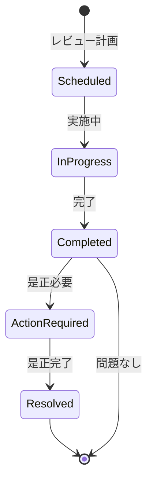

# ビジネスオペレーション: 権限を監査し見直す

**バージョン**: 1.0.0
**更新日**: 2025-10-01

## 概要

**目的**: 権限の利用状況を監査し、不要な権限を見直す

**パターン**: Analytics + Workflow

**ゴール**: すべての権限が必要最小限に保たれ、不正な権限が検知される

## 関係者とロール

- **監査担当**: 権限の監査、レビュー実施
- **管理者**: レビュー結果に基づく権限調整
- **部門長**: 部門内権限の妥当性確認

## プロセスフロー

> **重要**: プロセスフローは必ず番号付きリスト形式で記述してください。
> Mermaid形式は使用せず、テキスト形式で記述することで、代替フローと例外フローが視覚的に分離されたフローチャートが自動生成されます。

1. システムが権限データ収集を処理する
2. システムが利用状況分析を処理する
3. システムが異常検知を処理する
4. システムがレビュー実施を処理する
5. システムが不要権限特定を処理する
6. システムが調整提案を処理する
7. システムが承認を行う
8. システムが権限調整を処理する

## 代替フロー

### 代替フロー1: 情報不備
- 2-1. システムが情報の不備を検知する
- 2-2. システムが修正要求を送信する
- 2-3. ユーザーが情報を修正し再実行する
- 2-4. 基本フロー2に戻る

## 例外処理

### 例外1: システムエラー
- システムエラーが発生した場合
- エラーメッセージを表示する
- 管理者に通知し、ログに記録する

### 例外2: 承認却下
- 承認が却下された場合
- 却下理由をユーザーに通知する
- 修正後の再実行を促す

## ビジネス状態

## KPI

- **レビュー頻度**: 四半期毎に全権限をレビュー
- **不要権限削減率**: レビュー毎に10%以上の不要権限を削減
- **異常検知率**: 不正アクセスの疑いを100%検知
- **是正完了率**: 指摘事項の90%以上を30日以内に是正

## ビジネスルール

- 90日以上未使用の権限は剥奪候補
- 職務変更時は全権限を再評価
- 管理者権限は月次でレビュー
- 異常なアクセスパターンは即座に調査

## 入出力仕様

### 入力
- 権限データ（ユーザー、ロール、付与日）
- アクセスログ（利用状況）
- 異動・退職データ
- コンプライアンス要件

### 出力
- 監査レポート
- 不要権限リスト
- 異常アクセスアラート
- 是正計画

## 例外処理

- **異常アクセス検知**: 即座にアカウント停止、調査開始
- **大量の不要権限**: 段階的に削減、影響を最小化
- **レビュー遅延**: エスカレーション、優先度を上げる

## 派生ユースケース

1. 権限利用状況を確認する
2. 不要権限を特定する
3. 異常アクセスを検知する
4. 権限を是正する
