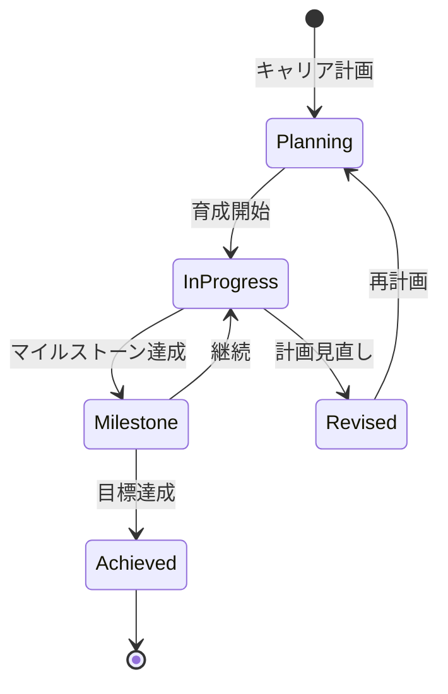

# ビジネスオペレーション: キャリアを開発し支援する

**バージョン**: 1.0.0
**更新日**: 2025-10-01

## 概要

**目的**: メンバーのキャリア目標を明確化し、実現に向けた支援を提供する

**パターン**: Workflow

**ゴール**: キャリアパスが明確になり、具体的な育成計画が実行される

## 関係者とロール

- **メンバー**: キャリア目標の設定
- **マネージャー**: キャリア相談、育成計画策定
- **人事管理者**: キャリアパス設計、研修提供

## プロセスフロー

> **重要**: プロセスフローは必ず番号付きリスト形式で記述してください。
> Mermaid形式は使用せず、テキスト形式で記述することで、代替フローと例外フローが視覚的に分離されたフローチャートが自動生成されます。

1. システムがキャリア面談を処理する
2. システムがキャリア目標設定を処理する
3. システムが現状とギャップ分析を処理する
4. システムが育成計画策定を処理する
5. システムが研修・OJT実施を処理する
6. システムが進捗モニタリングを処理する
7. システムがキャリア実現を処理する

## 代替フロー

### 代替フロー1: 情報不備
- 2-1. システムが情報の不備を検知する
- 2-2. システムが修正要求を送信する
- 2-3. ユーザーが情報を修正し再実行する
- 2-4. 基本フロー2に戻る

## 例外処理

### 例外1: システムエラー
- システムエラーが発生した場合
- エラーメッセージを表示する
- 管理者に通知し、ログに記録する

### 例外2: 承認却下
- 承認が却下された場合
- 却下理由をユーザーに通知する
- 修正後の再実行を促す

## ビジネス状態

## KPI

- **キャリア面談実施率**: 年1回以上全メンバーと実施
- **育成計画実行率**: 策定した計画の80%以上を実行
- **キャリア目標達成率**: 3年以内の目標達成率60%以上
- **社内異動率**: 計画的な異動・昇進率20%/年

## ビジネスルール

- キャリアパス: 専門職、マネジメント、スペシャリストの3コース
- 面談頻度: 年1回以上実施
- 育成予算: メンバー1人あたり年間20万円
- 社内公募: 希望者は社内ポジションに応募可能

## 入出力仕様

### 入力

- **メンバーのキャリア希望**: 希望する職種、役割、働き方
- **現在のスキル・経験**: スキルマップ、プロジェクト履歴
- **パフォーマンス評価結果**: 過去の評価、強み・弱み
- **組織のニーズ**: 事業計画、必要とされるスキル・ポジション

### 出力

- **キャリアプラン**: 3-5年後のキャリア目標、マイルストーン
- **育成計画書**: 具体的な研修、OJT、プロジェクト参加計画
- **研修推奨リスト**: メンバーに推奨する研修プログラム
- **進捗レポート**: 育成計画の進捗状況、達成度

## 例外処理

- **キャリア変更希望**: 新たなキャリアパスの設計、移行支援
- **育成計画未達**: 原因分析（業務多忙、意欲低下等）、計画見直し
- **組織ニーズ変化**: キャリアパスの柔軟な調整、代替案提示

## 派生ユースケース

このビジネスオペレーションから以下のユースケースが派生します：

1. キャリア面談を実施する
2. キャリアプランを策定する
3. 育成計画を実行する
4. キャリア進捗を確認する
