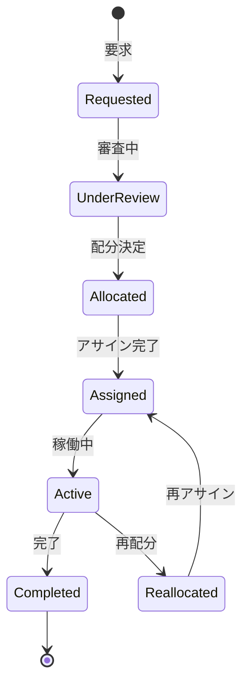

# ビジネスオペレーション: リソースを配分し調整する

**バージョン**: 1.0.0
**更新日**: 2025-10-01

## 概要

**目的**: プロジェクトにリソースを配分し、状況に応じて調整する

**パターン**: Workflow

**ゴール**: すべてのプロジェクトに必要なリソースが配分され、稼働が開始される

## 関係者とロール

- **リソースマネージャー**: リソース配分の決定、調整
- **PM**: リソース要求、受入
- **メンバー**: アサイン受諾

## プロセスフロー

> **重要**: プロセスフローは必ず番号付きリスト形式で記述してください。
> Mermaid形式は使用せず、テキスト形式で記述することで、代替フローと例外フローが視覚的に分離されたフローチャートが自動生成されます。

1. システムがリソース要求を処理する
2. システムが優先順位評価を処理する
3. システムが利用可能リソース確認を実行する
4. システムが配分案作成を行う
5. システムが調整会議を処理する
6. システムが配分決定を処理する
7. システムがアサイン実行を実行する

## 代替フロー

### 代替フロー1: 情報不備
- 2-1. システムが情報の不備を検知する
- 2-2. システムが修正要求を送信する
- 2-3. ユーザーが情報を修正し再実行する
- 2-4. 基本フロー2に戻る

## 例外処理

### 例外1: システムエラー
- システムエラーが発生した場合
- エラーメッセージを表示する
- 管理者に通知し、ログに記録する

### 例外2: 承認却下
- 承認が却下された場合
- 却下理由をユーザーに通知する
- 修正後の再実行を促す

## ビジネス状態

## KPI

- **配分リードタイム**: 要求から配分まで1週間以内
- **充足率**: リソース要求の90%以上を充足
- **公平性**: PMのリソース満足度4.0以上（5点満点）
- **変更率**: プロジェクト期間中の変更10%以下

## ビジネスルール

- 優先順位: 戦略重要度、緊急度、契約条件で評価
- 配分期間: 最低3ヶ月以上の配分を推奨
- 稼働率: 1メンバーの合計稼働率は100%以下
- 調整会議: 週次で配分調整会議を開催

## 入出力仕様

### 入力

- **リソース要求**: スキル、レベル、期間、人数、開始日
- **プロジェクト優先順位**: ビジネス重要度、緊急度
- **現在のリソース配分状況**: メンバー別の配分状況
- **メンバーの可用性**: 稼働率、休暇予定、スキル

### 出力

- **リソース配分計画**: プロジェクト別・メンバー別の配分
- **アサインメント一覧**: メンバー名、役割、稼働率、期間
- **配分理由書**: 配分決定の根拠と考慮事項
- **調整議事録**: 調整会議の決定事項

## 例外処理

- **要求過多**: 優先順位による取捨選択、プロジェクト延期
- **スキル不足**: 外部調達検討、スキル転用、育成計画
- **配分競合**: 調整会議でのネゴシエーション、妥協案検討

## 派生ユースケース

このビジネスオペレーションから以下のユースケースが派生します：

1. リソースを要求する
2. 優先順位を評価する
3. リソースを配分する
4. 配分を調整する
