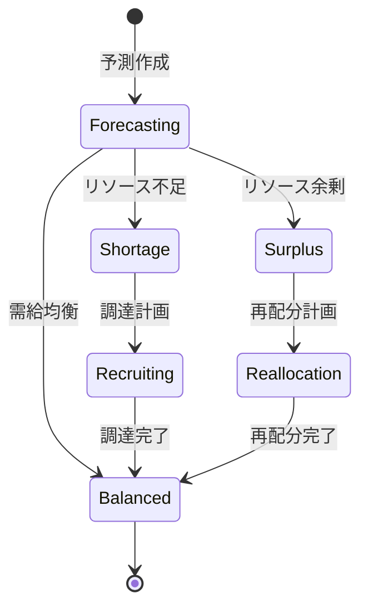

# ビジネスオペレーション: リソース需要を予測する

**バージョン**: 1.0.0
**更新日**: 2025-10-01

## 概要

**目的**: 将来のプロジェクトに必要なリソースを予測する

**パターン**: Analytics

**ゴール**: 精度の高いリソース需要予測が作成され、計画的な配分が可能になる

## 関係者とロール

- **リソースマネージャー**: 需要予測の作成
- **PM**: プロジェクト計画の提供
- **経営層**: 事業計画の提供

## プロセスフロー

> **重要**: プロセスフローは必ず番号付きリスト形式で記述してください。
> Mermaid形式は使用せず、テキスト形式で記述することで、代替フローと例外フローが視覚的に分離されたフローチャートが自動生成されます。

1. システムがプロジェクト計画収集を処理する
2. システムがスキル別需要集計を処理する
3. システムが需要予測計算を処理する
4. システムが供給能力との比較を処理する
5. システムが調達計画策定を処理する
6. システムが予測確定を処理する

## 代替フロー

### 代替フロー1: 情報不備
- 2-1. システムが情報の不備を検知する
- 2-2. システムが修正要求を送信する
- 2-3. ユーザーが情報を修正し再実行する
- 2-4. 基本フロー2に戻る

## 例外処理

### 例外1: システムエラー
- システムエラーが発生した場合
- エラーメッセージを表示する
- 管理者に通知し、ログに記録する

### 例外2: 承認却下
- 承認が却下された場合
- 却下理由をユーザーに通知する
- 修正後の再実行を促す

## ビジネス状態

## KPI

- **予測精度**: 実績との乖離15%以内
- **予測期間**: 6ヶ月先までを月次更新
- **リソース不足率**: 需要の95%以上を充足
- **早期警告**: リソース不足を2ヶ月前に検知

## ビジネスルール

- 予測シナリオ: 楽観的、現実的、悲観的の3シナリオ
- 更新頻度: 月次で予測を更新
- 閾値: 需給ギャップが20%以上で調達計画

## 入出力仕様

### 入力

- **プロジェクト計画**: 期間、規模、スキル要件、確度
- **営業パイプライン情報**: 見込み案件、受注確率
- **現在のリソース状況**: メンバー数、スキル分布、稼働率
- **過去の需要実績**: 過去のプロジェクトデータ

### 出力

- **リソース需要予測レポート**: 月次・スキル別の需要予測
- **スキル別需要グラフ**: 需要の推移を可視化
- **需給ギャップ分析**: 不足・余剰スキルの特定
- **調達計画提案**: 採用、育成、外部調達の提案

## 例外処理

- **急な大型案件**: 緊急予測更新、臨時調達計画
- **予測精度低下**: 予測モデルの見直し、パラメータ調整
- **データ不足**: 類似プロジェクトデータで補完、専門家判断

## 派生ユースケース

このビジネスオペレーションから以下のユースケースが派生します：

1. プロジェクト計画を収集する
2. スキル別需要を集計する
3. 需給ギャップを分析する
4. 調達計画を策定する
