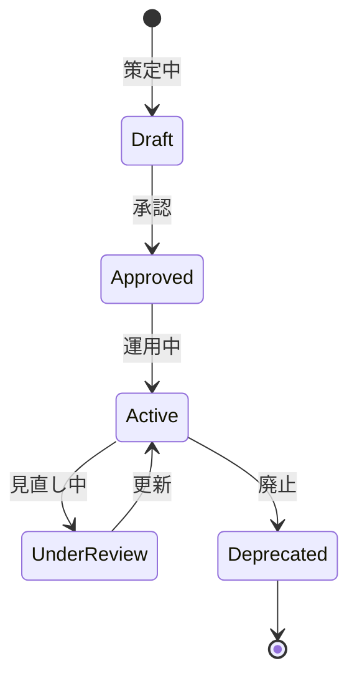

# ビジネスオペレーション: スキルを定義し体系化する

**バージョン**: 1.0.0
**更新日**: 2025-10-01

## 概要

**目的**: 組織に必要なスキルを定義し、体系的に分類する

**パターン**: CRUD

**ゴール**: スキル体系が確立され、すべてのメンバーが共通のスキル定義を使用する

## 関係者とロール

- **人事管理者**: スキル体系の設計、管理
- **技術リーダー**: 技術スキルの定義、レベル設定
- **マネージャー**: スキル要件の提供

## プロセスフロー

> **重要**: プロセスフローは必ず番号付きリスト形式で記述してください。
> Mermaid形式は使用せず、テキスト形式で記述することで、代替フローと例外フローが視覚的に分離されたフローチャートが自動生成されます。

1. システムがスキル調査を処理する
2. システムがスキルカテゴリ定義を処理する
3. システムがスキルレベル定義を処理する
4. システムが評価基準作成を行う
5. システムがスキル体系確定を処理する
6. システムが定期見直しを処理する

## 代替フロー

### 代替フロー1: 情報不備
- 2-1. システムが情報の不備を検知する
- 2-2. システムが修正要求を送信する
- 2-3. ユーザーが情報を修正し再実行する
- 2-4. 基本フロー2に戻る

## 例外処理

### 例外1: システムエラー
- システムエラーが発生した場合
- エラーメッセージを表示する
- 管理者に通知し、ログに記録する

### 例外2: 承認却下
- 承認が却下された場合
- 却下理由をユーザーに通知する
- 修正後の再実行を促す

## ビジネス状態

## KPI

- **スキルカバー率**: 必要スキルの95%以上を定義
- **定義更新頻度**: 年2回の見直し実施
- **利用率**: 全メンバーの90%以上がスキル登録
- **レベル判定精度**: レベル判定の一致率80%以上

## ビジネスルール

- スキルカテゴリ: 技術、ビジネス、ヒューマンの3大カテゴリ
- スキルレベル: 5段階（初級・中級・上級・エキスパート・マスター）
- 評価基準: 各レベルで具体的な行動指標を定義

## 入出力仕様

### 入力

- **業界標準スキルフレームワーク**: ITSS、PMBOKなどの標準
- **自社のプロジェクト要件**: 過去のプロジェクトで必要とされたスキル
- **技術トレンド情報**: 新技術、市場動向
- **メンバーからのスキル提案**: 現場からの新スキル追加要望

### 出力

- **スキル体系図**: スキルの階層構造と分類
- **スキルレベル定義書**: 各レベルの評価基準
- **評価基準書**: 具体的な行動指標
- **スキルマスタデータ**: データベースに格納するスキル定義

## 例外処理

- **新技術出現**: スキル体系への即時追加、臨時レビュー
- **スキル廃止**: 段階的な廃止プロセス、代替スキルへの移行
- **定義曖昧**: 技術リーダーと協議し明確化のための改訂

## 派生ユースケース

このビジネスオペレーションから以下のユースケースが派生します：

1. 新スキルを定義する
2. スキルレベルを設定する
3. スキル体系を更新する
4. スキルを廃止する
