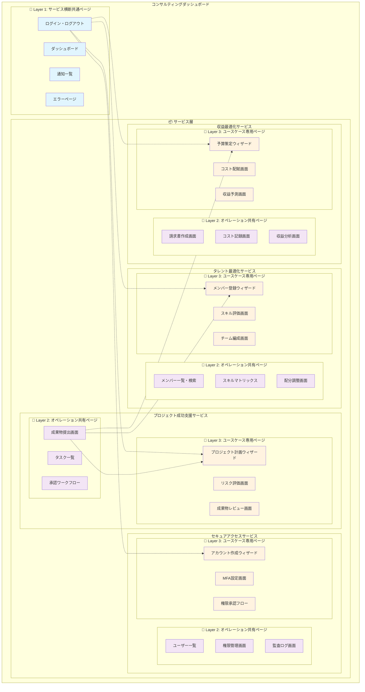
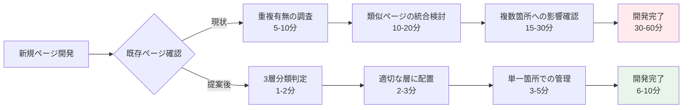
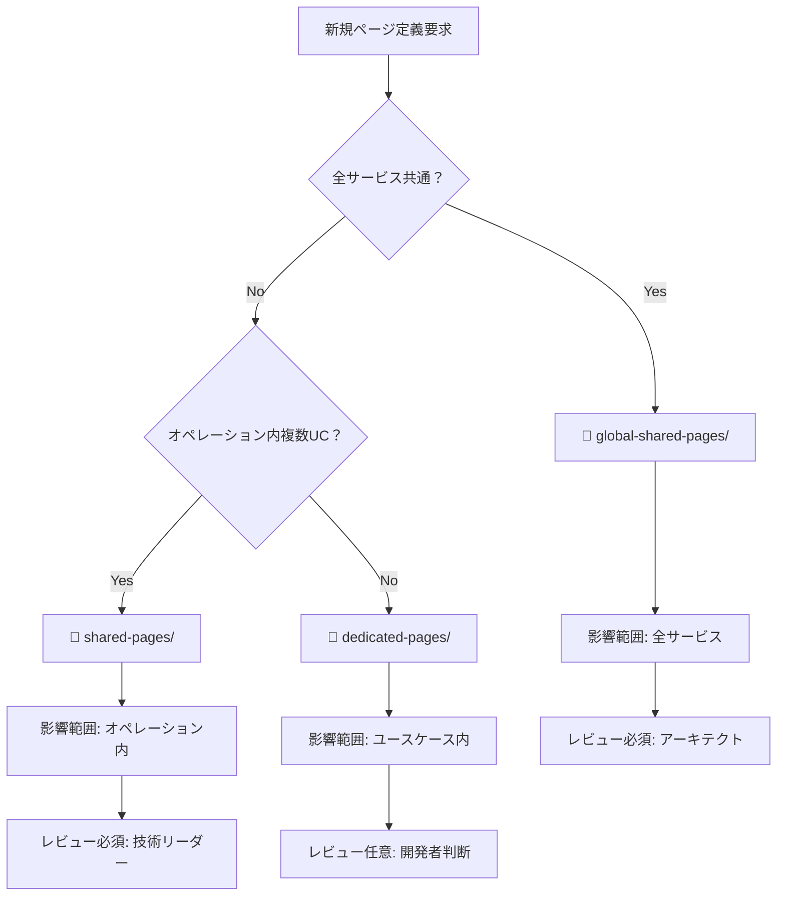
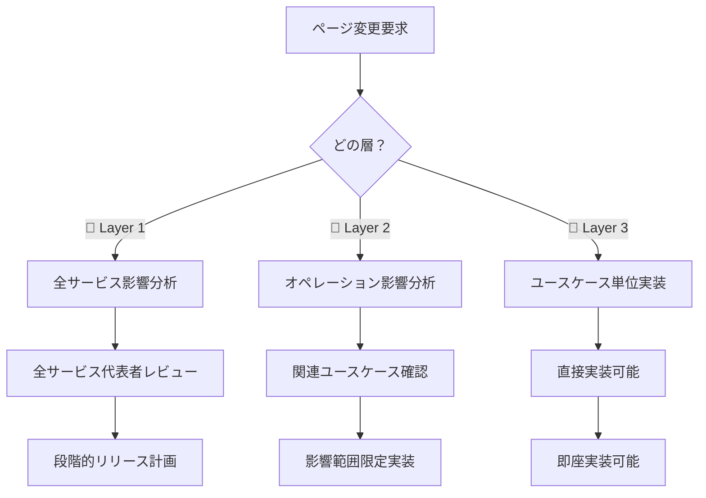

# パラソル 3層分離ページアーキテクチャ

**目的**: ページ定義の重複解消と保守性向上
**対象**: 700ページ → 450ページ (36%削減)
**関連Issue**: [#135](https://github.com/hmoriya/consultingTool/issues/135)

## アーキテクチャ全体図



## ディレクトリ構造マッピング

```
services/
├── global-shared-pages/                    # 🏢 Layer 1
│   ├── login-page.md                      # 全サービス共通
│   ├── dashboard-page.md
│   ├── notification-page.md
│   └── error-page.md
├── secure-access-service/
│   ├── capabilities/
│   │   └── manage-access-safely/
│   │       └── operations/
│   │           ├── register-and-authenticate-users/
│   │           │   ├── shared-pages/       # 🔧 Layer 2
│   │           │   │   ├── user-list-page.md
│   │           │   │   └── user-search-page.md
│   │           │   └── usecases/
│   │           │       ├── create-account/
│   │           │       │   └── dedicated-pages/ # 📄 Layer 3
│   │           │       │       └── account-wizard-page.md
│   │           │       └── setup-mfa/
│   │           │           └── dedicated-pages/
│   │           │               └── mfa-setup-page.md
│   │           └── control-access-permissions/
│   └── ...
├── project-success-service/
│   ├── capabilities/
│   │   └── lead-projects-to-success/
│   │       └── operations/
│   │           ├── assign-and-execute-tasks/
│   │           │   ├── shared-pages/       # 🔧 Layer 2
│   │           │   │   ├── deliverable-submission-page.md
│   │           │   │   └── task-list-page.md
│   │           │   └── usecases/
│   │           │       ├── assign-tasks/
│   │           │       │   └── dedicated-pages/ # 📄 Layer 3
│   │           │       │       └── task-assignment-wizard.md
│   │           │       └── submit-deliverables/
│   │           │           └── dedicated-pages/
│   │           │               └── submission-review-page.md
│   │           └── ...
│   └── ...
└── talent-optimization-service/
    ├── capabilities/
    │   └── maximize-team-productivity/
    │       └── operations/
    │           ├── register-and-manage-members/
    │           │   ├── shared-pages/        # 🔧 Layer 2
    │           │   │   ├── member-list-page.md
    │           │   │   └── member-search-page.md
    │           │   └── usecases/
    │           │       ├── register-new-member/
    │           │       │   └── dedicated-pages/ # 📄 Layer 3
    │           │       │       └── member-registration-wizard.md
    │           │       └── update-member-info/
    │           │           └── dedicated-pages/
    │           │               └── member-history-page.md
    │           └── ...
    └── ...
```

## 重複解消マッピング

### Before: 重複ページ (削除対象)

```
❌ 削除される重複ページ (250ページ)
├── 成果物提出画面 (8重複) → 1つに統合
├── ログイン・認証 (5重複) → 1つに統合
├── 請求書作成・コスト記録 (5重複) → 各1つに統合
├── メンバー一覧・検索 (4重複) → 1つに統合
└── その他 (228重複) → 対応数に統合
```

### After: 統合後ページ (450ページ)

```
✅ 統合後の構造
├── 🏢 Layer 1: 20ページ (サービス横断共通)
├── 🔧 Layer 2: 180ページ (オペレーション共有)
└── 📄 Layer 3: 250ページ (ユースケース専用)
```

## 効果シミュレーション

### 保守工数削減効果

| 変更種別 | 現状 | 提案後 | 削減効果 |
|---------|------|--------|---------|
| **UI共通変更** | 150箇所 | 20箇所 | **87%削減** |
| **ワークフロー変更** | 75箇所 | 25箇所 | **67%削減** |
| **機能追加** | 8箇所 | 3箇所 | **63%削減** |
| **バグ修正** | 重複調査必要 | 一箇所修正 | **大幅効率化** |

### 開発効率向上効果



## 段階的移行計画

### Phase 1: 高影響度ページ (Week 1-2)
```
🎯 対象: 重複度5以上のページ (25ページ)
📊 効果: 125重複 → 25ページ (100重複削除)
🚀 リスク: 低 (明確な重複のため)
```

### Phase 2: 中影響度ページ (Week 3-4)
```
🎯 対象: 重複度2-4のページ (125ページ)
📊 効果: 250重複 → 125ページ (125重複削除)
🚀 リスク: 中 (統合判定が必要)
```

### Phase 3: 最適化・完了 (Week 5)
```
🎯 対象: 最終調整・検証
📊 効果: 全体最適化
🚀 リスク: 低 (最終検証のみ)
```

## 運用フロー

### 新規ページ作成時



### ページ変更時



## 成功指標

### 定量指標
- ✅ **ページ数**: 700 → 450 (36%削減)
- ✅ **重複数**: 150 → 0 (100%解消)
- ✅ **変更工数**: 30-60分 → 6-10分 (80%削減)

### 定性指標
- ✅ **保守性**: 一元管理による品質向上
- ✅ **開発速度**: 重複調査時間の削減
- ✅ **一貫性**: UI/UX統一による体験向上