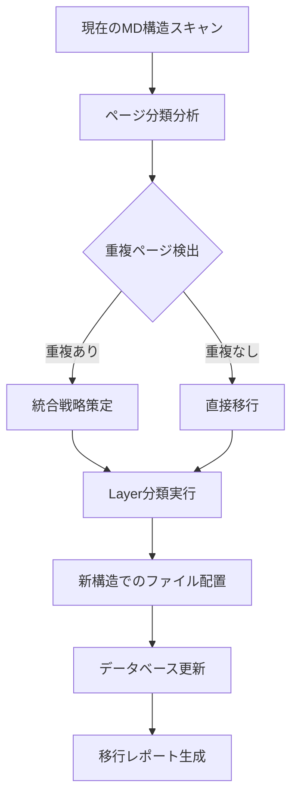

# 3層分離アーキテクチャ対応インポートAPI設計仕様

**バージョン**: 1.0.0
**作成日**: 2025-10-07
**関連Issue**: [#135](https://github.com/hmoriya/consultingTool/issues/135)

## 概要

3層分離ページアーキテクチャに対応したMDファイルインポートAPIの設計仕様書。
新しいディレクトリ構造に対応し、ページの適切な分類・インポートを実現する。

## 新しいMDディレクトリ構造

### 設計原則
1. **明確な層分離**: ページ定義を3層に明確に分類
2. **責務の明確化**: 各層の役割を明確に定義
3. **保守性向上**: 重複を排除し、一元管理を実現

### ディレクトリ構造

```
docs/parasol/services/
├── global-shared-pages/           # 🏢 Layer 1
│   ├── login-page.md
│   ├── dashboard-page.md
│   ├── notification-page.md
│   └── error-page.md
└── [service-name]/
    ├── service.md
    ├── domain-language.md
    ├── api-specification.md
    ├── database-design.md
    ├── integration-specification.md
    └── capabilities/[capability]/
        ├── capability.md
        └── operations/[operation]/
            ├── operation.md
            ├── shared-pages/       # 🔧 Layer 2
            │   ├── list-page.md
            │   ├── search-page.md
            │   └── workflow-page.md
            ├── usecases/
            │   └── [usecase]/
            │       ├── usecase.md
            │       ├── robustness.md
            │       └── dedicated-pages/  # 📄 Layer 3
            │           ├── wizard-page.md
            │           └── detail-page.md
            └── tests/
                ├── test-1.md
                └── test-2.md
```

## API設計仕様

### 1. 拡張されたインポートエンドポイント

#### POST /api/parasol/import-3layer

**概要**: 3層分離構造対応の一括インポート

**リクエスト**:
```json
{
  "migrationMode": true,           // 既存構造からの移行モード
  "conflictResolution": "merge",   // merge | overwrite | skip
  "layerValidation": true,         // 3層分類の妥当性検証
  "dryRun": false                 // 実行前の検証のみ
}
```

**レスポンス**:
```json
{
  "success": true,
  "migrationSummary": {
    "globalSharedPages": 4,
    "operationSharedPages": 180,
    "usecaseDedicatedPages": 250,
    "migratedPages": 434,
    "conflictResolved": 12,
    "errors": []
  },
  "layerClassification": {
    "layer1": ["login-page", "dashboard-page"],
    "layer2": ["list-page", "search-page"],
    "layer3": ["wizard-page", "detail-page"]
  }
}
```

### 2. 段階別インポートエンドポイント

#### POST /api/parasol/import/layer1

**概要**: Layer 1 (サービス横断共通) の専用インポート

**ディレクトリ**: `docs/parasol/services/global-shared-pages/`

**特徴**:
- 全サービス影響分析
- 変更前の影響範囲レポート
- 段階的リリース計画

#### POST /api/parasol/import/layer2

**概要**: Layer 2 (オペレーション共有) の専用インポート

**ディレクトリ**: `operations/[operation]/shared-pages/`

**特徴**:
- オペレーション内影響分析
- 共有ページの重複検出
- 統合候補の提案

#### POST /api/parasol/import/layer3

**概要**: Layer 3 (ユースケース専用) の専用インポート

**ディレクトリ**: `usecases/[usecase]/dedicated-pages/`

**特徴**:
- 高速処理（影響範囲限定）
- 独立実行可能
- バリデーション最小限

### 3. マイグレーションエンドポイント

#### POST /api/parasol/migrate/current-to-3layer

**概要**: 現在のMD構造から3層分離構造への移行

**処理フロー**:


**リクエスト**:
```json
{
  "sourceDirectory": "docs/parasol/services",
  "targetDirectory": "docs/parasol/services-3layer",
  "backupOriginal": true,
  "validationLevel": "strict"
}
```

## データベース設計

### 新テーブル: page_layer_definitions

```sql
CREATE TABLE page_layer_definitions (
    id TEXT PRIMARY KEY,
    page_name TEXT NOT NULL,
    layer_type TEXT CHECK(layer_type IN ('global', 'operation', 'usecase')),
    shared_scope TEXT,  -- 共有範囲の識別子
    parent_operation_id TEXT REFERENCES business_operations(id),
    parent_usecase_id TEXT REFERENCES use_cases(id),
    file_path TEXT NOT NULL,  -- MDファイルの実際のパス
    content TEXT NOT NULL,
    display_name TEXT NOT NULL,
    created_at TIMESTAMP DEFAULT CURRENT_TIMESTAMP,
    updated_at TIMESTAMP DEFAULT CURRENT_TIMESTAMP
);
```

### page_definitions テーブル拡張

```sql
-- 既存テーブルに層情報を追加
ALTER TABLE page_definitions ADD COLUMN layer_id TEXT REFERENCES page_layer_definitions(id);
ALTER TABLE page_definitions ADD COLUMN migration_status TEXT DEFAULT 'pending';
ALTER TABLE page_definitions ADD COLUMN original_path TEXT;
```

## インポート処理ロジック

### 1. ファイル分類アルゴリズム

```typescript
interface PageClassifier {
  classifyPage(filePath: string, content: string): LayerType;
}

class Layer3PageClassifier implements PageClassifier {
  classifyPage(filePath: string, content: string): LayerType {
    // Layer 1: global-shared-pages/ 配下
    if (filePath.includes('global-shared-pages/')) {
      return 'global';
    }

    // Layer 2: shared-pages/ 配下
    if (filePath.includes('/shared-pages/')) {
      return 'operation';
    }

    // Layer 3: dedicated-pages/ 配下
    if (filePath.includes('/dedicated-pages/')) {
      return 'usecase';
    }

    // 旧構造: pages/ 配下 → 分析が必要
    if (filePath.includes('/pages/')) {
      return this.analyzeLegacyPage(content);
    }

    throw new Error(`Unknown page location: ${filePath}`);
  }

  private analyzeLegacyPage(content: string): LayerType {
    // コンテンツ分析による分類
    const indicators = {
      global: ['ログイン', 'ダッシュボード', '通知'],
      operation: ['一覧', '検索', 'ワークフロー'],
      usecase: ['ウィザード', '詳細設定', '専用']
    };

    // 分析ロジック実装
    return 'usecase'; // デフォルト
  }
}
```

### 2. 重複解決アルゴリズム

```typescript
class DuplicationResolver {
  resolveDuplication(pages: PageDefinition[]): ResolutionPlan {
    const duplicateGroups = this.groupByName(pages);
    const plan: ResolutionPlan = {
      merge: [],
      layer1Candidates: [],
      layer2Candidates: [],
      conflicts: []
    };

    for (const group of duplicateGroups) {
      if (this.isGlobalCandidate(group)) {
        plan.layer1Candidates.push(this.selectCanonical(group));
      } else if (this.isOperationCandidate(group)) {
        plan.layer2Candidates.push(this.selectCanonical(group));
      } else {
        plan.conflicts.push(group);
      }
    }

    return plan;
  }
}
```

## API実装例

### 3層分離インポート処理

```typescript
// app/api/parasol/import-3layer/route.ts
export async function POST(request: Request) {
  const { migrationMode, conflictResolution, layerValidation, dryRun } = await request.json();

  try {
    // 1. MDファイルスキャン
    const scanner = new MDFileScanner();
    const files = await scanner.scan('docs/parasol/services');

    // 2. 3層分類
    const classifier = new Layer3PageClassifier();
    const classified = files.map(file => ({
      ...file,
      layer: classifier.classifyPage(file.path, file.content)
    }));

    // 3. 重複解決
    const resolver = new DuplicationResolver();
    const resolutionPlan = resolver.resolveDuplication(classified);

    if (dryRun) {
      return NextResponse.json({
        success: true,
        preview: resolutionPlan,
        estimatedChanges: resolutionPlan.merge.length
      });
    }

    // 4. データベース更新
    const migrator = new DatabaseMigrator();
    const result = await migrator.execute(resolutionPlan);

    return NextResponse.json({
      success: true,
      migrationSummary: result.summary,
      layerClassification: result.classification
    });

  } catch (error) {
    return NextResponse.json({
      success: false,
      error: error.message,
      details: error.stack
    }, { status: 500 });
  }
}
```

## テスト戦略

### 1. ユニットテスト

```typescript
describe('Layer3PageClassifier', () => {
  test('正しく Layer 1 ページを分類する', () => {
    const classifier = new Layer3PageClassifier();
    const result = classifier.classifyPage(
      'docs/parasol/services/global-shared-pages/login-page.md',
      'ログイン画面の定義'
    );
    expect(result).toBe('global');
  });

  test('正しく Layer 2 ページを分類する', () => {
    const classifier = new Layer3PageClassifier();
    const result = classifier.classifyPage(
      'docs/parasol/services/secure-access-service/.../shared-pages/user-list.md',
      'ユーザー一覧画面'
    );
    expect(result).toBe('operation');
  });
});
```

### 2. 統合テスト

```typescript
describe('3Layer Import API', () => {
  test('完全な移行プロセス', async () => {
    const response = await fetch('/api/parasol/import-3layer', {
      method: 'POST',
      body: JSON.stringify({
        migrationMode: true,
        conflictResolution: 'merge',
        dryRun: false
      })
    });

    expect(response.status).toBe(200);
    const result = await response.json();
    expect(result.success).toBe(true);
    expect(result.migrationSummary.migratedPages).toBeGreaterThan(0);
  });
});
```

## 移行手順

### Phase 1: 分析・準備
1. **現在のMD構造の完全スキャン**
2. **重複パターンの特定**
3. **分類ルールの精緻化**

### Phase 2: テスト移行
1. **1サービスでのテスト実行**
2. **分類精度の検証**
3. **パフォーマンス測定**

### Phase 3: 段階的移行
1. **Layer 3 (影響範囲小) から開始**
2. **Layer 2 の統合実行**
3. **Layer 1 の慎重な移行**

### Phase 4: 最終確認
1. **全データの整合性検証**
2. **パフォーマンステスト**
3. **ロールバック手順の確認**

## エラーハンドリング

### 分類エラー
- **未知のディレクトリ構造**: 手動分類を促すエラー
- **コンテンツ分析失敗**: デフォルト Layer 3 として処理

### 重複解決エラー
- **解決不可能な競合**: 手動介入を要求
- **循環依存**: 依存関係の修正を促す

### データベースエラー
- **制約違反**: ロールバック実行
- **接続エラー**: リトライ機構

## パフォーマンス要件

- **MDファイルスキャン**: 500ファイル/秒
- **分類処理**: 100ファイル/秒
- **データベース更新**: 50ページ/秒
- **全体処理時間**: 226ページで5分以内

## セキュリティ考慮事項

- **パス検証**: ディレクトリトラバーサル防止
- **ファイルサイズ制限**: 10MB/ファイル
- **並行処理制限**: 同時実行数制限
- **バックアップ**: 処理前の自動バックアップ