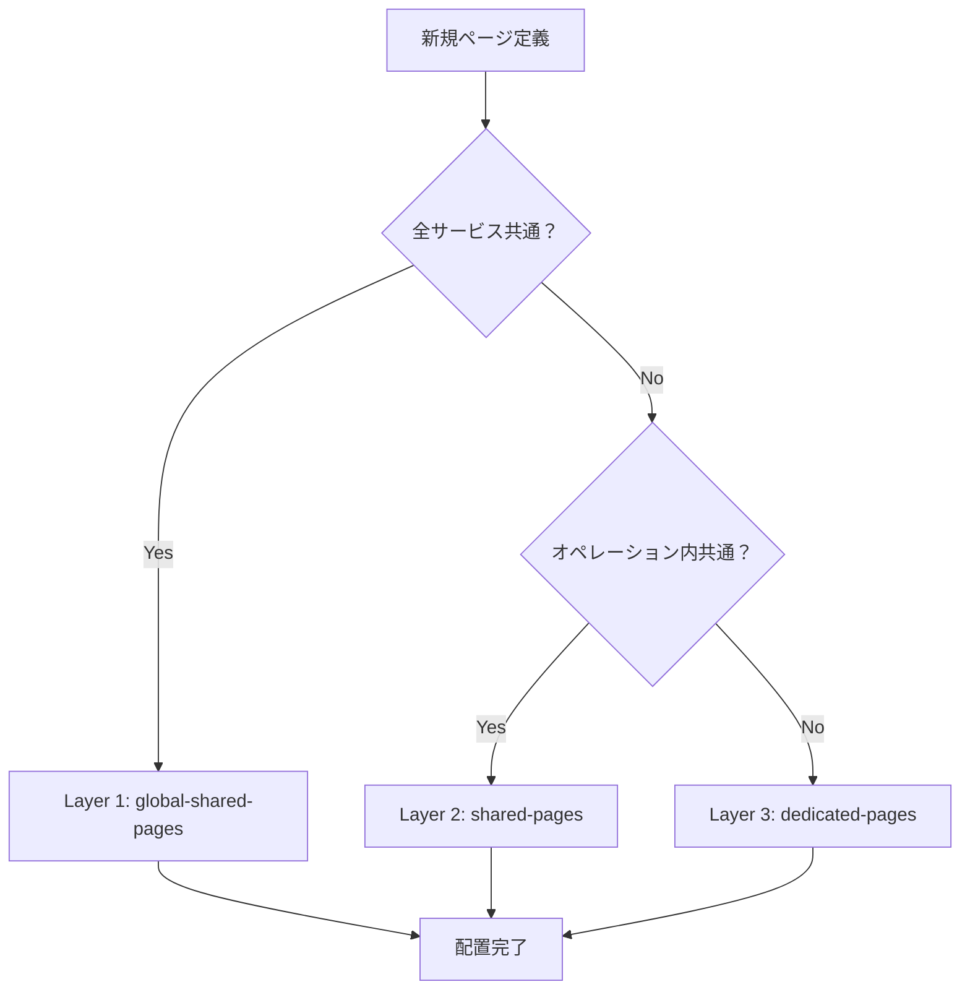

# パラソル 3層分離ページアーキテクチャ仕様書

**バージョン**: 1.0.0
**作成日**: 2025-10-07
**関連Issue**: [#135](https://github.com/hmoriya/consultingTool/issues/135)

## 概要

パラソルページ定義の重複問題を解決し、保守性を向上させるため、3層分離アーキテクチャを導入する。
現在の700ページから450ページへの36%削減と、重複100%解消を目標とする。

## 背景・課題

### 現状の問題
- **重複ページ**: 700ページ中150ページが重複
- **保守性**: 同一ページの複数箇所更新が必要
- **一貫性**: 重複による不整合リスク
- **開発効率**: 類似ページの重複開発

### 重複パターン分析結果
| ページ名 | 重複数 | 分布 |
|---------|--------|------|
| 成果物提出画面 | 8回 | 複数ビジネスオペレーション |
| ログイン・認証 | 5回 | 認証オペレーション内 |
| 請求書作成・コスト記録 | 5回 | 財務オペレーション内 |

## 3層分離アーキテクチャ設計

### アーキテクチャ概要

```
services/[service-name]/
├── global-shared-pages/           # 🏢 Layer 1: サービス横断共通
│   ├── login-page.md
│   ├── dashboard-page.md
│   └── notification-page.md
├── capabilities/[capability]/
│   └── operations/[operation]/
│       ├── operation.md
│       ├── shared-pages/          # 🔧 Layer 2: オペレーション内共通
│       │   ├── list-view-page.md
│       │   ├── common-form-page.md
│       │   └── approval-workflow-page.md
│       ├── usecases/              # 📁 ユースケース群
│       │   ├── [usecase-1]/
│       │   │   ├── usecase.md
│       │   │   └── dedicated-pages/ # 📄 Layer 3: ユースケース専用
│       │   │       ├── specialized-form-page.md
│       │   │       └── complex-workflow-page.md
│       │   └── [usecase-2]/
│       │       ├── usecase.md
│       │       └── dedicated-pages/
│       └── tests/
```

### 3層の分類基準

#### Layer 1: サービス横断共通ページ 🏢
**配置基準:**
- 全サービスで共通利用
- UI構造が完全に同一
- ビジネスロジックが共通
- セキュリティ要件が統一

**対象ページ:**
- ログイン・ログアウト
- ダッシュボード
- 通知一覧
- エラーページ
- ヘルプ・設定ページ

#### Layer 2: オペレーション内共有ページ 🔧
**配置基準:**
- 同一ビジネスオペレーション内で共通利用
- データ表示形式が統一可能
- バリデーション要件が同じ
- ワークフローが類似

**対象ページ:**
- 成果物提出画面（複数オペレーション共有）
- メンバー一覧・検索画面
- 請求書作成・コスト記録系
- 承認ワークフロー画面
- 一覧・フィルター画面

#### Layer 3: ユースケース専用ページ 📄
**配置基準:**
- 固有のワークフローを持つ
- 特殊な入力・承認が必要
- 複雑なビジネスロジックを含む
- セキュリティ要件が異なる

**対象ページ:**
- 複雑な入力ウィザード
- 特殊な承認フロー
- 固有のレポート画面
- カスタマイズされたダッシュボード

## データベース設計

### 新テーブル: page_layers

```sql
CREATE TABLE page_layers (
    id TEXT PRIMARY KEY,
    layer_type TEXT CHECK(layer_type IN ('global', 'operation', 'usecase')),
    shared_scope TEXT,
    parent_id TEXT,
    created_at TIMESTAMP DEFAULT CURRENT_TIMESTAMP,
    updated_at TIMESTAMP DEFAULT CURRENT_TIMESTAMP
);
```

### page_definitions テーブル拡張

```sql
ALTER TABLE page_definitions ADD COLUMN layer_id TEXT REFERENCES page_layers(id);
ALTER TABLE page_definitions ADD COLUMN shared_with TEXT; -- 共有先の識別子
```

## 実装方針

### Phase 1: 分析・準備 (1週間)
1. **重複パターンの完全分類**
2. **依存関係マッピング**
3. **マイグレーション戦略策定**

### Phase 2: プロトタイプ (1週間)
1. **小規模実装テスト**
2. **自動化スクリプト開発**
3. **パフォーマンス検証**

### Phase 3: 段階的実装 (2週間)
1. **高優先度重複の解消**
2. **全サービスへの展開**
3. **参照関係の更新**

### Phase 4: 最適化 (1週間)
1. **共有ページのカスタマイズ機能**
2. **保守ガイドライン策定**
3. **文書化完了**

## 運用ルール

### 新規ページ定義時の判定フロー



### 変更管理ルール
1. **Layer 1 変更**: 全サービス影響分析必須
2. **Layer 2 変更**: オペレーション内影響分析必須
3. **Layer 3 変更**: ユースケース単位で実施可能

## 効果測定

### 定量効果
- **ページ数**: 700 → 450 (36%削減)
- **重複数**: 150 → 0 (100%解消)
- **保守箇所**: 700 → 450 (36%削減)

### 定性効果
- **保守性**: 一元管理による向上
- **一貫性**: UI/UX統一による向上
- **開発効率**: 再利用による向上
- **品質**: 重複不整合リスク解消

## 制約・注意事項

### 設計制約
- パラソル実装非依存性の維持
- 既存MD形式の維持
- APIインポート機能の互換性維持

### 運用制約
- 共有ページ変更時の影響範囲確認必須
- Layer 1 ページの慎重な変更管理
- 段階的移行による安全性確保

## 関連仕様書
- [ページ定義仕様書](./page-definition-spec.md)
- [ビジネスオペレーション仕様書](./business-operation-spec.md)
- [ユースケース仕様書](./use-case-spec.md)

## 付録

### A. 重複ページ一覧
[詳細な重複ページリスト]

### B. マイグレーションスクリプト
[データ移行用SQLスクリプト]

### C. 自動化ツール仕様
[ページ分類・移動の自動化ツール]