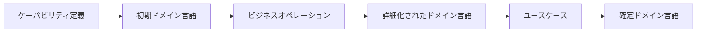

# パラソルドメイン言語の段階的生成仕様

## 概要

パラソルドメイン言語は、ビジネス設計の段階に応じて自動生成・詳細化されるドメインモデルの定義言語です。この仕様では、ケーパビリティ定義、ビジネスオペレーション、ユースケースの各段階でドメイン言語がどのように生成・洗練されるかを定義します。

## 生成フロー



## 1. ケーパビリティ定義からの初期生成

### 入力
- ケーパビリティ名
- ケーパビリティ説明
- 責務定義

### 生成内容

#### エンティティ（概要レベル）
- ケーパビリティ名から中核エンティティを推定
- 基本属性（ID、作成日時、更新日時）のみ定義
- エンティティ間の関係は未定義

#### 値オブジェクト（基本型のみ）
- ステータス、日付範囲などの共通値オブジェクト
- ドメイン固有の値オブジェクトは未定義

#### ドメインサービス（サービス名のみ）
- ケーパビリティから派生するサービス名
- 具体的なオペレーションは未定義

### 例：プロジェクト成功支援ケーパビリティ

```markdown
## エンティティ（Entities）

### 中核エンティティ
- プロジェクト [Project] [PROJECT]
  - ID [id] [PROJECT_ID]: UUID
  - 作成日時 [createdAt] [CREATED_AT]: TIMESTAMP
  - 更新日時 [updatedAt] [UPDATED_AT]: TIMESTAMP

## 値オブジェクト（Value Objects）
- ステータス [Status] [STATUS]: ENUM
- 期間 [Period] [PERIOD]: 開始日・終了日

## ドメインサービス
- プロジェクト管理サービス [ProjectManagementService]
```

## 2. ビジネスオペレーションからの詳細化

### 入力
- 既存のドメイン言語
- ビジネスオペレーション定義
- 処理ステップ
- 状態遷移

### 詳細化内容

#### エンティティの詳細化
- オペレーションで扱う属性の追加
- 状態（ステータス）の具体化
- ビジネスルールの追加
- エンティティ間の関係の明確化

#### 値オブジェクトの追加
- オペレーション固有の値オブジェクト
- 計算や判定に使用する値の定義

#### ドメインサービスの詳細化
- 具体的なオペレーションの追加
- 入出力の定義
- 前提条件・事後条件

#### 集約の発見
- トランザクション境界の識別
- 集約ルートの特定
- 不変条件の定義

#### ドメインイベントの抽出
- オペレーション実行時のイベント
- イベントのペイロード
- イベントの影響範囲

### 例：「プロジェクトを計画する」オペレーションから

```markdown
## エンティティ（Entities）

### プロジェクト [Project] [PROJECT]
- ID [id] [PROJECT_ID]: UUID
- プロジェクトコード [code] [CODE]: STRING_20
- プロジェクト名 [name] [NAME]: STRING_200
- 開始日 [startDate] [START_DATE]: DATE
- 終了日 [endDate] [END_DATE]: DATE
- ステータス [status] [STATUS]: ENUM
  - 計画中 [PLANNING]
  - 進行中 [IN_PROGRESS]
  - 完了 [COMPLETED]
  - 中断 [SUSPENDED]
- 予算 [budget] [BUDGET]: MONEY
- ビジネスルール:
  - 終了日は開始日以降
  - ステータス変更には承認が必要

### タスク [Task] [TASK]
- ID [id] [TASK_ID]: UUID
- プロジェクトID [projectId] [PROJECT_ID]: UUID
- タスク名 [name] [NAME]: STRING_200
- 予定工数 [estimatedHours] [ESTIMATED_HOURS]: DECIMAL
- ステータス [status] [STATUS]: ENUM

## 値オブジェクト（Value Objects）

### 工数 [Hours] [HOURS]
- 値 [value]: DECIMAL
- 制約: 0.25単位（15分単位）

## 集約（Aggregates）

### プロジェクト集約
- ルート: プロジェクト
- メンバー: タスク、マイルストーン
- 不変条件: タスクの合計工数は予算内

## ドメインイベント

### プロジェクト計画完了 [ProjectPlanned]
- プロジェクトID
- 計画者ID
- 計画日時
```

## 3. ユースケースからの最終確定

### 入力
- 詳細化されたドメイン言語
- ユースケース定義
- 画面項目
- API仕様

### 確定内容

#### エンティティの完全定義
- すべての属性の確定
- データ型の詳細（桁数、形式）
- バリデーションルール
- デフォルト値

#### リポジトリインターフェース
- 必要な検索メソッド
- 集約の永続化方法

#### ファクトリー
- エンティティの生成ルール
- 初期化ロジック

### 例：「プロジェクト作成画面」ユースケースから

```markdown
## エンティティ（完全版）

### プロジェクト [Project] [PROJECT]
- ID [id] [PROJECT_ID]: UUID（自動生成）
- プロジェクトコード [code] [CODE]: STRING_20（必須、一意）
  - 形式: PRJ-YYYY-NNNN
- プロジェクト名 [name] [NAME]: STRING_200（必須）
- 説明 [description] [DESCRIPTION]: TEXT（任意）
- クライアントID [clientId] [CLIENT_ID]: UUID（必須）
- 開始日 [startDate] [START_DATE]: DATE（必須）
- 終了日 [endDate] [END_DATE]: DATE（必須）
- 予算 [budget] [BUDGET]: MONEY（必須）
  - 通貨: JPY
  - 範囲: 0-999,999,999,999
- ステータス [status] [STATUS]: ENUM（デフォルト: PLANNING）

## リポジトリインターフェース

### ProjectRepository
- save(project: Project): Promise<void>
- findById(id: ProjectId): Promise<Project | null>
- findByCode(code: string): Promise<Project | null>
- findByClientId(clientId: ClientId): Promise<Project[]>
- existsByCode(code: string): Promise<boolean>
```

## 生成タイミングとユーザーインタラクション

### 1. ケーパビリティ定義画面
- 「初期ドメイン言語を生成」ボタン
- 生成後、エディタに表示して編集可能

### 2. ビジネスオペレーション定義画面
- 「ドメイン言語を詳細化」ボタン
- 既存のドメイン言語に追記・更新
- 差分表示で変更内容を確認

### 3. ユースケース定義画面
- 「ドメイン言語を確定」ボタン
- 最終的な属性とデータ型を確定
- コード生成の準備完了状態

## AI活用による生成精度向上

### 自然言語処理
- ケーパビリティ説明文からのエンティティ抽出
- 動詞からドメインサービスの推定
- 名詞から値オブジェクトの識別

### パターン認識
- 業界標準のドメインモデルパターン
- 過去のプロジェクトからの学習
- ベストプラクティスの適用

### 生成ルール
1. 日本語名 → 英語名 → システム名の変換
2. CRUDパターンの自動認識
3. 状態遷移の自動抽出
4. ビジネスルールのテンプレート適用

## 品質保証

### 生成後のチェック項目
- [ ] すべてのエンティティにIDが定義されている
- [ ] エンティティ間の関係が明確
- [ ] ビジネスルールが記載されている
- [ ] 値オブジェクトの制約が定義されている
- [ ] ドメインサービスの責務が明確

### レビューポイント
- ユビキタス言語の一貫性
- ドメインエキスパートによる確認
- 実装可能性の検証