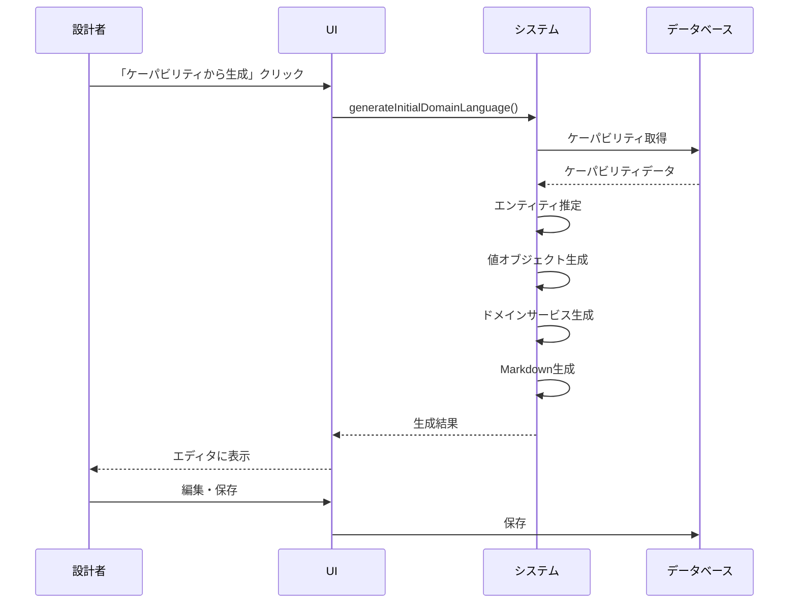

# ドメイン言語生成のユースケース

## UC-DLG-001: ケーパビリティからの初期ドメイン言語生成

### アクター
- パラソル設計者（プライマリ）
- システム

### 事前条件
- サービスが選択されている
- 1つ以上のケーパビリティが定義されている
- ケーパビリティに名前と説明が設定されている

### 基本フロー
1. 設計者がサービスの「ドメイン言語」タブを開く
2. 設計者が「ケーパビリティから生成」ボタンをクリックする
3. システムがすべてのケーパビリティ定義を読み込む
4. システムが以下の処理を実行:
   - ケーパビリティ名から中核エンティティを推定
   - 共通値オブジェクトを定義
   - ドメインサービス名を生成
5. システムが生成されたドメイン言語をエディタに表示
6. 設計者が内容を確認し、必要に応じて編集
7. 設計者が「保存」ボタンをクリック
8. システムがドメイン言語を保存

### 代替フロー

#### 代替フロー1: ケーパビリティが未定義
2a. ケーパビリティが定義されていない場合
   1. システムがエラーメッセージを表示
   2. 基本フローを終了

#### 代替フロー2: 既存のドメイン言語がある
4a. 既にドメイン言語が定義されている場合
   1. システムが上書き確認ダイアログを表示
   2. 設計者が「上書き」を選択した場合、基本フロー5へ
   3. 設計者が「キャンセル」を選択した場合、基本フローを終了

### 事後条件
- 初期ドメイン言語が生成されている
- ドメイン言語がMarkdown形式で保存されている
- 生成履歴が記録されている

### UI仕様
- ボタン: 「ケーパビリティから生成」（アラート内に配置）
- プログレス表示: 生成中は「生成中...」と表示
- 成功通知: トーストで「生成完了」を表示

---

## UC-DLG-002: ビジネスオペレーションからのドメイン言語詳細化

### アクター
- パラソル設計者（プライマリ）
- システム

### 事前条件
- 初期ドメイン言語が存在する（推奨）
- 1つ以上のビジネスオペレーションが定義されている
- オペレーションにdesignフィールドが記入されている

### 基本フロー
1. 設計者がサービスの「ドメイン言語」タブを開く
2. 設計者が「オペレーションから詳細化」ボタンをクリックする
3. システムが既存のドメイン言語を読み込む
4. システムがすべてのビジネスオペレーションを分析
5. システムが以下の処理を実行:
   - オペレーションで扱うエンティティの属性を追加
   - 状態遷移から状態（ステータス）を抽出
   - ビジネスルールを抽出
   - 集約境界を識別
   - ドメインイベントを抽出
6. システムが詳細化されたドメイン言語をエディタに表示（差分ハイライト付き）
7. 設計者が変更内容を確認
8. 設計者が「保存」ボタンをクリック
9. システムがドメイン言語を保存

### 代替フロー

#### 代替フロー1: 初期ドメイン言語が存在しない
3a. ドメイン言語が未定義の場合
   1. システムがケーパビリティから初期生成を実行
   2. 基本フロー4へ続行

#### 代替フロー2: オペレーションが未定義
2a. ビジネスオペレーションが定義されていない場合
   1. システムがエラーメッセージを表示
   2. 基本フローを終了

### 事後条件
- ドメイン言語が詳細化されている
- 新しいエンティティ、属性、ルールが追加されている
- 更新履歴が記録されている

### 詳細化のルール

#### エンティティの詳細化
1. オペレーション名から動詞を抽出
2. 動詞の目的語をエンティティとして認識
3. 処理ステップから属性を推定
4. 状態遷移から状態値を抽出

#### 例
オペレーション: 「プロジェクトを計画する」
```
ステップ:
1. プロジェクト基本情報を入力
2. 開始日・終了日を設定
3. 予算を設定
4. ステータスを「計画中」に設定
```

抽出結果:
- エンティティ: プロジェクト
- 属性: 基本情報、開始日、終了日、予算
- 状態: 計画中

---

## UC-DLG-003: ユースケースからのドメイン言語確定

### アクター
- パラソル設計者（プライマリ）
- システム

### 事前条件
- 詳細化されたドメイン言語が存在する
- ユースケースが定義されている
- ページ定義が存在する（推奨）

### 基本フロー
1. 設計者がユースケースノードを選択
2. 設計者が「ドメイン言語に反映」ボタンをクリック
3. システムがユースケース定義を分析
4. システムがページ定義から画面項目を抽出
5. システムが以下の処理を実行:
   - 画面項目とエンティティ属性をマッピング
   - データ型と制約を確定
   - 必須/任意を判定
   - バリデーションルールを追加
6. システムが更新内容をプレビュー表示
7. 設計者が確認して「適用」をクリック
8. システムがドメイン言語を更新

### 代替フロー

#### 代替フロー1: 新規エンティティの発見
5a. ユースケースに未定義のエンティティが含まれる場合
   1. システムが新規エンティティとして追加提案
   2. 設計者が承認/却下を選択
   3. 承認の場合、基本フロー6へ続行

### 事後条件
- エンティティの全属性が確定している
- データ型と制約が完全に定義されている
- コード生成の準備が完了している

---

## UC-DLG-004: ドメイン言語の手動編集

### アクター
- パラソル設計者（プライマリ）

### 事前条件
- サービスが選択されている

### 基本フロー
1. 設計者がサービスの「ドメイン言語」タブを開く
2. 設計者がMarkdownエディタで直接編集
3. システムがリアルタイムでMarkdownをプレビュー
4. 設計者が「保存」ボタンをクリック
5. システムが構文チェックを実行
6. システムがドメイン言語を保存

### 代替フロー

#### 代替フロー1: 構文エラー
5a. Markdown構文にエラーがある場合
   1. システムがエラー箇所をハイライト
   2. エラーメッセージを表示
   3. 基本フロー2へ戻る

### 事後条件
- ドメイン言語が更新されている
- 手動編集の履歴が記録されている

---

## UC-DLG-005: ドメイン言語の差分確認

### アクター
- パラソル設計者（プライマリ）
- レビュアー（セカンダリ）

### 事前条件
- ドメイン言語の更新履歴が存在する

### 基本フロー
1. 設計者が「履歴」ボタンをクリック
2. システムが更新履歴一覧を表示
3. 設計者が比較したい2つのバージョンを選択
4. システムが差分を表示（追加:緑、削除:赤、変更:黄）
5. レビュアーが変更内容を確認
6. レビュアーがコメントを記入（任意）
7. 設計者が「閉じる」をクリック

### 事後条件
- 変更履歴が確認されている
- レビューコメントが記録されている（任意）

---

## シーケンス図

### ケーパビリティからの初期生成

