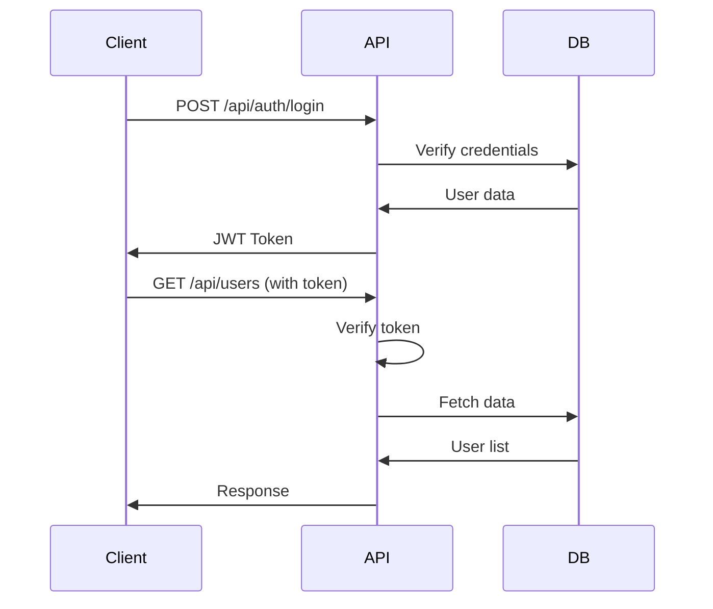

# Auth Service API仕様

## 基本情報
- ベースURL: `/api/auth`
- 認証: JWT Bearer Token（ログイン以外）
- Content-Type: application/json

## エンドポイント一覧

### 認証関連

#### POST /api/auth/login
ユーザーログイン

**Request:**
```json
{
  "email": "user@example.com",
  "password": "password123"
}
```

**Response (200 OK):**
```json
{
  "success": true,
  "data": {
    "token": "eyJhbGciOiJIUzI1NiIs...",
    "user": {
      "id": "123e4567-e89b-12d3-a456-426614174000",
      "email": "user@example.com",
      "name": "山田太郎",
      "role": "PM"
    }
  }
}
```

**Response (401 Unauthorized):**
```json
{
  "success": false,
  "error": "Invalid credentials"
}
```

---

#### POST /api/auth/logout
ユーザーログアウト

**Headers:**
```
Authorization: Bearer <token>
```

**Response (200 OK):**
```json
{
  "success": true,
  "message": "Logged out successfully"
}
```

---

#### POST /api/auth/register
新規ユーザー登録

**Request:**
```json
{
  "email": "newuser@example.com",
  "password": "password123",
  "name": "新規ユーザー",
  "role": "Consultant"
}
```

**Response (201 Created):**
```json
{
  "success": true,
  "data": {
    "id": "123e4567-e89b-12d3-a456-426614174001",
    "email": "newuser@example.com",
    "name": "新規ユーザー",
    "role": "Consultant"
  }
}
```

---

#### GET /api/auth/verify
トークン検証

**Headers:**
```
Authorization: Bearer <token>
```

**Response (200 OK):**
```json
{
  "success": true,
  "data": {
    "valid": true,
    "user": {
      "id": "123e4567-e89b-12d3-a456-426614174000",
      "email": "user@example.com",
      "role": "PM"
    }
  }
}
```

---

#### POST /api/auth/refresh
トークン更新

**Request:**
```json
{
  "refreshToken": "refresh-token-string"
}
```

**Response (200 OK):**
```json
{
  "success": true,
  "data": {
    "token": "new-jwt-token",
    "refreshToken": "new-refresh-token"
  }
}
```

---

### ユーザー管理

#### GET /api/users
ユーザー一覧取得（管理者のみ）

**Headers:**
```
Authorization: Bearer <token>
```

**Query Parameters:**
- `page` (number): ページ番号 (default: 1)
- `limit` (number): 1ページあたりの件数 (default: 20)
- `role` (string): ロールでフィルタ

**Response (200 OK):**
```json
{
  "success": true,
  "data": {
    "users": [
      {
        "id": "123e4567-e89b-12d3-a456-426614174000",
        "email": "user@example.com",
        "name": "山田太郎",
        "role": "PM",
        "isActive": true,
        "createdAt": "2024-01-01T00:00:00Z"
      }
    ],
    "pagination": {
      "page": 1,
      "limit": 20,
      "total": 100,
      "totalPages": 5
    }
  }
}
```

---

#### GET /api/users/:id
ユーザー詳細取得

**Response (200 OK):**
```json
{
  "success": true,
  "data": {
    "id": "123e4567-e89b-12d3-a456-426614174000",
    "email": "user@example.com",
    "name": "山田太郎",
    "role": "PM",
    "isActive": true,
    "permissions": ["project.read", "project.write"],
    "createdAt": "2024-01-01T00:00:00Z",
    "updatedAt": "2024-01-15T00:00:00Z"
  }
}
```

---

#### PUT /api/users/:id
ユーザー情報更新

**Request:**
```json
{
  "name": "山田太郎（更新）",
  "role": "Executive"
}
```

**Response (200 OK):**
```json
{
  "success": true,
  "data": {
    "id": "123e4567-e89b-12d3-a456-426614174000",
    "email": "user@example.com",
    "name": "山田太郎（更新）",
    "role": "Executive"
  }
}
```

---

#### DELETE /api/users/:id
ユーザー削除（論理削除）

**Response (200 OK):**
```json
{
  "success": true,
  "message": "User deactivated successfully"
}
```

## エラーレスポンス

### 共通エラー形式
```json
{
  "success": false,
  "error": "エラーメッセージ",
  "code": "ERROR_CODE"
}
```

### エラーコード一覧
| Code | HTTP Status | Description |
|------|------------|-------------|
| UNAUTHORIZED | 401 | 認証失敗 |
| FORBIDDEN | 403 | 権限不足 |
| NOT_FOUND | 404 | リソースが見つからない |
| VALIDATION_ERROR | 400 | バリデーションエラー |
| INTERNAL_ERROR | 500 | サーバー内部エラー |

## レート制限
- ログイン: 5回/分
- API全般: 100回/分
- ユーザー作成: 10回/時

## 認証フロー
