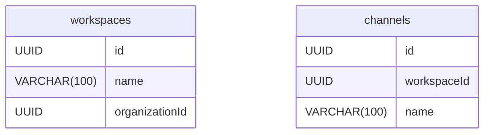
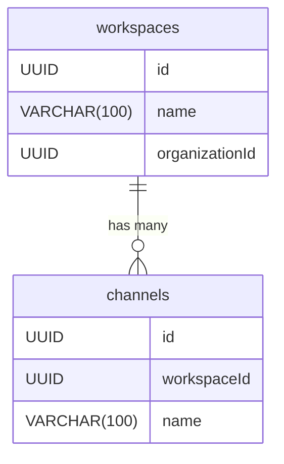
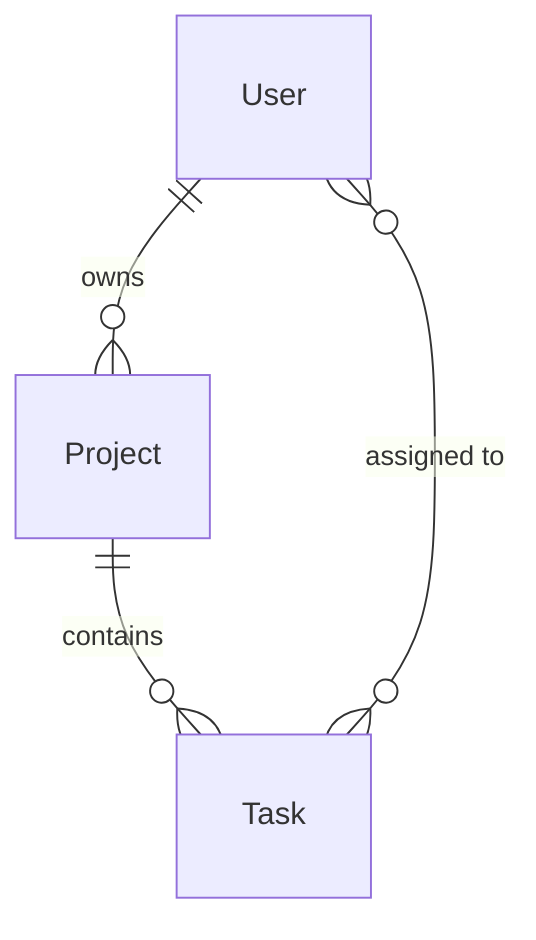

# Issue #106: DB設計ダイアグラムへのリレーション表示追加

**作成日**: 2025-10-01
**ステータス**: 未着手
**優先度**: 中
**担当者**: Claude
**関連Issue**: #104

## 問題の概要

現在のDB設計ダイアグラムでは、テーブル（エンティティ）とカラム（属性）のみが表示され、テーブル間のリレーション（外部キー関係）が視覚化されていない。これにより、データベース設計の全体像が把握しづらい。

### 現状のダイアグラム表示



**問題点**:
- `channels.workspaceId` が `workspaces.id` を参照していることが視覚的にわからない
- テーブル間に線（リレーションシップ）が表示されない
- カーディナリティ（1:1, 1:N, N:M）が不明

### 期待される表示



## 根本原因

### 1. FK情報の未活用

**現状**: `lib/parasol/diagram-converter.ts`の`parseDBSchema`メソッドは、以下のようなFK情報を解析している:

```typescript
// 現在のコード（lines 1237-1245）
if (parts[2]?.includes('FK') || parts[3]?.includes('FK')) {
  const fkText = parts.find(p => p.includes('FK'));
  if (fkText) {
    const fkMatch = fkText.match(/FK\s*\((.*?)\)/);
    if (fkMatch) {
      const [table, col] = fkMatch[1].split('.');
      column.foreignKey = { table: table?.trim(), column: col?.trim() };
    }
  }
}
```

**問題**: FK情報は`column.foreignKey`に格納されるが、Mermaidコード生成時に使用されていない

### 2. リレーション生成ロジックの欠如

**現状**: `convertToMermaid`メソッドはテーブルとカラムのみを出力

```typescript
// 現在のコード（lines 1265-1285）
static convertToMermaid(domainDoc: ParasolDomainDoc): string {
  const tables = this.parseDBSchema(domainDoc.content);
  if (tables.length === 0) return '';

  let mermaid = 'erDiagram\n';

  tables.forEach(table => {
    mermaid += `  ${table.name} {\n`;
    table.columns.forEach(col => {
      const key = col.primaryKey ? 'PK' : col.foreignKey ? 'FK' : '';
      mermaid += `    ${col.type} ${col.name}${key ? ' ' + key : ''}\n`;
    });
    mermaid += `  }\n`;
  });

  return mermaid;
}
```

**問題**: リレーションシップ（テーブル間の線）を生成するロジックがない

## 解決策

### 修正1: リレーション情報の抽出

`parseDBSchema`メソッドを拡張し、リレーション情報を別途返却する:

```typescript
interface Relationship {
  from: string;        // 参照元テーブル
  to: string;          // 参照先テーブル
  fromColumn: string;  // 参照元カラム
  toColumn: string;    // 参照先カラム
  cardinality: string; // "||--o{" (1:N), "||--||" (1:1), "}o--o{" (N:M)
}

private static parseDBSchema(markdown: string): {
  tables: Table[],
  relationships: Relationship[]
} {
  const tables: Table[] = [];
  const relationships: Relationship[] = [];

  // ... 既存のテーブル解析ロジック ...

  // FK情報からリレーションを生成
  tables.forEach(table => {
    table.columns.forEach(col => {
      if (col.foreignKey) {
        relationships.push({
          from: table.name,
          to: col.foreignKey.table,
          fromColumn: col.name,
          toColumn: col.foreignKey.column,
          cardinality: '||--o{' // デフォルトは1:N
        });
      }
    });
  });

  return { tables, relationships };
}
```

### 修正2: Mermaidコード生成の拡張

`convertToMermaid`メソッドでリレーションを出力:

```typescript
static convertToMermaid(domainDoc: ParasolDomainDoc): string {
  const { tables, relationships } = this.parseDBSchema(domainDoc.content);
  if (tables.length === 0) return '';

  let mermaid = 'erDiagram\n';

  // テーブル定義
  tables.forEach(table => {
    mermaid += `  ${table.name} {\n`;
    table.columns.forEach(col => {
      const key = col.primaryKey ? 'PK' : col.foreignKey ? 'FK' : '';
      mermaid += `    ${col.type} ${col.name}${key ? ' ' + key : ''}\n`;
    });
    mermaid += `  }\n`;
  });

  // リレーション定義
  if (relationships.length > 0) {
    mermaid += '\n';
    relationships.forEach(rel => {
      mermaid += `  ${rel.to} ${rel.cardinality} ${rel.from} : "references"\n`;
    });
  }

  return mermaid;
}
```

### 修正3: カーディナリティの自動判定（オプション）

より高度な実装として、カラム名や制約からカーディナリティを推定:

```typescript
private static inferCardinality(
  fromTable: string,
  fromColumn: string,
  toTable: string,
  toColumn: string,
  isPrimaryKey: boolean,
  isUnique: boolean
): string {
  // 1:1 - FK側がPKまたはUNIQUE制約を持つ
  if (isPrimaryKey || isUnique) {
    return '||--||';
  }

  // 1:N - 最も一般的なケース
  return '||--o{';

  // N:M - 中間テーブルの場合（将来実装）
  // return '}o--o{';
}
```

## 実装計画

### Phase 1: 基本実装（必須）
1. `parseDBSchema`の戻り値型を変更（`Table[]` → `{ tables, relationships }`）
2. FK情報からリレーション配列を生成
3. `convertToMermaid`でリレーションを出力

### Phase 2: カーディナリティ判定（推奨）
1. UNIQUE制約の検出ロジック追加
2. カーディナリティ自動判定の実装
3. 中間テーブル（N:M）の検出

### Phase 3: リレーション名のカスタマイズ（オプション）
1. Markdownからリレーション名を読み取る
2. デフォルトの"references"から意味のある名前へ変更
   ```
   workspaces ||--o{ channels : "has many channels"
   ```

## テスト計画

### テストケース1: 1:N リレーション
**入力**: `database-design.md`（コラボレーション促進サービス）
```markdown
| workspaceId | UUID | ○ | FK(workspaces.id) | ワークスペースID |
```

**期待出力**:
```mermaid
workspaces ||--o{ channels : "references"
```

### テストケース2: 複数のリレーション
**入力**:
```markdown
channels テーブル:
| workspaceId | UUID | ○ | FK(workspaces.id) |

messages テーブル:
| channelId | UUID | ○ | FK(channels.id) |
```

**期待出力**:
```mermaid
workspaces ||--o{ channels : "references"
channels ||--o{ messages : "references"
```

### テストケース3: 自己参照
**入力**:
```markdown
threads テーブル:
| parentMessageId | UUID | × | FK(messages.id) | 親メッセージID |
```

**期待出力**:
```mermaid
messages ||--o{ threads : "references"
```

## 影響範囲

### 改善される機能
- DB設計タブのダイアグラム表示が完全になる
- テーブル間の依存関係が一目でわかる
- データベース設計のレビューが容易になる

### 影響を受けるファイル
- `lib/parasol/diagram-converter.ts` (主要な修正)
- 全7サービスのDB設計ドキュメント（表示が改善）

### 後方互換性
- 既存のテーブル定義に影響なし（リレーション情報を追加するのみ）
- FK情報がないテーブルは従来通り表示される

## 備考

### Mermaidのリレーション構文

```
エンティティA カーディナリティ エンティティB : "関係名"
```

**カーディナリティの種類**:
- `||--||` : 1対1（厳密）
- `||--o|` : 1対0または1
- `||--o{` : 1対多（最も一般的）
- `}o--o{` : 多対多

**例**:


### パラソル設計思想との整合性

この改善は、パラソル開発手法の「実装非依存の設計」原則に準拠:
- Markdownで記述されたFK情報（実装非依存）
- 自動的にMermaid ER図の関係線に変換（可視化）
- Prismaスキーマ生成時にも関係情報を活用可能（実装生成）

## 関連Issue
- #104: DB設計ダイアグラムパーサーの修正（本Issueの前提）
- #105: Mermaid ChunkLoadError対応（表示改善）

## 次のステップ
1. Issue #104の完了確認
2. Phase 1の実装開始
3. コラボレーション促進サービスでの動作確認
4. 全7サービスでの検証
