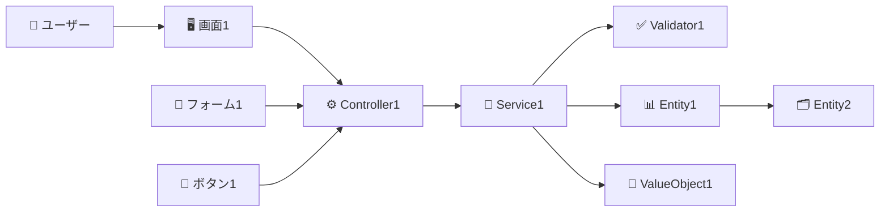

# Issue #116: ビジネスオペレーションからユースケース・ページ定義を作成

**作成日**: 2025-10-01
**ステータス**: 🚧 進行中
**優先度**: 高
**担当**: Claude Code

## 概要

ビジネスオペレーションを起点として、その配下にユースケースとページ定義を階層的に作成する機能を実装する。

## 目的

パラソル設計手法において、ビジネスオペレーション（ハイレベルユースケース）を詳細化し、具体的なシステム操作レベルのユースケースとUI定義（ページ定義）を生成することで、設計の粒度を段階的に詳細化する。

## ディレクトリ構造

```
docs/parasol/services/[service-name]/
└── capabilities/
    └── [capability-name]/
        └── operations/
            └── [operation-name]/
                ├── operation.md                    # ビジネスオペレーション定義
                ├── usecases/                       # ユースケース群
                │   ├── [usecase-1-name]/
                │   │   ├── usecase.md             # ユースケース定義
                │   │   ├── robustness.md          # ロバストネス図定義（NEW）
                │   │   └── pages/                 # ページ定義群
                │   │       ├── [page-1-name].md
                │   │       └── [page-2-name].md
                │   ├── [usecase-2-name]/
                │   │   ├── usecase.md
                │   │   ├── robustness.md          # ロバストネス図定義（NEW）
                │   │   └── pages/
                │   │       └── [page-3-name].md
                │   └── [usecase-3-name]/
                │       ├── usecase.md
                │       ├── robustness.md          # ロバストネス図定義（NEW）
                │       └── pages/
                │           ├── [page-4-name].md
                │           └── [page-5-name].md
                └── tests/                          # テスト定義群（オプション）
                    ├── [test-1-name].md
                    └── [test-2-name].md
```

## 機能要件

### 1. ユースケース作成機能

#### 入力
- **親ビジネスオペレーション**: operation.mdの内容
- **ユースケース数**: 3-5個を推奨
- **ユースケース名**: ビジネスオペレーションのステップから生成

#### 出力
- **ファイル**:
  - `operations/[operation-name]/usecases/[usecase-name]/usecase.md` - ユースケース定義
  - `operations/[operation-name]/usecases/[usecase-name]/robustness.md` - ロバストネス図定義
- **内容**: ユースケーステンプレートとロバストネス図テンプレートに基づく詳細定義

#### ユースケース命名規則
- 形式: 「〜を（が）〜する」または「〜する」
- 視点: システムユーザー（アクター）視点
- 粒度: 1つの明確な目的を達成する単位
- 例:
  - ✅ 「知識を記録する」
  - ✅ 「レビューを依頼する」
  - ✅ 「承認を得る」
  - ❌ 「データ登録」（CRUD的）
  - ❌ 「画面表示」（実装寄り）

### 2. ページ定義作成機能

#### 入力
- **親ユースケース**: usecase.mdの内容
- **ページ数**: ユースケースのフローに応じて1-3個
- **ページ名**: ユースケースのUIステップから生成

#### 出力
- **ファイル**: `operations/[operation-name]/usecases/[usecase-name]/pages/[page-name].md`
- **内容**: ページ定義テンプレートに基づく詳細定義

#### ページ命名規則
- 形式: 「[機能名]-page」または「[目的]-view」
- 例:
  - ✅ 「knowledge-entry-page」（知識入力ページ）
  - ✅ 「review-request-modal」（レビュー依頼モーダル）
  - ✅ 「approval-confirmation-page」（承認確認ページ）

### 3. ロバストネス図作成機能

#### 入力
- **親ユースケース**: usecase.mdの内容
- **基本フロー**: ユースケースの基本フローステップ

#### 出力
- **ファイル**: `operations/[operation-name]/usecases/[usecase-name]/robustness.md`
- **内容**: ロバストネス図テンプレートに基づくBCE要素の定義

#### ロバストネス図の要素
- **Boundary Objects（境界オブジェクト）**: UI要素（画面、フォーム、ボタン）
- **Control Objects（制御オブジェクト）**: ビジネスロジック（Controller、Service、Validator）
- **Entity Objects（実体オブジェクト）**: ドメインモデル（Entity、ValueObject）

### 4. 自動生成機能

#### トリガー
- ビジネスオペレーション作成時にユースケースを自動生成（オプション）
- ユースケース作成時にロバストネス図とページ定義を自動生成（オプション）

#### 生成ロジック
1. **ビジネスオペレーションの分析**
   - プロセスフローのステップを抽出
   - 各ステップをユースケース候補として識別
   - アクターごとにユースケースをグループ化

2. **ユースケースの生成**
   - テンプレートに基づいた初期値の設定
   - アクター、事前条件、基本フローの自動推論
   - 代替フロー・例外フローの雛形生成

3. **ロバストネス図の生成**
   - 基本フローからBoundary/Control/Entityオブジェクトを抽出
   - Mermaidダイアグラムの自動生成
   - 相互作用シーケンスの雛形作成

4. **ページ定義の生成**
   - ユースケースのフローから画面遷移を推論
   - 入力項目、アクション、表示データの抽出
   - レイアウトと画面構成の雛形生成

## UI要件

### パラソル設計管理画面の拡張

#### 1. ビジネスオペレーション詳細画面

**新規追加要素**:
```
┌─ ビジネスオペレーション: [オペレーション名] ───────────┐
│                                                      │
│ [タブ] オペレーション概要 | ユースケース | テスト    │
│                                                      │
│ [ユースケースタブ]                                   │
│ ┌──────────────────────────────────────────────┐ │
│ │ ✅ ユースケース一覧 (3件)                      │ │
│ │                                                │ │
│ │ 📄 知識を記録する                    [編集] [削除] │ │
│ │    ├─ 📄 knowledge-entry-page                │ │
│ │    └─ 📄 draft-save-confirmation             │ │
│ │                                                │ │
│ │ 📄 レビューを依頼する                [編集] [削除] │ │
│ │    └─ 📄 review-request-modal                │ │
│ │                                                │ │
│ │ 📄 承認を得る                        [編集] [削除] │ │
│ │    ├─ 📄 approval-confirmation-page          │ │
│ │    └─ 📄 approval-result-view                │ │
│ │                                                │ │
│ │ [+ 新規ユースケース作成]                      │ │
│ │ [🤖 AIで自動生成]                             │ │
│ └──────────────────────────────────────────────┘ │
└──────────────────────────────────────────────────┘
```

#### 2. ユースケース作成ダイアログ

**入力フォーム**:
```
┌─ 新規ユースケース作成 ─────────────────────────┐
│                                                │
│ ユースケース名 *                                │
│ [____________________________________]        │
│                                                │
│ 主アクター *                                   │
│ [▼ PM / Consultant / Client / System]        │
│                                                │
│ 概要                                           │
│ [____________________________________]        │
│ [____________________________________]        │
│                                                │
│ 自動生成オプション                              │
│ ☑ 基本フローを自動生成                         │
│ ☑ ページ定義を自動生成                         │
│                                                │
│ [キャンセル]  [作成]                           │
└────────────────────────────────────────────────┘
```

#### 3. ページ定義作成ダイアログ

**入力フォーム**:
```
┌─ 新規ページ定義作成 ───────────────────────────┐
│                                                │
│ ページ名 *                                     │
│ [____________________________________]        │
│                                                │
│ ページ種別 *                                   │
│ [▼ 一覧ページ / 詳細ページ / フォーム / モーダル]│
│                                                │
│ 利用者 *                                       │
│ [▼ PM / Consultant / Client / Admin]         │
│                                                │
│ 目的                                           │
│ [____________________________________]        │
│ [____________________________________]        │
│                                                │
│ 自動生成オプション                              │
│ ☑ 画面構成を自動生成                           │
│ ☑ 入力項目を推論                               │
│ ☑ アクションを推論                             │
│                                                │
│ [キャンセル]  [作成]                           │
└────────────────────────────────────────────────┘
```

## データベース設計

### 既存テーブルの拡張

#### UseCaseテーブル（新規）
```prisma
model UseCase {
  id                    String   @id @default(cuid())
  businessOperationId   String   // FK to BusinessOperation
  name                  String   // ユースケース名
  slug                  String   // URLフレンドリーな識別子
  actor                 String   // 主アクター
  summary               String?  // 概要
  content               String   // usecase.mdの内容
  preconditions         String?  // 事前条件（JSON）
  postconditions        String?  // 事後条件（JSON）
  basicFlow             String?  // 基本フロー（JSON）
  alternativeFlows      String?  // 代替フロー（JSON）
  exceptionFlows        String?  // 例外フロー（JSON）
  order                 Int      @default(0)
  createdAt             DateTime @default(now())
  updatedAt             DateTime @updatedAt

  businessOperation     BusinessOperation @relation(fields: [businessOperationId], references: [id], onDelete: Cascade)
  robustnessDiagram     RobustnessDiagram?  // 1対1リレーション（NEW）
  pageDefinitions       PageDefinition[]

  @@unique([businessOperationId, slug])
  @@index([businessOperationId])
}
```

#### RobustnessDiagramテーブル（新規）
```prisma
model RobustnessDiagram {
  id                String   @id @default(cuid())
  useCaseId         String   @unique  // FK to UseCase (1対1)
  content           String   // robustness.mdの内容
  boundaryObjects   String?  // Boundary Objects定義（JSON）
  controlObjects    String?  // Control Objects定義（JSON）
  entityObjects     String?  // Entity Objects定義（JSON）
  diagram           String?  // Mermaidダイアグラムコード
  interactions      String?  // 相互作用シーケンス（JSON）
  createdAt         DateTime @default(now())
  updatedAt         DateTime @updatedAt

  useCase           UseCase  @relation(fields: [useCaseId], references: [id], onDelete: Cascade)

  @@index([useCaseId])
}
```

#### PageDefinitionテーブル（拡張）
```prisma
model PageDefinition {
  id          String   @id @default(cuid())
  useCaseId   String   // FK to UseCase (新規追加)
  name        String
  slug        String
  pageType    String   // 一覧/詳細/フォーム/モーダル
  user        String   // 利用者
  purpose     String?  // 目的
  content     String   // page.mdの内容
  layout      String?  // レイアウト情報（JSON）
  components  String?  // コンポーネント一覧（JSON）
  actions     String?  // アクション一覧（JSON）
  order       Int      @default(0)
  createdAt   DateTime @default(now())
  updatedAt   DateTime @updatedAt

  useCase     UseCase  @relation(fields: [useCaseId], references: [id], onDelete: Cascade)

  @@unique([useCaseId, slug])
  @@index([useCaseId])
}
```

## API設計

### 1. ユースケースAPI

#### ユースケース一覧取得
```
GET /api/parasol/services/:serviceId/capabilities/:capabilityId/operations/:operationId/usecases
```

#### ユースケース作成
```
POST /api/parasol/services/:serviceId/capabilities/:capabilityId/operations/:operationId/usecases
Body: {
  name: string,
  slug: string,
  actor: string,
  summary?: string,
  content: string,
  autoGeneratePages?: boolean
}
```

#### ユースケース取得
```
GET /api/parasol/services/:serviceId/capabilities/:capabilityId/operations/:operationId/usecases/:usecaseId
```

#### ユースケース更新
```
PUT /api/parasol/services/:serviceId/capabilities/:capabilityId/operations/:operationId/usecases/:usecaseId
Body: { content: string }
```

#### ユースケース削除
```
DELETE /api/parasol/services/:serviceId/capabilities/:capabilityId/operations/:operationId/usecases/:usecaseId
```

### 2. ロバストネス図API

#### ロバストネス図取得
```
GET /api/parasol/services/:serviceId/capabilities/:capabilityId/operations/:operationId/usecases/:usecaseId/robustness
```

#### ロバストネス図作成
```
POST /api/parasol/services/:serviceId/capabilities/:capabilityId/operations/:operationId/usecases/:usecaseId/robustness
Body: {
  content: string,
  boundaryObjects?: Array<{name, type, description}>,
  controlObjects?: Array<{name, role, description}>,
  entityObjects?: Array<{name, type, description}>
}
```

#### ロバストネス図更新
```
PUT /api/parasol/services/:serviceId/capabilities/:capabilityId/operations/:operationId/usecases/:usecaseId/robustness
Body: { content: string }
```

#### ロバストネス図削除
```
DELETE /api/parasol/services/:serviceId/capabilities/:capabilityId/operations/:operationId/usecases/:usecaseId/robustness
```

### 3. ページ定義API

#### ページ定義一覧取得
```
GET /api/parasol/services/:serviceId/capabilities/:capabilityId/operations/:operationId/usecases/:usecaseId/pages
```

#### ページ定義作成
```
POST /api/parasol/services/:serviceId/capabilities/:capabilityId/operations/:operationId/usecases/:usecaseId/pages
Body: {
  name: string,
  slug: string,
  pageType: string,
  user: string,
  purpose?: string,
  content: string
}
```

#### ページ定義取得
```
GET /api/parasol/services/:serviceId/capabilities/:capabilityId/operations/:operationId/usecases/:usecaseId/pages/:pageId
```

#### ページ定義更新
```
PUT /api/parasol/services/:serviceId/capabilities/:capabilityId/operations/:operationId/usecases/:usecaseId/pages/:pageId
Body: { content: string }
```

#### ページ定義削除
```
DELETE /api/parasol/services/:serviceId/capabilities/:capabilityId/operations/:operationId/usecases/:usecaseId/pages/:pageId
```

### 4. 自動生成API

#### ユースケース自動生成
```
POST /api/parasol/services/:serviceId/capabilities/:capabilityId/operations/:operationId/usecases/generate
Body: {
  operationContent: string,  // operation.mdの内容
  count?: number            // 生成するユースケース数（デフォルト: 3-5）
}
Response: {
  usecases: Array<{
    name: string,
    actor: string,
    summary: string,
    suggestedContent: string
  }>
}
```

#### ロバストネス図自動生成
```
POST /api/parasol/services/:serviceId/capabilities/:capabilityId/operations/:operationId/usecases/:usecaseId/robustness/generate
Body: {
  usecaseContent: string    // usecase.mdの内容
}
Response: {
  boundaryObjects: Array<{name, type, description}>,
  controlObjects: Array<{name, role, description}>,
  entityObjects: Array<{name, type, description}>,
  diagram: string,          // Mermaidダイアグラムコード
  interactions: Array<{step, description}>
}
```

#### ページ定義自動生成
```
POST /api/parasol/services/:serviceId/capabilities/:capabilityId/operations/:operationId/usecases/:usecaseId/pages/generate
Body: {
  usecaseContent: string,   // usecase.mdの内容
  robustnessContent?: string // robustness.mdの内容（オプション）
}
Response: {
  pages: Array<{
    name: string,
    pageType: string,
    user: string,
    purpose: string,
    suggestedContent: string
  }>
}
```

## テンプレート

### ユースケーステンプレート

`templates/parasol-usecase.md`:
```markdown
# ユースケース: [ユースケース名]

## 基本情報
- **ユースケースID**: UC-XXX
- **親ビジネスオペレーション**: [オペレーション名]
- **アクター**: [主アクター], [副アクター]
- **概要**: [ユースケースの簡潔な説明]

## 事前条件
- [条件1]
- [条件2]
- [条件3]

## 事後条件
### 成功時
- [成功時の状態1]
- [成功時の状態2]

### 失敗時
- [失敗時の状態1]
- [失敗時の状態2]

## 基本フロー
1. [アクター]が[アクション]を実行する
2. システムが[処理]を行う
3. システムが[結果]を表示する
4. [アクター]が[確認/承認]を行う
5. システムが[最終処理]を完了する

## 代替フロー
### 代替フロー1: [条件]
- 3a. [条件]の場合
  - 3a1. システムが[代替処理]を実行
  - 3a2. 基本フロー4に戻る

## 例外フロー
### 例外1: [エラー条件]
- *a. [エラー条件]が発生した場合
  - *a1. システムが[エラーメッセージ]を表示
  - *a2. ユースケース中断

## 特別要件
- **性能**: [性能要件]
- **可用性**: [可用性要件]
- **セキュリティ**: [セキュリティ要件]

## 関連ロバストネス図
`robustness.md`（別ファイル）を参照

## 関連ページ定義
- [ページ1名]
- [ページ2名]
- [ページ3名]

## 関連ユースケース
- **包含**: [包含するユースケース]
- **拡張**: [拡張されるユースケース]
```

### ロバストネス図テンプレート

`templates/parasol-robustness.md`:
```markdown
# ロバストネス図: [ユースケース名]

## 図の概要
[このロバストネス図が表現するユースケースの概要]

## 親ユースケース
**ユースケースID**: UC-XXX
**ユースケース名**: [ユースケース名]

## 要素定義

### Boundary Objects（境界オブジェクト）
ユーザーがシステムと相互作用するインターフェース要素

| オブジェクト名 | 種類 | 説明 |
|---------------|------|------|
| [UI要素1] | 画面 | [説明] |
| [UI要素2] | フォーム | [説明] |
| [UI要素3] | ボタン | [説明] |
| [UI要素4] | ダイアログ | [説明] |

### Control Objects（制御オブジェクト）
ビジネスロジックや処理の流れを制御する要素

| オブジェクト名 | 役割 | 説明 |
|---------------|------|------|
| [Controller1] | 制御 | [処理内容] |
| [Service1] | 業務処理 | [処理内容] |
| [Validator1] | 検証 | [検証内容] |
| [Adapter1] | 外部連携 | [連携内容] |

### Entity Objects（実体オブジェクト）
システムが扱うデータや概念を表現する要素

| オブジェクト名 | 種類 | 説明 |
|---------------|------|------|
| [Entity1] | ドメインオブジェクト | [説明] |
| [Entity2] | データモデル | [説明] |
| [ValueObject1] | 値オブジェクト | [説明] |
| [Aggregate1] | 集約 | [説明] |

## ロバストネス図



## 相互作用シーケンス

### 基本フロー
1. **ユーザー** → **[UI要素]**: [操作内容]
2. **[UI要素]** → **[Controller]**: [データ送信]
3. **[Controller]** → **[Service]**: [処理依頼]
4. **[Service]** → **[Validator]**: [検証実行]
5. **[Service]** → **[Entity]**: [データ操作]
6. **[Entity]** → **[Service]**: [結果返却]
7. **[Service]** → **[Controller]**: [処理結果]
8. **[Controller]** → **[UI要素]**: [表示データ]
9. **[UI要素]** → **ユーザー**: [結果表示]

### 代替フロー
[条件分岐がある場合の相互作用]

### 例外フロー
[エラー発生時の相互作用]

## オブジェクトの責務

### Boundary Object責務
- [UI要素1]: [責務の詳細説明]
- [UI要素2]: [責務の詳細説明]

### Control Object責務
- [Controller1]: [責務の詳細説明]
- [Service1]: [責務の詳細説明]

### Entity Object責務
- [Entity1]: [責務の詳細説明]
- [Entity2]: [責務の詳細説明]

## 設計上の注意点
- [Boundaryの責務範囲と制約]
- [Controlの処理分割方針]
- [Entityのカプセル化とアクセス制御]
- [トランザクション境界]
- [エラーハンドリング方針]
```

### ページ定義テンプレート

`templates/parasol-page-definition.md`:
```markdown
# ページ定義: [ページ名]

## 画面の目的
[この画面で達成したいビジネス目的を記述]

## 利用者
- **[主要利用者]**: [役割と利用目的]
- **[副次利用者]**: [役割と利用目的]

## 画面構成

### ヘッダー部
- [ヘッダーに表示する要素]
- [ナビゲーション要素]

### メインコンテンツ部
- **[セクション1名]**: [表示内容と機能]
- **[セクション2名]**: [表示内容と機能]
- **[セクション3名]**: [表示内容と機能]

### サイドバー部（該当する場合）
- [サイドバーの内容]

## データ表示

### 表示データ一覧
| データ項目 | 表示形式 | 必須 | 説明 |
|-----------|---------|------|------|
| [項目1] | [形式] | ○/× | [説明] |
| [項目2] | [形式] | ○/× | [説明] |

## 入力項目

### フォーム一覧
| 入力項目 | 入力形式 | 必須 | バリデーション | 説明 |
|---------|---------|------|---------------|------|
| [項目1] | [形式] | ○/× | [ルール] | [説明] |
| [項目2] | [形式] | ○/× | [ルール] | [説明] |

## アクション・操作

### 主要アクション
- **[アクション1]**: [説明と実行条件]
- **[アクション2]**: [説明と実行条件]

## 画面の振る舞い

### ユーザー操作への反応
- **[操作1]**時: [画面の反応]
- **[操作2]**時: [画面の反応]

## 画面遷移

### 遷移元画面
- [遷移元画面1]: [遷移条件]

### 遷移先画面
- [遷移先画面1]: [遷移条件]

## エラーハンドリング
- **[エラー1]**: [表示方法と対処法]
- **[エラー2]**: [表示方法と対処法]

## レスポンシブ対応
- **デスクトップ**: [表示方法]
- **タブレット**: [表示方法]
- **モバイル**: [表示方法]
```

## 実装ステップ

### Phase 1: データモデルとAPI実装
- [ ] Prismaスキーマ拡張（UseCase, RobustnessDiagram, PageDefinition更新）
- [ ] マイグレーション実行
- [ ] CRUD APIエンドポイント実装
  - [ ] ユースケースAPI
  - [ ] ロバストネス図API（NEW）
  - [ ] ページ定義API

### Phase 2: UI実装
- [ ] ビジネスオペレーション詳細画面の拡張
  - [ ] ユースケースタブの追加
  - [ ] ユースケース一覧表示
  - [ ] ロバストネス図表示（NEW）
  - [ ] ページ定義ツリー表示
- [ ] ユースケース作成ダイアログ
- [ ] ロバストネス図作成・編集ダイアログ（NEW）
- [ ] ページ定義作成ダイアログ
- [ ] 編集・削除機能

### Phase 3: 自動生成機能
- [ ] ビジネスオペレーション分析ロジック
- [ ] ユースケース自動生成API
- [ ] ロバストネス図自動生成API（NEW）
- [ ] ページ定義自動生成API
- [ ] AI連携（オプション）

### Phase 4: テンプレートとドキュメント
- [ ] ユースケーステンプレート作成
- [ ] ロバストネス図テンプレート作成（NEW）
- [ ] ページ定義テンプレート作成
- [ ] サンプルデータ作成
- [ ] 利用ガイド作成

## テスト計画

### 単体テスト
- [ ] API CRUD操作のテスト
- [ ] バリデーションのテスト
- [ ] 階層構造の整合性テスト

### 統合テスト
- [ ] ビジネスオペレーション → ユースケース → ロバストネス図 → ページ定義の作成フロー
- [ ] 削除時のカスケード処理（ユースケース削除時にロバストネス図も削除）
- [ ] ファイルシステムとDBの同期

### E2Eテスト
- [ ] UI操作による作成フロー
- [ ] 編集・削除フロー
- [ ] 自動生成機能のテスト

## 成功基準

- [ ] ビジネスオペレーションから3-5個のユースケースを作成できる
- [ ] 各ユースケースに対してロバストネス図を作成できる
- [ ] ユースケースから1-3個のページ定義を作成できる
- [ ] 階層構造（オペレーション→ユースケース→ロバストネス図→ページ）がUI上で正しく表示される
- [ ] ファイルシステムとデータベースが同期している
- [ ] 自動生成機能が適切なコンテンツを生成する（70%以上の利用可能性）
- [ ] Mermaidダイアグラムが正しく表示される

## 実装可能性調査結果

### 現在の実装状況

✅ **既に実装されている基盤**:
- `TreeNode`型で`useCase`と`page`が定義済み (`app/types/parasol.ts:8`)
- `UnifiedTreeView`コンポーネントが階層表示に対応済み
- `BusinessOperation`型に`useCases`, `uiDefinitions`, `testCases`フィールドが存在
- ノードアイコン（`FileText`）とカラー定義が準備済み

### 実装の難易度評価

| フェーズ | 難易度 | 理由 |
|---------|--------|------|
| **Phase 1: データベース拡張** | ⭐⭐⭐ | Prismaスキーマ設計が必要 |
| **Phase 2: ツリービルド修正** | ⭐ | ツリー構造は既存パターンを踏襲 |
| **Phase 3: API実装** | ⭐⭐ | CRUDのAPIは既存パターンあり |
| **Phase 4: UI拡張** | ⭐⭐ | UIコンポーネントは既に用意済み |

### 実装方針

**完全に実装可能**。既存のアーキテクチャに適合しており、ツリービュー、型定義、アイコンなどの基盤は整っている。データ層（Prisma）とAPI層を追加するだけで実現可能。

## 参考資料

- パラソル設計手法ガイド: `docs/parasol/PARASOL_STRUCTURE.md`
- ユースケース命名規則: `CLAUDE.md`（ビジネスオペレーションとユースケースの階層構造）
- ページ定義仕様: `CLAUDE.md`（ページ定義とテスト定義の設計原則）
- 既存のツリービュー実装: `app/components/parasol/UnifiedTreeView.tsx`
- 型定義: `app/types/parasol.ts`
