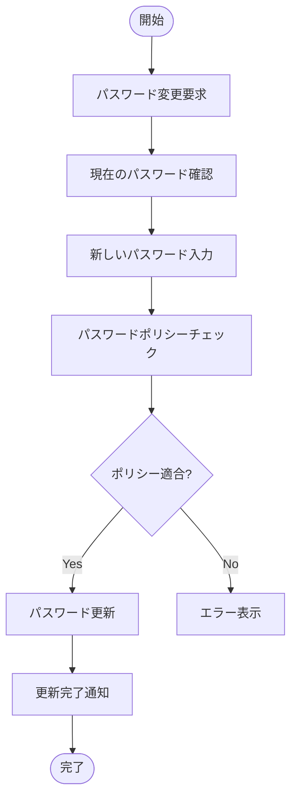
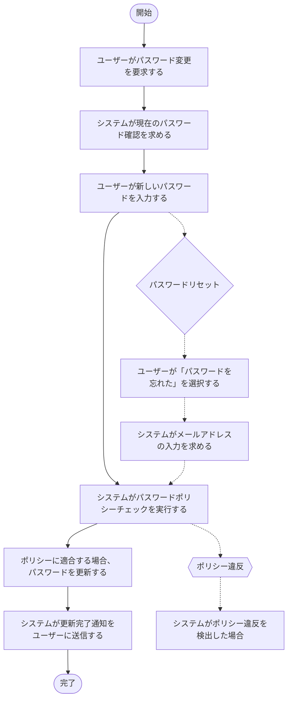

# Issue #117: 「パスワードを管理する」オペレーションをMermaid形式からテキスト形式に変換

**作成日**: 2025-10-03
**Issue URL**: https://github.com/hmoriya/consultingTool/issues/117
**担当**: 未定
**優先度**: Medium

## 概要

「パスワードを管理する」ビジネスオペレーションのプロセスフロー定義をMermaid形式からテキスト形式（番号付きリスト形式）に変換します。

## 背景

### 現状
- 現在、ほとんどのビジネスオペレーション（58件）がMermaid形式でプロセスフローを定義
- 「ユーザーを登録し認証する」オペレーション（1件）のみがテキスト形式を使用

### テキスト形式の利点
1. **代替フローと例外フローを視覚的に分離可能**
   - 代替フロー：黄色ノードで表示
   - 例外フロー：オレンジノードで表示
2. **パース処理が簡単**で保守性が高い
3. **編集がしやすい**（Markdownのリスト形式）

## 問題点

「パスワードを管理する」のプロセスフローがMermaid形式で定義されているため、以下の機能が使えません：
- 代替フローの視覚的分離（黄色ノード表示）
- 例外フローの視覚的分離（オレンジノード表示）

## 解決策

### 変換対象

#### 1. プロセスフロー
**変換前（Mermaid形式）**:


**変換後（テキスト形式）**:
```markdown
## プロセスフロー

1. ユーザーがパスワード変更を要求する
2. システムが現在のパスワード確認を求める
3. ユーザーが新しいパスワードを入力する
4. システムがパスワードポリシーチェックを実行する
5. ポリシーに適合する場合、パスワードを更新する
6. システムが更新完了通知をユーザーに送信する
```

#### 2. 代替フロー
**既存のテキスト形式を維持**:
```markdown
## 代替フロー

### 代替フロー1: パスワードリセット
- 3-1. ユーザーが「パスワードを忘れた」を選択する
- 3-2. システムがメールアドレスの入力を求める
- 3-3. システムがリセットリンク付きメールを送信する
- 3-4. ユーザーがリセットリンクをクリックする
- 3-5. システムが新しいパスワードの設定画面を表示する
- 3-6. 基本フロー4に戻る
```

#### 3. 例外処理
**既存のテキスト形式を維持**:
```markdown
## 例外処理

### 例外1: ポリシー違反
- システムがポリシー違反を検出した場合
- 具体的な違反理由を表示する
- ユーザーに再入力を促す

### 例外2: リセットメール未達
- メール送信に失敗した場合
- 別の連絡方法（SMS、管理者経由）で対応する
- エラーログを記録する

### 例外3: 頻繁なリセット要求
- 短期間に複数回のリセット要求を検知した場合
- 不正アクセスの可能性を調査する
- アカウントを一時的にロックする
```

## 期待される結果

`diagram-converter.ts`の`operationToFlowDiagram`メソッドが正しくプロセスフローをパースし、以下のようにフローチャートが表示されること：

1. **基本フロー**：青色のノード（`[]`）
2. **代替フロー**：黄色のノード（`{}`）、点線矢印
3. **例外フロー**：オレンジ色のノード（`{{}}`）、点線矢印

### Mermaid出力例


## 影響範囲

### 変更対象ファイル
1. `prisma/parasol-service/data/parasol.db`
   - テーブル: `business_operations`
   - レコード: `name = 'manage-passwords'`のdesignカラム

### 影響を受けるコンポーネント
- `lib/parasol/diagram-converter.ts` - ダイアグラム変換ロジック（変更不要）
- `app/components/parasol/DiagramView.tsx` - 表示コンポーネント（変更不要）

## タスク

- [ ] テキスト形式のビジネスオペレーション設計MDを作成
- [ ] APIエンドポイント経由でデータベースを更新
- [ ] ブラウザで「パスワードを管理する」の表示を確認
  - [ ] 基本フロー（青色ノード）
  - [ ] 代替フロー（黄色ノード、点線）
  - [ ] 例外フロー（オレンジノード、点線）

## 参考情報

### 関連ファイル
- `lib/parasol/diagram-converter.ts:384-426` - operationToFlowDiagramメソッド
- `lib/parasol/diagram-converter.ts:713-794` - parseAlternativeFlows, parseExceptionFlows
- `/tmp/manage-passwords-updated.md` - 変換後のテキスト形式（完成版）

### 参考オペレーション
「ユーザーを登録し認証する」オペレーションが正しいテキスト形式の例

### 関連Issue
- #101: ドメインダイアグラムフィルター機能追加（ダイアグラム変換ロジックの改善）
