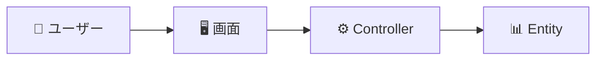

# Issue #117: サービス別ユースケース・ロバストネス・ページ定義MDの作成とインポート

**作成日**: 2025-10-02
**ステータス**: Open
**優先度**: High
**担当**: 未定

## 概要

各サービスのビジネスオペレーションに対して、以下の設計ドキュメントをMD形式で作成し、API経由でDBにインポートする。

- ユースケース定義（UseCase）
- ロバストネス図（Robustness Diagram）
- ページ定義（Page Definition）
- テスト定義（Test Definition）

## 目的

- パラソル設計手法に基づく完全な設計ドキュメントの整備
- 実装非依存の自然言語による設計記述
- UI経由での設計データ確認と編集の実現

## 対象サービス（7サービス）

1. **セキュアアクセスサービス** (`secure-access-service`)
2. **プロジェクト成功支援サービス** (`project-success-service`)
3. **タレント最適化サービス** (`talent-optimization-service`)
4. **生産性可視化サービス** (`productivity-visualization-service`)
5. **ナレッジ共創サービス** (`knowledge-co-creation-service`)
6. **収益最適化サービス** (`revenue-optimization-service`)
7. **コラボレーション促進サービス** (`collaboration-facilitation-service`)

## 作業手順

### フェーズ1: テンプレート準備
- [ ] ユースケース定義テンプレートの確認
- [ ] ロバストネス図テンプレートの確認
- [ ] ページ定義テンプレートの確認
- [ ] テスト定義テンプレートの確認

### フェーズ2: サンプル作成（セキュアアクセスサービス）
- [ ] 1つのビジネスオペレーションを選択
- [ ] ユースケースMD作成（2-3件）
- [ ] ロバストネス図MD作成（各ユースケースに対応）
- [ ] ページ定義MD作成（各ユースケースに対応）
- [ ] テスト定義MD作成（各ユースケースに対応）
- [ ] API経由でインポート実行
- [ ] UI上で表示確認

### フェーズ3: 全サービスへの展開
- [ ] セキュアアクセスサービス（残りのオペレーション）
- [ ] プロジェクト成功支援サービス
- [ ] タレント最適化サービス
- [ ] 生産性可視化サービス
- [ ] ナレッジ共創サービス
- [ ] 収益最適化サービス
- [ ] コラボレーション促進サービス

### フェーズ4: 動作確認とレビュー
- [ ] 全データのインポート確認
- [ ] ツリービューでの階層表示確認
- [ ] 詳細ビューでの内容表示確認
- [ ] 編集機能の動作確認

## ファイル配置ルール

### ディレクトリ構造
```
docs/parasol/services/{service-name}/
├── capabilities/
│   └── {capability-name}/
│       └── operations/
│           └── {operation-name}/
│               ├── usecases/
│               │   ├── {usecase-name}.md
│               │   └── ...
│               ├── robustness/
│               │   ├── {usecase-name}-robustness.md
│               │   └── ...
│               ├── pages/
│               │   ├── {page-name}.md
│               │   └── ...
│               └── tests/
│                   ├── {test-name}.md
│                   └── ...
```

### ファイル命名規則
- ユースケース: `{動詞}-{対象}.md`（例: `register-user.md`）
- ロバストネス: `{usecase-name}-robustness.md`
- ページ定義: `{page-purpose}.md`（例: `user-registration-form.md`）
- テスト定義: `{test-purpose}.md`（例: `user-registration-test.md`）

## ドキュメント記述ルール

### 重要原則
1. **実装非依存**: 特定の技術スタックに依存しない自然言語で記述
2. **MD形式のみ**: HTML、JSON、コードは含めない
3. **ビジネス視点**: ユーザーの目的と価値を中心に記述
4. **Mermaid図**: フローや状態遷移はMermaid記法で表現

### ユースケース定義の必須項目
```markdown
# ユースケース: {ユースケース名}

## 基本情報
- **アクター**: {主アクター}, {副アクター}
- **概要**: {1-2文で説明}

## 事前条件
- {条件1}
- {条件2}

## 基本フロー
1. {ステップ1}
2. {ステップ2}
...

## 代替フロー
### 代替フロー1: {条件}
- {処理内容}

## 例外フロー
### 例外1: {エラー条件}
- {対応処理}

## 事後条件
- {成功時の状態}
```

### ロバストネス図の必須項目
```markdown
# ロバストネス図: {ユースケース名}

## Boundary Objects（境界オブジェクト）
| オブジェクト名 | 種類 | 説明 |
|---------------|------|------|
| {UI要素} | 画面 | {説明} |

## Control Objects（制御オブジェクト）
| オブジェクト名 | 役割 | 説明 |
|---------------|------|------|
| {Controller} | 制御 | {処理内容} |

## Entity Objects（実体オブジェクト）
| オブジェクト名 | 種類 | 説明 |
|---------------|------|------|
| {Entity} | ドメインオブジェクト | {説明} |

## Mermaidダイアグラム

```

### ページ定義の必須項目
```markdown
# ページ定義: {ページ名}

## 画面の目的
{このページの役割}

## 利用者
- **{主要利用者}**: {役割}

## 画面構成
### {セクション1}
- {表示内容}

## 画面の振る舞い
- **{操作}**時: {反応}

## 画面遷移
- 遷移元: {画面名}
- 遷移先: {画面名}
```

### テスト定義の必須項目
```markdown
# テスト定義: {テスト対象}

## テストの目的
{何を確認するか}

## テストケース1: {正常系}
### 事前条件
- {条件}

### テスト手順
1. {操作}

### 期待結果
- {確認項目}
```

## API インポート方法

### 使用API
```typescript
// ユースケース作成
POST /api/parasol/usecases
{
  "operationId": "uuid",
  "name": "register-user",
  "displayName": "ユーザーを登録する",
  "definition": "# ユースケース...(MD全文)"
}

// ロバストネス図作成
POST /api/parasol/robustness
{
  "useCaseId": "uuid",
  "content": "# ロバストネス図...(MD全文)"
}

// ページ定義作成
POST /api/parasol/pages
{
  "useCaseId": "uuid",
  "name": "user-registration-form",
  "displayName": "ユーザー登録フォーム",
  "content": "# ページ定義...(MD全文)"
}

// テスト定義作成
POST /api/parasol/tests
{
  "useCaseId": "uuid",
  "name": "user-registration-test",
  "displayName": "ユーザー登録テスト",
  "content": "# テスト定義...(MD全文)"
}
```

### インポートスクリプト例
```bash
# Node.jsスクリプトでMDファイルを読み込み、API経由で登録
node scripts/import-parasol-docs.js \
  --service secure-access-service \
  --capability authenticate-and-manage-users \
  --operation register-users
```

## 成功基準

### 機能面
- [ ] 全7サービスのユースケースが作成されている
- [ ] 各ユースケースにロバストネス図が作成されている
- [ ] 各ユースケースにページ定義が作成されている
- [ ] 各ユースケースにテスト定義が作成されている
- [ ] DBに正しくインポートされている
- [ ] UI上でツリー表示できている

### 品質面
- [ ] MD形式が統一されている
- [ ] 実装技術への言及がない（自然言語のみ）
- [ ] Mermaid図が正しく表示される
- [ ] ビジネス視点での記述になっている

## 関連Issue
- #116: ビジネスオペレーション→ユースケース階層の実装（完了）
- #101: ドメイン図のフィルタリング機能

## 参考資料
- `/Users/hmoriya/Develop/github/github.com/hmoriya/consultingTool/consulting-dashboard-new/design/parasol/templates/`
  - `usecase-template.md`
  - `robustness-diagram-template.md`
  - `page-definition-template.md`
  - `test-definition-template.md`
- CLAUDE.md: パラソル設計ドキュメント種別と仕様

## 注意事項

1. **段階的な作成を推奨**
   - まず1サービス1オペレーションで完成させる
   - 動作確認後に他へ展開

2. **既存データとの整合性**
   - サービス、ケーパビリティ、オペレーションは既に存在
   - それらのIDを使用してユースケース等を関連付ける

3. **テンプレートの厳守**
   - CLAUDE.mdに記載されたテンプレートに従う
   - 独自の形式は避ける

4. **レビュープロセス**
   - 各サービス完了時にレビュー
   - フィードバックを次のサービスに反映
