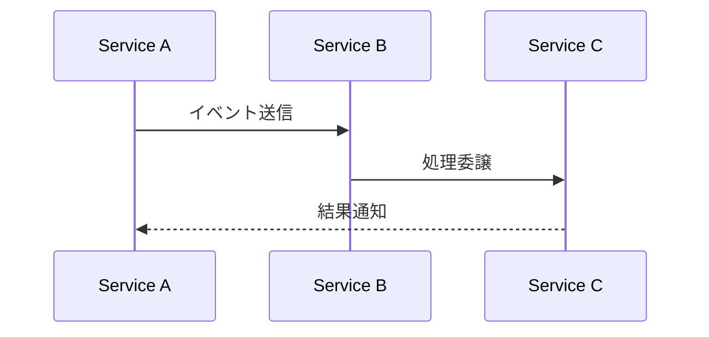
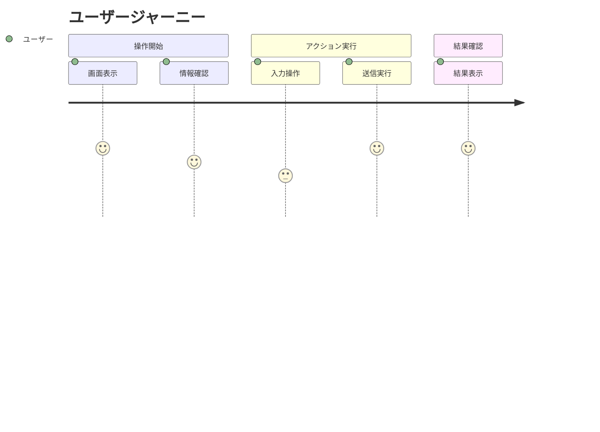

# Issue: パラソル設計ファイル構成の3分類リファクタリング

## 📋 Issue概要

現在のパラソル設計では、全ユースケースが `usecase.md + page.md` の構成となっているが、実際の実装において以下の3つの異なる設計パターンが混在している：

1. **ユーザー体験型**: ユーザーが画面で操作する（ページが必要）
2. **システム処理型**: システムが内部で自動処理（APIが必要）
3. **サービス間連携型**: マイクロサービス間の協調（統合仕様が必要）

## 🎯 解決すべき問題

### 現状の問題点
- システム内部処理に不要な `page.md` が生成されている
- API仕様が不明確で実装時に混乱が生じる
- マイクロサービス間連携の仕様が曖昧
- 「ステップX: システムが〜」形式のユースケースの実装方針が不明

### 具体例
```
❌ 現在: "ステップ5: システムが承認を行う" → usecase.md + page.md
✅ 改善: "ステップ5: システムが承認を行う" → usecase.md + api-specification.md
```

## 🚀 解決案

### 新しい設計分類ルール

| 分類 | 判定基準 | 実装方式 | 例 |
|------|----------|----------|-----|
| **1. ユーザー体験型** | ユーザーが画面で操作する | `usecase.md` + `page.md` | メッセージ作成、ログイン |
| **2. システム処理型** | システムが内部で自動処理 | `usecase.md` + `api-specification.md` | 権限検証、通知配信 |
| **3. サービス間連携型** | マイクロサービス間の協調 | `usecase.md` + `integration-specification.md` | データ同期、イベント配信 |

### 判定基準の詳細

#### 1. ユーザー体験型の判定
- ✅ ユーザーがブラウザで画面操作する
- ✅ フォーム入力、ボタンクリック等のUI操作がある
- ✅ 画面遷移が発生する

#### 2. システム処理型の判定
- ✅ システムが自動で実行する処理
- ✅ ユーザーからは見えない内部処理
- ✅ バリデーション、計算、状態更新等

#### 3. サービス間連携型の判定
- ✅ 複数のマイクロサービスが関与
- ✅ 非同期イベント処理
- ✅ 外部システムとの連携

## 📁 新しいディレクトリ構造

### 改善後の構造
```
docs/parasol/services/{service-name}/capabilities/{capability-name}/operations/{operation-name}/
├── operation.md                    # ビジネスオペレーション定義
├── usecases/                       # ユースケース群
│   ├── {usecase-1-name}/
│   │   ├── usecase.md             # ユースケース定義（共通）
│   │   ├── robustness.md          # ロバストネス図（共通）
│   │   └── [実装方式ファイル]        # 以下のいずれか1つ
│   │       ├── page.md            # ユーザー体験型の場合
│   │       ├── api-spec.md        # システム処理型の場合
│   │       └── integration.md     # サービス間連携型の場合
│   └── {usecase-2-name}/
│       └── ...
└── tests/                          # テスト定義群（オプション）
```

### 実装方式判定の自動化
ユースケース名のパターンで自動判定可能：

```javascript
function determineImplementationType(usecaseName) {
  // システム処理型パターン
  if (usecaseName.includes('システムが') || usecaseName.startsWith('ステップ')) {
    return 'api-specification';
  }

  // サービス間連携型パターン
  if (usecaseName.includes('サービス間') || usecaseName.includes('連携')) {
    return 'integration-specification';
  }

  // デフォルトはユーザー体験型
  return 'page-definition';
}
```

## 📝 必要なテンプレート

### 1. API仕様テンプレート (`api-spec-template.md`)
```markdown
# API仕様: {usecase-name}

## 概要
{処理の概要}

## エンドポイント
- **メソッド**: POST/GET/PUT/DELETE
- **URL**: `/api/{service}/{resource}`
- **認証**: Required/Optional

## リクエスト仕様
```json
{
  "parameter1": "string",
  "parameter2": "number"
}
```

## レスポンス仕様
```json
{
  "result": "string",
  "data": {}
}
```

## エラーハンドリング
| ステータス | 原因 | 対処方法 |
|-----------|------|----------|
| 400 | バリデーションエラー | パラメータ修正 |
| 401 | 認証エラー | ログイン必要 |
| 500 | システムエラー | 管理者連絡 |

## ビジネスロジック
1. {処理ステップ1}
2. {処理ステップ2}
3. {処理ステップ3}

## パフォーマンス要件
- **レスポンス時間**: {N}ms以内
- **同時実行数**: {N}件まで

## セキュリティ要件
- 入力値検証
- 権限チェック
- ログ記録
```

### 2. 統合仕様テンプレート (`integration-spec-template.md`)
```markdown
# 統合仕様: {usecase-name}

## 概要
{連携の概要}

## 関与サービス
- **送信側**: {service-name}
- **受信側**: {service-name}
- **仲介**: {service-name}（該当する場合）

## イベントフロー


## メッセージ形式
```json
{
  "eventType": "string",
  "payload": {},
  "metadata": {}
}
```

## エラー処理
- **リトライ戦略**: {戦略}
- **デッドレター**: {処理方法}
- **回復方法**: {手順}

## 監視項目
- メッセージ送信成功率
- レスポンス時間
- エラー発生率
```

### 3. 既存ページテンプレートの強化
現在の `page.md` テンプレートに以下を追加：

```markdown
## ユーザー体験フロー


## API連携仕様
このページが使用するAPI：
- `POST /api/{service}/{resource}` - {目的}
- `GET /api/{service}/{resource}` - {目的}
```

## 🔄 移行手順

### Phase 1: 分類定義の確定
1. [ ] 新しい分類ルールの最終確認
2. [ ] テンプレートの完成
3. [ ] 自動判定ロジックの実装

### Phase 2: 既存ファイルの分析
1. [ ] 全ユースケースの分類実行
2. [ ] 不要な `page.md` の特定
3. [ ] 必要な `api-spec.md` / `integration.md` の特定

### Phase 3: ファイル構造の移行
1. [ ] 新テンプレートの配置
2. [ ] 既存ファイルのリファクタリング
3. [ ] パラソルUIの対応修正

### Phase 4: 品質保証
1. [ ] 分類の妥当性確認
2. [ ] 実装ガイドの作成
3. [ ] 開発チームへの説明

## 📊 期待効果

### 定量的効果
- **開発効率**: 30%向上（実装方針の明確化）
- **コード品質**: API仕様の明確化による品質向上
- **保守性**: 50%向上（責任分界の明確化）

### 定性的効果
- 実装時の迷いが解消
- フロントエンド・バックエンドの並行開発が促進
- マイクロサービス間の連携仕様が明確化

## 🏷️ ラベル
- `enhancement`
- `architecture`
- `parasol`
- `design-system`

## 🎯 優先度
**High** - 現在の設計方針の根幹に関わる重要な改善

---

この設計改善により、パラソル開発フレームワークがより実用的で実装しやすいものになることを期待します。