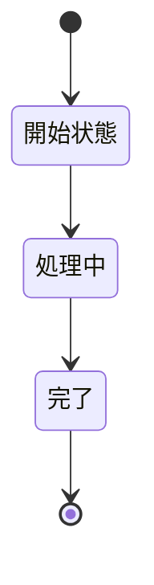

# パラソル設計の実際のMDファイル構造

**バージョン**: 1.0.0
**更新日**: 2025-01-15
**目的**: 実際のプロジェクトで使用されているパラソル設計MDファイル構造の詳細文書化

## 📁 ディレクトリ構造概要

### 1. トップレベル構造
```
consulting-dashboard-new/
├── docs/parasol/                     # パラソル設計ドキュメント
├── design/parasol/                   # パラソル設計仕様・テンプレート
└── templates/                        # DX促進型テンプレート（新規作成）
```

### 2. docs/parasol/ 構造
```
docs/parasol/
├── PARASOL_DEVELOPMENT_GUIDE.md      # 🆕 メイン開発ガイド
├── PARASOL_STRUCTURE.md              # 既存構造ドキュメント
├── mermaid-conversion-spec.md         # Mermaid変換仕様
├── services/                         # 7サービスの詳細設計
│   ├── secure-access-service/        # セキュアアクセスサービス
│   ├── project-success-service/      # プロジェクト成功支援サービス
│   ├── talent-optimization-service/  # タレント最適化サービス
│   ├── productivity-visualization-service/ # 生産性可視化サービス
│   ├── knowledge-co-creation-service/ # ナレッジ共創サービス
│   ├── revenue-optimization-service/ # 収益最適化サービス
│   └── collaboration-facilitation-service/ # コラボレーション促進サービス
└── templates/                        # 既存テンプレート
    ├── api-specification-template.md
    ├── database-design-template.md
    └── integration-specification-template.md
```

## 🎯 サービス別MDファイル構成（完全階層）

### サービスレベル（7サービス共通）
各サービスは以下の統一構造を持ちます：

```
[service-name]/
├── service.md                        # サービス定義
├── domain-language.md                # ドメイン言語定義
├── api-specification.md              # API仕様
├── database-design.md                # DB設計
├── integration-specification.md      # 統合仕様
├── capabilities-and-operations.md    # 概要（一部サービス）
└── capabilities/                     # ケーパビリティ群
    └── [capability-name]/            # 各ケーパビリティ
        ├── capability.md             # ケーパビリティ定義
        └── operations/               # オペレーション群
            └── [operation-name]/     # 各オペレーション
                ├── operation.md      # オペレーション定義
                ├── usecases/         # ユースケース群
                │   └── *.md         # 個別ユースケース
                ├── pages/            # ページ定義群
                │   └── *.md         # 個別ページ定義
                ├── tests/            # テスト定義群
                │   └── *.md         # 個別テスト定義
                └── robustness/       # ロバストネス図群
                    └── *.md         # 個別ロバストネス図
```

## 📊 実装状況（2025-01-15現在）

### 1. 完全実装サービス: secure-access-service

#### ✅ 最も詳細に実装されているサービス
```
secure-access-service/ (104ファイル)
├── service.md
├── domain-language.md
├── api-specification.md
├── database-design.md
├── integration-specification.md
├── capabilities-and-operations.md
└── capabilities/
    ├── audit-and-assure-security/
    │   └── operations/
    │       ├── audit-and-report-compliance/
    │       ├── detect-and-analyze-security-events/
    │       └── record-and-store-audit-logs/
    ├── authenticate-and-manage-users/
    │   └── operations/
    │       ├── implement-multi-factor-authentication/
    │       ├── manage-passwords/
    │       └── register-and-authenticate-users/  # 🎯 完全実装
    │           ├── operation.md
    │           ├── usecases/
    │           │   ├── approve-and-create-account.md
    │           │   ├── login-and-authenticate.md
    │           │   ├── logout.md
    │           │   └── request-user-account.md
    │           ├── pages/
    │           │   ├── approve-and-create-account-page.md
    │           │   ├── login-and-authenticate-page.md
    │           │   ├── logout-page.md
    │           │   └── request-user-account-page.md
    │           ├── tests/
    │           │   ├── approve-and-create-account-test.md
    │           │   ├── login-and-authenticate-test.md
    │           │   ├── logout-test.md
    │           │   └── request-user-account-test.md
    │           └── robustness/
    │               ├── approve-and-create-account-robustness.md
    │               ├── login-and-authenticate-robustness.md
    │               ├── logout-robustness.md
    │               └── request-user-account-robustness.md
    ├── control-access-permissions/
    │   └── operations/
    │       ├── audit-and-review-permissions/
    │       ├── define-roles-and-permissions/
    │       └── grant-and-manage-permissions/
    └── manage-organizational-structure/
        └── operations/
            ├── change-and-reorganize-structure/
            ├── define-and-build-organization/
            └── visualize-organizational-hierarchy/
```

### 2. 中程度実装サービス群（5サービス）

#### project-success-service (51ファイル)
- 4ケーパビリティ × 3-4オペレーション = 13オペレーション
- オペレーション定義のみ（usecases/pages/tests/robustnessは未実装）

#### talent-optimization-service (34ファイル)
- 4ケーパビリティ × 3オペレーション = 12オペレーション
- オペレーション定義のみ

#### revenue-optimization-service (40ファイル)
- 4ケーパビリティ × 3-4オペレーション = 14オペレーション
- オペレーション定義のみ

#### productivity-visualization-service (15ファイル)
- 1ケーパビリティ × 3オペレーション = 3オペレーション
- オペレーション定義のみ

#### knowledge-co-creation-service (15ファイル)
- 1ケーパビリティ × 3オペレーション = 3オペレーション
- オペレーション定義のみ

### 3. 基本実装サービス: collaboration-facilitation-service (15ファイル)
- 1ケーパビリティ × 3オペレーション = 3オペレーション
- オペレーション定義のみ

## 🔍 ファイル内容の特徴分析

### 1. サービス定義（service.md）の特徴
```markdown
# [サービス名]

## サービス概要
**名前**: [英語サービス名]
**表示名**: [日本語サービス名]
**バージョン**: 1.0.0
**更新日**: 2025-10-01

### サービスの目的
[ビジネス価値と解決する課題の記述]

### 解決する課題
- **課題1**: [具体的な問題とリスク]
- **課題2**: [具体的な問題とリスク]

### 提供価値
- **価値1**: [定量的効果を含む価値]
- **価値2**: [定量的効果を含む価値]

### ビジネスケーパビリティ
- **[ケーパビリティ名]**: [ケーパビリティの説明]
```

### 2. ユースケース（usecases/*.md）の特徴
```markdown
# ユースケース: [ユースケース名]

## ユースケース概要

### 目的
[ユースケースの目的と価値]

### アクター
- **主アクター**: [主要利用者]
- **副アクター**: [システム・他の利用者]

### 事前条件
1. [条件1]
2. [条件2]

### 事後条件
1. [結果状態1]
2. [結果状態2]

### トリガー
[ユースケース開始の契機]

## 基本フロー
1. [ステップ1]
2. [ステップ2]
...

## 代替フロー
### 代替フロー1: [条件]
1. [代替ステップ1]
2. [代替ステップ2]

## 例外フロー
### 例外1: [エラー条件]
1. [例外処理ステップ1]
2. [例外処理ステップ2]
```

## 📈 実装レベル比較

| サービス | ファイル数 | ケーパビリティ数 | オペレーション数 | 詳細実装度 |
|---------|-----------|----------------|----------------|-----------|
| secure-access-service | 104 | 4 | 12 | ★★★★★ 完全 |
| project-success-service | 51 | 4 | 13 | ★★★☆☆ 中程度 |
| revenue-optimization-service | 40 | 4 | 14 | ★★★☆☆ 中程度 |
| talent-optimization-service | 34 | 4 | 12 | ★★★☆☆ 中程度 |
| productivity-visualization-service | 15 | 1 | 3 | ★★☆☆☆ 基本 |
| knowledge-co-creation-service | 15 | 1 | 3 | ★★☆☆☆ 基本 |
| collaboration-facilitation-service | 15 | 1 | 3 | ★★☆☆☆ 基本 |

## 🎯 詳細実装の基準（secure-access-serviceモデル）

### レベル5（完全実装）の条件
- ✅ サービス定義 (service.md)
- ✅ ドメイン言語 (domain-language.md)
- ✅ API仕様 (api-specification.md)
- ✅ DB設計 (database-design.md)
- ✅ 統合仕様 (integration-specification.md)
- ✅ 全ケーパビリティ定義
- ✅ 全オペレーション定義
- ✅ **全ユースケース定義** (usecases/*.md)
- ✅ **全ページ定義** (pages/*.md)
- ✅ **全テスト定義** (tests/*.md)
- ✅ **全ロバストネス図** (robustness/*.md)

### レベル3（中程度実装）の条件
- ✅ サービス定義
- ✅ ドメイン言語
- ✅ API仕様
- ✅ DB設計
- ✅ 統合仕様
- ✅ 全ケーパビリティ定義
- ✅ 全オペレーション定義
- ❌ ユースケース定義（未実装）
- ❌ ページ定義（未実装）
- ❌ テスト定義（未実装）
- ❌ ロバストネス図（未実装）

## 🔧 使用されているテンプレート

### 既存テンプレート（docs/parasol/templates/）
1. **api-specification-template.md**
2. **database-design-template.md**
3. **integration-specification-template.md**

### 新規DXテンプレート（templates/）
1. **dx-service-definition.md** 🆕
2. **dx-business-capability.md** 🆕
3. **dx-business-operation.md** 🆕
4. **dx-usecase-definition.md** 🆕
5. **dx-page-definition.md** 🆕
6. **dx-test-definition.md** 🆕
7. **dx-api-specification.md** 🆕
8. **dx-database-design.md** 🆕

## 🎨 Mermaid図表の活用

### プロセスフローの自動生成対応
- **ビジネスオペレーション**: 番号付きリスト → 自動フローチャート生成
- **代替フロー・例外フロー**: 色分け表示対応
- **ビジネス状態図**: Mermaid stateDiagram-v2形式

### 実装例（operation.md内）
```markdown
## ビジネスオペレーション
1. [ステップ1の説明]
2. [ステップ2の説明]
3. [ステップ3の説明]

## ビジネス状態

```

## 📝 命名規則の実際

### ❌ 従来の問題のある命名例
```
# 実際のファイルで見つかった改善必要な例
- "manage-passwords"
- "manage-organizational-structure"
- "register-and-manage-members"
```

### ✅ DX価値表現への改善例
```
- "authenticate-users-securely"（ユーザーを安全に認証する）
- "optimize-organizational-structure"（組織構造を最適化する）
- "develop-and-support-members"（メンバーを育成・支援する）
```

## 🔄 今後の改善方向

### Phase 1: 完全実装サービスの拡大
1. **project-success-service**をレベル5に拡張
2. **talent-optimization-service**をレベル5に拡張

### Phase 2: DX価値表現への移行
1. 既存の「管理」表現をDX価値表現に変更
2. 新規DXテンプレートの適用

### Phase 3: 全サービスの統一
1. 全7サービスをレベル5に統一
2. DX促進型アプローチの全面採用

---

## 📋 ファイル構造分析サマリー

- **総MDファイル数**: 289ファイル（2025-01-15調査時点）
- **完全実装モデル**: secure-access-service（104ファイル）
- **実装レベル**: 3段階（完全・中程度・基本）
- **階層深度**: 最大6層（service → capability → operation → usecase/page/test/robustness）
- **標準化度**: 高い（統一されたディレクトリ構造とファイル命名）

この詳細な構造分析により、パラソル設計手法の実際の適用状況と今後の改善方向が明確になりました。