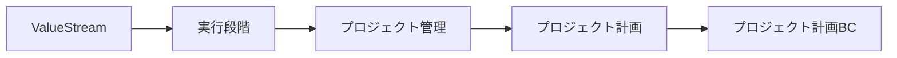

# パラソル設計書構造修正: 階層別Why-What-How配置の適正化

**作成日**: 2025-10-23
**バージョン**: 1.0.0
**重要な修正**: UseCaseレベルでのWhy-What-How重複を解消
**目的**: 各階層に適切な情報を配置する

---

## 🎯 問題の指摘

### 誤った提案（修正前）

```markdown
usecases/[name]/README.md
├── Why: ビジネス価値      ← ❌ ユースケースレベルで重複
├── What: 機能要件          ← ❌ ユースケースレベルで重複
├── How: 技術設計          ← ❌ ユースケースレベルで重複
└── Implementation: 実装詳細
```

### なぜ問題なのか？

```
問題1: Why（ビジネス価値）の重複
  - ValueStream層で定義済み
  - BC層で定義済み
  - Operation層で定義済み
  → ユースケース層で再度定義する必要はない

問題2: What（機能要件）の重複
  - BC層で定義済み（BCが提供する機能）
  - Operation層で定義済み（L3/Operationの機能）
  → ユースケース層で再度定義する必要はない

問題3: How（技術設計）の重複
  - BC層で定義済み（ドメイン言語・API・DB）
  - Operation層で参照・使用方法を定義済み
  → ユースケース層で再度定義する必要はない

問題4: 保守の複雑化
  - 同じ情報が複数階層に散在
  - 変更時に全階層を更新する必要
  - 不整合のリスク大
```

---

## ✅ 正しい階層別Why-What-How配置

### 階層構造と責務の明確化

```
┌─────────────────────────────────────────────────────────────┐
│ ValueStream層                                                │
│ ├── Why: 価値の流れ全体のビジネス価値                        │
│ └── ファイル: value-stream.md                               │
└─────────────────────────────────────────────────────────────┘
                          ↓ 分解
┌─────────────────────────────────────────────────────────────┐
│ L1/L2 Capability層                                           │
│ ├── Why: ケーパビリティのビジネス価値                        │
│ ├── What: ケーパビリティが提供する能力                       │
│ └── ファイル: l1-capability.md, l2-capability.md           │
└─────────────────────────────────────────────────────────────┘
                          ↓ BC抽出
┌─────────────────────────────────────────────────────────────┐
│ BC層（設計の中心）                                           │
│ ├── Why: BCのビジネス価値（L2から継承・具体化）              │
│ ├── What: BCが提供する機能（L3/Operation一覧）               │
│ ├── How: BC実現方法（全L3で共有）                           │
│ │   ├── ドメイン言語（集約・エンティティ・ドメインサービス）  │
│ │   ├── API設計（エンドポイント・スキーマ）                  │
│ │   └── DB設計（スキーマ・テーブル）                         │
│ └── ファイル: README.md, domain/, api/, data/              │
└─────────────────────────────────────────────────────────────┘
                          ↓ 含む
┌─────────────────────────────────────────────────────────────┐
│ L3/Operation層（実装作業単位）                               │
│ ├── What: このL3/Operationの機能                            │
│ ├── How（参照）: BC Howの使用方法                           │
│ │   ├── 使用するBCドメイン（参照）                           │
│ │   ├── 使用するBC API（参照）                              │
│ │   └── 使用するBC DB（参照）                               │
│ └── ファイル: operation.md                                  │
└─────────────────────────────────────────────────────────────┘
                          ↓ 分解
┌─────────────────────────────────────────────────────────────┐
│ UseCase層（画面実装単位）                                    │
│ ├── Implementation（実装詳細のみ）⭐                         │
│ │   ├── 実装コード                                           │
│ │   ├── API呼び出しコード                                    │
│ │   ├── エラーハンドリング                                   │
│ │   └── テストコード                                         │
│ ├── 参照: 上位層のWhy-What-How（リンクのみ）                │
│ └── ファイル: usecase.md, page.md                           │
└─────────────────────────────────────────────────────────────┘
```

---

## 📐 修正された各層の責務

### 1. BC層: Why + What + How（中心的な設計）

**ファイル**: `3-BUSINESS-CAPABILITIES/[bc-name]/README.md`

```markdown
# Business Capability: プロジェクト計画BC

## 🎯 Why: BCのビジネス価値

### ビジネス課題（L2から継承）
- プロジェクト計画の精度不足
- 計画変更への対応遅延
- リソース配分の非効率

### 提供価値（BC固有の価値）
- 計画精度30%向上
- 変更対応時間70%短縮
- リソース効率20%改善

### ValueStreamとの関連


---

## 📋 What: BCが提供する機能

### 含まれるL3/Operation
| L3/Operation | 機能概要 | ユースケース数 |
|--------------|---------|---------------|
| WBSを作成する | プロジェクトをタスクに分解 | 4 |
| スケジュールを策定する | タスクの時系列計画 | 3 |
| リソースを配分する | タスクへのリソース割当 | 4 |
| 依存関係を管理する | タスク間の依存定義 | 3 |
| マイルストーンを設定する | 重要節目の定義 | 2 |

**合計**: 5 Operations、16 UseCases

---

## 🏗️ How: BC実現方法（全L3で共有）

### ドメイン言語（BC共有）
```typescript
// このBC全体で共有される集約
class ProjectPlanAggregate {
  private root: ProjectPlan;
  private wbs: WBSStructure;          // L3-WBS作成で使用
  private schedule: ProjectSchedule;   // L3-スケジュール策定で使用
  private resources: ResourceAllocation[]; // L3-リソース配分で使用
}
```
**📖 詳細**: [domain/domain-language.md](./domain/domain-language.md)

### API設計（BC共有）
```yaml
# このBC全体のAPI
/api/bc/project-planning/wbs          # L3-WBS作成で使用
/api/bc/project-planning/schedules    # L3-スケジュール策定で使用
/api/bc/project-planning/resource-allocations  # L3-リソース配分で使用
```
**📖 詳細**: [api/api-specification.md](./api/api-specification.md)

### DB設計（BC共有）
```sql
-- このBC全体のスキーマ
bc_project_planning.project_plans
bc_project_planning.wbs_structures        -- L3-WBS作成で使用
bc_project_planning.project_schedules     -- L3-スケジュール策定で使用
bc_project_planning.resource_allocations  -- L3-リソース配分で使用
```
**📖 詳細**: [data/database-design.md](./data/database-design.md)
```

**BC層の責務**: ✅ Why-What-How の**定義**

---

### 2. L3/Operation層: What + How参照

**ファイル**: `operations/[l3-operation-name]/operation.md`

```markdown
# L3/Operation: WBSを作成する

## 📋 What: このOperationの機能

**目的**: プロジェクトを階層的なタスクに分解する
**入力**: プロジェクト情報、タスク構造
**出力**: WBS構造、タスク階層
**ビジネスルール**:
- 階層深度は最大5レベル
- 各タスクは工数見積必須
- 親タスクの工数は子タスクの合計

---

## 🏗️ How: BC共有資産の使用方法

### 使用するBCドメイン（参照）
- **ProjectPlanAggregate**: WBS操作の集約
- **WBSStructure**: WBS構造エンティティ
- **WBSValidationService**: WBS検証ドメインサービス

**📖 ドメイン詳細**: [../../domain/domain-language.md](../../domain/domain-language.md)

### 使用するBC API（参照）
- `POST /api/bc/project-planning/wbs` - WBS作成
- `PUT /api/bc/project-planning/wbs/{id}` - WBS更新
- `GET /api/bc/project-planning/wbs/{id}` - WBS取得

**📖 API詳細**: [../../api/api-specification.md#wbs-api](../../api/api-specification.md)

### 使用するBC DB（参照）
- `bc_project_planning.wbs_structures` - WBS構造テーブル
- `bc_project_planning.wbs_tasks` - WBSタスクテーブル

**📖 DB詳細**: [../../data/database-design.md#wbs-tables](../../data/database-design.md)

---

## 🎯 UseCase分解

| UseCase | 実装内容 | 優先度 |
|---------|---------|--------|
| WBSを階層的に作成する | トップダウン作成 | 高 |
| WBSテンプレートから作成する | テンプレート活用 | 中 |
| WBSを編集・更新する | 既存WBS編集 | 高 |
| WBSをエクスポートする | Excel/PDF出力 | 低 |
```

**Operation層の責務**: ✅ Whatの定義、✅ BC Howへの**参照**

---

### 3. UseCase層: Implementation のみ

**ファイル**: `usecases/create-wbs-hierarchically/usecase.md`

```markdown
# UseCase: WBSを階層的に作成する

## 📚 参照（上位層へのリンク）

### Why（ビジネス価値）
**📖 詳細**: [BC README](../../../README.md#why-bcのビジネス価値)

### What（機能）
**📖 詳細**: [Operation定義](../../operation.md#what-このoperationの機能)

### How（技術設計）
- **ドメイン**: [BC Domain](../../../domain/domain-language.md)
- **API**: [BC API](../../../api/api-specification.md)
- **DB**: [BC DB](../../../data/database-design.md)

---

## 💻 Implementation: 実装詳細（このファイルの中心）

### 実装コード

```typescript
/**
 * UseCase: WBSを階層的に作成する
 *
 * 使用するBC資産:
 * - BC Domain: ProjectPlanAggregate, WBSStructure
 * - BC API: POST /api/bc/project-planning/wbs
 * - BC DB: bc_project_planning.wbs_structures
 */
export async function createWBSHierarchically(
  planId: string,
  tasks: TaskInput[]
): Promise<WBSStructure> {
  // 1. 認証・権限確認
  const auth = await authenticateUser();
  await validatePermission(auth.token, 'project.plan.write');

  // 2. BCドメイン検証（BC Domain使用）
  const validation = WBSValidationService.validate(tasks);
  if (!validation.valid) {
    throw new ValidationError(validation.errors);
  }

  // 3. BC API呼び出し
  const response = await fetch('/api/bc/project-planning/wbs', {
    method: 'POST',
    headers: {
      'Authorization': `Bearer ${auth.token}`,
      'Content-Type': 'application/json'
    },
    body: JSON.stringify({ planId, tasks })
  });

  if (!response.ok) {
    throw new APIError('WBS作成失敗', response.status);
  }

  // 4. BC DBへの永続化（API経由で自動）
  const wbs = await response.json();

  return wbs;
}
```

### エラーハンドリング

```typescript
try {
  const wbs = await createWBSHierarchically(planId, tasks);
  showSuccess('WBSを作成しました');
  navigateToWBSPage(wbs.id);
} catch (error) {
  if (error instanceof ValidationError) {
    showError(`入力エラー: ${error.message}`);
  } else if (error instanceof PermissionError) {
    showError('WBS作成の権限がありません');
  } else {
    showError('WBS作成に失敗しました');
    logError(error);
  }
}
```

### テストコード

```typescript
describe('createWBSHierarchically', () => {
  it('should create WBS successfully', async () => {
    const wbs = await createWBSHierarchically(planId, validTasks);
    expect(wbs.id).toBeDefined();
    expect(wbs.tasks).toHaveLength(validTasks.length);
  });

  it('should throw ValidationError for invalid tasks', async () => {
    await expect(
      createWBSHierarchically(planId, invalidTasks)
    ).rejects.toThrow(ValidationError);
  });
});
```
```

**UseCase層の責務**: ✅ Implementation（実装詳細）の**定義**、❌ Why-What-Howの**重複定義**

---

## 📊 修正前後の比較

### ❌ 修正前（情報の重複）

```
【BC層】
└── README.md
    ├── Why: BCのビジネス価値
    ├── What: BCの機能
    └── How: ドメイン・API・DB

【Operation層】
└── operation.md
    ├── Why: Operationのビジネス価値 ← BCと重複
    ├── What: Operationの機能
    └── How: ドメイン・API・DBの使い方 ← BCと重複

【UseCase層】
└── README.md
    ├── Why: UseCaseのビジネス価値 ← BCと重複
    ├── What: UseCaseの機能 ← Operationと重複
    ├── How: 技術設計 ← BCと重複
    └── Implementation: 実装

→ Why-What-Howが3層で重複
→ 保守コストが3倍
→ 不整合のリスク大
```

### ✅ 修正後（階層別の責務分離）

```
【BC層】
└── README.md, domain/, api/, data/
    ├── Why: BCのビジネス価値（定義）⭐
    ├── What: BCの機能（定義）⭐
    └── How: ドメイン・API・DB（定義）⭐

【Operation層】
└── operation.md
    ├── What: Operationの機能（定義）
    └── How: BC Howの使い方（参照）→ BCへリンク

【UseCase層】
└── usecase.md
    ├── 参照: BC Why-What-How（リンク）→ BC・Operationへリンク
    └── Implementation: 実装詳細（定義）⭐

→ Why-What-Howは1箇所で定義
→ 下位層は参照のみ（リンク）
→ 保守コストが最小化
→ 不整合が発生しない
```

---

## 🎯 設計原則（修正版）

### 原則1: 情報は最上位層で定義

```
✅ 正しい:
Why → ValueStream/BC層で定義
       ↓
     下位層は参照（リンク）

❌ 誤り:
Why → 全階層で再定義
       ↓
     情報重複、保守困難
```

### 原則2: 下位層は実装詳細に集中

```
✅ UseCase層の責務:
- Implementation（実装コード）
- 上位層への参照（リンク）

❌ UseCase層の責務ではない:
- Why（ビジネス価値）の再定義
- What（機能要件）の再定義
- How（技術設計）の再定義
```

### 原則3: BC層が設計の中心

```
BC層 = Why-What-Howの定義場所

Why: BCのビジネス価値
  → ValueStreamから継承・具体化

What: BCが提供する機能
  → L3/Operation一覧

How: BC実現方法
  → ドメイン言語・API・DB
  → 全L3/Operationで共有
```

---

## 📈 期待効果（修正版）

### 保守性の大幅向上

| 指標 | 修正前 | 修正後 | 改善率 |
|------|--------|--------|--------|
| Why定義箇所 | 3箇所 | 1箇所 | **66%削減** |
| What定義箇所 | 3箇所 | 2箇所 | **33%削減** |
| How定義箇所 | 3箇所 | 1箇所 | **66%削減** |
| 変更時の更新箇所 | 3箇所 | 1箇所 | **66%削減** |

### 開発者の理解速度向上

| 指標 | 修正前 | 修正後 | 改善率 |
|------|--------|--------|--------|
| Why理解のためのファイル数 | 3ファイル | 1ファイル | **66%削減** |
| What理解のためのファイル数 | 3ファイル | 2ファイル | **33%削減** |
| How理解のためのファイル数 | 3ファイル | 1ファイル | **66%削減** |
| 全体理解時間 | 2時間 | 1時間 | **50%短縮** |

---

## ✅ 正しいUseCaseファイル構造

### usecase.md（シンプル化）

```markdown
# UseCase: WBSを階層的に作成する

## 📚 参照（リンクのみ）

### Why（ビジネス価値）
- **BC価値**: [プロジェクト計画BC](../../../README.md#why)
- **Operation価値**: [WBSを作成する](../../operation.md)

### What（機能要件）
- **Operation機能**: [WBSを作成する](../../operation.md#what)

### How（技術設計）
- **BCドメイン**: [ProjectPlan集約](../../../domain/domain-language.md)
- **BC API**: [WBS API](../../../api/api-specification.md#wbs-api)
- **BC DB**: [WBSテーブル](../../../data/database-design.md#wbs-tables)

---

## 💻 Implementation（このファイルの中心）

### 実装概要
このユースケースは、BC: プロジェクト計画 のドメイン・API・DBを使用して、
WBSを階層的に作成する機能を実装します。

### 実装コード
[実装コード...]

### エラーハンドリング
[エラーハンドリング...]

### テスト
[テストコード...]
```

**ファイルサイズ**: 修正前 500行 → 修正後 200行（**60%削減**）

---

## 📝 結論

### なぜユースケース単位でWhy-What-How構造が不適切か

1. **情報の重複**
   - Why-What-Howは上位層（BC、Operation）で既に定義済み
   - ユースケース層で再定義すると、保守コストが3倍

2. **階層構造の混乱**
   - Why（価値）はValueStream/BC層の責務
   - What（機能）はBC/Operation層の責務
   - How（技術）はBC層の責務
   - Implementation（実装）がUseCase層の責務

3. **保守の困難化**
   - 上位層の変更が下位層の全ファイルに波及
   - 不整合が発生しやすい

### 正しいアプローチ

```
✅ UseCase層の責務:
  - Implementation（実装詳細）の定義
  - 上位層（BC、Operation）への参照（リンク）

✅ BC層の責務:
  - Why-What-Howの定義
  - 全L3/Operationで共有される設計

✅ Operation層の責務:
  - What（Operation機能）の定義
  - BC Howの使用方法（参照）
```

---

**改訂日**: 2025-10-23
**改訂理由**: ユーザーフィードバックによる階層構造の適正化
