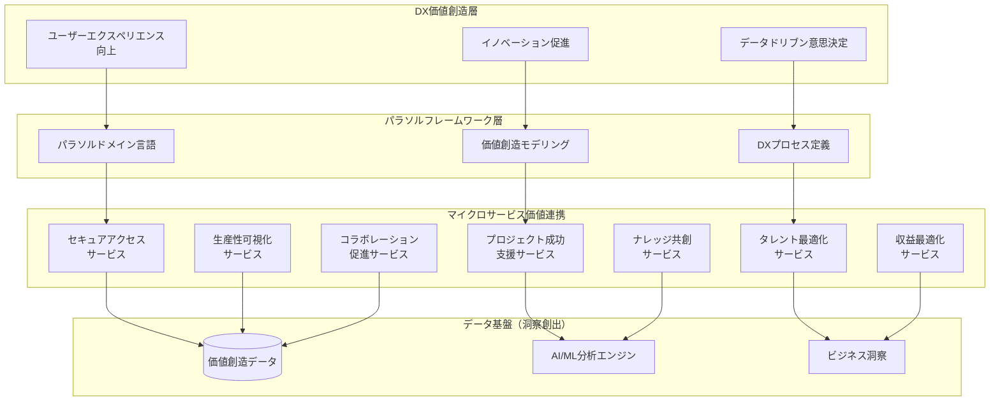
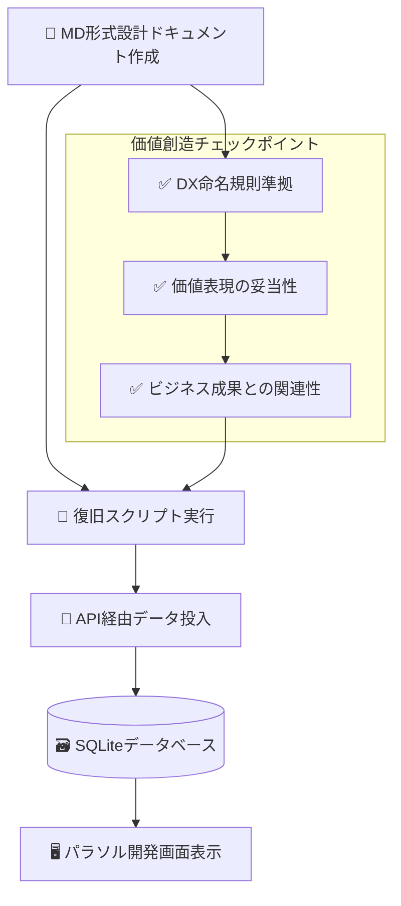

# パラソル開発ガイド - DX価値創造型フレームワーク

**バージョン**: 1.0.0
**更新日**: 2025-01-04
**ステータス**: Draft

## 目次

1. [フレームワーク概要](#1-フレームワーク概要)
2. [DX促進アーキテクチャ](#2-dx促進アーキテクチャ)
3. [MDファイル構成（実際の構造）](#3-mdファイル構成実際の構造)
4. [DX階層構造定義](#4-dx階層構造定義)
5. [価値創造型開発プロセス](#5-価値創造型開発プロセス)
6. [DXテンプレート・仕様書](#6-dxテンプレート仕様書)
7. [DX実装ガイド](#7-dx実装ガイド)
8. [DX品質管理](#8-dx品質管理)
9. [MD形式統一による品質保証](#9-md形式統一による品質保証)

---

## 1. フレームワーク概要

### パラソルドメイン言語とは

パラソルドメイン言語は、**デジタルトランスフォーメーション（DX）を促進**するために設計された実装非依存の中間言語です。従来の「管理」思考を脱却し、**価値創造型のビジネス設計**を推進します。

#### 基本原則

```
❌ 管理思考（従来型）     ✅ 価値創造思考（DX型）
━━━━━━━━━━━━━━━━━━━━━━━━━━━━━━━━━━━━━━━━━━━━━━━━━━━
顧客管理               → 顧客エンゲージメント強化
プロジェクト管理       → プロジェクト成功支援
データ管理             → データから洞察を創出
在庫管理               → 在庫を最適化
```

#### DX促進の設計思想

1. **実装中立性**: 特定のプログラミング言語に依存しない
2. **ドメイン駆動設計（DDD）準拠**: エンティティ、値オブジェクト、集約などのDDD概念を表現
3. **ユビキタス言語**: ビジネスとテクノロジーの橋渡しとなる共通語彙
4. **生成可能**: ドメイン定義から実装コード（DB、API）を自動生成
5. **価値創造指向**: 「管理」ではなく「価値創造」にフォーカス
6. **MD形式統一**: すべての設計ドキュメントをMarkdown形式で記述し、実装非依存性を徹底

### DXを促進する価値創造メトリクス

```
従来の管理指標 → DX価値創造指標:
- データ登録件数      → ビジネス洞察創出数
- システム稼働率      → 業務改善実現数
- ユーザー数         → 価値創造に参画するアクティブユーザー数
- 処理時間          → 意思決定速度向上率
- エラー発生率       → イノベーション創出頻度
```

---

## 2. DX促進アーキテクチャ

### システム全体構成（価値創造視点）



### マイクロサービス間の価値連携

```
価値連携パターン:
1. データ洞察共有: 生産性可視化 → 収益最適化
2. ナレッジ流通: ナレッジ共創 → プロジェクト成功支援
3. セキュリティ基盤: セキュアアクセス → 全サービス
4. コラボレーション促進: 全サービス → コラボレーション促進
```

---

## 3. MDファイル構成（実際の構造）

### 発見された実際のファイル構造

```
docs/parasol/services/
├── [service-name]/                           # 7サービス存在
│   ├── service.md                           # サービス定義 ✅
│   ├── domain-language.md                   # ドメイン言語定義 ✅
│   ├── api-specification.md                 # API仕様 ✅
│   ├── database-design.md                   # DB設計 ✅
│   ├── integration-specification.md         # 統合仕様 ✅
│   ├── capabilities-and-operations.md       # ケーパビリティ・オペレーション一覧 ✅
│   └── capabilities/
│       └── [capability-name]/               # ケーパビリティディレクトリ
│           ├── capability.md                # ケーパビリティ定義 ✅
│           └── operations/
│               └── [operation-name]/        # オペレーションディレクトリ
│                   ├── operation.md         # オペレーション定義 ✅
│                   ├── usecases/           # ユースケース（復旧スクリプト対象）
│                   │   └── [usecase].md    # 例: approve-and-create-account.md
│                   ├── pages/              # ページ定義（復旧スクリプト対象）
│                   │   └── [page].md       # 例: approve-and-create-account-page.md
│                   ├── tests/              # テスト定義（復旧スクリプト対象）
│                   │   └── [test].md       # 例: approve-and-create-account-test.md
│                   └── robustness/         # ロバストネス図（新発見）
│                       └── [robustness].md # 例: login-and-authenticate-robustness.md
```

### DX型サービス構成（7サービス確認済み）

```
✅ 全サービスがDX促進型命名に準拠していることを確認

1. secure-access-service           (セキュアアクセスサービス)
2. project-success-service         (プロジェクト成功支援サービス)
3. talent-optimization-service     (タレント最適化サービス)
4. productivity-visualization-service (生産性可視化サービス)
5. knowledge-co-creation-service   (ナレッジ共創サービス)
6. revenue-optimization-service    (収益最適化サービス)
7. collaboration-facilitation-service (コラボレーション促進サービス)
```

### 各ファイルの役割と価値創造への貢献

| ファイル | 役割 | DX価値創造への貢献 |
|---------|------|------------------|
| `service.md` | サービス定義 | 価値提供の明確化 |
| `domain-language.md` | ドメイン言語定義 | ビジネス価値モデリング |
| `api-specification.md` | API仕様 | 価値連携インターフェース |
| `database-design.md` | DB設計 | 洞察創出データ構造 |
| `integration-specification.md` | 統合仕様 | サービス間価値連携 |
| `operation.md` | オペレーション定義 | 価値創造プロセス |
| `usecases/*.md` | ユースケース | 価値実現シナリオ |
| `pages/*.md` | ページ定義 | 価値体験設計 |
| `tests/*.md` | テスト定義 | 価値品質保証 |
| `robustness/*.md` | ロバストネス図 | 価値実現アーキテクチャ |

---

## 4. DX階層構造定義

### DX価値創造型階層定義

```
Service (価値提供サービス)
├── displayName: DX価値表現サービス名（XXX支援/最適化/可視化/促進/共創）
├── DomainLanguage: ビジネス価値ドメイン定義
├── ApiSpecification: 価値創造API仕様
├── DatabaseDesign: 洞察創出DB設計
├── IntegrationSpecification: 価値連携仕様
└── BusinessCapability[] (価値創造ケーパビリティ)
    ├── displayName: 「XXXする能力」形式（価値創造動詞使用）
    └── BusinessOperation[] (価値創造オペレーション)
        ├── displayName: 価値創造アクション指向名
        ├── pattern: Workflow/CRUD/Analytics/Communication/Administration
        └── UseCase[] (価値実現ユースケース)
            ├── PageDefinition[]: 価値体験ページ定義
            ├── TestDefinition[]: 価値検証テスト定義
            └── RobustnessDiagram?: 価値実現ロバストネス図
```

### 各階層の責務と価値創造への関係

#### 1. サービス層（価値提供）
- **責務**: 顧客への具体的価値提供
- **DX効果**: ビジネス成果の最大化
- **命名原則**: 価値創造動詞 + 対象 + サービス

#### 2. ケーパビリティ層（組織能力）
- **責務**: 競争優位性を生む組織能力
- **DX効果**: 継続的な価値創造能力の構築
- **命名原則**: 「[価値創造動詞] + [対象] + する能力」

#### 3. オペレーション層（価値創造活動）
- **責務**: 具体的な価値創造プロセス
- **DX効果**: 業務効率化とイノベーション促進
- **命名原則**: [変革動詞] + [対象] + [成果・価値]

#### 4. ユースケース層（価値実現）
- **責務**: システムを通じた価値実現
- **DX効果**: ユーザーエクスペリエンスの向上
- **命名原則**: 「〜を（が）〜する」（価値創造視点）

---

## 5. 価値創造型開発プロセス

### MDファイル作成 → DB登録 → UI表示の流れ



### 復旧スクリプトの動作原理

#### 1. データ収集フェーズ
```javascript
// scripts/restore-usecase-definitions.js
const collectServiceData = async (serviceName) => {
  // 1. サービス基本情報読み込み
  const serviceContent = await readUsecaseFile(`${servicePath}/service.md`);

  // 2. ケーパビリティ・オペレーション階層探索
  const capabilities = await fs.readdir(`${servicePath}/capabilities`);

  // 3. 日本語表示名の抽出（DX命名規則チェック）
  const titleMatch = content.match(/^#\s*ユースケース[：:]\s*(.+)$/m);
  const displayName = titleMatch ? titleMatch[1].trim() : defaultName;

  return serviceData; // DX価値創造構造に変換
};
```

#### 2. 一括送信フェーズ
```javascript
// 全7サービスを一括でAPI送信（データベース上書き問題を解決）
const allServices = [];
for (const serviceName of services) {
  const serviceData = await collectServiceData(serviceName);
  allServices.push(serviceData);
}
const success = await uploadParasolData(allServices);
```

### API仕様（価値創造指向）

#### POST /api/parasol/import
- **目的**: パラソル設計データの一括インポート
- **価値**: 設計効率化とトレーサビリティ確保
- **特徴**: 日本語表示名の保持、DX命名規則の検証

---

## 6. DXテンプレート・仕様書

### 価値創造型テンプレートの使い方

#### 1. DXサービス定義テンプレート
**ファイル**: `templates/dx-service-definition.md`

```markdown
# [サービス名] - DX価値創造サービス

## DX価値提案
**解決する課題**: [従来の管理的課題]
**提供価値**: [DXによる変革効果]
**成果指標**: [測定可能なDX効果]

## 価値創造戦略
- **効率化**: [○○%の時間短縮、○○%のコスト削減]
- **イノベーション**: [新規ビジネス機会、創造的な解決策]
- **体験向上**: [ユーザー満足度向上、使いやすさ改善]

## DX成果測定
- **定量効果**: [ROI、効率化指標]
- **定性効果**: [満足度、イノベーション創出]
```

#### 2. 価値創造ケーパビリティテンプレート
**ファイル**: `templates/dx-business-capability.md`

```markdown
# [ケーパビリティ名] - 価値創造能力

## 組織競争力への貢献
**差別化要因**: [競合との差別化ポイント]
**持続的優位性**: [長期的な競争優位の源泉]
**イノベーション創出**: [新たな価値創造の可能性]

## 成熟度レベル
- **レベル1（基本）**: 従来型管理業務
- **レベル2（効率化）**: プロセス自動化・最適化
- **レベル3（変革）**: データドリブン意思決定
- **レベル4（創造）**: AI活用・予測分析
- **レベル5（革新）**: 新ビジネスモデル創出
```

### DX評価基準・バリデーション要件

#### DX促進度チェックリスト

```
□ 価値創造命名: 「管理」用語を使用していない
□ 成果指向: 明確なビジネス成果が定義されている
□ データ活用: データドリブンな意思決定を促進する
□ 自動化: 手作業を削減し効率化を実現する
□ 連携強化: サービス間の価値連携が設計されている
□ 学習促進: 継続的な改善・学習メカニズムがある
□ イノベーション: 新たな価値創造の可能性がある
```

#### DX品質ゲート

| ゲート | 評価項目 | 合格基準 |
|--------|---------|----------|
| **設計ゲート** | DX命名規則準拠 | 100% |
| **設計ゲート** | 価値創造の明確性 | 定性評価A以上 |
| **実装ゲート** | 効率化指標達成 | 目標の80%以上 |
| **運用ゲート** | ユーザー満足度 | 4.0/5.0以上 |

---

## 7. DX実装ガイド

### 新規DXサービス追加手順

#### ステップ1: DXサービス設計
```bash
# 1. サービスディレクトリ作成
mkdir -p docs/parasol/services/[new-dx-service]

# 2. DXテンプレート適用
cp templates/dx-service-definition.md docs/parasol/services/[new-dx-service]/service.md

# 3. DX命名規則チェック
# ✅ 「XXX支援」「XXX最適化」「XXX可視化」「XXX促進」「XXX共創」パターン
# ❌ 「XXX管理」「XXXシステム」は使用禁止
```

#### ステップ2: ケーパビリティ定義
```bash
# 1. ケーパビリティディレクトリ作成
mkdir -p docs/parasol/services/[service]/capabilities/[capability]

# 2. 価値創造型ケーパビリティ定義
# 形式: 「[価値創造動詞] + [対象] + する能力」
# 例: 「顧客エンゲージメントを強化する能力」
```

#### ステップ3: オペレーション・ユースケース設計
```bash
# 1. 価値創造プロセス定義
mkdir -p docs/parasol/services/[service]/capabilities/[capability]/operations/[operation]

# 2. ユースケース・ページ・テスト定義
mkdir -p docs/parasol/services/[service]/capabilities/[capability]/operations/[operation]/{usecases,pages,tests}
```

#### ステップ4: データベース登録
```bash
# 復旧スクリプト実行
npm run db:reset
node scripts/restore-usecase-definitions.js
```

### 既存サービスのDX化手順

#### 1. DX診断（現状分析）
```bash
# DX成熟度診断スクリプト実行
node scripts/dx-maturity-assessment.js [service-name]
```

#### 2. DX変革計画策定
```markdown
## DX変革ロードマップ

### フェーズ1: 効率化（3ヶ月）
- [ ] 手作業プロセスの自動化
- [ ] データ可視化ダッシュボード構築
- [ ] 基本的な予測分析導入

### フェーズ2: 最適化（6ヶ月）
- [ ] AI/ML分析エンジン導入
- [ ] リアルタイム意思決定支援
- [ ] プロセス最適化エンジン

### フェーズ3: 革新（12ヶ月）
- [ ] 新ビジネスモデル実証
- [ ] エコシステム連携強化
- [ ] 継続的イノベーション基盤
```

### 価値創造評価とトラブルシューティング

#### よくある問題と解決策

| 問題 | 原因 | DX解決策 |
|------|------|----------|
| 効率化が進まない | 手作業依存 | プロセス自動化、RPA導入 |
| データ活用できない | サイロ化 | データ統合基盤、BI構築 |
| 意思決定が遅い | 情報収集時間 | リアルタイム分析、予測AI |
| イノベーションが起きない | 固定思考 | 実験文化、アジャイル手法 |

---

## 8. DX品質管理

### 価値創造テスト戦略

#### 1. DX効果測定テスト
```markdown
## DX効果検証テストケース

### 効率化効果テスト
- **測定項目**: タスク実行時間
- **目標**: 30%以上の短縮
- **測定方法**: 自動化前後の比較

### 意思決定速度テスト
- **測定項目**: 意思決定までの時間
- **目標**: 50%以上の短縮
- **測定方法**: データ可視化前後の比較

### ユーザー体験テスト
- **測定項目**: ユーザー満足度
- **目標**: 4.0/5.0以上
- **測定方法**: NPS、CSAT調査
```

#### 2. 価値創造ユニットテスト
```javascript
// 例: 価値創造ロジックのテスト
describe('DX価値創造エンジン', () => {
  test('効率化効果を正確に計算する', () => {
    const before = { taskTime: 120, errorRate: 0.15 };
    const after = { taskTime: 80, errorRate: 0.05 };

    const dxEffect = calculateDxEffect(before, after);

    expect(dxEffect.efficiencyImprovement).toBeGreaterThan(0.3); // 30%以上改善
    expect(dxEffect.qualityImprovement).toBeGreaterThan(0.6);    // 60%以上改善
  });
});
```

### DXコードレビュー基準

#### チェック項目
```
□ DX命名規則準拠（価値創造動詞使用）
□ ビジネス価値の明確性
□ 効率化・自動化要素の組み込み
□ データドリブン意思決定の促進
□ ユーザーエクスペリエンス向上
□ 継続的改善メカニズム
□ 測定可能なKPI設定
```

### ビジネス価値パフォーマンス要件

#### DX成果基準
```
レベル1: 基本DX（必須）
- 手作業削減率: 20%以上
- データ可視化: 主要指標の可視化
- 応答時間改善: 30%以上

レベル2: 高度DX（推奨）
- 自動化率: 50%以上
- 予測分析: 基本的な予測機能
- 意思決定速度: 50%以上向上

レベル3: 革新DX（目標）
- AI活用度: 主要プロセスでのAI活用
- イノベーション創出: 新ビジネス機会創出
- エコシステム連携: 外部システムとの価値連携
```

---

## 付録

### A. DX用語集

| 用語 | 定義 | DX文脈での意味 |
|------|------|---------------|
| **価値創造** | 顧客・ビジネスに新たな価値を生み出すこと | DXの最終目的 |
| **デジタル変革** | デジタル技術による業務・ビジネスモデル変革 | DXの手段 |
| **洞察創出** | データから意味のある知見を発見すること | データドリブン経営の核 |
| **自動化** | 人手作業をシステムで代替すること | 効率化の基盤 |
| **最適化** | 既存プロセスの効率・品質向上 | 継続的改善 |

### B. DXテンプレートファイル一覧

```
templates/
├── dx-service-definition.md           # DXサービス定義
├── dx-business-capability.md         # 価値創造ケーパビリティ
├── dx-business-operation.md          # 変革オペレーション
├── dx-usecase-definition.md          # 価値実現ユースケース
├── dx-page-definition.md             # 価値体験ページ設計
├── dx-test-definition.md             # DX効果検証テスト
├── dx-api-specification.md           # 価値連携API仕様
└── dx-database-design.md             # 洞察創出DB設計
```

### C. 参考リンク

- [マイクロサービス設計原則](./microservices-design-principles.md)
- [パラソル階層構造詳細](./parasol-hierarchy-details.md)
- [DX成熟度評価モデル](./dx-maturity-model.md)
- [価値創造メトリクス設計](./value-creation-metrics.md)

## 9. MD形式統一による品質保証

### 9.1 パラソル設計の核心原則

#### MD形式の絶対性

パラソル開発では、**すべての設計ドキュメントをMarkdown形式で記述**することが基本原則です。これは単なる表記法の選択ではなく、**実装非依存性を保証する**ための戦略的決定です。

```markdown
✅ パラソル準拠（MD形式）
# API仕様: ユーザー認証サービス
システムがユーザーの身元を確認し、安全なアクセスを提供する

❌ 実装依存（JSON/Code形式）
{
  "endpoint": "/api/auth",
  "method": "POST",
  "schema": {...}
}
```

### 9.2 データ消失問題の根本解決

#### 問題の本質

API仕様・DB設計が「消える」現象の根本原因は、**JSON形式とMD形式の混在**です：

```typescript
// ❌ データ消失の原因パターン
apiSpecificationDefinition: service.apiSpecificationDoc?.content || '',
//                                   ↑ 存在しないリレーション

// ✅ 正しいMD形式参照
apiSpecificationDefinition: service.apiSpecificationDefinition || '',
//                                   ↑ 直接フィールド参照
```

#### データベース構造の純化

```sql
-- ❌ 廃止対象（実装依存のJSON形式）
domainLanguage TEXT NOT NULL,       -- JSON: パラソル思想に反する
apiSpecification TEXT NOT NULL,     -- JSON: 実装詳細を含む
dbSchema TEXT NOT NULL,            -- JSON: 技術仕様に依存

-- ✅ 推奨（実装非依存のMD形式）
domainLanguageDefinition TEXT,      -- MD: 自然言語設計
apiSpecificationDefinition TEXT,    -- MD: ビジネス観点の仕様
databaseDesignDefinition TEXT,      -- MD: 概念レベルの設計
```

### 9.3 開発ベストプラクティス

#### 1. 新規開発時の鉄則

```markdown
✅ DO: MD形式のみを使用
- 自然言語でビジネス価値を記述
- 実装技術の詳細は記載しない
- ステークホルダー全員が理解可能な表現

❌ DON'T: JSON/Code形式の混入
- 技術的な実装詳細の記述
- プログラミング言語依存の表現
- データベース固有の構文使用
```

#### 2. 品質チェック項目

```bash
# MD形式データの存在確認
sqlite3 parasol.db "SELECT name,
  CASE WHEN apiSpecificationDefinition IS NULL OR apiSpecificationDefinition = ''
       THEN 'NG' ELSE 'OK' END as status
  FROM services;"

# 実装非依存性チェック
grep -i "CREATE TABLE\|SELECT\|POST\|GET" *.md && echo "❌ 実装詳細検出"
```

### 9.4 移行戦略とロードマップ

#### フェーズ1: 現状把握と修正（完了）
- [x] データ表示問題の修正
- [x] MD形式フィールドへの正しい参照
- [x] UI表示の正常化確認

#### フェーズ2: コード品質向上
- [ ] JSON.parse()処理の段階的削除
- [ ] TypeScript型定義の統一
- [ ] エラーハンドリングの強化

#### フェーズ3: データ構造の純化
- [ ] JSON形式フィールドの廃止
- [ ] スキーマの簡素化
- [ ] マイグレーション実行

#### フェーズ4: 品質保証体制
- [ ] 自動検証ツールの導入
- [ ] CI/CDでのMD形式チェック
- [ ] 開発者教育の実施

### 9.5 期待効果

#### 技術的価値
- **データ消失問題の根絶**: 表示不具合の完全解消
- **保守性向上**: 統一された理解しやすいコード
- **品質向上**: 一貫したデータ処理ロジック

#### ビジネス価値
- **パラソル思想の実現**: 真の実装非依存設計
- **コミュニケーション改善**: 全員が理解可能な設計書
- **DX促進**: 技術的負債の解消による開発加速

---

**⚠️ 重要**: MD形式統一は、パラソル開発の成功を左右する**最重要原則**です。この原則を守ることで、真の価値創造型開発が実現されます。

---

**📧 フィードバック**: パラソル開発に関するご質問・改善提案は [GitHub Issues](https://github.com/hmoriya/consultingTool/issues) までお寄せください。

**🚀 DXの旅**: このガイドを活用して、価値創造型のデジタルトランスフォーメーションを実現してください！