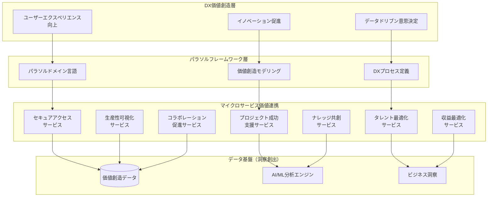
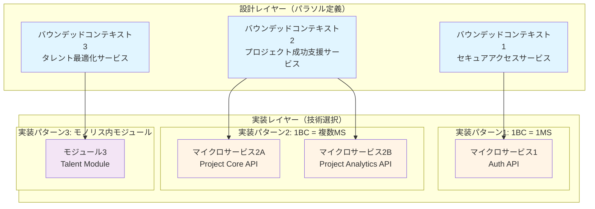
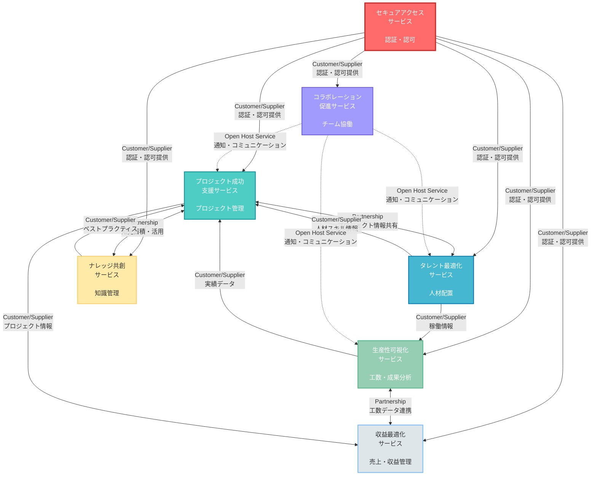
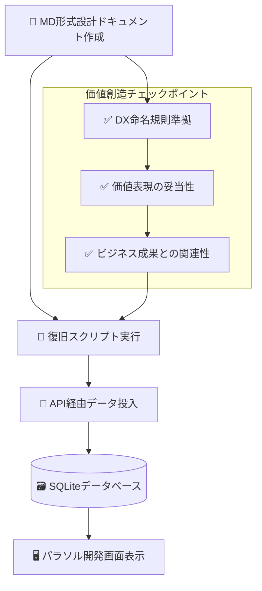

# パラソル開発ガイド - DX価値創造型フレームワーク

**バージョン**: 1.3.0
**更新日**: 2025-10-23
**ステータス**: Draft

## 目次

1. [フレームワーク概要](#1-フレームワーク概要)
2. [DX促進アーキテクチャ](#2-dx促進アーキテクチャ)
3. [マイクロサービスとバウンデッドコンテキストの違い](#3-マイクロサービスとバウンデッドコンテキストの違い)
4. [MDファイル構成（実際の構造）](#4-mdファイル構成実際の構造)
5. [DX階層構造定義](#5-dx階層構造定義)
6. [価値創造型開発プロセス](#6-価値創造型開発プロセス)
7. [DXテンプレート・仕様書](#7-dxテンプレート仕様書)
8. [DX実装ガイド](#8-dx実装ガイド)
9. [DX品質管理](#9-dx品質管理)
10. [MD形式統一による品質保証](#10-md形式統一による品質保証)

---

## 1. フレームワーク概要

### パラソルドメイン言語とは

パラソルドメイン言語は、**デジタルトランスフォーメーション（DX）を促進**するために設計された実装非依存の中間言語です。従来の「管理」思考を脱却し、**価値創造型のビジネス設計**を推進します。

#### 基本原則

```
❌ 管理思考（従来型）     ✅ 価値創造思考（DX型）
━━━━━━━━━━━━━━━━━━━━━━━━━━━━━━━━━━━━━━━━━━━━━━━━━━━
顧客管理               → 顧客エンゲージメント強化
プロジェクト管理       → プロジェクト成功支援
データ管理             → データから洞察を創出
在庫管理               → 在庫を最適化
```

#### DX促進の設計思想

1. **実装中立性**: 特定のプログラミング言語に依存しない
2. **ドメイン駆動設計（DDD）準拠**: エンティティ、値オブジェクト、集約などのDDD概念を表現
3. **ユビキタス言語**: ビジネスとテクノロジーの橋渡しとなる共通語彙
4. **生成可能**: ドメイン定義から実装コード（DB、API）を自動生成
5. **価値創造指向**: 「管理」ではなく「価値創造」にフォーカス
6. **MD形式統一**: すべての設計ドキュメントをMarkdown形式で記述し、実装非依存性を徹底

### DXを促進する価値創造メトリクス

```
従来の管理指標 → DX価値創造指標:
- データ登録件数      → ビジネス洞察創出数
- システム稼働率      → 業務改善実現数
- ユーザー数         → 価値創造に参画するアクティブユーザー数
- 処理時間          → 意思決定速度向上率
- エラー発生率       → イノベーション創出頻度
```

---

## 2. DX促進アーキテクチャ

### システム全体構成（価値創造視点）



### マイクロサービス間の価値連携

```
価値連携パターン:
1. データ洞察共有: 生産性可視化 → 収益最適化
2. ナレッジ流通: ナレッジ共創 → プロジェクト成功支援
3. セキュリティ基盤: セキュアアクセス → 全サービス
4. コラボレーション促進: 全サービス → コラボレーション促進
```

---

## 3. マイクロサービスとバウンデッドコンテキストの違い

### 3.1 概念の整理

パラソル開発では、**バウンデッドコンテキスト（設計概念）**と**マイクロサービス（実装形態）**を明確に区別することが重要です。

#### バウンデッドコンテキスト（Bounded Context）

**定義**: DDDにおける論理的な境界であり、特定のドメインモデルが一貫性を持って適用される範囲

```
特徴:
✓ 設計上の概念（論理境界）
✓ ドメインモデルの一貫性を保証
✓ ユビキタス言語の適用範囲
✓ ビジネス機能・能力の境界
✓ 実装方法に依存しない
```

**パラソルでの位置づけ**:
- `Service` レベル = バウンデッドコンテキスト
- 例: "セキュアアクセスサービス" は1つのバウンデッドコンテキスト

#### マイクロサービス（Microservice）

**定義**: 独立してデプロイ可能な実装単位であり、技術的なアーキテクチャパターン

```
特徴:
✓ 実装上の概念（物理境界）
✓ 独立したデプロイメント単位
✓ 独自のデータベースを持つ
✓ API経由で通信
✓ 技術スタック選択の自由
```

**パラソルでの位置づけ**:
- 実装フェーズで決定される物理的な配置
- 1つのバウンデッドコンテキスト = 1つ以上のマイクロサービス

### 3.2 関係性マッピング



### 3.3 パラソルにおける設計原則

#### 原則1: 設計はバウンデッドコンテキストで行う

```markdown
✅ DO: バウンデッドコンテキスト視点で設計
- ドメイン境界の明確化
- ビジネス機能の凝集性
- ユビキタス言語の定義

❌ DON'T: 最初から実装を考える
- "このAPIはどのサーバーに配置するか"
- "DBをどう分割するか"
→ これらは実装フェーズで決定
```

#### 原則2: 実装時に物理配置を決定

バウンデッドコンテキストを実装する際の選択肢:

| 実装パターン | 適用ケース | メリット | デメリット |
|------------|----------|---------|---------|
| **1BC = 1マイクロサービス** | 標準パターン | シンプル、独立性高 | 運用コスト |
| **1BC = 複数マイクロサービス** | 大規模・高負荷 | スケーラビリティ | 複雑性増加 |
| **複数BC = 1モノリス** | 小規模・初期段階 | 開発効率、低コスト | 結合度高 |

#### 原則3: パラソル定義は実装非依存

```
パラソル設計ドキュメント（MD形式）
↓
実装方法は自由に選択可能:
- Node.js + Express
- Python + FastAPI
- Java + Spring Boot
- Go + Gin
- モノリス内モジュール
```

### 3.4 実践ガイド

#### ステップ1: バウンデッドコンテキスト境界の特定

```markdown
質問リスト:
□ この機能は独自のドメインモデルを持つか？
□ 他のコンテキストと異なるユビキタス言語を使うか？
□ この機能の変更が他の機能に影響を与えないか？
□ ビジネス上、独立した価値を提供するか？

すべて YES → 独立したバウンデッドコンテキスト
```

#### ステップ2: パラソルでの定義

```bash
# バウンデッドコンテキスト = サービス
docs/parasol/services/
├── secure-access-service/        # BC1: 認証・認可
├── project-success-service/      # BC2: プロジェクト管理
└── talent-optimization-service/  # BC3: 人材最適化
```

#### ステップ3: 実装方法の選択（後工程）

```typescript
// 例: セキュアアクセスサービス（BC）の実装選択

// オプション1: 単一マイクロサービス
// apps/auth-service/
//   ├── src/
//   └── package.json

// オプション2: 複数マイクロサービス
// apps/auth-core/      # 認証ロジック
// apps/auth-gateway/   # API Gateway
// apps/auth-session/   # セッション管理

// オプション3: モノリス内モジュール
// apps/main-app/
//   └── modules/
//       └── auth/
```

### 3.5 よくある誤解と正しい理解

| 誤解 | 正しい理解 |
|------|----------|
| "マイクロサービス = バウンデッドコンテキスト" | バウンデッドコンテキストは設計概念、マイクロサービスは実装選択肢の1つ |
| "7つのサービス = 7つのマイクロサービス" | 7つのバウンデッドコンテキスト。実装は1つでも複数でも可 |
| "パラソルはマイクロサービス設計ツール" | パラソルはドメイン設計ツール。実装方法は自由 |
| "最初にアーキテクチャを決める" | 最初にドメイン境界を決め、実装は後で選択 |

### 3.6 実装移行パターン

```
フェーズ1: モノリスからスタート
[Single Application]
├── Auth Module
├── Project Module
└── Talent Module

↓ 成長・負荷増加

フェーズ2: 段階的分離
[Auth Service] ← 独立化
[Main Application]
├── Project Module
└── Talent Module

↓ さらなる成長

フェーズ3: 完全マイクロサービス化
[Auth Service]
[Project Service]
[Talent Service]
```

**重要**: パラソル設計は**フェーズ1から一貫**しています。実装が変わっても、ドメインモデルは不変です。

### 3.7 コンテキストマップ（Context Map）

#### コンテキストマップとは

**定義**: バウンデッドコンテキスト間の関係性と統合パターンを可視化したマップ

コンテキストマップは、システム全体のアーキテクチャを理解し、各コンテキスト間のコミュニケーションと依存関係を明確にするための戦略的ツールです。

#### DDDにおけるコンテキスト関係パターン

| パターン | 説明 | パラソルでの適用例 |
|---------|------|------------------|
| **Shared Kernel (共有カーネル)** | 複数のコンテキストで共有されるドメインモデル | 共通エンティティ（ユーザー、組織） |
| **Customer/Supplier (顧客/供給者)** | 下流が上流のAPIを利用（上流が優先） | 認証サービス → 他サービス |
| **Conformist (順応者)** | 下流が上流のモデルに完全に従う | 外部API統合 |
| **Anti-Corruption Layer (腐敗防止層)** | 下流が独自モデルを保ち変換層を持つ | レガシーシステム統合 |
| **Open Host Service (公開ホストサービス)** | 標準化されたAPIを提供 | 各サービスのREST API |
| **Published Language (公開言語)** | 共通のデータ交換フォーマット | JSON API、イベントスキーマ |
| **Partnership (パートナーシップ)** | 対等な関係で協調的に開発 | プロジェクト成功 ⇄ ナレッジ共創 |
| **Separate Ways (独立路線)** | 統合せず独立して運用 | 外部の独立システム |

#### パラソルコンテキストマップ



#### コンテキスト間の関係詳細

##### 1. セキュアアクセスサービス（中核基盤）

```
役割: Upstream（上流）供給者
パターン: Customer/Supplier, Open Host Service

提供内容:
- ユーザー認証API
- 権限管理API
- セッション管理
- 監査ログ

依存関係:
→ すべてのサービスが依存（必須基盤）
```

##### 2. プロジェクト成功支援サービス（中心ハブ）

```
役割: 中核的な協調ハブ
パターン: Partnership（多方向）

連携関係:
⇄ タレント最適化: プロジェクトアサイン情報の双方向連携
⇄ ナレッジ共創: プロジェクト知見の蓄積・活用
← 生産性可視化: 実績データの受信
→ 収益最適化: プロジェクト売上情報の提供
```

##### 3. 生産性可視化 ⇄ 収益最適化（データ連携）

```
役割: 分析・最適化ペア
パターン: Partnership

連携内容:
- 工数データ → 原価計算
- 稼働率データ → 収益性分析
- パフォーマンス指標 → 収益予測
```

##### 4. コラボレーション促進サービス（横断的基盤）

```
役割: 横断的なコミュニケーション基盤
パターン: Open Host Service

提供内容:
- 通知配信API
- チャット・会議機能
- ファイル共有
- アクティビティフィード

特徴: すべてのサービスから呼び出し可能
```

#### コンテキストマップから実装へ

##### 統合パターンの実装ガイド

| コンテキスト関係 | 推奨実装パターン | 実装例 |
|----------------|----------------|--------|
| **Customer/Supplier** | REST API呼び出し | GET /api/auth/verify-token |
| **Partnership** | イベント駆動 + API | Event: ProjectCreated → Kafka/RabbitMQ |
| **Open Host Service** | 標準化API Gateway | API Gateway + OpenAPI Spec |
| **Shared Kernel** | 共有ライブラリ | @parasol/shared-types (npm package) |

##### 実装例: セキュアアクセス統合

```typescript
// プロジェクト成功支援サービスでの認証統合
// パターン: Customer/Supplier

// ❌ 緊密な結合（避けるべき）
import { User } from '@secure-access/domain-model';

// ✅ Anti-Corruption Layer（推奨）
interface AuthService {
  verifyToken(token: string): Promise<AuthResult>;
  getUserPermissions(userId: string): Promise<Permission[]>;
}

class SecureAccessAdapter implements AuthService {
  async verifyToken(token: string): Promise<AuthResult> {
    // 外部APIを呼び出し、内部モデルに変換
    const response = await fetch('/api/auth/verify', {
      headers: { Authorization: `Bearer ${token}` }
    });

    const externalUser = await response.json();

    // 内部ドメインモデルに変換（腐敗防止）
    return this.toDomainModel(externalUser);
  }

  private toDomainModel(externalUser: any): AuthResult {
    // 外部モデル → 内部モデル変換
    return {
      userId: externalUser.id,
      name: externalUser.displayName,
      roles: externalUser.permissions.map(p => p.role)
    };
  }
}
```

##### 実装例: パートナーシップ統合（イベント駆動）

```typescript
// プロジェクト成功支援 ⇄ ナレッジ共創
// パターン: Partnership (双方向イベント)

// プロジェクト成功支援サービス
class ProjectService {
  async completeProject(projectId: string) {
    // ... プロジェクト完了処理

    // イベント発行
    await eventBus.publish('project.completed', {
      projectId,
      outcomes: project.outcomes,
      lessons: project.lessons,
      timestamp: new Date()
    });
  }
}

// ナレッジ共創サービス
class KnowledgeService {
  constructor() {
    // イベント購読
    eventBus.subscribe('project.completed', this.captureProjectKnowledge);
  }

  async captureProjectKnowledge(event: ProjectCompletedEvent) {
    // プロジェクト知見を知識ベースに蓄積
    await this.knowledgeRepo.create({
      source: 'project',
      projectId: event.projectId,
      insights: event.lessons,
      // ... 内部モデルに変換
    });
  }
}
```

#### コンテキストマップのメンテナンス

##### 定期的な見直しポイント

```markdown
□ 新しい統合要件が発生していないか
□ 既存の関係パターンは適切か（変更の必要性）
□ パフォーマンス問題が発生している統合はないか
□ セキュリティリスクが増加している箇所はないか
□ 循環依存が発生していないか
□ 各コンテキストの境界は明確か
```

##### コンテキストマップの進化

```
フェーズ1: 初期設計
- 基本的なCustomer/Supplier関係
- 同期的なREST API統合

↓

フェーズ2: イベント駆動導入
- Partnership関係をイベントで実装
- 非同期処理による疎結合化

↓

フェーズ3: 高度な統合
- CQRS/Event Sourcingパターン
- サガパターンによる分散トランザクション
- API Gatewayによる統一アクセス
```

#### コンテキストマップのベストプラクティス

##### DO（推奨）

```
✓ コンテキスト境界を明確に保つ
✓ 各関係に適切なパターンを適用
✓ Anti-Corruption Layerで独立性を保つ
✓ イベント駆動で疎結合を実現
✓ API仕様を明確にドキュメント化
✓ 定期的にマップを更新
```

##### DON'T（非推奨）

```
✗ 直接的なDB共有（Strong Coupling）
✗ ドメインモデルの直接共有
✗ 循環依存の許容
✗ 暗黙的な統合（ドキュメントなし）
✗ 過度な同期的統合
✗ コンテキスト境界の曖昧さ
```

### 3.8 ディレクトリ構成戦略：コンテキストとサービスの分離

#### 問題提起

バウンデッドコンテキスト（設計）とマイクロサービス（実装）の関係をディレクトリ構造でどう表現するかは、プロジェクトの長期的な成功に影響します。

**核心的な問いかけ**:
- コンテキストとサービスを同一視するか、明確に分離するか？
- ドメインモデルはどこに配置するか？
- 1BC = 複数MSの場合、どう表現するか？

#### パターン比較：5つのアプローチ

##### パターンA：完全分離型（設計・実装レイヤー分離）

```
プロジェクトルート/
├── design/                          # 設計レイヤー（実装非依存）
│   └── bounded-contexts/           # バウンデッドコンテキスト定義
│       ├── secure-access/          # コンテキスト名（実装非依存）
│       │   ├── context.md          # コンテキスト定義
│       │   ├── domain-language.md  # ドメイン言語
│       │   ├── ubiquitous-language.md
│       │   ├── context-map.md      # 他コンテキストとの関係
│       │   └── domain-model/       # 概念モデル（MD形式）
│       │       ├── entities.md
│       │       ├── value-objects.md
│       │       └── aggregates.md
│       ├── project-success/
│       └── talent-optimization/
│
├── implementation/                  # 実装レイヤー（技術依存）
│   ├── services/                   # マイクロサービス実装
│   │   ├── auth-service/           # BC: secure-access の実装
│   │   │   ├── src/
│   │   │   │   ├── domain/        # ドメインモデル実装
│   │   │   │   ├── application/   # アプリケーション層
│   │   │   │   ├── infrastructure/
│   │   │   │   └── api/
│   │   │   ├── tests/
│   │   │   └── package.json
│   │   │
│   │   ├── project-core-service/   # BC: project-success のコア実装
│   │   ├── project-analytics-service/ # BC: project-success の分析実装
│   │   └── ...
│   │
│   ├── shared/                     # Shared Kernel（複数BCで共有）
│   │   ├── domain/
│   │   │   ├── common-types.ts    # 共通型定義
│   │   │   └── user.ts            # 共有エンティティ
│   │   └── infrastructure/
│   │       └── event-bus.ts
│   │
│   └── monolith/                   # モノリス実装（初期段階）
│       └── src/
│           ├── contexts/          # コンテキスト別モジュール
│           │   ├── secure-access/
│           │   ├── project-success/
│           │   └── talent-optimization/
│           └── shared/
│
└── docs/
    ├── architecture/
    │   ├── context-mapping.md     # コンテキストマップ
    │   └── service-mapping.md     # BC→実装サービスのマッピング
    └── implementation/
        └── migration-guide.md     # モノリス→MS移行ガイド
```

**長所**:
- ✅ 設計と実装の完全分離（関心の分離）
- ✅ 1BC = 複数MSのケースを自然に表現
- ✅ ドメインモデルの共有範囲が明確
- ✅ 実装方法の変更が設計に影響しない
- ✅ 複数チームでの並行開発がしやすい

**短所**:
- ❌ ディレクトリ階層が深い
- ❌ BC→実装のマッピングが間接的
- ❌ 小規模プロジェクトには過剰

**適用場面**:
- 大規模プロジェクト（10+ BC）
- 複数チーム開発
- 1BC = 複数MSが一般的

---

##### パターンB：コンテキスト中心型（BCをルートに）

```
プロジェクトルート/
├── contexts/                       # バウンデッドコンテキストがルート
│   ├── secure-access/             # コンテキスト = トップレベル
│   │   ├── design/                # 設計ドキュメント
│   │   │   ├── context.md
│   │   │   ├── domain-language.md
│   │   │   └── api-specification.md
│   │   │
│   │   ├── domain/                # ドメインモデル（実装）
│   │   │   ├── entities/
│   │   │   │   ├── User.ts
│   │   │   │   └── Session.ts
│   │   │   ├── value-objects/
│   │   │   └── services/
│   │   │
│   │   ├── application/           # アプリケーション層
│   │   │   ├── use-cases/
│   │   │   └── services/
│   │   │
│   │   └── services/              # 実装サービス（複数可）
│   │       ├── auth-api/          # REST API実装
│   │       │   ├── src/
│   │       │   └── package.json
│   │       └── auth-worker/       # バックグラウンドワーカー
│   │           ├── src/
│   │           └── package.json
│   │
│   ├── project-success/
│   │   ├── design/
│   │   ├── domain/                # プロジェクトドメインモデル
│   │   ├── application/
│   │   └── services/
│   │       ├── project-core/      # コア機能
│   │       └── project-analytics/ # 分析機能
│   │
│   └── talent-optimization/
│
└── shared/                        # Shared Kernel
    ├── domain/
    └── infrastructure/
```

**長所**:
- ✅ コンテキスト境界が明確
- ✅ ドメインモデルがコンテキスト内に集約
- ✅ チーム分割が容易（1チーム = 1コンテキスト）
- ✅ コンテキスト内の凝集性が高い
- ✅ 設計→実装のトレーサビリティが高い

**短所**:
- ❌ services/配下に複数実装がある場合、選択が必要
- ❌ 共有コード（Shared Kernel）の管理が別領域

**適用場面**:
- 中〜大規模プロジェクト
- チーム別にコンテキスト担当
- 1BC = 1〜3実装サービス

---

##### パターンC：サービス中心型（実装ファースト）

```
プロジェクトルート/
├── services/                      # 実装サービスがルート
│   ├── auth-service/             # マイクロサービス単位
│   │   ├── design/               # このサービスの設計
│   │   │   └── bounded-context.md # 属するBCを明記
│   │   ├── src/
│   │   │   ├── domain/
│   │   │   ├── application/
│   │   │   └── infrastructure/
│   │   └── package.json
│   │
│   ├── project-core-service/
│   └── project-analytics-service/
│
└── design/                        # 全体設計
    ├── bounded-contexts/
    │   ├── secure-access.md      # BC定義
    │   ├── project-success.md
    │   └── context-map.md
    └── service-mapping.md         # サービス→BCマッピング
```

**長所**:
- ✅ デプロイ単位と一致（運用しやすい）
- ✅ 各サービスの独立性が高い
- ✅ マイクロサービスアーキテクチャに自然

**短所**:
- ❌ ドメインモデルの共有が難しい
- ❌ コンテキスト境界が不明瞭
- ❌ 1BC = 複数サービスの関係が見えにくい
- ❌ 設計思考よりも実装思考に偏る

**適用場面**:
- マイクロサービス前提
- 小規模チーム
- 1BC = 1サービスが基本

---

##### パターンD：ハイブリッド型（推奨）

```
プロジェクトルート/
├── bounded-contexts/              # 設計：バウンデッドコンテキスト定義
│   ├── secure-access/
│   │   ├── README.md             # コンテキスト概要
│   │   ├── domain-language.md    # ドメイン言語
│   │   ├── context-map.md        # 他BCとの関係
│   │   ├── api-specification.md  # 公開API仕様
│   │   ├── database-design.md    # データ設計
│   │   │
│   │   └── domain-model/         # ドメインモデル定義（MD）
│   │       ├── entities.md       # エンティティ定義
│   │       ├── value-objects.md
│   │       ├── aggregates.md
│   │       └── domain-services.md
│   │
│   ├── project-success/
│   ├── talent-optimization/
│   └── _shared/                  # 共有概念（Shared Kernel設計）
│       └── common-entities.md
│
├── src/                           # 実装：現在の実装方法
│   ├── contexts/                 # モノリス内のコンテキスト実装
│   │   ├── secure-access/       # BC実装（モジュール）
│   │   │   ├── domain/          # ドメイン層実装
│   │   │   │   ├── entities/
│   │   │   │   │   ├── User.ts
│   │   │   │   │   └── Session.ts
│   │   │   │   ├── value-objects/
│   │   │   │   ├── aggregates/
│   │   │   │   └── services/
│   │   │   │
│   │   │   ├── application/     # アプリケーション層
│   │   │   │   ├── use-cases/
│   │   │   │   ├── commands/
│   │   │   │   └── queries/
│   │   │   │
│   │   │   ├── infrastructure/  # インフラ層
│   │   │   │   ├── repositories/
│   │   │   │   └── adapters/
│   │   │   │
│   │   │   └── api/             # APIエンドポイント
│   │   │       └── routes.ts
│   │   │
│   │   ├── project-success/
│   │   │   ├── domain/
│   │   │   ├── application/
│   │   │   ├── infrastructure/
│   │   │   └── api/
│   │   │
│   │   └── _shared/             # Shared Kernel実装
│   │       ├── domain/
│   │       │   ├── User.ts     # 共通エンティティ
│   │       │   └── Organization.ts
│   │       └── infrastructure/
│   │           └── event-bus.ts
│   │
│   └── _cross-cutting/          # 横断的関心事
│       ├── auth/                # 認証ミドルウェア
│       ├── logging/
│       └── monitoring/
│
├── services/                     # 将来：マイクロサービス実装
│   ├── auth-service/            # secure-accessの独立実装
│   │   ├── .context-mapping.json # BCとの紐付け
│   │   ├── src/
│   │   │   └── （src/contexts/secure-accessから移行）
│   │   └── package.json
│   │
│   └── _migration-guide.md      # モノリス→MS移行ガイド
│
├── docs/
│   ├── architecture/
│   │   ├── CONTEXT_MAP.md       # 全体コンテキストマップ
│   │   ├── IMPLEMENTATION_STRATEGY.md
│   │   └── bc-to-service-mapping.md # BC→実装マッピング
│   │
│   └── bounded-contexts/         # → bounded-contexts/ へのシンボリックリンク
│
└── .context-rules.json           # BC→実装のルール定義
```

**`.context-rules.json`の例**:
```json
{
  "version": "1.0",
  "strategy": "monolith-first",
  "mappings": [
    {
      "boundedContext": "secure-access",
      "implementations": [
        {
          "type": "module",
          "path": "src/contexts/secure-access",
          "status": "active"
        },
        {
          "type": "microservice",
          "path": "services/auth-service",
          "status": "planned"
        }
      ]
    },
    {
      "boundedContext": "project-success",
      "implementations": [
        {
          "type": "module",
          "path": "src/contexts/project-success",
          "status": "active"
        }
      ]
    }
  ],
  "sharedKernel": {
    "design": "bounded-contexts/_shared",
    "implementation": "src/contexts/_shared"
  }
}
```

**長所**:
- ✅ 設計と実装の対応が明確
- ✅ モノリス→マイクロサービスの移行パスが自然
- ✅ ドメインモデルがコンテキスト別に整理
- ✅ 設計ドキュメントと実装の距離が近い
- ✅ 段階的な移行が可能
- ✅ ツールで検証可能（.context-rules.json）

**短所**:
- ❌ bounded-contexts/とsrc/contexts/の二重管理
- ❌ ルール定義ファイルのメンテナンスが必要

**適用場面**:
- パラソルに最適
- モノリスからスタート、段階的にMS化
- 設計重視だが実装も重要視

---

##### パターンE：フラット型（シンプル）

```
プロジェクトルート/
├── secure-access/                # BC = ディレクトリ名
│   ├── design.md                 # 設計ドキュメント（1ファイル）
│   └── src/                      # 実装
│       ├── domain/
│       ├── application/
│       └── infrastructure/
│
├── project-success/
│   ├── design.md
│   └── src/
│
└── shared/
    └── src/
```

**長所**:
- ✅ 非常にシンプル
- ✅ 小規模に最適

**短所**:
- ❌ 大規模には不向き
- ❌ 設計ドキュメントが貧弱
- ❌ 複数実装の表現ができない

**適用場面**:
- 小規模プロジェクト（< 5 BC）
- プロトタイピング

---

#### パターン比較表

| 観点 | パターンA<br/>完全分離型 | パターンB<br/>コンテキスト中心 | パターンC<br/>サービス中心 | パターンD<br/>ハイブリッド | パターンE<br/>フラット |
|------|----------|------------|------------|-----------|---------|
| **設計と実装の分離** | ⭐⭐⭐⭐⭐ | ⭐⭐⭐ | ⭐⭐ | ⭐⭐⭐⭐ | ⭐ |
| **トレーサビリティ** | ⭐⭐⭐ | ⭐⭐⭐⭐ | ⭐⭐ | ⭐⭐⭐⭐⭐ | ⭐⭐⭐ |
| **1BC=複数MS対応** | ⭐⭐⭐⭐⭐ | ⭐⭐⭐⭐ | ⭐⭐⭐ | ⭐⭐⭐⭐ | ⭐ |
| **モノリス対応** | ⭐⭐⭐ | ⭐⭐⭐⭐ | ⭐⭐ | ⭐⭐⭐⭐⭐ | ⭐⭐⭐⭐ |
| **移行容易性** | ⭐⭐⭐⭐ | ⭐⭐⭐ | ⭐⭐⭐⭐ | ⭐⭐⭐⭐⭐ | ⭐⭐ |
| **学習コスト** | ⭐⭐ | ⭐⭐⭐ | ⭐⭐⭐⭐ | ⭐⭐⭐ | ⭐⭐⭐⭐⭐ |
| **小規模適性** | ⭐⭐ | ⭐⭐⭐ | ⭐⭐⭐⭐ | ⭐⭐⭐ | ⭐⭐⭐⭐⭐ |
| **大規模適性** | ⭐⭐⭐⭐⭐ | ⭐⭐⭐⭐ | ⭐⭐⭐ | ⭐⭐⭐⭐⭐ | ⭐⭐ |
| **運用理解性** | ⭐⭐⭐ | ⭐⭐⭐⭐ | ⭐⭐⭐⭐⭐ | ⭐⭐⭐⭐ | ⭐⭐⭐⭐ |

---

#### パラソルへの推奨：パターンD（ハイブリッド型）

**理由**:

1. **現状との整合性**
   - 既存の `docs/parasol/services/` → `bounded-contexts/` へリネーム
   - 実装は `src/contexts/` で管理（モノリス）
   - 将来の `services/` ディレクトリを予約

2. **段階的移行の実現**
   - Phase 1: モノリス（src/contexts/）
   - Phase 2: 一部MS化（services/auth-service）
   - Phase 3: 完全MS化（services/配下に全て）

3. **ドメインモデルの明確化**
   - 設計: `bounded-contexts/*/domain-model/`（MD形式）
   - 実装: `src/contexts/*/domain/`（TypeScript）
   - 対応関係が明確

4. **チーム開発の支援**
   - 1チーム = 1バウンデッドコンテキスト担当
   - 設計と実装の両方を管理

---

#### 具体的な移行手順（パラソル向け）

##### ステップ1: ディレクトリリネーム

```bash
# 現在
docs/parasol/services/

# 変更後
bounded-contexts/
```

##### ステップ2: 実装構造の整理

```bash
# 新規作成
src/contexts/
├── secure-access/
│   ├── domain/
│   ├── application/
│   ├── infrastructure/
│   └── api/
├── project-success/
└── _shared/
```

##### ステップ3: マッピングファイル作成

```bash
# 新規作成
.context-rules.json
docs/architecture/CONTEXT_MAP.md
docs/architecture/bc-to-service-mapping.md
```

##### ステップ4: 検証スクリプト

```typescript
// scripts/validate-context-mapping.ts
// BC定義と実装の整合性チェック
```

---

#### 運用ルール

##### Rule 1: ドメインモデルの配置

```
設計定義: bounded-contexts/{context-name}/domain-model/*.md
実装コード: src/contexts/{context-name}/domain/**/*.ts

例:
bounded-contexts/secure-access/domain-model/entities.md
  ↓ 実装
src/contexts/secure-access/domain/entities/User.ts
```

##### Rule 2: API仕様の配置

```
設計仕様: bounded-contexts/{context-name}/api-specification.md
実装: src/contexts/{context-name}/api/routes.ts

APIスキーマ: src/contexts/{context-name}/api/schema/
OpenAPI生成: src/contexts/{context-name}/api/openapi.yaml（自動生成）
```

##### Rule 3: Shared Kernelの管理

```
設計: bounded-contexts/_shared/
実装: src/contexts/_shared/

共有ドメインモデル例:
- User（全BCで共通のユーザー概念）
- Organization（組織概念）
- Currency（通貨値オブジェクト）

注意: 安易な共有は避け、必要最小限に
```

##### Rule 4: コンテキスト間通信

```typescript
// ❌ 直接import（避ける）
import { Project } from '../project-success/domain/entities/Project';

// ✅ Anti-Corruption Layer経由
import { ProjectService } from './infrastructure/adapters/ProjectServiceAdapter';
```

##### Rule 5: マイクロサービス化の判断基準

以下の条件を満たす場合、BC→MSへ分離:
- スケーリング要件が異なる
- デプロイ頻度が大きく異なる
- 技術スタックを変えたい
- チームが完全に分離されている

---

#### ツールサポート

##### 1. VS Code設定

```json
// .vscode/settings.json
{
  "files.associations": {
    "bounded-contexts/**/*.md": "parasol-design",
    "src/contexts/**/domain/**/*.ts": "parasol-domain-model"
  },
  "search.exclude": {
    "**/node_modules": true,
    "**/services": true  // 将来のMS用ディレクトリを検索から除外
  }
}
```

##### 2. 整合性チェックスクリプト

```bash
# 実装されていないBCを検出
npm run parasol:check-missing-implementations

# BC定義とドメインモデル実装の齟齬を検出
npm run parasol:validate-domain-models

# コンテキスト間の不正な依存を検出
npm run parasol:check-dependencies
```

---

#### まとめ：推奨ディレクトリ構成

```
consultingTool/
├── bounded-contexts/          # ⭐ 設計の真実（Source of Truth）
│   ├── secure-access/
│   ├── project-success/
│   ├── talent-optimization/
│   ├── productivity-visualization/
│   ├── knowledge-co-creation/
│   ├── revenue-optimization/
│   ├── collaboration-facilitation/
│   └── _shared/
│
├── src/contexts/              # ⭐ 現在の実装（モノリス）
│   ├── secure-access/
│   ├── project-success/
│   └── _shared/
│
├── services/                  # ⭐ 将来の実装（マイクロサービス）
│   └── _migration-guide.md
│
├── docs/
│   └── architecture/
│       ├── CONTEXT_MAP.md
│       └── bc-to-service-mapping.md
│
└── .context-rules.json        # ⭐ BC→実装のマッピングルール
```

**この構成の価値**:
- 設計思考を優先しつつ、実装の現実も尊重
- モノリス→マイクロサービスの自然な移行パス
- ツールによる検証が可能
- チーム拡大・縮小に柔軟に対応

---

## 4. MDファイル構成（実際の構造）

### 発見された実際のファイル構造

```
docs/parasol/services/
├── [service-name]/                           # 7サービス存在
│   ├── service.md                           # サービス定義 ✅
│   ├── domain-language.md                   # ドメイン言語定義 ✅
│   ├── api-specification.md                 # API仕様 ✅
│   ├── database-design.md                   # DB設計 ✅
│   ├── integration-specification.md         # 統合仕様 ✅
│   ├── capabilities-and-operations.md       # ケーパビリティ・オペレーション一覧 ✅
│   └── capabilities/
│       └── [capability-name]/               # ケーパビリティディレクトリ
│           ├── capability.md                # ケーパビリティ定義 ✅
│           └── operations/
│               └── [operation-name]/        # オペレーションディレクトリ
│                   ├── operation.md         # オペレーション定義 ✅
│                   ├── usecases/           # ユースケース（復旧スクリプト対象）
│                   │   └── [usecase].md    # 例: approve-and-create-account.md
│                   ├── pages/              # ページ定義（復旧スクリプト対象）
│                   │   └── [page].md       # 例: approve-and-create-account-page.md
│                   ├── tests/              # テスト定義（復旧スクリプト対象）
│                   │   └── [test].md       # 例: approve-and-create-account-test.md
│                   └── robustness/         # ロバストネス図（新発見）
│                       └── [robustness].md # 例: login-and-authenticate-robustness.md
```

### DX型サービス構成（7サービス確認済み）

```
✅ 全サービスがDX促進型命名に準拠していることを確認

1. secure-access-service           (セキュアアクセスサービス)
2. project-success-service         (プロジェクト成功支援サービス)
3. talent-optimization-service     (タレント最適化サービス)
4. productivity-visualization-service (生産性可視化サービス)
5. knowledge-co-creation-service   (ナレッジ共創サービス)
6. revenue-optimization-service    (収益最適化サービス)
7. collaboration-facilitation-service (コラボレーション促進サービス)
```

### 各ファイルの役割と価値創造への貢献

| ファイル | 役割 | DX価値創造への貢献 |
|---------|------|------------------|
| `service.md` | サービス定義 | 価値提供の明確化 |
| `domain-language.md` | ドメイン言語定義 | ビジネス価値モデリング |
| `api-specification.md` | API仕様 | 価値連携インターフェース |
| `database-design.md` | DB設計 | 洞察創出データ構造 |
| `integration-specification.md` | 統合仕様 | サービス間価値連携 |
| `operation.md` | オペレーション定義 | 価値創造プロセス |
| `usecases/*.md` | ユースケース | 価値実現シナリオ |
| `pages/*.md` | ページ定義 | 価値体験設計 |
| `tests/*.md` | テスト定義 | 価値品質保証 |
| `robustness/*.md` | ロバストネス図 | 価値実現アーキテクチャ |

---

## 5. DX階層構造定義

### DX価値創造型階層定義

```
Service (価値提供サービス)
├── displayName: DX価値表現サービス名（XXX支援/最適化/可視化/促進/共創）
├── DomainLanguage: ビジネス価値ドメイン定義
├── ApiSpecification: 価値創造API仕様
├── DatabaseDesign: 洞察創出DB設計
├── IntegrationSpecification: 価値連携仕様
└── BusinessCapability[] (価値創造ケーパビリティ)
    ├── displayName: 「XXXする能力」形式（価値創造動詞使用）
    └── BusinessOperation[] (価値創造オペレーション)
        ├── displayName: 価値創造アクション指向名
        ├── pattern: Workflow/CRUD/Analytics/Communication/Administration
        └── UseCase[] (価値実現ユースケース)
            ├── PageDefinition[]: 価値体験ページ定義
            ├── TestDefinition[]: 価値検証テスト定義
            └── RobustnessDiagram?: 価値実現ロバストネス図
```

### 各階層の責務と価値創造への関係

#### 1. サービス層（価値提供）
- **責務**: 顧客への具体的価値提供
- **DX効果**: ビジネス成果の最大化
- **命名原則**: 価値創造動詞 + 対象 + サービス

#### 2. ケーパビリティ層（組織能力）
- **責務**: 競争優位性を生む組織能力
- **DX効果**: 継続的な価値創造能力の構築
- **命名原則**: 「[価値創造動詞] + [対象] + する能力」

#### 3. オペレーション層（価値創造活動）
- **責務**: 具体的な価値創造プロセス
- **DX効果**: 業務効率化とイノベーション促進
- **命名原則**: [変革動詞] + [対象] + [成果・価値]

#### 4. ユースケース層（価値実現）
- **責務**: システムを通じた価値実現
- **DX効果**: ユーザーエクスペリエンスの向上
- **命名原則**: 「〜を（が）〜する」（価値創造視点）

---

## 6. 価値創造型開発プロセス

### MDファイル作成 → DB登録 → UI表示の流れ



### 復旧スクリプトの動作原理

#### 1. データ収集フェーズ
```javascript
// scripts/restore-usecase-definitions.js
const collectServiceData = async (serviceName) => {
  // 1. サービス基本情報読み込み
  const serviceContent = await readUsecaseFile(`${servicePath}/service.md`);

  // 2. ケーパビリティ・オペレーション階層探索
  const capabilities = await fs.readdir(`${servicePath}/capabilities`);

  // 3. 日本語表示名の抽出（DX命名規則チェック）
  const titleMatch = content.match(/^#\s*ユースケース[：:]\s*(.+)$/m);
  const displayName = titleMatch ? titleMatch[1].trim() : defaultName;

  return serviceData; // DX価値創造構造に変換
};
```

#### 2. 一括送信フェーズ
```javascript
// 全7サービスを一括でAPI送信（データベース上書き問題を解決）
const allServices = [];
for (const serviceName of services) {
  const serviceData = await collectServiceData(serviceName);
  allServices.push(serviceData);
}
const success = await uploadParasolData(allServices);
```

### API仕様（価値創造指向）

#### POST /api/parasol/import
- **目的**: パラソル設計データの一括インポート
- **価値**: 設計効率化とトレーサビリティ確保
- **特徴**: 日本語表示名の保持、DX命名規則の検証

---

## 7. DXテンプレート・仕様書

### 価値創造型テンプレートの使い方

#### 1. DXサービス定義テンプレート
**ファイル**: `templates/dx-service-definition.md`

```markdown
# [サービス名] - DX価値創造サービス

## DX価値提案
**解決する課題**: [従来の管理的課題]
**提供価値**: [DXによる変革効果]
**成果指標**: [測定可能なDX効果]

## 価値創造戦略
- **効率化**: [○○%の時間短縮、○○%のコスト削減]
- **イノベーション**: [新規ビジネス機会、創造的な解決策]
- **体験向上**: [ユーザー満足度向上、使いやすさ改善]

## DX成果測定
- **定量効果**: [ROI、効率化指標]
- **定性効果**: [満足度、イノベーション創出]
```

#### 2. 価値創造ケーパビリティテンプレート
**ファイル**: `templates/dx-business-capability.md`

```markdown
# [ケーパビリティ名] - 価値創造能力

## 組織競争力への貢献
**差別化要因**: [競合との差別化ポイント]
**持続的優位性**: [長期的な競争優位の源泉]
**イノベーション創出**: [新たな価値創造の可能性]

## 成熟度レベル
- **レベル1（基本）**: 従来型管理業務
- **レベル2（効率化）**: プロセス自動化・最適化
- **レベル3（変革）**: データドリブン意思決定
- **レベル4（創造）**: AI活用・予測分析
- **レベル5（革新）**: 新ビジネスモデル創出
```

### DX評価基準・バリデーション要件

#### DX促進度チェックリスト

```
□ 価値創造命名: 「管理」用語を使用していない
□ 成果指向: 明確なビジネス成果が定義されている
□ データ活用: データドリブンな意思決定を促進する
□ 自動化: 手作業を削減し効率化を実現する
□ 連携強化: サービス間の価値連携が設計されている
□ 学習促進: 継続的な改善・学習メカニズムがある
□ イノベーション: 新たな価値創造の可能性がある
```

#### DX品質ゲート

| ゲート | 評価項目 | 合格基準 |
|--------|---------|----------|
| **設計ゲート** | DX命名規則準拠 | 100% |
| **設計ゲート** | 価値創造の明確性 | 定性評価A以上 |
| **実装ゲート** | 効率化指標達成 | 目標の80%以上 |
| **運用ゲート** | ユーザー満足度 | 4.0/5.0以上 |

---

## 8. DX実装ガイド

### 新規DXサービス追加手順

#### ステップ1: DXサービス設計
```bash
# 1. サービスディレクトリ作成
mkdir -p docs/parasol/services/[new-dx-service]

# 2. DXテンプレート適用
cp templates/dx-service-definition.md docs/parasol/services/[new-dx-service]/service.md

# 3. DX命名規則チェック
# ✅ 「XXX支援」「XXX最適化」「XXX可視化」「XXX促進」「XXX共創」パターン
# ❌ 「XXX管理」「XXXシステム」は使用禁止
```

#### ステップ2: ケーパビリティ定義
```bash
# 1. ケーパビリティディレクトリ作成
mkdir -p docs/parasol/services/[service]/capabilities/[capability]

# 2. 価値創造型ケーパビリティ定義
# 形式: 「[価値創造動詞] + [対象] + する能力」
# 例: 「顧客エンゲージメントを強化する能力」
```

#### ステップ3: オペレーション・ユースケース設計
```bash
# 1. 価値創造プロセス定義
mkdir -p docs/parasol/services/[service]/capabilities/[capability]/operations/[operation]

# 2. ユースケース・ページ・テスト定義
mkdir -p docs/parasol/services/[service]/capabilities/[capability]/operations/[operation]/{usecases,pages,tests}
```

#### ステップ4: データベース登録
```bash
# 復旧スクリプト実行
npm run db:reset
node scripts/restore-usecase-definitions.js
```

### 既存サービスのDX化手順

#### 1. DX診断（現状分析）
```bash
# DX成熟度診断スクリプト実行
node scripts/dx-maturity-assessment.js [service-name]
```

#### 2. DX変革計画策定
```markdown
## DX変革ロードマップ

### フェーズ1: 効率化（3ヶ月）
- [ ] 手作業プロセスの自動化
- [ ] データ可視化ダッシュボード構築
- [ ] 基本的な予測分析導入

### フェーズ2: 最適化（6ヶ月）
- [ ] AI/ML分析エンジン導入
- [ ] リアルタイム意思決定支援
- [ ] プロセス最適化エンジン

### フェーズ3: 革新（12ヶ月）
- [ ] 新ビジネスモデル実証
- [ ] エコシステム連携強化
- [ ] 継続的イノベーション基盤
```

### 価値創造評価とトラブルシューティング

#### よくある問題と解決策

| 問題 | 原因 | DX解決策 |
|------|------|----------|
| 効率化が進まない | 手作業依存 | プロセス自動化、RPA導入 |
| データ活用できない | サイロ化 | データ統合基盤、BI構築 |
| 意思決定が遅い | 情報収集時間 | リアルタイム分析、予測AI |
| イノベーションが起きない | 固定思考 | 実験文化、アジャイル手法 |

---

## 9. DX品質管理

### 価値創造テスト戦略

#### 1. DX効果測定テスト
```markdown
## DX効果検証テストケース

### 効率化効果テスト
- **測定項目**: タスク実行時間
- **目標**: 30%以上の短縮
- **測定方法**: 自動化前後の比較

### 意思決定速度テスト
- **測定項目**: 意思決定までの時間
- **目標**: 50%以上の短縮
- **測定方法**: データ可視化前後の比較

### ユーザー体験テスト
- **測定項目**: ユーザー満足度
- **目標**: 4.0/5.0以上
- **測定方法**: NPS、CSAT調査
```

#### 2. 価値創造ユニットテスト
```javascript
// 例: 価値創造ロジックのテスト
describe('DX価値創造エンジン', () => {
  test('効率化効果を正確に計算する', () => {
    const before = { taskTime: 120, errorRate: 0.15 };
    const after = { taskTime: 80, errorRate: 0.05 };

    const dxEffect = calculateDxEffect(before, after);

    expect(dxEffect.efficiencyImprovement).toBeGreaterThan(0.3); // 30%以上改善
    expect(dxEffect.qualityImprovement).toBeGreaterThan(0.6);    // 60%以上改善
  });
});
```

### DXコードレビュー基準

#### チェック項目
```
□ DX命名規則準拠（価値創造動詞使用）
□ ビジネス価値の明確性
□ 効率化・自動化要素の組み込み
□ データドリブン意思決定の促進
□ ユーザーエクスペリエンス向上
□ 継続的改善メカニズム
□ 測定可能なKPI設定
```

### ビジネス価値パフォーマンス要件

#### DX成果基準
```
レベル1: 基本DX（必須）
- 手作業削減率: 20%以上
- データ可視化: 主要指標の可視化
- 応答時間改善: 30%以上

レベル2: 高度DX（推奨）
- 自動化率: 50%以上
- 予測分析: 基本的な予測機能
- 意思決定速度: 50%以上向上

レベル3: 革新DX（目標）
- AI活用度: 主要プロセスでのAI活用
- イノベーション創出: 新ビジネス機会創出
- エコシステム連携: 外部システムとの価値連携
```

---

## 付録

### A. DX用語集

| 用語 | 定義 | DX文脈での意味 |
|------|------|---------------|
| **価値創造** | 顧客・ビジネスに新たな価値を生み出すこと | DXの最終目的 |
| **デジタル変革** | デジタル技術による業務・ビジネスモデル変革 | DXの手段 |
| **洞察創出** | データから意味のある知見を発見すること | データドリブン経営の核 |
| **自動化** | 人手作業をシステムで代替すること | 効率化の基盤 |
| **最適化** | 既存プロセスの効率・品質向上 | 継続的改善 |

### B. DXテンプレートファイル一覧

```
templates/
├── dx-service-definition.md           # DXサービス定義
├── dx-business-capability.md         # 価値創造ケーパビリティ
├── dx-business-operation.md          # 変革オペレーション
├── dx-usecase-definition.md          # 価値実現ユースケース
├── dx-page-definition.md             # 価値体験ページ設計
├── dx-test-definition.md             # DX効果検証テスト
├── dx-api-specification.md           # 価値連携API仕様
└── dx-database-design.md             # 洞察創出DB設計
```

### C. 参考リンク

- [マイクロサービス設計原則](./microservices-design-principles.md)
- [パラソル階層構造詳細](./parasol-hierarchy-details.md)
- [DX成熟度評価モデル](./dx-maturity-model.md)
- [価値創造メトリクス設計](./value-creation-metrics.md)

## 10. MD形式統一による品質保証

### 10.1 パラソル設計の核心原則

#### MD形式の絶対性

パラソル開発では、**すべての設計ドキュメントをMarkdown形式で記述**することが基本原則です。これは単なる表記法の選択ではなく、**実装非依存性を保証する**ための戦略的決定です。

```markdown
✅ パラソル準拠（MD形式）
# API仕様: ユーザー認証サービス
システムがユーザーの身元を確認し、安全なアクセスを提供する

❌ 実装依存（JSON/Code形式）
{
  "endpoint": "/api/auth",
  "method": "POST",
  "schema": {...}
}
```

### 10.2 データ消失問題の根本解決

#### 問題の本質

API仕様・DB設計が「消える」現象の根本原因は、**JSON形式とMD形式の混在**です：

```typescript
// ❌ データ消失の原因パターン
apiSpecificationDefinition: service.apiSpecificationDoc?.content || '',
//                                   ↑ 存在しないリレーション

// ✅ 正しいMD形式参照
apiSpecificationDefinition: service.apiSpecificationDefinition || '',
//                                   ↑ 直接フィールド参照
```

#### データベース構造の純化

```sql
-- ❌ 廃止対象（実装依存のJSON形式）
domainLanguage TEXT NOT NULL,       -- JSON: パラソル思想に反する
apiSpecification TEXT NOT NULL,     -- JSON: 実装詳細を含む
dbSchema TEXT NOT NULL,            -- JSON: 技術仕様に依存

-- ✅ 推奨（実装非依存のMD形式）
domainLanguageDefinition TEXT,      -- MD: 自然言語設計
apiSpecificationDefinition TEXT,    -- MD: ビジネス観点の仕様
databaseDesignDefinition TEXT,      -- MD: 概念レベルの設計
```

### 10.3 開発ベストプラクティス

#### 1. 新規開発時の鉄則

```markdown
✅ DO: MD形式のみを使用
- 自然言語でビジネス価値を記述
- 実装技術の詳細は記載しない
- ステークホルダー全員が理解可能な表現

❌ DON'T: JSON/Code形式の混入
- 技術的な実装詳細の記述
- プログラミング言語依存の表現
- データベース固有の構文使用
```

#### 2. 品質チェック項目

```bash
# MD形式データの存在確認
sqlite3 parasol.db "SELECT name,
  CASE WHEN apiSpecificationDefinition IS NULL OR apiSpecificationDefinition = ''
       THEN 'NG' ELSE 'OK' END as status
  FROM services;"

# 実装非依存性チェック
grep -i "CREATE TABLE\|SELECT\|POST\|GET" *.md && echo "❌ 実装詳細検出"
```

### 10.4 移行戦略とロードマップ

#### フェーズ1: 現状把握と修正（完了）
- [x] データ表示問題の修正
- [x] MD形式フィールドへの正しい参照
- [x] UI表示の正常化確認

#### フェーズ2: コード品質向上
- [ ] JSON.parse()処理の段階的削除
- [ ] TypeScript型定義の統一
- [ ] エラーハンドリングの強化

#### フェーズ3: データ構造の純化
- [ ] JSON形式フィールドの廃止
- [ ] スキーマの簡素化
- [ ] マイグレーション実行

#### フェーズ4: 品質保証体制
- [ ] 自動検証ツールの導入
- [ ] CI/CDでのMD形式チェック
- [ ] 開発者教育の実施

### 10.5 期待効果

#### 技術的価値
- **データ消失問題の根絶**: 表示不具合の完全解消
- **保守性向上**: 統一された理解しやすいコード
- **品質向上**: 一貫したデータ処理ロジック

#### ビジネス価値
- **パラソル思想の実現**: 真の実装非依存設計
- **コミュニケーション改善**: 全員が理解可能な設計書
- **DX促進**: 技術的負債の解消による開発加速

---

**⚠️ 重要**: MD形式統一は、パラソル開発の成功を左右する**最重要原則**です。この原則を守ることで、真の価値創造型開発が実現されます。

---

**📧 フィードバック**: パラソル開発に関するご質問・改善提案は [GitHub Issues](https://github.com/hmoriya/consultingTool/issues) までお寄せください。

**🚀 DXの旅**: このガイドを活用して、価値創造型のデジタルトランスフォーメーションを実現してください！