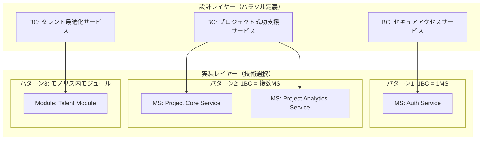

# パラソル開発ガイド要約

**バージョン**: 3.4.0（要約版）
**元ドキュメント**: PARASOL_DEVELOPMENT_GUIDE.md
**作成日**: 2025-10-23

## 目次

1. [パラソルとは](#1-パラソルとは)
2. [3つの本質](#2-3つの本質)
3. [核心的な概念体系](#3-核心的な概念体系)
4. [階層構造の全体像](#4-階層構造の全体像)
5. [開発プロセス](#5-開発プロセス)
6. [ディレクトリ構成戦略](#6-ディレクトリ構成戦略)
7. [実装パターン](#7-実装パターン)
8. [重要な原則](#8-重要な原則)

---

## 1. パラソルとは

パラソルドメイン言語は、**MD形式でAIに解析しやすい、実装テクノロジー非依存の設計ファイル**です。

### 目的
- **デジタルトランスフォーメーション（DX）を促進**
- 従来の「管理」思考から「価値創造型」のビジネス設計へ転換
- AIとの協働開発を実現

### 基本思想
```
❌ 管理思考（従来型）     ✅ 価値創造思考（DX型）
━━━━━━━━━━━━━━━━━━━━━━━━━━━━━━━━━━━━━━━━━━━━━━━━━━━
顧客管理               → 顧客エンゲージメント強化
プロジェクト管理       → プロジェクト成功支援
データ管理             → データから洞察を創出
在庫管理               → 在庫を最適化
```

---

## 2. 3つの本質

### 2.1 MD形式（Markdown）
- 人間が読みやすく、AIが解析・生成しやすい
- GitHub、GitLabとのバージョン管理が完全統合
- コードレビュー、差分管理が容易

### 2.2 AI解析可能性
- Claude、ChatGPT等のLLMが設計を理解・提案できる
- 設計からコード生成、コードから設計抽出が可能
- AI時代の開発生産性向上の鍵

### 2.3 実装テクノロジー非依存
- TypeScript、Go、Java等、どの言語でも実装可能
- ドメイン設計と実装技術の分離
- 長期的な保守性・柔軟性を確保

---

## 3. 核心的な概念体系

パラソルでは**3つの異なる概念レベル**を明確に区別します：

### 3.1 概念の定義

| 概念 | 英語 | 焦点 | 誰が定義 | 成果物 |
|------|------|------|---------|--------|
| **問題領域** | Problem Space | 何を解決するか（What） | ビジネス部門 | サブドメインマップ |
| **解決領域** | Solution Space | どうモデル化するか（How to Model） | アーキテクト | ドメインモデル、コンテキストマップ |
| **ソリューション構成** | Implementation | どう実装するか（How to Implement） | エンジニア | ソースコード、API仕様 |

### 3.2 具体例：プロジェクト成功支援

```
1. 問題領域（Subdomain）
   └─ Core Subdomain: "プロジェクト計画"
   └─ ビジネス上の問題: プロジェクトの成功率を上げたい

   ↓

2. 解決領域（Bounded Context）
   └─ BC: "Project Success Service"
   └─ ドメインモデル設計:
       ├─ Aggregate Root: Project, Milestone
       ├─ Entity: Task, Deliverable
       └─ Value Object: ProjectStatus, Priority

   ↓

3. ソリューション構成（Microservice）
   └─ MS: "Project Service"
   └─ 実装技術:
       ├─ Framework: NestJS (TypeScript)
       ├─ Database: PostgreSQL
       └─ API: REST API (/api/projects)
```

### 3.3 重要な違い

**❌ よくある誤解**:
- "解決領域"と"ソリューション構成"は同じもの
- Bounded ContextとMicroserviceは1対1の関係
- マイクロサービス = バウンデッドコンテキスト

**✅ 正しい理解**:
- **解決領域（BC）は設計書**、**ソリューション構成（MS）はコード**
- 1つのBCは複数のMSに実装される可能性がある
- BCは設計概念、MSは実装選択肢の1つ

---

## 4. 階層構造の全体像

### 4.1 完全な階層構造

```
バリューストリーム（Value Stream）- 価値の流れ全体
  └─ バリューステージ（Value Stage）- 価値創造の各段階
      └─ ケーパビリティ階層（Capability L1/L2/L3）
          ├─ 問題領域（Problem Space）→ Subdomain
          ├─ 解決領域（Solution Space）→ Bounded Context
          └─ ソリューション構成（Implementation）→ Microservice
```

### 4.2 階層マッピング

| パラソル階層 | ビジネス階層 | DDD階層 | 実装階層 | 多重度 |
|------------|------------|---------|---------|--------|
| **Value Stream** | バリューストリーム | - | - | - |
| **Value Stage** | バリューステージ | - | - | 1 VS = N Stages |
| **Capability L1** | ケーパビリティL1 | **Subdomain** | - | 1 Stage = N L1 |
| **Bounded Context** | - | **Bounded Context** | **Microservice** | 1 SD = 1..* BC |
| **Capability L2** | ケーパビリティL2 | Aggregate | Service Module | 1 BC = 1..* L2 |
| **Capability L3** | ケーパビリティL3 | Entity/VO | UseCase/Controller | 1 L2 = 1..* L3 |
| **Use Case / Page** | プロセス/アクティビティ | Application Service | API + UI | 1 L3 = 1..* UC |

### 4.3 BCとケーパビリティ階層のマッピング

**最重要**: **Bounded Context = ケーパビリティL1レベル**

BCはケーパビリティL1と同じレベルであり、BC内部にケーパビリティL2/L3が含まれます。

#### 対応関係

```
Bounded Context（サービス） = ケーパビリティL1
  └─ Capability L2（BC内の戦術的能力） = Aggregate（DDD）
      └─ Capability L3（BC内の具体的業務能力） = Operation
          └─ Business Operation（ビジネスオペレーション）= B5
              └─ Use Case（ユースケース）= B6
```

#### 多重度

- **1 BC = 1..* ケーパビリティL2**
- **1 ケーパビリティL2 = 1..* ケーパビリティL3（Operations）**
- **1 ケーパビリティL3 = 1..* ビジネスオペレーション**
- **1 ビジネスオペレーション = 1..* ユースケース**

#### 具体例

```
BC: "セキュアアクセスサービス" = ケーパビリティL1 "認証・認可する能力"
  │
  ├─ ケーパビリティL2: "ユーザーを認証する能力"（= Aggregate）
  │   │
  │   ├─ ケーパビリティL3/Operation: "ログインする" (B4)
  │   │   │
  │   │   ├─ ビジネスオペレーション: "パスワード認証プロセス" (B5)
  │   │   │   ├─ ユースケース: "パスワードでログインする" (B6)
  │   │   │   └─ ユースケース: "2要素認証を実行する" (B6)
  │   │   │
  │   │   └─ ビジネスオペレーション: "SSO認証プロセス" (B5)
  │   │       └─ ユースケース: "SSOでログインする" (B6)
  │   │
  │   └─ ケーパビリティL3/Operation: "ログアウトする" (B4)
  │       └─ ビジネスオペレーション: "セッション終了プロセス" (B5)
  │           └─ ユースケース: "セッションを終了する" (B6)
  │
  └─ ケーパビリティL2: "セッションを管理する能力"（= Aggregate）
      └─ ケーパビリティL3/Operation: "セッション状態を追跡する" (B4)
```

#### ディレクトリ構造での表現

```
bounded-contexts/
  └── secure-access/              # BC = ケーパビリティL1
      └── capabilities/
          ├── authenticate/       # ケーパビリティL2
          │   └── operations/
          │       ├── login/      # ケーパビリティL3 = Operation (B4)
          │       │   └── usecases/
          │       │       ├── password-login/   # ビジネスオペレーション (B5)
          │       │       │   ├── usecase.md    # ユースケース (B6)
          │       │       │   └── page.md
          │       │       └── sso-login/        # 別のビジネスオペレーション (B5)
          │       │           ├── usecase.md
          │       │           └── page.md
          │       │
          │       └── logout/     # 別のOperation (B4)
          │
          └── manage-sessions/    # 別のケーパビリティL2
```

### 4.4 複数視点からの完全な対応表

#### ビジネス分析視点（B0-B6）

| レベル | 名称 | 説明 | 担当者 | 例 |
|--------|------|------|--------|-----|
| **B0** | バリューストリーム | 顧客への価値の流れ全体 | 経営層 | "DXプロジェクト成功支援" |
| **B1** | バリューステージ | 価値創造の各段階 | 経営層・事業部長 | "プロジェクト計画支援" |
| **B2** | ケーパビリティL1 | 戦略的組織能力 | 事業部長・部門長 | "プロジェクト構想する能力" |
| **B3** | ケーパビリティL2 | 戦術的組織能力 | 部門長・マネージャー | "計画を策定する能力" |
| **B4** | ケーパビリティL3 | 具体的な業務能力 | マネージャー・リーダー | "スケジュールを作成する能力" |
| **B5** | ビジネスオペレーション | 具体的なビジネスプロセス | 現場リーダー | "スケジュール登録プロセス" |
| **B6** | ユースケース/アクティビティ | エンドユーザーの活動 | 現場担当者 | "新規スケジュールを登録する" |

#### DDD視点（D0-D3）

| レベル | 領域 | 名称 | 説明 | 例 |
|--------|------|------|------|-----|
| **D0** | 問題領域 | Subdomain | ビジネスドメインの論理的分割 | Core: "プロジェクト計画"<br/>Generic: "認証基盤" |
| **D1** | 解決領域 | Bounded Context | ドメインモデルの一貫性境界 | "Project Success Service" |
| **D2** | 解決領域 | Aggregate/Entity/VO | ドメインモデルの詳細構造 | "Project Aggregate"<br/>"Schedule Entity" |
| **D3** | 解決領域 | Repository/Domain Service | DDD実装パターン | "ProjectRepository"<br/>"PlanningService" |

#### マイクロサービス/実装視点（S1-S4）

| レベル | 名称 | 説明 | 例 |
|--------|------|------|-----|
| **S1** | Microservice | 独立したデプロイ単位 | "Project Service"<br/>"Auth Service" |
| **S2** | Service Module | コードの構造化単位 | "ProjectModule"<br/>"PlanningModule" |
| **S3** | Controller/UseCase | ビジネスロジック実装 | "CreateScheduleUseCase.ts"<br/>"POST /api/schedules" |
| **S4** | Database Schema | データの物理配置 | "PostgreSQL: project_service schema" |

#### 統合マッピング表

| ビジネス階層 | DDD階層 | 実装階層 | パラソル階層 | 説明 |
|------------|---------|---------|------------|------|
| **B0: バリューストリーム** | - | - | Value Stream | 価値の流れ全体 |
| **B1: バリューステージ** | - | - | Value Stage | 価値創造の段階 |
| **B2: ケーパビリティL1** | **D0: Subdomain** | **S1: Microservice** | **Bounded Context** | **BC = L1レベル** |
| **B3: ケーパビリティL2** | **D2: Aggregate** | **S2: Service Module** | Capability L2 | BC内の戦術的能力 |
| **B4: ケーパビリティL3** | **D2: Entity/VO** | **S3: UseCase** | **Operation** | BC内の具体的業務能力 |
| **B5: ビジネスオペレーション** | **D3: Application Service** | **S3: Controller** | Business Operation | 具体的なプロセス |
| **B6: ユースケース** | **D3: Application Service** | **S3: API + UI** | Use Case | エンドユーザーの活動 |

#### 重要なポイント

1. **BC = ケーパビリティL1**: 1つのBCは1つの大きな組織能力を表す
2. **ケーパビリティL2 = Aggregate**: BC内の戦術的な能力単位、トランザクション境界
3. **ケーパビリティL3 = Operation**: BC内の具体的な業務能力、実装ではUseCase
4. **B5/B6はL3の配下**: ビジネスオペレーションとユースケースはOperationの下に位置する

### 4.5 サブドメインとBCのマッピング

#### サブドメインタイプ

| タイプ | 説明 | 戦略 |
|--------|------|------|
| **Core Subdomain** | 競争優位性を生む最重要領域 | 自社開発、最高の人材を投入 |
| **Supporting Subdomain** | ビジネスに必要だが差別化にならない | 自社開発または外注 |
| **Generic Subdomain** | 既製品で代替可能 | 既製品・SaaS利用 |

#### パラソルにおけるサブドメイン→BCマッピング

| バリューステージ | ケーパビリティL1 | Subdomainタイプ | 対応BC | 戦略 |
|---------------|----------------|----------------|--------|------|
| プロジェクト計画支援 | プロジェクト構想する能力 | **Core** | Project Success Service | 自社開発・最優先 |
| 成果可視化支援 | 生産性を可視化する能力 | **Core** | Productivity Visualization Service | 自社開発・最優先 |
| 人材最適化支援 | 人材を最適配置する能力 | **Supporting** | Talent Optimization Service | 自社開発or外注 |
| セキュリティ提供 | 認証基盤を提供する能力 | **Generic** | Secure Access Service | 既製品利用 |

#### マッピング原則

```
ケーパビリティL1 = Subdomain = Bounded Context

例:
バリューステージ: "プロジェクト計画支援"
  └─ ケーパビリティL1: "プロジェクト構想する能力"
      ├─ 問題領域: Core Subdomain "プロジェクト計画"
      ├─ 解決領域: BC "Project Success Service"
      └─ ソリューション: MS "Project Service"
```

### 4.6 BCのコンテキストマップ

#### コンテキスト関係パターン

| パターン | 説明 | パラソルでの適用例 |
|---------|------|------------------|
| **Shared Kernel** | 複数のコンテキストで共有されるドメインモデル | 共通エンティティ（User, Organization） |
| **Customer/Supplier** | 下流が上流のAPIを利用（上流が優先） | Secure Access → 他サービス |
| **Conformist** | 下流が上流のモデルに完全に従う | 外部API統合 |
| **Anti-Corruption Layer** | 下流が独自モデルを保ち変換層を持つ | レガシーシステム統合 |
| **Open Host Service** | 標準化されたAPIを提供 | 各サービスのREST API |
| **Published Language** | 共通のデータ交換フォーマット | JSON API、イベントスキーマ |
| **Partnership** | 対等な関係で協調的に開発 | Project Success ⇄ Knowledge Co-Creation |
| **Separate Ways** | 統合せず独立して運用 | 外部の独立システム |

#### パラソルの7つのBCと関係性

```
1. セキュアアクセスサービス（中核基盤）
   役割: Upstream（上流）供給者
   パターン: Customer/Supplier, Open Host Service
   → すべてのサービスに認証・認可を提供

2. プロジェクト成功支援サービス（中心ハブ）
   役割: 中核的な協調ハブ
   パターン: Partnership（多方向）
   ⇄ Talent Optimization: プロジェクトアサイン情報の双方向連携
   ⇄ Knowledge Co-Creation: プロジェクト知見の蓄積・活用
   ← Productivity Visualization: 実績データの受信
   → Revenue Optimization: プロジェクト売上情報の提供

3. タレント最適化サービス
   → Project Success: 人材スキル情報
   → Productivity Visualization: 稼働情報

4. 生産性可視化サービス
   パターン: Partnership
   ⇄ Revenue Optimization: 工数データ連携

5. ナレッジ共創サービス
   → Project Success: ベストプラクティス

6. 収益最適化サービス
   ← Project Success: プロジェクト情報
   ← Productivity Visualization: 工数データ

7. コラボレーション促進サービス（横断的基盤）
   役割: 横断的なコミュニケーション基盤
   パターン: Open Host Service
   -.-> すべてのサービス: 通知・コミュニケーション
```

#### 統合パターンの実装ガイド

| コンテキスト関係 | 推奨実装パターン | 実装例 |
|----------------|----------------|--------|
| **Customer/Supplier** | REST API呼び出し | `GET /api/auth/verify-token` |
| **Partnership** | REST API + 定期同期 | `GET /api/projects/{id}` + キャッシュ |
| **Open Host Service** | 標準化API Gateway | API Gateway + OpenAPI Spec |
| **Shared Kernel** | 共有ライブラリ | `@parasol/shared-types` (npm package) |

### 4.7 BCとマイクロサービスのマッピング

#### BC → MS 実装パターン



#### 実装パターン比較

| 実装パターン | 適用ケース | メリット | デメリット | 例 |
|------------|----------|---------|---------|-----|
| **1BC = 1MS** | 標準パターン | シンプル、独立性高 | 運用コスト | Secure Access → Auth Service |
| **1BC = 複数MS** | 大規模・高負荷 | スケーラビリティ | 複雑性増加 | Project Success → Core + Analytics |
| **複数BC = 1モノリス** | 小規模・初期段階 | 開発効率、低コスト | 結合度高 | 初期段階の全BC → 1つのアプリ |

#### マッピング決定基準

**1BC = 複数MSに分離する判断基準**:
- スケーリング要件が異なる
- デプロイ頻度が大きく異なる
- 技術スタックを変えたい
- チームが完全に分離されている
- 負荷パターンが異なる（読み取り専用 vs 書き込み）

**複数BC = 1モノリスの判断基準**:
- 初期段階のプロダクト
- チームサイズが小さい（< 10人）
- BCの数が少ない（< 5）
- 運用コストを抑えたい
- 開発速度を優先したい

#### パラソルにおけるマッピング例

```
【初期フェーズ: モノリス】
1つのアプリケーション
├── contexts/secure-access/      (BC1 = Module)
├── contexts/project-success/    (BC2 = Module)
├── contexts/talent-optimization/ (BC3 = Module)
└── contexts/productivity/       (BC4 = Module)

↓ 成長・負荷増加

【成長フェーズ: ハイブリッド】
Auth Service (独立MS)           ← BC1分離
Main Application
├── contexts/project-success/   (BC2 = Module)
├── contexts/talent-optimization/ (BC3 = Module)
└── contexts/productivity/      (BC4 = Module)

↓ さらなる成長

【成熟フェーズ: マイクロサービス】
├── Auth Service               (BC1)
├── Project Core Service       (BC2-A)
├── Project Analytics Service  (BC2-B)
├── Talent Service            (BC3)
└── Productivity Service      (BC4)
```

---

## 5. 開発プロセス

### 5.1 決定順序

```
ステップ0: バリューストリームの定義
├─ 顧客に提供する価値の明確化
└─ 成果物: VALUE_STREAM_MAP.md

↓

ステップ1: バリューステージの特定
├─ 価値創造の段階を分解
└─ 成果物: VALUE_STAGE_DEFINITION.md

↓

ステップ2: ケーパビリティ階層の分析
├─ L1（戦略）→ L2（戦術）→ L3（具体）
└─ 成果物: CAPABILITY_MAP.md

↓

ステップ3: サブドメインの特定（問題領域）
├─ Core/Supporting/Generic の判定
└─ 成果物: SUBDOMAIN_MAP.md

↓

ステップ4: Bounded Contextの設計（解決領域）
├─ Subdomain → BC へのマッピング
├─ ドメインモデル設計
└─ 成果物: context.md, context-map.md

↓

ステップ5: マイクロサービスの決定（実装）
├─ BC → MS へのマッピング
├─ デプロイメント戦略（モノリス or MS）
└─ 成果物: api-specification.md, 実装コード
```

### 5.2 責任分担

| ステップ | 責任者 | 役割 |
|---------|--------|------|
| **0-2: ビジネス階層** | ビジネス部門 | バリューストリーム、ケーパビリティ定義 |
| **3: 問題領域** | ビジネス + ドメインエキスパート | サブドメイン分析、タイプ判定 |
| **4: 解決領域** | ドメインエキスパート・アーキテクト | BC設計、ドメインモデル設計 |
| **5: 実装** | エンジニア・DevOps | 技術選択、実装、デプロイ |

---

## 6. ディレクトリ構成戦略

### 6.1 推奨構成（ハイブリッド型）

```
consultingTool/
├── bounded-contexts/          # 設計の真実（Source of Truth）
│   ├── secure-access/
│   │   ├── context.md        # BC定義
│   │   ├── domain-language.md
│   │   ├── context-map.md
│   │   └── domain-model/     # 概念モデル（MD）
│   ├── project-success/
│   └── _shared/              # Shared Kernel
│
├── src/contexts/              # 現在の実装（モノリス）
│   ├── secure-access/
│   │   ├── domain/           # ドメイン層実装
│   │   ├── application/      # アプリケーション層
│   │   ├── infrastructure/   # インフラ層
│   │   └── api/              # APIエンドポイント
│   ├── project-success/
│   └── _shared/              # Shared Kernel実装
│
├── services/                  # 将来の実装（MS）
│   └── _migration-guide.md
│
├── docs/
│   └── architecture/
│       ├── CONTEXT_MAP.md
│       └── bc-to-service-mapping.md
│
└── .context-rules.json        # BC→実装のマッピングルール
```

### 6.2 運用ルール

**Rule 1: ドメインモデルの配置**
```
設計定義: bounded-contexts/{context-name}/domain-model/*.md
実装コード: src/contexts/{context-name}/domain/**/*.ts
```

**Rule 2: コンテキスト間通信**
```typescript
// ❌ 直接import（避ける）
import { Project } from '../project-success/domain/entities/Project';

// ✅ Anti-Corruption Layer経由
import { ProjectService } from './infrastructure/adapters/ProjectServiceAdapter';
```

---

## 7. 実装パターン

### 7.1 BC → MS マッピング

| 実装パターン | 適用ケース | メリット | デメリット |
|------------|----------|---------|---------|
| **1BC = 1MS** | 標準パターン | シンプル、独立性高 | 運用コスト |
| **1BC = 複数MS** | 大規模・高負荷 | スケーラビリティ | 複雑性増加 |
| **複数BC = 1モノリス** | 小規模・初期段階 | 開発効率、低コスト | 結合度高 |

### 7.2 段階的移行

```
フェーズ1: モノリスからスタート
┌────────────────────────┐
│ Monolith Application   │
│ ├── Auth Module (BC1)  │
│ ├── Project Module (BC2)│
│ └── Talent Module (BC3)│
└────────────────────────┘

↓ 成長・負荷増加

フェーズ2: 段階的分離
┌──────────────┐  ┌────────────────────┐
│ Auth Service │  │ Main Application   │
│ (BC1のみ)    │  │ ├── Project (BC2)  │
└──────────────┘  │ └── Talent (BC3)   │
                  └────────────────────┘

↓ さらなる成長

フェーズ3: 完全マイクロサービス化
┌──────────────┐
│ Auth Service │ (BC1)
└──────────────┘
┌──────────────┐
│Project Service│ (BC2)
└──────────────┘
┌──────────────┐
│Talent Service│ (BC3)
└──────────────┘
```

**重要**: パラソル設計は**フェーズ1から一貫**。実装が変わっても、ドメインモデルは不変。

### 7.3 コンテキストマップ

#### 主要な関係パターン

| パターン | 説明 | パラソルでの例 |
|---------|------|--------------|
| **Customer/Supplier** | 下流が上流のAPIを利用 | 認証サービス → 他サービス |
| **Partnership** | 対等な関係で協調的に開発 | プロジェクト成功 ⇄ ナレッジ共創 |
| **Open Host Service** | 標準化されたAPIを提供 | 各サービスのREST API |
| **Anti-Corruption Layer** | 下流が独自モデルを保ち変換層を持つ | レガシーシステム統合 |
| **Shared Kernel** | 複数のコンテキストで共有されるドメインモデル | 共通エンティティ（User, Organization） |

---

## 8. 重要な原則

### 8.1 設計原則

**原則1: 設計はバウンデッドコンテキストで行う**
- ドメイン境界の明確化
- ビジネス機能の凝集性
- ユビキタス言語の定義

**原則2: 実装時に物理配置を決定**
- BCを実装する際の選択肢は自由
- 後から変更可能

**原則3: パラソル定義は実装非依存**
- MD形式の設計ドキュメント
- 任意の言語・フレームワークで実装可能

### 8.2 分離の原則

```
✅ ビジネス階層: ビジネス価値を中心に考える
   → 技術的な制約を考えない

✅ DDD階層: ドメインモデルの一貫性を中心に考える
   → 実装方法を考えない

✅ 実装階層: 技術的な最適化を中心に考える
   → ビジネスロジックを含めない
```

### 8.3 統合の原則

```
パラソルでは3つの概念を統合:
1. ビジネス価値（What）を明確にする
2. DDDパターン（How to Model）で構造化する
3. サービス実装（How to Implement）で実現する
```

### 8.4 データベース分離戦略

**重要**: モノリスでもコンテキストベースで、ドメイン言語、DB、APIを分離しておく

- **Phase 1**: スキーマ分離（外部キー禁止）
- **Phase 2**: 論理DB分離
- **Phase 3**: 物理DB分離（読み取りレプリカ）
- **Phase 4**: 完全分離（独立MS + 独立DB）

### 8.5 AI協働のベストプラクティス

| フェーズ | 主導者 | AI活用例 |
|---------|--------|---------|
| **ビジネス階層** | ビジネス部門 | "医療DXのバリューストリームマップを作成して" |
| **問題領域** | ビジネス + ドメインエキスパート | "サブドメインのCore/Supporting/Generic分類を提案して" |
| **解決領域** | アーキテクト | "SubdomainのBounded Contextを設計して" |
| **実装** | エンジニア | "ドメインモデルからTypeScriptコードを生成して" |

---

## まとめ

### パラソルの価値

1. **MD形式による設計の民主化**: 誰でも読める、AIも理解できる
2. **実装非依存**: 技術スタックの変更に強い
3. **段階的移行**: モノリス → MS への自然な移行パス
4. **明確な責任分離**: ビジネス・設計・実装の明確な境界
5. **AI協働**: 設計からコード生成、フィードバックループの実現

### 次のステップ

1. **VALUE_STREAM_MAP.md** を作成してバリューストリームを定義
2. **CAPABILITY_MAP.md** でケーパビリティ階層を分析
3. **SUBDOMAIN_MAP.md** でCore/Supporting/Genericを判定
4. **bounded-contexts/** 配下にBC定義を作成
5. **src/contexts/** で実装開始（モノリスから）

---

**参考**: 詳細はPARASOL_DEVELOPMENT_GUIDE.mdを参照してください。
