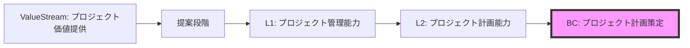

# パラソル設計書構造提案: ValueStream/ValueStage/BC階層モデル

**作成日**: 2025-10-23
**バージョン**: 1.0.0
**目的**: ValueStream分解とBC（Business Capability）中心の設計書構造提案
**対象読者**: エンタープライズアーキテクト、サービス設計者、開発者

---

## 🎯 提案の背景

### ビジネスケーパビリティ駆動設計の原則

エンタープライズアーキテクチャにおいて、ビジネスケーパビリティ（BC）は以下の役割を果たします：

```
ValueStream（価値の流れ）
  ↓ 分解
ValueStage（価値段階）
  ↓ 分析
Capability階層（L1→L2→L3）
  ↓ 抽出
Business Capability（BC）← 設計の中心単位
  ↓ 実装
Service（マイクロサービス）= 複数BCの集合
```

### 現在のパラソル設計との対応関係

```
【現在の構造】
Service
└── Capability
    └── Operation
        └── UseCase

【問題点】
- ValueStreamとの関連性が不明確
- CapabilityとBCの関係が曖昧
- サービス境界の決定基準が不透明
- ドメイン言語・API・DBの共有単位が不明確
```

---

## 📐 提案する階層構造

### 全体階層マップ

```
1. VALUE-STREAM-LAYER（価値の流れ層）
   └── ValueStream定義
       └── ValueStage分解

2. CAPABILITY-LAYER（ケーパビリティ層）
   ├── L1 Capability（大分類）
   ├── L2 Capability（中分類）← BC抽出の基準
   └── L3 Capability（小分類）

3. BC-LAYER（ビジネスケーパビリティ層）← 設計の中心
   ├── BC定義
   ├── パラソルドメイン言語（BC単位）
   ├── API設計（BC単位）
   └── DB設計（BC単位）

4. SERVICE-LAYER（サービス実装層）
   └── Service = 複数BCの集合
       ├── BC1実装
       ├── BC2実装
       └── BC3実装

5. IMPLEMENTATION-LAYER（実装詳細層）
   └── ユースケース実装
```

---

## 🏗️ 新ディレクトリ構造

```
docs/parasol/
│
├── 1-VALUE-STREAMS/ ──────────────────────────
│   └── [value-stream-name]/
│       ├── value-stream.md            # ValueStream定義
│       │   ├── § ビジネス価値の流れ
│       │   ├── § ステークホルダーマップ
│       │   └── § 価値指標（KVI）
│       │
│       └── value-stages/              # ValueStage分解
│           └── [stage-name]/
│               ├── stage.md           # ステージ定義
│               │   ├── § ステージの目的
│               │   ├── § 入力・出力
│               │   ├── § KPI
│               │   └── § 関連ケーパビリティ（L1）
│               │
│               └── capability-mapping.md  # L1ケーパビリティマッピング
│
├── 2-CAPABILITIES/ ───────────────────────────
│   ├── capability-hierarchy.md        # ケーパビリティ階層全体図
│   │
│   └── [l1-capability-name]/         # L1ケーパビリティ
│       ├── l1-capability.md          # L1定義
│       │   ├── § ビジネス価値
│       │   ├── § 責務範囲
│       │   └── § L2分解戦略
│       │
│       └── l2-capabilities/          # L2ケーパビリティ
│           └── [l2-capability-name]/
│               ├── l2-capability.md  # L2定義
│               │   ├── § 機能概要
│               │   ├── § L3分解
│               │   └── § BC抽出候補
│               │
│               └── l3-capabilities/  # L3ケーパビリティ
│                   └── [l3-capability-name]/
│                       └── l3-capability.md
│
├── 3-BUSINESS-CAPABILITIES/ ──────────────────← 設計の中心
│   ├── bc-catalog.md                 # BC全体カタログ
│   │   ├── § BCマップ（Mermaid）
│   │   ├── § BC-L2マッピング
│   │   ├── § BC-Serviceマッピング
│   │   └── § BC成熟度評価
│   │
│   └── [bc-name]/                    # BC単位の設計
│       ├── README.md                 # BC概要（Why-What-How統合）
│       │   ├── § Why: ビジネス価値
│       │   ├── § What: 提供機能
│       │   ├── § How: 実現方法
│       │   └── § 含まれるサービス
│       │
│       ├── domain/                   # パラソルドメイン言語（BC単位で共有）
│       │   ├── domain-language.md   # ドメイン言語定義
│       │   │   ├── § エンティティ定義
│       │   │   ├── § 集約ルート
│       │   │   ├── § バリューオブジェクト
│       │   │   ├── § ドメインサービス
│       │   │   └── § ドメインイベント
│       │   │
│       │   ├── ubiquitous-language.md  # ユビキタス言語辞書
│       │   └── bounded-context.md      # 境界づけられたコンテキスト
│       │
│       ├── api/                      # API設計（BC単位で共有）
│       │   ├── api-specification.md # BC全体のAPI仕様
│       │   │   ├── § RESTful API
│       │   │   ├── § GraphQL API
│       │   │   ├── § WebSocket API
│       │   │   └── § イベント駆動API
│       │   │
│       │   ├── endpoints/            # エンドポイント詳細
│       │   │   └── [endpoint-name].md
│       │   │
│       │   └── contracts/            # API契約
│       │       ├── request-schemas/
│       │       └── response-schemas/
│       │
│       ├── data/                     # DB設計（BC単位で共有）
│       │   ├── database-design.md   # BC全体のDB設計
│       │   │   ├── § ER図
│       │   │   ├── § テーブル設計
│       │   │   ├── § インデックス戦略
│       │   │   └── § データマイグレーション
│       │   │
│       │   ├── schemas/              # スキーマ定義
│       │   │   └── [table-name].sql
│       │   │
│       │   └── migrations/           # マイグレーション
│       │       └── [version]-[description].sql
│       │
│       ├── operations/               # ビジネスオペレーション
│       │   └── [operation-name]/
│       │       ├── operation.md     # オペレーション定義
│       │       └── usecases/        # ユースケース
│       │
│       └── integration/              # BC間連携
│           ├── integration-map.md   # 連携マップ
│           └── contracts/           # 連携契約
│
├── 4-SERVICES/ ───────────────────────────────
│   ├── service-portfolio.md         # サービスポートフォリオ
│   │   ├── § サービス一覧
│   │   ├── § BC-Serviceマッピング
│   │   ├── § サービス間依存関係
│   │   └── § デプロイメントアーキテクチャ
│   │
│   └── [service-name]/              # サービス実装（複数BCの集合）
│       ├── service.md               # サービス定義
│       │   ├── § サービス概要
│       │   ├── § 含まれるBC一覧
│       │   ├── § BC統合戦略
│       │   └── § サービス境界
│       │
│       ├── business-capabilities/   # 含まれるBC実装
│       │   ├── [bc1-name]/
│       │   │   ├── README.md       # BC実装概要
│       │   │   ├── implementation/ # 実装コード参照
│       │   │   └── tests/          # BC単位テスト
│       │   │
│       │   └── [bc2-name]/
│       │       └── ...
│       │
│       ├── shared-domain/           # サービス内共有ドメイン
│       │   ├── aggregated-domain-language.md  # BC統合ドメイン言語
│       │   └── cross-bc-services.md           # BC横断サービス
│       │
│       ├── aggregated-api/          # サービス統合API
│       │   ├── api-gateway.md      # APIゲートウェイ設計
│       │   └── composite-apis/     # 複合API
│       │
│       ├── aggregated-data/         # サービス統合DB
│       │   ├── database-strategy.md  # DB統合戦略
│       │   └── cross-bc-tables/      # BC横断テーブル
│       │
│       └── implementation/          # 実装詳細
│           ├── architecture/
│           ├── deployment/
│           └── monitoring/
│
└── 5-CROSS-CUTTING/ ──────────────────────────
    ├── enterprise-architecture/
    │   ├── ea-principles.md
    │   ├── reference-architecture.md
    │   └── governance.md
    │
    ├── integration-patterns/
    │   ├── bc-integration-patterns.md
    │   ├── service-integration-patterns.md
    │   └── event-driven-patterns.md
    │
    └── standards/
        ├── naming-conventions.md
        ├── api-standards.md
        └── data-standards.md
```

---

## 🔍 詳細設計: BC中心アプローチ

### BC定義テンプレート

**ファイル**: `3-BUSINESS-CAPABILITIES/[bc-name]/README.md`

```markdown
# Business Capability: [BC名]

**BC-ID**: BC-XXX
**バージョン**: 1.0.0
**成熟度レベル**: Level 3 (Defined)
**最終更新**: 2025-10-23

---

## 🎯 Why: ビジネス価値

### ビジネス課題
- [解決する課題1]
- [解決する課題2]

### 提供価値
- [定量的価値1]（例: コスト30%削減）
- [定性的価値2]（例: 顧客満足度向上）

### ステークホルダー
| 役割 | 期待価値 | 利用頻度 |
|------|---------|---------|
| [ロール1] | [価値1] | 日次 |
| [ロール2] | [価値2] | 週次 |

### ValueStreamとの関連


---

## 📋 What: 提供機能

### ケーパビリティ階層からの導出

**L1 Capability**: [大分類ケーパビリティ名]
**L2 Capability**: [中分類ケーパビリティ名] ← このBCの基準

**L3 Capabilities（このBCに含まれる小分類）**:
1. [L3-1]: [説明]
2. [L3-2]: [説明]
3. [L3-3]: [説明]

### 機能一覧

| 機能ID | 機能名 | 優先度 | 対応L3 |
|--------|--------|--------|--------|
| F-01 | [機能1] | 高 | L3-1 |
| F-02 | [機能2] | 中 | L3-2 |
| F-03 | [機能3] | 低 | L3-3 |

### ビジネスオペレーション

1. **[オペレーション1]**: [説明]
   - 入力: [データ]
   - 出力: [データ]
   - ビジネスルール: [ルール]

2. **[オペレーション2]**: [説明]
   - 入力: [データ]
   - 出力: [データ]
   - ビジネスルール: [ルール]

---

## 🏗️ How: 実現方法

### パラソルドメイン言語（BC単位で定義・共有）

#### エンティティ

```typescript
/**
 * BC: [BC名]の中核エンティティ
 *
 * ライフサイクル: [作成] → [状態1] → [状態2] → [完了]
 * 責務: [エンティティの責務]
 */
interface [EntityName] {
  id: UUID;
  // BCドメインのプロパティ
  [property1]: [Type1];
  [property2]: [Type2];
  status: [StatusEnum];

  // メタデータ
  createdAt: DateTime;
  updatedAt: DateTime;
  version: number;
}

enum [StatusEnum] {
  DRAFT = "draft",
  ACTIVE = "active",
  COMPLETED = "completed",
  ARCHIVED = "archived"
}
```

#### 集約ルート

```typescript
/**
 * BC: [BC名]の集約ルート
 *
 * 不変条件:
 * - [制約1]
 * - [制約2]
 *
 * 境界: このBC内でのみ一貫性を保証
 */
class [AggregateName]Aggregate {
  private root: [EntityName];
  private [childEntity]: [ChildEntity][];
  private [valueObject]: [ValueObject];

  // ビジネスロジック
  public [businessMethod](): void {
    // BC内の不変条件をチェック
    this.ensureInvariants();

    // ビジネスルール適用
    // ...

    // ドメインイベント発行
    this.raiseEvent(new [Event]Occurred());
  }

  private ensureInvariants(): void {
    // BC境界内での整合性チェック
  }
}
```

#### ドメインサービス

```typescript
/**
 * BC: [BC名]のドメインサービス
 *
 * 責務: BC内の複雑なビジネスロジック
 * スコープ: このBC内でのみ使用
 */
class [BCName]DomainService {
  // BC固有のビジネスロジック
  public execute[BusinessOperation](): void {
    // ...
  }

  // BC内の整合性維持
  public ensure[BusinessRule](): boolean {
    // ...
  }
}
```

**📖 詳細**: [domain/domain-language.md](./domain/domain-language.md)

---

### API設計（BC単位で定義・共有）

#### BC APIエンドポイント

```yaml
# BC: [BC名]のAPI仕様

openapi: 3.0.0
info:
  title: [BC名] API
  version: 1.0.0
  description: BC単位で定義されたAPI

paths:
  /api/bc/[bc-name]/[resource]:
    post:
      summary: [操作説明]
      operationId: [operationId]
      tags:
        - BC-[BC名]
      requestBody:
        required: true
        content:
          application/json:
            schema:
              $ref: '#/components/schemas/[RequestSchema]'
      responses:
        '201':
          description: Created
          content:
            application/json:
              schema:
                $ref: '#/components/schemas/[ResponseSchema]'

components:
  schemas:
    [RequestSchema]:
      type: object
      required:
        - field1
        - field2
      properties:
        field1:
          type: string
          description: BC固有のプロパティ
        field2:
          type: integer
```

**BCベースAPI命名規則**:
```
/api/bc/[bc-name]/[resource]         # BCベースのリソース
/api/bc/[bc-name]/operations/[op]    # BCベースのオペレーション
```

**📖 詳細**: [api/api-specification.md](./api/api-specification.md)

---

### データベース設計（BC単位で定義・共有）

#### BCスキーマ設計

```sql
-- BC: [BC名]のデータベーススキーマ
-- BCスコープ: このBC内でのみ使用されるテーブル

-- BC集約テーブル
CREATE SCHEMA bc_[bc_name];

-- BC中核エンティティ
CREATE TABLE bc_[bc_name].[entity_name] (
  id UUID PRIMARY KEY DEFAULT gen_random_uuid(),

  -- BC固有のビジネスデータ
  [field1] VARCHAR(255) NOT NULL,
  [field2] INTEGER NOT NULL,
  status VARCHAR(50) NOT NULL,

  -- BC内での整合性維持
  aggregate_version INTEGER NOT NULL DEFAULT 1,

  -- メタデータ
  created_at TIMESTAMP DEFAULT CURRENT_TIMESTAMP,
  updated_at TIMESTAMP DEFAULT CURRENT_TIMESTAMP,

  -- BC境界内での制約
  CONSTRAINT chk_status CHECK (status IN ('draft', 'active', 'completed', 'archived')),
  CONSTRAINT chk_[business_rule] CHECK ([ビジネスルール])
);

-- BCインデックス戦略
CREATE INDEX idx_bc_[bc_name]_status ON bc_[bc_name].[entity_name](status);
CREATE INDEX idx_bc_[bc_name]_created ON bc_[bc_name].[entity_name](created_at);

-- BC子エンティティ（集約内）
CREATE TABLE bc_[bc_name].[child_entity] (
  id UUID PRIMARY KEY DEFAULT gen_random_uuid(),
  parent_id UUID NOT NULL REFERENCES bc_[bc_name].[entity_name](id) ON DELETE CASCADE,

  -- BC固有データ
  [child_field1] TEXT,

  created_at TIMESTAMP DEFAULT CURRENT_TIMESTAMP
);

-- BCドメインイベント格納
CREATE TABLE bc_[bc_name].domain_events (
  id UUID PRIMARY KEY DEFAULT gen_random_uuid(),
  event_type VARCHAR(100) NOT NULL,
  aggregate_id UUID NOT NULL,
  payload JSONB NOT NULL,
  occurred_at TIMESTAMP DEFAULT CURRENT_TIMESTAMP,
  processed BOOLEAN DEFAULT FALSE
);
```

**BC間データ共有の原則**:
- BC内: トランザクション整合性
- BC間: 結果整合性（イベント駆動）

**📖 詳細**: [data/database-design.md](./data/database-design.md)

---

## 🔗 BC統合とサービス実装

### このBCが含まれるサービス

| サービス名 | 含まれるBC | BC統合戦略 |
|-----------|-----------|-----------|
| [service-1] | BC-XXX, BC-YYY, BC-ZZZ | [統合方針] |

### BC間連携

```mermaid
graph LR
    BC1[BC: [このBC]] -->|イベント| BC2[BC: [連携先BC]]
    BC1 -->|API呼び出し| BC3[BC: [連携先BC]]
    BC2 -->|データ参照| BC1

    style BC1 fill:#f9f,stroke:#333,stroke-width:4px
```

**連携パターン**:
1. **イベント駆動連携**: BC-XXX → BC-YYY（非同期）
2. **API連携**: BC-XXX ← BC-ZZZ（同期）
3. **データ参照**: BC-XXX → BC-WWW（読み取り専用）

**📖 詳細**: [integration/integration-map.md](./integration/integration-map.md)

---

## 📚 関連ドキュメント

### ValueStream/Capability層
- [ValueStream定義](../../1-VALUE-STREAMS/[vs-name]/value-stream.md)
- [ValueStage定義](../../1-VALUE-STREAMS/[vs-name]/value-stages/[stage-name]/stage.md)
- [L1 Capability](../../2-CAPABILITIES/[l1-name]/l1-capability.md)
- [L2 Capability](../../2-CAPABILITIES/[l1-name]/l2-capabilities/[l2-name]/l2-capability.md)

### BC詳細設計
- [パラソルドメイン言語](./domain/domain-language.md)
- [API仕様](./api/api-specification.md)
- [DB設計](./data/database-design.md)

### Service実装
- [サービス定義](../../4-SERVICES/[service-name]/service.md)
- [BC実装](../../4-SERVICES/[service-name]/business-capabilities/[bc-name]/README.md)

---

## ✅ BCチェックリスト

### BC定義
- [ ] L2 Capabilityからの導出が明確
- [ ] ビジネス価値が定量的に定義
- [ ] BC境界が明確

### ドメイン設計
- [ ] パラソルドメイン言語定義（BC単位）
- [ ] エンティティ・集約定義
- [ ] ドメインサービス定義
- [ ] ドメインイベント定義

### API設計
- [ ] BCベースAPI設計（BC単位）
- [ ] エンドポイント命名規則準拠
- [ ] リクエスト/レスポンススキーマ定義

### データ設計
- [ ] BCスキーマ設計（BC単位）
- [ ] BC内トランザクション整合性保証
- [ ] BC間結果整合性設計

### 統合設計
- [ ] BC間連携パターン定義
- [ ] サービス統合戦略定義
- [ ] イベント駆動アーキテクチャ設計

---

**最終更新**: 2025-10-23
**次回レビュー**: 2025-11-23
```

---

## 🎨 主要な設計パターン

### Pattern 1: BC境界の明確化

```
BC境界の決定基準:
1. トランザクション境界: BC内で強整合性が必要な範囲
2. ビジネスルール境界: 独立したビジネスルールの集合
3. 変更の頻度: 一緒に変更される可能性が高い機能群
4. チーム境界: 1つのチームが責任を持てる範囲

BC間の連携パターン:
- イベント駆動: 非同期、結果整合性
- API呼び出し: 同期、要求/応答
- データ参照: 読み取り専用、非同期レプリケーション
```

### Pattern 2: BCベースのドメイン言語共有

```
【共有戦略】
同一BC内:
  ✅ エンティティ定義を共有
  ✅ 集約ルールを共有
  ✅ ドメインサービスを共有
  ✅ ビジネスルールを共有

異なるBC間:
  ❌ エンティティを直接参照しない
  ✅ パブリッシュされたイベントを購読
  ✅ 公開APIを呼び出し
  ❌ データベーステーブルを直接JOIN しない
```

### Pattern 3: サービス = 複数BCの集合

```
【サービス構成の原則】
1つのサービスに含めるBCの基準:
  ✓ 密接に関連するビジネス機能
  ✓ 高頻度でやり取りが発生する
  ✓ 同一チームが管理可能
  ✓ 類似のSLAを持つ

サービス境界の決定:
  Service A = { BC-1, BC-2, BC-3 }
  - BC-1とBC-2: 強い関連性（同一サービス）
  - BC-1とBC-4: 弱い関連性（別サービス）
  - BC間通信オーバーヘッド vs サービス分離メリット
```

---

## 📊 ValueStream → BC → Service マッピング例

### 例: コンサルティングプロジェクト価値提供

```
ValueStream: コンサルティングプロジェクト価値提供
│
├── ValueStage 1: 提案段階
│   ├── L1: プロジェクト提案能力
│   │   ├── L2: 提案書作成能力
│   │   │   ├── L3: 提案内容策定
│   │   │   ├── L3: 見積作成
│   │   │   └── L3: 提案書生成
│   │   │   → BC-001: 提案書作成BC ────┐
│   │   │                               │
│   │   └── L2: 提案承認能力             │
│   │       ├── L3: 承認申請               │
│   │       └── L3: 承認判定               │
│   │       → BC-002: 提案承認BC ────┐   │
│   │                               │   │
│   └── L1: 顧客関係構築能力          │   │
│       └── L2: 初期コミュニケーション │   │
│           → BC-003: 顧客コミュニケーションBC
│
├── ValueStage 2: 実行段階               │   │
│   ├── L1: プロジェクト管理能力         │   │
│   │   ├── L2: プロジェクト計画能力    │   │
│   │   │   → BC-004: プロジェクト計画BC ┐ │
│   │   │                               │ │
│   │   └── L2: プロジェクト監視能力    │ │
│   │       → BC-005: プロジェクト監視BC ┘ │
│   │                                     │
│   └── L1: タスク実行能力                │
│       └── L2: タスク管理能力            │
│           → BC-006: タスク管理BC        │
│                                        │
└── ValueStage 3: 完了段階               │
    └── L1: 成果物管理能力               │
        └── L2: 成果物承認能力           │
            → BC-007: 成果物承認BC       │
                                        │
【Service構成】                          │
                                        │
Service-1: project-proposal-service ────┴───┐
  ├── BC-001: 提案書作成BC                  │
  └── BC-002: 提案承認BC                    │
  共有: 提案ドメイン言語、提案API、提案DB    │
                                            │
Service-2: project-success-service ─────────┴──┐
  ├── BC-004: プロジェクト計画BC               │
  ├── BC-005: プロジェクト監視BC               │
  └── BC-006: タスク管理BC                     │
  共有: プロジェクトドメイン言語、PM-API、PM-DB │
                                                │
Service-3: collaboration-service ───────────────┘
  └── BC-003: 顧客コミュニケーションBC
  共有: コラボレーションドメイン言語、通知API、通知DB
```

---

## 🔄 移行戦略

### Phase 1: BC特定とマッピング（2週間）

```bash
# ステップ1: 既存Capabilityの分析
1. 現在のservice/capability/operationを棚卸し
2. L1/L2/L3階層への再マッピング
3. BC候補の抽出（L2ベース）

# ステップ2: BC境界の決定
1. トランザクション境界の分析
2. ビジネスルール境界の分析
3. BC間連携パターンの特定

# ステップ3: BCカタログ作成
1. bc-catalog.mdの作成
2. BC-L2マッピング表の作成
3. BC-Serviceマッピング表の作成
```

### Phase 2: BCベース設計書作成（4週間）

```bash
# Week 1-2: コアBC設計
1. 優先度の高いBC（3-5個）の詳細設計
   - ドメイン言語定義
   - API設計
   - DB設計

# Week 3-4: BC統合設計
1. BC間連携設計
2. サービス統合設計
3. イベント駆動アーキテクチャ設計
```

### Phase 3: サービス再編成（6週間）

```bash
# Week 1-2: BC実装の整理
1. 既存実装のBC単位への再編成
2. BCベースのディレクトリ構造への移行

# Week 3-4: サービス統合
1. 複数BCのサービスへの統合
2. 共有ドメイン言語の整理
3. 統合API/DBの設計

# Week 5-6: 移行完了と検証
1. 全サービスのBC構造への移行完了
2. BC境界とサービス境界の検証
3. ドキュメント整備
```

---

## 📈 期待効果

### アーキテクチャの明確化

| 指標 | 現状 | 目標 | 改善率 |
|------|------|------|--------|
| サービス境界の明確性 | 60% | 95% | +58% |
| BC境界の明確性 | 40% | 95% | +138% |
| ドメイン言語の一貫性 | 50% | 90% | +80% |
| ValueStreamとの対応 | 30% | 95% | +217% |

### 設計・開発効率

| 指標 | 現状 | 目標 | 改善率 |
|------|------|------|--------|
| BC設計時間 | - | 2日/BC | 標準化 |
| サービス境界決定時間 | 5日 | 1日 | 80%削減 |
| ドメイン言語共有率 | 40% | 90% | +125% |
| API設計の再利用率 | 30% | 80% | +167% |

### ビジネス価値の可視化

- **ValueStreamとの直接的な紐付け**: ビジネス価値の流れが明確
- **BC成熟度の測定**: BCレベルでの成熟度評価が可能
- **投資対効果の可視化**: BC単位でのROI測定

---

## 📚 参照ドキュメント

- [パラソル設計v2.0仕様](./directory-structure-standard-v2.md)
- [Why-What-How設計提案](./PARASOL_WHY_WHAT_HOW_DESIGN_PROPOSAL.md)
- [パラソル開発ガイド](./PARASOL_DEVELOPMENT_GUIDE.md)

---

## 📝 改訂履歴

| 日付 | バージョン | 変更内容 | 担当 |
|------|-----------|---------|------|
| 2025-10-23 | 1.0.0 | 初版作成 | Claude |

---

**備考**: この提案は、ValueStream/BC/Service階層を明確にし、BCを中心とした設計書構造を実現することで、ビジネス価値とサービス実装の直接的な紐付けを可能にします。
