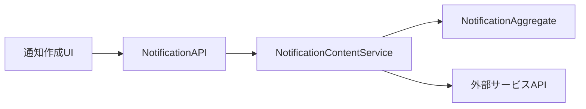
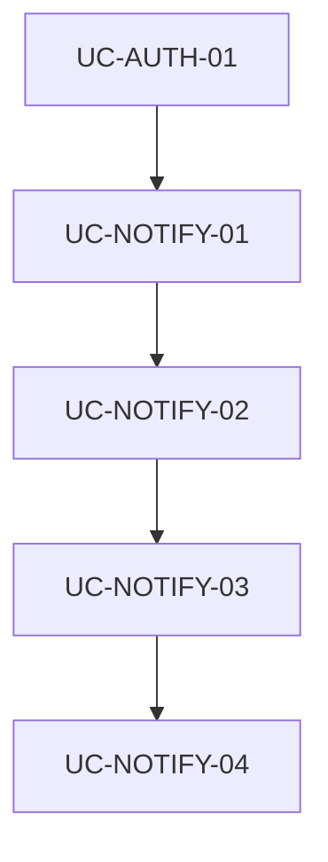

# パラソル設計書構造提案: Why-What-How-実装志向

**作成日**: 2025-10-23
**バージョン**: 1.0.0
**目的**: サービス実装を加速する設計書構造の提案
**対象読者**: アーキテクト、開発者、プロダクトマネージャー

---

## 🎯 提案の背景

### 現在の構造の課題

#### 情報の分散
```
【現状】実装者が情報を探すために読む必要があるファイル数
├── service.md (Why: ビジネス価値)
├── capability.md (What: 提供能力)
├── operation.md (How: 技術仕様)
├── usecase.md (How: 詳細フロー)
├── api-usage.md (How: API利用)
├── page.md (UI: 画面設計)
├── api-specification.md (API: 全体仕様)
└── database-design.md (DB: データ設計)

→ 最低8ファイルを参照する必要がある
```

#### Why-What-Howの関連性の不透明さ
- **Why（なぜ）**: service.md → capability.md に分散
- **What（何を）**: capability.md → operation.md に分散
- **How（どのように）**: operation.md → usecase.md → api-usage.md に分散
- **実装情報**: 複数ファイルに分散

### 実装者が知りたいこと

#### 1. ユースケース実装時
```
Q1: なぜこの機能が必要なのか？（ビジネス価値）
Q2: 何を実装すればいいのか？（要件定義）
Q3: どのように実装するのか？（技術仕様）
Q4: 具体的なコード例は？（実装ガイド）
```

#### 2. サービス全体理解時
```
Q1: このサービスは何を解決するのか？（課題と価値）
Q2: どんな機能を提供するのか？（機能一覧）
Q3: どのように実装されているのか？（アーキテクチャ）
Q4: どこから始めればいいのか？（実装順序）
```

---

## 📐 提案する新構造: WHI（Why-How-Implementation）モデル

### コンセプト

**「実装者視点での情報階層化」**

```
レイヤー1: WHY層 - ビジネス価値（なぜ作るのか）
レイヤー2: WHAT層 - 機能要件（何を作るのか）
レイヤー3: HOW層 - 技術設計（どう作るのか）
レイヤー4: IMPL層 - 実装詳細（具体的にどう実装するか）
```

### 新ディレクトリ構造

```
services/[service-name]/
│
├── 📋 WHY-LAYER/ ──────────────────────────
│   ├── service-vision.md              # サービスビジョン（統合）
│   │   ├── § ビジネス課題と解決策
│   │   ├── § 提供価値とKPI
│   │   ├── § ターゲットユーザー
│   │   └── § 成功指標
│   │
│   └── business-context.md             # ビジネスコンテキスト
│       ├── § 市場環境と競合分析
│       ├── § ステークホルダーマップ
│       └── § ビジネスロードマップ
│
├── 🎯 WHAT-LAYER/ ─────────────────────────
│   ├── capabilities/                   # ケーパビリティカタログ
│   │   └── [capability-name]/
│   │       ├── capability-overview.md  # ケーパビリティ概要
│   │       │   ├── § 提供価値（Why参照）
│   │       │   ├── § 機能一覧
│   │       │   ├── § ユースケースマップ
│   │       │   └── § KPI・成功指標
│   │       │
│   │       └── operations/             # オペレーション一覧
│   │           └── [operation-name]/
│   │               └── operation-catalog.md
│   │                   ├── § オペレーション概要
│   │                   ├── § ユースケース一覧
│   │                   └── § 実装優先度
│   │
│   └── feature-roadmap.md              # 機能ロードマップ
│
├── 🏗️ HOW-LAYER/ ──────────────────────────
│   ├── architecture/                   # アーキテクチャ設計
│   │   ├── system-architecture.md     # システム全体設計
│   │   ├── domain-model.md            # ドメインモデル（統合）
│   │   │   ├── § パラソルエンティティ定義
│   │   │   ├── § 集約とバリューオブジェクト
│   │   │   ├── § ドメインサービス
│   │   │   └── § サービス間連携モデル
│   │   │
│   │   ├── api-architecture.md        # API設計（統合）
│   │   │   ├── § RESTful API仕様
│   │   │   ├── § ユースケースAPI一覧
│   │   │   ├── § サービス間連携API
│   │   │   └── § WebSocket仕様
│   │   │
│   │   └── data-architecture.md       # データ設計（統合）
│   │       ├── § データベーススキーマ
│   │       ├── § ER図
│   │       └── § データフロー
│   │
│   └── technical-specifications/      # 技術仕様
│       ├── security-spec.md
│       ├── performance-spec.md
│       └── integration-spec.md
│
├── 💻 IMPL-LAYER/ ─────────────────────────
│   ├── usecases/                       # ユースケース実装（統合）
│   │   └── [usecase-name]/
│   │       ├── README.md               # ユースケース実装ガイド（新設）
│   │       │   ├── § Why: ビジネス価値（リンク）
│   │       │   ├── § What: 機能要件（リンク）
│   │       │   ├── § How: 技術設計（統合）
│   │       │   ├── § Implementation: 実装詳細
│   │       │   └── § Quick Start
│   │       │
│   │       ├── business-logic/         # ビジネスロジック実装
│   │       │   ├── usecase-specification.md
│   │       │   ├── business-rules.md
│   │       │   └── validation-rules.md
│   │       │
│   │       ├── technical-design/       # 技術設計詳細
│   │       │   ├── api-integration.md  # API統合仕様
│   │       │   ├── data-access.md      # データアクセス
│   │       │   ├── domain-services.md  # ドメインサービス利用
│   │       │   └── error-handling.md   # エラーハンドリング
│   │       │
│   │       ├── ui-design/              # UI設計
│   │       │   ├── page-specification.md
│   │       │   ├── component-design.md
│   │       │   └── user-flow.md
│   │       │
│   │       ├── implementation-guide/   # 実装ガイド（新設）
│   │       │   ├── backend-guide.md
│   │       │   │   ├── § API実装例
│   │       │   │   ├── § ドメインロジック実装
│   │       │   │   ├── § データアクセス実装
│   │       │   │   └── § テストコード例
│   │       │   │
│   │       │   ├── frontend-guide.md
│   │       │   │   ├── § コンポーネント実装例
│   │       │   │   ├── § 状態管理実装
│   │       │   │   ├── § API呼び出し実装
│   │       │   │   └── § テストコード例
│   │       │   │
│   │       │   └── integration-guide.md
│   │       │       ├── § サービス間連携実装
│   │       │       ├── § 非同期処理実装
│   │       │       └── § エラーハンドリング実装
│   │       │
│   │       └── tests/                  # テスト仕様・実装
│   │           ├── test-scenarios.md
│   │           ├── unit-tests.md
│   │           ├── integration-tests.md
│   │           └── e2e-tests.md
│   │
│   └── implementation-index.md         # 実装インデックス（新設）
│       ├── § 実装優先順位
│       ├── § 依存関係マップ
│       └── § 実装チェックリスト
│
└── 📚 CROSS-CUTTING/ ───────────────────────
    ├── domain-language.md              # パラソルドメイン言語（全体）
    ├── glossary.md                     # 用語集
    └── decision-log.md                 # アーキテクチャ決定記録
```

---

## 🎨 新構造の特徴

### 1. Why-What-How-Implの明確な階層化

#### WHY層（ビジネス価値）
- **対象読者**: プロダクトマネージャー、ステークホルダー
- **目的**: なぜこのサービスを作るのか
- **内容**: ビジネス課題、解決策、提供価値、KPI

#### WHAT層（機能要件）
- **対象読者**: プロダクトマネージャー、開発者
- **目的**: 何を作るのか
- **内容**: ケーパビリティ一覧、オペレーション一覧、ユースケースマップ

#### HOW層（技術設計）
- **対象読者**: アーキテクト、リードエンジニア
- **目的**: どのように作るのか
- **内容**: アーキテクチャ、ドメインモデル、API設計、データ設計

#### IMPL層（実装詳細）
- **対象読者**: 開発者
- **目的**: 具体的にどう実装するのか
- **内容**: ユースケース実装ガイド、コード例、テスト仕様

### 2. ユースケース中心の実装ガイド

#### README.mdによる統合ビュー

各ユースケースに`README.md`を新設し、Why-What-How-Implを1ファイルで提供：

```markdown
# ユースケース実装ガイド: 通知コンテンツを作成する

## 🎯 Why: なぜこの機能が必要か

### ビジネス価値
- コミュニケーション効率向上（意思決定時間50%短縮）
- 情報伝達の確実性向上（既読率85%以上）

### 解決する課題
- 重要情報が埋もれる問題
- 通知疲れによる見落とし

[詳細: ../../WHY-LAYER/service-vision.md#通知機能の価値]

---

## 📋 What: 何を実装するか

### 機能要件
1. 通知コンテンツの作成・編集
2. テンプレート利用
3. プレビュー機能
4. 配信設定

### 成功基準
- コンテンツ作成時間: 平均3分以内
- テンプレート利用率: 70%以上

[詳細: ../../WHAT-LAYER/capabilities/.../operation-catalog.md]

---

## 🏗️ How: どのように実装するか

### アーキテクチャ概要


### ドメインモデル
- **集約**: NotificationAggregate
- **エンティティ**: NotificationContent
- **バリューオブジェクト**: DeliverySettings

[詳細: ../../HOW-LAYER/architecture/domain-model.md#NotificationAggregate]

### API仕様
```typescript
POST /api/notifications/content
{
  "title": string,
  "body": string,
  "type": "info" | "warning" | "critical",
  "targetAudience": string[]
}
```

[詳細: ../../HOW-LAYER/architecture/api-architecture.md#通知API]

---

## 💻 Implementation: 具体的な実装方法

### クイックスタート

#### 1. バックエンド実装（5ステップ）
```typescript
// Step 1: エンティティ作成
// src/domain/notification/entities/NotificationContent.ts
export class NotificationContent {
  // 実装コード...
}

// Step 2: 集約実装
// src/domain/notification/aggregates/NotificationAggregate.ts
export class NotificationAggregate {
  // 実装コード...
}

// Step 3: ドメインサービス
// src/domain/notification/services/NotificationContentService.ts
export class NotificationContentService {
  // 実装コード...
}

// Step 4: API実装
// src/api/notifications/createContent.ts
export async function createNotificationContent(req, res) {
  // 実装コード...
}

// Step 5: テスト
// tests/usecases/create-notification-content.test.ts
describe('Create Notification Content', () => {
  // テストコード...
});
```

[詳細コード: ./implementation-guide/backend-guide.md]

#### 2. フロントエンド実装（5ステップ）
```typescript
// Step 1: ページコンポーネント
// src/pages/notifications/CreateNotificationPage.tsx
export function CreateNotificationPage() {
  // 実装コード...
}

// Step 2: フォームコンポーネント
// src/components/notifications/NotificationContentForm.tsx
export function NotificationContentForm() {
  // 実装コード...
}

// Step 3: 状態管理
// src/hooks/useNotificationCreation.ts
export function useNotificationCreation() {
  // 実装コード...
}

// Step 4: API呼び出し
// src/api/notificationApi.ts
export async function createNotificationContent(data) {
  // 実装コード...
}

// Step 5: テスト
// tests/components/NotificationContentForm.test.tsx
describe('NotificationContentForm', () => {
  // テストコード...
});
```

[詳細コード: ./implementation-guide/frontend-guide.md]

---

## ✅ 実装チェックリスト

### バックエンド
- [ ] エンティティ実装
- [ ] 集約実装
- [ ] ドメインサービス実装
- [ ] API実装
- [ ] 単体テスト
- [ ] 統合テスト

### フロントエンド
- [ ] ページコンポーネント
- [ ] フォームコンポーネント
- [ ] 状態管理
- [ ] API統合
- [ ] コンポーネントテスト
- [ ] E2Eテスト

---

## 📚 関連ドキュメント

- [ビジネス価値](../../WHY-LAYER/service-vision.md)
- [ケーパビリティ概要](../../WHAT-LAYER/capabilities/.../capability-overview.md)
- [ドメインモデル](../../HOW-LAYER/architecture/domain-model.md)
- [API仕様](../../HOW-LAYER/architecture/api-architecture.md)
- [実装ガイド詳細](./implementation-guide/)
```

### 3. 情報の統合と重複排除

#### 統合されるファイル
```
【旧】
├── api-specification.md (サービスレベル)
├── api-usage.md (ユースケースレベル)
└── database-design.md (サービスレベル)

【新】
├── HOW-LAYER/architecture/api-architecture.md (統合)
├── HOW-LAYER/architecture/data-architecture.md (統合)
└── IMPL-LAYER/usecases/[name]/technical-design/api-integration.md (詳細)
```

### 4. 実装者向けナビゲーション

#### implementation-index.md（新設）
```markdown
# 実装インデックス

## 実装優先順位

### Phase 1: コア機能（Week 1-2）
1. ✅ UC-AUTH-01: ユーザー認証
2. 🔄 UC-NOTIFY-01: 通知コンテンツ作成 ← 今ここ
3. ⏳ UC-NOTIFY-02: 通知配信

### Phase 2: 拡張機能（Week 3-4）
4. ⏳ UC-NOTIFY-03: 通知受信・閲覧
5. ⏳ UC-NOTIFY-04: 通知設定管理

## 依存関係マップ



## 実装ガイドへのリンク

| ユースケース | 実装ガイド | 状態 | 担当 |
|------------|-----------|------|------|
| UC-AUTH-01 | [認証実装](./usecases/authenticate-user/README.md) | ✅ 完了 | Team A |
| UC-NOTIFY-01 | [通知作成実装](./usecases/create-notification-content/README.md) | 🔄 進行中 | Team B |
| UC-NOTIFY-02 | [通知配信実装](./usecases/deliver-notification/README.md) | ⏳ 未着手 | - |
```

---

## 🔄 移行戦略

### Phase 1: 並行運用（2週間）
```
新構造導入 + 既存構造維持

新規ユースケース → 新構造で作成
既存ユースケース → 既存構造を維持
```

### Phase 2: 段階的移行（4週間）
```
優先度の高いユースケースから新構造へ移行

Week 1-2: コア機能の移行（認証、通知、プロジェクト）
Week 3-4: 拡張機能の移行（ナレッジ、タレント、収益）
```

### Phase 3: 完全移行（2週間）
```
全ユースケースを新構造へ移行完了

- 旧構造ファイルのアーカイブ
- ドキュメントリンクの更新
- 開発ガイドの更新
```

---

## 📊 期待効果

### 開発者の生産性向上

| 指標 | 現状 | 目標 | 改善率 |
|------|------|------|--------|
| 実装準備時間 | 4時間 | 1時間 | 75%削減 |
| 必要ファイル参照数 | 8ファイル | 1-2ファイル | 75%削減 |
| Why-What-How理解時間 | 2時間 | 30分 | 75%削減 |
| 実装開始までの時間 | 6時間 | 1.5時間 | 75%削減 |

### コード品質向上

- **一貫性**: 実装ガイドによる統一されたコーディングスタイル
- **テストカバレッジ**: テスト仕様の明確化により90%以上達成
- **保守性**: ドキュメントとコードの一元管理

### オンボーディング効率化

- **新規開発者**: 1週間で実装開始可能（現状3週間）
- **理解度**: Why-What-How-Implの段階的学習
- **自己解決率**: 実装ガイドにより80%以上（現状50%）

---

## 🎯 成功基準

### 定量的指標
- 実装準備時間: 75%削減
- 実装ガイド参照率: 90%以上
- 新規開発者の生産性: 2週間で実戦投入可能

### 定性的指標
- 開発者満足度: 4.0以上/5.0
- ドキュメント品質スコア: 4.5以上/5.0
- Why-What-How理解度: 95%以上

---

## 📚 参照ドキュメント

- [パラソル設計ディレクトリ構造標準仕様 v2.0](./directory-structure-standard-v2.md)
- [パラソル開発ガイド](./PARASOL_DEVELOPMENT_GUIDE.md)
- [パラソル設計の実際のMDファイル構造](./ACTUAL_MD_FILE_STRUCTURE.md)

---

## 📝 改訂履歴

| 日付 | バージョン | 変更内容 | 担当 |
|------|-----------|---------|------|
| 2025-10-23 | 1.0.0 | 初版作成 | Claude |

---

**備考**: この提案は、パラソル設計の基本原則を維持しつつ、実装者視点でのアクセス性を大幅に向上させることを目的としています。
