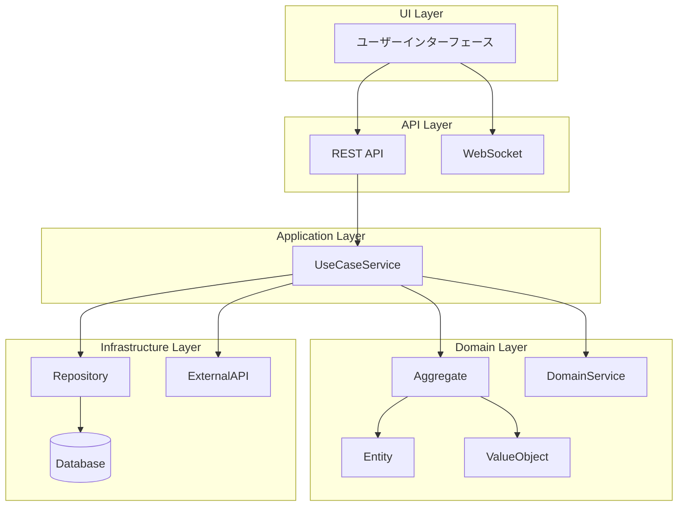

# ユースケース実装ガイド: [ユースケース名]

**ユースケースID**: UC-XXX-YY
**バージョン**: 1.0.0
**最終更新**: YYYY-MM-DD
**実装状態**: 🔄 進行中 | ✅ 完了 | ⏳ 未着手

---

## 🎯 Why: なぜこの機能が必要か

### ビジネス価値

**解決する課題**
- [具体的な課題1]
- [具体的な課題2]
- [具体的な課題3]

**提供価値**
- [定量的な価値1]（例: 作業時間50%削減）
- [定量的な価値2]（例: エラー率70%削減）
- [定性的な価値3]（例: ユーザー満足度向上）

**ビジネスインパクト**
```
現状の問題:
├── 問題1: [具体的な問題と損失]
├── 問題2: [具体的な問題と損失]
└── 問題3: [具体的な問題と損失]

この機能による改善:
├── 改善1: [具体的な改善と効果]
├── 改善2: [具体的な改善と効果]
└── 改善3: [具体的な改善と効果]

期待ROI: [投資対効果の見込み]
```

### ターゲットユーザー

| ユーザー種別 | 利用目的 | 利用頻度 | 優先度 |
|------------|---------|---------|--------|
| [ロール1] | [目的1] | 日次 | 高 |
| [ロール2] | [目的2] | 週次 | 中 |
| [ロール3] | [目的3] | 月次 | 低 |

**📖 詳細**: [サービスビジョン](../../WHY-LAYER/service-vision.md#[アンカー])

---

## 📋 What: 何を実装するか

### 機能要件

#### コア機能
1. **[機能1]**
   - 説明: [詳細説明]
   - 入力: [入力データ]
   - 出力: [出力データ]
   - 制約: [ビジネスルール]

2. **[機能2]**
   - 説明: [詳細説明]
   - 入力: [入力データ]
   - 出力: [出力データ]
   - 制約: [ビジネスルール]

#### 拡張機能
1. **[拡張機能1]**: [説明]
2. **[拡張機能2]**: [説明]

### 成功基準

| 指標 | 目標値 | 測定方法 | 優先度 |
|------|--------|---------|--------|
| [KPI1] | [数値] | [測定方法] | 高 |
| [KPI2] | [数値] | [測定方法] | 中 |
| [KPI3] | [数値] | [測定方法] | 低 |

### ユーザーストーリー

```gherkin
Feature: [機能名]
  As a [ユーザーロール]
  I want to [やりたいこと]
  So that [得られる価値]

  Scenario: [シナリオ1]
    Given [前提条件]
    When [アクション]
    Then [期待結果]

  Scenario: [シナリオ2]
    Given [前提条件]
    When [アクション]
    Then [期待結果]
```

**📖 詳細**: [オペレーションカタログ](../../WHAT-LAYER/capabilities/[capability]/operations/[operation]/operation-catalog.md)

---

## 🏗️ How: どのように実装するか

### アーキテクチャ概要



### ドメインモデル

#### 集約ルート
```typescript
/**
 * [集約名] Aggregate
 *
 * 責務: [集約の責務]
 * 不変条件: [守るべき制約]
 */
export class [AggregateName]Aggregate {
  // エンティティ
  private root: [EntityName];

  // バリューオブジェクト
  private [voName]: [ValueObjectName];

  // ビジネスロジック
  public [businessMethod](): void {
    // 不変条件のチェック
    // ビジネスルールの適用
    // 状態の変更
  }
}
```

#### 主要エンティティ
```typescript
/**
 * [エンティティ名]
 *
 * ライフサイクル: [作成] → [状態1] → [状態2] → [完了]
 */
interface [EntityName] {
  id: UUID;
  [field1]: [Type1];
  [field2]: [Type2];
  status: [StatusEnum];
  createdAt: DateTime;
  updatedAt: DateTime;
}

enum [StatusEnum] {
  [STATE1] = "state1",
  [STATE2] = "state2",
  [STATE3] = "state3"
}
```

#### バリューオブジェクト
```typescript
/**
 * [バリューオブジェクト名]
 *
 * 不変性: 作成後は変更不可
 * 等価性: 全フィールドの値が一致
 */
class [ValueObjectName] {
  constructor(
    public readonly [field1]: [Type1],
    public readonly [field2]: [Type2]
  ) {
    this.validate();
  }

  private validate(): void {
    // バリデーションロジック
  }
}
```

**📖 詳細**: [ドメインモデル仕様](../../HOW-LAYER/architecture/domain-model.md#[アンカー])

### API仕様

#### エンドポイント定義

```typescript
/**
 * [操作名] API
 *
 * 目的: [APIの目的]
 * 認証: 必要
 * 権限: [必要な権限]
 */
POST /api/[service]/[resource]
Content-Type: application/json
Authorization: Bearer {token}

// リクエスト
{
  "field1": "value1",
  "field2": "value2"
}

// レスポンス (成功)
{
  "id": "uuid",
  "field1": "value1",
  "status": "created",
  "createdAt": "2025-01-15T10:00:00Z"
}

// レスポンス (エラー)
{
  "error": {
    "code": "ERROR_CODE",
    "message": "エラーメッセージ",
    "details": {}
  }
}
```

#### サービス間連携

```typescript
// 他サービスユースケース呼び出し
async function callExternalUseCase() {
  const response = await fetch(
    'POST /api/[external-service]/usecases/[usecase-id]',
    {
      headers: { 'Authorization': `Bearer ${token}` },
      body: JSON.stringify({ /* パラメータ */ })
    }
  );
  return response.json();
}
```

**📖 詳細**: [API仕様](../../HOW-LAYER/architecture/api-architecture.md#[アンカー])

### データ設計

#### データベーススキーマ

```sql
-- [テーブル名]
CREATE TABLE [table_name] (
  id UUID PRIMARY KEY DEFAULT gen_random_uuid(),
  [field1] VARCHAR(255) NOT NULL,
  [field2] INTEGER NOT NULL,
  status VARCHAR(50) NOT NULL,
  created_at TIMESTAMP DEFAULT CURRENT_TIMESTAMP,
  updated_at TIMESTAMP DEFAULT CURRENT_TIMESTAMP,

  -- インデックス
  INDEX idx_[field1] ([field1]),
  INDEX idx_status (status),

  -- 外部キー
  FOREIGN KEY (field1) REFERENCES [other_table](id)
);

-- トリガー
CREATE TRIGGER update_[table_name]_timestamp
BEFORE UPDATE ON [table_name]
FOR EACH ROW
EXECUTE FUNCTION update_updated_at_column();
```

**📖 詳細**: [データ設計](../../HOW-LAYER/architecture/data-architecture.md#[アンカー])

---

## 💻 Implementation: 具体的な実装方法

### クイックスタート

#### 前提条件チェック
```bash
# 依存するユースケースの確認
✅ UC-[DEP-01]: [依存ユースケース1]
✅ UC-[DEP-02]: [依存ユースケース2]

# 環境設定の確認
✅ Node.js v18+
✅ TypeScript v5+
✅ PostgreSQL v14+
```

#### セットアップ手順
```bash
# 1. ブランチ作成
git checkout -b feature/uc-[id]-[name]

# 2. 依存パッケージインストール
npm install

# 3. データベースマイグレーション
npm run migrate:up

# 4. 環境変数設定
cp .env.example .env.local
# .env.local を編集

# 5. 開発サーバー起動
npm run dev
```

### バックエンド実装（ステップバイステップ）

#### Step 1: エンティティ実装 (15分)

**ファイル**: `src/domain/[service]/entities/[EntityName].ts`

```typescript
import { v4 as uuidv4 } from 'uuid';

export interface [EntityName]Props {
  id?: string;
  field1: string;
  field2: number;
  status: [StatusEnum];
  createdAt?: Date;
  updatedAt?: Date;
}

export class [EntityName] {
  private constructor(
    public readonly id: string,
    public field1: string,
    public field2: number,
    public status: [StatusEnum],
    public readonly createdAt: Date,
    public updatedAt: Date
  ) {}

  static create(props: [EntityName]Props): [EntityName] {
    return new [EntityName](
      props.id ?? uuidv4(),
      props.field1,
      props.field2,
      props.status,
      props.createdAt ?? new Date(),
      props.updatedAt ?? new Date()
    );
  }

  // ビジネスロジック
  public updateStatus(newStatus: [StatusEnum]): void {
    // バリデーション
    if (!this.canTransitionTo(newStatus)) {
      throw new Error(`Cannot transition from ${this.status} to ${newStatus}`);
    }

    this.status = newStatus;
    this.updatedAt = new Date();
  }

  private canTransitionTo(newStatus: [StatusEnum]): boolean {
    // 状態遷移ルール
    const validTransitions = {
      [StatusEnum.STATE1]: [StatusEnum.STATE2],
      [StatusEnum.STATE2]: [StatusEnum.STATE3],
      [StatusEnum.STATE3]: []
    };

    return validTransitions[this.status]?.includes(newStatus) ?? false;
  }
}
```

**✅ チェックポイント**:
- [ ] エンティティが不変条件を守っている
- [ ] ビジネスロジックが実装されている
- [ ] 状態遷移が正しく制御されている

---

#### Step 2: 集約実装 (20分)

**ファイル**: `src/domain/[service]/aggregates/[AggregateName]Aggregate.ts`

```typescript
import { [EntityName] } from '../entities/[EntityName]';
import { [ValueObjectName] } from '../value-objects/[ValueObjectName]';

export class [AggregateName]Aggregate {
  private constructor(
    private root: [EntityName],
    private [voName]: [ValueObjectName]
  ) {
    this.ensureInvariants();
  }

  static create(
    entity: [EntityName],
    vo: [ValueObjectName]
  ): [AggregateName]Aggregate {
    return new [AggregateName]Aggregate(entity, vo);
  }

  // 不変条件の検証
  private ensureInvariants(): void {
    if (/* 制約チェック */) {
      throw new Error('Invariant violation: [説明]');
    }
  }

  // ビジネスオペレーション
  public execute[Operation](): void {
    // 1. 事前条件チェック
    this.checkPreconditions();

    // 2. ビジネスロジック実行
    this.root.updateStatus([StatusEnum].STATE2);

    // 3. 事後条件チェック
    this.ensureInvariants();

    // 4. ドメインイベント発行（オプション）
    this.raiseEvent(new [Event]Created(this.root.id));
  }

  private checkPreconditions(): void {
    // 事前条件の検証
  }

  private raiseEvent(event: DomainEvent): void {
    // イベント発行処理
  }

  // ゲッター
  public get entity(): [EntityName] {
    return this.root;
  }
}
```

**✅ チェックポイント**:
- [ ] 不変条件が正しく定義されている
- [ ] ビジネスオペレーションが実装されている
- [ ] ドメインイベントが適切に発行されている

---

#### Step 3: ユースケースサービス実装 (30分)

**ファイル**: `src/application/usecases/[UseCaseName]UseCase.ts`

```typescript
import { [AggregateName]Aggregate } from '@/domain/[service]/aggregates/[AggregateName]Aggregate';
import { [Repository] } from '@/infrastructure/repositories/[Repository]';
import { [ExternalService] } from '@/infrastructure/external/[ExternalService]';

export interface [UseCaseName]Input {
  field1: string;
  field2: number;
}

export interface [UseCaseName]Output {
  id: string;
  status: string;
  createdAt: Date;
}

export class [UseCaseName]UseCase {
  constructor(
    private repository: [Repository],
    private externalService: [ExternalService]
  ) {}

  async execute(input: [UseCaseName]Input): Promise<[UseCaseName]Output> {
    // 1. 入力検証
    this.validateInput(input);

    // 2. 外部サービス呼び出し（必要な場合）
    const externalData = await this.externalService.fetchData();

    // 3. ドメインモデル構築
    const entity = [EntityName].create({
      field1: input.field1,
      field2: input.field2,
      status: [StatusEnum].STATE1
    });

    const aggregate = [AggregateName]Aggregate.create(entity, /* vo */);

    // 4. ビジネスロジック実行
    aggregate.execute[Operation]();

    // 5. 永続化
    await this.repository.save(aggregate.entity);

    // 6. 結果返却
    return {
      id: aggregate.entity.id,
      status: aggregate.entity.status,
      createdAt: aggregate.entity.createdAt
    };
  }

  private validateInput(input: [UseCaseName]Input): void {
    if (!input.field1 || input.field1.length === 0) {
      throw new Error('field1 is required');
    }

    if (input.field2 < 0) {
      throw new Error('field2 must be non-negative');
    }
  }
}
```

**✅ チェックポイント**:
- [ ] 入力検証が実装されている
- [ ] トランザクション境界が適切
- [ ] エラーハンドリングが実装されている

---

#### Step 4: API実装 (25分)

**ファイル**: `src/api/[service]/[operation].ts`

```typescript
import { Request, Response, NextFunction } from 'express';
import { [UseCaseName]UseCase } from '@/application/usecases/[UseCaseName]UseCase';
import { authMiddleware } from '@/middleware/auth';
import { validationMiddleware } from '@/middleware/validation';

// バリデーションスキーマ
const [operation]Schema = {
  body: {
    field1: { type: 'string', required: true, minLength: 1 },
    field2: { type: 'number', required: true, min: 0 }
  }
};

// APIハンドラー
export const [operation]Handler = [
  authMiddleware,
  validationMiddleware([operation]Schema),
  async (req: Request, res: Response, next: NextFunction) => {
    try {
      // 1. リクエストデータ取得
      const input = {
        field1: req.body.field1,
        field2: req.body.field2
      };

      // 2. ユースケース実行
      const useCase = new [UseCaseName]UseCase(
        req.container.get('[Repository]'),
        req.container.get('[ExternalService]')
      );

      const output = await useCase.execute(input);

      // 3. レスポンス返却
      res.status(201).json({
        success: true,
        data: output
      });

    } catch (error) {
      next(error);
    }
  }
];

// ルート定義
export function register[Operation]Routes(router: Router) {
  router.post('/api/[service]/[resource]', [operation]Handler);
}
```

**✅ チェックポイント**:
- [ ] 認証・認可が実装されている
- [ ] バリデーションが実装されている
- [ ] エラーハンドリングが適切

---

#### Step 5: テスト実装 (40分)

**ファイル**: `tests/usecases/[UseCaseName].test.ts`

```typescript
import { describe, it, expect, beforeEach, afterEach } from '@jest/globals';
import { [UseCaseName]UseCase } from '@/application/usecases/[UseCaseName]UseCase';
import { Mock[Repository] } from '../mocks/Mock[Repository]';
import { Mock[ExternalService] } from '../mocks/Mock[ExternalService]';

describe('[UseCaseName]UseCase', () => {
  let useCase: [UseCaseName]UseCase;
  let mockRepository: Mock[Repository];
  let mockExternalService: Mock[ExternalService];

  beforeEach(() => {
    mockRepository = new Mock[Repository]();
    mockExternalService = new Mock[ExternalService]();
    useCase = new [UseCaseName]UseCase(mockRepository, mockExternalService);
  });

  afterEach(() => {
    jest.clearAllMocks();
  });

  describe('正常系', () => {
    it('should create [entity] successfully', async () => {
      // Arrange
      const input = {
        field1: 'test value',
        field2: 100
      };

      // Act
      const output = await useCase.execute(input);

      // Assert
      expect(output.id).toBeDefined();
      expect(output.status).toBe('[StatusEnum].STATE1');
      expect(mockRepository.save).toHaveBeenCalledTimes(1);
    });

    it('should call external service', async () => {
      // Arrange
      const input = { field1: 'test', field2: 100 };
      mockExternalService.fetchData.mockResolvedValue({ data: 'external' });

      // Act
      await useCase.execute(input);

      // Assert
      expect(mockExternalService.fetchData).toHaveBeenCalled();
    });
  });

  describe('異常系', () => {
    it('should throw error when field1 is empty', async () => {
      // Arrange
      const input = { field1: '', field2: 100 };

      // Act & Assert
      await expect(useCase.execute(input)).rejects.toThrow('field1 is required');
    });

    it('should throw error when field2 is negative', async () => {
      // Arrange
      const input = { field1: 'test', field2: -1 };

      // Act & Assert
      await expect(useCase.execute(input)).rejects.toThrow('field2 must be non-negative');
    });

    it('should handle repository error', async () => {
      // Arrange
      const input = { field1: 'test', field2: 100 };
      mockRepository.save.mockRejectedValue(new Error('DB error'));

      // Act & Assert
      await expect(useCase.execute(input)).rejects.toThrow('DB error');
    });
  });

  describe('境界値テスト', () => {
    it('should handle minimum valid value', async () => {
      const input = { field1: 'a', field2: 0 };
      const output = await useCase.execute(input);
      expect(output).toBeDefined();
    });

    it('should handle maximum valid value', async () => {
      const input = { field1: 'a'.repeat(255), field2: Number.MAX_SAFE_INTEGER };
      const output = await useCase.execute(input);
      expect(output).toBeDefined();
    });
  });
});
```

**✅ チェックポイント**:
- [ ] 正常系テストが実装されている
- [ ] 異常系テストが実装されている
- [ ] 境界値テストが実装されている
- [ ] テストカバレッジ80%以上

---

### フロントエンド実装（ステップバイステップ）

#### Step 1: ページコンポーネント (20分)

**ファイル**: `src/pages/[service]/[OperationName]Page.tsx`

```typescript
import React from 'react';
import { [OperationName]Form } from '@/components/[service]/[OperationName]Form';
import { use[OperationName] } from '@/hooks/use[OperationName]';

export function [OperationName]Page() {
  const { execute, isLoading, error, data } = use[OperationName]();

  return (
    <div className="container mx-auto p-6">
      <h1 className="text-3xl font-bold mb-6">[操作名]</h1>

      {error && (
        <div className="bg-red-100 border border-red-400 text-red-700 px-4 py-3 rounded mb-4">
          {error.message}
        </div>
      )}

      {data && (
        <div className="bg-green-100 border border-green-400 text-green-700 px-4 py-3 rounded mb-4">
          成功しました！ ID: {data.id}
        </div>
      )}

      <[OperationName]Form
        onSubmit={execute}
        isLoading={isLoading}
      />
    </div>
  );
}
```

---

#### Step 2: フォームコンポーネント (30分)

**ファイル**: `src/components/[service]/[OperationName]Form.tsx`

```typescript
import React from 'react';
import { useForm } from 'react-hook-form';
import { zodResolver } from '@hookform/resolvers/zod';
import { z } from 'zod';

const formSchema = z.object({
  field1: z.string().min(1, 'field1は必須です'),
  field2: z.number().min(0, 'field2は0以上である必要があります')
});

type FormData = z.infer<typeof formSchema>;

interface Props {
  onSubmit: (data: FormData) => Promise<void>;
  isLoading: boolean;
}

export function [OperationName]Form({ onSubmit, isLoading }: Props) {
  const { register, handleSubmit, formState: { errors } } = useForm<FormData>({
    resolver: zodResolver(formSchema)
  });

  return (
    <form onSubmit={handleSubmit(onSubmit)} className="space-y-6">
      <div>
        <label className="block text-sm font-medium text-gray-700">
          Field1
        </label>
        <input
          {...register('field1')}
          type="text"
          className="mt-1 block w-full rounded-md border-gray-300 shadow-sm"
          disabled={isLoading}
        />
        {errors.field1 && (
          <p className="mt-1 text-sm text-red-600">{errors.field1.message}</p>
        )}
      </div>

      <div>
        <label className="block text-sm font-medium text-gray-700">
          Field2
        </label>
        <input
          {...register('field2', { valueAsNumber: true })}
          type="number"
          className="mt-1 block w-full rounded-md border-gray-300 shadow-sm"
          disabled={isLoading}
        />
        {errors.field2 && (
          <p className="mt-1 text-sm text-red-600">{errors.field2.message}</p>
        )}
      </div>

      <button
        type="submit"
        disabled={isLoading}
        className="w-full flex justify-center py-2 px-4 border border-transparent rounded-md shadow-sm text-sm font-medium text-white bg-blue-600 hover:bg-blue-700 disabled:opacity-50"
      >
        {isLoading ? '処理中...' : '実行'}
      </button>
    </form>
  );
}
```

---

#### Step 3: カスタムフック (25分)

**ファイル**: `src/hooks/use[OperationName].ts`

```typescript
import { useState } from 'react';
import { [operation]API } from '@/api/[service]Api';

interface [OperationName]Input {
  field1: string;
  field2: number;
}

interface [OperationName]Output {
  id: string;
  status: string;
  createdAt: Date;
}

export function use[OperationName]() {
  const [isLoading, setIsLoading] = useState(false);
  const [error, setError] = useState<Error | null>(null);
  const [data, setData] = useState<[OperationName]Output | null>(null);

  const execute = async (input: [OperationName]Input) => {
    setIsLoading(true);
    setError(null);

    try {
      const result = await [operation]API(input);
      setData(result);
      return result;
    } catch (err) {
      const error = err instanceof Error ? err : new Error('Unknown error');
      setError(error);
      throw error;
    } finally {
      setIsLoading(false);
    }
  };

  const reset = () => {
    setIsLoading(false);
    setError(null);
    setData(null);
  };

  return { execute, reset, isLoading, error, data };
}
```

---

#### Step 4: API クライアント (20分)

**ファイル**: `src/api/[service]Api.ts`

```typescript
import { apiClient } from './apiClient';

export async function [operation]API(input: {
  field1: string;
  field2: number;
}): Promise<{
  id: string;
  status: string;
  createdAt: Date;
}> {
  const response = await apiClient.post('/api/[service]/[resource]', input);

  return {
    ...response.data,
    createdAt: new Date(response.data.createdAt)
  };
}
```

---

#### Step 5: コンポーネントテスト (30分)

**ファイル**: `tests/components/[OperationName]Form.test.tsx`

```typescript
import { render, screen, fireEvent, waitFor } from '@testing-library/react';
import { [OperationName]Form } from '@/components/[service]/[OperationName]Form';

describe('[OperationName]Form', () => {
  const mockOnSubmit = jest.fn();

  beforeEach(() => {
    jest.clearAllMocks();
  });

  it('should render form fields', () => {
    render(<[OperationName]Form onSubmit={mockOnSubmit} isLoading={false} />);

    expect(screen.getByLabelText('Field1')).toBeInTheDocument();
    expect(screen.getByLabelText('Field2')).toBeInTheDocument();
    expect(screen.getByRole('button', { name: '実行' })).toBeInTheDocument();
  });

  it('should submit valid data', async () => {
    render(<[OperationName]Form onSubmit={mockOnSubmit} isLoading={false} />);

    fireEvent.change(screen.getByLabelText('Field1'), { target: { value: 'test' } });
    fireEvent.change(screen.getByLabelText('Field2'), { target: { value: '100' } });
    fireEvent.click(screen.getByRole('button', { name: '実行' }));

    await waitFor(() => {
      expect(mockOnSubmit).toHaveBeenCalledWith({
        field1: 'test',
        field2: 100
      });
    });
  });

  it('should show validation errors', async () => {
    render(<[OperationName]Form onSubmit={mockOnSubmit} isLoading={false} />);

    fireEvent.click(screen.getByRole('button', { name: '実行' }));

    await waitFor(() => {
      expect(screen.getByText('field1は必須です')).toBeInTheDocument();
    });
  });

  it('should disable form during loading', () => {
    render(<[OperationName]Form onSubmit={mockOnSubmit} isLoading={true} />);

    expect(screen.getByLabelText('Field1')).toBeDisabled();
    expect(screen.getByRole('button', { name: '処理中...' })).toBeDisabled();
  });
});
```

**✅ チェックポイント**:
- [ ] コンポーネントレンダリングテスト
- [ ] フォーム送信テスト
- [ ] バリデーションテスト
- [ ] ローディング状態テスト

---

## ✅ 実装チェックリスト

### バックエンド実装
- [ ] **エンティティ**: `[EntityName].ts`
  - [ ] プロパティ定義
  - [ ] ビジネスロジック
  - [ ] 状態遷移制御

- [ ] **集約**: `[AggregateName]Aggregate.ts`
  - [ ] 不変条件定義
  - [ ] ビジネスオペレーション
  - [ ] ドメインイベント

- [ ] **ユースケース**: `[UseCaseName]UseCase.ts`
  - [ ] 入力検証
  - [ ] ビジネスロジック実行
  - [ ] 永続化処理

- [ ] **API**: `[operation].ts`
  - [ ] エンドポイント定義
  - [ ] 認証・認可
  - [ ] バリデーション

- [ ] **テスト**: `[UseCaseName].test.ts`
  - [ ] 正常系テスト
  - [ ] 異常系テスト
  - [ ] 境界値テスト
  - [ ] カバレッジ80%以上

### フロントエンド実装
- [ ] **ページ**: `[OperationName]Page.tsx`
  - [ ] レイアウト実装
  - [ ] エラーハンドリング
  - [ ] 成功時の表示

- [ ] **フォーム**: `[OperationName]Form.tsx`
  - [ ] フォームフィールド
  - [ ] バリデーション
  - [ ] ローディング状態

- [ ] **カスタムフック**: `use[OperationName].ts`
  - [ ] 状態管理
  - [ ] API呼び出し
  - [ ] エラーハンドリング

- [ ] **APIクライアント**: `[service]Api.ts`
  - [ ] エンドポイント呼び出し
  - [ ] データ変換
  - [ ] エラーハンドリング

- [ ] **テスト**: `[OperationName]Form.test.tsx`
  - [ ] レンダリングテスト
  - [ ] ユーザーインタラクションテスト
  - [ ] バリデーションテスト

### 統合テスト
- [ ] E2Eテストシナリオ作成
- [ ] APIテスト実行
- [ ] パフォーマンステスト

### ドキュメント
- [ ] README.md更新
- [ ] API仕様書更新
- [ ] 実装ガイド更新

---

## 📚 関連ドキュメント

### Why層（ビジネス価値）
- [サービスビジョン](../../WHY-LAYER/service-vision.md)
- [ビジネスコンテキスト](../../WHY-LAYER/business-context.md)

### What層（機能要件）
- [ケーパビリティ概要](../../WHAT-LAYER/capabilities/[capability]/capability-overview.md)
- [オペレーションカタログ](../../WHAT-LAYER/capabilities/[capability]/operations/[operation]/operation-catalog.md)

### How層（技術設計）
- [システムアーキテクチャ](../../HOW-LAYER/architecture/system-architecture.md)
- [ドメインモデル](../../HOW-LAYER/architecture/domain-model.md)
- [API仕様](../../HOW-LAYER/architecture/api-architecture.md)
- [データ設計](../../HOW-LAYER/architecture/data-architecture.md)

### Impl層（実装詳細）
- [バックエンド実装ガイド](./implementation-guide/backend-guide.md)
- [フロントエンド実装ガイド](./implementation-guide/frontend-guide.md)
- [統合ガイド](./implementation-guide/integration-guide.md)
- [テスト仕様](./tests/test-scenarios.md)

---

## 🤝 サポート

### 質問・相談
- Slack: #[service]-dev
- ドキュメント: [開発ガイド](../../IMPL-LAYER/implementation-index.md)

### レビュー依頼
- コードレビュー: @[reviewer]
- 設計レビュー: @[architect]

---

**最終更新**: YYYY-MM-DD
**次回レビュー**: YYYY-MM-DD
