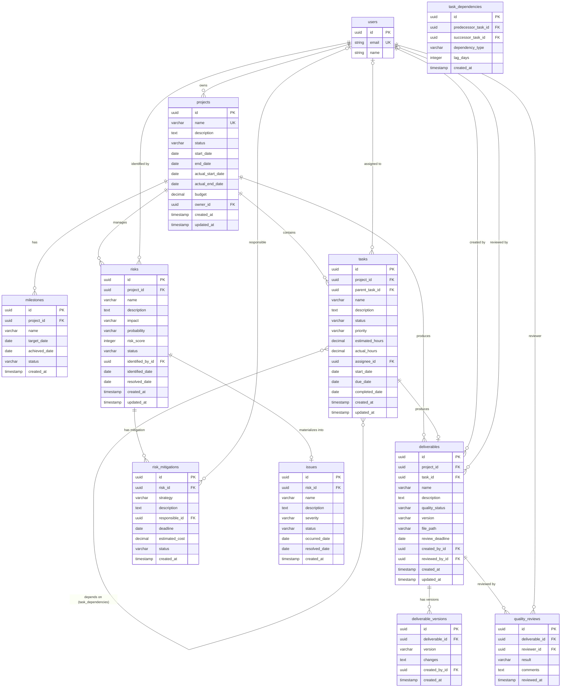

# BC-001: データ設計

**BC**: Project Delivery & Quality Management
**作成日**: 2025-10-31
**更新日**: 2025-10-31（Issue #192対応）
**V2移行元**: services/project-success-service/database-design.md

---

## 📋 概要

このドキュメントは、BC-001（プロジェクト配信と品質管理）のデータモデルとデータベース設計を定義します。

**データ設計の原則**:
- 正規化（第3正規形）を基本とし、パフォーマンスが必要な箇所のみ非正規化
- 集約境界に沿ったトランザクション管理
- 監査証跡の記録（作成日時、更新日時、変更者）
- ソフトデリート（論理削除）の採用

**対応RDBMS**: PostgreSQL 14+

---

## 🗺️ 全体ERダイアグラム



---

## 📊 テーブル定義

### 1. projects {#table-projects}
プロジェクトマスタ

#### カラム定義

| カラム | 型 | 制約 | デフォルト | 説明 |
|--------|-----|------|-----------|------|
| id | UUID | PK, NOT NULL | uuid_generate_v4() | プロジェクトID |
| name | VARCHAR(200) | NOT NULL, UNIQUE | | プロジェクト名 |
| description | TEXT | | | プロジェクト説明 |
| status | VARCHAR(20) | NOT NULL | 'planning' | 状態（planning/executing/completed/cancelled） |
| start_date | DATE | NOT NULL | | 計画開始日 |
| end_date | DATE | NOT NULL | | 計画終了日 |
| actual_start_date | DATE | | | 実績開始日 |
| actual_end_date | DATE | | | 実績終了日 |
| budget | DECIMAL(15,2) | | | 予算（通貨単位） |
| owner_id | UUID | FK → users.id, NOT NULL | | プロジェクトオーナー |
| created_at | TIMESTAMP | NOT NULL | CURRENT_TIMESTAMP | 作成日時 |
| updated_at | TIMESTAMP | NOT NULL | CURRENT_TIMESTAMP | 更新日時 |

#### インデックス

```sql
-- プライマリキー
CREATE INDEX idx_projects_pk ON projects(id);

-- ステータスによる検索（頻繁に使用）
CREATE INDEX idx_projects_status ON projects(status) WHERE status IN ('planning', 'executing');

-- オーナーによる検索
CREATE INDEX idx_projects_owner ON projects(owner_id);

-- 日付範囲検索（ダッシュボード表示用）
CREATE INDEX idx_projects_dates ON projects(start_date, end_date);

-- 名前による検索（オートコンプリート用）
CREATE INDEX idx_projects_name_gin ON projects USING gin(name gin_trgm_ops);
```

#### 制約

```sql
-- プロジェクト名の一意性
ALTER TABLE projects ADD CONSTRAINT uq_projects_name UNIQUE (name);

-- 日付整合性：終了日 >= 開始日
ALTER TABLE projects ADD CONSTRAINT chk_projects_dates
  CHECK (end_date >= start_date);

-- 実績日付整合性：実績終了日 >= 実績開始日
ALTER TABLE projects ADD CONSTRAINT chk_projects_actual_dates
  CHECK (actual_end_date IS NULL OR actual_start_date IS NULL OR actual_end_date >= actual_start_date);

-- 予算は正の値
ALTER TABLE projects ADD CONSTRAINT chk_projects_budget
  CHECK (budget IS NULL OR budget >= 0);

-- ステータス値の制限
ALTER TABLE projects ADD CONSTRAINT chk_projects_status
  CHECK (status IN ('planning', 'executing', 'completed', 'cancelled'));
```

#### トリガー

```sql
-- 更新日時自動更新トリガー
CREATE TRIGGER trg_projects_updated_at
BEFORE UPDATE ON projects
FOR EACH ROW
EXECUTE FUNCTION update_updated_at_column();

-- 監査ログ記録トリガー
CREATE TRIGGER trg_projects_audit
AFTER INSERT OR UPDATE OR DELETE ON projects
FOR EACH ROW
EXECUTE FUNCTION log_audit_trail('projects');
```

---

### 2. milestones {#table-milestones}
マイルストーン

#### カラム定義

| カラム | 型 | 制約 | デフォルト | 説明 |
|--------|-----|------|-----------|------|
| id | UUID | PK, NOT NULL | uuid_generate_v4() | マイルストーンID |
| project_id | UUID | FK → projects.id, NOT NULL | | 所属プロジェクト |
| name | VARCHAR(200) | NOT NULL | | マイルストーン名 |
| target_date | DATE | NOT NULL | | 目標達成日 |
| achieved_date | DATE | | | 実際の達成日 |
| status | VARCHAR(20) | NOT NULL | 'pending' | 状態（pending/achieved/missed） |
| created_at | TIMESTAMP | NOT NULL | CURRENT_TIMESTAMP | 作成日時 |

#### インデックス

```sql
-- プロジェクト内のマイルストーン取得（最も頻繁）
CREATE INDEX idx_milestones_project ON milestones(project_id, target_date);

-- ステータスによる検索
CREATE INDEX idx_milestones_status ON milestones(status) WHERE status = 'pending';
```

#### 制約

```sql
-- プロジェクト内でマイルストーン名の一意性
ALTER TABLE milestones ADD CONSTRAINT uq_milestones_project_name
  UNIQUE (project_id, name);

-- ステータス値の制限
ALTER TABLE milestones ADD CONSTRAINT chk_milestones_status
  CHECK (status IN ('pending', 'achieved', 'missed'));

-- 達成日は目標日以降であることが望ましい（警告レベル）
-- Note: これはアプリケーションレベルで警告を出す
```

---

### 3. tasks {#table-tasks}
タスク

#### カラム定義

| カラム | 型 | 制約 | デフォルト | 説明 |
|--------|-----|------|-----------|------|
| id | UUID | PK, NOT NULL | uuid_generate_v4() | タスクID |
| project_id | UUID | FK → projects.id, NOT NULL | | 所属プロジェクト |
| parent_task_id | UUID | FK → tasks.id | | 親タスク（WBS階層） |
| name | VARCHAR(200) | NOT NULL | | タスク名 |
| description | TEXT | | | タスク説明 |
| status | VARCHAR(20) | NOT NULL | 'not_started' | 状態（not_started/in_progress/completed/on_hold） |
| priority | VARCHAR(10) | NOT NULL | 'medium' | 優先度（high/medium/low） |
| estimated_hours | DECIMAL(8,2) | NOT NULL | | 見積工数（時間） |
| actual_hours | DECIMAL(8,2) | NOT NULL | 0 | 実績工数（時間） |
| assignee_id | UUID | FK → users.id | | 担当者 |
| start_date | DATE | | | 計画開始日 |
| due_date | DATE | | | 完了期限 |
| completed_date | DATE | | | 実際の完了日 |
| created_at | TIMESTAMP | NOT NULL | CURRENT_TIMESTAMP | 作成日時 |
| updated_at | TIMESTAMP | NOT NULL | CURRENT_TIMESTAMP | 更新日時 |

#### インデックス

```sql
-- プロジェクト内のタスク取得（最も頻繁）
CREATE INDEX idx_tasks_project ON tasks(project_id, status);

-- 担当者によるタスク取得（マイタスク表示用）
CREATE INDEX idx_tasks_assignee ON tasks(assignee_id, status) WHERE status IN ('not_started', 'in_progress');

-- 期限による検索（期限切れタスク検出用）
CREATE INDEX idx_tasks_due_date ON tasks(due_date) WHERE status NOT IN ('completed') AND due_date IS NOT NULL;

-- WBS階層（親子関係）
CREATE INDEX idx_tasks_parent ON tasks(parent_task_id) WHERE parent_task_id IS NOT NULL;

-- タスク名による検索
CREATE INDEX idx_tasks_name_gin ON tasks USING gin(name gin_trgm_ops);
```

#### 制約

```sql
-- 見積工数は正の値
ALTER TABLE tasks ADD CONSTRAINT chk_tasks_estimated_hours
  CHECK (estimated_hours > 0);

-- 実績工数は非負
ALTER TABLE tasks ADD CONSTRAINT chk_tasks_actual_hours
  CHECK (actual_hours >= 0);

-- ステータス値の制限
ALTER TABLE tasks ADD CONSTRAINT chk_tasks_status
  CHECK (status IN ('not_started', 'in_progress', 'completed', 'on_hold'));

-- 優先度値の制限
ALTER TABLE tasks ADD CONSTRAINT chk_tasks_priority
  CHECK (priority IN ('high', 'medium', 'low'));

-- 完了日は開始日以降
ALTER TABLE tasks ADD CONSTRAINT chk_tasks_completed_date
  CHECK (completed_date IS NULL OR start_date IS NULL OR completed_date >= start_date);

-- 自己参照禁止（親タスク = 自分自身は不可）
ALTER TABLE tasks ADD CONSTRAINT chk_tasks_no_self_parent
  CHECK (id != parent_task_id);
```

#### トリガー

```sql
-- 更新日時自動更新
CREATE TRIGGER trg_tasks_updated_at
BEFORE UPDATE ON tasks
FOR EACH ROW
EXECUTE FUNCTION update_updated_at_column();

-- ステータス遷移チェック（ビジネスルール適用）
CREATE TRIGGER trg_tasks_status_transition
BEFORE UPDATE ON tasks
FOR EACH ROW
WHEN (OLD.status IS DISTINCT FROM NEW.status)
EXECUTE FUNCTION validate_task_status_transition();

-- 完了時に完了日を自動設定
CREATE TRIGGER trg_tasks_set_completed_date
BEFORE UPDATE ON tasks
FOR EACH ROW
WHEN (NEW.status = 'completed' AND OLD.status != 'completed')
EXECUTE FUNCTION set_task_completed_date();
```

---

### 4. task_dependencies {#table-task-dependencies}
タスク依存関係

#### カラム定義

| カラム | 型 | 制約 | デフォルト | 説明 |
|--------|-----|------|-----------|------|
| id | UUID | PK, NOT NULL | uuid_generate_v4() | 依存関係ID |
| predecessor_task_id | UUID | FK → tasks.id, NOT NULL | | 先行タスク |
| successor_task_id | UUID | FK → tasks.id, NOT NULL | | 後続タスク |
| dependency_type | VARCHAR(10) | NOT NULL | 'FS' | 依存タイプ（FS/SS/FF/SF） |
| lag_days | INTEGER | NOT NULL | 0 | ラグ日数（負の値可） |
| created_at | TIMESTAMP | NOT NULL | CURRENT_TIMESTAMP | 作成日時 |

#### インデックス

```sql
-- 後続タスクの先行タスク検索（依存関係チェック用）
CREATE INDEX idx_task_deps_successor ON task_dependencies(successor_task_id);

-- 先行タスクの後続タスク検索
CREATE INDEX idx_task_deps_predecessor ON task_dependencies(predecessor_task_id);

-- 複合インデックス（循環依存検出用）
CREATE INDEX idx_task_deps_both ON task_dependencies(predecessor_task_id, successor_task_id);
```

#### 制約

```sql
-- 同じ依存関係の重複禁止
ALTER TABLE task_dependencies ADD CONSTRAINT uq_task_deps
  UNIQUE (predecessor_task_id, successor_task_id);

-- 自己依存禁止
ALTER TABLE task_dependencies ADD CONSTRAINT chk_task_deps_no_self
  CHECK (predecessor_task_id != successor_task_id);

-- 依存タイプ値の制限
ALTER TABLE task_dependencies ADD CONSTRAINT chk_task_deps_type
  CHECK (dependency_type IN ('FS', 'SS', 'FF', 'SF'));
```

#### トリガー

```sql
-- 循環依存チェックトリガー
CREATE TRIGGER trg_task_deps_circular_check
BEFORE INSERT OR UPDATE ON task_dependencies
FOR EACH ROW
EXECUTE FUNCTION check_circular_dependency();
```

---

### 5. deliverables {#table-deliverables}
成果物

#### カラム定義

| カラム | 型 | 制約 | デフォルト | 説明 |
|--------|-----|------|-----------|------|
| id | UUID | PK, NOT NULL | uuid_generate_v4() | 成果物ID |
| project_id | UUID | FK → projects.id, NOT NULL | | 所属プロジェクト |
| task_id | UUID | FK → tasks.id | | 関連タスク |
| name | VARCHAR(200) | NOT NULL | | 成果物名 |
| description | TEXT | | | 説明 |
| quality_status | VARCHAR(20) | NOT NULL | 'not_reviewed' | 品質状態（not_reviewed/in_review/approved/rejected） |
| version | VARCHAR(20) | NOT NULL | | バージョン（SemVer） |
| file_path | VARCHAR(500) | | | ファイル保存パス |
| review_deadline | DATE | | | レビュー期限 |
| created_by_id | UUID | FK → users.id, NOT NULL | | 作成者 |
| reviewed_by_id | UUID | FK → users.id | | レビュー担当者 |
| created_at | TIMESTAMP | NOT NULL | CURRENT_TIMESTAMP | 作成日時 |
| updated_at | TIMESTAMP | NOT NULL | CURRENT_TIMESTAMP | 更新日時 |

#### インデックス

```sql
-- プロジェクト内の成果物取得
CREATE INDEX idx_deliverables_project ON deliverables(project_id, quality_status);

-- タスクに紐づく成果物
CREATE INDEX idx_deliverables_task ON deliverables(task_id) WHERE task_id IS NOT NULL;

-- レビュー待ち成果物（ダッシュボード用）
CREATE INDEX idx_deliverables_review_pending ON deliverables(reviewed_by_id, review_deadline)
  WHERE quality_status = 'in_review';

-- 成果物名検索
CREATE INDEX idx_deliverables_name_gin ON deliverables USING gin(name gin_trgm_ops);
```

#### 制約

```sql
-- プロジェクト内で成果物名+バージョンの一意性
ALTER TABLE deliverables ADD CONSTRAINT uq_deliverables_project_name_version
  UNIQUE (project_id, name, version);

-- 品質ステータス値の制限
ALTER TABLE deliverables ADD CONSTRAINT chk_deliverables_quality_status
  CHECK (quality_status IN ('not_reviewed', 'in_review', 'approved', 'rejected'));

-- レビュー期限は作成日以降
ALTER TABLE deliverables ADD CONSTRAINT chk_deliverables_review_deadline
  CHECK (review_deadline IS NULL OR review_deadline >= CAST(created_at AS DATE));

-- バージョンはSemVer形式（基本チェック）
ALTER TABLE deliverables ADD CONSTRAINT chk_deliverables_version_format
  CHECK (version ~ '^\d+\.\d+\.\d+$');
```

#### トリガー

```sql
-- 更新日時自動更新
CREATE TRIGGER trg_deliverables_updated_at
BEFORE UPDATE ON deliverables
FOR EACH ROW
EXECUTE FUNCTION update_updated_at_column();

-- ステータス遷移チェック
CREATE TRIGGER trg_deliverables_status_transition
BEFORE UPDATE ON deliverables
FOR EACH ROW
WHEN (OLD.quality_status IS DISTINCT FROM NEW.quality_status)
EXECUTE FUNCTION validate_deliverable_status_transition();
```

---

### 6. deliverable_versions {#table-deliverable-versions}
成果物バージョン履歴

#### カラム定義

| カラム | 型 | 制約 | デフォルト | 説明 |
|--------|-----|------|-----------|------|
| id | UUID | PK, NOT NULL | uuid_generate_v4() | バージョンID |
| deliverable_id | UUID | FK → deliverables.id, NOT NULL | | 成果物ID |
| version | VARCHAR(20) | NOT NULL | | バージョン番号 |
| changes | TEXT | | | 変更内容 |
| created_by_id | UUID | FK → users.id, NOT NULL | | 作成者 |
| created_at | TIMESTAMP | NOT NULL | CURRENT_TIMESTAMP | 作成日時 |

#### インデックス

```sql
-- 成果物のバージョン履歴取得
CREATE INDEX idx_deliverable_versions_deliverable ON deliverable_versions(deliverable_id, created_at DESC);
```

#### 制約

```sql
-- 成果物内でバージョン番号の一意性
ALTER TABLE deliverable_versions ADD CONSTRAINT uq_deliverable_versions_version
  UNIQUE (deliverable_id, version);
```

---

### 7. quality_reviews {#table-quality-reviews}
品質レビュー記録

#### カラム定義

| カラム | 型 | 制約 | デフォルト | 説明 |
|--------|-----|------|-----------|------|
| id | UUID | PK, NOT NULL | uuid_generate_v4() | レビューID |
| deliverable_id | UUID | FK → deliverables.id, NOT NULL | | 成果物ID |
| reviewer_id | UUID | FK → users.id, NOT NULL | | レビュアー |
| result | VARCHAR(20) | NOT NULL | | レビュー結果（approved/rejected） |
| comments | TEXT | | | レビューコメント |
| reviewed_at | TIMESTAMP | NOT NULL | CURRENT_TIMESTAMP | レビュー日時 |

#### インデックス

```sql
-- 成果物のレビュー履歴
CREATE INDEX idx_quality_reviews_deliverable ON quality_reviews(deliverable_id, reviewed_at DESC);

-- レビュアーのレビュー履歴
CREATE INDEX idx_quality_reviews_reviewer ON quality_reviews(reviewer_id, reviewed_at DESC);
```

#### 制約

```sql
-- レビュー結果値の制限
ALTER TABLE quality_reviews ADD CONSTRAINT chk_quality_reviews_result
  CHECK (result IN ('approved', 'rejected'));

-- 差戻し時はコメント必須
ALTER TABLE quality_reviews ADD CONSTRAINT chk_quality_reviews_reject_comment
  CHECK (result != 'rejected' OR (comments IS NOT NULL AND length(comments) > 0));
```

---

### 8. risks {#table-risks}
リスク

#### カラム定義

| カラム | 型 | 制約 | デフォルト | 説明 |
|--------|-----|------|-----------|------|
| id | UUID | PK, NOT NULL | uuid_generate_v4() | リスクID |
| project_id | UUID | FK → projects.id, NOT NULL | | 所属プロジェクト |
| name | VARCHAR(200) | NOT NULL | | リスク名 |
| description | TEXT | NOT NULL | | リスク説明 |
| impact | VARCHAR(10) | NOT NULL | | 影響度（high/medium/low） |
| probability | VARCHAR(10) | NOT NULL | | 発生確率（high/medium/low） |
| risk_score | INTEGER | NOT NULL | | リスクスコア（1-9） |
| status | VARCHAR(20) | NOT NULL | 'identified' | 状態（identified/assessed/in_mitigation/resolved/materialized） |
| identified_by_id | UUID | FK → users.id, NOT NULL | | 識別者 |
| identified_date | DATE | NOT NULL | | 識別日 |
| resolved_date | DATE | | | 解決日 |
| created_at | TIMESTAMP | NOT NULL | CURRENT_TIMESTAMP | 作成日時 |
| updated_at | TIMESTAMP | NOT NULL | CURRENT_TIMESTAMP | 更新日時 |

#### インデックス

```sql
-- プロジェクトのリスク一覧（重要度順）
CREATE INDEX idx_risks_project ON risks(project_id, risk_score DESC, status);

-- 重大リスクの検出（アラート用）
CREATE INDEX idx_risks_critical ON risks(project_id, risk_score)
  WHERE risk_score >= 6 AND status NOT IN ('resolved', 'materialized');

-- ステータスによる検索
CREATE INDEX idx_risks_status ON risks(status) WHERE status IN ('identified', 'assessed', 'in_mitigation');
```

#### 制約

```sql
-- 影響度値の制限
ALTER TABLE risks ADD CONSTRAINT chk_risks_impact
  CHECK (impact IN ('high', 'medium', 'low'));

-- 発生確率値の制限
ALTER TABLE risks ADD CONSTRAINT chk_risks_probability
  CHECK (probability IN ('high', 'medium', 'low'));

-- リスクスコア範囲（1-9）
ALTER TABLE risks ADD CONSTRAINT chk_risks_score
  CHECK (risk_score BETWEEN 1 AND 9);

-- ステータス値の制限
ALTER TABLE risks ADD CONSTRAINT chk_risks_status
  CHECK (status IN ('identified', 'assessed', 'in_mitigation', 'resolved', 'materialized'));

-- 解決日は識別日以降
ALTER TABLE risks ADD CONSTRAINT chk_risks_resolved_date
  CHECK (resolved_date IS NULL OR resolved_date >= identified_date);
```

#### トリガー

```sql
-- 更新日時自動更新
CREATE TRIGGER trg_risks_updated_at
BEFORE UPDATE ON risks
FOR EACH ROW
EXECUTE FUNCTION update_updated_at_column();

-- リスクスコア自動計算
CREATE TRIGGER trg_risks_calculate_score
BEFORE INSERT OR UPDATE ON risks
FOR EACH ROW
WHEN (NEW.impact IS NOT NULL AND NEW.probability IS NOT NULL)
EXECUTE FUNCTION calculate_risk_score();

-- 重大リスク検出時の通知
CREATE TRIGGER trg_risks_critical_alert
AFTER INSERT OR UPDATE ON risks
FOR EACH ROW
WHEN (NEW.risk_score = 9)
EXECUTE FUNCTION notify_critical_risk();
```

---

### 9. risk_mitigations {#table-risk-mitigations}
リスク対応策

#### カラム定義

| カラム | 型 | 制約 | デフォルト | 説明 |
|--------|-----|------|-----------|------|
| id | UUID | PK, NOT NULL | uuid_generate_v4() | 対応策ID |
| risk_id | UUID | FK → risks.id, NOT NULL | | リスクID |
| strategy | VARCHAR(50) | NOT NULL | | 戦略（回避/軽減/転嫁/受容） |
| description | TEXT | NOT NULL | | 対応策詳細 |
| responsible_id | UUID | FK → users.id | | 責任者 |
| deadline | DATE | NOT NULL | | 実行期限 |
| estimated_cost | DECIMAL(12,2) | | | 見積コスト |
| status | VARCHAR(20) | NOT NULL | 'planned' | 状態（planned/in_progress/completed/cancelled） |
| created_at | TIMESTAMP | NOT NULL | CURRENT_TIMESTAMP | 作成日時 |

#### インデックス

```sql
-- リスクの対応策一覧
CREATE INDEX idx_risk_mitigations_risk ON risk_mitigations(risk_id);

-- 責任者の対応策一覧
CREATE INDEX idx_risk_mitigations_responsible ON risk_mitigations(responsible_id, deadline)
  WHERE status IN ('planned', 'in_progress');

-- 期限超過対応策の検出
CREATE INDEX idx_risk_mitigations_overdue ON risk_mitigations(deadline)
  WHERE status != 'completed' AND status != 'cancelled';
```

#### 制約

```sql
-- 戦略値の制限
ALTER TABLE risk_mitigations ADD CONSTRAINT chk_risk_mitigations_strategy
  CHECK (strategy IN ('回避', '軽減', '転嫁', '受容', 'avoid', 'mitigate', 'transfer', 'accept'));

-- ステータス値の制限
ALTER TABLE risk_mitigations ADD CONSTRAINT chk_risk_mitigations_status
  CHECK (status IN ('planned', 'in_progress', 'completed', 'cancelled'));

-- 期限は現在日以降
ALTER TABLE risk_mitigations ADD CONSTRAINT chk_risk_mitigations_deadline
  CHECK (deadline >= CAST(created_at AS DATE));

-- 見積コストは非負
ALTER TABLE risk_mitigations ADD CONSTRAINT chk_risk_mitigations_cost
  CHECK (estimated_cost IS NULL OR estimated_cost >= 0);
```

---

### 10. issues {#table-issues}
課題（リスクが発現したもの）

#### カラム定義

| カラム | 型 | 制約 | デフォルト | 説明 |
|--------|-----|------|-----------|------|
| id | UUID | PK, NOT NULL | uuid_generate_v4() | 課題ID |
| risk_id | UUID | FK → risks.id, NOT NULL | | 発現元リスク |
| name | VARCHAR(200) | NOT NULL | | 課題名 |
| description | TEXT | NOT NULL | | 課題説明 |
| severity | VARCHAR(10) | NOT NULL | | 深刻度（critical/high/medium/low） |
| status | VARCHAR(20) | NOT NULL | 'open' | 状態（open/in_progress/resolved/closed） |
| occurred_date | DATE | NOT NULL | | 発生日 |
| resolved_date | DATE | | | 解決日 |
| created_at | TIMESTAMP | NOT NULL | CURRENT_TIMESTAMP | 作成日時 |

#### インデックス

```sql
-- プロジェクト配下の課題（risk経由）
CREATE INDEX idx_issues_risk ON issues(risk_id);

-- 未解決課題の検出
CREATE INDEX idx_issues_open ON issues(status, severity DESC)
  WHERE status IN ('open', 'in_progress');
```

#### 制約

```sql
-- 深刻度値の制限
ALTER TABLE issues ADD CONSTRAINT chk_issues_severity
  CHECK (severity IN ('critical', 'high', 'medium', 'low'));

-- ステータス値の制限
ALTER TABLE issues ADD CONSTRAINT chk_issues_status
  CHECK (status IN ('open', 'in_progress', 'resolved', 'closed'));

-- 解決日は発生日以降
ALTER TABLE issues ADD CONSTRAINT chk_issues_resolved_date
  CHECK (resolved_date IS NULL OR resolved_date >= occurred_date);
```

---

## 🔍 データアクセスパターン

### よく使われるクエリパターン

#### 1. プロジェクトダッシュボード取得
```sql
SELECT
  p.id, p.name, p.status, p.start_date, p.end_date,
  COUNT(DISTINCT t.id) as total_tasks,
  COUNT(DISTINCT CASE WHEN t.status = 'completed' THEN t.id END) as completed_tasks,
  COUNT(DISTINCT d.id) as total_deliverables,
  COUNT(DISTINCT CASE WHEN d.quality_status = 'approved' THEN d.id END) as approved_deliverables,
  COUNT(DISTINCT r.id) as total_risks,
  COUNT(DISTINCT CASE WHEN r.risk_score >= 6 THEN r.id END) as high_risks
FROM projects p
LEFT JOIN tasks t ON t.project_id = p.id
LEFT JOIN deliverables d ON d.project_id = p.id
LEFT JOIN risks r ON r.project_id = p.id AND r.status NOT IN ('resolved', 'materialized')
WHERE p.owner_id = $1 AND p.status IN ('planning', 'executing')
GROUP BY p.id, p.name, p.status, p.start_date, p.end_date
ORDER BY p.start_date DESC;
```

#### 2. マイタスク一覧（担当者別）
```sql
SELECT
  t.id, t.name, t.status, t.priority, t.due_date, t.estimated_hours, t.actual_hours,
  p.name as project_name,
  CASE
    WHEN t.due_date < CURRENT_DATE AND t.status != 'completed' THEN true
    ELSE false
  END as is_overdue
FROM tasks t
INNER JOIN projects p ON p.id = t.project_id
WHERE t.assignee_id = $1
  AND t.status IN ('not_started', 'in_progress')
ORDER BY
  t.priority DESC,
  t.due_date ASC NULLS LAST;
```

#### 3. クリティカルパス算出
```sql
WITH RECURSIVE task_path AS (
  -- 開始タスク（依存関係のないタスク）
  SELECT t.id, t.name, t.estimated_hours,
         0 as path_length,
         ARRAY[t.id] as path,
         t.estimated_hours as total_hours
  FROM tasks t
  WHERE t.project_id = $1
    AND NOT EXISTS (
      SELECT 1 FROM task_dependencies td
      WHERE td.successor_task_id = t.id
    )

  UNION ALL

  -- 再帰：後続タスクを辿る
  SELECT t.id, t.name, t.estimated_hours,
         tp.path_length + 1,
         tp.path || t.id,
         tp.total_hours + t.estimated_hours
  FROM task_path tp
  INNER JOIN task_dependencies td ON td.predecessor_task_id = tp.id
  INNER JOIN tasks t ON t.id = td.successor_task_id
  WHERE t.id != ALL(tp.path) -- 循環回避
)
SELECT * FROM task_path
WHERE path_length = (SELECT MAX(path_length) FROM task_path)
ORDER BY total_hours DESC
LIMIT 1;
```

---

## 🎯 パフォーマンス最適化戦略

### 1. インデックス戦略

#### B-tree インデックス（デフォルト）
- **用途**: 等価検索、範囲検索、ソート
- **適用カラム**: status, dates, foreign keys

#### GIN インデックス（全文検索）
- **用途**: LIKE検索、全文検索（pg_trgm拡張使用）
- **適用カラム**: name, description

```sql
-- pg_trgm拡張を有効化
CREATE EXTENSION IF NOT EXISTS pg_trgm;

-- GINインデックスの作成例
CREATE INDEX idx_projects_name_gin ON projects USING gin(name gin_trgm_ops);
CREATE INDEX idx_tasks_name_gin ON tasks USING gin(name gin_trgm_ops);
```

### 2. パーティショニング

#### 時系列データのパーティショニング（将来実装予定）
```sql
-- projectsテーブルを年ごとにパーティショニング
CREATE TABLE projects_partitioned (
  LIKE projects INCLUDING ALL
) PARTITION BY RANGE (created_at);

CREATE TABLE projects_2025 PARTITION OF projects_partitioned
  FOR VALUES FROM ('2025-01-01') TO ('2026-01-01');

CREATE TABLE projects_2026 PARTITION OF projects_partitioned
  FOR VALUES FROM ('2026-01-01') TO ('2027-01-01');
```

### 3. クエリ最適化

#### EXPLAINの活用
```sql
-- クエリプランの確認
EXPLAIN (ANALYZE, BUFFERS)
SELECT * FROM projects WHERE status = 'executing';
```

#### 適切なJOIN順序
- 小さいテーブルから大きいテーブルへJOIN
- WHERE句でフィルタリングしてからJOIN

---

## 🔄 データ移行戦略

### V2からV3への移行

#### マッピング

| V2テーブル | V3テーブル | 変更内容 |
|-----------|-----------|---------|
| project_success.projects | projects | カラム名変更: owner → owner_id |
| project_success.tasks | tasks | カラム追加: parent_task_id (WBS階層) |
| project_success.deliverables | deliverables | ステータス値変更: quality_status枚挙型 |
| project_success.risks | risks | カラム追加: risk_score（計算値） |

#### 移行スクリプト例

```sql
-- プロジェクトの移行
INSERT INTO projects (id, name, description, status, start_date, end_date, owner_id, created_at, updated_at)
SELECT
  id,
  name,
  description,
  CASE
    WHEN v2_status = 'PLANNING' THEN 'planning'
    WHEN v2_status = 'EXECUTING' THEN 'executing'
    WHEN v2_status = 'COMPLETED' THEN 'completed'
    WHEN v2_status = 'CANCELLED' THEN 'cancelled'
  END as status,
  start_date,
  end_date,
  owner,
  created_at,
  updated_at
FROM v2_schema.project_success_projects
WHERE deleted_at IS NULL;

-- タスクの移行（WBS階層構築）
WITH task_hierarchy AS (
  SELECT
    id,
    name,
    -- V2のwbs_codeからparent_task_idを推測
    CASE
      WHEN wbs_code LIKE '%.%.%' THEN
        (SELECT id FROM v2_schema.tasks WHERE wbs_code = substring(NEW.wbs_code FROM '^[^.]+\.[^.]+'))
      WHEN wbs_code LIKE '%.%' THEN
        (SELECT id FROM v2_schema.tasks WHERE wbs_code = substring(NEW.wbs_code FROM '^[^.]+'))
      ELSE NULL
    END as parent_task_id
  FROM v2_schema.project_success_tasks
)
INSERT INTO tasks (id, project_id, parent_task_id, name, ...)
SELECT * FROM task_hierarchy;
```

---

## 💾 バックアップ・リカバリ

### バックアップ戦略

#### 1. フルバックアップ（日次）
```bash
# PostgreSQL pg_dump
pg_dump -h localhost -U postgres -d parasol_db -F c -f /backups/parasol_full_$(date +%Y%m%d).dump
```

#### 2. 増分バックアップ（1時間ごと）
```bash
# WAL（Write-Ahead Log）アーカイブ
archive_command = 'test ! -f /var/lib/postgresql/wal_archive/%f && cp %p /var/lib/postgresql/wal_archive/%f'
```

#### 3. スナップショット（本番環境）
- **頻度**: 6時間ごと
- **保持期間**: 7日間
- **クラウドストレージ**: AWS S3 / GCS

### リカバリ手順

#### Point-in-Time Recovery (PITR)
```bash
# 特定時点への復旧
pg_restore -h localhost -U postgres -d parasol_db -C /backups/parasol_full_20251101.dump

# WALログを適用して特定時点まで復旧
recovery_target_time = '2025-11-01 14:30:00'
```

### RPO/RTO目標

| メトリクス | 目標 | 説明 |
|----------|------|------|
| **RPO** (Recovery Point Objective) | 1時間 | データ損失許容時間 |
| **RTO** (Recovery Time Objective) | 4時間 | システム復旧目標時間 |

---

## 📚 関連ドキュメント

### BC-001内部参照
- [../domain/README.md](../domain/README.md) - ドメインモデル（集約、エンティティ、値オブジェクト）
- [../api/README.md](../api/README.md) - API設計（エンドポイント、スキーマ、エラーコード）

### データベース設計原則
- **正規化**: 第3正規形（3NF）を基本
- **集約境界**: ドメインモデルの集約に沿ったトランザクション管理
- **監査証跡**: created_at, updated_at の記録
- **ソフトデリート**: deleted_at カラムによる論理削除（将来実装予定）

---

## 📝 V2からの移行メモ

### 移行完了項目
- ✅ 全10テーブルの定義
- ✅ インデックス戦略の策定
- ✅ 制約・トリガーの定義
- ✅ **Issue #192対応**: ERダイアグラム、詳細制約、インデックス戦略、パフォーマンス最適化、バックアップ戦略を追加

### V2からの主な改善点
1. **ERダイアグラム追加**: Mermaid形式で全体像を可視化
2. **制約の体系化**: CHECK制約、UNIQUE制約を明確化
3. **トリガーの定義**: ビジネスルール適用、監査ログ記録
4. **インデックス最適化**: B-tree、GIN、パーティショニング戦略
5. **データアクセスパターン**: 頻出クエリのSQL例を提供
6. **バックアップ戦略**: RPO/RTO目標の明確化

### 今後の拡張予定
- 🟡 パーティショニングの実装（年ごと）
- 🟡 マテリアライズドビューの追加（レポート用）
- 🟡 ソフトデリート（deleted_at）の実装

---

**ステータス**: ✅ Issue #192 Phase 1.3 完了 - BC-001 data 詳細化完了
**次のアクション**: Phase 2 - 残り6 BCのdomain/api/data強化
