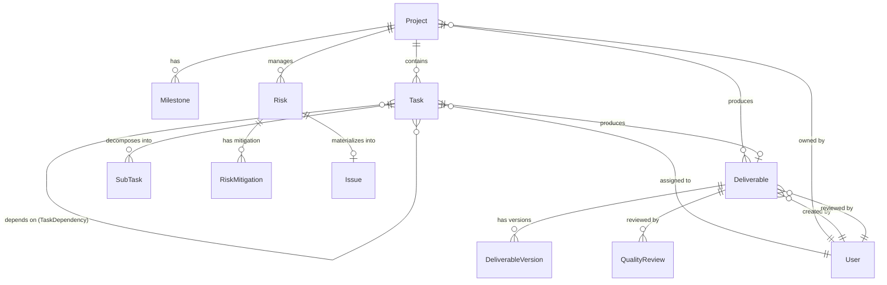
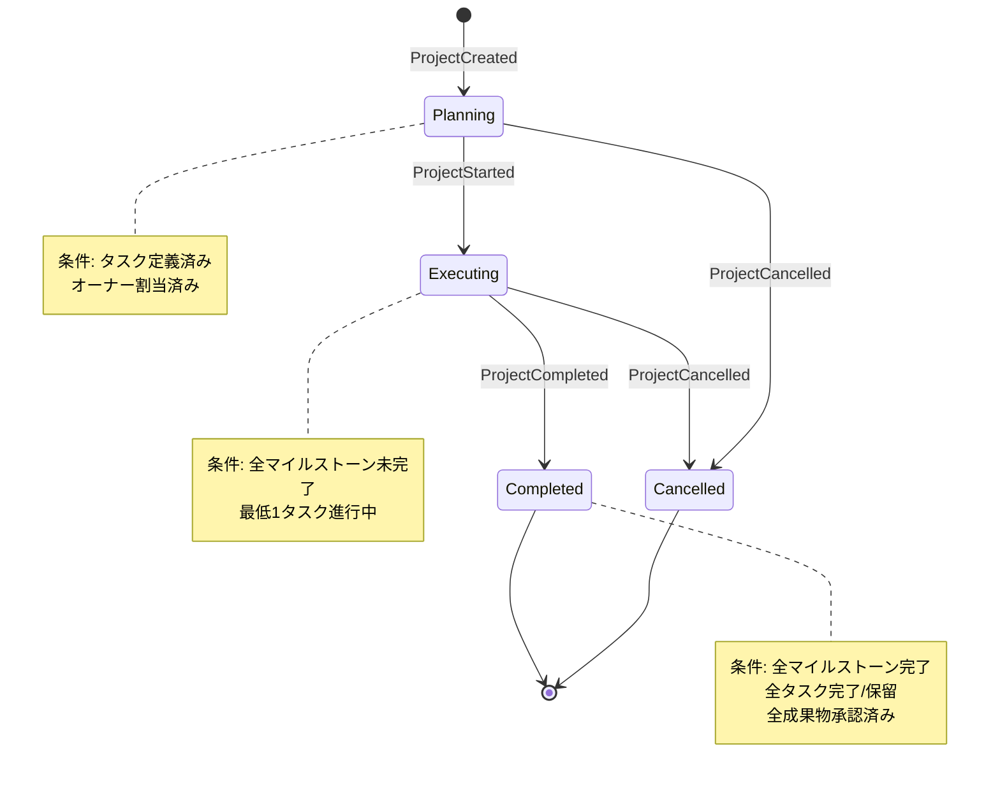
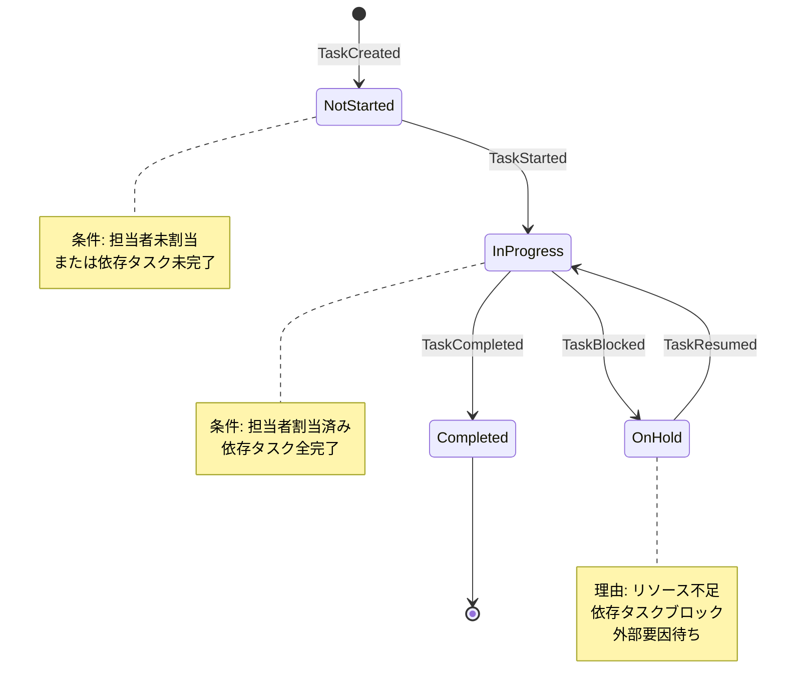
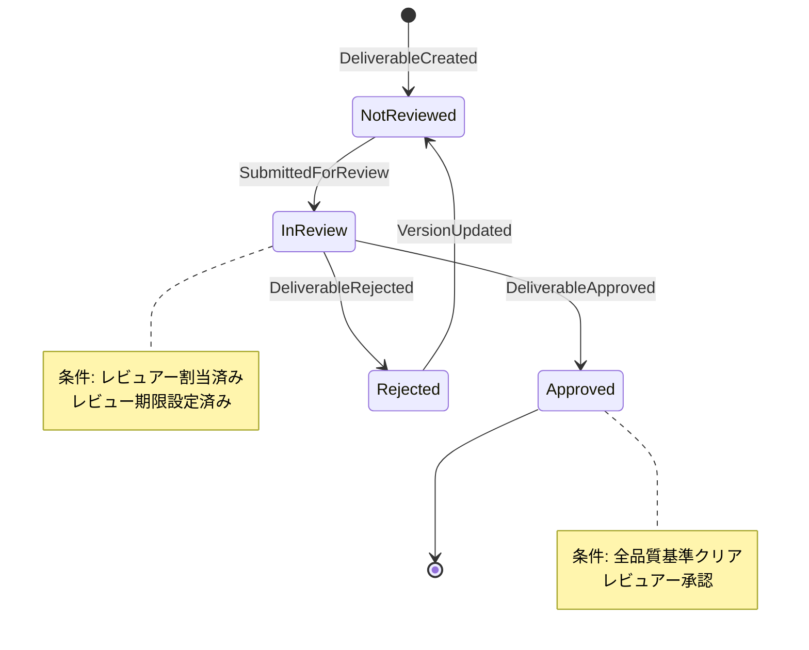
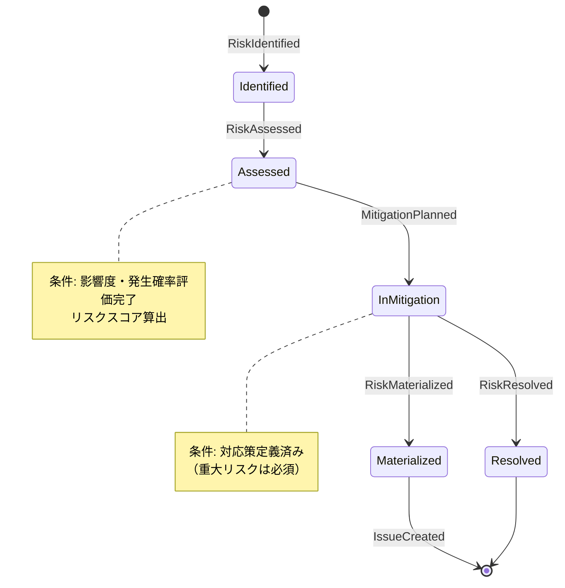

# BC-001: ドメイン設計

**BC**: Project Delivery & Quality Management
**作成日**: 2025-10-31
**更新日**: 2025-10-31（Issue #192対応）
**V2移行元**: services/project-success-service/domain-language.md

---

## 📋 概要

このドキュメントは、BC-001（プロジェクト配信と品質管理）のドメインモデルを定義します。プロジェクトのライフサイクル全体を通じた計画、実行、品質保証、リスク管理を実現するための中核的なビジネスロジックとルールを記述します。

**ドメインの範囲**:
- プロジェクトの計画・構造化（WBS、タスク分解、リソース配分）
- プロジェクト実行と進捗管理（マイルストーン、進捗追跡）
- タスクとワークアイテムの管理（依存関係、割当、実績記録）
- 成果物の品質保証（レビュー、承認、バージョン管理）
- リスクと課題の管理（識別、評価、対応、監視）

---

## 🏗️ 主要集約（Aggregates）

### 1. Project Aggregate {#project-aggregate}

**集約ルート**: Project [Project] [PROJECT]

#### 責務
- プロジェクトのライフサイクル全体を管理（計画→実行→完了）
- マイルストーンの達成状況を追跡
- プロジェクトスケジュールの整合性を保証
- プロジェクト完了条件の検証

#### 包含エンティティ
- **Project**（集約ルート）
- **Milestone**: プロジェクトの主要節目
- **ProjectSchedule**: プロジェクト全体のスケジュール情報

#### 不変条件（Invariants）
1. **マイルストーン完了制約**: 全マイルストーンが完了状態の時のみ、プロジェクトを完了状態に遷移可能
2. **スケジュール整合性**: プロジェクト終了日 ≥ 開始日
3. **ステータス遷移制約**:
   - 計画中 → 実行中 → 完了/中止
   - 逆方向の遷移は原則不可（例外: 実行中 → 計画中は管理者権限で可能）
4. **予算制約**: 予算が設定されている場合、budget > 0
5. **オーナー必須**: プロジェクトには必ずオーナー（責任者）が割り当てられている

#### ドメインイベント
- **ProjectCreated**: プロジェクトが作成された
  - ペイロード: `{ projectId, name, ownerId, startDate, endDate }`
  - サブスクライバ: BC-002（予算登録）, BC-005（リソース計画）

- **ProjectStarted**: プロジェクトが実行フェーズに移行した
  - ペイロード: `{ projectId, startedAt, startedBy }`
  - サブスクライバ: BC-007（通知サービス）, BC-006（知識ベース初期化）

- **MilestoneAchieved**: マイルストーンが達成された
  - ペイロード: `{ projectId, milestoneId, achievedAt }`
  - サブスクライバ: BC-007（ステークホルダー通知）

- **ProjectCompleted**: プロジェクトが完了した
  - ペイロード: `{ projectId, completedAt, finalStatus }`
  - サブスクライバ: BC-002（財務クローズ）, BC-006（教訓登録）, BC-005（リソース解放）

- **ProjectCancelled**: プロジェクトが中止された
  - ペイロード: `{ projectId, cancelledAt, reason }`
  - サブスクライバ: BC-002, BC-005, BC-007

#### ビジネスルール
- **プロジェクト完了条件**:
  1. 全タスクが完了 OR 保留状態
  2. 全成果物がレビュー承認済み OR レビュー不要
  3. 重大リスク（高影響度×高発生確率）が全て解決済み

- **プロジェクト開始条件**:
  1. 最低1つのタスクが定義されている
  2. プロジェクトオーナーが割り当てられている
  3. 開始日と終了日が設定されている

---

### 2. Task Aggregate {#task-aggregate}

**集約ルート**: Task [Task] [TASK]

#### 責務
- タスクの実行と進捗管理
- サブタスクの階層構造管理（WBS）
- タスク間依存関係の整合性保証
- 工数実績の記録

#### 包含エンティティ
- **Task**（集約ルート）
- **SubTask**: タスクの分解単位
- **TaskDependency**: タスク間の依存関係

#### 不変条件（Invariants）
1. **依存関係制約**: 先行タスクが完了していない場合、後続タスクは開始不可（ステータス: 未着手のまま）
2. **親子関係制約**:
   - 親タスクは全ての子タスクが完了した時のみ完了可能
   - 子タスクの見積工数合計 ≤ 親タスクの見積工数（警告レベル）
3. **工数整合性**: 実績工数 ≥ 0、見積工数 > 0
4. **循環依存禁止**: タスク依存関係グラフに循環（サイクル）を含まない
5. **プロジェクト所属**: タスクは必ず1つのプロジェクトに所属

#### ドメインイベント
- **TaskCreated**: タスクが作成された
  - ペイロード: `{ taskId, projectId, taskName, estimatedHours }`

- **TaskAssigned**: タスクが担当者に割り当てられた
  - ペイロード: `{ taskId, assigneeId, assignedAt }`
  - サブスクライバ: BC-007（担当者通知）, BC-005（リソース使用率更新）

- **TaskStarted**: タスクが開始された
  - ペイロード: `{ taskId, startedAt, assigneeId }`

- **TaskProgressUpdated**: タスクの進捗が更新された
  - ペイロード: `{ taskId, actualHours, progressPercentage }`

- **TaskCompleted**: タスクが完了した
  - ペイロード: `{ taskId, completedAt, actualHours }`
  - サブスクライバ: BC-002（コスト計上）, BC-005（リソース実績）

- **TaskBlocked**: タスクがブロックされた（依存タスク未完了など）
  - ペイロード: `{ taskId, blockedBy, reason }`
  - サブスクライバ: BC-007（アラート通知）

#### ビジネスルール
- **タスク開始条件**:
  1. 担当者が割り当てられている
  2. 全ての先行タスク（predecessors）が完了済み
  3. 必要なリソースが確保されている

- **タスク完了条件**:
  1. 実績工数が記録されている
  2. 関連する成果物が作成されている（該当する場合）

- **優先度自動調整**:
  - 期限まで3日以内 → 優先度を「高」に自動昇格
  - クリティカルパス上のタスク → 優先度「高」固定

---

### 3. Deliverable Aggregate {#deliverable-aggregate}

**集約ルート**: Deliverable [Deliverable] [DELIVERABLE]

#### 責務
- 成果物の品質保証
- バージョン管理とレビュー履歴の追跡
- 品質基準の適用と承認プロセス管理

#### 包含エンティティ
- **Deliverable**（集約ルート）
- **DeliverableVersion**: 成果物のバージョン履歴
- **QualityReview**: 品質レビュー記録

#### 不変条件（Invariants）
1. **レビュー承認制約**: レビュー承認済みの成果物のみ確定可能（status: approved）
2. **バージョン単調増加**: バージョン番号は単調増加（semantic versioning: major.minor.patch）
3. **レビュー期限制約**: レビュー期限 ≥ 作成日
4. **レビュアー必須**: 品質レビューには必ずレビュアーが割り当てられている
5. **差戻し理由必須**: 差戻しステータスには理由（コメント）が必須

#### ドメインイベント
- **DeliverableCreated**: 成果物が作成された
  - ペイロード: `{ deliverableId, projectId, taskId, name, version }`

- **DeliverableSubmittedForReview**: 成果物がレビュー提出された
  - ペイロード: `{ deliverableId, reviewerId, reviewDeadline }`
  - サブスクライバ: BC-007（レビュアー通知）

- **DeliverableApproved**: 成果物が承認された
  - ペイロード: `{ deliverableId, reviewerId, approvedAt, comments }`
  - サブスクライバ: BC-007（作成者通知）, BC-006（知識ベース登録）

- **DeliverableRejected**: 成果物が差戻された
  - ペイロード: `{ deliverableId, reviewerId, rejectedAt, reason }`
  - サブスクライバ: BC-007（作成者通知・改善依頼）

- **DeliverableVersionUpdated**: 新バージョンが作成された
  - ペイロード: `{ deliverableId, oldVersion, newVersion, changes }`

#### ビジネスルール
- **承認条件**:
  1. 品質基準（QualityCriteria）の全必須項目を満たす
  2. レビュアーによる明示的な承認
  3. レビュー期限内にレビュー完了

- **バージョニングルール**:
  - 差戻し後の修正 → patch番号をインクリメント
  - 機能追加・変更 → minor番号をインクリメント
  - 大規模変更・仕様変更 → major番号をインクリメント

---

### 4. Risk Aggregate {#risk-aggregate}

**集約ルート**: Risk [Risk] [RISK]

#### 責務
- リスクのライフサイクル管理（識別→評価→対応→監視→解決/発現）
- リスク影響度の評価と優先順位付け
- 対応策（Mitigation）の管理

#### 包含エンティティ
- **Risk**（集約ルート）
- **RiskMitigation**: リスク対応策
- **Issue**: リスクが発現した課題

#### 不変条件（Invariants）
1. **重大リスク対応必須**: 重大リスク（影響度: 高 かつ 発生確率: 高）には必ず対応策が定義されている
2. **発現時課題必須**: リスクが「発現」状態に遷移する際は、必ずIssueエンティティを作成
3. **影響度評価必須**: リスクは識別後24時間以内に影響度・発生確率を評価
4. **対応策実行期限**: 対応策には実行期限が設定されている

#### ドメインイベント
- **RiskIdentified**: リスクが識別された
  - ペイロード: `{ riskId, projectId, riskName, identifiedBy }`
  - サブスクライバ: BC-007（プロジェクトオーナー通知）

- **RiskAssessed**: リスクが評価された
  - ペイロード: `{ riskId, impact, probability, riskScore }`

- **CriticalRiskDetected**: 重大リスクが検出された
  - ペイロード: `{ riskId, impact: 'high', probability: 'high' }`
  - サブスクライバ: BC-007（緊急通知・エスカレーション）

- **RiskMitigationPlanned**: リスク対応策が計画された
  - ペイロード: `{ riskId, mitigationId, strategy, deadline }`

- **RiskMaterialized**: リスクが発現した
  - ペイロード: `{ riskId, issueId, materializedAt }`
  - サブスクライバ: BC-007（緊急対応通知）, BC-006（教訓記録）

- **RiskResolved**: リスクが解決された
  - ペイロード: `{ riskId, resolvedAt, resolution }`

#### ビジネスルール
- **リスクスコア計算**:
  ```
  RiskScore = Impact × Probability
  - 影響度: 高(3), 中(2), 低(1)
  - 発生確率: 高(3), 中(2), 低(1)
  - スコア 9: 重大リスク（即時対応）
  - スコア 6-8: 高リスク（7日以内に対応）
  - スコア 3-5: 中リスク（14日以内に対応）
  - スコア 1-2: 低リスク（監視のみ）
  ```

- **エスカレーション基準**:
  - 重大リスク（スコア9）→ プロジェクトオーナーとステークホルダーに即時通知
  - 対応策未実施で期限超過 → 上位管理者にエスカレーション

---

## 🔗 エンティティ間リレーションシップ

### リレーションシップ図



### リレーションシップ詳細

#### Project - Milestone（1:N）
- 1つのプロジェクトは複数のマイルストーンを持つ
- マイルストーンはプロジェクトに完全に依存（集約内エンティティ）

#### Project - Task（1:N）
- 1つのプロジェクトは複数のタスクを持つ
- タスクは独立した集約（別Aggregate）だが、必ず1つのプロジェクトに所属

#### Task - Task（N:N via TaskDependency）
- タスク間の依存関係（先行/後続）
- 依存タイプ: FS（Finish-to-Start）, SS（Start-to-Start）, FF（Finish-to-Finish）, SF（Start-to-Finish）

#### Task - Deliverable（1:0..1）
- 1つのタスクは0個または1個の成果物を生成
- 全てのタスクが成果物を持つわけではない（例: 調査タスク）

#### Deliverable - QualityReview（1:N）
- 成果物は複数回のレビューを受ける可能性がある（差戻し→修正→再レビュー）

#### Risk - Issue（1:0..1）
- リスクが発現した場合、1つのIssueエンティティが作成される
- 全てのリスクが発現するわけではない（対応策で回避される場合もある）

---

## 📦 主要エンティティ（Entities）

### Project [Project] [PROJECT] {#entity-project}
プロジェクト [Project] [PROJECT]

#### プロパティ
| プロパティ | Parasol言語 | 英語名 | 型 | 制約 | 説明 |
|-----------|------------|--------|-----|------|------|
| プロジェクトID | ProjectID | PROJECT_ID | UUID | PK, NOT NULL | 一意識別子 |
| プロジェクト名 | ProjectName | PROJECT_NAME | String(200) | NOT NULL, UNIQUE | プロジェクト名 |
| 説明 | Description | DESCRIPTION | Text | | プロジェクトの詳細説明 |
| 状態 | Status | STATUS | Enum | NOT NULL | planning/executing/completed/cancelled |
| 開始日 | StartDate | START_DATE | Date | NOT NULL | 計画開始日 |
| 終了日 | EndDate | END_DATE | Date | NOT NULL | 計画終了日 |
| 実績開始日 | ActualStartDate | ACTUAL_START_DATE | Date | | 実際の開始日 |
| 実績終了日 | ActualEndDate | ACTUAL_END_DATE | Date | | 実際の終了日 |
| 予算 | Budget | BUDGET | Decimal(15,2) | ≥ 0 | プロジェクト予算（通貨単位） |
| オーナーID | OwnerID | OWNER_ID | UUID | FK → User, NOT NULL | プロジェクト責任者 |
| 作成日時 | CreatedAt | CREATED_AT | Timestamp | NOT NULL | レコード作成日時 |
| 更新日時 | UpdatedAt | UPDATED_AT | Timestamp | NOT NULL | 最終更新日時 |

#### ライフサイクル
```
新規作成 → 計画中(planning) → 実行中(executing) → 完了(completed)
                                              ↘ 中止(cancelled)
```

---

### Task [Task] [TASK] {#entity-task}
タスク [Task] [TASK]

#### プロパティ
| プロパティ | Parasol言語 | 英語名 | 型 | 制約 | 説明 |
|-----------|------------|--------|-----|------|------|
| タスクID | TaskID | TASK_ID | UUID | PK, NOT NULL | 一意識別子 |
| プロジェクトID | ProjectID | PROJECT_ID | UUID | FK → Project, NOT NULL | 所属プロジェクト |
| 親タスクID | ParentTaskID | PARENT_TASK_ID | UUID | FK → Task | 親タスク（WBS階層） |
| タスク名 | TaskName | TASK_NAME | String(200) | NOT NULL | タスク名 |
| 説明 | Description | DESCRIPTION | Text | | タスクの詳細説明 |
| 状態 | Status | STATUS | Enum | NOT NULL | not_started/in_progress/completed/on_hold |
| 優先度 | Priority | PRIORITY | Enum | NOT NULL | high/medium/low |
| 見積工数 | EstimatedHours | ESTIMATED_HOURS | Decimal(8,2) | > 0 | 見積工数（時間） |
| 実績工数 | ActualHours | ACTUAL_HOURS | Decimal(8,2) | ≥ 0 | 実績工数（時間） |
| 担当者ID | AssigneeID | ASSIGNEE_ID | UUID | FK → User | 担当者 |
| 開始日 | StartDate | START_DATE | Date | | 計画開始日 |
| 期限 | DueDate | DUE_DATE | Date | | 完了期限 |
| 完了日 | CompletedDate | COMPLETED_DATE | Date | | 実際の完了日 |
| 作成日時 | CreatedAt | CREATED_AT | Timestamp | NOT NULL | レコード作成日時 |
| 更新日時 | UpdatedAt | UPDATED_AT | Timestamp | NOT NULL | 最終更新日時 |

#### ライフサイクル
```
新規作成 → 未着手(not_started) → 進行中(in_progress) → 完了(completed)
                                        ↓
                                    保留(on_hold)
                                        ↓
                                    進行中(in_progress)
```

---

### Deliverable [Deliverable] [DELIVERABLE] {#entity-deliverable}
成果物 [Deliverable] [DELIVERABLE]

#### プロパティ
| プロパティ | Parasol言語 | 英語名 | 型 | 制約 | 説明 |
|-----------|------------|--------|-----|------|------|
| 成果物ID | DeliverableID | DELIVERABLE_ID | UUID | PK, NOT NULL | 一意識別子 |
| プロジェクトID | ProjectID | PROJECT_ID | UUID | FK → Project, NOT NULL | 所属プロジェクト |
| タスクID | TaskID | TASK_ID | UUID | FK → Task | 関連タスク |
| 成果物名 | DeliverableName | DELIVERABLE_NAME | String(200) | NOT NULL | 成果物名 |
| 説明 | Description | DESCRIPTION | Text | | 成果物の詳細説明 |
| 品質状態 | QualityStatus | QUALITY_STATUS | Enum | NOT NULL | not_reviewed/in_review/approved/rejected |
| バージョン | Version | VERSION | String(20) | NOT NULL | バージョン番号（SemVer） |
| ファイルパス | FilePath | FILE_PATH | String(500) | | ファイル保存場所 |
| レビュー期限 | ReviewDeadline | REVIEW_DEADLINE | Date | | レビュー完了期限 |
| 作成者ID | CreatedByID | CREATED_BY_ID | UUID | FK → User, NOT NULL | 作成者 |
| レビュアーID | ReviewedByID | REVIEWED_BY_ID | UUID | FK → User | レビュー担当者 |
| 作成日時 | CreatedAt | CREATED_AT | Timestamp | NOT NULL | レコード作成日時 |
| 更新日時 | UpdatedAt | UPDATED_AT | Timestamp | NOT NULL | 最終更新日時 |

#### ライフサイクル
```
新規作成 → 未レビュー(not_reviewed) → レビュー中(in_review) → 承認済み(approved)
                                                        ↓
                                                    差戻し(rejected)
                                                        ↓
                                                未レビュー(not_reviewed) ※バージョンアップ
```

---

### Risk [Risk] [RISK] {#entity-risk}
リスク [Risk] [RISK]

#### プロパティ
| プロパティ | Parasol言語 | 英語名 | 型 | 制約 | 説明 |
|-----------|------------|--------|-----|------|------|
| リスクID | RiskID | RISK_ID | UUID | PK, NOT NULL | 一意識別子 |
| プロジェクトID | ProjectID | PROJECT_ID | UUID | FK → Project, NOT NULL | 所属プロジェクト |
| リスク名 | RiskName | RISK_NAME | String(200) | NOT NULL | リスク名 |
| 説明 | Description | DESCRIPTION | Text | NOT NULL | リスクの詳細説明 |
| 影響度 | Impact | IMPACT | Enum | NOT NULL | high/medium/low |
| 発生確率 | Probability | PROBABILITY | Enum | NOT NULL | high/medium/low |
| リスクスコア | RiskScore | RISK_SCORE | Integer | 1-9 | 影響度×発生確率 |
| 状態 | Status | STATUS | Enum | NOT NULL | identified/assessed/in_mitigation/resolved/materialized |
| 識別者ID | IdentifiedByID | IDENTIFIED_BY_ID | UUID | FK → User, NOT NULL | リスク識別者 |
| 識別日 | IdentifiedDate | IDENTIFIED_DATE | Date | NOT NULL | リスク識別日 |
| 解決日 | ResolvedDate | RESOLVED_DATE | Date | | リスク解決日 |
| 作成日時 | CreatedAt | CREATED_AT | Timestamp | NOT NULL | レコード作成日時 |
| 更新日時 | UpdatedAt | UPDATED_AT | Timestamp | NOT NULL | 最終更新日時 |

#### ライフサイクル
```
新規作成 → 識別(identified) → 評価(assessed) → 対応中(in_mitigation) → 解決(resolved)
                                                              ↓
                                                        発現(materialized) → Issueエンティティ作成
```

---

## 💎 主要値オブジェクト（Value Objects）

### ProjectSchedule [ProjectSchedule] [PROJECT_SCHEDULE]
プロジェクトスケジュール [ProjectSchedule] [PROJECT_SCHEDULE]

#### プロパティ
| プロパティ | Parasol言語 | 英語名 | 型 | 説明 |
|-----------|------------|--------|-----|------|
| 開始日 | startDate | START_DATE | Date | スケジュール開始日 |
| 終了日 | endDate | END_DATE | Date | スケジュール終了日 |
| 期間日数 | durationDays | DURATION_DAYS | Integer | 期間（営業日ベース） |

#### 不変条件
- endDate ≥ startDate
- durationDays = calculateBusinessDays(startDate, endDate)

#### ビジネスロジック
```typescript
class ProjectSchedule {
  calculateDurationDays(): number {
    // 営業日（平日のみ）でカウント
    return countBusinessDays(this.startDate, this.endDate);
  }

  isOverdue(currentDate: Date): boolean {
    return currentDate > this.endDate;
  }
}
```

---

### TaskDependency [TaskDependency] [TASK_DEPENDENCY]
タスク依存関係 [TaskDependency] [TASK_DEPENDENCY]

#### プロパティ
| プロパティ | Parasol言語 | 英語名 | 型 | 説明 |
|-----------|------------|--------|-----|------|
| 先行タスクID | predecessorTaskId | PREDECESSOR_TASK_ID | UUID | 先行タスク |
| 後続タスクID | successorTaskId | SUCCESSOR_TASK_ID | UUID | 後続タスク |
| 依存タイプ | dependencyType | DEPENDENCY_TYPE | Enum | FS/SS/FF/SF |
| ラグ日数 | lagDays | LAG_DAYS | Integer | 遅延日数（負の値可） |

#### 依存タイプ定義
- **FS (Finish-to-Start)**: 先行タスク完了後、後続タスク開始可能（最も一般的）
- **SS (Start-to-Start)**: 先行タスク開始後、後続タスク開始可能
- **FF (Finish-to-Finish)**: 先行タスク完了後、後続タスク完了可能
- **SF (Start-to-Finish)**: 先行タスク開始後、後続タスク完了可能（稀）

#### ビジネスロジック
```typescript
class TaskDependency {
  canStartSuccessor(predecessorTask: Task, currentDate: Date): boolean {
    switch (this.dependencyType) {
      case 'FS':
        return predecessorTask.status === 'completed' &&
               currentDate >= predecessorTask.completedDate.addDays(this.lagDays);
      case 'SS':
        return predecessorTask.status !== 'not_started' &&
               currentDate >= predecessorTask.startDate.addDays(this.lagDays);
      // ... 他の依存タイプ
    }
  }
}
```

---

### QualityCriteria [QualityCriteria] [QUALITY_CRITERIA]
品質基準 [QualityCriteria] [QUALITY_CRITERIA]

#### プロパティ
| プロパティ | Parasol言語 | 英語名 | 型 | 説明 |
|-----------|------------|--------|-----|------|
| 基準名 | criteriaName | CRITERIA_NAME | String(100) | 品質基準の名前 |
| 基準値 | criteriaValue | CRITERIA_VALUE | String(200) | 満たすべき基準値 |
| 必須フラグ | isMandatory | IS_MANDATORY | Boolean | 必須基準かどうか |
| 基準タイプ | criteriaType | CRITERIA_TYPE | Enum | format/completeness/accuracy/consistency |

#### 使用例
```typescript
const qualityCriteria: QualityCriteria[] = [
  {
    criteriaName: "ドキュメント形式",
    criteriaValue: "Markdown (.md)",
    isMandatory: true,
    criteriaType: "format"
  },
  {
    criteriaName: "セクション完全性",
    criteriaValue: "全必須セクション記載（概要/仕様/テスト結果）",
    isMandatory: true,
    criteriaType: "completeness"
  },
  {
    criteriaName: "コードカバレッジ",
    criteriaValue: "80%以上",
    isMandatory: false,
    criteriaType: "accuracy"
  }
];
```

---

## 🔄 ライフサイクルと状態遷移

### Project ライフサイクル



### Task ライフサイクル



### Deliverable ライフサイクル



### Risk ライフサイクル



---

## 🎯 ドメインサービス

### ProjectPlanningService
**責務**: プロジェクト計画の最適化と検証

#### メソッド

##### optimizeProjectSchedule(projectId: UUID): ProjectSchedule
**説明**: タスク依存関係とリソース制約を考慮し、最適なプロジェクトスケジュールを算出

**アルゴリズム**: クリティカルパス法（CPM）を使用
- タスク依存関係グラフを作成
- 最早開始時刻（EST）と最遅開始時刻（LST）を計算
- クリティカルパス（スラックが0のパス）を特定
- リソースの平滑化を実施

##### validateTaskDependencies(projectId: UUID): ValidationResult
**説明**: タスク依存関係の整合性を検証
- 循環依存の検出（トポロジカルソート使用）
- 依存タイプの妥当性検証
- プロジェクト内のタスクのみを参照しているか確認

##### calculateCriticalPath(projectId: UUID): Task[]
**説明**: プロジェクトのクリティカルパスを算出
- 最長経路の特定
- 各タスクのスラック（余裕時間）を計算

---

### QualityAssuranceService
**責務**: 品質保証プロセスの統括と成果物品質の検証

#### メソッド

##### enforceQualityStandards(deliverable: Deliverable, criteria: QualityCriteria[]): QualityCheckResult
**説明**: 成果物に品質基準を適用し、適合性を判定

**検証項目**:
- 必須基準の充足確認
- 基準値との比較・照合
- フォーマット・形式チェック

##### coordinateReviewProcess(deliverable: Deliverable, reviewer: User): void
**説明**: レビュープロセスの調整（BC-007連携）
- レビュアーへの通知送信
- レビュー期限の設定・監視
- レビュー結果の記録

##### validateDeliverableQuality(deliverable: Deliverable): ValidationResult
**説明**: 成果物品質の総合検証
- 完全性チェック
- 整合性チェック
- 承認条件の充足確認

---

### RiskManagementService
**責務**: リスク管理の高度化と統合的なリスク評価

#### メソッド

##### assessOverallRisk(projectId: UUID): OverallRiskAssessment
**説明**: プロジェクト全体のリスク評価
- 全リスクのスコア集計
- プロジェクト全体のリスクレベル算出（低/中/高/重大）
- リスクポートフォリオの作成

**算出ロジック**:
```
Overall Risk Level =
  (Σ RiskScore of all active risks) / (number of active risks)
```

##### prioritizeMitigationActions(projectId: UUID): RiskMitigation[]
**説明**: リスク対応策の優先順位付け
- リスクスコアに基づく優先順位付け
- 対応策の費用対効果分析
- 推奨アクションの提示

##### escalateCriticalRisks(projectId: UUID): void
**説明**: 重大リスクのエスカレーション（BC-007連携）
- 重大リスク（スコア9）の抽出
- プロジェクトオーナーとステークホルダーへの通知
- エスカレーションパスの実行

---

## 🌐 BC間連携とドメインイベント

### BC-002（Financial Health）への連携
**イベント**: `ProjectCompleted`, `TaskCompleted`
- **目的**: コスト計上、予算実績管理
- **データフロー**: プロジェクトID、タスクID、実績工数 → BC-002

### BC-005（Team & Resource Optimization）への連携
**イベント**: `TaskAssigned`, `TaskCompleted`, `ProjectCompleted`
- **目的**: リソース使用率更新、リソース解放
- **データフロー**: タスクID、担当者ID、実績工数 → BC-005

### BC-006（Knowledge Management）への連携
**イベント**: `ProjectCompleted`, `DeliverableApproved`, `RiskMaterialized`
- **目的**: 教訓登録、ベストプラクティス蓄積
- **データフロー**: プロジェクトID、成果物ID、リスク情報 → BC-006

### BC-007（Team Communication）への連携
**イベント**: `TaskAssigned`, `DeliverableSubmittedForReview`, `CriticalRiskDetected`
- **目的**: 通知、アラート、エスカレーション
- **データフロー**: 通知先ユーザーID、通知内容、緊急度 → BC-007

---

## 📚 V2からの移行メモ

### 移行完了項目
- ✅ Project, Task, Deliverable, Riskエンティティの定義
- ✅ 集約境界の明確化（4集約）
- ✅ 値オブジェクトの抽出（ProjectSchedule, TaskDependency, QualityCriteria）
- ✅ ドメインサービスの定義（3サービス）
- ✅ **Issue #192対応**: 詳細な不変条件、ドメインイベント、リレーションシップ図、状態遷移図を追加

### V2からの主な改善点
1. **不変条件の明確化**: 各集約に具体的なビジネスルールを記載
2. **ドメインイベントの体系化**: 全19個のドメインイベントを定義、BC間連携を明示
3. **リレーションシップの可視化**: Mermaid ER図で関係性を図示
4. **状態遷移の詳細化**: 各エンティティのライフサイクルを図示
5. **ドメインサービスの具体化**: アルゴリズムと責務を明確化

### 今後の拡張予定
- 🟡 UseCase層でのドメインロジック利用例の追加
- 🟡 ドメインイベントのサンプルペイロード（JSON）の追加
- 🟡 集約のサンプルコード（TypeScript/Python）の追加

---

**ステータス**: ✅ Issue #192 Phase 1.1 完了 - BC-001 domain 詳細化完了
**次のアクション**: Phase 1.2 - BC-001 API設計の詳細化
