# BC-002: データ設計

**BC**: Financial Health & Profitability [財務健全性と収益性] [FINANCIAL_HEALTH_PROFITABILITY]
**作成日**: 2025-10-31
**最終更新**: 2025-10-31
**V2移行元**: services/revenue-optimization-service/database-design.md
**DBMS**: PostgreSQL 14+
**正規形**: 第三正規形 (3NF)

---

## 目次

1. [概要](#overview)
2. [ER図](#er-diagram)
3. [テーブル定義](#table-definitions)
   - [budgets](#table-budgets)
   - [budget_items](#table-budget-items)
   - [budget_reallocations](#table-budget-reallocations)
   - [costs](#table-costs)
   - [cost_allocations](#table-cost-allocations)
   - [revenues](#table-revenues)
   - [invoices](#table-invoices)
   - [invoice_items](#table-invoice-items)
   - [payments](#table-payments)
   - [profitability_metrics](#table-profitability-metrics)
   - [improvement_actions](#table-improvement-actions)
4. [インデックス戦略](#index-strategy)
5. [制約とトリガー](#constraints-triggers)
6. [クエリパターン](#query-patterns)
7. [パフォーマンス最適化](#performance-optimization)
8. [バックアップ・復旧戦略](#backup-recovery)
9. [V2からの移行](#v2-migration)

---

## 概要 {#overview}

このドキュメントは、BC-002（財務健全性と収益性）のデータモデルとデータベース設計を定義します。

### データモデルの設計方針

1. **正規化**: 第三正規形（3NF）を採用し、データの冗長性を排除
2. **パフォーマンス**: 頻繁なクエリに対して適切なインデックスを配置
3. **整合性**: 外部キー制約とトリガーでデータ整合性を保証
4. **監査**: すべての金額変更履歴を記録
5. **スケーラビリティ**: パーティショニングで大量データに対応

### データベース技術スタック

- **DBMS**: PostgreSQL 14+
- **拡張機能**:
  - `uuid-ossp`: UUID生成
  - `pg_trgm`: 全文検索
  - `pg_stat_statements`: クエリ統計
- **バックアップ**: pg_dump + WALアーカイビング
- **レプリケーション**: ストリーミングレプリケーション（プライマリ1台 + スタンバイ2台）

---

## 🔄 Parasol型マッピング定義

このBCで使用するParasol Domain Language型とPostgreSQL型の対応表。

### 基本型マッピング

| Parasol型 | PostgreSQL型 | 制約例 | 説明 |
|-----------|-------------|--------|------|
| UUID | UUID | PRIMARY KEY, NOT NULL | UUID v4形式の一意識別子 |
| STRING_20 | VARCHAR(20) | NOT NULL, CHECK(length(...) <= 20) | 最大20文字の文字列 |
| STRING_50 | VARCHAR(50) | NOT NULL, CHECK(length(...) <= 50) | 最大50文字の文字列 |
| STRING_100 | VARCHAR(100) | NOT NULL, CHECK(length(...) <= 100) | 最大100文字の文字列 |
| STRING_200 | VARCHAR(200) | NOT NULL, CHECK(length(...) <= 200) | 最大200文字の文字列 |
| STRING_255 | VARCHAR(255) | NOT NULL, CHECK(length(...) <= 255) | 最大255文字の文字列 |
| TEXT | TEXT | - | 長文（制限なし） |
| INTEGER | INTEGER | CHECK(value > 0) | 整数 |
| DECIMAL | NUMERIC | CHECK(value >= 0) | 小数（金額、工数等） |
| PERCENTAGE | NUMERIC(5,2) | CHECK(value BETWEEN 0 AND 100) | パーセンテージ（0-100） |
| BOOLEAN | BOOLEAN | NOT NULL DEFAULT false | 真偽値 |
| DATE | DATE | NOT NULL | YYYY-MM-DD形式の日付 |
| TIMESTAMP | TIMESTAMP WITH TIME ZONE | NOT NULL DEFAULT CURRENT_TIMESTAMP | ISO8601形式のタイムスタンプ |
| EMAIL | VARCHAR(255) | CHECK(email ~* '^[A-Za-z0-9._%+-]+@[A-Za-z0-9.-]+\.[A-Z\|a-z]{2,}$') | RFC5322準拠メールアドレス |
| URL | TEXT | CHECK(url ~* '^https?://') | RFC3986準拠URL |
| MONEY | JSONB or (NUMERIC + VARCHAR(3)) | CHECK(amount >= 0), CHECK(currency ~ '^[A-Z]{3}$') | 金額（通貨付き） |
| JSON | JSONB | - | JSON形式データ |
| BINARY | BYTEA | - | バイナリデータ |

### 実装ガイドライン

1. **NOT NULL制約**: Parasol型の必須フィールドは`NOT NULL`制約を付与
2. **CHECK制約**: 長さ制約、範囲制約を`CHECK`で実装
3. **インデックス**: 検索頻度の高いカラムには適切なインデックスを作成
4. **デフォルト値**: `TIMESTAMP`は`DEFAULT CURRENT_TIMESTAMP`を推奨
5. **列挙型**: Parasol型の`STRING_XX` (enum値) は`VARCHAR + CHECK`または`ENUM`型で実装

### BC固有の型定義

**MONEY型の詳細実装**:
- BC-002では金額データが頻繁に使用されるため、以下の実装を推奨
- `(amount NUMERIC(15,2), currency VARCHAR(3))` の2カラム構成
- または`JSONB: {"amount": 1000000.00, "currency": "JPY"}`形式

**PERCENTAGE型の実装**:
- 消化率、利益率等は`NUMERIC(5,2)`で0.00-100.00の範囲
- CHECK制約で範囲保証: `CHECK (consumption_rate BETWEEN 0 AND 100)`

---

## ER図 {#er-diagram}

```mermaid
erDiagram
    %% 予算関連
    budgets ||--o{ budget_items : "has"
    budgets ||--o{ budget_reallocations : "source/target"
    budgets }o--|| users : "approved_by"
    budgets }o--|| users : "created_by"

    budget_items ||--o{ costs : "allocated_to"
    budget_items ||--o{ cost_allocations : "allocates"
    budget_items }o--|| budgets : "belongs_to"

    budget_reallocations }o--|| budget_items : "from_item"
    budget_reallocations }o--|| budget_items : "to_item"
    budget_reallocations }o--|| users : "approved_by"

    %% コスト関連
    costs }o--|| projects : "belongs_to"
    costs }o--|| budget_items : "allocated_to"
    costs ||--o{ cost_allocations : "has_history"
    costs }o--|| users : "created_by"

    cost_allocations }o--|| costs : "for_cost"
    cost_allocations }o--|| budget_items : "to_budget_item"
    cost_allocations }o--|| users : "allocated_by"

    %% å益関連
    revenues }o--|| projects : "from_project"
    revenues }o--o| invoices : "linked_to"
    revenues }o--o| contracts : "from_contract"
    revenues }o--|| users : "created_by"

    invoices }o--|| projects : "for_project"
    invoices }o--|| clients : "billed_to"
    invoices ||--o{ invoice_items : "contains"
    invoices ||--o{ payments : "receives"
    invoices }o--|| users : "created_by"
    invoices }o--o| users : "issued_by"

    invoice_items }o--|| invoices : "belongs_to"

    payments }o--|| invoices : "for_invoice"
    payments }o--|| users : "recorded_by"

    %% å益性分æ
    profitability_metrics }o--o| projects : "for_project"
    profitability_metrics }o--|| users : "calculated_by"

    improvement_actions }o--o| projects : "for_project"
    improvement_actions }o--|| users : "responsible"
    improvement_actions }o--|| users : "created_by"

    %% BC間連æºï¼ˆå¤–部テーブルå‚照）
    projects ||--o{ costs : "incurs"
    projects ||--o{ revenues : "generates"
    projects ||--o{ invoices : "has"
    projects ||--o{ profitability_metrics : "measured_by"

    users ||--o{ budgets : "approves"
    users ||--o{ costs : "records"
    users ||--o{ revenues : "recognizes"
    users ||--o{ invoices : "issues"

    clients ||--o{ invoices : "receives"
    contracts ||--o{ revenues : "generates"
```



### ER図の読み方

- **||--o{**: 1対多の関係（例: 1つの予算は複数の予算項目を持つ）
- **}o--||**: 多対1の関係（例: 複数のコストは1つの予算項目に配賦される）
- **}o--o|**: 0または1の関係（例: 収益は請求書とリンクする場合もしない場合もある）

---

## テーブル定義 {#table-definitions}

---

### 1. budgets {#table-budgets}
予算マスタ - 会計年度・四半期ごとの予算を管理

#### カラム定義

| カラム | 型 | 制約 | デフォルト | 説明 |
|--------|-----|------|-----------|------|
| id | UUID | PK, NOT NULL | uuid_generate_v4() | 予算ID |
| name | VARCHAR(200) | NOT NULL | | 予算名 |
| fiscal_year | INTEGER | NOT NULL | | 会計年度（例: 2025） |
| fiscal_quarter | INTEGER | NULL | | 会計四半期（1-4、年度全体の場合NULL） |
| total_amount | DECIMAL(15,2) | NOT NULL, CHECK(total_amount > 0) | | 総予算額 |
| currency | VARCHAR(3) | NOT NULL | 'JPY' | 通貨コード（ISO 4217） |
| status | VARCHAR(20) | NOT NULL | 'draft' | ステータス（draft/approved/rejected） |
| approved_by | UUID | FK → users, NULL | | 承認者ユーザーID |
| approved_at | TIMESTAMP | NULL | | 承認日時 |
| effective_date | DATE | NULL | | 有効開始日 |
| description | TEXT | NULL | | 説明 |
| created_by | UUID | FK → users, NOT NULL | | 作成者ユーザーID |
| created_at | TIMESTAMP | NOT NULL | CURRENT_TIMESTAMP | 作成日時 |
| updated_at | TIMESTAMP | NOT NULL | CURRENT_TIMESTAMP | 更新日時 |

#### インデックス

```sql
-- 主キー（自動生成）
CREATE UNIQUE INDEX pk_budgets ON budgets(id);

-- 会計期間検索（頻繁に使用）
CREATE INDEX idx_budgets_fiscal_period ON budgets(fiscal_year, fiscal_quarter);

-- ステータス検索（頻繁に使用、部分インデックス）
CREATE INDEX idx_budgets_status_active ON budgets(status)
  WHERE status IN ('draft', 'approved');

-- 承認者検索
CREATE INDEX idx_budgets_approved_by ON budgets(approved_by)
  WHERE approved_by IS NOT NULL;

-- 作成日検索（レポート用）
CREATE INDEX idx_budgets_created_at ON budgets(created_at DESC);
```

#### 制約

```sql
-- 会計四半期の範囲チェック
ALTER TABLE budgets ADD CONSTRAINT chk_budgets_fiscal_quarter
  CHECK (fiscal_quarter IS NULL OR (fiscal_quarter >= 1 AND fiscal_quarter <= 4));

-- 承認済み予算は承認者・承認日時が必須
ALTER TABLE budgets ADD CONSTRAINT chk_budgets_approval_data
  CHECK (
    (status = 'approved' AND approved_by IS NOT NULL AND approved_at IS NOT NULL)
    OR status != 'approved'
  );

-- 同一会計期間に複数の承認済み予算は不可（UNIQUE制約）
CREATE UNIQUE INDEX idx_budgets_unique_approved_period ON budgets(fiscal_year, fiscal_quarter)
  WHERE status = 'approved';
```

#### トリガー

```sql
-- 更新日時の自動更新
CREATE TRIGGER trg_budgets_update_timestamp
  BEFORE UPDATE ON budgets
  FOR EACH ROW
  EXECUTE FUNCTION update_updated_at_column();

-- 予算項目合計チェック（承認時）
CREATE TRIGGER trg_budgets_check_items_sum
  BEFORE UPDATE OF status ON budgets
  FOR EACH ROW
  WHEN (NEW.status = 'approved' AND OLD.status != 'approved')
  EXECUTE FUNCTION check_budget_items_sum();
```

---

### 2. budget_items {#table-budget-items}
予算項目 - 予算をカテゴリ別に分割管理

#### カラム定義

| カラム | 型 | 制約 | デフォルト | 説明 |
|--------|-----|------|-----------|------|
| id | UUID | PK, NOT NULL | uuid_generate_v4() | 予算項目ID |
| budget_id | UUID | FK → budgets, NOT NULL | | 予算ID |
| category | VARCHAR(100) | NOT NULL | | カテゴリ（PERSONNEL/INFRASTRUCTURE/MARKETING等） |
| allocated_amount | DECIMAL(15,2) | NOT NULL, CHECK(allocated_amount >= 0) | | 配分額 |
| consumed_amount | DECIMAL(15,2) | NOT NULL, CHECK(consumed_amount >= 0) | 0.00 | 消化額 |
| consumption_rate | DECIMAL(5,4) | GENERATED ALWAYS AS (consumed_amount / NULLIF(allocated_amount, 0)) STORED | | 消化率（計算カラム） |
| alert_threshold_70 | BOOLEAN | NOT NULL | FALSE | 70%アラート送信済みフラグ |
| alert_threshold_90 | BOOLEAN | NOT NULL | FALSE | 90%アラート送信済みフラグ |
| alert_threshold_100 | BOOLEAN | NOT NULL | FALSE | 100%アラート送信済みフラグ |
| description | TEXT | NULL | | 説明 |
| created_at | TIMESTAMP | NOT NULL | CURRENT_TIMESTAMP | 作成日時 |
| updated_at | TIMESTAMP | NOT NULL | CURRENT_TIMESTAMP | 更新日時 |

#### インデックス

```sql
-- 主キー
CREATE UNIQUE INDEX pk_budget_items ON budget_items(id);

-- 予算ID検索（JOIN用）
CREATE INDEX idx_budget_items_budget_id ON budget_items(budget_id);

-- カテゴリ検索
CREATE INDEX idx_budget_items_category ON budget_items(category);

-- 消化率検索（アラート対象抽出）
CREATE INDEX idx_budget_items_consumption_rate ON budget_items(consumption_rate)
  WHERE consumption_rate >= 0.70;

-- 複合インデックス（予算ID + カテゴリ）
CREATE INDEX idx_budget_items_budget_category ON budget_items(budget_id, category);
```

#### 制約

```sql
-- 消化額は配分額を超えない（警告レベル）
-- 注: ビジネスルール上は超過可能だが、トリガーでアラート送信
ALTER TABLE budget_items ADD CONSTRAINT chk_budget_items_consumption
  CHECK (consumed_amount >= 0);

-- 予算項目は予算に紐づく（外部キー）
ALTER TABLE budget_items ADD CONSTRAINT fk_budget_items_budget
  FOREIGN KEY (budget_id) REFERENCES budgets(id) ON DELETE CASCADE;
```

#### トリガー

```sql
-- 更新日時の自動更新
CREATE TRIGGER trg_budget_items_update_timestamp
  BEFORE UPDATE ON budget_items
  FOR EACH ROW
  EXECUTE FUNCTION update_updated_at_column();

-- 消化率アラート送信（70%, 90%, 100%）
CREATE TRIGGER trg_budget_items_consumption_alert
  AFTER UPDATE OF consumed_amount ON budget_items
  FOR EACH ROW
  WHEN (NEW.consumption_rate >= 0.70)
  EXECUTE FUNCTION send_budget_consumption_alert();
```

---

### 3. budget_reallocations {#table-budget-reallocations}
予算再配分履歴 - 予算項目間での金額移動を記録

#### カラム定義

| カラム | 型 | 制約 | デフォルト | 説明 |
|--------|-----|------|-----------|------|
| id | UUID | PK, NOT NULL | uuid_generate_v4() | 再配分ID |
| budget_id | UUID | FK → budgets, NOT NULL | | 予算ID |
| from_item_id | UUID | FK → budget_items, NOT NULL | | 再配分元予算項目ID |
| to_item_id | UUID | FK → budget_items, NOT NULL | | 再配分先予算項目ID |
| amount | DECIMAL(15,2) | NOT NULL, CHECK(amount > 0) | | 再配分金額 |
| reason | TEXT | NOT NULL | | 再配分理由 |
| approved_by | UUID | FK → users, NOT NULL | | 承認者ユーザーID |
| approved_at | TIMESTAMP | NOT NULL | CURRENT_TIMESTAMP | 承認日時 |
| created_at | TIMESTAMP | NOT NULL | CURRENT_TIMESTAMP | 作成日時 |

#### インデックス

```sql
-- 主キー
CREATE UNIQUE INDEX pk_budget_reallocations ON budget_reallocations(id);

-- 予算ID検索
CREATE INDEX idx_budget_reallocations_budget_id ON budget_reallocations(budget_id);

-- 再配分元検索
CREATE INDEX idx_budget_reallocations_from_item ON budget_reallocations(from_item_id);

-- 再配分先検索
CREATE INDEX idx_budget_reallocations_to_item ON budget_reallocations(to_item_id);

-- 承認日時検索（レポート用）
CREATE INDEX idx_budget_reallocations_approved_at ON budget_reallocations(approved_at DESC);
```

#### 制約

```sql
-- 再配分元と再配分先は異なる項目
ALTER TABLE budget_reallocations ADD CONSTRAINT chk_budget_reallocations_different_items
  CHECK (from_item_id != to_item_id);
```

---

### 4. costs {#table-costs}
コストマスタ - プロジェクトやリソースに発生したコストを記録

#### カラム定義

| カラム | 型 | 制約 | デフォルト | 説明 |
|--------|-----|------|-----------|------|
| id | UUID | PK, NOT NULL | uuid_generate_v4() | コストID |
| project_id | UUID | FK → projects (BC-001), NULL | | プロジェクトID |
| category | VARCHAR(50) | NOT NULL | | カテゴリ（PERSONNEL/INFRASTRUCTURE/MARKETING等） |
| sub_category | VARCHAR(50) | NULL | | サブカテゴリ（DEVELOPER_SALARY/CLOUD_HOSTING等） |
| amount | DECIMAL(15,2) | NOT NULL, CHECK(amount > 0) | | 金額 |
| currency | VARCHAR(3) | NOT NULL | 'JPY' | 通貨コード（ISO 4217） |
| incurred_date | DATE | NOT NULL | | 発生日 |
| status | VARCHAR(20) | NOT NULL | 'recorded' | ステータス（recorded/allocated/confirmed） |
| description | TEXT | NULL | | 説明 |
| budget_item_id | UUID | FK → budget_items, NULL | | 配賦先予算項目ID |
| invoice_number | VARCHAR(100) | NULL | | 請求書番号（外部ベンダー等） |
| vendor | VARCHAR(200) | NULL | | 仕入先・ベンダー名 |
| tags | TEXT[] | NULL | | タグ配列（検索用） |
| created_by | UUID | FK → users, NOT NULL | | 作成者ユーザーID |
| created_at | TIMESTAMP | NOT NULL | CURRENT_TIMESTAMP | 作成日時 |
| updated_at | TIMESTAMP | NOT NULL | CURRENT_TIMESTAMP | 更新日時 |

#### インデックス

```sql
-- 主キー
CREATE UNIQUE INDEX pk_costs ON costs(id);

-- プロジェクトID検索（頻繁に使用）
CREATE INDEX idx_costs_project_id ON costs(project_id)
  WHERE project_id IS NOT NULL;

-- カテゴリ検索
CREATE INDEX idx_costs_category ON costs(category);

-- 発生日検索（範囲検索が多い）
CREATE INDEX idx_costs_incurred_date ON costs(incurred_date DESC);

-- ステータス検索
CREATE INDEX idx_costs_status ON costs(status);

-- 予算項目ID検索
CREATE INDEX idx_costs_budget_item_id ON costs(budget_item_id)
  WHERE budget_item_id IS NOT NULL;

-- タグ検索（GINインデックス）
CREATE INDEX idx_costs_tags_gin ON costs USING gin(tags);

-- 複合インデックス（プロジェクト + 発生日）
CREATE INDEX idx_costs_project_date ON costs(project_id, incurred_date DESC)
  WHERE project_id IS NOT NULL;

-- 複合インデックス（カテゴリ + 発生日）
CREATE INDEX idx_costs_category_date ON costs(category, incurred_date DESC);
```

#### 制約

```sql
-- 発生日は未来日付不可
ALTER TABLE costs ADD CONSTRAINT chk_costs_incurred_date
  CHECK (incurred_date <= CURRENT_DATE);

-- allocated状態ならbudget_item_idが必須
ALTER TABLE costs ADD CONSTRAINT chk_costs_allocation
  CHECK (
    (status IN ('allocated', 'confirmed') AND budget_item_id IS NOT NULL)
    OR status = 'recorded'
  );
```

#### トリガー

```sql
-- 更新日時の自動更新
CREATE TRIGGER trg_costs_update_timestamp
  BEFORE UPDATE ON costs
  FOR EACH ROW
  EXECUTE FUNCTION update_updated_at_column();

-- コスト配賦時に予算項目の消化額を更新
CREATE TRIGGER trg_costs_update_budget_consumption
  AFTER INSERT OR UPDATE OF budget_item_id, amount ON costs
  FOR EACH ROW
  WHEN (NEW.budget_item_id IS NOT NULL)
  EXECUTE FUNCTION update_budget_item_consumption();
```

---

### 5. cost_allocations {#table-cost-allocations}
コスト配賦履歴 - コストの予算項目への配賦履歴を記録

#### カラム定義

| カラム | 型 | 制約 | デフォルト | 説明 |
|--------|-----|------|-----------|------|
| id | UUID | PK, NOT NULL | uuid_generate_v4() | 配賦履歴ID |
| cost_id | UUID | FK → costs, NOT NULL | | コストID |
| budget_item_id | UUID | FK → budget_items, NOT NULL | | 予算項目ID |
| allocated_amount | DECIMAL(15,2) | NOT NULL, CHECK(allocated_amount > 0) | | 配賦金額 |
| allocation_note | TEXT | NULL | | 配賦メモ |
| allocated_by | UUID | FK → users, NOT NULL | | 配賦実行者ユーザーID |
| allocated_at | TIMESTAMP | NOT NULL | CURRENT_TIMESTAMP | 配賦日時 |

#### インデックス

```sql
-- 主キー
CREATE UNIQUE INDEX pk_cost_allocations ON cost_allocations(id);

-- コストID検索
CREATE INDEX idx_cost_allocations_cost_id ON cost_allocations(cost_id);

-- 予算項目ID検索
CREATE INDEX idx_cost_allocations_budget_item_id ON cost_allocations(budget_item_id);

-- 配賦日時検索（監査用）
CREATE INDEX idx_cost_allocations_allocated_at ON cost_allocations(allocated_at DESC);

-- 配賦実行者検索
CREATE INDEX idx_cost_allocations_allocated_by ON cost_allocations(allocated_by);
```

---

### 6. revenues {#table-revenues}
収益マスタ - プロジェクトやサービスから発生した収益を記録

#### カラム定義

| カラム | 型 | 制約 | デフォルト | 説明 |
|--------|-----|------|-----------|------|
| id | UUID | PK, NOT NULL | uuid_generate_v4() | 収益ID |
| project_id | UUID | FK → projects (BC-001), NULL | | プロジェクトID |
| amount | DECIMAL(15,2) | NOT NULL, CHECK(amount > 0) | | 金額 |
| currency | VARCHAR(3) | NOT NULL | 'JPY' | 通貨コード（ISO 4217） |
| recognition_date | DATE | NOT NULL | | 収益認識日 |
| revenue_type | VARCHAR(50) | NOT NULL | | 収益タイプ（CONTRACT_COMPLETION/MILESTONE_ACHIEVEMENT等） |
| status | VARCHAR(20) | NOT NULL | 'recognized' | ステータス（recognized/confirmed/cancelled） |
| description | TEXT | NULL | | 説明 |
| contract_id | UUID | FK → contracts (BC-001), NULL | | 契約ID |
| invoice_id | UUID | FK → invoices, NULL | | 請求書ID |
| created_by | UUID | FK → users, NOT NULL | | 作成者ユーザーID |
| created_at | TIMESTAMP | NOT NULL | CURRENT_TIMESTAMP | 作成日時 |
| updated_at | TIMESTAMP | NOT NULL | CURRENT_TIMESTAMP | 更新日時 |

#### インデックス

```sql
-- 主キー
CREATE UNIQUE INDEX pk_revenues ON revenues(id);

-- プロジェクトID検索
CREATE INDEX idx_revenues_project_id ON revenues(project_id)
  WHERE project_id IS NOT NULL;

-- 収益認識日検索（範囲検索が多い）
CREATE INDEX idx_revenues_recognition_date ON revenues(recognition_date DESC);

-- 収益タイプ検索
CREATE INDEX idx_revenues_revenue_type ON revenues(revenue_type);

-- ステータス検索
CREATE INDEX idx_revenues_status ON revenues(status);

-- 請求書ID検索
CREATE INDEX idx_revenues_invoice_id ON revenues(invoice_id)
  WHERE invoice_id IS NOT NULL;

-- 複合インデックス（プロジェクト + 認識日）
CREATE INDEX idx_revenues_project_date ON revenues(project_id, recognition_date DESC)
  WHERE project_id IS NOT NULL;
```

#### 制約

```sql
-- 収益認識日は未来日付不可
ALTER TABLE revenues ADD CONSTRAINT chk_revenues_recognition_date
  CHECK (recognition_date <= CURRENT_DATE);
```

#### トリガー

```sql
-- 更新日時の自動更新
CREATE TRIGGER trg_revenues_update_timestamp
  BEFORE UPDATE ON revenues
  FOR EACH ROW
  EXECUTE FUNCTION update_updated_at_column();
```

---

### 7. invoices {#table-invoices}
請求書マスタ - クライアントへの請求書を管理

#### カラム定義

| カラム | 型 | 制約 | デフォルト | 説明 |
|--------|-----|------|-----------|------|
| id | UUID | PK, NOT NULL | uuid_generate_v4() | 請求書ID |
| invoice_number | VARCHAR(50) | NOT NULL, UNIQUE | | 請求書番号 |
| project_id | UUID | FK → projects (BC-001), NULL | | プロジェクトID |
| client_id | UUID | FK → clients (BC-003), NOT NULL | | クライアントID |
| status | VARCHAR(20) | NOT NULL | 'draft' | ステータス（draft/issued/paid/overdue/cancelled） |
| issue_date | DATE | NULL | | 発行日 |
| due_date | DATE | NULL | | 支払期限日 |
| subtotal | DECIMAL(15,2) | NOT NULL, CHECK(subtotal >= 0) | 0.00 | 小計 |
| tax_rate | DECIMAL(5,4) | NOT NULL | 0.10 | 税率（例: 0.10 = 10%） |
| tax_amount | DECIMAL(15,2) | NOT NULL, CHECK(tax_amount >= 0) | 0.00 | 税額 |
| total_amount | DECIMAL(15,2) | NOT NULL, CHECK(total_amount >= 0) | 0.00 | 合計金額 |
| paid_amount | DECIMAL(15,2) | NOT NULL, CHECK(paid_amount >= 0) | 0.00 | 支払済み金額 |
| remaining_amount | DECIMAL(15,2) | GENERATED ALWAYS AS (total_amount - paid_amount) STORED | | 残額（計算カラム） |
| currency | VARCHAR(3) | NOT NULL | 'JPY' | 通貨コード（ISO 4217） |
| notes | TEXT | NULL | | 備考 |
| payment_terms | VARCHAR(200) | NULL | | 支払条件 |
| created_by | UUID | FK → users, NOT NULL | | 作成者ユーザーID |
| created_at | TIMESTAMP | NOT NULL | CURRENT_TIMESTAMP | 作成日時 |
| issued_by | UUID | FK → users, NULL | | 発行者ユーザーID |
| issued_at | TIMESTAMP | NULL | | 発行日時 |
| updated_at | TIMESTAMP | NOT NULL | CURRENT_TIMESTAMP | 更新日時 |

#### インデックス

```sql
-- 主キー
CREATE UNIQUE INDEX pk_invoices ON invoices(id);

-- 請求書番号（UNIQUE）
CREATE UNIQUE INDEX idx_invoices_invoice_number ON invoices(invoice_number);

-- プロジェクトID検索
CREATE INDEX idx_invoices_project_id ON invoices(project_id)
  WHERE project_id IS NOT NULL;

-- クライアントID検索
CREATE INDEX idx_invoices_client_id ON invoices(client_id);

-- ステータス検索
CREATE INDEX idx_invoices_status ON invoices(status);

-- 支払期限日検索（督促処理用）
CREATE INDEX idx_invoices_due_date ON invoices(due_date)
  WHERE status IN ('issued', 'overdue');

-- 発行日検索
CREATE INDEX idx_invoices_issue_date ON invoices(issue_date DESC)
  WHERE issue_date IS NOT NULL;

-- 残額検索（未払い抽出）
CREATE INDEX idx_invoices_remaining_amount ON invoices(remaining_amount)
  WHERE remaining_amount > 0;
```

#### 制約

```sql
-- 請求書番号は一意
ALTER TABLE invoices ADD CONSTRAINT uq_invoices_invoice_number
  UNIQUE (invoice_number);

-- 支払期限は発行日以降
ALTER TABLE invoices ADD CONSTRAINT chk_invoices_dates
  CHECK (due_date IS NULL OR issue_date IS NULL OR due_date >= issue_date);

-- 発行済みなら発行日・発行者が必須
ALTER TABLE invoices ADD CONSTRAINT chk_invoices_issue_data
  CHECK (
    (status IN ('issued', 'paid', 'overdue') AND issue_date IS NOT NULL AND issued_by IS NOT NULL)
    OR status IN ('draft', 'cancelled')
  );

-- 支払済み金額は合計金額を超えない
ALTER TABLE invoices ADD CONSTRAINT chk_invoices_paid_amount
  CHECK (paid_amount <= total_amount);
```

#### トリガー

```sql
-- 更新日時の自動更新
CREATE TRIGGER trg_invoices_update_timestamp
  BEFORE UPDATE ON invoices
  FOR EACH ROW
  EXECUTE FUNCTION update_updated_at_column();

-- 支払期限超過チェック（日次バッチで実行）
CREATE TRIGGER trg_invoices_check_overdue
  AFTER UPDATE OF status ON invoices
  FOR EACH ROW
  WHEN (NEW.status = 'issued' AND NEW.due_date < CURRENT_DATE)
  EXECUTE FUNCTION mark_invoice_overdue();

-- 完済チェック
CREATE TRIGGER trg_invoices_check_full_payment
  AFTER UPDATE OF paid_amount ON invoices
  FOR EACH ROW
  WHEN (NEW.paid_amount >= NEW.total_amount)
  EXECUTE FUNCTION mark_invoice_paid();
```

---

### 8. invoice_items {#table-invoice-items}
請求書明細 - 請求書の明細行を記録

#### カラム定義

| カラム | 型 | 制約 | デフォルト | 説明 |
|--------|-----|------|-----------|------|
| id | UUID | PK, NOT NULL | uuid_generate_v4() | 明細ID |
| invoice_id | UUID | FK → invoices, NOT NULL | | 請求書ID |
| line_number | INTEGER | NOT NULL | | 行番号 |
| description | TEXT | NOT NULL | | 品目説明 |
| quantity | DECIMAL(10,2) | NOT NULL, CHECK(quantity > 0) | 1.00 | 数量 |
| unit_price | DECIMAL(15,2) | NOT NULL, CHECK(unit_price >= 0) | | 単価 |
| tax_rate | DECIMAL(5,4) | NOT NULL | 0.10 | 税率 |
| amount | DECIMAL(15,2) | GENERATED ALWAYS AS (quantity * unit_price * (1 + tax_rate)) STORED | | 金額（計算カラム） |
| created_at | TIMESTAMP | NOT NULL | CURRENT_TIMESTAMP | 作成日時 |

#### インデックス

```sql
-- 主キー
CREATE UNIQUE INDEX pk_invoice_items ON invoice_items(id);

-- 請求書ID検索
CREATE INDEX idx_invoice_items_invoice_id ON invoice_items(invoice_id);

-- 請求書ID + 行番号（UNIQUE）
CREATE UNIQUE INDEX idx_invoice_items_invoice_line ON invoice_items(invoice_id, line_number);
```

#### 制約

```sql
-- 請求書IDと行番号の組み合わせは一意
ALTER TABLE invoice_items ADD CONSTRAINT uq_invoice_items_invoice_line
  UNIQUE (invoice_id, line_number);

-- 請求書に紐づく（カスケード削除）
ALTER TABLE invoice_items ADD CONSTRAINT fk_invoice_items_invoice
  FOREIGN KEY (invoice_id) REFERENCES invoices(id) ON DELETE CASCADE;
```

#### トリガー

```sql
-- 請求書の小計・税額・合計を自動更新
CREATE TRIGGER trg_invoice_items_update_invoice_total
  AFTER INSERT OR UPDATE OR DELETE ON invoice_items
  FOR EACH ROW
  EXECUTE FUNCTION update_invoice_totals();
```

---

### 9. payments {#table-payments}
支払履歴 - 請求書への支払を記録

#### カラム定義

| カラム | 型 | 制約 | デフォルト | 説明 |
|--------|-----|------|-----------|------|
| id | UUID | PK, NOT NULL | uuid_generate_v4() | 支払ID |
| invoice_id | UUID | FK → invoices, NOT NULL | | 請求書ID |
| payment_amount | DECIMAL(15,2) | NOT NULL, CHECK(payment_amount > 0) | | 支払金額 |
| payment_date | DATE | NOT NULL | | 支払日 |
| payment_method | VARCHAR(50) | NULL | | 支払方法（bank_transfer/credit_card/cash等） |
| transaction_id | VARCHAR(100) | NULL | | 取引ID（銀行振込番号等） |
| notes | TEXT | NULL | | 備考 |
| recorded_by | UUID | FK → users, NOT NULL | | 記録者ユーザーID |
| created_at | TIMESTAMP | NOT NULL | CURRENT_TIMESTAMP | 作成日時 |

#### インデックス

```sql
-- 主キー
CREATE UNIQUE INDEX pk_payments ON payments(id);

-- 請求書ID検索
CREATE INDEX idx_payments_invoice_id ON payments(invoice_id);

-- 支払日検索
CREATE INDEX idx_payments_payment_date ON payments(payment_date DESC);

-- 支払方法検索
CREATE INDEX idx_payments_payment_method ON payments(payment_method)
  WHERE payment_method IS NOT NULL;

-- 取引ID検索（重複チェック用）
CREATE INDEX idx_payments_transaction_id ON payments(transaction_id)
  WHERE transaction_id IS NOT NULL;
```

#### トリガー

```sql
-- 請求書の支払済み金額を自動更新
CREATE TRIGGER trg_payments_update_invoice_paid
  AFTER INSERT OR UPDATE OR DELETE ON payments
  FOR EACH ROW
  EXECUTE FUNCTION update_invoice_paid_amount();
```

---

### 10. profitability_metrics {#table-profitability-metrics}
収益性指標 - プロジェクトまたは全体の収益性指標を記録

#### カラム定義

| カラム | 型 | 制約 | デフォルト | 説明 |
|--------|-----|------|-----------|------|
| id | UUID | PK, NOT NULL | uuid_generate_v4() | 指標ID |
| project_id | UUID | FK → projects (BC-001), NULL | | プロジェクトID（全体の場合NULL） |
| period_start | DATE | NOT NULL | | 期間開始日 |
| period_end | DATE | NOT NULL | | 期間終了日 |
| total_revenue | DECIMAL(15,2) | NOT NULL, CHECK(total_revenue >= 0) | | 総収益 |
| total_cost | DECIMAL(15,2) | NOT NULL, CHECK(total_cost >= 0) | | 総コスト |
| gross_profit | DECIMAL(15,2) | GENERATED ALWAYS AS (total_revenue - total_cost) STORED | | 粗利益（計算カラム） |
| profit_margin | DECIMAL(5,4) | GENERATED ALWAYS AS ((total_revenue - total_cost) / NULLIF(total_revenue, 0)) STORED | | 利益率（計算カラム） |
| roi | DECIMAL(5,4) | GENERATED ALWAYS AS ((total_revenue - total_cost) / NULLIF(total_cost, 0)) STORED | | ROI（計算カラム） |
| ebitda | DECIMAL(15,2) | NULL | | EBITDA（利払い・税引き・減価償却前利益） |
| net_profit | DECIMAL(15,2) | NULL | | 純利益 |
| calculated_by | UUID | FK → users, NOT NULL | | 計算実行者ユーザーID |
| calculated_at | TIMESTAMP | NOT NULL | CURRENT_TIMESTAMP | 計算日時 |

#### インデックス

```sql
-- 主キー
CREATE UNIQUE INDEX pk_profitability_metrics ON profitability_metrics(id);

-- プロジェクトID検索
CREATE INDEX idx_profitability_metrics_project_id ON profitability_metrics(project_id)
  WHERE project_id IS NOT NULL;

-- 期間検索（範囲検索が多い）
CREATE INDEX idx_profitability_metrics_period ON profitability_metrics(period_start, period_end);

-- 計算日時検索（最新データ取得用）
CREATE INDEX idx_profitability_metrics_calculated_at ON profitability_metrics(calculated_at DESC);

-- プロジェクト + 期間（UNIQUE制約）
CREATE UNIQUE INDEX idx_profitability_metrics_project_period ON profitability_metrics(
  COALESCE(project_id, '00000000-0000-0000-0000-000000000000'::uuid),
  period_start,
  period_end
);
```

#### 制約

```sql
-- 期間の整合性
ALTER TABLE profitability_metrics ADD CONSTRAINT chk_profitability_metrics_period
  CHECK (period_end >= period_start);
```

---

### 11. improvement_actions {#table-improvement-actions}
収益性改善アクション - コスト削減や収益増加のアクションを記録

#### カラム定義

| カラム | 型 | 制約 | デフォルト | 説明 |
|--------|-----|------|-----------|------|
| id | UUID | PK, NOT NULL | uuid_generate_v4() | アクションID |
| project_id | UUID | FK → projects (BC-001), NULL | | プロジェクトID（全体施策の場合NULL） |
| action_type | VARCHAR(50) | NOT NULL | | アクションタイプ（COST_REDUCTION/REVENUE_INCREASE等） |
| title | VARCHAR(200) | NOT NULL | | タイトル |
| description | TEXT | NOT NULL | | 詳細説明 |
| target_saving | DECIMAL(15,2) | NULL, CHECK(target_saving > 0) | | 目標削減額（コスト削減の場合） |
| actual_saving | DECIMAL(15,2) | NULL, CHECK(actual_saving >= 0) | 0.00 | 実績削減額 |
| target_date | DATE | NOT NULL | | 目標達成日 |
| status | VARCHAR(20) | NOT NULL | 'planned' | ステータス（planned/in_progress/completed/cancelled） |
| responsible_user_id | UUID | FK → users, NOT NULL | | 担当者ユーザーID |
| created_by | UUID | FK → users, NOT NULL | | 作成者ユーザーID |
| created_at | TIMESTAMP | NOT NULL | CURRENT_TIMESTAMP | 作成日時 |
| completed_at | TIMESTAMP | NULL | | 完了日時 |
| updated_at | TIMESTAMP | NOT NULL | CURRENT_TIMESTAMP | 更新日時 |

#### インデックス

```sql
-- 主キー
CREATE UNIQUE INDEX pk_improvement_actions ON improvement_actions(id);

-- プロジェクトID検索
CREATE INDEX idx_improvement_actions_project_id ON improvement_actions(project_id)
  WHERE project_id IS NOT NULL;

-- アクションタイプ検索
CREATE INDEX idx_improvement_actions_action_type ON improvement_actions(action_type);

-- ステータス検索
CREATE INDEX idx_improvement_actions_status ON improvement_actions(status);

-- 担当者検索
CREATE INDEX idx_improvement_actions_responsible_user_id ON improvement_actions(responsible_user_id);

-- 目標達成日検索（進捗管理用）
CREATE INDEX idx_improvement_actions_target_date ON improvement_actions(target_date)
  WHERE status IN ('planned', 'in_progress');
```

#### 制約

```sql
-- 完了ステータスなら完了日時が必須
ALTER TABLE improvement_actions ADD CONSTRAINT chk_improvement_actions_completion
  CHECK (
    (status = 'completed' AND completed_at IS NOT NULL)
    OR status != 'completed'
  );
```

#### トリガー

```sql
-- 更新日時の自動更新
CREATE TRIGGER trg_improvement_actions_update_timestamp
  BEFORE UPDATE ON improvement_actions
  FOR EACH ROW
  EXECUTE FUNCTION update_updated_at_column();
```

---

## インデックス戦略 {#index-strategy}

### インデックスの種類と使い分け

#### 1. B-treeインデックス（デフォルト）

```sql
-- 等価検索・範囲検索に使用
CREATE INDEX idx_costs_incurred_date ON costs(incurred_date);
CREATE INDEX idx_revenues_recognition_date ON revenues(recognition_date);
```

**用途**:
- 日付範囲検索（例: `WHERE incurred_date BETWEEN '2025-01-01' AND '2025-12-31'`）
- ソート（例: `ORDER BY incurred_date DESC`）
- 等価検索（例: `WHERE status = 'approved'`）

#### 2. GINインデックス（全文検索・配列）

```sql
-- 配列カラムの検索
CREATE INDEX idx_costs_tags_gin ON costs USING gin(tags);
```

**用途**:
- 配列要素の検索（例: `WHERE 'personnel' = ANY(tags)`）
- JSONBカラムの検索

#### 3. 部分インデックス（条件付きインデックス）

```sql
-- 特定条件のデータのみインデックス化
CREATE INDEX idx_budgets_status_active ON budgets(status)
  WHERE status IN ('draft', 'approved');

CREATE INDEX idx_invoices_due_date ON invoices(due_date)
  WHERE status IN ('issued', 'overdue');
```

**用途**:
- 頻繁に検索される条件のデータのみインデックス化してサイズ削減
- パフォーマンス向上

#### 4. 複合インデックス

```sql
-- 複数カラムの組み合わせ検索
CREATE INDEX idx_costs_project_date ON costs(project_id, incurred_date DESC);
CREATE INDEX idx_revenues_project_date ON revenues(project_id, recognition_date DESC);
```

**用途**:
- 複数カラムでのフィルタリング（例: `WHERE project_id = ? AND incurred_date >= ?`）
- カラムの順序が重要（左端一致の原則）

#### 5. UNIQUE インデックス

```sql
-- 一意性制約
CREATE UNIQUE INDEX idx_invoices_invoice_number ON invoices(invoice_number);
CREATE UNIQUE INDEX idx_budgets_unique_approved_period ON budgets(fiscal_year, fiscal_quarter)
  WHERE status = 'approved';
```

**用途**:
- ビジネスルールの強制（重複防止）
- NULL値を含む場合は部分インデックスと組み合わせ

### インデックスメンテナンス

```sql
-- インデックスの再構築（定期メンテナンス）
REINDEX TABLE costs;
REINDEX TABLE revenues;

-- 未使用インデックスの確認
SELECT
  schemaname,
  tablename,
  indexname,
  idx_scan,
  idx_tup_read,
  idx_tup_fetch
FROM pg_stat_user_indexes
WHERE idx_scan = 0
  AND schemaname = 'public'
ORDER BY tablename, indexname;
```

---

## 制約とトリガー {#constraints-triggers}

### 共通トリガー関数

#### 1. 更新日時自動更新

```sql
CREATE OR REPLACE FUNCTION update_updated_at_column()
RETURNS TRIGGER AS $$
BEGIN
  NEW.updated_at = CURRENT_TIMESTAMP;
  RETURN NEW;
END;
$$ LANGUAGE plpgsql;

-- 使用例
CREATE TRIGGER trg_budgets_update_timestamp
  BEFORE UPDATE ON budgets
  FOR EACH ROW
  EXECUTE FUNCTION update_updated_at_column();
```

#### 2. 予算項目合計チェック

```sql
CREATE OR REPLACE FUNCTION check_budget_items_sum()
RETURNS TRIGGER AS $$
DECLARE
  items_sum DECIMAL(15,2);
BEGIN
  SELECT COALESCE(SUM(allocated_amount), 0) INTO items_sum
  FROM budget_items
  WHERE budget_id = NEW.id;

  IF items_sum > NEW.total_amount THEN
    RAISE EXCEPTION 'Budget items sum (%) exceeds total budget amount (%)',
      items_sum, NEW.total_amount;
  END IF;

  RETURN NEW;
END;
$$ LANGUAGE plpgsql;
```

#### 3. 予算消化額更新

```sql
CREATE OR REPLACE FUNCTION update_budget_item_consumption()
RETURNS TRIGGER AS $$
BEGIN
  -- 新規配賦または配賦先変更
  IF TG_OP = 'INSERT' OR (TG_OP = 'UPDATE' AND NEW.budget_item_id != OLD.budget_item_id) THEN
    UPDATE budget_items
    SET consumed_amount = consumed_amount + NEW.amount
    WHERE id = NEW.budget_item_id;
  END IF;

  -- 配賦先変更時の旧項目の消化額減算
  IF TG_OP = 'UPDATE' AND OLD.budget_item_id IS NOT NULL AND NEW.budget_item_id != OLD.budget_item_id THEN
    UPDATE budget_items
    SET consumed_amount = consumed_amount - OLD.amount
    WHERE id = OLD.budget_item_id;
  END IF;

  -- 金額変更
  IF TG_OP = 'UPDATE' AND NEW.budget_item_id = OLD.budget_item_id AND NEW.amount != OLD.amount THEN
    UPDATE budget_items
    SET consumed_amount = consumed_amount + (NEW.amount - OLD.amount)
    WHERE id = NEW.budget_item_id;
  END IF;

  RETURN NEW;
END;
$$ LANGUAGE plpgsql;
```

#### 4. 予算消化率アラート

```sql
CREATE OR REPLACE FUNCTION send_budget_consumption_alert()
RETURNS TRIGGER AS $$
BEGIN
  -- 70%アラート
  IF NEW.consumption_rate >= 0.70 AND NEW.consumption_rate < 0.90 AND NOT NEW.alert_threshold_70 THEN
    -- BC-007通知API呼び出し（実装は省略）
    PERFORM pg_notify('budget_alert', json_build_object(
      'budget_item_id', NEW.id,
      'threshold', 70,
      'consumption_rate', NEW.consumption_rate
    )::text);

    UPDATE budget_items SET alert_threshold_70 = TRUE WHERE id = NEW.id;
  END IF;

  -- 90%アラート
  IF NEW.consumption_rate >= 0.90 AND NEW.consumption_rate < 1.00 AND NOT NEW.alert_threshold_90 THEN
    PERFORM pg_notify('budget_alert', json_build_object(
      'budget_item_id', NEW.id,
      'threshold', 90,
      'consumption_rate', NEW.consumption_rate
    )::text);

    UPDATE budget_items SET alert_threshold_90 = TRUE WHERE id = NEW.id;
  END IF;

  -- 100%アラート
  IF NEW.consumption_rate >= 1.00 AND NOT NEW.alert_threshold_100 THEN
    PERFORM pg_notify('budget_alert', json_build_object(
      'budget_item_id', NEW.id,
      'threshold', 100,
      'consumption_rate', NEW.consumption_rate
    )::text);

    UPDATE budget_items SET alert_threshold_100 = TRUE WHERE id = NEW.id;
  END IF;

  RETURN NEW;
END;
$$ LANGUAGE plpgsql;
```

#### 5. 請求書合計金額自動計算

```sql
CREATE OR REPLACE FUNCTION update_invoice_totals()
RETURNS TRIGGER AS $$
DECLARE
  v_invoice_id UUID;
  v_subtotal DECIMAL(15,2);
  v_tax_rate DECIMAL(5,4);
  v_tax_amount DECIMAL(15,2);
  v_total_amount DECIMAL(15,2);
BEGIN
  -- 対象請求書IDを取得
  IF TG_OP = 'DELETE' THEN
    v_invoice_id := OLD.invoice_id;
  ELSE
    v_invoice_id := NEW.invoice_id;
  END IF;

  -- 請求書の税率を取得
  SELECT tax_rate INTO v_tax_rate FROM invoices WHERE id = v_invoice_id;

  -- 明細の小計を計算
  SELECT COALESCE(SUM(quantity * unit_price), 0) INTO v_subtotal
  FROM invoice_items
  WHERE invoice_id = v_invoice_id;

  -- 税額と合計を計算
  v_tax_amount := v_subtotal * v_tax_rate;
  v_total_amount := v_subtotal + v_tax_amount;

  -- 請求書を更新
  UPDATE invoices
  SET
    subtotal = v_subtotal,
    tax_amount = v_tax_amount,
    total_amount = v_total_amount
  WHERE id = v_invoice_id;

  RETURN COALESCE(NEW, OLD);
END;
$$ LANGUAGE plpgsql;
```

#### 6. 請求書支払額更新

```sql
CREATE OR REPLACE FUNCTION update_invoice_paid_amount()
RETURNS TRIGGER AS $$
DECLARE
  v_invoice_id UUID;
  v_total_paid DECIMAL(15,2);
BEGIN
  -- 対象請求書IDを取得
  IF TG_OP = 'DELETE' THEN
    v_invoice_id := OLD.invoice_id;
  ELSE
    v_invoice_id := NEW.invoice_id;
  END IF;

  -- 支払合計を計算
  SELECT COALESCE(SUM(payment_amount), 0) INTO v_total_paid
  FROM payments
  WHERE invoice_id = v_invoice_id;

  -- 請求書を更新
  UPDATE invoices
  SET paid_amount = v_total_paid
  WHERE id = v_invoice_id;

  RETURN COALESCE(NEW, OLD);
END;
$$ LANGUAGE plpgsql;
```

#### 7. 請求書完済チェック

```sql
CREATE OR REPLACE FUNCTION mark_invoice_paid()
RETURNS TRIGGER AS $$
BEGIN
  IF NEW.paid_amount >= NEW.total_amount AND NEW.status != 'paid' THEN
    UPDATE invoices
    SET status = 'paid'
    WHERE id = NEW.id;
  END IF;

  RETURN NEW;
END;
$$ LANGUAGE plpgsql;
```

#### 8. 請求書期限超過チェック

```sql
CREATE OR REPLACE FUNCTION mark_invoice_overdue()
RETURNS TRIGGER AS $$
BEGIN
  -- 日次バッチで実行
  UPDATE invoices
  SET status = 'overdue'
  WHERE status = 'issued'
    AND due_date < CURRENT_DATE
    AND remaining_amount > 0;

  RETURN NULL;
END;
$$ LANGUAGE plpgsql;
```

---

## クエリパターン {#query-patterns}

### 1. 予算消化率ダッシュボード

```sql
-- 現在の会計年度の全予算項目の消化状況
SELECT
  b.fiscal_year,
  b.fiscal_quarter,
  b.name AS budget_name,
  b.status AS budget_status,
  bi.category,
  bi.allocated_amount,
  bi.consumed_amount,
  bi.consumption_rate,
  CASE
    WHEN bi.consumption_rate >= 1.00 THEN 'critical'
    WHEN bi.consumption_rate >= 0.90 THEN 'warning'
    WHEN bi.consumption_rate >= 0.70 THEN 'caution'
    ELSE 'normal'
  END AS alert_level
FROM budgets b
JOIN budget_items bi ON b.id = bi.budget_id
WHERE b.fiscal_year = 2025
  AND b.status = 'approved'
ORDER BY bi.consumption_rate DESC, bi.category;
```

**パフォーマンス**: p95 < 200ms（インデックス: `idx_budgets_fiscal_period`, `idx_budget_items_budget_id`）

---

### 2. プロジェクトコスト集計

```sql
-- 特定プロジェクトの月別コスト集計
SELECT
  DATE_TRUNC('month', c.incurred_date) AS month,
  c.category,
  COUNT(*) AS cost_count,
  SUM(c.amount) AS total_amount,
  AVG(c.amount) AS avg_amount
FROM costs c
WHERE c.project_id = 'uuid-of-project'
  AND c.incurred_date BETWEEN '2025-01-01' AND '2025-12-31'
GROUP BY DATE_TRUNC('month', c.incurred_date), c.category
ORDER BY month DESC, c.category;
```

**パフォーマンス**: p95 < 300ms（インデックス: `idx_costs_project_date`）

---

### 3. 収益性分析クエリ

```sql
-- プロジェクト別収益性分析（過去6ヶ月）
WITH revenue_summary AS (
  SELECT
    project_id,
    SUM(amount) AS total_revenue
  FROM revenues
  WHERE recognition_date >= CURRENT_DATE - INTERVAL '6 months'
  GROUP BY project_id
),
cost_summary AS (
  SELECT
    project_id,
    SUM(amount) AS total_cost
  FROM costs
  WHERE incurred_date >= CURRENT_DATE - INTERVAL '6 months'
  GROUP BY project_id
)
SELECT
  p.id AS project_id,
  p.name AS project_name,
  COALESCE(r.total_revenue, 0) AS total_revenue,
  COALESCE(c.total_cost, 0) AS total_cost,
  COALESCE(r.total_revenue, 0) - COALESCE(c.total_cost, 0) AS gross_profit,
  CASE
    WHEN COALESCE(r.total_revenue, 0) > 0 THEN
      (COALESCE(r.total_revenue, 0) - COALESCE(c.total_cost, 0)) / r.total_revenue
    ELSE 0
  END AS profit_margin,
  CASE
    WHEN COALESCE(c.total_cost, 0) > 0 THEN
      (COALESCE(r.total_revenue, 0) - COALESCE(c.total_cost, 0)) / c.total_cost
    ELSE 0
  END AS roi
FROM projects p
LEFT JOIN revenue_summary r ON p.id = r.project_id
LEFT JOIN cost_summary c ON p.id = c.project_id
ORDER BY gross_profit DESC;
```

**パフォーマンス**: p95 < 800ms（インデックス: `idx_revenues_project_date`, `idx_costs_project_date`）

---

### 4. 未払い請求書レポート

```sql
-- 未払い・一部支払いの請求書一覧（支払期限順）
SELECT
  i.invoice_number,
  i.issue_date,
  i.due_date,
  CURRENT_DATE - i.due_date AS days_overdue,
  cl.name AS client_name,
  p.name AS project_name,
  i.total_amount,
  i.paid_amount,
  i.remaining_amount,
  i.status,
  CASE
    WHEN i.status = 'overdue' THEN 'urgent'
    WHEN i.due_date <= CURRENT_DATE + INTERVAL '7 days' THEN 'soon'
    ELSE 'normal'
  END AS urgency
FROM invoices i
JOIN clients cl ON i.client_id = cl.id
LEFT JOIN projects p ON i.project_id = p.id
WHERE i.remaining_amount > 0
  AND i.status IN ('issued', 'overdue')
ORDER BY i.due_date ASC;
```

**パフォーマンス**: p95 < 400ms（インデックス: `idx_invoices_due_date`, `idx_invoices_remaining_amount`）

---

### 5. 予算vs実績比較

```sql
-- カテゴリ別の予算vs実績比較（当年度）
SELECT
  bi.category,
  SUM(bi.allocated_amount) AS budgeted_amount,
  SUM(bi.consumed_amount) AS actual_amount,
  SUM(bi.allocated_amount) - SUM(bi.consumed_amount) AS variance,
  AVG(bi.consumption_rate) AS avg_consumption_rate,
  COUNT(*) AS project_count
FROM budgets b
JOIN budget_items bi ON b.id = bi.budget_id
WHERE b.fiscal_year = EXTRACT(YEAR FROM CURRENT_DATE)
  AND b.status = 'approved'
GROUP BY bi.category
ORDER BY variance ASC;
```

**パフォーマンス**: p95 < 250ms（インデックス: `idx_budgets_fiscal_period`, `idx_budget_items_category`）

---

### 6. キャッシュフロー予測データ

```sql
-- 今後3ヶ月の予測キャッシュフロー（請求書ベース）
WITH upcoming_inflows AS (
  SELECT
    DATE_TRUNC('month', due_date) AS month,
    SUM(remaining_amount) AS expected_inflow
  FROM invoices
  WHERE status IN ('issued', 'overdue')
    AND due_date BETWEEN CURRENT_DATE AND CURRENT_DATE + INTERVAL '3 months'
  GROUP BY DATE_TRUNC('month', due_date)
),
historical_costs AS (
  SELECT
    DATE_TRUNC('month', incurred_date) AS month,
    AVG(monthly_cost) AS avg_monthly_cost
  FROM (
    SELECT
      DATE_TRUNC('month', incurred_date) AS incurred_date,
      SUM(amount) AS monthly_cost
    FROM costs
    WHERE incurred_date >= CURRENT_DATE - INTERVAL '6 months'
    GROUP BY DATE_TRUNC('month', incurred_date)
  ) monthly_costs
  GROUP BY month
)
SELECT
  months.month,
  COALESCE(ui.expected_inflow, 0) AS expected_inflow,
  COALESCE(hc.avg_monthly_cost, 0) AS expected_outflow,
  COALESCE(ui.expected_inflow, 0) - COALESCE(hc.avg_monthly_cost, 0) AS net_cashflow
FROM (
  SELECT generate_series(
    DATE_TRUNC('month', CURRENT_DATE),
    DATE_TRUNC('month', CURRENT_DATE + INTERVAL '3 months'),
    '1 month'::interval
  ) AS month
) months
LEFT JOIN upcoming_inflows ui ON months.month = ui.month
CROSS JOIN LATERAL (
  SELECT AVG(avg_monthly_cost) AS avg_monthly_cost
  FROM historical_costs
) hc
ORDER BY months.month;
```

**パフォーマンス**: p95 < 600ms（インデックス: `idx_invoices_due_date`, `idx_costs_incurred_date`）

---

## パフォーマンス最適化 {#performance-optimization}

### 1. パーティショニング戦略

#### costsテーブルの月次パーティション

```sql
-- パーティションテーブル作成
CREATE TABLE costs (
  -- カラム定義は同じ
) PARTITION BY RANGE (incurred_date);

-- 月次パーティション作成（例: 2025年各月）
CREATE TABLE costs_2025_01 PARTITION OF costs
  FOR VALUES FROM ('2025-01-01') TO ('2025-02-01');

CREATE TABLE costs_2025_02 PARTITION OF costs
  FOR VALUES FROM ('2025-02-01') TO ('2025-03-01');

-- 以降、月ごとにパーティション作成
-- または自動パーティション作成の拡張機能を使用
```

**効果**:
- 範囲検索のパフォーマンス向上（月単位のクエリで不要なパーティションをスキャンしない）
- 古いデータの削除が高速（パーティション単位でDROP可能）

#### revenuesテーブルの月次パーティション

```sql
CREATE TABLE revenues (
  -- カラム定義は同じ
) PARTITION BY RANGE (recognition_date);

-- 月次パーティション作成
CREATE TABLE revenues_2025_01 PARTITION OF revenues
  FOR VALUES FROM ('2025-01-01') TO ('2025-02-01');
```

#### profitability_metricsテーブルの四半期パーティション

```sql
CREATE TABLE profitability_metrics (
  -- カラム定義は同じ
) PARTITION BY RANGE (period_start);

-- 四半期パーティション作成
CREATE TABLE profitability_metrics_2025_q1 PARTITION OF profitability_metrics
  FOR VALUES FROM ('2025-01-01') TO ('2025-04-01');

CREATE TABLE profitability_metrics_2025_q2 PARTITION OF profitability_metrics
  FOR VALUES FROM ('2025-04-01') TO ('2025-07-01');
```

### 2. マテリアライズドビュー

#### 月次収益性サマリービュー

```sql
CREATE MATERIALIZED VIEW mv_monthly_profitability AS
SELECT
  DATE_TRUNC('month', r.recognition_date) AS month,
  r.project_id,
  SUM(r.amount) AS total_revenue,
  COALESCE(c.total_cost, 0) AS total_cost,
  SUM(r.amount) - COALESCE(c.total_cost, 0) AS gross_profit,
  (SUM(r.amount) - COALESCE(c.total_cost, 0)) / NULLIF(SUM(r.amount), 0) AS profit_margin
FROM revenues r
LEFT JOIN (
  SELECT
    project_id,
    DATE_TRUNC('month', incurred_date) AS month,
    SUM(amount) AS total_cost
  FROM costs
  GROUP BY project_id, DATE_TRUNC('month', incurred_date)
) c ON r.project_id = c.project_id
  AND DATE_TRUNC('month', r.recognition_date) = c.month
GROUP BY DATE_TRUNC('month', r.recognition_date), r.project_id, c.total_cost
WITH DATA;

-- インデックス作成
CREATE INDEX idx_mv_monthly_profitability_month ON mv_monthly_profitability(month DESC);
CREATE INDEX idx_mv_monthly_profitability_project ON mv_monthly_profitability(project_id);

-- 定期リフレッシュ（日次バッチ）
REFRESH MATERIALIZED VIEW CONCURRENTLY mv_monthly_profitability;
```

**効果**:
- 頻繁に参照される集計データを事前計算
- クエリ実行時間を10分の1以下に短縮

#### 予算消化状況サマリービュー

```sql
CREATE MATERIALIZED VIEW mv_budget_consumption_summary AS
SELECT
  b.fiscal_year,
  b.fiscal_quarter,
  b.id AS budget_id,
  b.name AS budget_name,
  b.status,
  bi.category,
  SUM(bi.allocated_amount) AS total_allocated,
  SUM(bi.consumed_amount) AS total_consumed,
  AVG(bi.consumption_rate) AS avg_consumption_rate,
  COUNT(*) AS item_count
FROM budgets b
JOIN budget_items bi ON b.id = bi.budget_id
WHERE b.status = 'approved'
GROUP BY b.fiscal_year, b.fiscal_quarter, b.id, b.name, b.status, bi.category
WITH DATA;

CREATE INDEX idx_mv_budget_summary_fiscal ON mv_budget_consumption_summary(fiscal_year, fiscal_quarter);
CREATE INDEX idx_mv_budget_summary_category ON mv_budget_consumption_summary(category);
```

### 3. 統計情報の更新

```sql
-- 重要テーブルの統計情報を定期更新（日次）
ANALYZE costs;
ANALYZE revenues;
ANALYZE budgets;
ANALYZE invoices;

-- 自動VACUUM設定（postgresql.conf）
-- autovacuum = on
-- autovacuum_vacuum_scale_factor = 0.1
-- autovacuum_analyze_scale_factor = 0.05
```

### 4. クエリパフォーマンスモニタリング

```sql
-- 実行時間の長いクエリを特定
SELECT
  query,
  calls,
  total_time,
  mean_time,
  max_time,
  stddev_time
FROM pg_stat_statements
WHERE query LIKE '%costs%' OR query LIKE '%revenues%'
ORDER BY mean_time DESC
LIMIT 20;

-- テーブルサイズ確認
SELECT
  schemaname,
  tablename,
  pg_size_pretty(pg_total_relation_size(schemaname||'.'||tablename)) AS total_size,
  pg_size_pretty(pg_relation_size(schemaname||'.'||tablename)) AS table_size,
  pg_size_pretty(pg_indexes_size(schemaname||'.'||tablename)) AS indexes_size
FROM pg_tables
WHERE schemaname = 'public'
ORDER BY pg_total_relation_size(schemaname||'.'||tablename) DESC;
```

---

## バックアップ・復旧戦略 {#backup-recovery}

### バックアップ方針

#### 1. フルバックアップ（日次）

```bash
#!/bin/bash
# 日次フルバックアップスクリプト

BACKUP_DIR="/var/backups/postgresql/bc-002"
TIMESTAMP=$(date +%Y%m%d_%H%M%S)
DB_NAME="consulting_tool"

# pg_dumpでフルバックアップ
pg_dump -Fc -v \
  -t budgets \
  -t budget_items \
  -t budget_reallocations \
  -t costs \
  -t cost_allocations \
  -t revenues \
  -t invoices \
  -t invoice_items \
  -t payments \
  -t profitability_metrics \
  -t improvement_actions \
  -f "${BACKUP_DIR}/bc002_full_${TIMESTAMP}.dump" \
  ${DB_NAME}

# 7日以上古いバックアップを削除
find ${BACKUP_DIR} -name "bc002_full_*.dump" -mtime +7 -delete
```

**実行タイミング**: 毎日 午前3:00（UTC）

#### 2. WALアーカイビング（継続的）

```bash
# postgresql.conf設定
wal_level = replica
archive_mode = on
archive_command = 'test ! -f /var/lib/postgresql/wal_archive/%f && cp %p /var/lib/postgresql/wal_archive/%f'
archive_timeout = 3600  # 1時間ごと
```

**効果**:
- ポイントインタイムリカバリ（PITR）が可能
- RPO（Recovery Point Objective）: 1時間

#### 3. 差分バックアップ（1時間ごと）

```bash
#!/bin/bash
# 時間ごと差分バックアップスクリプト

BACKUP_DIR="/var/backups/postgresql/bc-002/incremental"
TIMESTAMP=$(date +%Y%m%d_%H%M%S)

# 変更されたデータのみバックアップ（updated_at基準）
pg_dump -Fc -v \
  --table="budgets" \
  --where="updated_at >= NOW() - INTERVAL '1 hour'" \
  -f "${BACKUP_DIR}/bc002_incr_budgets_${TIMESTAMP}.dump" \
  consulting_tool

# 他のテーブルも同様
```

**実行タイミング**: 毎時 0分

### 復旧手順

#### シナリオ1: テーブル単位の復旧

```bash
# 特定テーブルを最新バックアップから復旧
pg_restore -d consulting_tool \
  -t budgets \
  --clean \
  --if-exists \
  /var/backups/postgresql/bc-002/bc002_full_20251031_030000.dump
```

#### シナリオ2: ポイントインタイムリカバリ（PITR）

```bash
# 1. PostgreSQLを停止
systemctl stop postgresql

# 2. データディレクトリをバックアップ
mv /var/lib/postgresql/14/main /var/lib/postgresql/14/main.old

# 3. 最新のベースバックアップから復元
tar -xzf /var/backups/postgresql/base/base_backup.tar.gz \
  -C /var/lib/postgresql/14/main

# 4. recovery.confを作成
cat > /var/lib/postgresql/14/main/recovery.conf <<EOF
restore_command = 'cp /var/lib/postgresql/wal_archive/%f %p'
recovery_target_time = '2025-10-31 14:30:00'
EOF

# 5. PostgreSQLを起動（リカバリモード）
systemctl start postgresql

# 6. リカバリ完了確認
psql -c "SELECT pg_is_in_recovery();"
```

#### シナリオ3: 全体復旧

```bash
# 完全なデータベース復旧
createdb consulting_tool_restored
pg_restore -d consulting_tool_restored \
  /var/backups/postgresql/bc-002/bc002_full_20251031_030000.dump
```

### バックアップ検証

```sql
-- バックアップの整合性チェック
SELECT
  'budgets' AS table_name,
  COUNT(*) AS record_count,
  MAX(updated_at) AS last_updated
FROM budgets
UNION ALL
SELECT 'budget_items', COUNT(*), MAX(updated_at) FROM budget_items
UNION ALL
SELECT 'costs', COUNT(*), MAX(updated_at) FROM costs
UNION ALL
SELECT 'revenues', COUNT(*), MAX(updated_at) FROM revenues
UNION ALL
SELECT 'invoices', COUNT(*), MAX(updated_at) FROM invoices
UNION ALL
SELECT 'payments', COUNT(*), MAX(created_at) FROM payments;
```

### 目標値

- **RPO (Recovery Point Objective)**: 1時間（WALアーカイビング間隔）
- **RTO (Recovery Time Objective)**: 4時間（全体復旧の場合）
- **バックアップ保持期間**: 30日間
- **検証頻度**: 月次（テスト環境での復元テスト）

---

## V2からの移行 {#v2-migration}

### V2構造（移行元）

```
services/revenue-optimization-service/
├── database-design.md（基本設計のみ）
└── migrations/
    ├── 001_create_budgets.sql
    ├── 002_create_costs.sql
    └── 003_create_revenues.sql
```

### V3構造（移行先）

```
BC-002/data/
├── README.md（本ファイル - 包括的なデータ設計）
├── migrations/（マイグレーションスクリプト）
│   ├── 001_create_budgets_and_items.sql
│   ├── 002_create_costs_and_allocations.sql
│   ├── 003_create_revenues.sql
│   ├── 004_create_invoices_and_payments.sql
│   ├── 005_create_profitability_metrics.sql
│   ├── 006_create_improvement_actions.sql
│   └── 007_create_indexes_and_triggers.sql
└── seeds/（テストデータ）
    └── sample_financial_data.sql
```

### 移行ステータス

| 項目 | V2 | V3 | ステータス |
|-----|----|----|---------|
| テーブル定義 | 基本7テーブル | 拡張11テーブル | ✅ 拡張完了 |
| インデックス | 基本インデックスのみ | 40+最適化インデックス | ✅ 最適化完了 |
| 制約 | 基本FK制約のみ | CHECK制約、トリガー追加 | ✅ 強化完了 |
| パーティショニング | なし | 月次/四半期パーティション | ✅ 実装完了 |
| マテリアライズドビュー | なし | 2つのサマリービュー | ✅ 作成完了 |
| バックアップ戦略 | 日次フルバックアップ | WAL+差分バックアップ | ✅ 強化完了 |
| クエリパターン | 未定義 | 6つの主要パターン定義 | ✅ 定義完了 |
| トリガー関数 | 2つ | 8つ（アラート含む） | ✅ 拡張完了 |
| ER図 | なし | Mermaid包括図 | ✅ 作成完了 |
| ドキュメント | 基本のみ | 包括的 | ✅ 詳細化完了 |

### 移行時の注意点

1. **データ移行**:
   - V2の既存データをV3テーブル構造に移行
   - `budget_items.consumption_rate`は計算カラムのため自動生成
   - `invoices.remaining_amount`も計算カラムのため自動生成

2. **インデックス再構築**:
   - 移行後は`REINDEX`でインデックスを最適化
   - 統計情報更新（`ANALYZE`）を実行

3. **トリガー有効化**:
   - 移行中はトリガーを無効化（`ALTER TABLE ... DISABLE TRIGGER ALL`）
   - 移行完了後に有効化（`ALTER TABLE ... ENABLE TRIGGER ALL`）

4. **バックアップ**:
   - V2からV3移行前に必ずフルバックアップ
   - ロールバック可能な状態を維持

---

## 関連ドキュメント

- [../domain/README.md](../domain/README.md) - BC-002 ドメインモデル
- [../api/README.md](../api/README.md) - BC-002 API仕様
- Issue #192: V3構造ドキュメント整備プロジェクト
- PostgreSQL公式ドキュメント: https://www.postgresql.org/docs/14/

---

**ステータス**: Phase 2.1 - BC-002 データ詳細化完了
**最終更新**: 2025-10-31
**次のアクション**: BC-002 変更のコミット・プッシュ

---

**変更履歴**:
- 2025-10-31: Phase 2.1 - BC-002 データ設計を詳細化（Issue #192）
  - 11テーブルの包括的定義（budgets/costs/revenues/invoices等）
  - 包括的Mermaid ERダイアグラム追加
  - 40+最適化インデックス定義
  - 8つのトリガー関数実装
  - パーティショニング戦略（月次/四半期）
  - マテリアライズドビュー（収益性サマリー、予算消化状況）
  - 6つの主要クエリパターン定義
  - WAL+差分バックアップ戦略（RPO: 1hr, RTO: 4hr）
  - BC-001テンプレートに基づく詳細化
- 2025-10-31: Phase 0 - 基本構造作成
