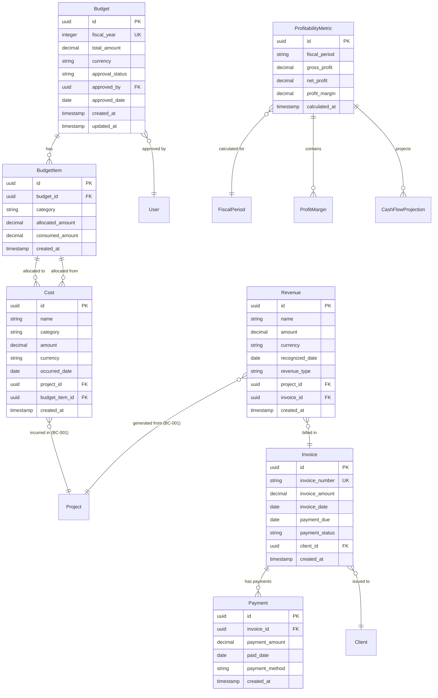
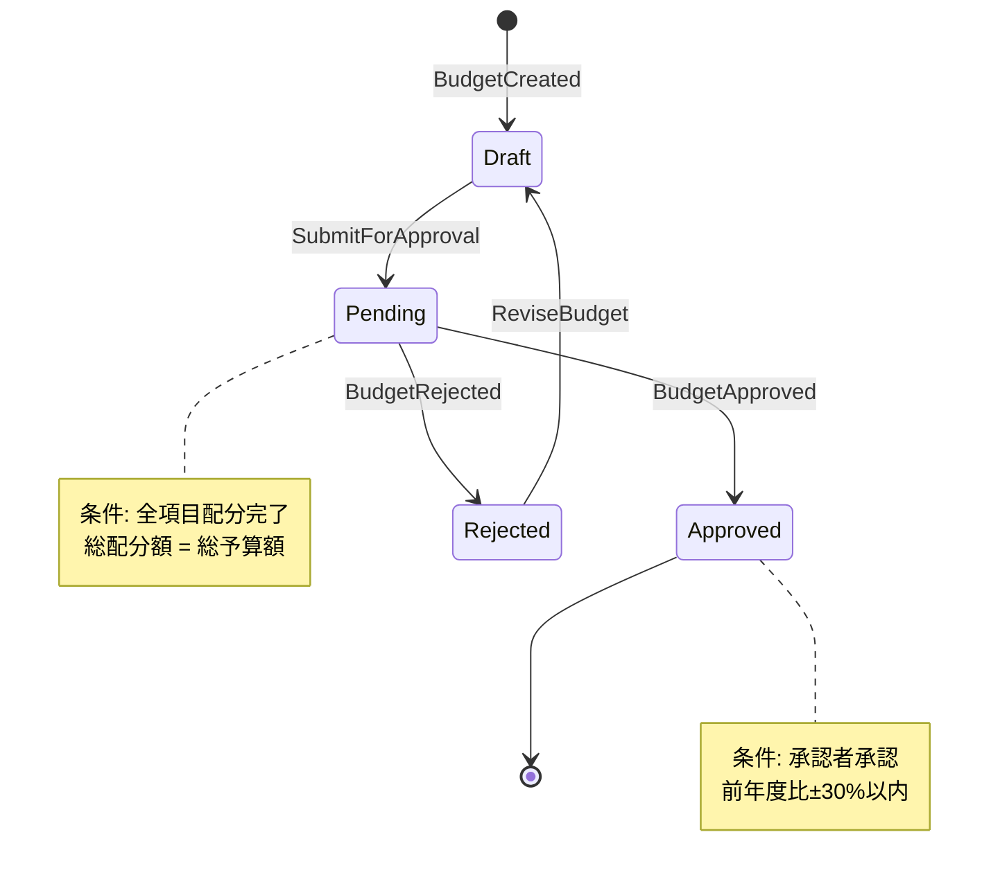
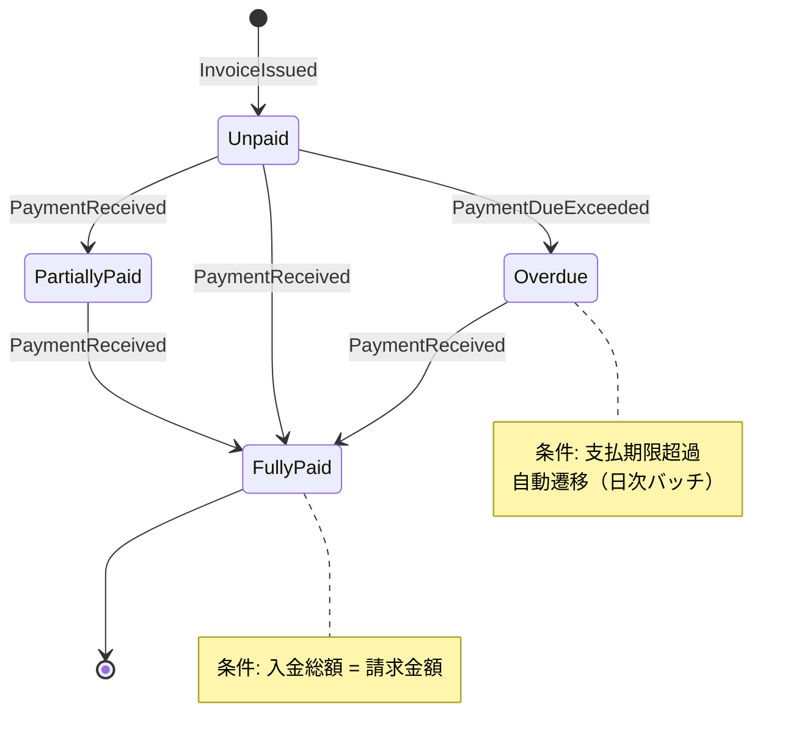

# BC-002: ドメイン設計

**BC**: Financial Health & Profitability
**作成日**: 2025-10-31
**更新日**: 2025-10-31（Issue #192対応）
**V2移行元**: services/revenue-optimization-service/domain-language.md

---

## 📋 概要

このドキュメントは、BC-002（財務健全性と収益性）のドメインモデルを定義します。組織の財務パフォーマンスを管理し、予算計画、コスト管理、収益認識、収益性分析を通じて持続可能な成長を実現します。

**ドメインの範囲**:
- 予算計画と配分（予算策定、承認、配分、監視）
- コスト管理と最適化（コスト記録、分類、分析、削減施策）
- 収益とキャッシュフロー管理（収益認識、請求、入金、予測）
- 収益性分析と改善（利益率計算、トレンド分析、改善アクション）

---

## 🏗️ 主要集約（Aggregates）

### 1. Budget Aggregate {#budget-aggregate}

**集約ルート**: Budget [Budget] [BUDGET]

#### 責務
- 予算のライフサイクル全体を管理（策定→承認→配分→監視）
- 予算項目の配分と消化状況の追跡
- 予算超過の検知とアラート
- 予算再配分の管理

#### 包含エンティティ
- **Budget**（集約ルート）
- **BudgetItem**: 予算の項目別内訳
- **BudgetAllocation**: 予算配分履歴

#### 不変条件（Invariants）
1. **予算項目合計制約**: 全予算項目の配分額合計 ≤ 総予算額
2. **承認前変更禁止**: 承認済み（approved）予算の金額変更は再承認が必要
3. **会計年度一意性**: 同一会計年度に複数の承認済み予算は存在不可
4. **消化額整合性**: 各予算項目の消化額 ≤ 配分額
5. **通貨統一**: 予算と全予算項目は同一通貨で管理

#### ドメインイベント
- **BudgetCreated**: 予算が作成された
  - ペイロード: `{ budgetId, fiscalYear, totalAmount, currency }`

- **BudgetSubmittedForApproval**: 予算が承認申請された
  - ペイロード: `{ budgetId, submittedBy, submittedAt }`
  - サブスクライバ: BC-007（承認者通知）

- **BudgetApproved**: 予算が承認された
  - ペイロード: `{ budgetId, approvedBy, approvedAt, fiscalYear }`
  - サブスクライバ: BC-001（プロジェクト予算連携）

- **BudgetRejected**: 予算が却下された
  - ペイロード: `{ budgetId, rejectedBy, reason }`

- **BudgetItemAllocated**: 予算項目が配分された
  - ペイロード: `{ budgetId, budgetItemId, category, allocatedAmount }`

- **BudgetThresholdExceeded**: 予算消化率が閾値を超えた
  - ペイロード: `{ budgetId, budgetItemId, threshold, currentConsumption }`
  - サブスクライバ: BC-007（アラート通知）

- **BudgetReallocated**: 予算が再配分された
  - ペイロード: `{ budgetId, fromItemId, toItemId, amount }`

#### ビジネスルール
- **予算承認条件**:
  1. 全予算項目の配分額合計 = 総予算額（100%配分）
  2. 全カテゴリに配分済み（必須カテゴリ: 人件費、外注費、設備費）
  3. 前年度予算との乖離が±30%以内（超過時は理由必須）

- **予算超過アラート**:
  - 消化率70%到達 → 警告通知
  - 消化率90%到達 → 重要通知（承認者）
  - 消化率100%到達 → 緊急通知（経営層）

---

### 2. Cost Aggregate {#cost-aggregate}

**集約ルート**: Cost [Cost] [COST]

#### 責務
- コストの記録と分類管理
- 予算項目へのコスト配分
- コストトレンドの分析
- コスト最適化施策の追跡

#### 包含エンティティ
- **Cost**（集約ルート）
- **CostItem**: コストの明細
- **CostAllocation**: コスト配分記録

#### 不変条件（Invariants）
1. **予算紐付け必須**: コストは必ず承認済み予算項目に紐づく
2. **金額正値制約**: コスト金額 > 0
3. **発生日制約**: 発生日は会計年度内
4. **カテゴリ整合性**: コストカテゴリは予算項目カテゴリと一致
5. **プロジェクト参照整合性**: プロジェクトIDはBC-001の有効なプロジェクトを参照

#### ドメインイベント
- **CostRecorded**: コストが記録された
  - ペイロード: `{ costId, category, amount, occurredDate, projectId }`
  - サブスクライバ: BC-001（プロジェクトコスト更新）

- **CostAllocated**: コストが予算項目に配分された
  - ペイロード: `{ costId, budgetItemId, amount }`

- **CostCategoryChanged**: コストカテゴリが変更された
  - ペイロード: `{ costId, oldCategory, newCategory, reason }`

- **HighCostDetected**: 高額コストが検出された
  - ペイロード: `{ costId, amount, threshold, category }`
  - サブスクライバ: BC-007（財務担当者通知）

- **CostTrendAnomalyDetected**: コストトレンド異常が検出された
  - ペイロード: `{ category, expectedAmount, actualAmount, deviation }`
  - サブスクライバ: BC-007（経営層アラート）

#### ビジネスルール
- **コスト承認条件**:
  - 100万円未満: 自動承認
  - 100万円以上500万円未満: マネージャー承認
  - 500万円以上: 役員承認

- **コスト分類ルール**:
  - 人件費: 社員給与、福利厚生、採用費
  - 外注費: 外部委託、コンサルティング
  - 設備費: ハードウェア、ソフトウェアライセンス
  - その他: 間接費、諸経費

---

### 3. Revenue Aggregate {#revenue-aggregate}

**集約ルート**: Revenue [Revenue] [REVENUE]

#### 責務
- 収益認識とキャッシュフロー管理
- 請求書発行と入金管理
- 収益予測とフォーキャスト
- 未回収債権の管理

#### 包含エンティティ
- **Revenue**（集約ルート）
- **Invoice**: 請求書
- **Payment**: 入金記録
- **RevenueStream**: 収益源

#### 不変条件（Invariants）
1. **収益認識タイミング**: 収益は契約条件に準拠して認識（発生主義）
2. **請求金額整合性**: 請求書金額 = 関連収益の合計
3. **入金整合性**: 入金総額 ≤ 請求金額
4. **延滞閾値**: 支払期限超過30日で延滞ステータスに自動遷移
5. **プロジェクト収益紐付け**: プロジェクト収益はBC-001の完了プロジェクトに紐づく

#### ドメインイベント
- **RevenueRecognized**: 収益が認識された
  - ペイロード: `{ revenueId, amount, recognizedDate, revenueType, projectId }`
  - サブスクライバ: BC-001（プロジェクト収益更新）

- **InvoiceIssued**: 請求書が発行された
  - ペイロード: `{ invoiceId, invoiceNumber, amount, clientId, paymentDue }`
  - サブスクライバ: BC-007（クライアント通知）

- **PaymentReceived**: 入金が確認された
  - ペイロード: `{ invoiceId, paymentAmount, paidDate }`

- **InvoiceOverdue**: 請求書が延滞した
  - ペイロード: `{ invoiceId, overdueAmount, daysPastDue }`
  - サブスクライバ: BC-007（督促通知）

- **RevenueForecasted**: 収益予測が更新された
  - ペイロード: `{ fiscalPeriod, forecastedRevenue, confidence }`

#### ビジネスルール
- **収益認識基準**:
  - プロジェクト収益: プロジェクト完了時（BC-001 ProjectCompleted）
  - リテイナー収益: 毎月末に月割計上
  - その他収益: 契約条件に基づく

- **支払期限**:
  - デフォルト: 請求日から30日
  - 優良顧客: 請求日から45日
  - 新規顧客: 請求日から15日

- **延滞対応**:
  - 期限超過7日: 督促メール自動送信
  - 期限超過30日: 電話督促
  - 期限超過60日: 法的措置検討

---

### 4. Profitability Aggregate {#profitability-aggregate}

**集約ルート**: ProfitabilityMetric [ProfitabilityMetric] [PROFITABILITY_METRIC]

#### 責務
- 収益性指標の計算と追跡
- 利益率分析とトレンド監視
- キャッシュフロー予測
- 収益性改善アクションの管理

#### 包含エンティティ
- **ProfitabilityMetric**（集約ルート）
- **ProfitMargin**: 利益率指標
- **CashFlowProjection**: キャッシュフロー予測

#### 不変条件（Invariants）
1. **計算整合性**: 収益性指標は収益・コストデータと整合
2. **時系列連続性**: 指標は会計期間単位で連続的に記録
3. **計算式正確性**: 利益率 = (収益 - コスト) / 収益 × 100
4. **キャッシュフロー予測範囲**: 予測期間は最大12ヶ月
5. **改善アクション期限**: 全改善アクションに実施期限設定必須

#### ドメインイベント
- **ProfitabilityCalculated**: 収益性指標が計算された
  - ペイロード: `{ metricId, period, grossProfit, netProfit, profitMargin }`

- **ProfitMarginDeclined**: 利益率が低下した
  - ペイロード: `{ metricId, period, previousMargin, currentMargin, decline }`
  - サブスクライバ: BC-007（経営層アラート）

- **CashFlowProjectionUpdated**: キャッシュフロー予測が更新された
  - ペイロード: `{ projectionId, period, projectedCashFlow, confidence }`

- **NegativeCashFlowPredicted**: マイナスキャッシュフロー予測
  - ペイロード: `{ projectionId, period, predictedAmount }`
  - サブスクライバ: BC-007（緊急通知）

- **ImprovementActionPlanned**: 収益性改善アクションが計画された
  - ペイロード: `{ actionId, actionType, expectedImpact, deadline }`

#### ビジネスルール
- **収益性目標**:
  - 粗利率（Gross Margin）: 目標40%以上
  - 営業利益率（Operating Margin）: 目標15%以上
  - 純利益率（Net Margin）: 目標10%以上

- **アラート閾値**:
  - 粗利率 < 35%: 警告
  - 粗利率 < 30%: 重大警告
  - 粗利率 < 25%: 緊急対応

- **キャッシュフロー管理**:
  - 予測キャッシュフロー < 0: 資金調達検討
  - 手元現金 < 月間支出の3ヶ月分: 流動性リスク

---

## 🔗 エンティティ間リレーションシップ

### リレーションシップ図



---

## 📦 主要エンティティ（Entities）

### Budget [Budget] [BUDGET] {#entity-budget}
予算 [Budget] [BUDGET]

#### プロパティ
| プロパティ | Parasol言語 | 英語名 | 型 | 制約 | 説明 |
|-----------|------------|--------|-----|------|------|
| 予算ID | BudgetID | BUDGET_ID | UUID | PK, NOT NULL | 一意識別子 |
| 予算名 | BudgetName | BUDGET_NAME | STRING_200 | NOT NULL | 予算名 |
| 会計年度 | FiscalYear | FISCAL_YEAR | INTEGER | NOT NULL, UNIQUE | 会計年度（YYYY） |
| 総予算額 | TotalAmount | TOTAL_AMOUNT | DECIMAL | NOT NULL, > 0 | 総予算額 |
| 通貨 | Currency | CURRENCY | STRING_20 | NOT NULL | 通貨コード（ISO 4217） |
| 承認状態 | ApprovalStatus | APPROVAL_STATUS | STRING_50 | NOT NULL | draft/pending/approved/rejected |
| 承認者ID | ApprovedByID | APPROVED_BY_ID | UUID | FK → User | 承認者 |
| 承認日 | ApprovedDate | APPROVED_DATE | DATE | | 承認日 |
| 作成日時 | CreatedAt | CREATED_AT | TIMESTAMP | NOT NULL | レコード作成日時 |
| 更新日時 | UpdatedAt | UPDATED_AT | TIMESTAMP | NOT NULL | 最終更新日時 |

#### ライフサイクル
```
新規作成 → 下書き(draft) → 承認待ち(pending) → 承認済み(approved)
                                          ↘ 却下(rejected) → 下書き(draft)
```

---

### Cost [Cost] [COST] {#entity-cost}
コスト [Cost] [COST]

#### プロパティ
| プロパティ | Parasol言語 | 英語名 | 型 | 制約 | 説明 |
|-----------|------------|--------|-----|------|------|
| コストID | CostID | COST_ID | UUID | PK, NOT NULL | 一意識別子 |
| コスト名 | CostName | COST_NAME | STRING_200 | NOT NULL | コスト名 |
| カテゴリ | Category | CATEGORY | STRING_50 | NOT NULL | labor/outsource/equipment/other |
| 金額 | Amount | AMOUNT | DECIMAL | NOT NULL, > 0 | コスト金額 |
| 通貨 | Currency | CURRENCY | STRING_20 | NOT NULL | 通貨コード |
| 発生日 | OccurredDate | OCCURRED_DATE | DATE | NOT NULL | コスト発生日 |
| プロジェクトID | ProjectID | PROJECT_ID | UUID | FK → Project (BC-001) | 関連プロジェクト |
| 予算項目ID | BudgetItemID | BUDGET_ITEM_ID | UUID | FK → BudgetItem, NOT NULL | 配分先予算項目 |
| 説明 | Description | DESCRIPTION | TEXT | | コスト説明 |
| 作成日時 | CreatedAt | CREATED_AT | TIMESTAMP | NOT NULL | レコード作成日時 |
| 更新日時 | UpdatedAt | UPDATED_AT | TIMESTAMP | NOT NULL | 最終更新日時 |

---

### Revenue [Revenue] [REVENUE] {#entity-revenue}
収益 [Revenue] [REVENUE]

#### プロパティ
| プロパティ | Parasol言語 | 英語名 | 型 | 制約 | 説明 |
|-----------|------------|--------|-----|------|------|
| 収益ID | RevenueID | REVENUE_ID | UUID | PK, NOT NULL | 一意識別子 |
| 収益名 | RevenueName | REVENUE_NAME | STRING_200 | NOT NULL | 収益名 |
| 金額 | Amount | AMOUNT | DECIMAL | NOT NULL, > 0 | 収益金額 |
| 通貨 | Currency | CURRENCY | STRING_20 | NOT NULL | 通貨コード |
| 認識日 | RecognizedDate | RECOGNIZED_DATE | DATE | NOT NULL | 収益認識日 |
| 収益区分 | RevenueType | REVENUE_TYPE | STRING_50 | NOT NULL | project/retainer/other |
| プロジェクトID | ProjectID | PROJECT_ID | UUID | FK → Project (BC-001) | 関連プロジェクト |
| 請求書ID | InvoiceID | INVOICE_ID | UUID | FK → Invoice | 関連請求書 |
| 説明 | Description | DESCRIPTION | TEXT | | 収益説明 |
| 作成日時 | CreatedAt | CREATED_AT | TIMESTAMP | NOT NULL | レコード作成日時 |
| 更新日時 | UpdatedAt | UPDATED_AT | TIMESTAMP | NOT NULL | 最終更新日時 |

---

### Invoice [Invoice] [INVOICE] {#entity-invoice}
請求書 [Invoice] [INVOICE]

#### プロパティ
| プロパティ | Parasol言語 | 英語名 | 型 | 制約 | 説明 |
|-----------|------------|--------|-----|------|------|
| 請求書ID | InvoiceID | INVOICE_ID | UUID | PK, NOT NULL | 一意識別子 |
| 請求書番号 | InvoiceNumber | INVOICE_NUMBER | STRING_50 | NOT NULL, UNIQUE | 請求書番号 |
| 請求金額 | InvoiceAmount | INVOICE_AMOUNT | DECIMAL | NOT NULL, > 0 | 請求金額 |
| 通貨 | Currency | CURRENCY | STRING_20 | NOT NULL | 通貨コード |
| 請求日 | InvoiceDate | INVOICE_DATE | DATE | NOT NULL | 請求日 |
| 支払期限 | PaymentDue | PAYMENT_DUE | DATE | NOT NULL | 支払期限 |
| 支払状態 | PaymentStatus | PAYMENT_STATUS | STRING_50 | NOT NULL | unpaid/partially_paid/fully_paid/overdue |
| クライアントID | ClientID | CLIENT_ID | UUID | FK → Client, NOT NULL | クライアント |
| 作成日時 | CreatedAt | CREATED_AT | TIMESTAMP | NOT NULL | レコード作成日時 |
| 更新日時 | UpdatedAt | UPDATED_AT | TIMESTAMP | NOT NULL | 最終更新日時 |

#### ライフサイクル
```
新規作成 → 未払(unpaid) → 一部払(partially_paid) → 全額払(fully_paid)
                 ↓
           支払期限超過 → 延滞(overdue) → 全額払(fully_paid)
```

---

## 💎 主要値オブジェクト（Value Objects）

### MoneyAmount [MoneyAmount] [MONEY_AMOUNT]
金額 [MoneyAmount] [MONEY_AMOUNT]

#### プロパティ
| プロパティ | Parasol言語 | 英語名 | 型 | 説明 |
|-----------|------------|--------|-----|------|
| 金額 | amount | AMOUNT | DECIMAL | 金額 |
| 通貨 | currency | CURRENCY | STRING_20 | 通貨コード（ISO 4217: JPY, USD, EUR） |
| 為替レート | exchangeRate | EXCHANGE_RATE | DECIMAL | 基準通貨への為替レート（オプション） |

#### 不変条件
- amount ≥ 0（負の金額は別途ReturnAmountなど専用VOで表現）
- currency はISO 4217準拠

#### ビジネスロジック
```typescript
class MoneyAmount {
  convertTo(targetCurrency: string, exchangeRate: number): MoneyAmount {
    return new MoneyAmount(
      this.amount * exchangeRate,
      targetCurrency,
      exchangeRate
    );
  }

  add(other: MoneyAmount): MoneyAmount {
    if (this.currency !== other.currency) {
      throw new Error('異なる通貨の加算には為替レート変換が必要');
    }
    return new MoneyAmount(this.amount + other.amount, this.currency);
  }
}
```

---

### CostCategory [CostCategory] [COST_CATEGORY]
コストカテゴリ [CostCategory] [COST_CATEGORY]

#### プロパティ
| プロパティ | Parasol言語 | 英語名 | 型 | 説明 |
|-----------|------------|--------|-----|------|
| カテゴリ名 | categoryName | CATEGORY_NAME | STRING_100 | カテゴリ名 |
| カテゴリコード | categoryCode | CATEGORY_CODE | STRING_20 | カテゴリコード（LABOR, OUTSOURCE, EQUIPMENT, OTHER） |
| 親カテゴリID | parentCategoryId | PARENT_CATEGORY_ID | UUID | 親カテゴリ（階層構造用） |

#### 使用例
```typescript
const costCategories: CostCategory[] = [
  { categoryName: "人件費", categoryCode: "LABOR", parentCategoryId: null },
  { categoryName: "社員給与", categoryCode: "LABOR_SALARY", parentCategoryId: "LABOR" },
  { categoryName: "福利厚生", categoryCode: "LABOR_BENEFITS", parentCategoryId: "LABOR" },
  { categoryName: "外注費", categoryCode: "OUTSOURCE", parentCategoryId: null }
];
```

---

### ProfitMargin [ProfitMargin] [PROFIT_MARGIN]
利益率 [ProfitMargin] [PROFIT_MARGIN]

#### プロパティ
| プロパティ | Parasol言語 | 英語名 | 型 | 説明 |
|-----------|------------|--------|-----|------|
| 粗利益 | grossProfit | GROSS_PROFIT | DECIMAL | 粗利益（収益 - 直接費） |
| 営業利益 | operatingProfit | OPERATING_PROFIT | DECIMAL | 営業利益（粗利益 - 間接費） |
| 純利益 | netProfit | NET_PROFIT | DECIMAL | 純利益（営業利益 - 税金等） |
| 粗利率 | grossMarginRate | GROSS_MARGIN_RATE | DECIMAL | 粗利率（%） |
| 営業利益率 | operatingMarginRate | OPERATING_MARGIN_RATE | DECIMAL | 営業利益率（%） |
| 純利益率 | netMarginRate | NET_MARGIN_RATE | DECIMAL | 純利益率（%） |

#### 計算式
```typescript
class ProfitMargin {
  static calculate(revenue: number, directCost: number, indirectCost: number, tax: number): ProfitMargin {
    const grossProfit = revenue - directCost;
    const operatingProfit = grossProfit - indirectCost;
    const netProfit = operatingProfit - tax;

    return new ProfitMargin(
      grossProfit,
      operatingProfit,
      netProfit,
      (grossProfit / revenue) * 100,
      (operatingProfit / revenue) * 100,
      (netProfit / revenue) * 100
    );
  }
}
```

---

## 🔄 ライフサイクルと状態遷移

### Budget ライフサイクル



### Invoice ライフサイクル



---

## 🎯 ドメインサービス

### BudgetManagementService
**責務**: 予算計画の最適化と配分管理

#### メソッド

##### approveBudget(budgetId: UUID, approverId: UUID): ValidationResult
**説明**: 予算承認の実行と整合性検証
- 配分総額と総予算額の一致確認
- 前年度予算との乖離チェック
- 必須カテゴリの配分確認

##### reallocateBudget(budgetId: UUID, fromItemId: UUID, toItemId: UUID, amount: Decimal): void
**説明**: 予算項目間の再配分
- 配分元の残高確認
- 配分先の上限チェック
- 再配分履歴の記録

---

### CostAnalysisService
**責務**: コスト分析とトレンド検出

#### メソッド

##### analyzeCostTrends(category: string, period: DateRange): CostTrendAnalysis
**説明**: コストトレンドの分析と異常検出
- 期間別コスト推移の算出
- 異常値検出（標準偏差±2σ超え）
- コスト削減機会の特定

##### optimizeCostAllocation(projectId: UUID): OptimizationSuggestion[]
**説明**: コスト配分の最適化提案
- プロジェクト別コスト効率分析
- 予算超過リスクの検出
- 配分最適化の提案

---

### RevenueForecastingService
**責務**: 収益予測とキャッシュフロー管理

#### メソッド

##### forecastRevenue(period: FiscalPeriod): RevenueForecast
**説明**: 収益予測の算出
- 過去データからのトレンド分析
- プロジェクトパイプラインの考慮
- 信頼区間の算出

##### predictCashFlow(months: number): CashFlowProjection[]
**説明**: キャッシュフロー予測
- 収益・コストのタイミング考慮
- 未回収債権の織り込み
- 資金繰りリスクの検出

---

## 🌐 BC間連携とドメインイベント

### BC-001（Project Delivery）からの連携
**イベント**: `TaskCompleted`, `ProjectCompleted`
- **目的**: コスト計上、収益認識
- **データフロー**: プロジェクトID、実績工数 → コスト記録
- **データフロー**: プロジェクトID、完了日 → 収益認識

### BC-007（Team Communication）への連携
**イベント**: `BudgetThresholdExceeded`, `InvoiceOverdue`, `ProfitMarginDeclined`
- **目的**: 財務アラート通知、督促
- **データフロー**: アラート内容、緊急度、宛先 → BC-007

---

## 📚 V2からの移行メモ

### 移行完了項目
- ✅ Budget, Cost, Revenue, Profitabilityエンティティの定義
- ✅ 集約境界の明確化（4集約）
- ✅ 値オブジェクトの抽出（MoneyAmount, CostCategory, ProfitMargin）
- ✅ ドメインサービスの定義（3サービス）
- ✅ **Issue #192対応**: 詳細な不変条件、ドメインイベント、リレーションシップ図、状態遷移図を追加

### V2からの主な改善点
1. **通貨対応強化**: MoneyAmountに為替レート機能追加
2. **予算承認フロー明確化**: 承認プロセスと制約を詳細化
3. **コスト分類体系化**: カテゴリ階層構造の導入
4. **収益認識ルール**: 契約タイプ別の認識基準を明確化
5. **収益性指標**: 粗利率・営業利益率・純利益率の3段階指標

---

**ステータス**: ✅ Issue #192 Phase 2.1 (BC-002 domain) 完了
**次のアクション**: BC-002 API設計の詳細化
