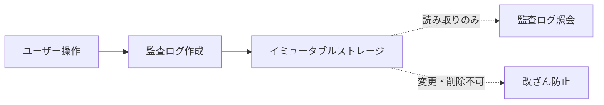

# Audit & Security API

**BC**: BC-003 - Access Control & Security
**カテゴリ**: Audit & Security [監査とセキュリティ] [AUDIT_SECURITY]
**最終更新**: 2025-11-01

---

## 目次

1. [概要](#overview)
2. [監査ログAPI](#audit-log-api)
3. [セキュリティイベントAPI](#security-event-api)
4. [コンプライアンスレポートAPI](#compliance-report-api)
5. [セキュリティポリシーAPI](#security-policy-api)

---

## 概要 {#overview}

このドキュメントは、BC-003が提供する監査・セキュリティ関連のAPI仕様を定義します。

### 監査ログの特性

BC-003の監査ログは**イミュータブル（不変）**です:



**イミュータブル保証**:
- 作成後、変更・削除不可
- ハッシュチェーンで改ざん検知
- タイムスタンプは信頼できるNTPサーバーから取得
- 保存期間: 最低3年間（コンプライアンス要件）

### 記録対象イベント

| カテゴリ | イベント例 |
|---------|----------|
| 認証 | ログイン、ログアウト、MFA検証、認証失敗 |
| 認可 | ロール割当、権限付与、権限チェック失敗 |
| ユーザー管理 | ユーザー作成、更新、削除、停止、有効化 |
| セキュリティ | アカウントロック、不審なアクティビティ検知、パスワード変更 |
| システム | 設定変更、ポリシー更新、システムエラー |

---

## 監査ログAPI {#audit-log-api}

### GET /api/bc-003/audit-logs

監査ログ一覧を取得します。

#### クエリパラメータ

| パラメータ | 型 | 必須 | 説明 |
|----------|------|-----|------|
| userId | string | ❌ | ユーザーIDフィルタ |
| action | string | ❌ | アクションフィルタ（例: `USER_LOGIN`, `ROLE_ASSIGNED`） |
| category | string | ❌ | カテゴリフィルタ（`authentication`, `authorization`, `user_management`, `security`） |
| startDate | string | ❌ | 開始日時（ISO 8601） |
| endDate | string | ❌ | 終了日時（ISO 8601） |
| ipAddress | string | ❌ | IPアドレスフィルタ |
| result | string | ❌ | 結果フィルタ（`success`, `failure`） |
| severity | string | ❌ | 深刻度フィルタ（`low`, `medium`, `high`, `critical`） |
| sortOrder | string | ❌ | ソート順（`asc`, `desc`）デフォルト: `desc` |
| page | integer | ❌ | ページ番号（デフォルト: 1） |
| pageSize | integer | ❌ | ページサイズ（デフォルト: 50, 最大: 200） |

#### レスポンス（200 OK）

```json
{
  "auditLogs": [
    {
      "logId": "log-uuid-1",
      "timestamp": "2025-11-01T10:00:00.123Z",
      "userId": "user-uuid",
      "userEmail": "user@example.com",
      "userName": "john_doe",
      "action": "USER_LOGIN",
      "category": "authentication",
      "result": "success",
      "severity": "low",
      "ipAddress": "203.0.113.45",
      "userAgent": "Mozilla/5.0 (Windows NT 10.0; Win64; x64)...",
      "location": {
        "country": "Japan",
        "city": "Tokyo",
        "latitude": 35.6895,
        "longitude": 139.6917
      },
      "details": {
        "mfaVerified": true,
        "sessionId": "session-uuid"
      },
      "hash": "sha256:a1b2c3d4e5f6...",
      "previousHash": "sha256:f6e5d4c3b2a1..."
    },
    {
      "logId": "log-uuid-2",
      "timestamp": "2025-11-01T09:58:30.456Z",
      "userId": "user-uuid-admin",
      "userEmail": "admin@example.com",
      "userName": "admin",
      "action": "ROLE_ASSIGNED",
      "category": "authorization",
      "result": "success",
      "severity": "medium",
      "ipAddress": "198.51.100.20",
      "userAgent": "curl/7.68.0",
      "details": {
        "targetUserId": "user-uuid",
        "roleId": "role-uuid-pm",
        "roleName": "project_manager"
      },
      "hash": "sha256:b2c3d4e5f6a1...",
      "previousHash": "sha256:a1f6e5d4c3b2..."
    }
  ],
  "pagination": {
    "currentPage": 1,
    "pageSize": 50,
    "totalItems": 12450,
    "totalPages": 249
  },
  "filters": {
    "category": "authentication",
    "result": "success",
    "startDate": "2025-11-01T00:00:00Z",
    "endDate": "2025-11-01T23:59:59Z"
  }
}
```

#### フィールド説明

| フィールド | 説明 |
|----------|------|
| hash | このログのSHA-256ハッシュ（改ざん検知用） |
| previousHash | 直前のログのハッシュ（ハッシュチェーン） |
| severity | 深刻度（low: 通常操作、medium: 重要操作、high: セキュリティ関連、critical: 緊急対応必要） |

#### エラーレスポンス

| HTTPステータス | エラーコード | 説明 |
|-------------|------------|------|
| 400 | BC003_ERR_300 | 無効な日時範囲 |
| 403 | BC003_ERR_301 | 監査ログ閲覧権限なし |
| 400 | BC003_ERR_302 | 日時範囲が大きすぎる（最大90日間） |

#### 認証・権限

- **認証**: Bearer Token必須
- **権限**: `audit:read`

#### レート制限・SLA

- **レート制限**: 30 req/min
- **SLA**: p95 < 800ms（大量データのため）

---

### GET /api/bc-003/audit-logs/{logId}

監査ログ詳細を取得します。

#### パスパラメータ

- `logId` (UUID, 必須): 監査ログID

#### レスポンス（200 OK）

```json
{
  "logId": "log-uuid",
  "timestamp": "2025-11-01T10:00:00.123Z",
  "userId": "user-uuid",
  "userEmail": "user@example.com",
  "userName": "john_doe",
  "action": "USER_LOGIN",
  "category": "authentication",
  "result": "success",
  "severity": "low",
  "ipAddress": "203.0.113.45",
  "userAgent": "Mozilla/5.0 (Windows NT 10.0; Win64; x64) AppleWebKit/537.36 (KHTML, like Gecko) Chrome/119.0.0.0 Safari/537.36",
  "location": {
    "country": "Japan",
    "countryCode": "JP",
    "region": "Tokyo",
    "city": "Tokyo",
    "latitude": 35.6895,
    "longitude": 139.6917,
    "timezone": "Asia/Tokyo"
  },
  "details": {
    "mfaVerified": true,
    "mfaMethod": "totp",
    "sessionId": "session-uuid",
    "loginAttempts": 1,
    "deviceFingerprint": "fp-abc123"
  },
  "hash": "sha256:a1b2c3d4e5f6g7h8i9j0k1l2m3n4o5p6q7r8s9t0u1v2w3x4y5z6",
  "previousHash": "sha256:f6e5d4c3b2a1z0y9x8w7v6u5t4s3r2q1p0o9n8m7l6k5j4i3h2g1",
  "hashVerified": true,
  "metadata": {
    "serverId": "auth-server-01",
    "requestId": "req-uuid",
    "processingTime": 123
  }
}
```

#### エラーレスポンス

| HTTPステータス | エラーコード | 説明 |
|-------------|------------|------|
| 404 | BC003_ERR_310 | 監査ログが存在しない |
| 403 | BC003_ERR_301 | 監査ログ閲覧権限なし |

#### 認証・権限

- **認証**: Bearer Token必須
- **権限**: `audit:read`

#### レート制限・SLA

- **レート制限**: 100 req/min
- **SLA**: p95 < 300ms

---

### POST /api/bc-003/audit-logs/export

監査ログをエクスポートします（CSV, JSON形式）。

#### リクエスト

```json
{
  "format": "csv",
  "filters": {
    "userId": "user-uuid",
    "startDate": "2025-10-01T00:00:00Z",
    "endDate": "2025-10-31T23:59:59Z",
    "category": "authentication"
  },
  "fields": [
    "timestamp",
    "userId",
    "action",
    "result",
    "ipAddress"
  ]
}
```

**パラメータ**:

| フィールド | 型 | 必須 | 説明 |
|----------|------|-----|------|
| format | string | ✅ | エクスポート形式（`csv`, `json`） |
| filters | object | ❌ | フィルタ条件（GET /audit-logsと同じ） |
| fields | array | ❌ | 出力フィールド（指定なしで全フィールド） |

#### レスポンス（202 Accepted）

```json
{
  "exportId": "export-uuid",
  "status": "processing",
  "estimatedTime": 120,
  "downloadUrl": null,
  "expiresAt": null,
  "createdAt": "2025-11-01T10:00:00Z"
}
```

#### エクスポート完了後の状態確認

```
GET /api/bc-003/audit-logs/export/{exportId}
```

**レスポンス（200 OK）**:

```json
{
  "exportId": "export-uuid",
  "status": "completed",
  "downloadUrl": "https://secure-storage.example.com/exports/export-uuid.csv",
  "fileSize": 1234567,
  "recordCount": 5432,
  "expiresAt": "2025-11-02T10:00:00Z",
  "createdAt": "2025-11-01T10:00:00Z",
  "completedAt": "2025-11-01T10:02:15Z"
}
```

#### エラーレスポンス

| HTTPステータス | エラーコード | 説明 |
|-------------|------------|------|
| 400 | BC003_ERR_320 | エクスポート期間が長すぎる（最大1年間） |
| 403 | BC003_ERR_321 | エクスポート権限なし |
| 429 | BC003_ERR_322 | 同時エクスポート数の上限（最大3件） |

#### 認証・権限

- **認証**: Bearer Token必須
- **権限**: `audit:export`

#### レート制限・SLA

- **レート制限**: 5 req/min
- **SLA**: 処理時間はデータ量による（数分〜数十分）

---

## セキュリティイベントAPI {#security-event-api}

### GET /api/bc-003/security-events

セキュリティイベント一覧を取得します。

#### クエリパラメータ

| パラメータ | 型 | 必須 | 説明 |
|----------|------|-----|------|
| userId | string | ❌ | ユーザーIDフィルタ |
| eventType | string | ❌ | イベントタイプフィルタ（例: `SUSPICIOUS_LOGIN`, `ACCOUNT_LOCKED`） |
| severity | string | ❌ | 深刻度フィルタ（`low`, `medium`, `high`, `critical`） |
| status | string | ❌ | ステータスフィルタ（`open`, `investigating`, `resolved`, `false_positive`） |
| startDate | string | ❌ | 開始日時（ISO 8601） |
| endDate | string | ❌ | 終了日時（ISO 8601） |
| page | integer | ❌ | ページ番号（デフォルト: 1） |
| pageSize | integer | ❌ | ページサイズ（デフォルト: 20, 最大: 100） |

#### レスポンス（200 OK）

```json
{
  "securityEvents": [
    {
      "eventId": "event-uuid-1",
      "eventType": "SUSPICIOUS_LOGIN",
      "severity": "high",
      "status": "open",
      "userId": "user-uuid",
      "userEmail": "user@example.com",
      "detectedAt": "2025-11-01T10:00:00Z",
      "description": "異常な地理的位置からのログイン試行を検知",
      "riskScore": 75,
      "indicators": [
        {
          "type": "UNUSUAL_LOCATION",
          "description": "通常と異なる国からのアクセス（Russia）",
          "score": 40
        },
        {
          "type": "UNUSUAL_TIME",
          "description": "通常と異なる時間帯のアクセス（午前3時）",
          "score": 20
        },
        {
          "type": "MULTIPLE_FAILURES",
          "description": "5回の連続ログイン失敗",
          "score": 15
        }
      ],
      "details": {
        "ipAddress": "185.220.101.45",
        "location": {
          "country": "Russia",
          "city": "Moscow"
        },
        "userAgent": "Unknown/1.0",
        "loginAttempts": 5,
        "lastFailureAt": "2025-11-01T09:59:45Z"
      },
      "actions": [
        {
          "action": "ACCOUNT_LOCKED",
          "takenAt": "2025-11-01T10:00:00Z",
          "automated": true
        },
        {
          "action": "NOTIFICATION_SENT",
          "takenAt": "2025-11-01T10:00:01Z",
          "recipients": ["security-team@example.com"],
          "automated": true
        }
      ],
      "assignedTo": null,
      "resolvedAt": null
    }
  ],
  "summary": {
    "total": 42,
    "bySeverity": {
      "critical": 2,
      "high": 8,
      "medium": 15,
      "low": 17
    },
    "byStatus": {
      "open": 12,
      "investigating": 8,
      "resolved": 20,
      "false_positive": 2
    }
  },
  "pagination": {
    "currentPage": 1,
    "pageSize": 20,
    "totalItems": 42,
    "totalPages": 3
  }
}
```

#### フィールド説明

| フィールド | 説明 |
|----------|------|
| riskScore | リスクスコア（0-100、100が最も危険） |
| indicators | リスク指標のリスト |
| actions | 自動的または手動で実行されたアクション |

#### 認証・権限

- **認証**: Bearer Token必須
- **権限**: `security:read`

#### レート制限・SLA

- **レート制限**: 50 req/min
- **SLA**: p95 < 500ms

---

### POST /api/bc-003/security-events/alert

セキュリティアラートを作成します（手動アラート、またはシステム検知による自動アラート）。

#### リクエスト

```json
{
  "eventType": "UNAUTHORIZED_ACCESS_ATTEMPT",
  "severity": "high",
  "userId": "user-uuid",
  "description": "管理者権限が必要なエンドポイントへの不正アクセス試行",
  "details": {
    "endpoint": "/api/bc-003/users",
    "method": "DELETE",
    "ipAddress": "203.0.113.45",
    "attemptCount": 3
  },
  "autoResolve": false,
  "notifyTeam": true
}
```

**パラメータ**:

| フィールド | 型 | 必須 | 説明 |
|----------|------|-----|------|
| eventType | string | ✅ | イベントタイプ |
| severity | string | ✅ | 深刻度（`low`, `medium`, `high`, `critical`） |
| userId | string | ❌ | 対象ユーザーID |
| description | string | ✅ | 説明 |
| details | object | ❌ | 詳細情報（自由形式） |
| autoResolve | boolean | ❌ | 自動解決するか（デフォルト: false） |
| notifyTeam | boolean | ❌ | セキュリティチームに通知するか（デフォルト: true） |

#### レスポンス（201 Created）

```json
{
  "eventId": "event-uuid",
  "eventType": "UNAUTHORIZED_ACCESS_ATTEMPT",
  "severity": "high",
  "status": "open",
  "userId": "user-uuid",
  "description": "管理者権限が必要なエンドポイントへの不正アクセス試行",
  "riskScore": 80,
  "detectedAt": "2025-11-01T10:00:00Z",
  "notificationSent": true,
  "createdBy": "user-uuid-admin"
}
```

#### エラーレスポンス

| HTTPステータス | エラーコード | 説明 |
|-------------|------------|------|
| 400 | BC003_ERR_330 | 無効なイベントタイプ |
| 403 | BC003_ERR_331 | セキュリティアラート作成権限なし |

#### 認証・権限

- **認証**: Bearer Token必須（または BC間サービスアカウント）
- **権限**: `security:write`

#### レート制限・SLA

- **レート制限**: 100 req/min（自動検知のため高め）
- **SLA**: p95 < 400ms

---

### PUT /api/bc-003/security-events/{eventId}

セキュリティイベントを更新します（ステータス変更、担当者割当等）。

#### パスパラメータ

- `eventId` (UUID, 必須): イベントID

#### リクエスト

```json
{
  "status": "investigating",
  "assignedTo": "user-uuid-security-admin",
  "notes": "調査開始。IPアドレスをブロックリストに追加済み"
}
```

#### レスポンス（200 OK）

GET /security-events と同形式

#### 認証・権限

- **認証**: Bearer Token必須
- **権限**: `security:manage`

#### レート制限・SLA

- **レート制限**: 50 req/min
- **SLA**: p95 < 400ms

---

## コンプライアンスレポートAPI {#compliance-report-api}

### GET /api/bc-003/compliance/reports

コンプライアンスレポート一覧を取得します。

#### クエリパラメータ

| パラメータ | 型 | 必須 | 説明 |
|----------|------|-----|------|
| reportType | string | ❌ | レポートタイプ（`access_control`, `authentication`, `audit_trail`, `security_incidents`） |
| startDate | string | ❌ | 開始日時 |
| endDate | string | ❌ | 終了日時 |

#### レスポンス（200 OK）

```json
{
  "reports": [
    {
      "reportId": "report-uuid-1",
      "reportType": "access_control",
      "title": "アクセス制御レポート - 2025年10月",
      "period": {
        "startDate": "2025-10-01T00:00:00Z",
        "endDate": "2025-10-31T23:59:59Z"
      },
      "summary": {
        "totalUsers": 245,
        "activeUsers": 230,
        "inactiveUsers": 10,
        "suspendedUsers": 5,
        "totalRoles": 12,
        "totalPermissions": 45,
        "roleAssignments": 312
      },
      "findings": [
        {
          "severity": "medium",
          "category": "excessive_permissions",
          "description": "5人のユーザーがsystem_adminロールを保有（推奨: 最大3人）",
          "recommendation": "system_adminロール保有者を削減"
        }
      ],
      "generatedAt": "2025-11-01T09:00:00Z",
      "generatedBy": "system"
    },
    {
      "reportId": "report-uuid-2",
      "reportType": "security_incidents",
      "title": "セキュリティインシデントレポート - 2025年10月",
      "period": {
        "startDate": "2025-10-01T00:00:00Z",
        "endDate": "2025-10-31T23:59:59Z"
      },
      "summary": {
        "totalIncidents": 42,
        "criticalIncidents": 2,
        "highIncidents": 8,
        "mediumIncidents": 15,
        "lowIncidents": 17,
        "resolvedIncidents": 35,
        "openIncidents": 7
      },
      "topIncidents": [
        {
          "eventType": "BRUTE_FORCE_ATTACK",
          "count": 12,
          "severity": "high"
        },
        {
          "eventType": "SUSPICIOUS_LOGIN",
          "count": 18,
          "severity": "medium"
        }
      ],
      "generatedAt": "2025-11-01T09:00:00Z",
      "generatedBy": "system"
    }
  ]
}
```

#### 認証・権限

- **認証**: Bearer Token必須
- **権限**: `audit:read` または `security:read`

#### レート制限・SLA

- **レート制限**: 20 req/min
- **SLA**: p95 < 2000ms（レポート生成のため長め）

---

### POST /api/bc-003/compliance/reports/generate

コンプライアンスレポートを生成します。

#### リクエスト

```json
{
  "reportType": "audit_trail",
  "period": {
    "startDate": "2025-10-01T00:00:00Z",
    "endDate": "2025-10-31T23:59:59Z"
  },
  "format": "pdf",
  "includeDetails": true
}
```

#### レスポンス（202 Accepted）

```json
{
  "reportId": "report-uuid",
  "status": "processing",
  "estimatedTime": 300,
  "createdAt": "2025-11-01T10:00:00Z"
}
```

#### 認証・権限

- **認証**: Bearer Token必須
- **権限**: `audit:export` または `security:read`

#### レート制限・SLA

- **レート制限**: 5 req/min
- **SLA**: 処理時間は数分〜数十分

---

## セキュリティポリシーAPI {#security-policy-api}

### GET /api/bc-003/security-policies

セキュリティポリシー一覧を取得します。

#### レスポンス（200 OK）

```json
{
  "policies": [
    {
      "policyId": "policy-password",
      "policyType": "password",
      "name": "パスワードポリシー",
      "enabled": true,
      "settings": {
        "minLength": 8,
        "requireUppercase": true,
        "requireLowercase": true,
        "requireDigit": true,
        "requireSpecialChar": true,
        "maxAge": 90,
        "preventReuse": 3,
        "lockoutThreshold": 5,
        "lockoutDuration": 1800
      },
      "updatedAt": "2025-09-15T10:00:00Z",
      "updatedBy": "user-uuid-admin"
    },
    {
      "policyId": "policy-session",
      "policyType": "session",
      "name": "セッションポリシー",
      "enabled": true,
      "settings": {
        "accessTokenTTL": 1800,
        "refreshTokenTTL": 604800,
        "maxConcurrentSessions": 5,
        "sessionTimeoutWarning": 300,
        "enforceIpBinding": false
      },
      "updatedAt": "2025-10-01T14:00:00Z",
      "updatedBy": "user-uuid-admin"
    },
    {
      "policyId": "policy-mfa",
      "policyType": "mfa",
      "name": "MFAポリシー",
      "enabled": true,
      "settings": {
        "enforceMfa": false,
        "recommendMfa": true,
        "allowedMethods": ["totp", "sms"],
        "backupCodeCount": 5
      },
      "updatedAt": "2025-08-20T09:00:00Z",
      "updatedBy": "user-uuid-admin"
    }
  ]
}
```

#### 認証・権限

- **認証**: Bearer Token必須
- **権限**: `security:read`

#### レート制限・SLA

- **レート制限**: 50 req/min
- **SLA**: p95 < 300ms

---

### PUT /api/bc-003/security-policies/{policyId}

セキュリティポリシーを更新します。

#### パスパラメータ

- `policyId` (string, 必須): ポリシーID

#### リクエスト

```json
{
  "enabled": true,
  "settings": {
    "minLength": 10,
    "requireUppercase": true,
    "requireLowercase": true,
    "requireDigit": true,
    "requireSpecialChar": true,
    "maxAge": 60,
    "preventReuse": 5,
    "lockoutThreshold": 3,
    "lockoutDuration": 3600
  }
}
```

#### レスポンス（200 OK）

GET /security-policies と同形式

#### エラーレスポンス

| HTTPステータス | エラーコード | 説明 |
|-------------|------------|------|
| 404 | BC003_ERR_340 | ポリシーが存在しない |
| 403 | BC003_ERR_341 | ポリシー更新権限なし |
| 400 | BC003_ERR_342 | 無効な設定値 |

#### 認証・権限

- **認証**: Bearer Token必須
- **権限**: `security:manage`

#### レート制限・SLA

- **レート制限**: 10 req/min
- **SLA**: p95 < 500ms

#### 備考

- ポリシー変更は即座に反映される
- 既存ユーザーは次回ログイン時に新ポリシーが適用
- 監査ログに変更履歴が記録される

---

## 関連ドキュメント

- [README.md](./README.md) - API設計概要
- [authentication-api.md](./authentication-api.md) - 認証API
- [authorization-api.md](./authorization-api.md) - 認可API
- [user-management-api.md](./user-management-api.md) - ユーザー管理API
- [error-handling.md](./error-handling.md) - エラーハンドリング
- [rate-limiting-sla.md](./rate-limiting-sla.md) - レート制限とSLA

---

**ステータス**: Phase 2.2 - BC-003 Audit & Security API完成
**最終更新**: 2025-11-01
