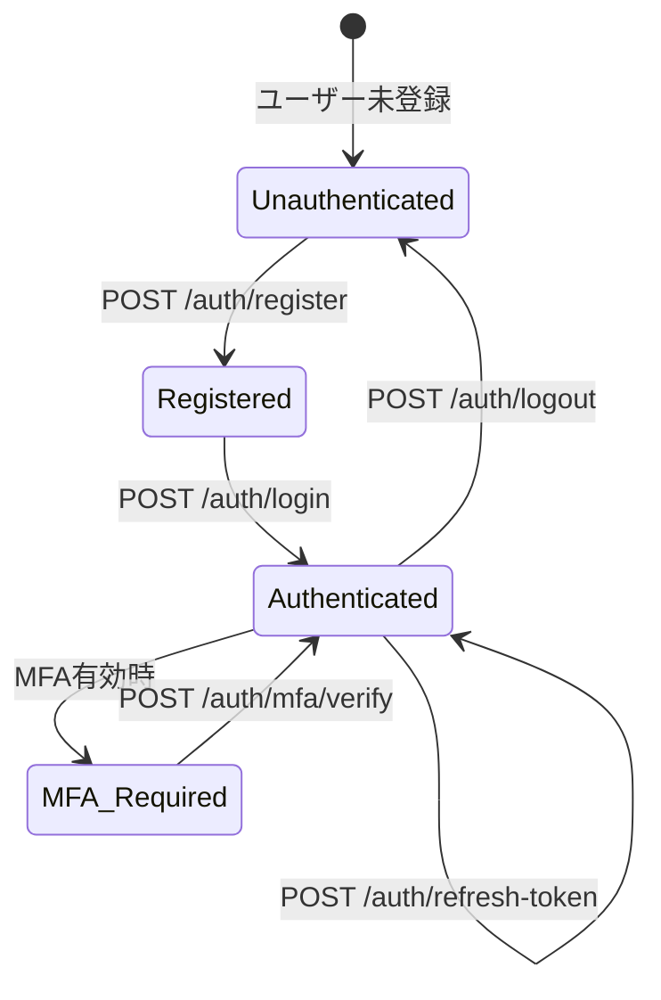

# Authentication API

**BC**: BC-003 - Access Control & Security
**カテゴリ**: Authentication [認証] [AUTHENTICATION]
**最終更新**: 2025-11-01

---

## 目次

1. [概要](#overview)
2. [ユーザー登録](#user-registration)
3. [ログイン](#login)
4. [ログアウト](#logout)
5. [トークン更新](#token-refresh)
6. [MFA管理](#mfa-management)
7. [パスワード管理](#password-management)
8. [セッション管理](#session-management)

---

## 概要 {#overview}

このドキュメントは、BC-003が提供する認証（Authentication）関連のAPI仕様を定義します。

### 認証フロー概要



### セキュリティ原則

1. **パスワードの平文保存禁止**: すべてのパスワードはbcrypt/argon2でハッシュ化
2. **トークン有効期限**: Access Token 30分、Refresh Token 7日間
3. **Brute-force対策**: ログイン試行は10 req/min制限
4. **監査ログ**: すべての認証イベントを記録

---

## ユーザー登録 {#user-registration}

### POST /api/bc-003/auth/register

新規ユーザーを登録します。

#### リクエスト

```json
{
  "email": "user@example.com",
  "username": "john_doe",
  "password": "SecurePass123!",
  "displayName": "John Doe",
  "organizationId": "org-uuid",
  "locale": "ja-JP"
}
```

**パラメータ**:

| フィールド | 型 | 必須 | 説明 | 制約 |
|----------|------|-----|------|------|
| email | string | ✅ | メールアドレス | 有効なメール形式、システム内で一意 |
| username | string | ✅ | ユーザー名 | 3-30文字、英数字とアンダースコアのみ、一意 |
| password | string | ✅ | パスワード | 8文字以上、大小英字・数字・記号を含む |
| displayName | string | ✅ | 表示名 | 1-100文字 |
| organizationId | string | ❌ | 所属組織ID | 有効なUUID |
| locale | string | ❌ | ロケール | en-US, ja-JP等（デフォルト: en-US） |

#### レスポンス（201 Created）

```json
{
  "userId": "user-uuid",
  "email": "user@example.com",
  "username": "john_doe",
  "displayName": "John Doe",
  "status": "inactive",
  "emailVerificationRequired": true,
  "emailVerificationSentAt": "2025-11-01T10:00:00Z",
  "createdAt": "2025-11-01T10:00:00Z"
}
```

**レスポンスフィールド**:

| フィールド | 説明 |
|----------|------|
| userId | 生成されたユーザーID（UUID） |
| status | ユーザーステータス（初期値: `inactive`） |
| emailVerificationRequired | メール認証が必要か（常に`true`） |
| emailVerificationSentAt | 認証メール送信日時 |

#### エラーレスポンス

| HTTPステータス | エラーコード | 説明 | 対処法 |
|-------------|------------|------|--------|
| 400 | BC003_ERR_001 | 無効なメールアドレス形式 | 有効なメール形式を使用 |
| 400 | BC003_ERR_002 | ユーザー名が既に使用されている | 別のユーザー名を選択 |
| 400 | BC003_ERR_003 | メールアドレスが既に使用されている | 別のメールアドレスを使用 |
| 400 | BC003_ERR_004 | パスワードが複雑性要件を満たさない | 8文字以上、大小英字・数字・記号を含む |
| 404 | BC003_ERR_005 | 指定組織が存在しない | 有効な組織IDを指定 |

**エラーレスポンス例**:

```json
{
  "error": {
    "code": "BC003_ERR_004",
    "message": "パスワードが複雑性要件を満たしていません",
    "details": {
      "requirements": {
        "minLength": 8,
        "requireUppercase": true,
        "requireLowercase": true,
        "requireDigit": true,
        "requireSpecialChar": true
      },
      "violations": ["requireSpecialChar"]
    },
    "timestamp": "2025-11-01T10:00:00Z",
    "requestId": "req-uuid"
  }
}
```

#### 認証・権限

- **認証**: 不要（公開エンドポイント）
- **権限**: なし

#### レート制限・SLA

- **レート制限**: 5 req/min（悪用防止）
- **SLA**: p95 < 800ms

#### 備考

- 登録後、ユーザーステータスは`inactive`
- メール認証完了後、`active`に遷移
- 認証メールは登録から24時間有効

---

## ログイン {#login}

### POST /api/bc-003/auth/login

ユーザーを認証し、JWTトークンを発行します。

#### リクエスト

```json
{
  "email": "user@example.com",
  "password": "SecurePass123!",
  "mfaCode": "123456",
  "rememberMe": false
}
```

**パラメータ**:

| フィールド | 型 | 必須 | 説明 |
|----------|------|-----|------|
| email | string | ✅ | メールアドレス |
| password | string | ✅ | パスワード |
| mfaCode | string | ❌ | MFAコード（6桁、MFA有効時は必須） |
| rememberMe | boolean | ❌ | ログイン状態保持（デフォルト: false） |

#### レスポンス（200 OK）- MFA無効の場合

```json
{
  "accessToken": "eyJhbGciOiJSUzI1NiIsInR5cCI6IkpXVCJ9...",
  "refreshToken": "refresh-token-uuid",
  "tokenType": "Bearer",
  "expiresIn": 1800,
  "user": {
    "userId": "user-uuid",
    "email": "user@example.com",
    "username": "john_doe",
    "displayName": "John Doe",
    "roles": ["project_manager", "developer"],
    "mfaEnabled": false
  },
  "sessionId": "session-uuid",
  "issuedAt": "2025-11-01T10:00:00Z"
}
```

#### レスポンス（200 OK）- MFA有効・未検証の場合

```json
{
  "mfaRequired": true,
  "challengeId": "challenge-uuid",
  "mfaMethods": ["totp", "sms"],
  "message": "MFA検証が必要です。/auth/mfa/verify に challengeId と mfaCode を送信してください"
}
```

#### レスポンスフィールド

| フィールド | 説明 |
|----------|------|
| accessToken | JWTアクセストークン（30分有効） |
| refreshToken | リフレッシュトークン（7日間有効、rememberMe=trueなら30日間） |
| expiresIn | トークン有効期限（秒） |
| user | ユーザー情報（roles, permissions含む） |
| sessionId | セッションID |

#### エラーレスポンス

| HTTPステータス | エラーコード | 説明 | 対処法 |
|-------------|------------|------|--------|
| 401 | BC003_ERR_010 | メールアドレスまたはパスワードが無効 | 認証情報を確認 |
| 401 | BC003_ERR_011 | MFAコードが無効 | 正しいMFAコードを入力 |
| 403 | BC003_ERR_012 | ユーザーが無効化されている（status: inactive） | メール認証を完了 |
| 403 | BC003_ERR_013 | ユーザーが停止されている（status: suspended） | 管理者に連絡 |
| 403 | BC003_ERR_014 | アカウントがロックされている | 一定時間後に再試行、または管理者に連絡 |
| 429 | BC003_ERR_429 | レート制限超過 | 一定時間後に再試行 |

**エラーレスポンス例**:

```json
{
  "error": {
    "code": "BC003_ERR_014",
    "message": "アカウントがロックされています。5回連続でログインに失敗しました",
    "details": {
      "lockedAt": "2025-11-01T09:50:00Z",
      "lockDuration": 1800,
      "unlockAt": "2025-11-01T10:20:00Z",
      "remainingSeconds": 1200
    },
    "timestamp": "2025-11-01T10:00:00Z",
    "requestId": "req-uuid"
  }
}
```

#### 認証・権限

- **認証**: 不要（公開エンドポイント）
- **権限**: なし

#### レート制限・SLA

- **レート制限**: 10 req/min（Brute-force攻撃対策）
- **SLA**: p95 < 500ms

#### セキュリティ機能

1. **ログイン失敗回数制限**: 5回連続失敗でアカウントロック（30分間）
2. **不審なアクティビティ検知**:
   - 異常な地理的位置からのアクセス
   - 異常な時間帯のアクセス
   - 未知のユーザーエージェント
3. **監査ログ記録**: すべてのログイン試行を記録

---

## ログアウト {#logout}

### POST /api/bc-003/auth/logout

現在のセッションを無効化します。

#### リクエスト

```json
{
  "allSessions": false
}
```

**パラメータ**:

| フィールド | 型 | 必須 | 説明 |
|----------|------|-----|------|
| allSessions | boolean | ❌ | 全セッションを無効化するか（デフォルト: false） |

#### レスポンス（200 OK）

```json
{
  "message": "ログアウトしました",
  "sessionId": "session-uuid",
  "invalidatedAt": "2025-11-01T10:00:00Z",
  "invalidatedSessionsCount": 1
}
```

#### エラーレスポンス

| HTTPステータス | エラーコード | 説明 |
|-------------|------------|------|
| 401 | BC003_ERR_020 | 無効なトークン |
| 404 | BC003_ERR_021 | セッションが存在しない |

#### 認証・権限

- **認証**: Bearer Token必須
- **権限**: なし（自身のセッション無効化のみ）

#### レート制限・SLA

- **レート制限**: 30 req/min
- **SLA**: p95 < 200ms

---

## トークン更新 {#token-refresh}

### POST /api/bc-003/auth/refresh-token

Refresh Tokenを使用して新しいAccess Tokenを取得します。

#### リクエスト

```json
{
  "refreshToken": "refresh-token-uuid"
}
```

#### レスポンス（200 OK）

```json
{
  "accessToken": "eyJhbGciOiJSUzI1NiIsInR5cCI6IkpXVCJ9...",
  "refreshToken": "new-refresh-token-uuid",
  "tokenType": "Bearer",
  "expiresIn": 1800,
  "issuedAt": "2025-11-01T10:00:00Z"
}
```

#### エラーレスポンス

| HTTPステータス | エラーコード | 説明 | 対処法 |
|-------------|------------|------|--------|
| 401 | BC003_ERR_030 | Refresh Tokenが無効 | 再ログイン |
| 401 | BC003_ERR_031 | Refresh Tokenの有効期限切れ | 再ログイン |
| 403 | BC003_ERR_032 | セッションが無効化されている | 再ログイン |

#### 認証・権限

- **認証**: Refresh Token必須
- **権限**: なし

#### レート制限・SLA

- **レート制限**: 20 req/min
- **SLA**: p95 < 300ms

#### 備考

- Refresh Token使用時、新しいRefresh Tokenが発行される（トークンローテーション）
- 古いRefresh Tokenは即座に無効化

---

## MFA管理 {#mfa-management}

### POST /api/bc-003/auth/mfa/setup

多要素認証（MFA）を設定します。

#### リクエスト

```json
{
  "method": "totp",
  "phoneNumber": "+81-90-1234-5678"
}
```

**パラメータ**:

| フィールド | 型 | 必須 | 説明 |
|----------|------|-----|------|
| method | string | ✅ | MFA方式（`totp`, `sms`） |
| phoneNumber | string | ❌ | 電話番号（SMS方式の場合必須） |

#### レスポンス（200 OK）- TOTP方式

```json
{
  "method": "totp",
  "secret": "JBSWY3DPEHPK3PXP",
  "qrCodeUrl": "data:image/png;base64,iVBORw0KGgoAAAANSUhEUgAA...",
  "backupCodes": [
    "12345678",
    "23456789",
    "34567890",
    "45678901",
    "56789012"
  ],
  "setupCompleted": false,
  "message": "認証アプリでQRコードをスキャンし、/auth/mfa/verify でコードを検証してセットアップを完了してください"
}
```

#### レスポンス（200 OK）- SMS方式

```json
{
  "method": "sms",
  "phoneNumber": "+81-90-****-5678",
  "verificationCodeSent": true,
  "setupCompleted": false,
  "message": "SMSで送信された6桁のコードを /auth/mfa/verify で検証してセットアップを完了してください"
}
```

#### エラーレスポンス

| HTTPステータス | エラーコード | 説明 |
|-------------|------------|------|
| 400 | BC003_ERR_040 | 無効なMFA方式 |
| 400 | BC003_ERR_041 | SMS方式で電話番号が未指定 |
| 409 | BC003_ERR_042 | MFAは既に有効化されている |

#### 認証・権限

- **認証**: Bearer Token必須
- **権限**: なし（自身のMFA設定のみ）

#### レート制限・SLA

- **レート制限**: 5 req/min
- **SLA**: p95 < 600ms

---

### POST /api/bc-003/auth/mfa/verify

MFAコードを検証します（セットアップ完了またはログイン時の検証）。

#### リクエスト

```json
{
  "mfaCode": "123456",
  "challengeId": "challenge-uuid"
}
```

**パラメータ**:

| フィールド | 型 | 必須 | 説明 |
|----------|------|-----|------|
| mfaCode | string | ✅ | 6桁のMFAコード |
| challengeId | string | ❌ | チャレンジID（ログイン時のMFA検証に必要） |

#### レスポンス（200 OK）- セットアップ完了

```json
{
  "verified": true,
  "mfaEnabled": true,
  "method": "totp",
  "enabledAt": "2025-11-01T10:00:00Z",
  "message": "MFAが有効化されました"
}
```

#### レスポンス（200 OK）- ログイン時の検証成功

```json
{
  "verified": true,
  "accessToken": "eyJhbGciOiJSUzI1NiIsInR5cCI6IkpXVCJ9...",
  "refreshToken": "refresh-token-uuid",
  "tokenType": "Bearer",
  "expiresIn": 1800,
  "user": {
    "userId": "user-uuid",
    "email": "user@example.com",
    "displayName": "John Doe",
    "roles": ["project_manager"]
  }
}
```

#### エラーレスポンス

| HTTPステータス | エラーコード | 説明 |
|-------------|------------|------|
| 400 | BC003_ERR_050 | MFAコードが無効 |
| 400 | BC003_ERR_051 | MFAコードの形式が不正（6桁の数字が必要） |
| 404 | BC003_ERR_052 | チャレンジIDが存在しない |
| 410 | BC003_ERR_053 | チャレンジIDの有効期限切れ（5分） |

#### 認証・権限

- **認証**: セットアップ時はBearer Token必須、ログイン時は不要
- **権限**: なし

#### レート制限・SLA

- **レート制限**: 10 req/min
- **SLA**: p95 < 400ms

---

### DELETE /api/bc-003/auth/mfa

MFAを無効化します。

#### リクエスト

```json
{
  "password": "SecurePass123!",
  "reason": "MFAデバイスを紛失したため"
}
```

#### レスポンス（200 OK）

```json
{
  "mfaEnabled": false,
  "disabledAt": "2025-11-01T10:00:00Z",
  "message": "MFAが無効化されました"
}
```

#### エラーレスポンス

| HTTPステータス | エラーコード | 説明 |
|-------------|------------|------|
| 401 | BC003_ERR_060 | パスワードが無効 |
| 404 | BC003_ERR_061 | MFAが有効化されていない |

#### 認証・権限

- **認証**: Bearer Token必須
- **権限**: なし（自身のMFA無効化のみ）

#### レート制限・SLA

- **レート制限**: 5 req/min
- **SLA**: p95 < 400ms

---

## パスワード管理 {#password-management}

### POST /api/bc-003/auth/password/reset

パスワードリセットリクエストを送信します（メールでリセットリンクを送信）。

#### リクエスト

```json
{
  "email": "user@example.com"
}
```

#### レスポンス（200 OK）

```json
{
  "message": "パスワードリセットメールを送信しました",
  "emailSentTo": "u***@example.com",
  "resetTokenExpiresIn": 3600,
  "sentAt": "2025-11-01T10:00:00Z"
}
```

#### エラーレスポンス

**セキュリティ上、ユーザーが存在しない場合でも同じレスポンスを返す**（列挙攻撃対策）

#### 認証・権限

- **認証**: 不要（公開エンドポイント）
- **権限**: なし

#### レート制限・SLA

- **レート制限**: 3 req/min（悪用防止）
- **SLA**: p95 < 800ms

---

### POST /api/bc-003/auth/password/reset/confirm

リセットトークンを使用して新しいパスワードを設定します。

#### リクエスト

```json
{
  "resetToken": "reset-token-uuid",
  "newPassword": "NewSecurePass456!"
}
```

#### レスポンス（200 OK）

```json
{
  "message": "パスワードがリセットされました",
  "resetAt": "2025-11-01T10:00:00Z"
}
```

#### エラーレスポンス

| HTTPステータス | エラーコード | 説明 |
|-------------|------------|------|
| 400 | BC003_ERR_070 | リセットトークンが無効 |
| 400 | BC003_ERR_071 | リセットトークンの有効期限切れ（1時間） |
| 400 | BC003_ERR_072 | 新しいパスワードが複雑性要件を満たさない |

#### 認証・権限

- **認証**: 不要（リセットトークンで認証）
- **権限**: なし

#### レート制限・SLA

- **レート制限**: 10 req/min
- **SLA**: p95 < 600ms

---

### POST /api/bc-003/auth/password/change

ログイン中のユーザーがパスワードを変更します。

#### リクエスト

```json
{
  "currentPassword": "SecurePass123!",
  "newPassword": "NewSecurePass456!"
}
```

#### レスポンス（200 OK）

```json
{
  "message": "パスワードが変更されました",
  "changedAt": "2025-11-01T10:00:00Z",
  "allSessionsInvalidated": true
}
```

#### エラーレスポンス

| HTTPステータス | エラーコード | 説明 |
|-------------|------------|------|
| 401 | BC003_ERR_080 | 現在のパスワードが無効 |
| 400 | BC003_ERR_081 | 新しいパスワードが複雑性要件を満たさない |
| 400 | BC003_ERR_082 | 新しいパスワードが過去3つのパスワードと同じ |

#### 認証・権限

- **認証**: Bearer Token必須
- **権限**: なし（自身のパスワード変更のみ）

#### レート制限・SLA

- **レート制限**: 5 req/min
- **SLA**: p95 < 600ms

#### 備考

- パスワード変更後、すべてのセッションが無効化される（セキュリティ強化）
- ユーザーは再ログインが必要

---

## セッション管理 {#session-management}

### GET /api/bc-003/auth/sessions

現在のユーザーのアクティブセッション一覧を取得します。

#### レスポンス（200 OK）

```json
{
  "sessions": [
    {
      "sessionId": "session-uuid-1",
      "deviceInfo": {
        "userAgent": "Mozilla/5.0 (Windows NT 10.0; Win64; x64)...",
        "deviceType": "desktop",
        "browser": "Chrome",
        "os": "Windows 10"
      },
      "ipAddress": "203.0.113.45",
      "location": {
        "country": "Japan",
        "city": "Tokyo"
      },
      "createdAt": "2025-11-01T09:00:00Z",
      "lastAccessedAt": "2025-11-01T10:00:00Z",
      "expiresAt": "2025-11-08T09:00:00Z",
      "isCurrent": true
    },
    {
      "sessionId": "session-uuid-2",
      "deviceInfo": {
        "userAgent": "Mobile Safari...",
        "deviceType": "mobile",
        "browser": "Safari",
        "os": "iOS 17"
      },
      "ipAddress": "198.51.100.20",
      "location": {
        "country": "Japan",
        "city": "Osaka"
      },
      "createdAt": "2025-10-30T14:00:00Z",
      "lastAccessedAt": "2025-10-31T20:00:00Z",
      "expiresAt": "2025-11-06T14:00:00Z",
      "isCurrent": false
    }
  ],
  "totalSessions": 2,
  "maxSessions": 5
}
```

#### 認証・権限

- **認証**: Bearer Token必須
- **権限**: なし（自身のセッション閲覧のみ）

#### レート制限・SLA

- **レート制限**: 30 req/min
- **SLA**: p95 < 300ms

---

### DELETE /api/bc-003/auth/sessions/{sessionId}

指定したセッションを無効化します。

#### パスパラメータ

- `sessionId` (UUID, 必須): セッションID

#### レスポンス（204 No Content）

Bodyなし

#### エラーレスポンス

| HTTPステータス | エラーコード | 説明 |
|-------------|------------|------|
| 404 | BC003_ERR_090 | セッションが存在しない |
| 403 | BC003_ERR_091 | 他人のセッションを無効化する権限なし |

#### 認証・権限

- **認証**: Bearer Token必須
- **権限**: なし（自身のセッション無効化のみ）

#### レート制限・SLA

- **レート制限**: 20 req/min
- **SLA**: p95 < 200ms

---

## 関連ドキュメント

- [README.md](./README.md) - API設計概要
- [authorization-api.md](./authorization-api.md) - 認可API
- [user-management-api.md](./user-management-api.md) - ユーザー管理API
- [error-handling.md](./error-handling.md) - エラーハンドリング
- [rate-limiting-sla.md](./rate-limiting-sla.md) - レート制限とSLA

---

**ステータス**: Phase 2.2 - BC-003 Authentication API完成
**最終更新**: 2025-11-01
