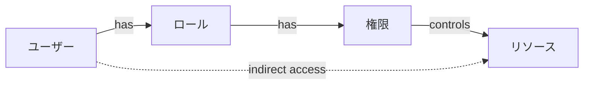

# Authorization API

**BC**: BC-003 - Access Control & Security
**カテゴリ**: Authorization [認可] [AUTHORIZATION]
**最終更新**: 2025-11-01

---

## 目次

1. [概要](#overview)
2. [ロール管理](#role-management)
3. [権限管理](#permission-management)
4. [アクセス制御チェック](#access-control-check)
5. [BC間連携API](#cross-bc-integration)

---

## 概要 {#overview}

このドキュメントは、BC-003が提供する認可（Authorization）関連のAPI仕様を定義します。

### 認可モデル

BC-003は**ロールベースアクセス制御（RBAC）**を採用:



### ロール階層

```
system_admin (全権限)
├── security_admin (セキュリティ管理)
│   └── auditor (監査)
└── org_admin (組織管理)
    └── project_manager (プロジェクト管理)
        └── developer (開発)
            └── viewer (閲覧のみ)
```

### 権限スコープ形式

権限は `{resource}:{action}` の形式:
- リソース: `user`, `role`, `permission`, `project`, `org`, `team`, `audit`, `security`
- アクション: `read`, `write`, `delete`, `manage`, `approve`, `*`

**例**:
- `project:read` - プロジェクト閲覧
- `role:manage` - ロール管理（作成・更新・削除・権限割当）
- `*:*` - 全リソース・全操作

---

## ロール管理 {#role-management}

### GET /api/bc-003/roles

ロール一覧を取得します。

#### クエリパラメータ

| パラメータ | 型 | 必須 | 説明 |
|----------|------|-----|------|
| includePermissions | boolean | ❌ | 権限詳細を含めるか（デフォルト: false） |
| includeUserCount | boolean | ❌ | 各ロールのユーザー数を含めるか（デフォルト: false） |
| isSystem | boolean | ❌ | システムロールのみフィルタ（デフォルト: 全て） |
| page | integer | ❌ | ページ番号（デフォルト: 1） |
| pageSize | integer | ❌ | ページサイズ（デフォルト: 20, 最大: 100） |

#### レスポンス（200 OK）

```json
{
  "roles": [
    {
      "roleId": "role-uuid-1",
      "name": "project_manager",
      "displayName": "プロジェクトマネージャー",
      "description": "プロジェクトの計画・実行・監視を行う",
      "isSystem": false,
      "permissions": [
        {
          "permissionId": "perm-uuid-1",
          "scope": "project:read"
        },
        {
          "permissionId": "perm-uuid-2",
          "scope": "project:write"
        },
        {
          "permissionId": "perm-uuid-3",
          "scope": "team:read"
        }
      ],
      "userCount": 25,
      "parentRoleId": "role-uuid-org-admin",
      "createdAt": "2025-01-15T10:00:00Z",
      "updatedAt": "2025-10-01T14:00:00Z"
    },
    {
      "roleId": "role-uuid-2",
      "name": "developer",
      "displayName": "開発者",
      "description": "プロジェクトの開発作業を実施",
      "isSystem": false,
      "permissions": [
        {
          "permissionId": "perm-uuid-1",
          "scope": "project:read"
        },
        {
          "permissionId": "perm-uuid-4",
          "scope": "project:write"
        }
      ],
      "userCount": 120,
      "parentRoleId": "role-uuid-project-manager",
      "createdAt": "2025-01-15T10:00:00Z",
      "updatedAt": "2025-09-20T09:00:00Z"
    }
  ],
  "pagination": {
    "currentPage": 1,
    "pageSize": 20,
    "totalItems": 12,
    "totalPages": 1
  }
}
```

#### 認証・権限

- **認証**: Bearer Token必須
- **権限**: `role:read`

#### レート制限・SLA

- **レート制限**: 100 req/min
- **SLA**: p95 < 400ms

---

### POST /api/bc-003/roles

新しいロールを作成します。

#### リクエスト

```json
{
  "name": "senior_developer",
  "displayName": "シニア開発者",
  "description": "高度な技術的判断を行う上級開発者",
  "parentRoleId": "role-uuid-developer",
  "permissions": [
    "project:read",
    "project:write",
    "code:review",
    "architecture:design"
  ]
}
```

**パラメータ**:

| フィールド | 型 | 必須 | 説明 | 制約 |
|----------|------|-----|------|------|
| name | string | ✅ | ロール名（識別子） | 3-50文字、英数字とアンダースコアのみ、一意 |
| displayName | string | ✅ | 表示名 | 1-100文字 |
| description | string | ❌ | 説明 | 最大500文字 |
| parentRoleId | string | ❌ | 親ロールID（階層構造） | 有効なUUID |
| permissions | array | ❌ | 権限スコープのリスト | 有効な権限スコープ |

#### レスポンス（201 Created）

```json
{
  "roleId": "role-uuid-new",
  "name": "senior_developer",
  "displayName": "シニア開発者",
  "description": "高度な技術的判断を行う上級開発者",
  "isSystem": false,
  "permissions": [
    {
      "permissionId": "perm-uuid-5",
      "scope": "project:read",
      "grantedAt": "2025-11-01T10:00:00Z"
    },
    {
      "permissionId": "perm-uuid-6",
      "scope": "project:write",
      "grantedAt": "2025-11-01T10:00:00Z"
    },
    {
      "permissionId": "perm-uuid-7",
      "scope": "code:review",
      "grantedAt": "2025-11-01T10:00:00Z"
    },
    {
      "permissionId": "perm-uuid-8",
      "scope": "architecture:design",
      "grantedAt": "2025-11-01T10:00:00Z"
    }
  ],
  "parentRoleId": "role-uuid-developer",
  "createdAt": "2025-11-01T10:00:00Z",
  "createdBy": "user-uuid-admin"
}
```

#### エラーレスポンス

| HTTPステータス | エラーコード | 説明 | 対処法 |
|-------------|------------|------|--------|
| 400 | BC003_ERR_100 | ロール名が既に存在 | 別のロール名を使用 |
| 400 | BC003_ERR_101 | 無効な権限スコープ | 有効な権限スコープを指定 |
| 404 | BC003_ERR_102 | 親ロールが存在しない | 有効な親ロールIDを指定 |
| 400 | BC003_ERR_103 | 循環参照が発生（親ロール階層） | 親ロールを修正 |

#### 認証・権限

- **認証**: Bearer Token必須
- **権限**: `role:manage`

#### レート制限・SLA

- **レート制限**: 30 req/min
- **SLA**: p95 < 600ms

---

### GET /api/bc-003/roles/{roleId}

ロール詳細を取得します。

#### パスパラメータ

- `roleId` (UUID, 必須): ロールID

#### クエリパラメータ

| パラメータ | 型 | 必須 | 説明 |
|----------|------|-----|------|
| includeInheritedPermissions | boolean | ❌ | 親ロールから継承した権限を含めるか（デフォルト: false） |
| includeUsers | boolean | ❌ | このロールを持つユーザー一覧を含めるか（デフォルト: false） |

#### レスポンス（200 OK）

```json
{
  "roleId": "role-uuid",
  "name": "project_manager",
  "displayName": "プロジェクトマネージャー",
  "description": "プロジェクトの計画・実行・監視を行う",
  "isSystem": false,
  "permissions": [
    {
      "permissionId": "perm-uuid-1",
      "scope": "project:read",
      "inherited": false
    },
    {
      "permissionId": "perm-uuid-2",
      "scope": "project:write",
      "inherited": false
    },
    {
      "permissionId": "perm-uuid-3",
      "scope": "team:read",
      "inherited": true,
      "inheritedFrom": "role-uuid-org-admin"
    }
  ],
  "parentRoleId": "role-uuid-org-admin",
  "childRoles": [
    {
      "roleId": "role-uuid-developer",
      "name": "developer",
      "displayName": "開発者"
    }
  ],
  "users": [
    {
      "userId": "user-uuid-1",
      "email": "manager1@example.com",
      "displayName": "Manager One",
      "assignedAt": "2025-06-01T10:00:00Z"
    }
  ],
  "userCount": 25,
  "createdAt": "2025-01-15T10:00:00Z",
  "updatedAt": "2025-10-01T14:00:00Z",
  "createdBy": "user-uuid-admin"
}
```

#### エラーレスポンス

| HTTPステータス | エラーコード | 説明 |
|-------------|------------|------|
| 404 | BC003_ERR_110 | ロールが存在しない |
| 403 | BC003_ERR_111 | ロール閲覧権限なし |

#### 認証・権限

- **認証**: Bearer Token必須
- **権限**: `role:read`

#### レート制限・SLA

- **レート制限**: 100 req/min
- **SLA**: p95 < 300ms

---

### PUT /api/bc-003/roles/{roleId}

ロールを更新します。

#### パスパラメータ

- `roleId` (UUID, 必須): ロールID

#### リクエスト

```json
{
  "displayName": "プロジェクトマネージャー（更新）",
  "description": "プロジェクトの計画・実行・監視・評価を行う",
  "parentRoleId": "role-uuid-new-parent"
}
```

#### レスポンス（200 OK）

GET /roles/{roleId} と同形式

#### エラーレスポンス

| HTTPステータス | エラーコード | 説明 | 対処法 |
|-------------|------------|------|--------|
| 404 | BC003_ERR_110 | ロールが存在しない | 有効なロールIDを指定 |
| 400 | BC003_ERR_120 | システムロールは変更不可 | システムロールは保護されている |
| 400 | BC003_ERR_103 | 循環参照が発生 | 親ロールを修正 |

#### 認証・権限

- **認証**: Bearer Token必須
- **権限**: `role:manage`

#### レート制限・SLA

- **レート制限**: 30 req/min
- **SLA**: p95 < 500ms

---

### DELETE /api/bc-003/roles/{roleId}

ロールを削除します。

#### パスパラメータ

- `roleId` (UUID, 必須): ロールID

#### レスポンス（204 No Content）

Bodyなし

#### エラーレスポンス

| HTTPステータス | エラーコード | 説明 | 対処法 |
|-------------|------------|------|--------|
| 404 | BC003_ERR_110 | ロールが存在しない | 有効なロールIDを指定 |
| 400 | BC003_ERR_130 | システムロールは削除不可 | システムロールは保護されている |
| 409 | BC003_ERR_131 | ロールが使用中（ユーザーに割り当てられている） | ユーザーから削除後に再試行 |
| 409 | BC003_ERR_132 | 子ロールが存在 | 子ロールを削除または再配置 |

#### 認証・権限

- **認証**: Bearer Token必須
- **権限**: `role:manage`

#### レート制限・SLA

- **レート制限**: 10 req/min
- **SLA**: p95 < 400ms

---

## 権限管理 {#permission-management}

### GET /api/bc-003/permissions

利用可能な権限一覧を取得します。

#### クエリパラメータ

| パラメータ | 型 | 必須 | 説明 |
|----------|------|-----|------|
| resource | string | ❌ | リソースでフィルタ（例: `project`, `user`） |
| action | string | ❌ | アクションでフィルタ（例: `read`, `write`） |

#### レスポンス（200 OK）

```json
{
  "permissions": [
    {
      "permissionId": "perm-uuid-1",
      "scope": "project:read",
      "resource": "project",
      "action": "read",
      "displayName": "プロジェクト閲覧",
      "description": "プロジェクト情報を閲覧できる"
    },
    {
      "permissionId": "perm-uuid-2",
      "scope": "project:write",
      "resource": "project",
      "action": "write",
      "displayName": "プロジェクト編集",
      "description": "プロジェクト情報を作成・更新できる"
    },
    {
      "permissionId": "perm-uuid-3",
      "scope": "project:delete",
      "resource": "project",
      "action": "delete",
      "displayName": "プロジェクト削除",
      "description": "プロジェクトを削除できる"
    },
    {
      "permissionId": "perm-uuid-4",
      "scope": "user:manage",
      "resource": "user",
      "action": "manage",
      "displayName": "ユーザー管理",
      "description": "ユーザーを作成・更新・削除・ロール割当できる"
    }
  ],
  "groupedByResource": {
    "project": [
      { "scope": "project:read", "displayName": "プロジェクト閲覧" },
      { "scope": "project:write", "displayName": "プロジェクト編集" },
      { "scope": "project:delete", "displayName": "プロジェクト削除" }
    ],
    "user": [
      { "scope": "user:read", "displayName": "ユーザー閲覧" },
      { "scope": "user:write", "displayName": "ユーザー編集" },
      { "scope": "user:manage", "displayName": "ユーザー管理" }
    ],
    "role": [
      { "scope": "role:read", "displayName": "ロール閲覧" },
      { "scope": "role:manage", "displayName": "ロール管理" }
    ]
  },
  "totalPermissions": 45
}
```

#### 認証・権限

- **認証**: Bearer Token必須
- **権限**: `role:read` または `permission:read`

#### レート制限・SLA

- **レート制限**: 100 req/min
- **SLA**: p95 < 300ms

---

### POST /api/bc-003/roles/{roleId}/permissions

ロールに権限を割り当てます。

#### パスパラメータ

- `roleId` (UUID, 必須): ロールID

#### リクエスト

```json
{
  "permissions": [
    "project:approve",
    "budget:read",
    "budget:write"
  ]
}
```

**パラメータ**:

| フィールド | 型 | 必須 | 説明 |
|----------|------|-----|------|
| permissions | array | ✅ | 権限スコープのリスト |

#### レスポンス（200 OK）

```json
{
  "roleId": "role-uuid",
  "addedPermissions": [
    {
      "permissionId": "perm-uuid-10",
      "scope": "project:approve",
      "grantedAt": "2025-11-01T10:00:00Z"
    },
    {
      "permissionId": "perm-uuid-11",
      "scope": "budget:read",
      "grantedAt": "2025-11-01T10:00:00Z"
    },
    {
      "permissionId": "perm-uuid-12",
      "scope": "budget:write",
      "grantedAt": "2025-11-01T10:00:00Z"
    }
  ],
  "totalPermissions": 8
}
```

#### エラーレスポンス

| HTTPステータス | エラーコード | 説明 | 対処法 |
|-------------|------------|------|--------|
| 404 | BC003_ERR_110 | ロールが存在しない | 有効なロールIDを指定 |
| 400 | BC003_ERR_140 | 無効な権限スコープ | 有効な権限スコープを指定 |
| 400 | BC003_ERR_120 | システムロールの権限は変更不可 | システムロールは保護されている |
| 409 | BC003_ERR_141 | 一部の権限は既に割り当て済み | 未割り当ての権限のみ指定 |

#### 認証・権限

- **認証**: Bearer Token必須
- **権限**: `role:manage`

#### レート制限・SLA

- **レート制限**: 50 req/min
- **SLA**: p95 < 500ms

---

### DELETE /api/bc-003/roles/{roleId}/permissions/{permissionId}

ロールから権限を削除します。

#### パスパラメータ

- `roleId` (UUID, 必須): ロールID
- `permissionId` (UUID, 必須): 権限ID

#### レスポンス（204 No Content）

Bodyなし

#### エラーレスポンス

| HTTPステータス | エラーコード | 説明 |
|-------------|------------|------|
| 404 | BC003_ERR_110 | ロールが存在しない |
| 404 | BC003_ERR_150 | 権限が存在しない、またはロールに割り当てられていない |
| 400 | BC003_ERR_120 | システムロールの権限は変更不可 |

#### 認証・権限

- **認証**: Bearer Token必須
- **権限**: `role:manage`

#### レート制限・SLA

- **レート制限**: 50 req/min
- **SLA**: p95 < 400ms

---

## アクセス制御チェック {#access-control-check}

### POST /api/bc-003/auth/check-permission

ユーザーが特定の権限を持っているかをチェックします（主にBC間連携で使用）。

#### リクエスト

```json
{
  "userId": "user-uuid",
  "permission": "project:write",
  "resourceId": "project-uuid",
  "resourceType": "project"
}
```

**パラメータ**:

| フィールド | 型 | 必須 | 説明 |
|----------|------|-----|------|
| userId | string | ✅ | ユーザーID |
| permission | string | ✅ | チェックする権限スコープ |
| resourceId | string | ❌ | リソースID（リソースレベルのアクセス制御用） |
| resourceType | string | ❌ | リソースタイプ（例: `project`, `organization`） |

#### レスポンス（200 OK）- 権限あり

```json
{
  "granted": true,
  "userId": "user-uuid",
  "permission": "project:write",
  "grantedBy": [
    {
      "roleId": "role-uuid-pm",
      "roleName": "project_manager",
      "source": "direct"
    }
  ],
  "checkedAt": "2025-11-01T10:00:00Z"
}
```

#### レスポンス（200 OK）- 権限なし

```json
{
  "granted": false,
  "userId": "user-uuid",
  "permission": "project:delete",
  "reason": "User does not have role with permission 'project:delete'",
  "requiredRoles": ["system_admin", "security_admin"],
  "userRoles": ["developer"],
  "checkedAt": "2025-11-01T10:00:00Z"
}
```

#### エラーレスポンス

| HTTPステータス | エラーコード | 説明 |
|-------------|------------|------|
| 404 | BC003_ERR_200 | ユーザーが存在しない |
| 400 | BC003_ERR_201 | 無効な権限スコープ |

#### 認証・権限

- **認証**: Bearer Token必須（BC間サービスアカウント）
- **権限**: `auth:validate`（BC間連携専用権限）

#### レート制限・SLA

- **レート制限**: 500 req/min（BC間通信のため高め）
- **SLA**: p95 < 100ms（高速レスポンス必須）

#### 使用例

他のBCがこのAPIを使用してアクセス制御を実施:

```typescript
// BC-001（Project Delivery）での使用例
async function canUserEditProject(userId: string, projectId: string): Promise<boolean> {
  const response = await fetch('https://api.example.com/api/bc-003/auth/check-permission', {
    method: 'POST',
    headers: {
      'Authorization': `Bearer ${BC_SERVICE_TOKEN}`,
      'Content-Type': 'application/json'
    },
    body: JSON.stringify({
      userId,
      permission: 'project:write',
      resourceId: projectId,
      resourceType: 'project'
    })
  });

  const data = await response.json();
  return data.granted;
}
```

---

### GET /api/bc-003/users/{userId}/effective-permissions

ユーザーの実効権限（全ロールから継承した権限）を取得します。

#### パスパラメータ

- `userId` (UUID, 必須): ユーザーID

#### クエリパラメータ

| パラメータ | 型 | 必須 | 説明 |
|----------|------|-----|------|
| resource | string | ❌ | リソースでフィルタ（例: `project`） |

#### レスポンス（200 OK）

```json
{
  "userId": "user-uuid",
  "email": "user@example.com",
  "roles": [
    {
      "roleId": "role-uuid-pm",
      "name": "project_manager",
      "displayName": "プロジェクトマネージャー"
    },
    {
      "roleId": "role-uuid-dev",
      "name": "developer",
      "displayName": "開発者"
    }
  ],
  "effectivePermissions": [
    {
      "scope": "project:read",
      "grantedBy": [
        {
          "roleId": "role-uuid-pm",
          "roleName": "project_manager"
        },
        {
          "roleId": "role-uuid-dev",
          "roleName": "developer"
        }
      ]
    },
    {
      "scope": "project:write",
      "grantedBy": [
        {
          "roleId": "role-uuid-pm",
          "roleName": "project_manager"
        }
      ]
    },
    {
      "scope": "team:read",
      "grantedBy": [
        {
          "roleId": "role-uuid-pm",
          "roleName": "project_manager"
        }
      ]
    }
  ],
  "totalPermissions": 12,
  "calculatedAt": "2025-11-01T10:00:00Z"
}
```

#### エラーレスポンス

| HTTPステータス | エラーコード | 説明 |
|-------------|------------|------|
| 404 | BC003_ERR_200 | ユーザーが存在しない |
| 403 | BC003_ERR_202 | 他人の権限閲覧権限なし |

#### 認証・権限

- **認証**: Bearer Token必須
- **権限**: `user:read`（自身の権限閲覧は権限不要）

#### レート制限・SLA

- **レート制限**: 100 req/min
- **SLA**: p95 < 400ms

---

## BC間連携API {#cross-bc-integration}

### POST /api/bc-003/auth/validate-token

JWTトークンを検証します（BC間連携専用）。

#### リクエスト

```json
{
  "token": "eyJhbGciOiJSUzI1NiIsInR5cCI6IkpXVCJ9..."
}
```

#### レスポンス（200 OK）

```json
{
  "valid": true,
  "claims": {
    "sub": "user-uuid",
    "email": "user@example.com",
    "roles": ["project_manager", "developer"],
    "permissions": [
      "project:read",
      "project:write",
      "team:read"
    ],
    "sessionId": "session-uuid",
    "iat": 1730448000,
    "exp": 1730449800,
    "iss": "bc-003-auth-service",
    "aud": "consulting-platform"
  }
}
```

#### レスポンス（200 OK）- トークン無効

```json
{
  "valid": false,
  "error": "TOKEN_EXPIRED",
  "message": "トークンの有効期限が切れています",
  "expiredAt": "2025-11-01T09:30:00Z"
}
```

**エラー種別**:

| エラー | 説明 |
|-------|------|
| TOKEN_EXPIRED | トークンの有効期限切れ |
| INVALID_SIGNATURE | 署名が無効 |
| TOKEN_REVOKED | トークンが失効済み |
| MALFORMED_TOKEN | トークン形式が不正 |
| SESSION_INVALIDATED | セッションが無効化されている |

#### 認証・権限

- **認証**: BC間サービスアカウント（特別なAPIキー）
- **権限**: `auth:validate`

#### レート制限・SLA

- **レート制限**: 500 req/min
- **SLA**: p95 < 100ms

---

## 関連ドキュメント

- [README.md](./README.md) - API設計概要
- [authentication-api.md](./authentication-api.md) - 認証API
- [user-management-api.md](./user-management-api.md) - ユーザー管理API
- [error-handling.md](./error-handling.md) - エラーハンドリング
- [rate-limiting-sla.md](./rate-limiting-sla.md) - レート制限とSLA

---

**ステータス**: Phase 2.2 - BC-003 Authorization API完成
**最終更新**: 2025-11-01
