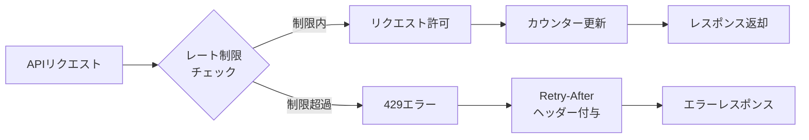

# Rate Limiting & SLA

**BC**: BC-003 - Access Control & Security
**カテゴリ**: Rate Limiting & SLA [レート制限とSLA] [RATE_LIMITING_SLA]
**最終更新**: 2025-11-01

---

## 目次

1. [概要](#overview)
2. [レート制限](#rate-limiting)
3. [SLA（Service Level Agreement）](#sla)
4. [モニタリングとアラート](#monitoring-alerting)

---

## 概要 {#overview}

BC-003は、セキュリティ基盤として高い可用性とパフォーマンスが求められます。このドキュメントでは、レート制限とSLA（サービスレベル保証）の詳細を定義します。

### 設計原則

1. **可用性優先**: 99.9%の可用性を保証（セキュリティ基盤のため）
2. **レート制限**: Brute-force攻撃やDDoS攻撃からの保護
3. **公平性**: すべてのクライアントに公平なリソース配分
4. **透明性**: レート制限状況をレスポンスヘッダーで通知

---

## レート制限 {#rate-limiting}

### レート制限の仕組み

BC-003は**Sliding Window**方式のレート制限を採用:



**Sliding Window方式の特徴**:
- 過去N分間のリクエスト数をカウント
- 固定ウィンドウ方式より精度が高い
- バースト的なトラフィックにも対応

### レート制限ヘッダー

すべてのレスポンスに以下のヘッダーが含まれます:

```http
X-RateLimit-Limit: 100
X-RateLimit-Remaining: 95
X-RateLimit-Reset: 1730448060
X-RateLimit-Window: 60
```

| ヘッダー | 説明 |
|---------|------|
| X-RateLimit-Limit | 制限値（リクエスト数） |
| X-RateLimit-Remaining | 残りリクエスト数 |
| X-RateLimit-Reset | 制限リセット時刻（UNIXタイムスタンプ） |
| X-RateLimit-Window | ウィンドウサイズ（秒） |

### レート制限超過時のレスポンス

```http
HTTP/1.1 429 Too Many Requests
Content-Type: application/json
Retry-After: 60
X-RateLimit-Limit: 10
X-RateLimit-Remaining: 0
X-RateLimit-Reset: 1730448060

{
  "error": {
    "code": "BC003_ERR_429",
    "message": "レート制限を超過しました",
    "details": {
      "limit": 10,
      "window": 60,
      "retryAfter": 60
    },
    "timestamp": "2025-11-01T10:00:00Z",
    "requestId": "req-uuid"
  }
}
```

### エンドポイント別レート制限

#### 認証API（Authentication API）

| エンドポイント | レート制限 | 理由 |
|-------------|----------|------|
| POST /auth/register | 5 req/min | アカウント生成の悪用防止 |
| POST /auth/login | 10 req/min | Brute-force攻撃対策 |
| POST /auth/logout | 30 req/min | 通常操作 |
| POST /auth/refresh-token | 20 req/min | トークン更新の悪用防止 |
| POST /auth/mfa/setup | 5 req/min | MFA設定の悪用防止 |
| POST /auth/mfa/verify | 10 req/min | MFA検証の悪用防止 |
| POST /auth/password/reset | 3 req/min | パスワードリセットの悪用防止 |
| POST /auth/password/change | 5 req/min | パスワード変更の悪用防止 |
| GET /auth/sessions | 30 req/min | 通常操作 |
| DELETE /auth/sessions/{id} | 20 req/min | 通常操作 |

**セキュリティ重視**: ログインやMFA関連は厳しい制限

#### 認可API（Authorization API）

| エンドポイント | レート制限 | 理由 |
|-------------|----------|------|
| GET /roles | 100 req/min | 照会系は緩い |
| POST /roles | 30 req/min | 作成操作 |
| GET /roles/{roleId} | 100 req/min | 照会系は緩い |
| PUT /roles/{roleId} | 30 req/min | 更新操作 |
| DELETE /roles/{roleId} | 10 req/min | 削除は慎重に |
| GET /permissions | 100 req/min | 照会系は緩い |
| POST /roles/{roleId}/permissions | 50 req/min | 権限割当 |
| DELETE /roles/{roleId}/permissions/{id} | 50 req/min | 権限削除 |
| POST /auth/check-permission | 500 req/min | BC間連携で高頻度利用 |
| POST /auth/validate-token | 500 req/min | BC間連携で高頻度利用 |
| GET /users/{userId}/effective-permissions | 100 req/min | 照会系 |

**BC間連携重視**: check-permission, validate-tokenは高めの制限

#### ユーザー管理API（User Management API）

| エンドポイント | レート制限 | 理由 |
|-------------|----------|------|
| GET /users | 100 req/min | 照会系は緩い |
| GET /users/{userId} | 100 req/min | 照会系は緩い |
| PUT /users/{userId} | 50 req/min | 更新操作 |
| DELETE /users/{userId} | 10 req/min | 削除は慎重に |
| POST /users/{userId}/suspend | 20 req/min | セキュリティ操作 |
| POST /users/{userId}/activate | 20 req/min | セキュリティ操作 |
| GET /users/{userId}/roles | 100 req/min | 照会系 |
| POST /users/{userId}/roles | 50 req/min | ロール割当 |
| DELETE /users/{userId}/roles/{roleId} | 50 req/min | ロール削除 |
| GET /users/{userId}/profile | 300 req/min | BC間連携で高頻度利用 |
| PUT /users/{userId}/profile | 50 req/min | 更新操作 |
| POST /users/{userId}/avatar | 10 req/min | ファイルアップロード |

#### 監査・セキュリティAPI（Audit & Security API）

| エンドポイント | レート制限 | 理由 |
|-------------|----------|------|
| GET /audit-logs | 30 req/min | 負荷軽減（大量データ） |
| GET /audit-logs/{logId} | 100 req/min | 個別照会 |
| POST /audit-logs/export | 5 req/min | 重い処理 |
| GET /security-events | 50 req/min | セキュリティ監視 |
| POST /security-events/alert | 100 req/min | 自動検知のため高め |
| PUT /security-events/{eventId} | 50 req/min | 更新操作 |
| GET /compliance/reports | 20 req/min | 重い処理 |
| POST /compliance/reports/generate | 5 req/min | 重い処理 |
| GET /security-policies | 50 req/min | 照会系 |
| PUT /security-policies/{policyId} | 10 req/min | ポリシー変更は慎重に |

### レート制限の種類

BC-003は複数のレート制限を組み合わせて使用:

#### 1. ユーザーベースレート制限

認証済みユーザーに対する制限:

```
Key: user:{userId}:{endpoint}
Limit: エンドポイント別制限
Window: 60秒
```

#### 2. IPベースレート制限

未認証リクエストや全体的な保護:

```
Key: ip:{ipAddress}:{endpoint}
Limit: ユーザーベースの50%
Window: 60秒
```

#### 3. グローバルレート制限

システム全体の保護:

```
Key: global:{endpoint}
Limit: 10000 req/min
Window: 60秒
```

**適用順序**:
1. グローバル制限チェック
2. IPベース制限チェック
3. ユーザーベース制限チェック

### レート制限の緩和

特定のクライアントや用途に対してレート制限を緩和可能:

| クライアントタイプ | 制限倍率 | 用途 |
|----------------|---------|------|
| BC間サービスアカウント | 10倍 | BC間連携 |
| プレミアムアカウント | 2倍 | 有料プラン |
| 管理者アカウント | 3倍 | 運用・管理作業 |
| バッチ処理 | 5倍 | 定期バッチ |

**申請方法**: 運営チームに連絡（requestIdを提供）

---

## SLA（Service Level Agreement） {#sla}

### 可用性

BC-003は**99.9%の可用性**を保証します。

#### 可用性計算

```
可用性 = (総稼働時間 - ダウンタイム) / 総稼働時間 × 100%
```

| 可用性 | 年間ダウンタイム | 月間ダウンタイム | 週間ダウンタイム |
|-------|---------------|---------------|---------------|
| 99.9% | 8.76時間 | 43.8分 | 10.1分 |
| 99.95% | 4.38時間 | 21.9分 | 5.04分 |
| 99.99% | 52.6分 | 4.38分 | 1.01分 |

**目標**: 99.9%（年間8.76時間以内のダウンタイム）

#### 計画メンテナンス

- **頻度**: 月1回
- **時間帯**: 毎月第2日曜 2:00-4:00 JST（深夜）
- **事前通知**: 7日前にメール通知
- **影響**: 計画メンテナンス時間はダウンタイムに含まない

#### 可用性除外事項

以下はダウンタイムに含まれません:
- 計画メンテナンス
- クライアント側のネットワーク問題
- DDoS攻撃などの外部要因
- 不可抗力（自然災害、戦争等）

### レスポンスタイム

BC-003は以下のレスポンスタイムを保証:

#### エンドポイント別レスポンスタイム

| カテゴリ | エンドポイント例 | p50 | p95 | p99 |
|---------|---------------|-----|-----|-----|
| **認証（高速）** | /auth/validate-token | < 50ms | < 100ms | < 200ms |
| **認可チェック（高速）** | /auth/check-permission | < 50ms | < 100ms | < 200ms |
| **ログイン** | /auth/login | < 200ms | < 500ms | < 1000ms |
| **ユーザー照会** | GET /users/{userId} | < 100ms | < 300ms | < 500ms |
| **ユーザー一覧** | GET /users | < 200ms | < 500ms | < 1000ms |
| **ロール管理** | POST /roles | < 200ms | < 600ms | < 1200ms |
| **監査ログ照会** | GET /audit-logs | < 300ms | < 800ms | < 1500ms |
| **監査ログ詳細** | GET /audit-logs/{logId} | < 100ms | < 300ms | < 500ms |
| **セキュリティイベント** | GET /security-events | < 200ms | < 500ms | < 1000ms |
| **コンプライアンスレポート** | GET /compliance/reports | < 1000ms | < 2000ms | < 4000ms |
| **監査ログエクスポート** | POST /audit-logs/export | - | - | - |

**レスポンスタイムの定義**:
- **p50（50パーセンタイル）**: 50%のリクエストがこの時間以内に完了
- **p95（95パーセンタイル）**: 95%のリクエストがこの時間以内に完了（SLA保証値）
- **p99（99パーセンタイル）**: 99%のリクエストがこの時間以内に完了

#### 重い処理（非同期処理）

以下のエンドポイントは非同期処理で、即座に202 Acceptedを返却:

| エンドポイント | 初期レスポンス | 完了予想時間 |
|-------------|-------------|-----------|
| POST /audit-logs/export | < 500ms | 数分〜数十分 |
| POST /compliance/reports/generate | < 500ms | 数分〜数十分 |

### データ整合性

#### RPO（Recovery Point Objective）

**データ損失許容時間**: 1時間

- すべてのデータは1時間ごとに増分バックアップ
- 監査ログは即座にレプリケーション（RPO: ほぼゼロ）

#### RTO（Recovery Time Objective）

**復旧目標時間**: 4時間

- 障害発生から4時間以内にサービス復旧
- 重大障害時は1時間以内に復旧（ベストエフォート）

#### バックアップ頻度

| データタイプ | バックアップ頻度 | 保存期間 |
|-----------|--------------|---------|
| ユーザーデータ | 1時間ごと（増分）、1日ごと（フル） | 90日間 |
| 監査ログ | リアルタイムレプリケーション | 3年間（コンプライアンス要件） |
| セキュリティイベント | 1日ごと | 1年間 |
| 設定データ | 変更時即座 | 永久 |

### スループット

| メトリクス | 保証値 | 説明 |
|----------|-------|------|
| 総リクエスト数 | 10,000 req/sec | システム全体 |
| 認証リクエスト | 5,000 req/sec | ログイン、トークン検証等 |
| 認可チェック | 8,000 req/sec | 権限チェック（BC間連携） |

### エラー率

| メトリクス | 目標値 | 説明 |
|----------|-------|------|
| 4xx エラー率 | < 5% | クライアントエラー（正常） |
| 5xx エラー率 | < 0.1% | サーバーエラー（異常） |

---

## モニタリングとアラート {#monitoring-alerting}

### ヘルスチェックエンドポイント

#### GET /api/bc-003/health

システムヘルスをチェックします。

**レスポンス（200 OK）**:

```json
{
  "status": "healthy",
  "timestamp": "2025-11-01T10:00:00Z",
  "version": "1.0.0",
  "components": {
    "database": {
      "status": "healthy",
      "responseTime": 12,
      "details": "PostgreSQL 15.3"
    },
    "cache": {
      "status": "healthy",
      "responseTime": 3,
      "details": "Redis 7.0"
    },
    "auditLogStorage": {
      "status": "healthy",
      "responseTime": 25,
      "details": "S3-compatible storage"
    }
  },
  "metrics": {
    "uptime": 2592000,
    "requestsPerSecond": 1234,
    "errorRate": 0.05,
    "p95ResponseTime": 287
  }
}
```

**レスポンス（503 Service Unavailable）** - 一部コンポーネント異常:

```json
{
  "status": "degraded",
  "timestamp": "2025-11-01T10:00:00Z",
  "version": "1.0.0",
  "components": {
    "database": {
      "status": "healthy",
      "responseTime": 12
    },
    "cache": {
      "status": "unhealthy",
      "responseTime": null,
      "error": "Connection timeout"
    },
    "auditLogStorage": {
      "status": "healthy",
      "responseTime": 25
    }
  }
}
```

**認証**: 不要（公開エンドポイント）
**レート制限**: 1000 req/min

### メトリクス収集

BC-003は以下のメトリクスを収集:

#### システムメトリクス

| メトリクス | 説明 | 収集間隔 |
|----------|------|---------|
| CPU使用率 | サーバーCPU使用率 | 1分 |
| メモリ使用率 | サーバーメモリ使用率 | 1分 |
| ディスクI/O | ディスク読み書き速度 | 1分 |
| ネットワークI/O | ネットワーク送受信速度 | 1分 |

#### アプリケーションメトリクス

| メトリクス | 説明 | 収集間隔 |
|----------|------|---------|
| リクエスト数 | エンドポイント別リクエスト数 | 1分 |
| レスポンスタイム | p50, p95, p99レスポンスタイム | 1分 |
| エラー率 | 4xx, 5xxエラー率 | 1分 |
| レート制限超過数 | 429エラー発生数 | 1分 |
| アクティブセッション数 | 現在のアクティブセッション数 | 5分 |
| 認証成功/失敗数 | ログイン成功・失敗数 | 1分 |
| MFA検証成功/失敗数 | MFA検証成功・失敗数 | 1分 |

#### ビジネスメトリクス

| メトリクス | 説明 | 収集間隔 |
|----------|------|---------|
| アクティブユーザー数 | 過去24時間にログインしたユーザー数 | 1時間 |
| 新規登録数 | 新規ユーザー登録数 | 1時間 |
| セキュリティイベント数 | セキュリティイベント発生数 | 1分 |
| アカウントロック数 | アカウントロック発生数 | 5分 |

### アラート設定

#### 重大アラート（Critical）

即座に対応が必要:

| アラート | 条件 | 通知先 |
|---------|------|-------|
| サービスダウン | ヘルスチェック失敗（連続3回） | オンコール担当者（電話） |
| 5xxエラー率高騰 | エラー率 > 1%（5分間） | オンコール担当者（電話） |
| レスポンスタイム悪化 | p95 > SLA値の2倍（5分間） | オンコール担当者（電話） |
| データベース接続失敗 | 接続エラー（連続3回） | オンコール担当者（電話） |

#### 高アラート（High）

早急な対応が必要:

| アラート | 条件 | 通知先 |
|---------|------|-------|
| レスポンスタイム悪化 | p95 > SLA値の1.5倍（10分間） | Slack + Email |
| エラー率上昇 | 5xxエラー率 > 0.5%（10分間） | Slack + Email |
| 大量セキュリティイベント | イベント数 > 100/分（5分間） | セキュリティチーム（Slack + Email） |
| 大量アカウントロック | ロック数 > 50/分（5分間） | セキュリティチーム（Slack + Email） |

#### 中アラート（Medium）

監視と調査が必要:

| アラート | 条件 | 通知先 |
|---------|------|-------|
| CPU使用率高騰 | CPU > 80%（15分間） | Slack |
| メモリ使用率高騰 | メモリ > 85%（15分間） | Slack |
| レート制限超過増加 | 429エラー > 1000/分（10分間） | Slack |
| 認証失敗率上昇 | 失敗率 > 10%（10分間） | Slack |

#### 低アラート（Low）

情報提供のみ:

| アラート | 条件 | 通知先 |
|---------|------|-------|
| ディスク使用率上昇 | ディスク > 70% | Email（日次） |
| バックアップ失敗 | バックアップエラー | Email |

### ダッシュボード

#### リアルタイムダッシュボード

- **ツール**: Grafana
- **更新頻度**: 10秒
- **表示内容**:
  - リクエスト数（リアルタイム）
  - レスポンスタイム（p50, p95, p99）
  - エラー率
  - アクティブセッション数
  - セキュリティイベント数
  - システムリソース使用率

#### ビジネスダッシュボード

- **ツール**: Grafana
- **更新頻度**: 1時間
- **表示内容**:
  - DAU（Daily Active Users）
  - 新規登録数
  - セキュリティイベントサマリー
  - SLA達成率

### インシデント対応

#### インシデントレベル

| レベル | 影響範囲 | 対応時間 |
|-------|---------|---------|
| P0（Critical） | 全サービス停止 | 即座（15分以内） |
| P1（High） | 重要機能停止 | 1時間以内 |
| P2（Medium） | 一部機能低下 | 4時間以内 |
| P3（Low） | 軽微な問題 | 1営業日以内 |

#### エスカレーションパス

```
1. オンコール担当者（15分以内に対応開始）
   ↓ 30分で解決しない場合
2. チームリード（追加リソース投入）
   ↓ 1時間で解決しない場合
3. エンジニアリングマネージャー（全社リソース動員）
   ↓ 2時間で解決しない場合
4. CTO（経営判断・外部連絡）
```

---

## 関連ドキュメント

- [README.md](./README.md) - API設計概要
- [authentication-api.md](./authentication-api.md) - 認証API
- [authorization-api.md](./authorization-api.md) - 認可API
- [user-management-api.md](./user-management-api.md) - ユーザー管理API
- [audit-security-api.md](./audit-security-api.md) - 監査・セキュリティAPI
- [error-handling.md](./error-handling.md) - エラーハンドリング

---

**ステータス**: Phase 2.2 - BC-003 Rate Limiting & SLA完成
**最終更新**: 2025-11-01
