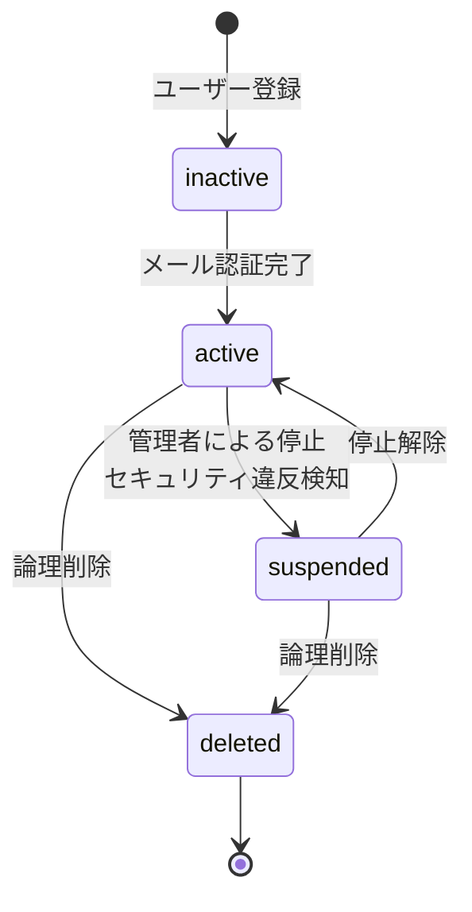

# User Management API

**BC**: BC-003 - Access Control & Security
**カテゴリ**: User Management [ユーザー管理] [USER_MANAGEMENT]
**最終更新**: 2025-11-01

---

## 目次

1. [概要](#overview)
2. [ユーザー照会](#user-query)
3. [ユーザー更新](#user-update)
4. [ユーザー削除](#user-deletion)
5. [ステータス管理](#status-management)
6. [ロール管理](#role-assignment)
7. [プロフィール管理](#profile-management)

---

## 概要 {#overview}

このドキュメントは、BC-003が提供するユーザー管理関連のAPI仕様を定義します。

### ユーザーライフサイクル



### ユーザーステータス

| ステータス | 説明 | ログイン可否 |
|----------|------|-------------|
| **inactive** | 未認証（登録直後） | ❌ 不可 |
| **active** | アクティブ | ✅ 可能 |
| **suspended** | 停止中 | ❌ 不可 |
| **deleted** | 削除済み（論理削除） | ❌ 不可 |

---

## ユーザー照会 {#user-query}

### GET /api/bc-003/users

ユーザー一覧を取得します。

#### クエリパラメータ

| パラメータ | 型 | 必須 | 説明 |
|----------|------|-----|------|
| status | string | ❌ | ステータスフィルタ（`active`, `inactive`, `suspended`, `deleted`） |
| roleId | string | ❌ | ロールIDフィルタ |
| organizationId | string | ❌ | 組織IDフィルタ |
| search | string | ❌ | 検索キーワード（email, username, displayName） |
| mfaEnabled | boolean | ❌ | MFA有効/無効フィルタ |
| sortBy | string | ❌ | ソートキー（`createdAt`, `lastLoginAt`, `email`） |
| sortOrder | string | ❌ | ソート順（`asc`, `desc`）デフォルト: `desc` |
| page | integer | ❌ | ページ番号（デフォルト: 1） |
| pageSize | integer | ❌ | ページサイズ（デフォルト: 20, 最大: 100） |

#### レスポンス（200 OK）

```json
{
  "users": [
    {
      "userId": "user-uuid-1",
      "email": "user1@example.com",
      "username": "john_doe",
      "displayName": "John Doe",
      "status": "active",
      "roles": [
        {
          "roleId": "role-uuid-pm",
          "name": "project_manager",
          "displayName": "プロジェクトマネージャー"
        }
      ],
      "organizationId": "org-uuid-1",
      "organizationName": "Engineering Department",
      "mfaEnabled": true,
      "lastLoginAt": "2025-11-01T09:00:00Z",
      "createdAt": "2025-06-15T10:00:00Z"
    },
    {
      "userId": "user-uuid-2",
      "email": "user2@example.com",
      "username": "jane_smith",
      "displayName": "Jane Smith",
      "status": "active",
      "roles": [
        {
          "roleId": "role-uuid-dev",
          "name": "developer",
          "displayName": "開発者"
        }
      ],
      "organizationId": "org-uuid-1",
      "organizationName": "Engineering Department",
      "mfaEnabled": false,
      "lastLoginAt": "2025-10-31T18:30:00Z",
      "createdAt": "2025-07-20T14:00:00Z"
    }
  ],
  "pagination": {
    "currentPage": 1,
    "pageSize": 20,
    "totalItems": 245,
    "totalPages": 13
  },
  "filters": {
    "status": "active",
    "organizationId": "org-uuid-1"
  }
}
```

#### 認証・権限

- **認証**: Bearer Token必須
- **権限**: `user:read`

#### レート制限・SLA

- **レート制限**: 100 req/min
- **SLA**: p95 < 500ms

---

### GET /api/bc-003/users/{userId}

ユーザー詳細を取得します。

#### パスパラメータ

- `userId` (UUID, 必須): ユーザーID

#### クエリパラメータ

| パラメータ | 型 | 必須 | 説明 |
|----------|------|-----|------|
| includePermissions | boolean | ❌ | 実効権限を含めるか（デフォルト: false） |
| includeAuditLog | boolean | ❌ | 最近の監査ログを含めるか（デフォルト: false） |
| includeSessions | boolean | ❌ | アクティブセッションを含めるか（デフォルト: false） |

#### レスポンス（200 OK）

```json
{
  "userId": "user-uuid",
  "email": "user@example.com",
  "username": "john_doe",
  "displayName": "John Doe",
  "status": "active",
  "locale": "ja-JP",
  "timezone": "Asia/Tokyo",
  "avatarUrl": "https://cdn.example.com/avatars/user-uuid.jpg",
  "roles": [
    {
      "roleId": "role-uuid-pm",
      "name": "project_manager",
      "displayName": "プロジェクトマネージャー",
      "assignedAt": "2025-06-15T10:00:00Z",
      "assignedBy": "user-uuid-admin"
    }
  ],
  "effectivePermissions": [
    {
      "scope": "project:read",
      "grantedBy": ["role-uuid-pm"]
    },
    {
      "scope": "project:write",
      "grantedBy": ["role-uuid-pm"]
    }
  ],
  "organizationId": "org-uuid",
  "organizationName": "Engineering Department",
  "mfaEnabled": true,
  "mfaMethod": "totp",
  "lastLoginAt": "2025-11-01T09:00:00Z",
  "lastLoginIp": "203.0.113.45",
  "lastPasswordChangedAt": "2025-09-15T14:00:00Z",
  "loginFailureCount": 0,
  "accountLockedUntil": null,
  "activeSessions": [
    {
      "sessionId": "session-uuid-1",
      "deviceType": "desktop",
      "browser": "Chrome",
      "ipAddress": "203.0.113.45",
      "location": "Tokyo, Japan",
      "createdAt": "2025-11-01T09:00:00Z"
    }
  ],
  "recentAuditLogs": [
    {
      "logId": "log-uuid-1",
      "action": "USER_LOGIN",
      "timestamp": "2025-11-01T09:00:00Z",
      "ipAddress": "203.0.113.45"
    }
  ],
  "createdAt": "2025-06-15T10:00:00Z",
  "updatedAt": "2025-11-01T09:00:00Z",
  "createdBy": "user-uuid-admin"
}
```

#### エラーレスポンス

| HTTPステータス | エラーコード | 説明 |
|-------------|------------|------|
| 404 | BC003_ERR_200 | ユーザーが存在しない |
| 403 | BC003_ERR_201 | ユーザー詳細閲覧権限なし |

#### 認証・権限

- **認証**: Bearer Token必須
- **権限**: `user:read`（自身の情報閲覧は権限不要）

#### レート制限・SLA

- **レート制限**: 100 req/min
- **SLA**: p95 < 300ms

---

## ユーザー更新 {#user-update}

### PUT /api/bc-003/users/{userId}

ユーザー情報を更新します。

#### パスパラメータ

- `userId` (UUID, 必須): ユーザーID

#### リクエスト

```json
{
  "displayName": "John Doe (Updated)",
  "locale": "en-US",
  "timezone": "America/New_York",
  "avatarUrl": "https://cdn.example.com/avatars/new-avatar.jpg"
}
```

**パラメータ**:

| フィールド | 型 | 必須 | 説明 | 制約 |
|----------|------|-----|------|------|
| displayName | string | ❌ | 表示名 | 1-100文字 |
| locale | string | ❌ | ロケール | en-US, ja-JP等 |
| timezone | string | ❌ | タイムゾーン | IANA形式 |
| avatarUrl | string | ❌ | アバターURL | 有効なURL |

#### レスポンス（200 OK）

GET /users/{userId} と同形式

#### エラーレスポンス

| HTTPステータス | エラーコード | 説明 | 対処法 |
|-------------|------------|------|--------|
| 404 | BC003_ERR_200 | ユーザーが存在しない | 有効なユーザーIDを指定 |
| 403 | BC003_ERR_202 | ユーザー更新権限なし | 適切な権限を付与 |
| 400 | BC003_ERR_203 | 無効なロケール | 有効なロケールを指定 |
| 400 | BC003_ERR_204 | 無効なタイムゾーン | IANA形式のタイムゾーンを指定 |

#### 認証・権限

- **認証**: Bearer Token必須
- **権限**: `user:write`（自身の情報更新は権限不要、ただし一部フィールドは制限あり）

#### レート制限・SLA

- **レート制限**: 50 req/min
- **SLA**: p95 < 400ms

---

## ユーザー削除 {#user-deletion}

### DELETE /api/bc-003/users/{userId}

ユーザーを論理削除します。

#### パスパラメータ

- `userId` (UUID, 必須): ユーザーID

#### リクエスト

```json
{
  "reason": "ユーザーの退職による削除",
  "hardDelete": false
}
```

**パラメータ**:

| フィールド | 型 | 必須 | 説明 |
|----------|------|-----|------|
| reason | string | ❌ | 削除理由 |
| hardDelete | boolean | ❌ | 物理削除するか（デフォルト: false、要system_admin権限） |

#### レスポンス（200 OK）- 論理削除

```json
{
  "userId": "user-uuid",
  "status": "deleted",
  "deletedAt": "2025-11-01T10:00:00Z",
  "deletedBy": "user-uuid-admin",
  "reason": "ユーザーの退職による削除",
  "recoverable": true,
  "recoverableUntil": "2025-12-01T10:00:00Z"
}
```

#### レスポンス（204 No Content）- 物理削除

Bodyなし

#### エラーレスポンス

| HTTPステータス | エラーコード | 説明 | 対処法 |
|-------------|------------|------|--------|
| 404 | BC003_ERR_200 | ユーザーが存在しない | 有効なユーザーIDを指定 |
| 403 | BC003_ERR_210 | ユーザー削除権限なし | `user:delete`権限を付与 |
| 403 | BC003_ERR_211 | 物理削除にはsystem_admin権限が必要 | system_admin権限を付与 |
| 400 | BC003_ERR_212 | 自分自身は削除できない | 他の管理者に依頼 |
| 409 | BC003_ERR_213 | 最後のsystem_adminユーザーは削除不可 | 別のsystem_adminを作成してから削除 |

#### 認証・権限

- **認証**: Bearer Token必須
- **権限**: `user:delete`（論理削除）、`user:delete` + `system_admin`ロール（物理削除）

#### レート制限・SLA

- **レート制限**: 10 req/min
- **SLA**: p95 < 500ms

#### 備考

- **論理削除**: ステータスを`deleted`に変更、30日後に自動物理削除
- **物理削除**: データベースから完全削除、復旧不可
- 削除後、関連セッション・トークンは即座に無効化

---

## ステータス管理 {#status-management}

### POST /api/bc-003/users/{userId}/suspend

ユーザーを停止します。

#### パスパラメータ

- `userId` (UUID, 必須): ユーザーID

#### リクエスト

```json
{
  "reason": "不審なアクティビティを検知したため",
  "duration": 86400,
  "notifyUser": true
}
```

**パラメータ**:

| フィールド | 型 | 必須 | 説明 |
|----------|------|-----|------|
| reason | string | ✅ | 停止理由 |
| duration | integer | ❌ | 停止期間（秒）。指定なしで無期限 |
| notifyUser | boolean | ❌ | ユーザーにメール通知するか（デフォルト: true） |

#### レスポンス（200 OK）

```json
{
  "userId": "user-uuid",
  "status": "suspended",
  "suspendedAt": "2025-11-01T10:00:00Z",
  "suspendedBy": "user-uuid-admin",
  "suspendedUntil": "2025-11-02T10:00:00Z",
  "reason": "不審なアクティビティを検知したため",
  "invalidatedSessions": 3,
  "notificationSent": true
}
```

#### エラーレスポンス

| HTTPステータス | エラーコード | 説明 |
|-------------|------------|------|
| 404 | BC003_ERR_200 | ユーザーが存在しない |
| 403 | BC003_ERR_220 | ユーザー停止権限なし |
| 400 | BC003_ERR_221 | 既に停止されている |
| 400 | BC003_ERR_222 | system_adminユーザーは停止できない |

#### 認証・権限

- **認証**: Bearer Token必須
- **権限**: `user:manage` または `security:manage`

#### レート制限・SLA

- **レート制限**: 20 req/min
- **SLA**: p95 < 500ms

#### 備考

- 停止と同時に、すべてのアクティブセッションが無効化される
- 停止期間終了後、自動的に`active`に復帰（設定された場合）

---

### POST /api/bc-003/users/{userId}/activate

ユーザーを有効化します（停止解除または未認証ユーザーの強制有効化）。

#### パスパラメータ

- `userId` (UUID, 必須): ユーザーID

#### リクエスト

```json
{
  "reason": "停止理由が解消されたため",
  "notifyUser": true
}
```

#### レスポンス（200 OK）

```json
{
  "userId": "user-uuid",
  "status": "active",
  "activatedAt": "2025-11-01T10:00:00Z",
  "activatedBy": "user-uuid-admin",
  "reason": "停止理由が解消されたため",
  "notificationSent": true
}
```

#### エラーレスポンス

| HTTPステータス | エラーコード | 説明 |
|-------------|------------|------|
| 404 | BC003_ERR_200 | ユーザーが存在しない |
| 403 | BC003_ERR_230 | ユーザー有効化権限なし |
| 400 | BC003_ERR_231 | 既に有効化されている |
| 400 | BC003_ERR_232 | 削除済みユーザーは有効化できない |

#### 認証・権限

- **認証**: Bearer Token必須
- **権限**: `user:manage` または `security:manage`

#### レート制限・SLA

- **レート制限**: 20 req/min
- **SLA**: p95 < 400ms

---

## ロール管理 {#role-assignment}

### GET /api/bc-003/users/{userId}/roles

ユーザーのロール一覧を取得します。

#### パスパラメータ

- `userId` (UUID, 必須): ユーザーID

#### レスポンス（200 OK）

```json
{
  "userId": "user-uuid",
  "roles": [
    {
      "roleId": "role-uuid-pm",
      "name": "project_manager",
      "displayName": "プロジェクトマネージャー",
      "assignedAt": "2025-06-15T10:00:00Z",
      "assignedBy": "user-uuid-admin",
      "expiresAt": null
    },
    {
      "roleId": "role-uuid-dev",
      "name": "developer",
      "displayName": "開発者",
      "assignedAt": "2025-06-15T10:00:00Z",
      "assignedBy": "user-uuid-admin",
      "expiresAt": "2025-12-31T23:59:59Z"
    }
  ],
  "totalRoles": 2
}
```

#### 認証・権限

- **認証**: Bearer Token必須
- **権限**: `user:read`（自身のロール閲覧は権限不要）

#### レート制限・SLA

- **レート制限**: 100 req/min
- **SLA**: p95 < 300ms

---

### POST /api/bc-003/users/{userId}/roles

ユーザーにロールを割り当てます。

#### パスパラメータ

- `userId` (UUID, 必須): ユーザーID

#### リクエスト

```json
{
  "roleIds": [
    "role-uuid-pm",
    "role-uuid-auditor"
  ],
  "expiresAt": "2025-12-31T23:59:59Z"
}
```

**パラメータ**:

| フィールド | 型 | 必須 | 説明 |
|----------|------|-----|------|
| roleIds | array | ✅ | ロールIDのリスト |
| expiresAt | string | ❌ | 有効期限（ISO 8601形式） |

#### レスポンス（200 OK）

```json
{
  "userId": "user-uuid",
  "assignedRoles": [
    {
      "roleId": "role-uuid-pm",
      "name": "project_manager",
      "assignedAt": "2025-11-01T10:00:00Z",
      "expiresAt": "2025-12-31T23:59:59Z"
    },
    {
      "roleId": "role-uuid-auditor",
      "name": "auditor",
      "assignedAt": "2025-11-01T10:00:00Z",
      "expiresAt": "2025-12-31T23:59:59Z"
    }
  ],
  "totalRoles": 4
}
```

#### エラーレスポンス

| HTTPステータス | エラーコード | 説明 |
|-------------|------------|------|
| 404 | BC003_ERR_200 | ユーザーが存在しない |
| 404 | BC003_ERR_240 | 一部のロールが存在しない |
| 403 | BC003_ERR_241 | ロール割当権限なし |
| 409 | BC003_ERR_242 | 一部のロールは既に割り当て済み |

#### 認証・権限

- **認証**: Bearer Token必須
- **権限**: `role:manage` または `user:manage`

#### レート制限・SLA

- **レート制限**: 50 req/min
- **SLA**: p95 < 500ms

---

### DELETE /api/bc-003/users/{userId}/roles/{roleId}

ユーザーからロールを削除します。

#### パスパラメータ

- `userId` (UUID, 必須): ユーザーID
- `roleId` (UUID, 必須): ロールID

#### レスポンス（204 No Content）

Bodyなし

#### エラーレスポンス

| HTTPステータス | エラーコード | 説明 |
|-------------|------------|------|
| 404 | BC003_ERR_200 | ユーザーが存在しない |
| 404 | BC003_ERR_250 | ロールが割り当てられていない |
| 403 | BC003_ERR_251 | ロール削除権限なし |
| 409 | BC003_ERR_252 | 最後のsystem_adminロールは削除不可 |

#### 認証・権限

- **認証**: Bearer Token必須
- **権限**: `role:manage` または `user:manage`

#### レート制限・SLA

- **レート制限**: 50 req/min
- **SLA**: p95 < 400ms

---

## プロフィール管理 {#profile-management}

### GET /api/bc-003/users/{userId}/profile

ユーザープロフィールを取得します（BC間連携でも使用）。

#### パスパラメータ

- `userId` (UUID, 必須): ユーザーID

#### レスポンス（200 OK）

```json
{
  "userId": "user-uuid",
  "email": "user@example.com",
  "username": "john_doe",
  "displayName": "John Doe",
  "avatarUrl": "https://cdn.example.com/avatars/user-uuid.jpg",
  "locale": "ja-JP",
  "timezone": "Asia/Tokyo",
  "roles": ["project_manager", "developer"],
  "status": "active",
  "mfaEnabled": true,
  "lastLoginAt": "2025-11-01T09:00:00Z",
  "organizationId": "org-uuid",
  "organizationName": "Engineering Department"
}
```

#### 認証・権限

- **認証**: Bearer Token必須（または BC間サービスアカウント）
- **権限**: `user:read`（自身のプロフィール閲覧は権限不要）

#### レート制限・SLA

- **レート制限**: 300 req/min（BC間連携のため高め）
- **SLA**: p95 < 150ms

---

### PUT /api/bc-003/users/{userId}/profile

ユーザープロフィールを更新します。

#### パスパラメータ

- `userId` (UUID, 必須): ユーザーID

#### リクエスト

```json
{
  "displayName": "John Doe (Senior)",
  "avatarUrl": "https://cdn.example.com/avatars/new-avatar.jpg",
  "locale": "en-US",
  "timezone": "America/New_York",
  "preferences": {
    "emailNotifications": true,
    "theme": "dark",
    "language": "en"
  }
}
```

**パラメータ**:

| フィールド | 型 | 必須 | 説明 |
|----------|------|-----|------|
| displayName | string | ❌ | 表示名 |
| avatarUrl | string | ❌ | アバターURL |
| locale | string | ❌ | ロケール |
| timezone | string | ❌ | タイムゾーン |
| preferences | object | ❌ | ユーザー設定（自由形式） |

#### レスポンス（200 OK）

GET /users/{userId}/profile と同形式

#### エラーレスポンス

| HTTPステータス | エラーコード | 説明 |
|-------------|------------|------|
| 404 | BC003_ERR_200 | ユーザーが存在しない |
| 403 | BC003_ERR_260 | プロフィール更新権限なし |
| 400 | BC003_ERR_261 | 無効なロケールまたはタイムゾーン |

#### 認証・権限

- **認証**: Bearer Token必須
- **権限**: なし（自身のプロフィール更新のみ）

#### レート制限・SLA

- **レート制限**: 50 req/min
- **SLA**: p95 < 400ms

---

### POST /api/bc-003/users/{userId}/avatar

アバター画像をアップロードします。

#### パスパラメータ

- `userId` (UUID, 必須): ユーザーID

#### リクエスト

```
Content-Type: multipart/form-data

------WebKitFormBoundary
Content-Disposition: form-data; name="avatar"; filename="avatar.jpg"
Content-Type: image/jpeg

<binary data>
------WebKitFormBoundary--
```

#### レスポンス（200 OK）

```json
{
  "avatarUrl": "https://cdn.example.com/avatars/user-uuid-v2.jpg",
  "uploadedAt": "2025-11-01T10:00:00Z",
  "fileSize": 245678,
  "dimensions": {
    "width": 512,
    "height": 512
  }
}
```

#### エラーレスポンス

| HTTPステータス | エラーコード | 説明 |
|-------------|------------|------|
| 400 | BC003_ERR_270 | ファイル形式が無効（JPG, PNG, GIFのみ） |
| 400 | BC003_ERR_271 | ファイルサイズが大きすぎる（最大5MB） |
| 400 | BC003_ERR_272 | 画像サイズが不正（最小100x100、最大2048x2048） |

#### 認証・権限

- **認証**: Bearer Token必須
- **権限**: なし（自身のアバターアップロードのみ）

#### レート制限・SLA

- **レート制限**: 10 req/min
- **SLA**: p95 < 2000ms（ファイルアップロードのため長め）

---

## 関連ドキュメント

- [README.md](./README.md) - API設計概要
- [authentication-api.md](./authentication-api.md) - 認証API
- [authorization-api.md](./authorization-api.md) - 認可API
- [audit-security-api.md](./audit-security-api.md) - 監査・セキュリティAPI
- [error-handling.md](./error-handling.md) - エラーハンドリング
- [rate-limiting-sla.md](./rate-limiting-sla.md) - レート制限とSLA

---

**ステータス**: Phase 2.2 - BC-003 User Management API完成
**最終更新**: 2025-11-01
