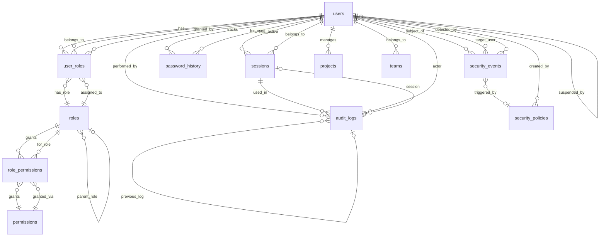

# BC-003: データ設計

**BC**: Access Control & Security [アクセス制御とセキュリティ] [ACCESS_CONTROL_SECURITY]
**作成日**: 2025-10-31
**最終更新**: 2025-11-03
**V2移行元**: services/secure-access-service/database-design.md（セキュリティ機能のみ）
**DBMS**: PostgreSQL 14+
**正規形**: 第三正規形 (3NF)
**セキュリティレベル**: Critical（監査ログ3年保持、改ざん防止必須）

---

## 目次

1. [概要](#overview)
2. [ER図](#er-diagram)
3. [テーブル一覧](#table-list)
4. [データフロー](#data-flow)
5. [BC間データ連携](#bc-integration)
6. [セキュリティ考慮事項](#security-considerations)
7. [関連ドキュメント](#related-docs)

詳細設計ドキュメント：
- [tables.md](tables.md) - テーブル詳細定義
- [indexes-constraints.md](indexes-constraints.md) - インデックス・制約・トリガー
- [query-patterns.md](query-patterns.md) - クエリパターン
- [backup-security.md](backup-security.md) - バックアップ・復旧・パーティショニング

---

## 概要 {#overview}

このドキュメントは、BC-003（アクセス制御とセキュリティ）のデータモデルとデータベース設計を定義します。

### データモデルの設計方針

1. **セキュリティファースト**: 認証・認可・監査の完全性を最優先
2. **改ざん防止**: 監査ログはSHA-256ハッシュチェーンで改ざん検知
3. **コンプライアンス**: 3年間の監査ログ保持、GDPR対応
4. **高可用性**: 99.9% SLA、認証・認可のp95 < 100ms
5. **正規化**: 第三正規形（3NF）でデータ整合性を保証
6. **パフォーマンス**: 認証・認可は毎秒数百リクエストに対応

### データベース技術スタック

- **DBMS**: PostgreSQL 14+
- **拡張機能**:
  - `uuid-ossp`: UUID生成
  - `pgcrypto`: パスワードハッシュ（bcrypt）、暗号化
  - `pg_stat_statements`: クエリ統計
  - `pg_trgm`: 監査ログ全文検索
- **暗号化**:
  - パスワード: bcrypt (cost=12)
  - MFAシークレット: AES-256-GCM
  - セッショントークン: JWT RS256署名
  - 監査ログ: SHA-256ハッシュチェーン
- **バックアップ**: pg_dump + WALアーカイビング（RPO: 1hr, RTO: 4hr）
- **レプリケーション**: ストリーミングレプリケーション（プライマリ1台 + スタンバイ2台）
- **パーティショニング**: audit_logs（月次）、security_events（月次）

---

## 🔄 Parasol型マッピング定義

このBCで使用するParasol Domain Language型とPostgreSQL型の対応表。

### 基本型マッピング

| Parasol型 | PostgreSQL型 | 制約例 | 説明 |
|-----------|-------------|--------|------|
| UUID | UUID | PRIMARY KEY, NOT NULL | UUID v4形式の一意識別子 |
| STRING_20 | VARCHAR(20) | NOT NULL, CHECK(length(...) <= 20) | 最大20文字の文字列 |
| STRING_50 | VARCHAR(50) | NOT NULL, CHECK(length(...) <= 50) | 最大50文字の文字列 |
| STRING_100 | VARCHAR(100) | NOT NULL, CHECK(length(...) <= 100) | 最大100文字の文字列 |
| STRING_200 | VARCHAR(200) | NOT NULL, CHECK(length(...) <= 200) | 最大200文字の文字列 |
| STRING_255 | VARCHAR(255) | NOT NULL, CHECK(length(...) <= 255) | 最大255文字の文字列 |
| TEXT | TEXT | - | 長文（制限なし） |
| INTEGER | INTEGER | CHECK(value > 0) | 整数 |
| DECIMAL | NUMERIC | CHECK(value >= 0) | 小数（金額、工数等） |
| PERCENTAGE | NUMERIC(5,2) | CHECK(value BETWEEN 0 AND 100) | パーセンテージ（0-100） |
| BOOLEAN | BOOLEAN | NOT NULL DEFAULT false | 真偽値 |
| DATE | DATE | NOT NULL | YYYY-MM-DD形式の日付 |
| TIMESTAMP | TIMESTAMP WITH TIME ZONE | NOT NULL DEFAULT CURRENT_TIMESTAMP | ISO8601形式のタイムスタンプ |
| EMAIL | VARCHAR(255) | CHECK(email ~* '^[A-Za-z0-9._%+-]+@[A-Za-z0-9.-]+\.[A-Z\|a-z]{2,}$') | RFC5322準拠メールアドレス |
| URL | TEXT | CHECK(url ~* '^https?://') | RFC3986準拠URL |
| MONEY | JSONB or (NUMERIC + VARCHAR(3)) | CHECK(amount >= 0), CHECK(currency ~ '^[A-Z]{3}$') | 金額（通貨付き） |
| JSON | JSONB | - | JSON形式データ |
| BINARY | BYTEA | - | バイナリデータ |

### 実装ガイドライン

1. **NOT NULL制約**: Parasol型の必須フィールドは`NOT NULL`制約を付与
2. **CHECK制約**: 長さ制約、範囲制約を`CHECK`で実装
3. **インデックス**: 検索頻度の高いカラムには適切なインデックスを作成
4. **デフォルト値**: `TIMESTAMP`は`DEFAULT CURRENT_TIMESTAMP`を推奨
5. **列挙型**: Parasol型の`STRING_XX` (enum値) は`VARCHAR + CHECK`または`ENUM`型で実装

### BC固有の型定義

**セキュリティ特化型**:
- `PASSWORD_HASH`: bcrypt, cost=12 → `VARCHAR(60)` (bcryptハッシュ長)
- `MFA_SECRET`: AES-256-GCM暗号化 → `BYTEA` (pgcrypto使用)
- `SESSION_TOKEN`: JWT RS256署名 → `TEXT` (JWT文字列)
- `HASH_CHAIN`: SHA-256ハッシュ → `VARCHAR(64)` (16進数表現)

**監査ログ型**:
- `AUDIT_ACTION`: 操作種別 → `VARCHAR(50) CHECK (action IN (...))`
- `IP_ADDRESS`: IPv4/IPv6 → `INET`型
- `USER_AGENT`: UAデータ → `TEXT`

---

## ER図 {#er-diagram}



### ER図の読み方

- **||--o{**: 1対多の関係（例: 1人のユーザーは複数のセッションを持つ）
- **}o--||**: 多対1の関係（例: 複数のセッションは1人のユーザーに属する）
- **}o--o|**: 0または1の関係（例: セキュリティイベントはポリシーに関連する場合もしない場合もある）

---

## テーブル一覧 {#table-list}

### コアテーブル（11テーブル）

| # | テーブル名 | 行数 | 説明 | パーティション |
|---|-----------|-----|------|--------------|
| 1 | **users** | ~10,000 | ユーザーマスタ（認証情報、MFA、アカウントステータス） | なし |
| 2 | **roles** | ~50 | ロールマスタ（RBAC、階層構造サポート） | なし |
| 3 | **permissions** | ~200 | 権限マスタ（リソース + アクション） | なし |
| 4 | **user_roles** | ~20,000 | ユーザー・ロール関連（多対多、付与者記録） | なし |
| 5 | **role_permissions** | ~500 | ロール・権限関連（多対多） | なし |
| 6 | **sessions** | ~5,000 | セッション管理（JWT、最大5個/ユーザー） | なし |
| 7 | **password_history** | ~30,000 | パスワード履歴（過去3回再利用防止） | なし |
| 8 | **audit_logs** | ~10M+ | 監査ログ（改ざん防止ハッシュチェーン） | 月次 |
| 9 | **security_events** | ~500K+ | セキュリティイベント（リスクスコアリング） | 月次 |
| 10 | **security_policies** | ~100 | セキュリティポリシー（アカウントロック設定等） | なし |
| 11 | **login_attempts** | ~2M+ | ログイン試行履歴（brute-force検知） | 月次 |

### テーブルカテゴリ

#### 認証・ユーザー管理
- `users`: ユーザーマスタ（email, password_hash, MFA設定）
- `password_history`: パスワード履歴管理
- `sessions`: セッション・トークン管理
- `login_attempts`: ログイン試行履歴

#### 認可・RBAC
- `roles`: ロール定義（階層構造サポート）
- `permissions`: 権限定義（resource:action形式）
- `user_roles`: ユーザー・ロール関連
- `role_permissions`: ロール・権限関連

#### 監査・セキュリティ
- `audit_logs`: 不変監査ログ（INSERT ONLY）
- `security_events`: セキュリティイベント（リスクスコア付き）
- `security_policies`: セキュリティポリシー設定

---

## データフロー {#data-flow}

### 1. ユーザー登録フロー

```
1. usersテーブルにINSERT（status='inactive', email確認待ち）
2. password_historyに初期パスワードハッシュ記録
3. デフォルトロール（viewer）をuser_rolesにINSERT
4. audit_logsに登録イベント記録（action='USER_REGISTERED'）
5. メール確認後、status='active'に更新
```

### 2. ログイン・認証フロー

```
1. login_attemptsにログイン試行記録（成功/失敗問わず）
2. users.email でユーザー検索
3. アカウントロック確認（users.locked_until > NOW()）
4. パスワード検証（bcrypt_verify(password, users.password_hash)）
5. MFA有効の場合、MFAコード検証（users.mfa_secret）
6. 成功時:
   a. sessionsにセッションINSERT（access_token, refresh_token）
   b. users.last_login_at更新、login_failure_count=0
   c. audit_logsに成功ログ記録
   d. セッション数チェック（最大5個、超過時は最古削除）
7. 失敗時:
   a. users.login_failure_count インクリメント
   b. 5回失敗でusers.locked_until設定（30分ロック）
   c. audit_logsに失敗ログ記録
   d. security_eventsに不審ログイン記録（3回失敗以降）
```

### 3. 権限チェックフロー（BC間統合用）

```
1. セッショントークンからsessions.user_id取得
2. sessions.expires_at確認（有効期限チェック）
3. user_rolesでユーザーのロール取得（有効期限考慮）
4. role_permissionsで権限確認（階層的ロール継承含む）
5. 結果をキャッシュ（Redis, TTL=5分）
6. audit_logsに権限チェック記録（success=true/false）
```

### 4. セキュリティ監視フロー

```
1. 不審なアクティビティ検知（例: 異常な場所からのログイン）
2. security_eventsテーブルにINSERT（リスクスコア計算）
3. リスクスコア >= 75の場合:
   a. users.locked_until設定（自動アカウントロック）
   b. BC-007にアラート通知（security-team@example.com）
   c. audit_logsに自動対応記録
4. セキュリティチーム対応後、security_events.resolved_at更新
```

### 5. 監査ログのハッシュチェーン

```
1. 新規監査ログ作成時:
   a. 直前のログのhashを取得（previous_hash）
   b. 現在のログデータ + previous_hashでSHA-256計算
   c. audit_logs.hash, audit_logs.previous_hash保存
2. 監査ログ検証時:
   a. 各ログのhash再計算
   b. previous_hashチェーン確認
   c. 改ざん検知時にアラート
```

---

## BC間データ連携 {#bc-integration}

### 全BCへの認証・認可サービス提供

BC-003は全てのBCに対して認証・認可サービスを提供します。

#### 提供データ

- **ユーザー情報**: `users` テーブル（id, email, username, status）
- **セッション検証**: `sessions` テーブル（access_token → user_id）
- **権限チェック**: `user_roles` + `role_permissions`（permission判定）

#### 統合エンドポイント（API層で定義済み）

```
POST /api/bc-003/auth/validate-token
- 入力: access_token
- 出力: {valid: boolean, user_id: UUID, roles: [], permissions: []}
- レート制限: 500 req/min（BC間統合用）
- パフォーマンス: p95 < 100ms

POST /api/bc-003/auth/check-permission
- 入力: {user_id, permission, resource_id?}
- 出力: {granted: boolean}
- レート制限: 500 req/min
- パフォーマンス: p95 < 100ms
```

### BC-004 (Organization Governance) との連携

- **参照**: BC-004の組織構造データ（teams, departments）
- **用途**: ロールのスコープ設定（特定チーム・部署のみに権限付与）

### BC-007 (Communication) へのアラート送信

- **送信データ**: `security_events`（severity='high' or 'critical'）
- **送信タイミング**: リアルタイム（pg_notify or メッセージキュー）
- **送信内容**: アカウントロック、不正アクセス試行、異常なアクティビティ

---

## セキュリティ考慮事項 {#security-considerations}

### 1. パスワードセキュリティ

```sql
-- bcrypt ハッシュ（cost=12）
users.password_hash = bcrypt(password, gen_salt('bf', 12))

-- パスワード検証
SELECT crypt(input_password, password_hash) = password_hash

-- 過去3回のパスワード再利用防止
SELECT COUNT(*) FROM password_history
WHERE user_id = ? AND created_at >= NOW() - INTERVAL '1 year'
ORDER BY created_at DESC LIMIT 3;
```

### 2. セッション管理

- **JWT**: RS256署名、30分有効期限
- **リフレッシュトークン**: 7日有効期限
- **最大同時セッション**: 5個/ユーザー（超過時は最古削除）
- **セッション無効化**: ログアウト、パスワード変更時に全セッション削除

### 3. MFA（多要素認証）

```sql
-- TOTP シークレットの暗号化保存
users.mfa_secret = pgp_sym_encrypt(totp_secret, encryption_key)

-- MFAコード検証
SELECT pgp_sym_decrypt(mfa_secret::bytea, encryption_key) FROM users WHERE id = ?;
-- アプリケーション層でTOTP検証（6桁コード、30秒ウィンドウ）
```

### 4. 監査ログの改ざん防止

```sql
-- ハッシュチェーン
CREATE TRIGGER trg_audit_logs_hash_chain
  BEFORE INSERT ON audit_logs
  FOR EACH ROW
  EXECUTE FUNCTION calculate_audit_log_hash();

-- hash = SHA256(log_id || user_id || action || resource || timestamp || previous_hash)
```

### 5. アカウントロック

- **ログイン失敗**: 5回失敗で30分ロック
- **自動解除**: `users.locked_until < NOW()` で自動解除
- **手動解除**: セキュリティ管理者のみ可能

### 6. GDPR対応（個人データ削除）

```sql
-- ユーザー削除時の処理
UPDATE users SET
  email = 'deleted_' || id || '@deleted.local',
  username = 'deleted_' || id,
  password_hash = 'DELETED',
  status = 'deleted',
  mfa_secret = NULL,
  deleted_at = NOW()
WHERE id = ?;

-- 監査ログは保持（user_idは残すが、個人情報は削除済み）
-- security_eventsも保持（統計・分析用）
```

### 7. データ暗号化

- **保存時暗号化**: PostgreSQL透過的データ暗号化（TDE）
- **転送時暗号化**: TLS 1.3（全API通信）
- **カラムレベル暗号化**: `mfa_secret`, `mfa_backup_codes`

---

## 関連ドキュメント {#related-docs}

### BC-003 内部ドキュメント

- [tables.md](tables.md) - テーブル詳細定義（9-11テーブル）
- [indexes-constraints.md](indexes-constraints.md) - インデックス戦略、制約、トリガー関数
- [query-patterns.md](query-patterns.md) - 主要クエリパターン（6-8パターン）
- [backup-security.md](backup-security.md) - バックアップ・復旧戦略、パーティショニング

### BC-003 他レイヤー

- [../domain/README.md](../domain/README.md) - BC-003 ドメインモデル（4 Aggregates）
- [../api/README.md](../api/README.md) - BC-003 API仕様（認証・認可・監査）

### 関連Issue

- Issue #192: V3構造ドキュメント整備・品質向上プロジェクト
- Issue #146: WHAT/HOW分離原則

### 外部参照

- PostgreSQL公式ドキュメント: https://www.postgresql.org/docs/14/
- OWASP Authentication Cheat Sheet: https://cheatsheetseries.owasp.org/cheatsheets/Authentication_Cheat_Sheet.html
- NIST Password Guidelines: https://pages.nist.gov/800-63-3/

---

**ステータス**: Phase 2.2 - BC-003 データ設計詳細化進行中
**最終更新**: 2025-11-03
**次のアクション**: tables.md の作成

---

**変更履歴**:
- 2025-11-03: Phase 2.2 - BC-003 データ設計を詳細化（Issue #192）
  - 包括的README.md作成（概要、ER図、テーブル一覧）
  - セキュリティ特化の設計方針定義
  - 監査ログハッシュチェーン設計
  - RBAC階層構造サポート
  - 5ファイル分割構成（メンテナンス性向上）
- 2025-10-31: Phase 0 - 基本構造作成
