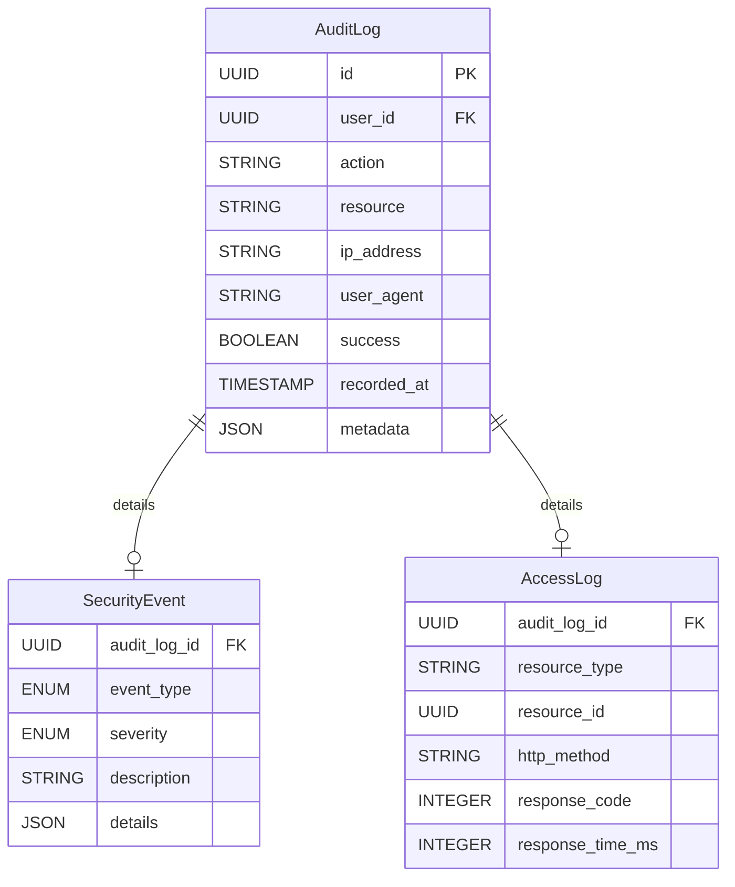

# BC-003: ドメイン設計

**BC**: Access Control & Security [アクセス制御とセキュリティ] [ACCESS_CONTROL_SECURITY]
**作成日**: 2025-10-31
**最終更新**: 2025-10-31
**V2移行元**: services/secure-access-service/domain-language.md
**ドメイン駆動設計**: 集約、エンティティ、値オブジェクト、ドメインイベント、ドメインサービス

---

## 目次

1. [概要](#overview)
2. [ユビキタス言語](#ubiquitous-language)
3. [集約（Aggregates）](#aggregates)
4. [エンティティ（Entities）](#entities)
5. [値オブジェクト（Value Objects）](#value-objects)
6. [ドメインイベント（Domain Events）](#domain-events)
7. [ドメインサービス（Domain Services）](#domain-services)
8. [状態遷移図](#state-transitions)
9. [ビジネスルール](#business-rules)
10. [BC間連携](#cross-bc-integration)
11. [V2からの移行](#v2-migration)

---

## 概要 {#overview}

BC-003（アクセス制御とセキュリティ）は、システム全体の認証・認可・監査を担う基盤BCです。

### ドメインの責務

1. **認証（Authentication）**: ユーザーの本人確認
2. **認可（Authorization）**: ユーザーの権限管理とアクセス制御
3. **監査（Audit）**: すべてのセキュリティイベントの記録
4. **セキュリティ監視**: 不審なアクティビティの検知とアラート
5. **セキュリティポリシー管理**: パスワードポリシー、MFA要件などの設定

### ドメインモデルの設計方針

- **セキュリティファースト**: すべての操作は認証・認可を経る
- **不変性保証**: 監査ログは作成後変更不可
- **イベント駆動**: すべてのセキュリティイベントを記録
- **ゼロトラストアーキテクチャ**: 常に検証、決して信頼しない

---

## ユビキタス言語 {#ubiquitous-language}

BC-003で使用される主要な用語とParasol言語表記：

### 認証関連
- **ユーザー** [User] [USER]: システムを利用する人
- **認証情報** [Credential] [CREDENTIAL]: ユーザーの本人確認情報
- **セッション** [Session] [SESSION]: 認証後の一時的な接続状態
- **アクセストークン** [AccessToken] [ACCESS_TOKEN]: セッションを識別するトークン
- **リフレッシュトークン** [RefreshToken] [REFRESH_TOKEN]: アクセストークン更新用トークン
- **多要素認証** [Multi-Factor Authentication] [MFA]: 2つ以上の認証要素による確認

### 認可関連
- **ロール** [Role] [ROLE]: 権限の集合
- **権限** [Permission] [PERMISSION]: 特定リソースへのアクセス許可
- **リソース** [Resource] [RESOURCE]: 保護対象の操作・データ
- **アクション** [Action] [ACTION]: リソースに対する操作（read/write/delete/execute）
- **ロールベースアクセス制御** [Role-Based Access Control] [RBAC]: ロールによる権限管理

### 監査関連
- **監査ログ** [AuditLog] [AUDIT_LOG]: セキュリティイベントの記録
- **セキュリティイベント** [SecurityEvent] [SECURITY_EVENT]: 記録対象の操作
- **アクセスログ** [AccessLog] [ACCESS_LOG]: リソースアクセスの記録

### ポリシー関連
- **セキュリティポリシー** [SecurityPolicy] [SECURITY_POLICY]: セキュリティ設定の集合
- **パスワードポリシー** [PasswordPolicy] [PASSWORD_POLICY]: パスワード要件
- **セッションポリシー** [SessionPolicy] [SESSION_POLICY]: セッション有効期限等

---

## 集約（Aggregates） {#aggregates}

---

### 1. User Aggregate {#user-aggregate}

**集約ルート**: User [User] [USER]

#### 責務
- ユーザーのライフサイクル全体を管理（作成→有効化→停止→削除）
- 認証情報とプロファイルの整合性保証
- セッション管理

#### 包含エンティティ
- **User**（集約ルート）
- **Credential**: 認証情報（パスワード、MFA設定）
- **UserProfile**: ユーザープロファイル（名前、メール等）
- **Session**: 認証セッション

#### 不変条件（Invariants）
1. **アクティブユーザー制約**: アクティブ（active）状態のユーザーのみセッション作成可能
2. **一意性制約**: メールアドレスとユーザー名はシステム内で一意
3. **MFA整合性**: MFA有効時は認証時にMFA検証が必須
4. **パスワード複雑性**: パスワードはセキュリティポリシーの要件を満たす必要あり
5. **セッション数制限**: 同時セッション数は最大5つまで（古いセッションは自動無効化）

#### ドメインイベント
- **UserCreated**: ユーザーが作成された
  - ペイロード: `{ userId, email, username, createdAt }`
  - サブスクライバ: BC-007（ウェルカムメール送信）, BC-004（組織割り当て）

- **UserAuthenticated**: ユーザーが認証された
  - ペイロード: `{ userId, sessionId, ipAddress, userAgent, authenticatedAt }`
  - サブスクライバ: BC-003監査ログ、BC-007（ログイン通知）

- **PasswordChanged**: パスワードが変更された
  - ペイロード: `{ userId, changedAt, changedBy }`
  - サブスクライバ: BC-007（パスワード変更通知）, BC-003監査ログ

- **MfaEnabled**: MFAが有効化された
  - ペイロード: `{ userId, mfaMethod, enabledAt }`
  - サブスクライバ: BC-007（MFA有効化通知）, BC-003監査ログ

- **UserSuspended**: ユーザーが停止された
  - ペイロード: `{ userId, reason, suspendedBy, suspendedAt }`
  - サブスクライバ: BC-007（停止通知）, セッション無効化

- **SessionCreated**: セッションが作成された
  - ペイロード: `{ sessionId, userId, expiresAt, createdAt }`
  - サブスクライバ: BC-003監査ログ

- **SessionExpired**: セッションが期限切れになった
  - ペイロード: `{ sessionId, userId, expiredAt }`
  - サブスクライバ: BC-003監査ログ

#### ビジネスルール
- **パスワード有効期限**: 90日ごとにパスワード変更を要求
- **ログイン失敗ロック**: 5回連続失敗で30分間アカウントロック
- **セッションタイムアウト**: アクティビティなし30分でセッション無効化
- **MFA強制ロール**: 管理者ロールはMFA必須

#### ER図（User集約内部）


---

### 2. Role Aggregate {#role-aggregate}

**集約ルート**: Role [Role] [ROLE]

#### 責務
- ロールと権限の関連管理
- 権限の付与・削除
- ロール階層の管理

#### 包含エンティティ
- **Role**（集約ルート）
- **Permission**: 個別権限
- **RolePermission**: ロール-権限マッピング

#### 不変条件（Invariants）
1. **権限必須制約**: ロールは少なくとも1つの権限を持つ
2. **システムロール保護**: システムロール（is_system_role=true）は削除・変更不可
3. **循環参照禁止**: ロール階層で循環参照は不可
4. **権限スコープ整合性**: 子ロールの権限は親ロールの権限のサブセット

#### ドメインイベント
- **RoleCreated**: ロールが作成された
  - ペイロード: `{ roleId, roleName, isSystemRole, createdAt }`
  - サブスクライバ: BC-003監査ログ

- **PermissionGranted**: 権限がロールに付与された
  - ペイロード: `{ roleId, permissionId, resource, action, grantedBy, grantedAt }`
  - サブスクライバ: BC-003監査ログ

- **PermissionRevoked**: 権限がロールから削除された
  - ペイロード: `{ roleId, permissionId, revokedBy, revokedAt }`
  - サブスクライバ: BC-003監査ログ、影響ユーザーのセッション再検証

- **RoleAssignedToUser**: ロールがユーザーに割り当てられた
  - ペイロード: `{ userId, roleId, assignedBy, assignedAt }`
  - サブスクライバ: BC-007（ロール割り当て通知）, BC-003監査ログ

- **RoleRevokedFromUser**: ロールがユーザーから削除された
  - ペイロード: `{ userId, roleId, revokedBy, revokedAt }`
  - サブスクライバ: BC-007（ロール削除通知）, セッション再検証

#### ビジネスルール
- **システムロール一覧**:
  - `SUPER_ADMIN`: 全権限（システム管理）
  - `ADMIN`: 組織管理権限
  - `PROJECT_MANAGER`: プロジェクト管理権限
  - `TEAM_MEMBER`: 基本メンバー権限
  - `VIEWER`: 閲覧のみ権限

- **権限命名規則**: `{resource}:{action}` 形式（例: `project:write`, `user:delete`）

#### ER図（Role集約内部）

```mermaid
erDiagram
    Role ||--o{ RolePermission : "has"
    RolePermission }o--|| Permission : "references"
    Role ||--o{ UserRole : "assigned_to"
    UserRole }o--|| User : "references"

    Role {
        UUID id PK
        STRING name UNIQUE
        STRING description
        BOOLEAN is_system_role
        UUID parent_role_id FK
    }

    Permission {
        UUID id PK
        STRING name UNIQUE
        STRING resource
        ENUM action
        STRING description
    }

    RolePermission {
        UUID role_id FK
        UUID permission_id FK
        TIMESTAMP granted_at
    }

    UserRole {
        UUID user_id FK
        UUID role_id FK
        TIMESTAMP assigned_at
        UUID assigned_by FK
    }
```

---

### 3. AuditLog Aggregate {#auditlog-aggregate}

**集約ルート**: AuditLog [AuditLog] [AUDIT_LOG]

#### 責務
- 監査ログの不変性保証
- セキュリティイベントの記録
- コンプライアンス要件の充足

#### 包含エンティティ
- **AuditLog**（集約ルート）
- **SecurityEvent**: セキュリティイベント詳細
- **AccessLog**: リソースアクセスログ

#### 不変条件（Invariants）
1. **不変性保証**: 作成後の変更・削除は絶対不可（Immutable）
2. **完全性保証**: すべての必須フィールドが記録される
3. **時系列保証**: 記録日時は単調増加（改ざん検知）

#### ドメインイベント
- **AuditLogRecorded**: 監査ログが記録された
  - ペイロード: `{ logId, userId, action, resource, success, recordedAt }`
  - サブスクライバ: BC-006（コンプライアンスレポート）

- **SecurityViolationDetected**: セキュリティ違反が検知された
  - ペイロード: `{ userId, violationType, severity, detectedAt }`
  - サブスクライバ: BC-007（セキュリティアラート）, SecurityMonitoringService

- **SuspiciousActivityDetected**: 不審なアクティビティが検知された
  - ペイロード: `{ userId, activityType, riskScore, detectedAt }`
  - サブスクライバ: BC-007（アラート通知）, アカウント一時停止検討

#### ビジネスルール
- **記録対象アクション**:
  - 認証: ログイン、ログアウト、MFA検証
  - 認可: 権限チェック失敗、ロール変更
  - データ操作: 重要データの作成・更新・削除
  - 設定変更: セキュリティポリシー変更
  - 不審な活動: ログイン失敗、異常なアクセスパターン

- **ログ保持期間**: 最低7年間（コンプライアンス要件）

- **不審なアクティビティパターン**:
  - 短時間での大量ログイン失敗
  - 通常と異なる地域からのアクセス
  - 深夜の大量データアクセス
  - 通常と異なるユーザーエージェント

#### ER図（AuditLog集約内部）



---

### 4. SecurityPolicy Aggregate {#securitypolicy-aggregate}

**集約ルート**: SecurityPolicy [SecurityPolicy] [SECURITY_POLICY]

#### 責務
- セキュリティポリシー設定の管理
- ポリシー変更の履歴管理
- ポリシー適用の保証

#### 包含エンティティ
- **SecurityPolicy**（集約ルート）
- **PasswordPolicy**: パスワードポリシー
- **SessionPolicy**: セッションポリシー
- **MfaPolicy**: MFA要件ポリシー

#### 不変条件（Invariants）
1. **ポリシー整合性**: 各ポリシー設定は論理的に整合している
2. **最小要件保証**: セキュリティ最小要件を下回る設定は不可
3. **変更履歴保持**: すべてのポリシー変更は履歴として保持

#### ドメインイベント
- **SecurityPolicyUpdated**: セキュリティポリシーが更新された
  - ペイロード: `{ policyType, previousValue, newValue, updatedBy, updatedAt }`
  - サブスクライバ: BC-003監査ログ, 全ユーザーへのポリシー再適用

- **PasswordPolicyStrengthened**: パスワードポリシーが強化された
  - ペイロード: `{ minLength, complexityRequired, expirationDays, updatedAt }`
  - サブスクライバ: BC-007（ユーザーへの通知）, 次回ログイン時のパスワード変更要求

#### ビジネスルール
- **デフォルトパスワードポリシー**:
  - 最小文字数: 12文字
  - 複雑性要件: 大文字・小文字・数字・記号を各1文字以上
  - 有効期限: 90日
  - 過去3世代の再利用禁止

- **デフォルトセッションポリシー**:
  - アクセストークン有効期限: 1時間
  - リフレッシュトークン有効期限: 7日
  - アクティビティタイムアウト: 30分
  - 最大同時セッション数: 5

- **デフォルトMFAポリシー**:
  - 管理者ロール: MFA必須
  - 一般ユーザー: MFA推奨
  - MFA方式: TOTP（Time-based One-Time Password）, SMS

---

## エンティティ（Entities） {#entities}

### User [User] [USER]
ユーザー [User] [USER]
```
├── ユーザーID [UserID] [USER_ID]: UUID
├── メールアドレス [Email] [EMAIL]: STRING(255) UNIQUE
├── ユーザー名 [Username] [USERNAME]: STRING(100) UNIQUE
├── 状態 [Status] [STATUS]: ENUM（inactive, active, suspended, deleted）
├── MFA有効フラグ [MfaEnabled] [MFA_ENABLED]: BOOLEAN
├── MFA方式 [MfaMethod] [MFA_METHOD]: ENUM（totp, sms, null）
├── 最終ログイン日時 [LastLoginAt] [LAST_LOGIN_AT]: TIMESTAMP
├── ログイン失敗回数 [FailedLoginAttempts] [FAILED_LOGIN_ATTEMPTS]: INTEGER
├── ロック期限 [LockedUntil] [LOCKED_UNTIL]: TIMESTAMP
├── 作成日時 [CreatedAt] [CREATED_AT]: TIMESTAMP
└── 更新日時 [UpdatedAt] [UPDATED_AT]: TIMESTAMP
```

**状態遷移**: inactive → active → suspended → deleted

**ビジネスロジック**:
- `authenticate(password, mfaCode?)`: 認証実行
- `changePassword(oldPassword, newPassword)`: パスワード変更
- `enableMfa(method)`: MFA有効化
- `suspend(reason)`: ユーザー停止
- `recordLoginFailure()`: ログイン失敗記録（5回で自動ロック）

---

### Role [Role] [ROLE]
ロール [Role] [ROLE]
```
├── ロールID [RoleID] [ROLE_ID]: UUID
├── ロール名 [RoleName] [ROLE_NAME]: STRING(100) UNIQUE
├── 説明 [Description] [DESCRIPTION]: TEXT
├── システムロールフラグ [IsSystemRole] [IS_SYSTEM_ROLE]: BOOLEAN
├── 親ロールID [ParentRoleID] [PARENT_ROLE_ID]: UUID (nullable)
├── 作成日時 [CreatedAt] [CREATED_AT]: TIMESTAMP
└── 更新日時 [UpdatedAt] [UPDATED_AT]: TIMESTAMP
```

**ビジネスロジック**:
- `grantPermission(permission)`: 権限付与
- `revokePermission(permission)`: 権限削除
- `assignToUser(user)`: ユーザーへのロール割り当て
- `hasPermission(resource, action)`: 権限チェック

---

### Permission [Permission] [PERMISSION]
権限 [Permission] [PERMISSION]
```
├── 権限ID [PermissionID] [PERMISSION_ID]: UUID
├── 権限名 [PermissionName] [PERMISSION_NAME]: STRING(100) UNIQUE
├── リソース [Resource] [RESOURCE]: STRING(100)
├── アクション [Action] [ACTION]: ENUM（read, write, delete, execute, admin）
├── 説明 [Description] [DESCRIPTION]: TEXT
└── 作成日時 [CreatedAt] [CREATED_AT]: TIMESTAMP
```

**権限例**:
- `project:read`: プロジェクト閲覧
- `project:write`: プロジェクト編集
- `user:admin`: ユーザー管理
- `security:admin`: セキュリティ設定管理

---

### Session [Session] [SESSION]
セッション [Session] [SESSION]
```
├── セッションID [SessionID] [SESSION_ID]: UUID
├── ユーザーID [UserID] [USER_ID]: UUID
├── アクセストークン [AccessToken] [ACCESS_TOKEN]: STRING(500)
├── リフレッシュトークン [RefreshToken] [REFRESH_TOKEN]: STRING(500)
├── 有効期限 [ExpiresAt] [EXPIRES_AT]: TIMESTAMP
├── 最終アクティビティ [LastActivityAt] [LAST_ACTIVITY_AT]: TIMESTAMP
├── IPアドレス [IpAddress] [IP_ADDRESS]: STRING(45)
├── ユーザーエージェント [UserAgent] [USER_AGENT]: STRING(500)
├── 状態 [Status] [STATUS]: ENUM（active, expired, revoked）
├── 作成日時 [CreatedAt] [CREATED_AT]: TIMESTAMP
└── 無効化日時 [RevokedAt] [REVOKED_AT]: TIMESTAMP (nullable)
```

**状態遷移**: active → expired / revoked

**ビジネスロジック**:
- `refresh()`: トークンリフレッシュ
- `revoke()`: セッション無効化
- `isValid()`: セッション有効性チェック
- `updateActivity()`: 最終アクティビティ更新

---

### AuditLog [AuditLog] [AUDIT_LOG]
監査ログ [AuditLog] [AUDIT_LOG]
```
├── ログID [LogID] [LOG_ID]: UUID
├── ユーザーID [UserID] [USER_ID]: UUID
├── アクション [Action] [ACTION]: STRING(100)
├── リソース [Resource] [RESOURCE]: STRING(200)
├── IPアドレス [IpAddress] [IP_ADDRESS]: STRING(45)
├── ユーザーエージェント [UserAgent] [USER_AGENT]: STRING(500)
├── 成功フラグ [Success] [SUCCESS]: BOOLEAN
├── エラーメッセージ [ErrorMessage] [ERROR_MESSAGE]: TEXT (nullable)
├── メタデータ [Metadata] [METADATA]: JSON
├── 重要度 [Severity] [SEVERITY]: ENUM（info, warning, error, critical）
└── 記録日時 [RecordedAt] [RECORDED_AT]: TIMESTAMP
```

**不変性**: 作成後の変更・削除は不可（Immutable）

---

## 値オブジェクト（Value Objects） {#value-objects}

### Credential [Credential] [CREDENTIAL]
認証情報 [Credential] [CREDENTIAL]
```typescript
class Credential {
  constructor(
    private readonly passwordHash: string,
    private readonly salt: string,
    private readonly algorithm: string, // 例: "bcrypt", "argon2"
    private readonly lastChangedAt: Date
  ) {}

  verify(plainPassword: string): boolean {
    // パスワードハッシュ検証ロジック
    const hash = this.hash(plainPassword, this.salt, this.algorithm);
    return hash === this.passwordHash;
  }

  isExpired(policyExpirationDays: number): boolean {
    const daysSinceChange = (Date.now() - this.lastChangedAt.getTime()) / (1000 * 60 * 60 * 24);
    return daysSinceChange > policyExpirationDays;
  }

  private hash(password: string, salt: string, algorithm: string): string {
    // ハッシュ生成ロジック
  }
}
```

**不変条件**:
- パスワードハッシュは256文字以内
- アルゴリズムは bcrypt, argon2, scrypt のいずれか
- ソルトは32文字以上

---

### AccessToken [AccessToken] [ACCESS_TOKEN]
アクセストークン [AccessToken] [ACCESS_TOKEN]
```typescript
class AccessToken {
  constructor(
    private readonly tokenValue: string, // JWT形式
    private readonly tokenType: string, // "Bearer"
    private readonly issuedAt: Date,
    private readonly expiresAt: Date
  ) {}

  isExpired(): boolean {
    return Date.now() > this.expiresAt.getTime();
  }

  isValid(): boolean {
    return !this.isExpired() && this.verifySignature();
  }

  private verifySignature(): boolean {
    // JWT署名検証ロジック
  }

  getPayload(): { userId: string; roles: string[] } {
    // JWTペイロード抽出
  }
}
```

**JWT構造**:
```json
{
  "header": {
    "alg": "RS256",
    "typ": "JWT"
  },
  "payload": {
    "sub": "user-uuid",
    "roles": ["PROJECT_MANAGER"],
    "permissions": ["project:read", "project:write"],
    "iat": 1698750000,
    "exp": 1698753600
  }
}
```

---

### IpAddress [IpAddress] [IP_ADDRESS]
IPアドレス [IpAddress] [IP_ADDRESS]
```typescript
class IpAddress {
  constructor(private readonly value: string) {
    this.validate();
  }

  private validate(): void {
    // IPv4/IPv6形式検証
    if (!this.isValidIpv4() && !this.isValidIpv6()) {
      throw new Error(`Invalid IP address: ${this.value}`);
    }
  }

  isPrivate(): boolean {
    // プライベートIPアドレス判定
    // 10.0.0.0/8, 172.16.0.0/12, 192.168.0.0/16
  }

  getGeoLocation(): { country: string; city: string } {
    // 地理情報取得（外部サービス連携）
  }
}
```

---

### SecurityPolicy [SecurityPolicy] [SECURITY_POLICY]
セキュリティポリシー [SecurityPolicy] [SECURITY_POLICY]
```typescript
class SecurityPolicy {
  constructor(
    readonly passwordPolicy: PasswordPolicy,
    readonly sessionPolicy: SessionPolicy,
    readonly mfaPolicy: MfaPolicy
  ) {}

  validatePassword(password: string): { valid: boolean; errors: string[] } {
    return this.passwordPolicy.validate(password);
  }

  isSessionExpired(lastActivityAt: Date): boolean {
    const minutesSinceActivity = (Date.now() - lastActivityAt.getTime()) / (1000 * 60);
    return minutesSinceActivity > this.sessionPolicy.activityTimeoutMinutes;
  }
}

class PasswordPolicy {
  constructor(
    readonly minLength: number,
    readonly requireUppercase: boolean,
    readonly requireLowercase: boolean,
    readonly requireDigit: boolean,
    readonly requireSpecialChar: boolean,
    readonly expirationDays: number,
    readonly preventReuseLast: number
  ) {}

  validate(password: string): { valid: boolean; errors: string[] } {
    const errors: string[] = [];
    if (password.length < this.minLength) {
      errors.push(`パスワードは${this.minLength}文字以上必要です`);
    }
    // 他の検証ロジック
    return { valid: errors.length === 0, errors };
  }
}
```

---

## ドメインイベント（Domain Events） {#domain-events}

BC-003が発行する主要なドメインイベント：

### 認証系イベント

#### UserAuthenticated
**説明**: ユーザーが認証に成功した

**ペイロード**:
```json
{
  "eventId": "uuid",
  "eventType": "UserAuthenticated",
  "aggregateId": "user-uuid",
  "occurredAt": "2025-10-31T10:00:00Z",
  "data": {
    "userId": "user-uuid",
    "sessionId": "session-uuid",
    "ipAddress": "203.0.113.45",
    "userAgent": "Mozilla/5.0...",
    "mfaVerified": true,
    "authenticatedAt": "2025-10-31T10:00:00Z"
  }
}
```

**サブスクライバ**:
- BC-003 AuditLog: 認証成功を監査ログに記録
- BC-007 Communication: ログイン通知メール送信（オプション）

---

#### AuthenticationFailed
**説明**: 認証が失敗した

**ペイロード**:
```json
{
  "eventId": "uuid",
  "eventType": "AuthenticationFailed",
  "aggregateId": "user-uuid",
  "occurredAt": "2025-10-31T10:00:00Z",
  "data": {
    "userId": "user-uuid",
    "reason": "INVALID_PASSWORD",
    "ipAddress": "203.0.113.45",
    "failedAttempts": 3,
    "accountLocked": false
  }
}
```

**サブスクライバ**:
- BC-003 AuditLog: 認証失敗を記録
- BC-003 SecurityMonitoring: 不審なパターン検知

---

### 認可系イベント

#### RoleAssignedToUser
**説明**: ロールがユーザーに割り当てられた

**ペイロード**:
```json
{
  "eventId": "uuid",
  "eventType": "RoleAssignedToUser",
  "aggregateId": "role-uuid",
  "occurredAt": "2025-10-31T10:00:00Z",
  "data": {
    "userId": "user-uuid",
    "roleId": "role-uuid",
    "roleName": "PROJECT_MANAGER",
    "assignedBy": "admin-uuid",
    "assignedAt": "2025-10-31T10:00:00Z"
  }
}
```

**サブスクライバ**:
- BC-007: ロール割り当て通知
- BC-003 AuditLog: 認可変更を記録
- セッション再検証: ユーザーの既存セッションの権限を更新

---

#### PermissionDenied
**説明**: 権限チェックで拒否された

**ペイロード**:
```json
{
  "eventId": "uuid",
  "eventType": "PermissionDenied",
  "aggregateId": "user-uuid",
  "occurredAt": "2025-10-31T10:00:00Z",
  "data": {
    "userId": "user-uuid",
    "resource": "project:12345",
    "action": "delete",
    "requiredPermission": "project:delete",
    "userPermissions": ["project:read", "project:write"],
    "deniedAt": "2025-10-31T10:00:00Z"
  }
}
```

**サブスクライバ**:
- BC-003 AuditLog: 権限拒否を記録
- BC-003 SecurityMonitoring: 権限昇格攻撃検知

---

### セキュリティ系イベント

#### SecurityViolationDetected
**説明**: セキュリティ違反が検知された

**ペイロード**:
```json
{
  "eventId": "uuid",
  "eventType": "SecurityViolationDetected",
  "aggregateId": "user-uuid",
  "occurredAt": "2025-10-31T10:00:00Z",
  "data": {
    "userId": "user-uuid",
    "violationType": "SQL_INJECTION_ATTEMPT",
    "severity": "critical",
    "ipAddress": "203.0.113.45",
    "userAgent": "...",
    "detectedAt": "2025-10-31T10:00:00Z",
    "details": {
      "endpoint": "/api/users",
      "payload": "..."
    }
  }
}
```

**サブスクライバ**:
- BC-007: 緊急セキュリティアラート送信
- BC-003: ユーザーアカウント自動停止
- BC-003 AuditLog: セキュリティ違反を記録

---

#### SuspiciousActivityDetected
**説明**: 不審なアクティビティが検知された

**ペイロード**:
```json
{
  "eventId": "uuid",
  "eventType": "SuspiciousActivityDetected",
  "aggregateId": "user-uuid",
  "occurredAt": "2025-10-31T10:00:00Z",
  "data": {
    "userId": "user-uuid",
    "activityType": "UNUSUAL_LOGIN_LOCATION",
    "riskScore": 75,
    "ipAddress": "198.51.100.23",
    "location": { "country": "Unknown", "city": "Unknown" },
    "normalLocations": ["Japan/Tokyo", "Japan/Osaka"],
    "detectedAt": "2025-10-31T10:00:00Z"
  }
}
```

**サブスクライバ**:
- BC-007: 不審なアクティビティ通知
- BC-003: 追加認証要求（MFA強制）

---

## ドメインサービス（Domain Services） {#domain-services}

### 1. AuthenticationService

**責務**: ユーザー認証の統括

**主要メソッド**:

```typescript
class AuthenticationService {
  authenticateUser(
    email: string,
    password: string,
    mfaCode?: string
  ): { success: boolean; session?: Session; error?: string } {
    // 1. ユーザー取得
    const user = this.userRepository.findByEmail(email);
    if (!user) return { success: false, error: 'USER_NOT_FOUND' };

    // 2. ユーザー状態チェック
    if (user.status !== 'active') {
      return { success: false, error: 'USER_NOT_ACTIVE' };
    }

    // 3. アカウントロックチェック
    if (user.isLocked()) {
      return { success: false, error: 'ACCOUNT_LOCKED' };
    }

    // 4. パスワード検証
    if (!user.credential.verify(password)) {
      user.recordLoginFailure();
      this.eventBus.publish(new AuthenticationFailed(user.id, 'INVALID_PASSWORD'));
      return { success: false, error: 'INVALID_PASSWORD' };
    }

    // 5. MFA検証（有効な場合）
    if (user.mfaEnabled) {
      if (!mfaCode) return { success: false, error: 'MFA_REQUIRED' };
      if (!this.validateMfa(user, mfaCode)) {
        return { success: false, error: 'INVALID_MFA_CODE' };
      }
    }

    // 6. セッション作成
    const session = this.createSession(user);

    // 7. イベント発行
    this.eventBus.publish(new UserAuthenticated(user.id, session.id));

    return { success: true, session };
  }

  validateMfa(user: User, mfaCode: string): boolean {
    // TOTPアルゴリズムで検証
    return this.totpService.verify(user.mfaSecret, mfaCode);
  }

  createSession(user: User): Session {
    // アクセストークン生成（JWT）
    const accessToken = this.jwtService.generateAccessToken(user);

    // リフレッシュトークン生成
    const refreshToken = this.jwtService.generateRefreshToken(user);

    // セッション作成
    const session = new Session(
      uuid(),
      user.id,
      accessToken,
      refreshToken,
      new Date(Date.now() + 3600 * 1000), // 1時間後
      this.requestContext.ipAddress,
      this.requestContext.userAgent
    );

    // 既存セッション数チェック（最大5つ）
    this.enforceMaxSessions(user.id, 5);

    this.sessionRepository.save(session);
    this.eventBus.publish(new SessionCreated(session.id, user.id));

    return session;
  }

  private enforceMaxSessions(userId: string, maxSessions: number): void {
    const sessions = this.sessionRepository.findActiveByUserId(userId);
    if (sessions.length >= maxSessions) {
      // 最も古いセッションを無効化
      const oldestSession = sessions.sort((a, b) => a.createdAt - b.createdAt)[0];
      oldestSession.revoke();
      this.sessionRepository.save(oldestSession);
    }
  }
}
```

---

### 2. AuthorizationService

**責務**: 権限チェックと認可処理

**主要メソッド**:

```typescript
class AuthorizationService {
  checkPermission(
    userId: string,
    resource: string,
    action: string
  ): { authorized: boolean; reason?: string } {
    // 1. ユーザーのロール取得
    const userRoles = this.userRoleRepository.findByUserId(userId);
    if (userRoles.length === 0) {
      return { authorized: false, reason: 'NO_ROLES_ASSIGNED' };
    }

    // 2. 各ロールの権限チェック
    for (const userRole of userRoles) {
      const role = this.roleRepository.findById(userRole.roleId);
      if (role.hasPermission(resource, action)) {
        return { authorized: true };
      }
    }

    // 3. 権限なし
    this.eventBus.publish(new PermissionDenied(userId, resource, action));
    return { authorized: false, reason: 'INSUFFICIENT_PERMISSIONS' };
  }

  grantPermission(
    roleId: string,
    permissionId: string,
    grantedBy: string
  ): void {
    const role = this.roleRepository.findById(roleId);
    const permission = this.permissionRepository.findById(permissionId);

    role.grantPermission(permission);
    this.roleRepository.save(role);

    this.eventBus.publish(new PermissionGranted(roleId, permissionId, grantedBy));
  }

  revokePermission(
    roleId: string,
    permissionId: string,
    revokedBy: string
  ): void {
    const role = this.roleRepository.findById(roleId);

    role.revokePermission(permissionId);
    this.roleRepository.save(role);

    this.eventBus.publish(new PermissionRevoked(roleId, permissionId, revokedBy));

    // 影響を受けるユーザーのセッション再検証
    this.invalidateAffectedUserSessions(roleId);
  }

  private invalidateAffectedUserSessions(roleId: string): void {
    const userRoles = this.userRoleRepository.findByRoleId(roleId);
    for (const userRole of userRoles) {
      const sessions = this.sessionRepository.findActiveByUserId(userRole.userId);
      sessions.forEach(session => {
        session.revoke();
        this.sessionRepository.save(session);
      });
    }
  }
}
```

---

### 3. SecurityMonitoringService

**責務**: セキュリティイベントの監視と異常検知

**主要メソッド**:

```typescript
class SecurityMonitoringService {
  detectSuspiciousActivity(userId: string, ipAddress: string): { suspicious: boolean; reasons: string[] } {
    const reasons: string[] = [];

    // 1. 異常な地理的位置からのアクセス
    const location = this.geoLocationService.lookup(ipAddress);
    const normalLocations = this.getUserNormalLocations(userId);
    if (!normalLocations.includes(location.country)) {
      reasons.push('UNUSUAL_LOGIN_LOCATION');
    }

    // 2. 短時間での大量ログイン失敗
    const recentFailures = this.auditLogRepository.countRecentLoginFailures(userId, 10); // 10分以内
    if (recentFailures > 5) {
      reasons.push('MULTIPLE_LOGIN_FAILURES');
    }

    // 3. 異常な時間帯のアクセス
    const currentHour = new Date().getHours();
    if (currentHour >= 0 && currentHour <= 5) {
      const midnightAccessRate = this.calculateMidnightAccessRate(userId);
      if (midnightAccessRate < 0.05) { // 通常5%未満の深夜アクセス
        reasons.push('UNUSUAL_ACCESS_TIME');
      }
    }

    // 4. 異常なユーザーエージェント
    const currentUserAgent = this.requestContext.userAgent;
    const normalUserAgents = this.getUserNormalUserAgents(userId);
    if (!this.isSimilarUserAgent(currentUserAgent, normalUserAgents)) {
      reasons.push('UNUSUAL_USER_AGENT');
    }

    if (reasons.length > 0) {
      this.eventBus.publish(new SuspiciousActivityDetected(userId, reasons, this.calculateRiskScore(reasons)));
    }

    return { suspicious: reasons.length > 0, reasons };
  }

  recordAuditLog(
    userId: string,
    action: string,
    resource: string,
    success: boolean,
    metadata?: object
  ): void {
    const auditLog = new AuditLog(
      uuid(),
      userId,
      action,
      resource,
      this.requestContext.ipAddress,
      this.requestContext.userAgent,
      success,
      metadata,
      success ? 'info' : 'warning',
      new Date()
    );

    this.auditLogRepository.save(auditLog);
    this.eventBus.publish(new AuditLogRecorded(auditLog.id));
  }

  raiseSecurityAlert(
    userId: string,
    violationType: string,
    severity: 'low' | 'medium' | 'high' | 'critical',
    details: object
  ): void {
    this.eventBus.publish(new SecurityViolationDetected(userId, violationType, severity, details));

    // criticalレベルの場合は即座にアカウント停止
    if (severity === 'critical') {
      const user = this.userRepository.findById(userId);
      user.suspend('SECURITY_VIOLATION');
      this.userRepository.save(user);
    }
  }

  private calculateRiskScore(reasons: string[]): number {
    const scores = {
      'UNUSUAL_LOGIN_LOCATION': 30,
      'MULTIPLE_LOGIN_FAILURES': 40,
      'UNUSUAL_ACCESS_TIME': 20,
      'UNUSUAL_USER_AGENT': 25
    };
    return reasons.reduce((total, reason) => total + (scores[reason] || 0), 0);
  }
}
```

---

### 4. PasswordPolicyService

**責務**: パスワードポリシーの管理と適用

**主要メソッド**:

```typescript
class PasswordPolicyService {
  validatePassword(password: string, userId?: string): { valid: boolean; errors: string[] } {
    const policy = this.getSecurityPolicy().passwordPolicy;
    const errors: string[] = [];

    // 1. 最小文字数チェック
    if (password.length < policy.minLength) {
      errors.push(`パスワードは${policy.minLength}文字以上必要です`);
    }

    // 2. 複雑性チェック
    if (policy.requireUppercase && !/[A-Z]/.test(password)) {
      errors.push('大文字を含む必要があります');
    }
    if (policy.requireLowercase && !/[a-z]/.test(password)) {
      errors.push('小文字を含む必要があります');
    }
    if (policy.requireDigit && !/[0-9]/.test(password)) {
      errors.push('数字を含む必要があります');
    }
    if (policy.requireSpecialChar && !/[!@#$%^&*()_+\-=\[\]{};':"\\|,.<>\/?]/.test(password)) {
      errors.push('記号を含む必要があります');
    }

    // 3. 過去のパスワード再利用チェック（ユーザーIDが提供された場合）
    if (userId) {
      const passwordHistory = this.passwordHistoryRepository.findByUserId(userId, policy.preventReuseLast);
      for (const historicPassword of passwordHistory) {
        if (historicPassword.verify(password)) {
          errors.push(`過去${policy.preventReuseLast}回のパスワードは使用できません`);
          break;
        }
      }
    }

    return { valid: errors.length === 0, errors };
  }

  hashPassword(plainPassword: string): Credential {
    const salt = this.generateSalt();
    const hash = bcrypt.hashSync(plainPassword, salt);

    return new Credential(hash, salt, 'bcrypt', new Date());
  }

  isPasswordExpired(user: User): boolean {
    const policy = this.getSecurityPolicy().passwordPolicy;
    return user.credential.isExpired(policy.expirationDays);
  }

  private generateSalt(): string {
    return bcrypt.genSaltSync(12);
  }
}
```

---

## 状態遷移図 {#state-transitions}

### User状態遷移


---

### Session状態遷移


---

## ビジネスルール {#business-rules}

### 認証ルール

1. **パスワード要件**:
   - 最小12文字
   - 大文字・小文字・数字・記号を各1文字以上含む
   - 過去3世代のパスワードは再利用不可
   - 90日ごとに変更を要求

2. **ログイン失敗制限**:
   - 5回連続失敗で30分間アカウントロック
   - 10回連続失敗で管理者による手動解除が必要
   - ロック解除は管理者またはパスワードリセットで可能

3. **MFA要件**:
   - 管理者ロール（ADMIN, SUPER_ADMIN）: MFA必須
   - プロジェクトマネージャーロール: MFA推奨
   - 一般ユーザー: MFA任意
   - 不審なアクティビティ検知時: MFA強制

4. **セッション管理**:
   - アクセストークン有効期限: 1時間
   - リフレッシュトークン有効期限: 7日
   - アクティビティタイムアウト: 30分
   - 最大同時セッション数: 5（超過時は最も古いセッションを自動無効化）

### 認可ルール

1. **ロール階層**:
   ```
   SUPER_ADMIN
   └── ADMIN
       ├── PROJECT_MANAGER
       │   └── TEAM_MEMBER
       └── VIEWER
   ```
   - 上位ロールは下位ロールの権限を継承

2. **権限スコープ**:
   - `{resource}:{action}` 形式（例: `project:write`）
   - アクション: read, write, delete, execute, admin
   - ワイルドカード: `project:*`（全操作）、`*:read`（全リソース読み取り）

3. **システムロール保護**:
   - システムロール（is_system_role=true）は削除・名称変更不可
   - システムロールの権限削除は制限付き（最低限の権限は保持）

### 監査ルール

1. **記録対象**:
   - すべての認証試行（成功・失敗）
   - すべての権限チェック（許可・拒否）
   - 重要リソースの作成・更新・削除
   - セキュリティ設定の変更
   - ロール・権限の変更

2. **ログ保持期間**:
   - 最低7年間（コンプライアンス要件）
   - critical/errorレベル: 永久保持
   - info/warningレベル: 7年後にアーカイブ

3. **不変性保証**:
   - 監査ログは作成後変更・削除不可
   - 改ざん検知のためのハッシュチェーン実装

### セキュリティ監視ルール

1. **不審なアクティビティパターン**:
   - 短時間（10分以内）での5回以上のログイン失敗
   - 通常と異なる地域（国）からのアクセス
   - 深夜（0-5時）のアクセス（通常5%未満の場合）
   - 異常なユーザーエージェント

2. **リスクスコア計算**:
   - UNUSUAL_LOGIN_LOCATION: +30点
   - MULTIPLE_LOGIN_FAILURES: +40点
   - UNUSUAL_ACCESS_TIME: +20点
   - UNUSUAL_USER_AGENT: +25点
   - 合計75点以上: 追加認証要求（MFA強制）
   - 合計100点以上: アカウント一時停止

3. **自動対応**:
   - criticalレベルのセキュリティ違反: 即座にアカウント停止
   - 高リスクスコア: 追加認証要求
   - 繰り返しの不審なアクティビティ: 管理者への通知

---

## BC間連携 {#cross-bc-integration}

BC-003は認証・認可基盤として、すべてのBCから参照されます。

### BC-003 → BC-007 (Communication)

**連携内容**: セキュリティイベント通知

**ドメインイベント**:
- `UserAuthenticated` → ログイン通知メール
- `PasswordChanged` → パスワード変更通知
- `MfaEnabled` → MFA有効化通知
- `SecurityViolationDetected` → 緊急セキュリティアラート
- `SuspiciousActivityDetected` → 不審なアクティビティ通知

**実装**: イベント駆動（非同期）

---

### BC-003 → BC-004 (Organizational Structure)

**連携内容**: ユーザーの組織割り当て

**ドメインイベント**:
- `UserCreated` → BC-004でデフォルト組織に割り当て

**実装**: イベント駆動（非同期）

---

### BC-003 → BC-006 (Knowledge Management)

**連携内容**: コンプライアンスレポート

**ドメインイベント**:
- `AuditLogRecorded` → BC-006で監査ログレポート生成

**実装**: イベント駆動（非同期）

---

### 全BC → BC-003

**連携内容**: 認証・認可リクエスト

**API呼び出し**:
- `POST /api/bc-003/auth/login`: ログイン
- `POST /api/bc-003/auth/verify-token`: トークン検証
- `GET /api/bc-003/auth/check-permission`: 権限チェック

**実装**: 同期API呼び出し

---

## V2からの移行 {#v2-migration}

### V2構造（移行元）

```
services/secure-access-service/
├── domain-language.md（基本的なエンティティ定義のみ）
└── auth/
    ├── authentication.ts
    └── authorization.ts
```

### V3構造（移行先）

```
BC-003/domain/
├── README.md（本ファイル - 包括的なドメインモデル）
├── aggregates.md（集約の詳細）
├── entities.md（エンティティの詳細）
├── value-objects.md（値オブジェクトの詳細）
├── domain-events.md（ドメインイベントの詳細）
└── domain-services.md（ドメインサービスの詳細）
```

### 移行ステータス

| 項目 | V2 | V3 | ステータス |
|-----|----|----|---------|
| エンティティ定義 | 基本5つ | 詳細5つ+拡張 | ✅ 拡張完了 |
| 集約境界 | 未定義 | 4集約明確化 | ✅ 定義完了 |
| 値オブジェクト | 3つ | 4つ（詳細実装含む） | ✅ 拡張完了 |
| ドメインイベント | 未定義 | 15+イベント定義 | ✅ 定義完了 |
| ドメインサービス | 基本3つ | 詳細4サービス実装 | ✅ 詳細化完了 |
| 状態遷移図 | なし | Mermaid図追加 | ✅ 作成完了 |
| ビジネスルール | 散在 | 体系化 | ✅ 整理完了 |
| BC間連携 | 未定義 | イベント駆動明確化 | ✅ 定義完了 |

### 移行の重要ポイント

1. **セキュリティポリシーの分離**:
   - V2: ハードコードされた設定
   - V3: SecurityPolicy集約として管理、動的変更可能

2. **監査ログの強化**:
   - V2: 基本的なログのみ
   - V3: 不変性保証、改ざん検知、長期保持

3. **MFA対応**:
   - V2: 未実装
   - V3: TOTP/SMS対応、管理者必須

4. **セキュリティ監視**:
   - V2: 手動監視
   - V3: 自動検知、リスクスコア、自動対応

5. **イベント駆動アーキテクチャ**:
   - V2: 同期処理のみ
   - V3: ドメインイベント活用、非同期通知

---

## 関連ドキュメント

- [aggregates.md](aggregates.md) - 集約の詳細設計
- [entities.md](entities.md) - エンティティの詳細定義
- [value-objects.md](value-objects.md) - 値オブジェクトの実装
- [domain-events.md](domain-events.md) - ドメインイベントカタログ
- [domain-services.md](domain-services.md) - ドメインサービス実装
- [../api/README.md](../api/README.md) - BC-003 API仕様
- [../data/README.md](../data/README.md) - BC-003 データモデル
- Issue #192: V3構造ドキュメント整備プロジェクト
- Issue #146: API WHAT/HOW分離ガイド

---

**ステータス**: Phase 2.2 - BC-003 ドメイン詳細化完了
**最終更新**: 2025-10-31
**次のアクション**: BC-003 API詳細化

---

**変更履歴**:
- 2025-10-31: Phase 2.2 - BC-003 ドメインモデルを詳細化（Issue #192）
  - 4集約の包括的定義（User, Role, AuditLog, SecurityPolicy）
  - 15+ドメインイベント定義
  - Mermaid ER図と状態遷移図追加
  - 4ドメインサービスの詳細実装
  - セキュリティ監視・監査ルールの体系化
  - BC間連携の明確化（イベント駆動）
  - BC-001/BC-002テンプレートに基づく詳細化
- 2025-10-31: Phase 0 - 基本構造作成
