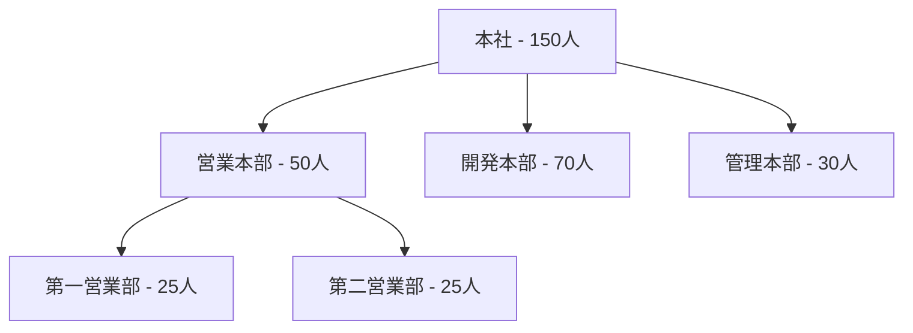

# OP-002: 組織階層を可視化する

**作成日**: 2025-10-31
**所属L3**: L3-001-organization-design-and-structure: Organization Design And Structure
**所属BC**: BC-004: Organizational Structure & Governance
**V2移行元**: services/secure-access-service/capabilities/manage-organizational-structure/operations/visualize-organizational-hierarchy

---

## 📋 How: この操作の定義

### 操作の概要
組織の階層構造を視覚的に表現し、組織図として提供する。直感的な組織理解により、コミュニケーションとガバナンスを促進する。

### 実現する機能
- 組織図の動的生成
- 階層レベル別の表示切り替え
- 部門・チーム詳細情報の表示
- 組織図のエクスポート機能

### 入力
- 組織構造データ
- 表示レベルの指定
- フィルタ条件
- 表示形式の設定

### 出力
- 組織図（ツリー形式）
- 部門・チーム詳細情報
- エクスポートファイル（PDF、画像等）
- 組織統計情報

---

## 📥 入力パラメータ

| パラメータ名 | 型 | 必須 | デフォルト | バリデーション | 説明 |
|-------------|-----|------|-----------|--------------|------|
| organizationId | UUID | Yes | - | UUID形式 | 組織ID |
| displayLevel | Integer | No | null | 0-10、null=全階層 | 表示階層レベル |
| unitTypeFilter | Array<Enum> | No | [] | division/department/section/team | 表示単位タイプフィルタ |
| includeMembers | Boolean | No | false | true/false | メンバー情報含める |
| includeMemberCount | Boolean | No | true | true/false | メンバー数表示 |
| startUnitId | UUID | No | null | UUID形式 | 開始単位ID（部分ツリー表示） |
| format | Enum | Yes | - | tree/list/json/mermaid | 出力形式 |
| exportFormat | Enum | No | null | pdf/png/svg/json | エクスポート形式 |
| userId | UUID | Yes | - | UUID形式、BC-003 User参照 | リクエストユーザーID |

### バリデーションルール
1. **organizationId**: 存在する組織、かつActive状態であること
2. **displayLevel**: 0-10の範囲、nullは全階層表示
3. **startUnitId**: 指定する場合、organizationId配下の単位であること
4. **unitTypeFilter**: 空配列は全タイプ表示
5. **userId**: BC-003のUserエンティティが存在し、組織へのアクセス権限を持つこと
6. **format**: tree（デフォルト）、list（フラットリスト）、json（API用）、mermaid（図表生成）
7. **exportFormat**: 指定時にファイル生成、nullは画面表示のみ

## 📤 出力仕様

### 成功レスポンス
**HTTP 200 OK**
```json
{
  "organizationId": "uuid",
  "organizationName": "本社",
  "rootUnitId": "uuid",
  "displayLevel": 3,
  "totalUnits": 25,
  "displayedUnits": 18,
  "hierarchyTree": {
    "unitId": "uuid",
    "unitName": "本社",
    "unitType": "root",
    "hierarchyLevel": 0,
    "path": "/本社",
    "memberCount": 150,
    "children": [
      {
        "unitId": "uuid",
        "unitName": "営業本部",
        "unitType": "division",
        "hierarchyLevel": 1,
        "path": "/本社/営業本部",
        "memberCount": 50,
        "children": [...]
      }
    ]
  },
  "statistics": {
    "totalMembers": 150,
    "unitsByType": {
      "division": 3,
      "department": 8,
      "section": 14
    },
    "maxDepth": 4,
    "avgMembersPerUnit": 6.0
  },
  "exportUrl": "https://example.com/exports/org-chart-uuid.pdf",
  "generatedAt": "2025-11-04T10:00:00Z"
}
```

### Mermaid形式出力例


### エラーレスポンス

#### HTTP 400 Bad Request
- **ERR_BC004_L3001_OP002_001**: organizationIdが不正（UUID形式エラー）
- **ERR_BC004_L3001_OP002_002**: displayLevelが範囲外（0-10）
- **ERR_BC004_L3001_OP002_003**: unitTypeFilterに不正な値
- **ERR_BC004_L3001_OP002_004**: formatが不正（未定義の形式）
- **ERR_BC004_L3001_OP002_005**: exportFormatが不正

#### HTTP 403 Forbidden
- **ERR_BC004_L3001_OP002_403**: 組織へのアクセス権限がありません

#### HTTP 404 Not Found
- **ERR_BC004_L3001_OP002_404_01**: 組織が存在しません
- **ERR_BC004_L3001_OP002_404_02**: startUnitIdの単位が存在しません

#### HTTP 500 Internal Server Error
- **ERR_BC004_L3001_OP002_500**: 組織図生成中にシステムエラー（ログ参照）

## 🛠️ 実装ガイダンス

### 使用ドメインコンポーネント

#### Aggregate
- **OrganizationUnit Aggregate**: 組織単位の階層読み取り
  - 参照: [../../../../domain/README.md#organizationunit-aggregate](../../../../domain/README.md#organizationunit-aggregate)
  - 集約ルート: OrganizationUnit
  - 包含エンティティ: OrganizationMember（includeMembers=true時）

#### ドメインメソッド
```typescript
// ルート単位取得
const rootUnit = await OrganizationUnit.findByOrganizationId(organizationId);

// 階層ツリー取得
const hierarchyTree = await OrganizationHierarchyService.getHierarchyTree(
  rootUnit.id,
  displayLevel
);

// 統計情報計算
const stats = await OrganizationHierarchyService.calculateStatistics(
  organizationId
);
```

#### ドメインサービス
- **OrganizationHierarchyService.getHierarchyTree()**: 階層ツリー取得（再帰、N+1防止）
- **OrganizationHierarchyService.getDescendants()**: 全子孫取得（閉包テーブル活用）
- **OrganizationHierarchyService.calculateStatistics()**: 統計情報計算
- **OrganizationChartService.generateMermaidDiagram()**: Mermaid図表生成
- **OrganizationChartService.exportToPDF()**: PDF変換

### パフォーマンス最適化
- **N+1問題対策**: 閉包テーブルで一括クエリ、階層レベル制限
- **キャッシュ戦略**:
  - 組織ツリー構造: Redis、TTL=1時間
  - メンバー数: Redis、TTL=10分
  - エクスポートファイル: S3、TTL=24時間
- **ページング**: displayLevel制限、1000単位以上は警告

### トランザクション境界
- **読み取り専用**: トランザクション不要（READ UNCOMMITTED）
- **同時実行制御**: 楽観的ロック不要（参照のみ）

### 副作用
- **ドメインイベント発行**: なし（読み取り操作）
- **通知**: なし
- **外部システム連携**:
  - **exportFormat指定時**: S3へファイルアップロード
  - **Mermaid形式**: Mermaid Live Editorへのリンク生成

### BC間連携
- **BC-003依存**: Userエンティティ参照（アクセス権限検証）
- **BC-005参照**: チーム情報の付加表示（オプション）

### 実装手順
1. ユーザー権限確認（BC-003、組織へのREAD権限）
2. 組織存在確認
3. startUnitId検証（指定時）
4. ルート単位取得
5. 階層ツリー構築
   - 閉包テーブルで全関係取得
   - displayLevel適用
   - unitTypeFilter適用
6. メンバー情報付加（includeMembers=true時）
7. 統計情報計算
8. 形式変換（format指定に応じて）
9. エクスポートファイル生成（exportFormat指定時）
10. レスポンス返却

## ⚠️ エラー処理プロトコル

### エラーコード一覧

| コード | HTTPステータス | 説明 | リトライ可否 |
|--------|---------------|------|-------------|
| ERR_BC004_L3001_OP002_001 | 400 | organizationId形式エラー | No |
| ERR_BC004_L3001_OP002_002 | 400 | displayLevel範囲外 | No |
| ERR_BC004_L3001_OP002_003 | 400 | unitTypeFilter不正 | No |
| ERR_BC004_L3001_OP002_004 | 400 | format不正 | No |
| ERR_BC004_L3001_OP002_005 | 400 | exportFormat不正 | No |
| ERR_BC004_L3001_OP002_403 | 403 | アクセス権限なし | No |
| ERR_BC004_L3001_OP002_404_01 | 404 | 組織不存在 | No |
| ERR_BC004_L3001_OP002_404_02 | 404 | 開始単位不存在 | No |
| ERR_BC004_L3001_OP002_500 | 500 | システムエラー | Yes |

### リトライ戦略
- **リトライ可能エラー**: ERR_BC004_L3001_OP002_500（システムエラーのみ）
- **リトライ回数**: 3回
- **バックオフ**: Exponential (1s, 2s, 4s)（読み取りのため短縮）
- **リトライ不可エラー**: バリデーションエラー（400系）、権限エラー（403）

### キャッシュ無効化
- **組織構造変更時**: OrganizationUnitCreated/Updated/Deletedイベントでキャッシュクリア
- **メンバー変更時**: MemberAdded/Removedイベントでメンバーカウントキャッシュクリア

### ログ記録要件
- **INFO**: 組織図取得成功（organizationId, displayLevel, 表示単位数記録）
- **WARN**: 大規模組織警告（1000単位以上）、深い階層警告（8階層以上）
- **ERROR**: システムエラー（スタックトレース、入力パラメータ全量記録）
- **監査ログ**: 組織図アクセス記録（BC-003経由、アクセス時刻・ユーザー記録）

### パフォーマンス監視
- **レスポンスタイム**: 95パーセンタイル < 500ms
- **キャッシュヒット率**: > 80%
- **エクスポート生成時間**: < 5秒（1000単位まで）

---

## 🔗 設計参照

### ドメインモデル
参照: [../../../../domain/README.md](../../../../domain/README.md)

この操作に関連するドメインエンティティ、値オブジェクト、集約の詳細定義は、上記ドメインモデルドキュメントを参照してください。

### API仕様
参照: [../../../../api/README.md](../../../../api/README.md)

この操作を実現するAPIエンドポイント、リクエスト/レスポンス形式、認証・認可要件は、上記API仕様ドキュメントを参照してください。

### データモデル
参照: [../../../../data/README.md](../../../../data/README.md)

この操作が扱うデータ構造、永続化要件、データ整合性制約は、上記データモデルドキュメントを参照してください。

---

## 🎬 UseCases: この操作を実装するユースケース

| UseCase | 説明 | Page | V2移行元 |
|---------|------|------|---------|
| (Phase 4で作成) | - | - | - |

詳細: [usecases/](usecases/)

> **注記**: ユースケースは Phase 4 の実装フェーズで、V2構造から段階的に移行・作成されます。
>
> **Phase 3 (現在)**: Operation構造とREADME作成
> **Phase 4 (次)**: UseCase定義とページ定義の移行
> **Phase 5**: API実装とテストコード

---

## 🔗 V2構造への参照

> ⚠️ **移行のお知らせ**: この操作はV2構造から移行中です。
>
> **V2参照先（参照のみ）**:
> - [services/secure-access-service/capabilities/manage-organizational-structure/operations/visualize-organizational-hierarchy/](../../../../../../../services/secure-access-service/capabilities/manage-organizational-structure/operations/visualize-organizational-hierarchy/)
>
> **移行方針**:
> - V2ディレクトリは読み取り専用として保持
> - 新規開発・更新はすべてV3構造で実施
> - V2への変更は禁止（参照のみ許可）

---

## 📝 更新履歴

| 日付 | 更新内容 | 更新者 |
|------|---------|--------|
| 2025-10-31 | OP-002 README初版作成（Phase 3） | Claude |

---

**ステータス**: Phase 3 - Operation構造作成完了
**次のアクション**: UseCaseディレクトリの作成と移行（Phase 4）
**管理**: [MIGRATION_STATUS.md](../../../../MIGRATION_STATUS.md)
