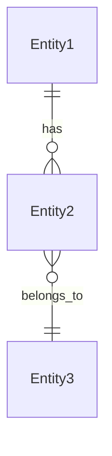
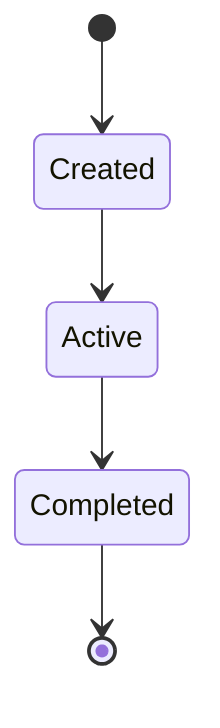
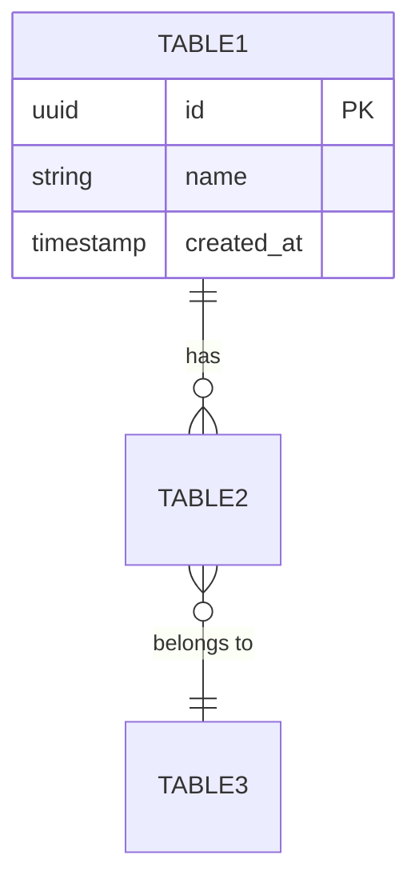

# Issue #192 実装計画書
# V3構造ドキュメント整備・品質向上プロジェクト

**作成日**: 2025-10-31
**Issue**: #192
**担当ブランチ**: claude/issue-192-011CUespW9Apa68zowZAWwpJ

---

## 📊 プロジェクト概要

### 目的
V3構造（business-capabilities/）の3つのアーキテクチャ層（BC、L3、Operation）のドキュメントを充実させ、開発者が効果的に活用できる品質を実現する。

### スコープ
- **BC層（7個）**: domain/api/data の詳細仕様化
- **L3層（22個）**: 実装アプローチ・前提条件・制約の明確化
- **Operation層（64個）**: パラメータ・出力・実装ガイド・エラー処理の具体化

### 成功基準
- **定量目標**:
  - ✅ BC層: domain/api/data 全セクション100%完成（21ファイル）
  - ✅ L3層: 詳細README 100%完成（22ファイル）
  - ✅ Operation層: 詳細README 100%完成（64ファイル）
  - ✅ Issue #146準拠: WHAT/HOW分離100%
  - ✅ 相互参照リンク: 正常動作100%

- **定性目標**:
  - 新規参加者が各層の責務を理解できる
  - ドキュメントのみから実装を開始できる
  - V2からの移行経路が明確

---

## 📋 現状分析

### 構造完成度: 95%
- ✅ 7 BC × 3サブディレクトリ = 21ディレクトリ完成
- ✅ 22 L3 Capability ディレクトリ完成
- ✅ 64 Operation ディレクトリ完成
- ✅ 114 README.mdファイル作成済み

### ドキュメント品質: 40%（改善が必要）

#### BC層（domain/api/data）: 50%
**現状**:
- ✅ 基本構造とテンプレート完成
- ✅ 主要エンティティ・API・テーブル定義の骨子
- ❌ 詳細な集約設計（不変条件、ドメインイベント）
- ❌ 完全なAPI仕様（スキーマ、エラーコード、認証）
- ❌ ERダイアグラム、インデックス戦略、データ制約

**改善内容**:
1. **domain/README.md** 強化:
   - 集約の詳細な不変条件・ビジネスルール
   - ドメインイベント定義
   - エンティティ間のリレーションシップ詳細
   - ライフサイクル・状態遷移図

2. **api/README.md** 強化:
   - 完全なリクエスト/レスポンススキーマ
   - エラーコード一覧と対処法
   - 認証・認可要件の詳細
   - レート制限・SLA定義
   - BC間連携API仕様

3. **data/README.md** 強化:
   - ERダイアグラム（Mermaid形式）
   - 詳細な制約（CHECK、トリガー、ストアドプロシージャ）
   - インデックス戦略（B-tree、GIN、パフォーマンス考慮）
   - データ移行戦略・バックアップ要件

#### L3層: 45%
**現状**:
- ✅ 能力定義（What）完成
- ✅ BC設計への参照リンク
- ⚠️ 実装アプローチが簡潔すぎる
- ❌ 前提条件・制約の詳細
- ❌ 具体的な実装ガイダンス

**改善内容**:
1. **実装アプローチ** セクション追加:
   - 技術的実現方法（アルゴリズム、パターン）
   - 推奨ライブラリ・フレームワーク
   - パフォーマンス考慮事項

2. **前提条件と制約** セクション追加:
   - 必要なBC間連携
   - データ整合性要件
   - スケーラビリティ制約
   - セキュリティ要件

3. **BC設計との統合** セクション強化:
   - 使用するドメインオブジェクトの明示
   - 呼び出すAPIの具体例
   - データアクセスパターン

#### Operation層: 30%（最も改善が必要）
**現状**:
- ✅ 基本テンプレート完成
- ❌ 操作内容が汎用的すぎる
- ❌ パラメータ仕様が不明確
- ❌ 出力仕様が不十分
- ❌ エラー処理が未定義

**改善内容**:
1. **パラメータ仕様** セクション追加:
   ```markdown
   ### 入力パラメータ
   | パラメータ名 | 型 | 必須 | デフォルト | バリデーション | 説明 |
   |-------------|-----|------|-----------|--------------|------|
   | projectId | UUID | Yes | - | UUID形式 | 対象プロジェクトID |
   | taskName | String | Yes | - | 1-200文字 | タスク名 |
   | priority | Enum | No | 'medium' | high/medium/low | 優先度 |
   ```

2. **出力仕様** セクション追加:
   ```markdown
   ### 成功レスポンス
   - **HTTP 200 OK**
   - Body: { taskId: UUID, createdAt: Timestamp, ... }

   ### エラーレスポンス
   - **HTTP 400**: バリデーションエラー
   - **HTTP 404**: プロジェクト未存在
   - **HTTP 409**: タスク名重複
   ```

3. **実装ガイダンス** セクション追加:
   - 使用するドメインモデル（Aggregate指定）
   - 呼び出すドメインメソッド
   - トランザクション境界
   - 副作用（イベント発行、通知など）

4. **エラー処理プロトコル** セクション追加:
   - エラーコード一覧
   - リトライ戦略
   - ロールバック手順
   - ログ記録要件

---

## 🎯 実装戦略

### フェーズ別アプローチ

#### Phase 1: BC-001 プロトタイプ強化（1 BC × 3 = 3ファイル）
**目的**: 最初のBCを完璧に仕上げ、テンプレート化

**対象**:
- BC-001/domain/README.md
- BC-001/api/README.md
- BC-001/data/README.md

**成果物**:
- 詳細な集約設計（不変条件、ドメインイベント、リレーションシップ）
- 完全なAPI仕様（スキーマ、エラーコード、認証、SLA）
- ERダイアグラム、インデックス戦略、制約定義

**時間見積**: 2-3時間

---

#### Phase 2: 残り6 BC強化（6 BC × 3 = 18ファイル）
**目的**: BC-001のテンプレートを適用

**対象**:
- BC-002/domain,api,data/README.md（Financial Health & Profitability）
- BC-003/domain,api,data/README.md（Access Control & Security）
- BC-004/domain,api,data/README.md（Organizational Structure & Governance）
- BC-005/domain,api,data/README.md（Team & Resource Optimization）
- BC-006/domain,api,data/README.md（Knowledge Management & Learning）
- BC-007/domain,api,data/README.md（Team Communication & Collaboration）

**戦略**:
- BC-001のセクション構造を再利用
- 各BCのドメイン特性に応じてカスタマイズ
- BC間連携APIを明確化

**時間見積**: 4-5時間

---

#### Phase 3: 全22 L3強化
**目的**: 実装アプローチと前提条件の明確化

**対象**: 全22 L3 Capability README.md

**強化内容**:
1. **実装アプローチ** セクション追加
2. **前提条件と制約** セクション追加
3. **BC設計との統合** セクション強化
4. BC domain/api/data への具体的参照

**BC別 L3数**:
- BC-001: 5 L3s
- BC-002: 4 L3s
- BC-003: 3 L3s
- BC-004: 1 L3
- BC-005: 4 L3s
- BC-006: 2 L3s
- BC-007: 3 L3s

**時間見積**: 5-6時間

---

#### Phase 4: 全64 Operation強化
**目的**: 実装可能な詳細仕様の提供

**対象**: 全64 Operation README.md

**強化内容**:
1. **パラメータ仕様** セクション（型、バリデーション、デフォルト）
2. **出力仕様** セクション（成功/失敗シナリオ）
3. **実装ガイダンス** セクション（使用ドメインコンポーネント）
4. **エラー処理プロトコル** セクション

**BC別 Operation数**:
- BC-001: 13 operations
- BC-002: 14 operations
- BC-003: 9 operations
- BC-004: 3 operations
- BC-005: 15 operations
- BC-006: 6 operations
- BC-007: 4 operations

**時間見積**: 8-10時間

---

#### Phase 5: 相互参照とコンプライアンス検証
**目的**: 一貫性とIssue #146準拠の確認

**タスク**:
1. 全相互参照リンクの検証（動作確認）
2. Issue #146 WHAT/HOW分離の検証
3. BC→L3→Operation の情報連携確認
4. 用語統一チェック（Parasol言語、英語名、日本語名）
5. サンプルコードの一貫性確認

**時間見積**: 2-3時間

---

## 📝 ドキュメントテンプレート

### BC層: domain/README.md テンプレート

```markdown
# BC-XXX: ドメイン設計

## 概要
[BCのドメインモデル概要]

## 主要集約（Aggregates）

### [Aggregate名] Aggregate
**集約ルート**: [Entity名]
- **責務**: [集約の責務]
- **包含エンティティ**: [含まれるエンティティ一覧]
- **不変条件**:
  - [ビジネスルール1]
  - [ビジネスルール2]
- **ドメインイベント**:
  - `[EventName]`: [発生タイミング]

## エンティティ間リレーションシップ



## ライフサイクルと状態遷移

### [Entity名] ライフサイクル



## ドメインイベント定義

### [EventName]
- **発行タイミング**: [いつ発行されるか]
- **ペイロード**: { field1: Type, field2: Type }
- **サブスクライバ**: [どのBCが購読するか]
```

### BC層: api/README.md テンプレート

```markdown
# BC-XXX: API設計

## 概要
[API概要 - Issue #146 WHAT層]

## 主要APIエンドポイント

### [Resource名] API

#### POST /api/bc-xxx/[resource]
**説明**: [エンドポイントの目的]

**リクエスト**:
```json
{
  "field1": "string",
  "field2": 123
}
```

**レスポンス（成功）**:
- HTTP 201 Created
```json
{
  "id": "uuid",
  "field1": "string",
  "createdAt": "timestamp"
}
```

**エラーレスポンス**:
- HTTP 400: バリデーションエラー
  - `ERR_BC001_001`: field1が必須
  - `ERR_BC001_002`: field2が範囲外
- HTTP 401: 認証エラー
- HTTP 403: 認可エラー

**認証**: Bearer Token必須
**権限**: [必要な権限]
**レート制限**: 100 req/min

## BC間連携API

### BC-XXX → BC-YYY
- **エンドポイント**: POST /api/bc-yyy/[resource]
- **目的**: [連携の目的]
- **データフロー**: [データの流れ]

## API SLA

- **可用性**: 99.9%
- **レスポンスタイム**: p95 < 200ms
- **エラー率**: < 0.1%
```

### BC層: data/README.md テンプレート

```markdown
# BC-XXX: データ設計

## 概要
[データモデル概要]

## ERダイアグラム



## テーブル定義

### [table_name]
[テーブルの説明]

| カラム | 型 | 制約 | 説明 |
|--------|-----|------|------|
| id | UUID | PK | 主キー |
| name | VARCHAR(200) | NOT NULL, UNIQUE | 名前 |

**インデックス**:
- `idx_[table]_[column]` (B-tree): [目的]
- `idx_[table]_[column]_gin` (GIN): [目的 - 全文検索など]

**制約**:
```sql
ALTER TABLE [table_name]
ADD CONSTRAINT chk_[constraint_name]
CHECK ([condition]);
```

**トリガー**:
- `trg_[table]_audit`: 監査ログ記録

## データ移行戦略

### V2からの移行
- **移行元テーブル**: [V2テーブル名]
- **マッピング**: [カラム対応]
- **データ変換**: [必要な変換処理]

## バックアップ・リカバリ

- **バックアップ頻度**: 日次
- **保持期間**: 30日
- **RPO**: 1時間
- **RTO**: 4時間
```

### L3層 README.md 強化テンプレート

```markdown
# L3-XXX: [Capability Name]

## 📋 What: この能力の定義
[既存セクション保持]

## 🔗 BC設計の参照（How）
[既存セクション保持]

## 🛠️ 実装アプローチ

### 技術的実現方法
- **アルゴリズム**: [使用するアルゴリズム]
- **デザインパターン**: [適用パターン]
- **推奨ライブラリ**: [使用ライブラリ]

### パフォーマンス考慮事項
- **スケーラビリティ**: [スケール戦略]
- **キャッシュ戦略**: [キャッシュ方法]
- **最適化ポイント**: [最適化箇所]

## ⚠️ 前提条件と制約

### BC間連携
- **依存BC**: BC-XXX ([理由])
- **連携API**: [使用するAPI]

### データ整合性要件
- **トランザクション境界**: [範囲]
- **整合性レベル**: [強い/結果整合性]

### セキュリティ要件
- **認証**: [認証方法]
- **認可**: [必要な権限]
- **データ保護**: [暗号化など]

### スケーラビリティ制約
- **最大同時処理**: [件数]
- **データ量上限**: [サイズ]

## 🔗 BC設計との統合

### 使用ドメインオブジェクト
- **Aggregate**: [Aggregate名]（[../../../../domain/README.md#aggregate-name]）
- **Entity**: [Entity名]
- **Value Object**: [VO名]

### 呼び出すAPI例
```
POST /api/bc-xxx/[resource]
Body: { ... }
```

### データアクセスパターン
- **読み取り**: [テーブル名], [インデックス使用]
- **書き込み**: [テーブル名], [トランザクション]

## ⚙️ Operations: この能力を実現する操作
[既存セクション保持]
```

### Operation層 README.md 強化テンプレート

```markdown
# OP-XXX: [Operation Name]

## 📋 How: この操作の定義
[既存概要保持]

## 📥 入力パラメータ

| パラメータ名 | 型 | 必須 | デフォルト | バリデーション | 説明 |
|-------------|-----|------|-----------|--------------|------|
| [param1] | UUID | Yes | - | UUID形式 | [説明] |
| [param2] | String | Yes | - | 1-200文字 | [説明] |
| [param3] | Enum | No | 'default' | value1/value2 | [説明] |

### バリデーションルール
1. **[param1]**: [詳細な検証ルール]
2. **[param2]**: [詳細な検証ルール]

## 📤 出力仕様

### 成功レスポンス
**HTTP 200 OK** / **HTTP 201 Created**
```json
{
  "id": "uuid",
  "field1": "value",
  "createdAt": "timestamp"
}
```

### エラーレスポンス

#### HTTP 400 Bad Request
- **ERR_OP_001**: [param1]が不正（原因と対処法）
- **ERR_OP_002**: [param2]がバリデーションエラー

#### HTTP 404 Not Found
- **ERR_OP_404**: リソースが存在しません

#### HTTP 409 Conflict
- **ERR_OP_409**: [競合理由]

#### HTTP 500 Internal Server Error
- **ERR_OP_500**: システムエラー（ログ参照）

## 🛠️ 実装ガイダンス

### 使用ドメインコンポーネント

#### Aggregate
- **[AggregateName]**: [使用目的]
  - 参照: [../../../../domain/README.md#aggregate-name]

#### ドメインメソッド
```typescript
// 呼び出すメソッド例
aggregate.methodName(param1, param2);
```

### トランザクション境界
- **開始**: [開始タイミング]
- **コミット**: [コミット条件]
- **ロールバック**: [ロールバック条件]

### 副作用
- **ドメインイベント発行**: `[EventName]`
- **通知**: [誰に何を通知]
- **外部システム連携**: [連携先と内容]

### 実装手順
1. [ステップ1]
2. [ステップ2]
3. [ステップ3]

## ⚠️ エラー処理プロトコル

### エラーコード一覧

| コード | HTTPステータス | 説明 | リトライ可否 |
|--------|---------------|------|-------------|
| ERR_OP_001 | 400 | [説明] | No |
| ERR_OP_404 | 404 | [説明] | No |
| ERR_OP_500 | 500 | [説明] | Yes |

### リトライ戦略
- **リトライ可能エラー**: ERR_OP_500, ERR_OP_503
- **リトライ回数**: 3回
- **バックオフ**: Exponential (2s, 4s, 8s)

### ロールバック手順
1. [ロールバック手順1]
2. [ロールバック手順2]

### ログ記録要件
- **INFO**: 正常実行時
- **WARN**: リトライ発生時
- **ERROR**: エラー発生時（スタックトレース含む）

## 🔗 設計参照
[既存セクション保持]

## 🎬 UseCases: この操作を実装するユースケース
[既存セクション保持]
```

---

## 📊 進捗トラッキング

### Phase 1: BC-001 プロトタイプ（3ファイル）
- [ ] BC-001/domain/README.md 強化
- [ ] BC-001/api/README.md 強化
- [ ] BC-001/data/README.md 強化

### Phase 2: 残り6 BC（18ファイル）
- [ ] BC-002/domain,api,data/README.md（3ファイル）
- [ ] BC-003/domain,api,data/README.md（3ファイル）
- [ ] BC-004/domain,api,data/README.md（3ファイル）
- [ ] BC-005/domain,api,data/README.md（3ファイル）
- [ ] BC-006/domain,api,data/README.md（3ファイル）
- [ ] BC-007/domain,api,data/README.md（3ファイル）

### Phase 3: L3強化（22ファイル）
- [ ] BC-001: 5 L3s
- [ ] BC-002: 4 L3s
- [ ] BC-003: 3 L3s
- [ ] BC-004: 1 L3
- [ ] BC-005: 4 L3s
- [ ] BC-006: 2 L3s
- [ ] BC-007: 3 L3s

### Phase 4: Operation強化（64ファイル）
- [ ] BC-001: 13 operations
- [ ] BC-002: 14 operations
- [ ] BC-003: 9 operations
- [ ] BC-004: 3 operations
- [ ] BC-005: 15 operations
- [ ] BC-006: 6 operations
- [ ] BC-007: 4 operations

### Phase 5: 検証（検証タスク）
- [ ] 相互参照リンク動作確認
- [ ] Issue #146 WHAT/HOW分離検証
- [ ] 用語統一チェック
- [ ] サンプルコード一貫性確認

---

## 📈 メトリクス

### 作業見積
- **Phase 1**: 2-3時間（3ファイル）
- **Phase 2**: 4-5時間（18ファイル）
- **Phase 3**: 5-6時間（22ファイル）
- **Phase 4**: 8-10時間（64ファイル）
- **Phase 5**: 2-3時間（検証）
- **合計**: 21-27時間（107ファイル更新）

### 品質目標
- **ドキュメントカバレッジ**: 100%（107/107ファイル）
- **詳細度**: 各ファイル平均200-500行（現在50-100行）
- **Issue #146準拠**: 100%
- **相互参照リンク**: 100%動作

---

## 🔄 V2参照と移行戦略

### V2アーカイブの役割
- **読み取り専用**: 参考資料として保持
- **移行元明示**: 各ドキュメントに移行元パス記載
- **更新禁止**: V2への変更は一切禁止

### V3への移行方針
- **情報の充実化**: V2の内容を拡張・詳細化
- **構造の統一**: BC/L3/Operation 3層構造に整理
- **WHAT/HOW分離**: Issue #146原則の適用

---

## ✅ 完了条件

### Must Have
1. ✅ 107ファイル全てが詳細化完了
2. ✅ Issue #146 WHAT/HOW分離100%準拠
3. ✅ 相互参照リンク全て動作
4. ✅ テンプレート項目全て記入

### Should Have
1. ✅ ERダイアグラム（Mermaid）全BCに追加
2. ✅ エラーコード体系統一
3. ✅ サンプルコード追加

### Nice to Have
1. 実装サンプルコード（TypeScript/Python）
2. API使用例（curl/Postman）
3. データマイグレーションスクリプト

---

## 📚 参考資料

- **Issue #192**: https://github.com/hmoriya/consultingTool/issues/192
- **Issue #146**: https://github.com/hmoriya/consultingTool/issues/146（WHAT/HOW分離原則）
- **V2アーカイブ**: consulting-dashboard-new/docs/parasol/services/
- **V3構造**: consulting-dashboard-new/docs/parasol/business-capabilities/

---

## 📝 変更履歴

| 日付 | バージョン | 変更内容 |
|------|-----------|---------|
| 2025-10-31 | 1.0 | 初版作成 |

---

**次のアクション**: Phase 1開始 - BC-001のdomain/api/data強化
